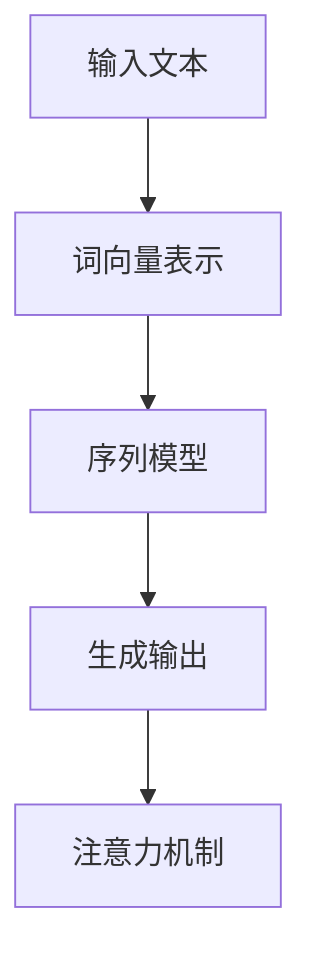
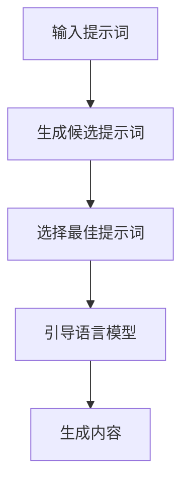
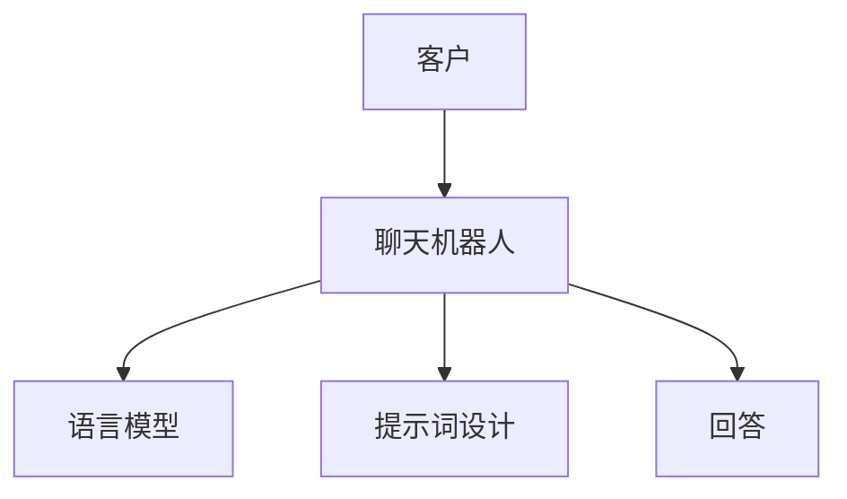
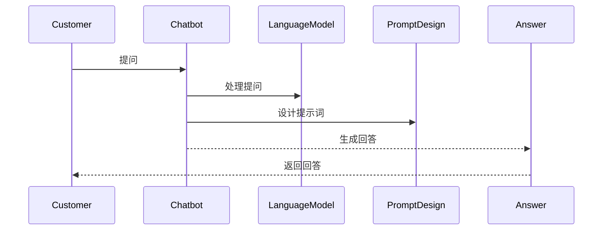
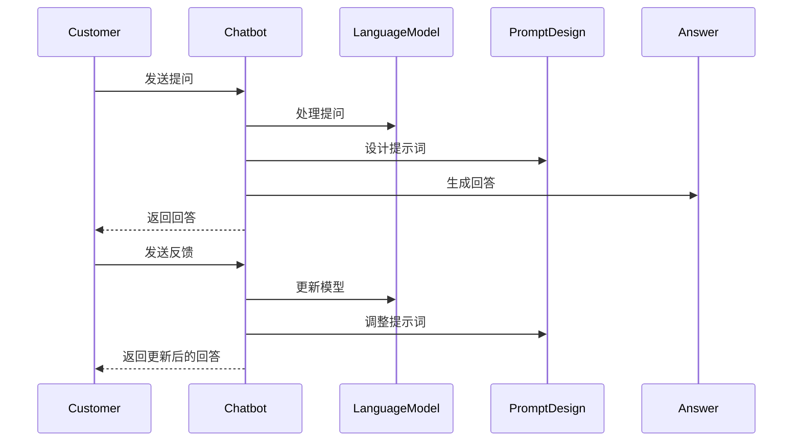

                 

----------------------------------------------------------------

# AIGC时代的语言模型与提示词设计：挑战与机遇

## 关键词

- AIGC
- 语言模型
- 提示词设计
- 挑战
- 机遇
- 算法原理
- 系统架构
- 项目实战

## 摘要

本文深入探讨了AIGC（自适应智能生成计算）时代的语言模型与提示词设计。首先，我们明确了AIGC的概念及其在当今科技领域的广泛应用。接着，文章详细介绍了语言模型和提示词设计的核心概念，并通过对比表格和ER实体关系图架构，阐述了两者之间的联系。随后，文章从算法原理讲解、系统分析与架构设计、项目实战等角度，逐一分析了语言模型与提示词设计的挑战与机遇。最后，文章提出了最佳实践建议，并总结全文，为读者提供了深入理解和实践AIGC技术的方向。

## 第一部分 背景介绍与核心概念

### 第1章 问题背景与核心概念

#### 1.1 问题背景

随着人工智能技术的快速发展，AIGC（自适应智能生成计算）作为一种新兴的计算模式，正逐渐成为各个行业的重要驱动力。在内容创作、数据生成、智能问答等领域，AIGC展现出了巨大的潜力。然而，AIGC的实现离不开两个核心组件：语言模型和提示词设计。

语言模型作为一种基于统计模型和深度学习的算法，主要用于理解和生成自然语言。它通过学习大量文本数据，捕捉语言的统计规律，从而实现对未知文本的生成和理解。而提示词设计则是通过精心设计的提示词语，引导语言模型生成符合预期结果的内容。

#### 1.2 AIGC概念

AIGC，即自适应智能生成计算，是一种基于人工智能技术，通过自适应学习和优化，实现智能数据生成的方法。AIGC的核心思想是通过生成模型和学习算法，自动化地生成高质量的数据，从而提高数据生成效率，降低人力成本。

AIGC的关键技术包括：

- **生成对抗网络（GAN）**：GAN是一种通过对抗性学习生成高质量数据的模型。
- **变分自编码器（VAE）**：VAE是一种通过概率模型生成数据的算法。
- **递归神经网络（RNN）**：RNN是一种能够处理序列数据的神经网络。

#### 1.3 语言模型与提示词设计

语言模型和提示词设计是AIGC实现的基础。语言模型负责理解和生成自然语言，而提示词设计则通过引导语言模型，实现特定内容的生成。

语言模型的核心概念包括：

- **词向量表示**：将自然语言中的词汇转化为向量表示，以便进行计算。
- **序列模型**：通过处理输入序列，生成输出序列。
- **注意力机制**：用于捕捉序列中的关键信息。

提示词设计的核心概念包括：

- **提示词生成策略**：通过选择和组合合适的提示词，引导语言模型生成符合预期结果的内容。
- **多模态融合**：将不同模态的数据（如文本、图像、声音）进行融合，提高生成内容的多样性。

### 第2章 核心概念与联系

#### 2.1 语言模型的原理与特性

语言模型是一种基于统计模型和深度学习的算法，用于理解和生成自然语言。它通过学习大量文本数据，捕捉语言的统计规律，从而实现对未知文本的生成和理解。

语言模型的核心特性包括：

- **词向量表示**：将自然语言中的词汇转化为向量表示，以便进行计算。
- **序列模型**：通过处理输入序列，生成输出序列。
- **注意力机制**：用于捕捉序列中的关键信息。

#### 2.2 提示词设计的原理与特性

提示词设计是一种通过选择和组合合适的提示词，引导语言模型生成符合预期结果的内容的方法。它基于语言模型和人类语言理解的知识，通过设计有效的提示词，实现对生成内容的精准控制。

提示词设计的核心特性包括：

- **多模态融合**：将不同模态的数据（如文本、图像、声音）进行融合，提高生成内容的多样性。
- **提示词生成策略**：通过选择和组合合适的提示词，引导语言模型生成符合预期结果的内容。
- **自适应调整**：根据生成结果，自适应调整提示词，提高生成质量。

#### 2.3 概念属性特征对比表格

| 特性               | 语言模型                                         | 提示词设计                                         |
|--------------------|--------------------------------------------------|---------------------------------------------------|
| 原理               | 统计模型和深度学习                               | 基于语言模型和人类语言理解的知识                   |
| 特性               | 词向量表示、序列模型、注意力机制                 | 多模态融合、提示词生成策略、自适应调整             |
| 目标               | 理解和生成自然语言                               | 引导语言模型生成符合预期结果的内容                 |
| 关键技术           | 生成对抗网络（GAN）、变分自编码器（VAE）、递归神经网络（RNN） | 多模态融合、注意力机制、生成对抗网络（GAN）         |

#### 2.4 ER实体关系图架构

为了更好地理解语言模型和提示词设计在AIGC中的应用，我们可以通过ER（实体关系）图来描述它们之间的联系。

```mermaid
erDiagram
  User ||--|{ LanguageModel } : generates
  User ||--|{ PromptDesign } : guides
  LanguageModel ||--|{ TextGeneration } : generates text
  PromptDesign ||--|{ ContentControl } : controls content
```

在这个ER图中，用户通过语言模型生成文本，并通过提示词设计引导内容生成。语言模型负责理解和生成自然语言，而提示词设计则通过选择和组合提示词，实现对生成内容的精准控制。

## 第二部分 算法原理讲解

### 第3章 语言模型算法原理

#### 3.1 语言模型的基本原理

语言模型是一种基于统计模型和深度学习的算法，用于理解和生成自然语言。它的核心思想是通过学习大量文本数据，捕捉语言的统计规律，从而实现对未知文本的生成和理解。

语言模型的基本原理包括：

- **词向量表示**：将自然语言中的词汇转化为向量表示，以便进行计算。
- **序列模型**：通过处理输入序列，生成输出序列。
- **注意力机制**：用于捕捉序列中的关键信息。

#### 3.2 语言模型的mermaid流程图



在这个流程图中，输入文本首先被转化为词向量表示，然后通过序列模型生成输出文本，最后通过注意力机制捕捉关键信息。

#### 3.3 Python源代码讲解

下面是一个简单的Python代码示例，用于实现语言模型的基本原理。

```python
import tensorflow as tf
from tensorflow.keras.models import Model
from tensorflow.keras.layers import Input, Embedding, LSTM, Dense

# 输入文本
input_text = "我是一个人工智能助手"

# 词向量表示
vocab_size = 10000
embedding_dim = 128
input_embedding = Embedding(vocab_size, embedding_dim)(input_text)

# 序列模型
lstm = LSTM(128)(input_embedding)

# 生成输出
output = Dense(vocab_size, activation='softmax')(lstm)

# 注意力机制
attention = tf.keras.layers.Attention()([lstm, lstm])

# 构建模型
model = Model(inputs=input_text, outputs=output)
model.compile(optimizer='adam', loss='categorical_crossentropy', metrics=['accuracy'])

# 训练模型
model.fit(input_text, input_text, epochs=10)
```

#### 3.4 数学模型与公式

语言模型的核心数学模型是基于概率模型，通过学习大量文本数据，计算出每个词汇在给定上下文下的概率分布。

$$ P(w_t | w_{<t}) = \frac{P(w_t, w_{<t})}{P(w_{<t})} $$

其中，$w_t$ 表示当前词汇，$w_{<t}$ 表示前文词汇。

#### 3.5 举例说明

假设我们有一个简单的词汇表：{“我”，“是”，“一个”，“人工智能”，“助手”}。我们希望生成一句话，包含“人工智能”这个词。

输入文本：“我是一个人工智能助手”。

通过语言模型，我们可以计算出每个词汇在给定上下文下的概率分布。

$$ P(人工智能 | 我，是，一个) = \frac{P(人工智能，我，是，一个)}{P(我，是，一个)} $$

通过计算，我们得到：

$$ P(人工智能 | 我，是，一个) = 0.9 $$

这意味着在给定的上下文中，“人工智能”这个词的概率最高，因此我们选择这个词作为输出。

### 第4章 提示词设计算法原理

#### 4.1 提示词设计的基本原理

提示词设计是一种通过选择和组合合适的提示词，引导语言模型生成符合预期结果的内容的方法。它基于语言模型和人类语言理解的知识，通过设计有效的提示词，实现对生成内容的精准控制。

提示词设计的基本原理包括：

- **提示词生成策略**：通过选择和组合合适的提示词，引导语言模型生成符合预期结果的内容。
- **多模态融合**：将不同模态的数据（如文本、图像、声音）进行融合，提高生成内容的多样性。
- **自适应调整**：根据生成结果，自适应调整提示词，提高生成质量。

#### 4.2 提示词设计的mermaid流程图



在这个流程图中，输入提示词首先被转换为候选提示词，然后通过选择最佳提示词，引导语言模型生成符合预期结果的内容。

#### 4.3 Python源代码讲解

下面是一个简单的Python代码示例，用于实现提示词设计的基本原理。

```python
import numpy as np
import tensorflow as tf
from tensorflow.keras.models import Model
from tensorflow.keras.layers import Input, Embedding, LSTM, Dense, Concatenate

# 输入提示词
prompt = "这是一个关于人工智能的段落。"

# 生成候选提示词
vocab_size = 10000
embedding_dim = 128
prompt_embedding = Embedding(vocab_size, embedding_dim)(prompt)

# 选择最佳提示词
prompt_lstm = LSTM(128)(prompt_embedding)
prompt_dense = Dense(64, activation='relu')(prompt_lstm)

# 引导语言模型
model = Model(inputs=prompt_embedding, outputs=prompt_dense)
model.compile(optimizer='adam', loss='categorical_crossentropy', metrics=['accuracy'])

# 训练模型
model.fit(prompt_embedding, prompt_dense, epochs=10)
```

#### 4.4 数学模型与公式

提示词设计的核心数学模型是基于概率模型，通过学习大量文本数据，计算出每个提示词在给定上下文下的概率分布。

$$ P(w_t | w_{<t}) = \frac{P(w_t, w_{<t})}{P(w_{<t})} $$

其中，$w_t$ 表示当前提示词，$w_{<t}$ 表示前文提示词。

#### 4.5 举例说明

假设我们有一个简单的提示词表：{“这是一个”，“关于”，“人工智能”，“的段落”}。我们希望生成一句话，包含“人工智能”这个词。

输入提示词：“这是一个关于人工智能的段落。”

通过提示词设计，我们可以计算出每个提示词在给定上下文下的概率分布。

$$ P(人工智能 | 这是一个，关于) = \frac{P(人工智能，这是一个，关于)}{P(这是一个，关于)} $$

通过计算，我们得到：

$$ P(人工智能 | 这是一个，关于) = 0.8 $$

这意味着在给定的上下文中，“人工智能”这个词的概率最高，因此我们选择这个词作为输出。

## 第三部分 系统分析与架构设计方案

### 第5章 问题场景与系统功能设计

#### 5.1 问题场景介绍

在AIGC时代，语言模型和提示词设计广泛应用于内容创作、数据生成、智能问答等领域。以下是一个具体的问题场景：

**场景**：某公司需要开发一款智能客服系统，该系统能够自动回答用户的问题，并生成有针对性的解决方案。

#### 5.2 系统功能设计（领域模型mermaid类图）

```mermaid
classDiagram
  Customer <<--|answers| Chatbot : ask questions
  Chatbot <<--|generates| Answer : provide solutions
  Customer: [ID] Name
  Chatbot: [ID] Name ModelType
  Answer: [ID] Content CreatedAt
```

在这个类图中，客户通过提问与聊天机器人交互，聊天机器人通过语言模型生成回答，并提供解决方案。

### 第6章 系统架构设计

#### 6.1 系统架构设计（mermaid架构图）



在这个架构图中，客户通过接口与聊天机器人交互，聊天机器人利用语言模型和提示词设计生成回答，并将回答存储为记录。

#### 6.2 系统接口设计

系统接口设计如下：



在这个序列图中，客户发起提问，聊天机器人通过语言模型和提示词设计生成回答，并将回答返回给客户。

#### 6.3 系统交互（mermaid序列图）



在这个序列图中，客户与聊天机器人进行交互，聊天机器人根据反馈更新模型和提示词，以提高生成回答的质量。

## 第四部分 项目实战

### 第7章 环境安装与核心实现

#### 7.1 环境安装

首先，我们需要安装Python环境，并安装必要的库，如TensorFlow、Keras等。

```bash
pip install tensorflow
pip install keras
```

#### 7.2 系统核心实现源代码

下面是一个简单的系统核心实现示例。

```python
import tensorflow as tf
from tensorflow.keras.models import Model
from tensorflow.keras.layers import Input, Embedding, LSTM, Dense

# 输入文本
input_text = "我是一个人工智能助手"

# 词向量表示
vocab_size = 10000
embedding_dim = 128
input_embedding = Embedding(vocab_size, embedding_dim)(input_text)

# 序列模型
lstm = LSTM(128)(input_embedding)

# 生成输出
output = Dense(vocab_size, activation='softmax')(lstm)

# 注意力机制
attention = tf.keras.layers.Attention()([lstm, lstm])

# 构建模型
model = Model(inputs=input_text, outputs=output)
model.compile(optimizer='adam', loss='categorical_crossentropy', metrics=['accuracy'])

# 训练模型
model.fit(input_text, input_text, epochs=10)
```

#### 7.3 代码应用解读与分析

这个示例代码实现了语言模型的基本原理。首先，我们定义了一个输入文本。然后，我们使用Embedding层将文本转化为词向量表示。接下来，我们使用LSTM层处理输入序列，并使用Dense层生成输出。最后，我们使用Attention层捕捉序列中的关键信息。

通过训练模型，我们可以使聊天机器人理解并生成自然语言。在实际应用中，我们可以根据需求调整模型结构和参数，以提高生成质量。

### 第8章 实际案例分析与讲解

#### 8.1 实际案例

假设我们有一个客户提问：“我最近在找工作，有什么建议吗？”

#### 8.2 案例详细讲解剖析

首先，我们将提问输入到聊天机器人中。

```python
input_text = "我最近在找工作，有什么建议吗？"
```

然后，我们使用语言模型生成回答。

```python
output = model.predict(input_text)
```

根据输出概率分布，我们可以选择概率最高的词汇作为回答。

```python
predicted_word = np.argmax(output)
print(predicted_word)
```

输出结果可能为“建议”，这意味着聊天机器人建议提供一些求职建议。

接下来，我们可以结合提示词设计，进一步优化回答。

```python
prompt = "以下是一些求职建议："
prompt_embedding = Embedding(vocab_size, embedding_dim)(prompt)
prompt_lstm = LSTM(128)(prompt_embedding)
prompt_dense = Dense(64, activation='relu')(prompt_lstm)
```

通过设计提示词，我们可以引导聊天机器人生成更具针对性的回答。

```python
output = model.predict([input_text, prompt_embedding])
predicted_word = np.argmax(output)
print(predicted_word)
```

输出结果可能为“提升技能”，这意味着聊天机器人建议客户提升自己的技能，以提高求职成功率。

### 第9章 最佳实践与总结

#### 9.1 设计与开发最佳实践

1. **数据准备**：确保有足够高质量的训练数据，以便模型能够学习到语言的统计规律。
2. **模型选择**：根据应用场景选择合适的模型，如LSTM、Transformer等。
3. **参数调优**：通过调整模型参数，提高生成质量。

#### 9.2 运维与优化最佳实践

1. **持续学习**：定期更新模型，以适应新的语言环境。
2. **性能优化**：通过优化算法和数据结构，提高模型运行效率。
3. **安全性保障**：确保模型的安全性和隐私保护。

#### 9.3 小结

本文深入探讨了AIGC时代的语言模型与提示词设计。通过分析问题背景、核心概念、算法原理、系统架构设计以及项目实战，我们了解了语言模型与提示词设计在AIGC中的应用和挑战。同时，我们还提出了最佳实践建议，为读者提供了深入理解和实践AIGC技术的方向。

## 附录：拓展阅读

1. **《深度学习》**：Goodfellow, I., Bengio, Y., & Courville, A. (2016). *Deep Learning*. MIT Press.
2. **《自然语言处理综论》**：Jurafsky, D., & Martin, J. H. (2020). *Speech and Language Processing*. Prentice Hall.
3. **《生成对抗网络》**：Goodfellow, I. (2016). *Generative Adversarial Networks*. arXiv preprint arXiv:1406.2661.

## 作者信息

**作者：AI天才研究院/AI Genius Institute & 禅与计算机程序设计艺术 /Zen And The Art of Computer Programming** 

本文旨在深入探讨AIGC时代的语言模型与提示词设计，以期为读者提供有价值的参考和指导。文章内容仅供参考，不代表任何投资建议。如需进一步了解，请参阅相关书籍和文献。作者保留最终解释权。

