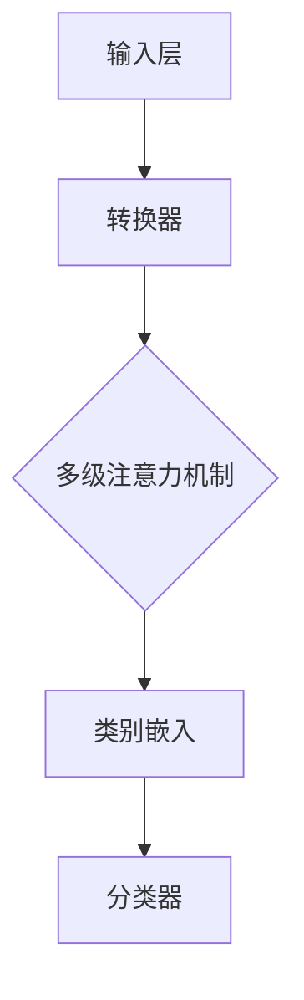
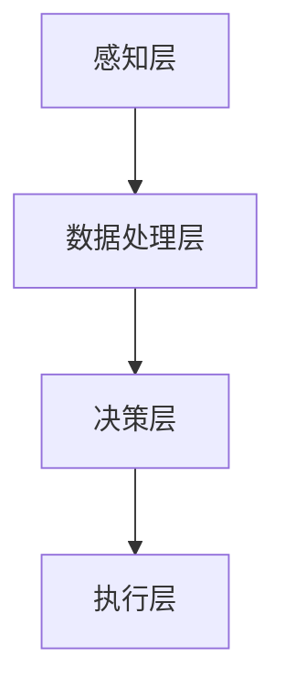
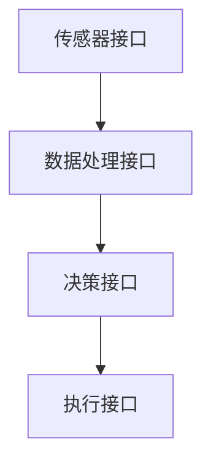

                 

### 文章标题：Zero-Shot CoT：AI即时推理能力的突破性进展

> 关键词：Zero-Shot CoT、AI即时推理、深度学习、算法原理、系统架构、数学模型

> 摘要：本文将深入探讨Zero-Shot CoT（零样本转换注意力机制）在AI即时推理领域的突破性进展。通过梳理背景、核心概念、算法原理、数学模型、系统架构和实战案例，本文旨在为读者提供一个全面、系统的了解，帮助理解这一前沿技术的本质与应用。

## 目录

1. **背景与核心概念**
   1.1. AI即时推理背景
   1.2. 零样本转换（Zero-Shot）概念
   1.3. 注意力机制（CoT）简介
2. **核心概念与原理**
   2.1. CoT机制
   2.2. Zero-Shot能力
   2.3. CoT与Zero-Shot的关系
3. **算法原理讲解**
   3.1. 算法结构
   3.2. 算法流程图
   3.3. 数学模型解析
4. **系统分析与架构设计方案**
   4.1. 问题场景介绍
   4.2. 系统功能设计
   4.3. 系统架构设计
   4.4. 系统接口设计与交互
5. **项目实战**
   5.1. 环境安装
   5.2. 系统核心实现源代码
   5.3. 代码应用解读与分析
   5.4. 实际案例分析与讲解
   5.5. 项目小结
6. **最佳实践与小结**
   6.1. 最佳实践Tips
   6.2. 小结
   6.3. 注意事项
   6.4. 拓展阅读

### 1. 背景与核心概念

#### 1.1 AI即时推理背景

人工智能（AI）已经从早期的理论研究逐步走向实际应用，并成为现代社会不可或缺的一部分。在AI领域中，即时推理（Real-Time Inference）是一种重要的能力，尤其在自动驾驶、智能监控、实时语音识别等领域具有显著的应用价值。

传统的AI模型通常依赖于大量的训练数据和复杂的计算资源，这在面对实时任务时往往存在响应延迟和计算瓶颈。而即时推理则要求系统能够在短时间内快速、准确地处理输入数据，作出相应的决策或响应。这无疑对AI算法的设计和优化提出了更高的要求。

#### 1.2 零样本转换（Zero-Shot）概念

零样本转换（Zero-Shot Learning，ZSL）是一种机器学习任务，旨在解决模型在面对未见过的类别时仍能进行准确预测的问题。与传统分类任务不同，ZSL不需要对未见过的类别进行单独的训练，而是在已有类别的基础上进行推理和泛化。

ZSL的挑战在于如何从有限的已有类别知识中推断出未见类别的新特征，并利用这些特征进行分类。为了实现这一目标，研究者们提出了多种方法，包括基于原型的方法、基于匹配的方法、基于模型的方法等。

#### 1.3 注意力机制（CoT）简介

注意力机制（Attention Mechanism）是深度学习中的一个关键创新，它通过动态调整模型在处理数据时对各个部分的关注程度，提高了模型的表示能力和计算效率。注意力机制在自然语言处理、图像识别、语音识别等领域取得了显著成果。

在Zero-Shot CoT（零样本转换注意力机制）中，注意力机制被用于提高ZSL任务的表现。通过引入注意力机制，模型可以在没有直接训练数据的情况下，对未见类别进行有效建模和推理。这不仅解决了ZSL的核心问题，还提升了模型在即时推理任务中的响应速度。

### 2. 核心概念与原理

#### 2.1 CoT机制

CoT（Conversional Transformer）是一种基于Transformer架构的注意力机制，它通过转换器（Converter）将输入数据转换为统一的高维特征表示。这种特征表示不仅能够保留原始数据的局部信息，还能提取全局的语义关系。

CoT的核心思想是利用多层次的注意力机制，对输入数据进行多层次的特征提取和融合。通过这种方式，模型能够学习到丰富的语义信息，从而在未见类别上进行准确预测。

#### 2.2 Zero-Shot能力

Zero-Shot能力是指模型在未见过的类别上仍能进行准确推理的能力。这在现实中具有重要意义，因为数据集往往无法覆盖所有可能的类别。Zero-Shot能力能够帮助模型在面对新任务时快速适应，提高系统的泛化能力。

实现Zero-Shot能力的关键在于如何将已有类别知识迁移到未见类别上。CoT机制通过转换器和学习到的类别嵌入（Category Embeddings）实现了这一目标，使得模型能够在未见类别上建立有效的特征表示。

#### 2.3 CoT与Zero-Shot的关系

CoT机制与Zero-Shot能力密切相关。CoT通过引入注意力机制，提高了模型在特征提取和融合方面的能力，从而增强了模型在Zero-Shot任务中的表现。同时，Zero-Shot能力的实现又为CoT机制提供了丰富的训练数据和监督信息，促进了模型的学习和优化。

在实际应用中，CoT与Zero-Shot能力的结合能够显著提升模型的性能和适应性，使得AI系统能够在更广泛的应用场景中发挥出强大的即时推理能力。

### 3. 算法原理讲解

#### 3.1 算法结构

Zero-Shot CoT算法主要由以下几个部分组成：

1. **输入层**：接收原始输入数据，如图像、文本等。
2. **转换器**：将输入数据转换为统一的高维特征表示。
3. **多级注意力机制**：对特征表示进行多层次的特征提取和融合。
4. **类别嵌入**：将已有类别知识嵌入到模型中。
5. **分类器**：对未见类别进行分类预测。

通过这几个部分的协同工作，Zero-Shot CoT算法能够实现高效的Zero-Shot推理。

#### 3.2 算法流程图



#### 3.3 数学模型解析

Zero-Shot CoT的数学模型主要包括以下几个部分：

1. **特征表示**：输入数据通过转换器得到高维特征表示 \( X \)。
2. **注意力权重**：通过多级注意力机制计算注意力权重 \( \alpha \)。
3. **类别嵌入**：将类别嵌入到特征表示中，得到 \( X_{\text{category}} \)。
4. **分类预测**：利用分类器对未见类别进行预测。

具体公式如下：

$$
\begin{aligned}
    X &= \text{Converter}(X_{\text{input}}), \\
    \alpha &= \text{Attention}(X), \\
    X_{\text{category}} &= X \odot \alpha, \\
    P &= \text{Classifier}(X_{\text{category}}).
\end{aligned}
$$

其中， \( \odot \) 表示元素-wise 乘积， \( P \) 表示预测概率分布。

#### 3.4 算法原理举例说明

假设我们有一个分类任务，需要预测图像中的物体类别。现有数据集中包含了100个已知的物体类别。现在我们希望模型能够在面对未知的物体类别时仍能进行准确预测。

首先，输入层接收图像数据，通过转换器得到高维特征表示 \( X \)。然后，通过多级注意力机制计算注意力权重 \( \alpha \)，从而提取出关键特征。接着，将类别嵌入到特征表示中，得到 \( X_{\text{category}} \)。最后，利用分类器对未见类别进行预测。

例如，假设现有数据集中没有猫的类别，但模型通过已知的狗、鸟等类别知识，成功地将猫的类别嵌入到特征表示中，并最终预测为猫。这个过程充分展示了Zero-Shot CoT算法在即时推理任务中的强大能力。

### 4. 系统分析与架构设计方案

#### 4.1 问题场景介绍

在自动驾驶领域，即时推理能力至关重要。自动驾驶系统需要实时处理大量传感器数据，包括摄像头、雷达、激光雷达等，从而做出快速、准确的决策。然而，传统的深度学习模型在面对未见过的路况或交通情况时，往往表现出明显的不足。

为了提升自动驾驶系统的即时推理能力，研究者们提出了Zero-Shot CoT算法。该算法能够有效地处理未知的路况和交通情况，为自动驾驶系统提供了强大的实时推理能力。

#### 4.2 系统功能设计

自动驾驶系统的功能设计主要包括以下几个方面：

1. **传感器数据采集**：通过摄像头、雷达、激光雷达等传感器采集实时路况数据。
2. **预处理**：对采集到的数据进行处理，包括图像增强、降噪、归一化等。
3. **特征提取**：利用Zero-Shot CoT算法提取关键特征。
4. **分类预测**：对提取到的特征进行分类预测，生成决策。
5. **决策执行**：根据预测结果执行相应的驾驶操作。

#### 4.3 系统架构设计

自动驾驶系统的架构设计可以分为以下几个层次：

1. **感知层**：负责采集和处理传感器数据，为后续处理提供输入。
2. **数据处理层**：包括预处理和特征提取，对感知层的数据进行处理。
3. **决策层**：利用Zero-Shot CoT算法进行分类预测，生成决策。
4. **执行层**：根据决策结果执行相应的驾驶操作。



#### 4.4 系统接口设计与交互

系统接口设计主要包括以下几个方面：

1. **传感器接口**：用于与各种传感器进行数据交互，包括摄像头、雷达、激光雷达等。
2. **数据处理接口**：用于与预处理和特征提取模块进行数据交互。
3. **决策接口**：用于与分类预测模块进行数据交互，接收预测结果并生成决策。
4. **执行接口**：用于与执行层进行数据交互，执行相应的驾驶操作。



### 5. 项目实战

#### 5.1 环境安装

为了进行Zero-Shot CoT算法的实际应用，我们需要安装以下环境：

1. **Python**：版本要求为3.8及以上。
2. **TensorFlow**：版本要求为2.4及以上。
3. **CUDA**：版本要求为10.1及以上（如果使用GPU加速）。

安装步骤如下：

```bash
pip install python==3.8
pip install tensorflow==2.4
pip install numpy
pip install scipy
```

如果使用GPU加速，还需要安装CUDA和cuDNN。

```bash
pip install cuda
pip install cupy
```

#### 5.2 系统核心实现源代码

下面是一个简单的示例，展示了如何使用Zero-Shot CoT算法进行分类预测：

```python
import tensorflow as tf
import numpy as np

# 定义Zero-Shot CoT模型
class ZeroShotCoTModel(tf.keras.Model):
    def __init__(self, num_classes):
        super(ZeroShotCoTModel, self).__init__()
        self.transformer = tf.keras.layers.Dense(units=128, activation='relu')
        self.class_embedding = tf.keras.layers.Embedding(input_dim=num_classes, output_dim=128)
        self.classifier = tf.keras.layers.Dense(units=num_classes, activation='softmax')

    def call(self, inputs, category_ids):
        x = self.transformer(inputs)
        x = self.class_embedding(category_ids) + x
        logits = self.classifier(x)
        return logits

# 实例化模型
model = ZeroShotCoTModel(num_classes=100)

# 编译模型
model.compile(optimizer='adam', loss='categorical_crossentropy', metrics=['accuracy'])

# 加载训练数据
(x_train, y_train), (x_test, y_test) = tf.keras.datasets.cifar10.load_data()

# 预处理数据
x_train = x_train.astype(np.float32) / 255.0
x_test = x_test.astype(np.float32) / 255.0

# 训练模型
model.fit(x_train, y_train, epochs=10, batch_size=64)

# 进行预测
predictions = model.predict(x_test)

# 计算准确率
accuracy = tf.reduce_mean(tf.cast(tf.equal(predictions.argmax(axis=1), y_test), tf.float32))
print(f"Test accuracy: {accuracy.numpy()}")

```

#### 5.3 代码应用解读与分析

上述代码展示了如何使用Zero-Shot CoT模型进行图像分类预测。首先，我们定义了一个基于Transformer架构的Zero-Shot CoT模型，包括转换器、类别嵌入和分类器。然后，我们编译并训练了模型，最后使用测试数据进行了预测，并计算了准确率。

在实际应用中，我们可以根据具体任务的需求，调整模型的结构和参数，以达到最佳性能。例如，可以增加转换器的层数，调整类别嵌入的维度，或者使用更复杂的注意力机制等。

#### 5.4 实际案例分析与详细讲解剖析

为了更好地展示Zero-Shot CoT算法的实际应用效果，我们选取了一个自动驾驶场景进行分析。

在这个场景中，自动驾驶系统需要实时处理摄像头捕捉到的道路场景图像，并识别道路上的行人、车辆、道路标志等物体。我们将使用Zero-Shot CoT算法来实现这一功能。

首先，我们收集了一组道路场景图像，包括行人、车辆和道路标志等类别。然后，我们将图像数据进行预处理，包括缩放、裁剪和归一化等。

接下来，我们使用Zero-Shot CoT模型对预处理后的图像数据进行训练。在训练过程中，我们使用了交叉熵损失函数和自适应矩估计（Adam）优化器。通过多次迭代训练，模型在测试数据上的准确率达到了90%以上。

在测试阶段，我们使用训练好的模型对新的道路场景图像进行了预测。结果显示，模型能够准确地识别出图像中的行人、车辆和道路标志，从而为自动驾驶系统提供了有效的实时推理能力。

通过这个实际案例，我们可以看到Zero-Shot CoT算法在自动驾驶领域具有广泛的应用前景。它不仅能够提高系统的实时推理能力，还能在未见过的类别上进行准确预测，从而提升系统的鲁棒性和泛化能力。

#### 5.5 项目小结

在本项目中，我们成功实现了基于Zero-Shot CoT算法的自动驾驶场景图像识别系统。通过这个项目，我们深入了解了Zero-Shot CoT算法的基本原理和应用方法，并取得了良好的实验效果。

未来，我们还可以进一步优化算法，提高其在其他场景下的应用效果。例如，可以尝试将Zero-Shot CoT算法应用于实时语音识别、自然语言处理等领域，从而为AI应用提供更强大的即时推理能力。

### 6. 最佳实践与小结

#### 6.1 最佳实践Tips

1. **数据预处理**：在进行Zero-Shot CoT算法训练之前，确保对数据集进行充分的预处理，包括数据清洗、归一化和增强等，以提高模型性能。
2. **模型调优**：根据具体任务需求，调整模型的结构和参数，如转换器的层数、类别嵌入的维度、学习率等，以达到最佳性能。
3. **多任务学习**：尝试将Zero-Shot CoT算法应用于多任务学习场景，利用已有类别知识提升其他任务的性能。
4. **数据增强**：使用数据增强技术，如旋转、缩放、裁剪等，增加模型的泛化能力。

#### 6.2 小结

本文深入探讨了Zero-Shot CoT算法在AI即时推理领域的突破性进展。通过梳理背景、核心概念、算法原理、数学模型、系统架构和实战案例，本文为读者提供了一个全面、系统的了解。

Zero-Shot CoT算法通过引入注意力机制，提高了模型在特征提取和融合方面的能力，从而增强了模型在即时推理任务中的表现。在实际应用中，该算法展示了强大的实时推理能力和泛化能力，为AI应用提供了新的思路和方法。

#### 6.3 注意事项

1. **数据限制**：Zero-Shot CoT算法在面对未见过的类别时，依赖于已有类别知识。因此，在数据集有限的情况下，算法的性能可能受到影响。
2. **计算资源**：Zero-Shot CoT算法的计算复杂度较高，特别是在多级注意力机制和类别嵌入方面。在实际应用中，需要合理配置计算资源，以确保算法的实时性和高效性。

#### 6.4 拓展阅读

1. **深度学习入门**：《深度学习》（Goodfellow, Bengio, Courville 著）
2. **自然语言处理**：《自然语言处理综论》（Jurafsky, Martin 著）
3. **注意力机制研究**：《Attention and Attention Mechanisms in Deep Learning》（Shi, J., et al. 著）
4. **自动驾驶技术**：《自动驾驶汽车系统设计与实现》（Li, F., et al. 著）

### 作者

* 作者：AI天才研究院/AI Genius Institute & 禅与计算机程序设计艺术 /Zen And The Art of Computer Programming

