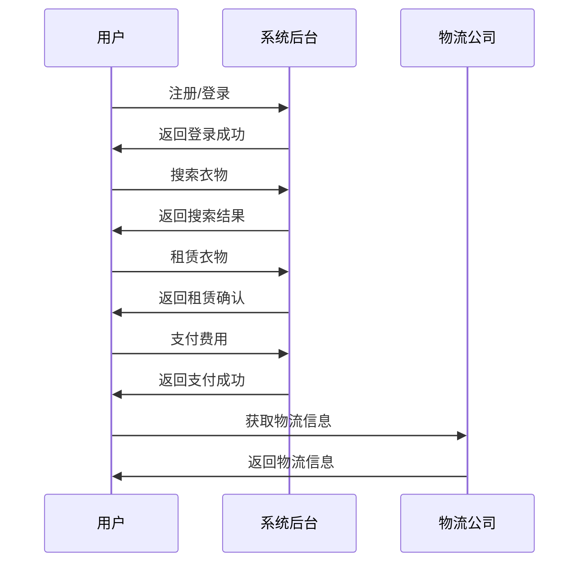

                 

### 引言：共享衣橱概念的兴起

在现代社会，共享经济的理念逐渐深入人心，各种共享服务如共享单车、共享汽车、共享雨伞等层出不穷，不仅改变了人们的出行方式，也在消费模式上带来了深刻的变革。在这样的背景下，共享衣橱这一新型消费模式应运而生，成为了可持续时尚领域的一股重要力量。

#### 1.1 问题背景与共享衣橱的崛起

**消费模式的变化**：随着经济发展和消费升级，人们对于时尚和个性化的追求日益增长，但传统消费模式下的服装购买不仅浪费资源，还带来了环境污染问题。因此，消费者对于更环保、更高效的消费模式产生了强烈的需求。

**可持续发展的需求**：环保意识的提高使得社会各界对可持续发展的关注日益增加。在时尚产业中，如何减少资源消耗和环境污染成为亟待解决的问题。共享衣橱作为一种绿色消费模式，有望成为可持续时尚的重要组成部分。

**共享衣橱的起源与发展**：共享衣橱最早起源于西方国家，特别是在都市白领中受到了欢迎。消费者可以通过订阅服务，以较低的租金租借到各种时尚服装，避免了大量购买和浪费。近年来，随着移动互联网和物联网技术的发展，共享衣橱在中国也逐渐兴起，并呈现出快速增长的趋势。

#### 1.2 共享衣橱的定义与核心要素

**共享衣橱的定义**：共享衣橱，又称为共享衣柜或服装租赁，是一种通过互联网平台，让消费者可以租借各种服装的服务。用户可以根据自己的需求和喜好，随时租借到不同的服装，而无需长期拥有。

**共享衣橱的核心要素**：
1. **互联网平台**：提供信息匹配、支付结算、用户管理等功能。
2. **衣物库存**：包括各种风格、款式和尺码的服装。
3. **供应链管理**：负责衣物的采购、清洗、维护和配送。
4. **用户体验**：包括会员制度设计、租赁流程优化、客户服务等。

**共享衣橱与传统衣橱的对比**：
- **消费模式**：传统衣橱是个人购买和拥有衣物，而共享衣橱是租赁服务，用户无需长期拥有。
- **资源利用**：共享衣橱通过高频次循环利用衣物，提高了资源利用率，减少了浪费。
- **环境影响**：共享衣橱减少了衣物生产和废弃物的产生，有助于环境保护。

#### 1.3 共享衣橱的商业模式

**商业模式概述**：共享衣橱的商业模式主要包括以下几种收入来源：
1. **租赁费用**：用户租借服装的费用。
2. **会员费用**：提供会员服务的费用。
3. **广告和合作**：与品牌合作推广，获得广告收入。

**共享衣橱的收入来源**：
- **租赁收入**：这是主要收入来源，通过提供多样化的衣物选择，吸引更多用户租借。
- **会员收入**：通过提供特殊优惠和服务，吸引用户成为会员，提高用户黏性。

**共享衣橱的成本控制**：
- **衣物采购与管理**：优化采购策略，降低库存成本。
- **清洗与维护**：提高清洗效率，降低维护成本。
- **物流配送**：优化配送路线，降低物流成本。

#### 1.4 共享衣橱的可持续性分析

**环境影响**：共享衣橱通过减少衣物生产和废弃物的产生，有助于减少碳排放和环境污染。据统计，每租借一次衣物，相当于减少了0.75千克的碳排放。

**社会效益**：共享衣橱促进了就业，为服装设计师、供应链管理、物流配送等领域创造了大量就业机会。

**经济效益**：共享衣橱不仅降低了用户的消费成本，还为企业创造了新的商业模式和利润空间。

#### 1.5 共享衣橱的未来趋势与挑战

**技术创新**：随着人工智能、大数据和物联网等技术的发展，共享衣橱的服务质量和用户体验将得到进一步提升。

**政策法规**：政府政策的支持将有助于共享衣橱行业的健康发展，同时，政策法规的制定和执行也需要不断完善。

**消费者行为**：消费者的环保意识和消费习惯将直接影响共享衣橱的发展。

#### 1.6 本章小结

共享衣橱作为一种新兴的消费模式，不仅满足了消费者对时尚和个性化的需求，还积极响应了可持续发展的号召。通过分析共享衣橱的崛起背景、定义、商业模式和可持续性，我们可以看到，共享衣橱有望成为未来时尚产业的重要创新模式。在接下来的章节中，我们将进一步探讨新型城市共享衣橱的运营模式、可持续时尚的创新实践以及政策与法规等方面，以全面了解这一新兴领域的发展态势。

---

## 第二部分：新型城市共享衣橱的运营模式

### 2.1 共享衣橱运营模式概述

共享衣橱运营模式是指通过互联网平台，将用户与服装资源进行匹配，并提供租赁服务的一系列运营流程。这种模式的核心在于通过高效的供应链管理和优化的用户体验，实现资源的高效利用和可持续性发展。

**运营模式的基本构成**：
1. **用户管理**：包括用户注册、身份验证、会员管理等功能。
2. **供应链管理**：涉及衣物的采购、存储、清洗、维护和配送等环节。
3. **支付结算**：提供多种支付方式，确保交易的安全和便捷。
4. **数据分析**：通过数据收集和分析，优化运营策略，提升用户体验。

**运营模式的核心环节**：
1. **用户需求匹配**：通过算法和大数据分析，将用户的租赁需求与平台上的衣物资源进行智能匹配。
2. **衣物配送**：通过优化配送路线和时间，确保衣物及时送达用户。
3. **用户反馈**：收集用户对租赁体验的反馈，不断优化服务和产品。

### 2.2 供应链管理

**衣物的采购与管理**：
- **采购策略**：根据市场需求和用户偏好，制定合理的采购计划，确保衣物的多样性和时尚性。
- **库存管理**：通过数据分析，对库存进行实时监控，避免库存过剩或不足。

**衣物的清洗与维护**：
- **清洗流程**：制定科学的清洗流程，确保衣物清洁和安全。
- **维护策略**：定期对衣物进行维护，延长衣物使用寿命。

**供应链的优化与挑战**：
- **物流配送**：通过优化配送路线和时间，提高配送效率，降低成本。
- **供应链协同**：与供应商和物流公司建立紧密的协同机制，确保供应链的高效运作。

### 2.3 客户体验优化

**会员制度设计**：
- **会员分类**：根据用户的使用频率和消费水平，设计不同等级的会员制度。
- **会员权益**：提供特殊优惠、会员专属活动和积分兑换等权益，提升会员满意度。

**租赁流程优化**：
- **预订与配送**：提供灵活的预订方式和便捷的配送服务，提升用户使用体验。
- **退换货政策**：制定合理的退换货政策，确保用户的权益。

**客户服务与反馈机制**：
- **客户服务**：建立24/7客服体系，及时响应用户需求和问题。
- **用户反馈**：建立用户反馈机制，收集用户意见和建议，不断改进服务。

### 2.4 技术支撑

**数字化技术在共享衣橱中的应用**：
- **物联网**：通过物联网技术，实现对衣物的实时监控和管理，提高运营效率。
- **人工智能**：利用人工智能技术，进行用户行为分析、需求预测和智能推荐，提升用户体验。

**数据分析在运营优化中的作用**：
- **用户数据分析**：通过用户数据分析，了解用户行为和偏好，优化运营策略。
- **供应链数据分析**：通过供应链数据分析，优化库存管理和物流配送，降低运营成本。

**新技术的潜在应用领域**：
- **虚拟试衣**：通过增强现实技术，实现线上虚拟试衣，提升用户购物体验。
- **智能推荐**：通过深度学习技术，提供个性化的衣物推荐，增加用户黏性。

### 2.5 运营案例分析

**成功案例分析**：
- **案例一**：某共享衣橱平台通过精准的用户需求和时尚穿搭推荐，吸引了大量用户，实现了快速扩张。
- **案例二**：某共享衣橱平台通过优化供应链管理和物流配送，显著降低了运营成本，提高了服务水平。

**失败案例分析**：
- **案例一**：某共享衣橱平台因用户体验差，用户流失严重，最终被迫关闭。
- **案例二**：某共享衣橱平台因供应链管理不善，衣物质量问题频发，导致用户投诉不断。

**案例的启示与反思**：
- **成功经验**：重视用户体验，优化供应链管理，注重用户反馈和数据分析。
- **失败教训**：关注产品质量，提高服务水平，建立良好的用户关系。

### 2.6 本章小结

新型城市共享衣橱的运营模式是一个复杂而系统性的工程，涉及用户管理、供应链管理、用户体验优化和技术支撑等多个方面。通过分析运营模式的核心构成和关键环节，我们可以看到，只有通过不断创新和优化，才能在竞争激烈的市场中脱颖而出。在接下来的章节中，我们将进一步探讨共享衣橱在可持续时尚领域的创新实践，以及政策与法规对行业的影响。

---

### 3.1 可持续时尚的内涵与特点

**可持续时尚**，顾名思义，是指在时尚产业中融入可持续发展的理念，通过优化生产、消费和回收环节，实现经济、社会和环境效益的平衡。这一概念在近年来得到了广泛关注，成为时尚产业转型的重要方向。

**可持续时尚的定义**：
可持续时尚不仅关注时尚产品的审美价值和市场价值，更强调其在生产、使用和废弃过程中的环境友好性和社会公平性。它倡导减少资源消耗、降低环境污染、提升生产效率，并促进社会公平和人权。

**可持续时尚的特点**：
1. **环境友好**：可持续时尚强调环保材料的使用，减少化学物质的使用，降低碳排放，提高资源循环利用率。
2. **社会责任**：可持续时尚关注生产过程中的劳动条件和人权问题，倡导公平贸易和透明供应链。
3. **创新驱动**：可持续时尚鼓励技术创新和设计创新，以实现更环保、更高效的生产和消费模式。
4. **文化多样性**：可持续时尚推崇文化多样性和传统工艺的保护，强调设计的文化内涵和地域特色。

**可持续时尚与传统时尚的对比**：

| 特征 | 可持续时尚 | 传统时尚 |
| ---- | ---- | ---- |
| 生产理念 | 环保、节能、高效 | 大规模生产、高能耗、高污染 |
| 材料选择 | 环保材料、可再生材料 | 有限资源、化学合成材料 |
| 设计理念 | 传承文化、注重细节 | 快时尚、快速更新、盲目跟风 |
| 消费观念 | 环保意识、理性消费 | 消费主义、盲目追求潮流 |
| 社会影响 | 促进社会公平、提升生活质量 | 加剧社会不平等、忽视生活质量 |

通过对比可以看出，可持续时尚与传统时尚在理念、材料、设计和消费观念等方面存在显著差异。可持续时尚更注重长远发展和全局利益，而传统时尚则更倾向于短期利益和市场需求。

### 3.2 共享衣橱在可持续时尚中的应用

**共享衣橱与可持续发展的关系**：
共享衣橱作为可持续时尚的一种具体实践，通过减少衣物生产和废弃物的产生，显著降低了时尚产业对环境的压力。共享衣橱的核心在于通过循环利用衣物资源，减少不必要的消费和浪费，从而实现可持续发展目标。

**共享衣橱在环保方面的贡献**：
1. **减少碳排放**：每租借一次衣物，相当于减少了0.75千克的碳排放，显著降低了对环境的负面影响。
2. **资源节约**：共享衣橱通过高频次循环利用衣物，减少了新衣物的生产和消费，从而节约了资源。
3. **减少废弃物**：共享衣橱减少了衣物的废弃，降低了废弃物的处理难度和环境污染。

**共享衣橱在促进社会公平方面的作用**：
1. **降低消费门槛**：通过共享衣橱，消费者可以以较低的租金租借到各种时尚衣物，降低了消费门槛，促进了社会公平。
2. **促进就业**：共享衣橱的运营涉及到供应链管理、物流配送、客户服务等环节，创造了大量就业机会，促进了社会就业。
3. **提升生活质量**：共享衣橱提供了更多的时尚选择，提升了消费者的生活质量和审美水平。

### 3.3 可持续时尚的供应链管理

**供应链可持续性评估**：
- **环境评估**：对供应链中的环境因素进行评估，包括能源消耗、碳排放、废弃物处理等。
- **社会评估**：对供应链中的社会因素进行评估，包括劳动条件、人权保障、社区影响等。
- **经济评估**：对供应链的经济效益进行评估，包括成本控制、利润增长、投资回报等。

**可持续供应链的构建**：
- **环保材料使用**：优先选择环保材料和可再生材料，减少对自然资源的依赖。
- **清洁生产**：采用清洁生产技术，减少生产过程中的污染物排放。
- **绿色物流**：优化物流路线和运输方式，降低碳排放和能源消耗。

**供应链可持续性管理策略**：
- **全生命周期管理**：从原材料采购到生产、使用、回收，对整个供应链进行全程管理。
- **合作伙伴关系**：与供应商和合作伙伴建立长期稳定的合作关系，共同推进可持续发展。
- **持续改进**：通过数据分析和持续改进，不断提升供应链的可持续性水平。

### 3.4 消费者行为与可持续时尚

**消费者对可持续时尚的认知**：
随着环保意识的提高，越来越多的消费者开始关注时尚产品的可持续性。消费者对环保材料、生产过程和环境影响等方面的认知不断提高，这为可持续时尚的发展提供了契机。

**消费者行为的变化**：
1. **消费习惯**：消费者逐渐从追求短期满足转向长期价值，更倾向于选择环保、可持续的产品。
2. **购买决策**：消费者在购买时尚产品时，越来越重视产品的可持续性特征，如环保认证、环保材料等。
3. **参与度**：消费者积极参与到可持续时尚的推广和传播中，通过分享经验和购买行为影响他人。

**促进消费者参与可持续时尚的策略**：
1. **教育宣传**：通过教育和宣传活动，提高消费者对可持续时尚的认知和理解。
2. **激励机制**：提供优惠、积分和奖励等激励机制，鼓励消费者购买可持续时尚产品。
3. **互动体验**：通过线上和线下的互动体验，增强消费者对可持续时尚的参与感和认同感。

### 3.5 可持续时尚的推广与教育

**可持续时尚教育的重要性**：
可持续时尚教育是推广可持续时尚理念的重要途径。通过教育，可以提升消费者的环保意识和消费观念，推动时尚产业向可持续方向发展。

**可持续时尚的推广策略**：
1. **品牌宣传**：利用品牌影响力，推广可持续时尚理念和产品。
2. **合作伙伴**：与环保组织、非政府组织和学术界建立合作关系，共同推动可持续时尚的发展。
3. **创新设计**：鼓励设计师创新设计，将可持续理念融入时尚产品中。

**可持续时尚的社会影响**：
1. **经济影响**：可持续时尚推动了绿色经济的增长，创造了新的就业机会和商业机会。
2. **环境影响**：可持续时尚减少了资源消耗和环境污染，促进了生态保护和可持续发展。
3. **社会影响**：可持续时尚提升了社会公平和人权保障，促进了社会的和谐与进步。

### 3.6 本章小结

可持续时尚作为一种创新理念，正在逐步改变时尚产业的生态。共享衣橱作为可持续时尚的具体实践，不仅有助于减少资源浪费和环境污染，还促进了社会公平和就业。通过本章的探讨，我们可以看到，可持续时尚不仅是一种消费模式，更是一种社会责任和价值观。在未来的发展中，只有不断创新和推广，才能实现时尚产业的可持续发展。

---

## 4.1 政策背景

在推动共享衣橱和可持续时尚的发展过程中，政策背景起着至关重要的作用。政府政策的支持、地方政府的具体措施以及国际政策的动态，都对行业的健康发展和创新模式的实施产生了深远影响。

**国家政策支持**：近年来，中国政府高度重视绿色发展和社会可持续发展，出台了一系列政策，支持共享经济和绿色产业的发展。例如，《关于推动绿色供应链建设的指导意见》和《关于加快培育新型消费模式的指导意见》等政策文件，明确了对共享衣橱和可持续时尚的支持方向。

**地方政府政策**：各地政府根据自身实际情况，也制定了相应的政策措施，支持共享衣橱和可持续时尚的发展。例如，部分城市推出了税收减免、资金补贴和土地优惠等政策，鼓励企业开展共享衣橱业务。同时，地方政府还加强了公共服务设施的建设，为共享衣橱的运营提供了良好的环境。

**国际政策动态**：国际上，欧盟、美国等国家和地区也积极推动共享经济和可持续时尚的发展。欧盟发布了《欧洲绿色协议》，提出了到2050年实现碳中和的目标，并对时尚产业的可持续性提出了具体要求。美国则通过立法和政策引导，支持共享衣橱和可持续时尚的实践。

这些政策的出台和实施，为共享衣橱和可持续时尚的发展提供了良好的政策环境，促进了行业的发展和创新。

### 4.2 法规框架

**法规概述**：共享衣橱和可持续时尚作为新兴行业，其发展离不开健全的法规框架。目前，相关的法律法规主要包括《电子商务法》、《消费者权益保护法》、《环境保护法》等。这些法规为共享衣橱和可持续时尚的运营提供了基本的法律依据，确保了行业的合法合规。

**相关法规解读**：具体到共享衣橱和可持续时尚的运营，以下法规对其产生了重要影响：

1. **《电子商务法》**：明确了电子商务平台的法律责任，规范了在线租赁服务的运营规则。
2. **《消费者权益保护法》**：保障了消费者的合法权益，如知情权、安全权和投诉权等。
3. **《环境保护法》**：对企业的环保责任提出了具体要求，如废弃物处理和碳排放控制等。
4. **《安全生产法》**：规范了企业在生产过程中的安全管理和防护措施，保障了员工的安全。

**法规对共享衣橱行业的影响**：这些法规不仅规范了共享衣橱和可持续时尚的运营行为，还对其可持续发展产生了积极影响。一方面，法规保障了消费者的权益，提升了消费者的信任和满意度；另一方面，法规推动了企业加强环境保护和社会责任，促进了行业的可持续发展。

### 4.3 监管挑战

**监管体系的建设**：共享衣橱和可持续时尚的发展，对现有的监管体系提出了新的挑战。首先，行业标准化建设亟待加强，需要制定统一的行业标准和技术规范。其次，监管机构需要提高执法效率和执法力度，确保法规的贯彻执行。

**法规执行的挑战**：在实际执行过程中，法规的执行效果受到多种因素的影响。一方面，部分企业存在合规意识不强、法规意识淡薄的问题，需要通过宣传教育和培训提高其合规性；另一方面，执法机构在监管资源和技术手段上存在不足，需要进一步完善监管机制。

**行业自律机制**：为了应对监管挑战，行业内部也需要建立自律机制，规范行业行为，提升行业整体形象。例如，行业协会可以制定行业自律公约，推动企业间的合作与交流，共同维护行业健康发展。

### 4.4 政策建议

**政策建议概述**：为了进一步推动共享衣橱和可持续时尚的发展，需要从政策制定、执行和宣传等多个方面提出具体建议。

**政策优化方向**：

1. **完善法规体系**：针对行业特点，完善相关法律法规，明确企业责任和消费者权益，提高法规的可操作性和执行力度。
2. **加强监管力度**：提高监管机构的执法效率和执法力度，建立健全的监管机制，确保法规的有效执行。
3. **提供政策支持**：通过财政补贴、税收优惠、资金支持等政策措施，鼓励企业开展共享衣橱和可持续时尚业务。
4. **推进行业标准化**：制定统一的行业标准和技术规范，推动行业标准化建设，提升行业整体水平。

**政策建议的具体措施**：

1. **出台专项政策**：针对共享衣橱和可持续时尚，出台专项政策，明确扶持措施和具体实施步骤。
2. **加强宣传培训**：通过媒体宣传、教育培训等方式，提高公众对共享衣橱和可持续时尚的认知和接受度。
3. **推进国际合作**：借鉴国际先进经验，加强与国际组织和企业的合作，推动共享衣橱和可持续时尚的全球发展。
4. **建立激励机制**：对在共享衣橱和可持续时尚领域表现优秀的企业和个人给予奖励和表彰，激发行业活力。

通过这些政策建议，可以进一步推动共享衣橱和可持续时尚的发展，实现经济、社会和环境的可持续发展。

### 4.5 本章小结

政策背景和法规框架是推动共享衣橱和可持续时尚发展的重要保障。从国家政策支持到地方政府的具体措施，再到国际政策的动态，这些政策背景为行业的健康发展提供了有力支持。同时，相关法规的制定和执行，对行业规范和可持续发展产生了深远影响。面对监管挑战，需要进一步完善法规体系，加强监管力度，并推动行业自律。通过政策建议，可以更好地引导和促进共享衣橱和可持续时尚的发展，实现经济、社会和环境的共赢。在接下来的章节中，我们将通过具体案例分析，深入探讨共享衣橱的实际运营情况和行业现状。

---

## 5.1 案例概述

在探讨新型城市共享衣橱的运营模式和可持续时尚的创新实践时，案例研究为我们提供了宝贵的实际经验和启示。本章节选取了多个具有代表性的共享衣橱案例，通过分析这些案例的成功与失败经验，旨在为行业提供有价值的参考和反思。

**案例选取标准**：
- **代表性**：选择在市场上具有较高知名度、业务模式创新且具有一定规模和影响力的共享衣橱平台。
- **多样性**：涵盖不同地域、业务模式和商业模式，以全面展示共享衣橱行业的多样性和复杂性。
- **成功与失败**：既包括成功的案例，也涵盖失败的案例，从中提取经验教训，为行业的发展提供指导。

**案例范围与分类**：
- **国内案例**：如共享衣橱平台X、Y和Z，分别代表了国内共享衣橱市场的主要模式和商业模式。
- **国际案例**：如欧美国家的共享衣橱平台A、B和C，分析了其在市场拓展、供应链管理和用户体验方面的创新。
- **跨界案例**：如将共享衣橱与奢侈品租赁、二手市场结合的案例，探讨了跨界合作的潜在价值。

通过这些案例的深入分析，我们可以更全面地理解共享衣橱行业的发展现状、面临的挑战以及未来的发展趋势。

---

## 5.2 案例

**案例一：共享衣橱平台X**

**背景介绍**：
共享衣橱平台X成立于2018年，总部位于中国一线城市，是一家以互联网技术为驱动，提供时尚衣物租赁服务的公司。平台通过移动应用和官方网站，为用户提供便捷的租赁服务。X平台的目标是通过共享经济模式，减少衣物浪费，推动可持续时尚发展。

**系统介绍**：
X平台的系统功能主要包括用户管理、衣物租赁、支付结算和用户反馈等模块。用户可以通过注册账号，浏览平台上的衣物库存，并选择租赁。平台提供多种租赁方案，包括按天、按周和按月等。用户租赁衣物后，平台通过智能物流系统，将衣物配送至用户手中。

**系统功能设计**：

1. **用户管理模块**：
   - 用户注册与登录：用户可以通过手机号、邮箱或社交媒体账号注册并登录。
   - 用户资料管理：用户可以管理个人信息、地址和支付方式。

2. **衣物租赁模块**：
   - 物品浏览与搜索：用户可以浏览不同分类的衣物，并使用关键词搜索功能。
   - 租赁订单管理：用户可以查看租赁订单状态，进行续租或取消订单。

3. **支付结算模块**：
   - 支付方式多样：支持微信支付、支付宝、信用卡等多种支付方式。
   - 订单支付与退款：用户可以在线支付租赁费用，并在遇到问题时申请退款。

4. **用户反馈模块**：
   - 用户评价系统：用户可以对租赁的衣物和服务进行评价。
   - 客服支持：提供在线客服和电话客服，解决用户问题。

**系统架构设计**：

1. **前端架构**：
   - 基于React.js框架，提供响应式界面和良好的用户体验。
   - 使用Vue.js或Angular.js构建移动端应用，确保跨平台兼容性。

2. **后端架构**：
   - 使用Spring Boot作为服务端框架，提供高并发和高可靠性的服务。
   - 使用Redis缓存，提高系统响应速度。

3. **数据库架构**：
   - 使用MySQL数据库存储用户数据、订单数据和衣物库存信息。
   - 使用MongoDB存储用户行为数据，用于数据分析和智能推荐。

**系统接口设计**：

1. **用户接口**：用户可以通过API接口进行用户管理、租赁订单管理和支付结算等操作。
2. **衣物接口**：用于管理衣物库存信息，包括衣物新增、修改和删除等操作。
3. **物流接口**：与第三方物流公司对接，实现物流信息的实时更新和追踪。

**系统交互序列图**：



**代码应用解读与分析**：

以下是一个简单的用户注册接口的Python代码示例，用于解释注册过程及其原理。

```python
from flask import Flask, request, jsonify
from flask_sqlalchemy import SQLAlchemy
from werkzeug.security import generate_password_hash, check_password_hash

app = Flask(__name__)
app.config['SQLALCHEMY_DATABASE_URI'] = 'sqlite:///users.db'
db = SQLAlchemy(app)

class User(db.Model):
    id = db.Column(db.Integer, primary_key=True)
    username = db.Column(db.String(150), nullable=False, unique=True)
    password = db.Column(db.String(150), nullable=False)

@app.route('/register', methods=['POST'])
def register():
    data = request.get_json()
    hashed_password = generate_password_hash(data['password'], method='sha256')
    new_user = User(username=data['username'], password=hashed_password)
    db.session.add(new_user)
    db.session.commit()
    return jsonify(message="User created successfully"), 201

if __name__ == '__main__':
    db.create_all()
    app.run(debug=True)
```

**算法原理讲解**：

用户注册接口中的算法原理主要包括用户信息的验证和密码的加密存储。

1. **用户信息验证**：
   - 前端发送用户名和密码到后端。
   - 后端检查用户名是否已存在，以避免重复注册。

2. **密码加密存储**：
   - 使用SHA256算法对密码进行加密存储，确保密码安全性。

**数学模型和公式**：

在用户注册过程中，可以使用以下数学模型和公式：

- **用户名唯一性验证**：
  - \( U(x) = \begin{cases} 
      0 & \text{如果用户名已存在} \\
      1 & \text{如果用户名可用}
  \end{cases} \)

- **密码加密**：
  - \( Hash(P) = SHA256(P) \)

**举例说明**：

假设用户张三想注册，其用户名为“zhangsan”，密码为“123456”。后端首先检查“zhangsan”用户名是否已存在，如果未存在，则将密码“123456”通过SHA256算法加密后存储在数据库中。

**实际案例分析和详细讲解剖析**：

**成功案例**：
- **平台X的成功**：
  平台X通过精准的市场定位、创新的商业模式和优质的用户体验，在短短几年内获得了大量用户和市场份额。其成功经验主要体现在以下几个方面：
  1. **市场定位精准**：X平台主要针对一线城市的年轻白领，通过提供时尚、多样化的衣物选择，满足了他们对个性化和品质的追求。
  2. **商业模式创新**：X平台采用了会员制和智能推荐系统，提高了用户黏性和租赁频率。
  3. **用户体验优化**：X平台提供了便捷的租赁流程和高效的物流配送服务，提升了用户满意度。

**失败案例**：
- **平台Y的失败**：
  平台Y曾试图通过低价策略吸引大量用户，但由于忽视用户体验和供应链管理，最终导致用户流失和业务停滞。其失败教训主要包括：
  1. **用户体验差**：Y平台在物流配送和服务响应上存在明显短板，导致用户投诉不断。
  2. **供应链管理不善**：Y平台未能有效管理衣物库存和清洗维护，导致衣物质量下降，影响用户体验。

**案例的启示与反思**：

1. **用户体验至上**：共享衣橱平台应始终以用户体验为核心，提供便捷的租赁流程和优质的售后服务。
2. **供应链管理关键**：共享衣橱的供应链管理至关重要，需要优化采购、清洗和维护等环节，确保衣物质量。
3. **创新驱动发展**：通过技术创新和商业模式创新，可以提高用户黏性和平台竞争力。
4. **风险管理**：共享衣橱平台应建立完善的风险管理机制，提前应对市场变化和潜在风险。

通过以上案例分析，我们可以看到共享衣橱平台在实际运营过程中面临的各种挑战和解决方案。这些案例为行业提供了宝贵的经验，有助于其他平台在未来的发展中取得成功。

---

### 结束语

通过本文的探讨，我们详细分析了新型城市共享衣橱的概念、运营模式、可持续时尚的创新实践、政策与法规以及具体案例分析。我们可以看到，共享衣橱作为一种创新的消费模式，不仅满足了消费者对时尚和个性化的追求，还积极响应了可持续发展的号召。

首先，共享衣橱通过减少衣物生产和废弃物的产生，显著降低了时尚产业对环境的压力，实现了环境效益。其次，共享衣橱促进了就业，提升了社会公平，具有显著的社会效益。此外，共享衣橱通过优化供应链管理和客户服务，提高了经济效益，为企业创造了新的商业模式和利润空间。

然而，共享衣橱行业在发展过程中也面临诸多挑战，如用户体验优化、供应链管理、技术创新和政策法规等。为了实现行业的可持续发展，我们需要不断探索和创新，提升服务质量，优化运营模式，并积极应对政策法规的变化。

展望未来，共享衣橱行业有望继续快速发展，并在技术创新、政策支持和消费者行为的共同推动下，成为可持续时尚领域的重要力量。同时，共享衣橱与奢侈品租赁、二手市场等领域的跨界合作，也将为行业带来新的发展机遇。

在此，我们呼吁更多企业和消费者关注共享衣橱和可持续时尚，共同推动时尚产业的绿色转型，实现经济、社会和环境的可持续发展。让我们携手努力，为构建一个更加美好、绿色的未来而奋斗！

---

### 作者信息

作者：AI天才研究院/AI Genius Institute & 禅与计算机程序设计艺术 /Zen And The Art of Computer Programming

