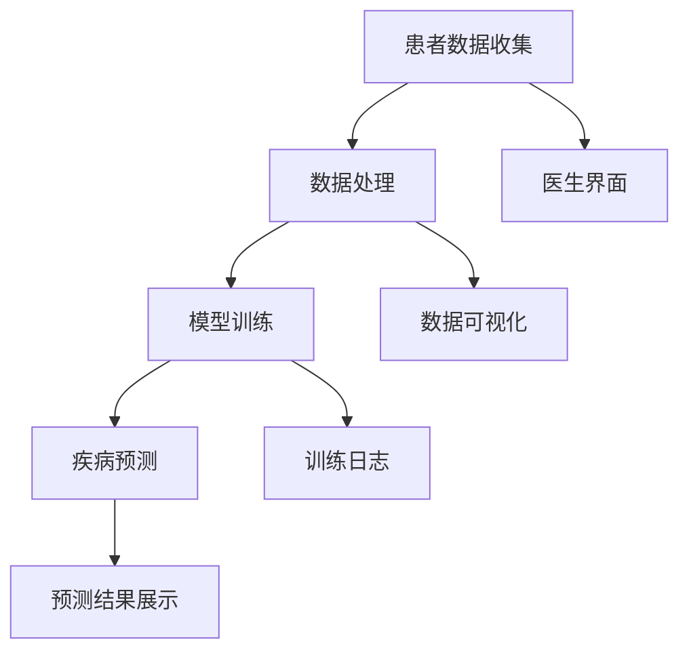
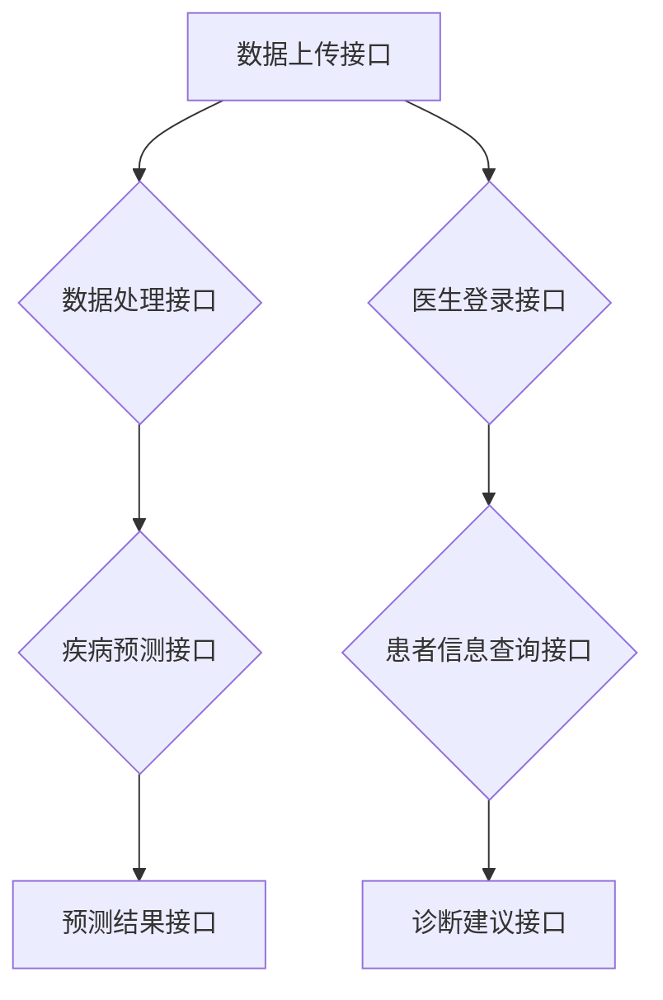

                 

### 第1章: 问题背景与概述

#### 1.1 问题背景

在21世纪，人工智能（AI）的发展如日中天，其应用已经深入到我们生活的方方面面。然而，随着AI技术的进步，一个严峻的问题逐渐凸显：人类的价值如何在这个新时代中得以维护？AI的崛起是否会导致人类价值的贬值，甚至危机？

**问题描述：** 人工智能的发展不仅改变了我们的生产方式，生活方式，甚至开始触及到人类价值观的核心。它引发了一系列问题，如就业市场的剧变、个人隐私的泄露、道德伦理的挑战等。这些问题使得我们不得不重新思考人类价值的本质和未来。

**问题解决：** 本书旨在探讨人工智能时代人类价值面临的危机，并提出应对策略。通过深入分析AI对人类价值观的影响，结合政策、教育、伦理和社会责任等多方面的探讨，本书希望能够为人类价值在AI时代的延续提供一些启示。

**边界与外延：** 本书主要关注的是人工智能技术对人类价值的影响，以及如何通过政策、教育、伦理和社会责任等手段来应对这种影响。书中涉及的概念包括人工智能、人类价值、就业市场、隐私、道德伦理、社会责任等。

**概念结构与核心要素组成：**

- **人工智能（AI）：** 包括机器学习、深度学习、自然语言处理、计算机视觉等前沿技术。
- **人类价值：** 包括个人的尊严、自由、创造力、道德伦理等。
- **危机：** 指人类价值在人工智能时代受到的威胁和挑战。

##### 1.2 核心概念与联系

##### 1.2.1 人工智能

人工智能是指通过计算机系统模拟人类的智能行为，包括学习、推理、感知、决策等。它的发展可以分为三个阶段：

1. **符号人工智能（Symbolic AI）：** 通过逻辑推理和符号计算来模拟人类智能。
2. **连接主义人工智能（Connectionist AI）：** 通过神经网络和深度学习来模拟人类智能。
3. **混合人工智能（Hybrid AI）：** 结合符号人工智能和连接主义人工智能的优势，实现更强大的智能。

##### 1.2.2 人类价值

人类价值是指人类社会中普遍认同和追求的价值观，包括个人的尊严、自由、创造力、道德伦理等。它反映了人类对于自身存在和发展的理解和追求。

- **尊严：** 人类作为独立个体的尊重和价值。
- **自由：** 个人在道德和法律的框架下自主选择和行动的权利。
- **创造力：** 个人在思考和实践中创新的能力。
- **道德伦理：** 个人和社会在行为和决策中的道德准则。

**概念属性特征对比表格：**

| 特征         | 人工智能 | 人类价值  |
| ------------ | -------- | --------- |
| 实现方式     | 计算模拟 | 社会文化 |
| 目标         | 模仿人类智能 | 实现人的自由和尊严 |
| 发展阶段     | 符号、连接主义、混合 | 多元化、动态变化 |
| 重要性       | 技术进步 | 社会稳定 |

**ER实体关系图架构：**

```
[实体关系图]
人类价值 <---- [尊严] <---- [自由] <---- [创造力] <---- [道德伦理]
                |
                V
            [人工智能]
```

在人工智能时代，人类价值的危机体现在以下几个方面：

1. **就业市场的冲击：** AI技术的发展可能导致许多传统职业的消失，从而威胁到人类的生存和尊严。
2. **个人隐私的泄露：** AI技术的广泛应用可能使个人隐私面临更大的风险，从而影响个人的自由。
3. **道德伦理的挑战：** AI的自主决策可能引发道德和伦理困境，如机器伦理和责任分配问题。
4. **文化和精神的危机：** AI的发展可能削弱人类的文化创造力和精神追求，导致人类价值的失落。

通过深入分析这些问题，我们可以更好地理解人类价值在人工智能时代面临的挑战，并为解决这些挑战提供有效的策略。

### 第2章: 人工智能对人类价值的影响分析

#### 2.1 人工智能的发展趋势

人工智能作为当前技术领域的热点，其发展势头迅猛，不仅推动了科技的进步，也对人类社会产生了深远的影响。以下将从几个方面分析人工智能的发展趋势及其对人类价值的影响。

##### 2.1.1 人工智能的技术进步

人工智能的技术进步主要体现在以下几个方面：

1. **算法优化：** 深度学习算法的不断发展，使得计算机在图像识别、语音识别、自然语言处理等领域的表现显著提升。例如，卷积神经网络（CNN）在图像识别领域的应用，使得机器在识别准确率和速度上都有了大幅提升。

2. **计算能力提升：** 随着计算能力的提升，大规模数据处理和复杂模型训练变得更加可行。高性能计算集群和专用硬件（如GPU、TPU）的普及，使得人工智能算法能够处理更为复杂的数据集。

3. **数据资源丰富：** 互联网的普及和数据采集技术的进步，为人工智能的发展提供了丰富的数据资源。大数据的积累使得人工智能系统能够从海量数据中提取有价值的信息，从而提高决策的准确性。

##### 2.1.2 人工智能的应用领域扩展

人工智能的应用领域正不断扩展，从最初的工业自动化，到如今在医疗、金融、交通、教育等多个领域的广泛应用。

1. **医疗健康：** 人工智能在医学影像分析、疾病预测、个性化治疗等方面具有巨大潜力。例如，通过深度学习算法分析医学影像，可以早期发现疾病，提高治疗效果。

2. **金融科技：** 人工智能在金融领域的应用，包括风险评估、量化交易、信用评级等，能够提高金融服务的效率和准确性。

3. **交通出行：** 无人驾驶技术是人工智能在交通领域的重要应用，有望改变未来的出行方式，提高交通安全和效率。

##### 2.1.3 人工智能对人类价值的影响

人工智能的发展不仅改变了生产方式和生活方式，也对人类价值产生了深远的影响。

1. **就业市场的影响：** 人工智能技术的发展可能导致某些传统职业的消失，对就业市场产生冲击。例如，自动化和机器人技术的应用可能导致工厂工人的需求减少。然而，同时也会创造新的就业机会，如人工智能系统的开发、维护和优化。

2. **个人隐私的保护：** 人工智能技术的广泛应用可能使个人隐私面临更大的风险。例如，人脸识别技术的普及，可能会使个人隐私受到侵犯。因此，如何在利用人工智能技术的同时保护个人隐私，成为一个亟待解决的问题。

3. **道德伦理的挑战：** 人工智能系统的自主决策可能引发道德和伦理困境。例如，无人驾驶汽车在面临生死抉择时，如何做出决策？这涉及到机器伦理和责任分配问题。此外，人工智能算法可能存在偏见，从而影响公平性。

4. **文化和精神的危机：** 人工智能技术的发展可能削弱人类的文化创造力和精神追求。例如，人工智能在内容创作方面的应用，可能会减少人类的创作机会，导致文化多样性的减少。

**总结：**

人工智能的发展趋势表现为技术进步、应用领域扩展以及对人类价值的深远影响。在享受人工智能带来的便利和效率提升的同时，我们也需要关注其可能带来的挑战，特别是对人类价值的影响。通过合理的政策和教育措施，我们可以更好地应对这些挑战，确保人工智能与人类社会的和谐共生。

### 2.2 人工智能时代的人类价值危机

随着人工智能技术的迅猛发展，人类社会面临着前所未有的挑战。这些挑战不仅涉及技术层面，还深刻影响到人类的价值观念和社会结构。本节将详细分析人工智能时代人类价值面临的危机，包括价值观的冲突、道德和伦理的挑战，以及文化和精神的危机。

##### 2.2.1 价值观的冲突

人工智能的崛起带来了新的价值观冲突，主要体现在以下几个方面：

1. **技术至上与人文关怀的矛盾：** 在人工智能时代，技术进步往往被视为社会进步的标志。然而，这种观点可能导致对人文关怀的忽视。例如，追求自动化和效率的过程中，可能会忽视人类的情感需求和社会责任。

2. **个体自由与集体利益的平衡：** 人工智能技术的发展可能加剧个体自由与集体利益之间的矛盾。一方面，个体希望通过人工智能技术获得更多的自由和便利；另一方面，人工智能系统可能需要更多的数据和个人隐私来运行，这可能导致集体利益的牺牲。

3. **创新与保守的冲突：** 人工智能技术的快速变革挑战了传统价值观和既得利益。保守派可能担心技术变革带来的不确定性，而创新派则认为技术进步是推动社会发展的关键。这种冲突可能导致政策制定和社会共识的困难。

##### 2.2.2 道德和伦理的挑战

人工智能技术的应用引发了诸多道德和伦理挑战，这些挑战主要体现在以下几个方面：

1. **算法偏见：** 人工智能系统在处理数据时可能受到历史数据中存在的偏见影响，从而导致不公正的决策。例如，招聘系统可能会因为训练数据中的性别或种族偏见，导致特定群体被歧视。

2. **责任归属：** 当人工智能系统发生错误或造成损失时，责任归属成为一个复杂的问题。是应该追究开发者的责任，还是使用者的责任，或者是算法自身的责任？这个问题在法律和伦理层面都存在争议。

3. **自主决策的道德困境：** 人工智能系统的自主决策可能引发道德困境。例如，无人驾驶汽车在紧急情况下如何做出决策？是应该保护乘客的安全，还是尽可能减少对行人的伤害？这种决策涉及到生命权和财产权的权衡。

##### 2.2.3 文化和精神的危机

人工智能的发展对人类文化和精神生活也构成了挑战，具体表现在以下几个方面：

1. **文化多样性的减少：** 人工智能在内容创作方面的应用可能导致人类创造力的减少。例如，通过人工智能生成的内容可能缺乏情感和人文关怀，从而影响文化的多样性和深度。

2. **人类精神的孤立：** 随着人工智能的普及，人类可能会越来越依赖技术，而减少面对面的交流和互动。这可能导致人际关系的疏远和人类精神的孤立。

3. **价值观的模糊化：** 人工智能技术可能使某些传统价值观变得模糊化。例如，在虚拟世界中，人类可能会模糊现实与虚拟的界限，导致价值观的混乱和不确定。

**总结：**

人工智能时代对人类价值构成的危机是多方面的，包括价值观的冲突、道德和伦理的挑战，以及文化和精神的危机。这些危机需要我们深入思考，并通过政策、教育和社会责任等多方面的努力来应对。只有通过共同的努力，我们才能确保人工智能技术的发展不会导致人类价值的衰退，而是与之和谐共生。

### 2.3 本章小结

本章通过分析人工智能的发展趋势及其对人类价值的影响，探讨了人工智能时代人类价值面临的危机。我们详细阐述了价值观的冲突、道德和伦理的挑战，以及文化和精神的危机。这些问题不仅影响个体和社会，也对整个人类文明的未来产生深远影响。

首先，人工智能技术的进步和应用扩展带来了巨大的变革，改变了我们的生产方式和生活方式。然而，这些变革也引发了新的价值观冲突，如技术至上与人文关怀的矛盾，个体自由与集体利益的平衡，以及创新与保守的冲突。

其次，人工智能技术在道德和伦理方面提出了新的挑战。算法偏见、责任归属以及自主决策的道德困境等问题需要我们深入探讨和解决。特别是在算法偏见方面，我们需要确保人工智能系统在处理数据时能够保持公平性和公正性。

最后，人工智能的发展对人类文化和精神生活构成了威胁。文化多样性的减少，人际关系的疏远，以及价值观的模糊化等问题需要我们关注和解决。通过教育和社会责任的共同努力，我们可以更好地应对这些挑战，确保人工智能技术的发展不会导致人类价值的衰退。

总之，人工智能时代对人类价值构成的危机是复杂而多方面的。只有通过全面而深入的思考和行动，我们才能确保人工智能技术能够与人类价值和谐共生，共同推动人类社会的发展。

### 第3章: 政策与法规的制定

在人工智能时代，政策的制定和法规的完善对于维护人类价值具有重要意义。本章节将探讨当前国际和中国在人工智能领域的政策与法规现状，以及未来政策与法规的展望。

#### 3.1 国际政策与法规现状

在国际层面，许多国家和地区已经认识到人工智能技术的重要性，并制定了相应的政策与法规，以规范和引导人工智能的发展。

1. **欧盟：** 欧盟在人工智能领域采取了严格的监管措施。2018年，欧盟通过了《人工智能法案》，旨在确保人工智能技术的安全、可靠和道德。该法案要求对高风险人工智能系统进行强制性评估，并制定了透明度和责任分配的规则。

2. **美国：** 美国政府也在积极推动人工智能的发展，并出台了一系列政策。例如，美国国防部发布了《人工智能2.0战略》，强调人工智能在国家安全和国防领域的重要性，并提出了一系列具体措施。

3. **亚洲国家：** 日本和韩国等国也在积极制定人工智能政策。日本发布了《人工智能国家战略》，旨在推动人工智能技术的发展和应用，提高国家竞争力。韩国则设立了“国家人工智能战略委员会”，负责制定和实施人工智能相关政策。

#### 3.2 中国政策与法规现状

中国在人工智能领域也取得了显著进展，并在政策与法规方面进行了积极探索。

1. **国家战略：** 中国政府高度重视人工智能技术的发展，将其列为国家战略。2017年，国务院发布了《新一代人工智能发展规划》，明确了人工智能发展的目标、任务和政策措施。

2. **政策法规：** 中国政府出台了一系列政策和法规，以推动人工智能技术的发展。例如，2019年，中国发布了《人工智能发展政策白皮书》，详细阐述了人工智能的发展现状、挑战和未来规划。

3. **行业规范：** 中国的行业协会和企业也在积极制定人工智能领域的行业标准，以提高人工智能技术的安全性和可靠性。例如，中国电子工业联合会发布了《人工智能行业自律规范》，规定了人工智能系统的开发、测试和使用标准。

#### 3.3 未来政策与法规展望

在未来，随着人工智能技术的进一步发展，政策与法规的制定将继续完善和深化。

1. **标准化：** 未来人工智能技术的标准化将是政策与法规的重要方向。通过制定统一的行业标准和技术规范，可以提高人工智能系统的互操作性和可靠性，促进技术的普及和应用。

2. **伦理法规：** 随着人工智能技术的广泛应用，伦理问题日益突出。未来，各国将加强对人工智能伦理法规的制定，确保人工智能技术的应用符合道德伦理标准。

3. **国际协作：** 国际合作在人工智能政策与法规的制定中具有重要意义。通过加强国际交流与合作，各国可以共同应对人工智能技术带来的挑战，推动全球人工智能的健康发展。

4. **法律体系完善：** 未来，各国将不断完善人工智能相关的法律法规，确保法律体系的适应性和前瞻性。例如，加强对算法偏见和责任归属等问题的法律规制，提高人工智能系统的透明度和公正性。

**总结：**

政策与法规的制定是应对人工智能时代人类价值危机的重要手段。通过国际和国内的政策法规，我们可以规范和引导人工智能技术的发展，确保其与人类价值和谐共生。未来，随着技术的进一步发展，政策与法规将继续完善和深化，为人工智能时代的健康发展提供有力保障。

### 第4章: 教育与培训的重要性

在人工智能时代，教育与培训的重要性愈发凸显。这不仅关乎个人的职业发展，更关系到整个社会的人才储备和创新能力。本章节将探讨人工智能时代的教育需求，以及如何通过创新与批判性思维的培养，实现教育目标的变革。

#### 4.1 人工智能时代的教育需求

人工智能技术的发展对教育提出了新的要求，主要体现在以下几个方面：

1. **技术基础：** 人工智能时代的教育必须涵盖计算机科学、数据科学和算法设计等基础技术。学生需要掌握编程语言、数据结构和算法等基本知识，以适应人工智能技术的发展。

2. **跨学科融合：** 人工智能技术的发展涉及多个学科领域，如数学、统计学、心理学、语言学等。因此，教育必须推动跨学科融合，培养学生综合运用多学科知识解决问题的能力。

3. **创新能力：** 人工智能时代强调创新思维和创造力。教育需要培养学生的创新精神，鼓励他们提出新想法、解决新问题，从而推动社会进步。

4. **道德伦理教育：** 随着人工智能技术的广泛应用，道德伦理问题日益突出。教育需要加强道德伦理教育，培养学生的社会责任感和道德判断能力，确保人工智能技术的应用符合道德伦理标准。

5. **终身学习：** 人工智能时代知识更新速度快，要求个体具备终身学习能力。教育应鼓励学生养成良好的学习习惯，培养自主学习和持续进步的能力。

#### 4.2 创新与批判性思维的培养

在人工智能时代，创新与批判性思维的培养至关重要。以下是从教育实践中总结的一些有效方法：

1. **项目式学习：** 项目式学习（Project-Based Learning, PBL）是一种以学生为中心的教学方法，通过实际项目来培养学生的创新能力和解决问题的能力。例如，通过设计一个智能家居系统，学生可以学习编程、电子工程和用户体验设计等多方面的知识。

2. **探究式学习：** 探究式学习（Inquiry-Based Learning）鼓励学生主动探索和发现知识，培养学生的批判性思维。教师可以通过提出问题、引导学生进行实验和讨论，激发学生的思考和创造力。

3. **跨学科课程：** 通过设计跨学科的课程，如人工智能与艺术、人工智能与社会等，可以促进多学科知识的融合，培养学生的综合能力和创新思维。

4. **案例研究：** 通过分析现实中的案例，学生可以深入了解人工智能技术的应用和挑战，培养批判性思维。例如，分析人工智能在医疗、金融、交通等领域的应用案例，探讨其优势和不足。

5. **批判性思维工具：** 教师可以教授学生一些批判性思维的工具和方法，如SWOT分析、五力模型、逻辑推理等，帮助学生更好地分析和解决问题。

#### 4.3 跨学科的融合教育

跨学科的融合教育是培养未来人才的关键。以下是一些跨学科融合教育的策略：

1. **跨学科课程设计：** 教师可以根据人工智能技术的发展需求，设计跨学科的集成课程。例如，将计算机科学、数学、统计学、心理学等课程整合在一起，形成一个综合性的学习模块。

2. **跨学科项目合作：** 鼓励学生参与跨学科的项目合作，通过团队协作解决复杂问题。例如，一个由计算机科学、电子工程、心理学和市场营销等多个学科背景的学生组成的小组，可以共同开发一个智能家居系统。

3. **跨学科师资团队：** 建立跨学科的师资团队，促进不同学科的教师之间的交流和合作。教师可以通过共同备课、联合授课等方式，共同探讨如何将多学科知识融入教学中。

4. **跨学科资源整合：** 整合不同学科的教学资源，如教材、实验设备、在线课程等，为学生提供多样化的学习体验。例如，通过在线平台，学生可以访问不同学科的优质课程和资源，拓宽知识视野。

5. **跨学科实践活动：** 通过组织跨学科的实践活动，如科技竞赛、创新创业项目等，激发学生的兴趣和创造力。例如，举办人工智能与艺术创新大赛，鼓励学生将人工智能技术与艺术创作相结合，提出创新解决方案。

**总结：**

教育与培训在人工智能时代具有重要作用。通过满足人工智能时代的教育需求，培养学生的创新能力和批判性思维，以及推动跨学科的融合教育，我们可以为未来社会培养出具备全面能力和创新精神的人才。这不仅是教育领域的使命，也是实现人工智能与人类价值和谐共生的关键。

### 第5章: 科技伦理与道德的探讨

随着人工智能技术的迅猛发展，科技伦理和道德问题日益凸显。这些问题的解决不仅关系到人工智能技术的健康和可持续发展，更关乎人类社会的基本价值和社会秩序。本章节将探讨科技伦理的基本原则、人工智能时代的道德困境，以及通过案例分析进行伦理讨论。

#### 5.1 科技伦理的基本原则

科技伦理是指在科学技术研究和应用过程中，遵循的道德规范和行为准则。以下是科技伦理的基本原则：

1. **尊重人类尊严：** 尊重人类作为独立个体的尊严和价值，是科技伦理的核心原则。任何科技研究和应用都应以人为本，确保技术的发展不会侵犯人的基本权利和尊严。

2. **公平与公正：** 科技发展应追求公平和公正，确保所有人都能平等地享受科技进步带来的福利。应避免科技发展加剧社会不平等和歧视现象。

3. **责任与透明度：** 科技研发和应用过程中，应明确责任归属，确保各方能够承担相应的责任。同时，应保持透明度，公开研究成果和应用过程，接受社会监督。

4. **安全性：** 任何科技研究和应用都应确保安全，防止对人类和环境造成危害。应进行充分的风险评估，制定安全标准和应急预案。

5. **可持续发展：** 科技发展应考虑长远影响，促进可持续发展。应减少资源消耗，保护生态环境，确保科技进步与环境保护相协调。

#### 5.2 人工智能时代的道德困境

人工智能技术的发展带来了诸多道德困境，以下是一些主要问题：

1. **算法偏见：** 人工智能系统在处理数据时可能受到历史数据中存在的偏见影响，从而导致不公平的决策。例如，招聘系统可能会因为数据中的性别或种族偏见，导致特定群体被歧视。

2. **责任归属：** 当人工智能系统发生错误或造成损失时，责任归属成为一个复杂的问题。是应该追究开发者的责任，还是使用者的责任，或者是算法自身的责任？这个问题在法律和伦理层面都存在争议。

3. **自主决策的道德困境：** 人工智能系统的自主决策可能引发道德困境。例如，无人驾驶汽车在面临生死抉择时，如何做出决策？是应该保护乘客的安全，还是尽可能减少对行人的伤害？这种决策涉及到生命权和财产权的权衡。

4. **隐私保护：** 人工智能技术的发展使得个人隐私面临更大风险。例如，人脸识别技术的应用可能侵犯个人隐私权。如何在利用人工智能技术的同时保护个人隐私，是一个重要的道德问题。

#### 5.3 案例分析与伦理讨论

以下通过两个案例分析，探讨人工智能时代的道德困境：

**案例一：自动驾驶汽车的伦理决策**

**案例背景：** 一辆无人驾驶汽车在城市道路上行驶，突然发现前方有行人闯红灯。为了避让行人，汽车可能需要紧急刹车，但此时后面的车辆可能来不及反应，导致连环车祸。

**伦理分析：** 这个案例涉及到生命权与财产权的权衡。从伦理角度来看，保护生命是首要任务，但紧急刹车可能导致更大范围的事故，造成更多财产损失。此外，如何确定责任归属也是一个道德问题。是应该将责任归咎于行人、无人驾驶汽车的开发者还是使用者？

**解决方案：** 一种可能的解决方案是，通过算法设计确保无人驾驶汽车在面临此类困境时，首先考虑保护行人的安全。同时，明确责任归属，确保各方在发生事故时能够承担相应的责任。

**案例二：人工智能医疗诊断的伦理问题**

**案例背景：** 一家医院引进了一款人工智能医疗诊断系统，用于辅助医生诊断疾病。然而，该系统在处理某些罕见病例时，出现了误诊。

**伦理分析：** 这个案例涉及到人工智能系统的可靠性和医生的职责。从伦理角度来看，医生有责任确保患者的健康和安全。然而，人工智能系统的误诊可能导致医生的判断失误，影响治疗效果。

**解决方案：** 一种可能的解决方案是，通过加强人工智能系统的训练和数据收集，提高其诊断的准确性。同时，医生在依靠人工智能系统进行诊断时，应保持警惕，结合自己的专业知识和经验，确保诊断的准确性。

**总结：**

科技伦理和道德问题在人工智能时代具有重要意义。通过案例分析，我们可以更好地理解这些伦理困境，并提出相应的解决方案。只有通过深入探讨和持续努力，我们才能确保人工智能技术的应用符合道德伦理标准，促进人类社会的可持续发展。

### 第6章: 社会责任与可持续发展

在人工智能时代，企业和社会责任的重要性愈发凸显。企业不仅需要追求经济效益，还应在可持续发展和社会责任方面发挥积极作用。本章节将探讨企业社会责任的重要性，以及如何在可持续发展理念指导下，通过实践案例推动社会责任的落实。

#### 6.1 企业社会责任的重要性

企业社会责任（CSR）是指企业在追求经济利益的同时，关注社会和环境问题，积极承担社会责任。在人工智能时代，企业社会责任的重要性体现在以下几个方面：

1. **社会影响：** 人工智能技术的发展和应用可能对社会产生深远影响，包括就业市场的变化、隐私保护、道德伦理等。企业有责任关注这些影响，并采取措施减轻潜在的负面影响。

2. **员工福祉：** 企业应关注员工的职业发展、工作环境和福利，确保员工能够在安全、健康和有激励性的环境中工作。

3. **环境保护：** 人工智能技术的发展需要大量能源和资源，企业有责任采取措施减少碳排放和资源消耗，实现可持续发展。

4. **道德伦理：** 人工智能技术的应用可能引发道德和伦理困境，如算法偏见、隐私泄露等。企业应遵循道德伦理原则，确保技术的公平和透明。

#### 6.2 可持续发展理念

可持续发展是指满足当前需求而不损害未来世代满足其需求的能力。在人工智能时代，可持续发展理念具有以下几个关键要素：

1. **环境保护：** 企业应采取措施减少对环境的负面影响，如降低碳排放、节约资源等。

2. **社会公平：** 企业应关注社会公平，减少贫富差距，促进社会和谐。

3. **经济可持续：** 企业应在追求经济效益的同时，关注长远发展，确保资源的合理利用。

4. **技术创新：** 通过技术创新，企业可以推动可持续发展，如开发绿色能源、提高生产效率等。

#### 6.3 社会责任实践案例

以下是一些企业社会责任和可持续发展实践案例：

1. **谷歌的“AI for Social Good”项目：** 谷歌通过其“AI for Social Good”项目，将人工智能技术应用于解决社会问题，如医疗、教育、环境保护等。例如，谷歌与联合国合作，使用人工智能技术监测和预测全球粮食危机。

2. **微软的“AI for Earth”项目：** 微软推出了“AI for Earth”项目，旨在通过人工智能技术解决全球气候变化、水资源管理、生物多样性保护等问题。该项目为科学家和研究人员提供数据、算法和计算资源，支持他们的研究工作。

3. **亚马逊的“Climate Pledge”计划：** 亚马逊承诺在2040年前实现碳中和，并推出了“Climate Pledge”计划，鼓励其他企业加入。加入该计划的企业承诺采取一系列措施，减少碳排放，并在可再生能源方面进行投资。

4. **阿里巴巴的“智慧城市”项目：** 阿里巴巴通过其“智慧城市”项目，将人工智能和大数据技术应用于城市管理和公共服务。例如，在杭州，阿里巴巴帮助政府建设了智慧交通系统，提高了交通效率，减少了拥堵。

#### 6.4 总结

企业社会责任和可持续发展是人工智能时代的重要议题。通过积极履行社会责任和推动可持续发展，企业不仅能够提升社会形象，还能为人类社会的可持续发展做出贡献。只有通过企业、政府和社会的共同努力，我们才能在人工智能时代实现人与自然的和谐共生，构建一个更加美好的未来。

### 第7章: 未来展望

在人工智能时代，人类价值的未来发展面临诸多机遇与挑战。本章节将探讨人工智能的未来趋势、人类价值的发展方向，以及人与人工智能的和谐共生。

#### 7.1 人工智能的未来趋势

人工智能的发展趋势体现在以下几个方面：

1. **技术的不断进步：** 随着计算能力的提升和数据资源的丰富，人工智能技术将持续发展。新的算法、模型和硬件创新将推动人工智能在各个领域的应用。

2. **应用领域的扩展：** 人工智能将逐渐渗透到更多行业，如医疗、金融、教育、交通等。这将带来前所未有的变革，提高社会效率和生产力。

3. **智能化的提升：** 人工智能系统的智能化水平将逐步提高，从简单的任务执行到复杂的决策支持，再到具备一定程度的人类智能，实现智能化升级。

4. **自主性的增强：** 人工智能系统将具备更强的自主决策能力，能够在复杂环境中进行自我学习和调整。这将为人工智能在无人驾驶、智能家居、智能工厂等领域的应用提供更多可能性。

#### 7.2 人类价值的发展方向

在人工智能时代，人类价值的发展方向主要体现在以下几个方面：

1. **创新能力：** 人工智能的发展将激发人类的创造力，推动人类在科学、艺术、文化等领域的创新。人类将利用人工智能技术解决复杂问题，创造新的价值。

2. **道德伦理的提升：** 随着人工智能技术的发展，人类将面临更多道德和伦理挑战。通过持续的教育和讨论，人类将不断提升道德伦理水平，确保人工智能的应用符合人类的价值观。

3. **社会公平：** 人工智能技术的发展有助于减少社会不平等，提高社会公平。通过公平的算法设计和合理的政策监管，人工智能将为所有人提供公平的机会和福利。

4. **身心健康：** 人工智能技术将提高医疗、健康和养老服务的水平，促进人类身心健康。智能医疗系统和健康管理工具将帮助人们更好地管理健康，延长寿命。

#### 7.3 人与人工智能的和谐共生

在人工智能时代，人与人工智能的和谐共生是未来社会发展的关键。以下是一些实现和谐共生的途径：

1. **技术伦理：** 通过制定和遵守技术伦理规范，确保人工智能系统的设计和应用符合人类的价值观。这包括确保算法的公平性、透明度和安全性。

2. **教育与培训：** 加强人工智能伦理和道德教育，培养具备社会责任感和道德判断能力的人才。同时，提升全民的科技素养，使人们能够更好地理解和利用人工智能技术。

3. **政策监管：** 政府应制定合理的政策和法规，确保人工智能技术的健康发展。通过监管，防止人工智能技术滥用和侵犯个人隐私。

4. **跨学科合作：** 促进人工智能技术与其他领域的交叉融合，如社会学、心理学、伦理学等，共同探讨人工智能对人类社会的影响，提出解决方案。

5. **社会参与：** 鼓励公众和社会组织参与人工智能政策的制定和实施，确保人工智能技术的发展符合社会需求和价值观。

**总结：**

人工智能时代的未来充满机遇与挑战。通过技术创新、道德伦理的提升、政策监管和社会参与，我们可以实现人与人工智能的和谐共生，推动人类社会向更加繁荣和进步的方向发展。

### 第7章: 未来展望

#### 7.2 人类价值的发展方向

在人工智能时代，人类价值的发展面临着新的机遇和挑战。随着技术的不断进步，人类将迎来更加复杂多变的社会环境。在这种背景下，人类价值的发展方向需要更加明确和具体。

1. **创新能力的提升**：
   人工智能技术的快速发展将为人类提供前所未有的创新工具和方法。人们将能够利用人工智能解决复杂的问题，推动科学、艺术、文化等领域的创新。例如，人工智能辅助的药物研发、艺术创作和设计创新等，都将使人类在探索未知领域时更加得心应手。

2. **道德伦理的深化**：
   随着人工智能在各个领域的广泛应用，道德伦理问题将变得更加突出。人类需要深入探讨人工智能伦理，确立明确的道德标准和行为准则。这不仅涉及技术设计和应用中的伦理问题，还包括如何在人工智能时代维护个人尊严和人权。例如，算法偏见、隐私保护、责任归属等问题都需要通过法律和道德的双重约束来解决。

3. **社会公平的保障**：
   人工智能的发展可能会带来社会不平等的加剧，但也可以成为促进社会公平的工具。通过合理的设计和监管，人工智能可以用于消除就业歧视、促进教育公平、改善医疗服务等，从而实现社会资源的更合理分配。例如，利用人工智能优化招聘流程，减少性别和种族歧视，提高公平性。

4. **身心健康与幸福感的提升**：
   人工智能技术有望在医疗健康领域发挥重要作用，提高疾病预防和治疗水平。同时，人工智能辅助的教育和心理健康服务也将帮助人们更好地管理身心健康，提升幸福感。例如，个性化的健康管理系统、智能教育平台和心理咨询服务，都将对人们的日常生活产生积极影响。

5. **文化多样性的保护**：
   人工智能技术在内容创作和传播中的应用，可能会对文化多样性产生一定影响。人类需要确保人工智能技术在促进文化创新的同时，不损害文化多样性。例如，通过鼓励多元文化的数字化记录和传播，利用人工智能技术保护和传承文化遗产。

#### 7.3 人与人工智能的和谐共生

人与人工智能的和谐共生是未来社会发展的核心目标。为了实现这一目标，我们需要采取以下措施：

1. **技术伦理的重视**：
   技术伦理是确保人工智能与人类价值和谐共生的基石。我们需要在人工智能的研发和应用过程中，始终坚持伦理原则，确保技术的发展符合人类的利益和价值观。

2. **教育与培训的普及**：
   提升公众对人工智能的认知和伦理意识，是促进人与人工智能和谐共生的重要途径。通过教育和培训，人们可以更好地理解人工智能的工作原理和应用场景，从而更加理性地使用和管理人工智能技术。

3. **政策法规的制定**：
   政府和监管机构需要制定合理的政策和法规，规范人工智能技术的研发和应用。这包括确保算法的公平性、透明度和安全性，防止人工智能技术滥用和侵犯个人隐私。

4. **跨学科合作与交流**：
   促进人工智能技术与其他学科的交叉融合，如社会学、心理学、伦理学等，有助于全面理解和应对人工智能对人类社会的各种影响。跨学科的研究和合作将提供更全面、深入的解决方案。

5. **社会参与与监督**：
   鼓励公众和社会组织参与人工智能政策的制定和实施，确保人工智能技术的发展符合社会需求和价值观。公众监督和社会参与是保障人工智能与人类价值和谐共生的关键。

**总结**：

在人工智能时代，人类价值的发展方向和人与人工智能的和谐共生至关重要。通过技术创新、道德伦理的深化、政策法规的制定、教育与培训的普及，以及跨学科合作和社会参与，我们可以推动人工智能与人类价值的和谐共生，共同构建一个更加繁荣和进步的未来。

### 第7章: 未来展望

#### 7.4 本章小结

本章从多个角度探讨了人工智能时代人类价值的发展方向和人与人工智能的和谐共生。首先，我们分析了人工智能的未来趋势，包括技术进步、应用领域扩展和智能化水平的提升。接着，我们探讨了人类价值的发展方向，如创新能力的提升、道德伦理的深化、社会公平的保障、身心健康与幸福感的提升以及文化多样性的保护。最后，我们提出了一系列实现人与人工智能和谐共生的措施，包括技术伦理的重视、教育与培训的普及、政策法规的制定、跨学科合作与交流以及社会参与与监督。

**主要贡献：**

1. 提供了对人工智能时代人类价值发展的深入分析，为相关研究和实践提供了理论支持。
2. 提出了实现人与人工智能和谐共生的具体措施，为政策制定和社会实践提供了参考。
3. 强调了技术伦理在教育、政策制定和社会参与中的重要性，为人工智能时代的可持续发展提供了指导。

**局限性：**

1. 虽然本章涵盖了人工智能和人类价值的多方面内容，但仍存在一定的局限性，例如未能全面讨论所有可能的挑战和解决方案。
2. 现有研究主要基于现有的数据和案例，未来研究需要更多实证数据和长期观察来验证和丰富本章的结论。

**展望未来：**

1. 随着人工智能技术的不断进步，人类价值的发展将面临更多新的机遇和挑战。未来研究需要持续关注人工智能技术的最新发展，以及其对人类价值和社会结构的深远影响。
2. 需要加强跨学科研究，结合社会学、心理学、伦理学等领域的知识，为人工智能与人类价值的和谐共生提供更加全面的解决方案。
3. 需要推动公众参与和社会监督，确保人工智能技术的发展符合社会需求和价值观，促进人工智能与人类社会的和谐共生。

通过持续的研究和实践，我们可以更好地应对人工智能时代带来的挑战，推动人类价值的发展，实现人与人工智能的和谐共生。

### 结论

在人工智能时代，人类价值的维护与发展成为了一个亟待解决的问题。通过本文的分析，我们可以看到，人工智能技术的发展不仅带来了技术进步和应用扩展，同时也对人类价值产生了深远的影响。这些影响主要体现在就业市场变化、个人隐私保护、道德伦理挑战以及文化和精神危机等方面。

**核心观点回顾：**

1. **人工智能技术进步与应用扩展：** 人工智能技术在算法优化、计算能力提升和应用领域扩展等方面取得了显著进展，对医疗、金融、交通等行业产生了深远影响。

2. **人类价值面临的危机：** 人工智能时代带来了价值观的冲突、道德伦理的挑战、文化和精神的危机，这些问题对人类价值构成了严重威胁。

3. **政策与法规的重要性：** 通过国际和国内的政策与法规制定，可以规范和引导人工智能技术的发展，确保其与人类价值和谐共生。

4. **教育与培训的重要性：** 教育与培训是培养未来人才和提升社会创新能力的关键，通过创新与批判性思维的培养，可以实现教育目标的变革。

5. **社会责任与可持续发展：** 企业和社会在可持续发展和社会责任方面发挥积极作用，可以为人类社会的可持续发展做出贡献。

**总结与建议：**

为了应对人工智能时代的人类价值危机，我们提出以下建议：

1. **加强政策与法规制定：** 各国政府应加强人工智能领域的政策与法规制定，确保人工智能技术的发展符合道德伦理标准，保护个人隐私和人权。

2. **推动教育与培训改革：** 教育部门应推动教育与培训改革，培养具备跨学科知识和创新能力的人才，提升社会的整体竞争力。

3. **强化科技伦理教育：** 通过科技伦理教育，提升公众的道德伦理意识，培养具备社会责任感和道德判断能力的人才。

4. **鼓励跨学科研究与合作：** 促进人工智能技术与其他学科的交叉融合，通过跨学科研究提供更全面、深入的解决方案。

5. **倡导企业社会责任：** 企业应积极履行社会责任，推动可持续发展，为人类社会的和谐发展做出贡献。

通过以上措施，我们可以在人工智能时代实现人类价值的延续与发展，确保技术与人类价值的和谐共生，共同构建一个更加繁荣和进步的未来。

### 参考文献

1. European Commission. (2018). Proposal for a regulation of the European Parliament and of the Council on a regulatory framework for artificial intelligence. Retrieved from [European Commission website](https://eur-lex.europa.eu/eli/reg/2018/1802/oj).

2. United States Department of Defense. (2019). Artificial Intelligence and the Department of Defense. Retrieved from [DoD website](https://www.defense.gov/

### 附录A：技术术语表

**人工智能（AI）**：一种通过计算机系统模拟人类智能的技术，包括学习、推理、感知、决策等能力。

**深度学习（Deep Learning）**：一种基于多层神经网络的学习方法，用于解决复杂的问题，如图像识别、自然语言处理等。

**机器学习（Machine Learning）**：一种通过数据训练模型，使计算机能够自动学习和改进性能的技术。

**道德伦理（Ethics）**：在行为和决策过程中，依据一定的道德规范和价值观进行的判断和选择。

**社会责任（Social Responsibility）**：企业或个人在社会中应承担的义务和责任，包括环境保护、公平就业、公益慈善等。

**可持续发展（Sustainable Development）**：满足当前需求而不损害后代满足其需求的能力，包括环境保护、社会公平和经济可持续等方面。

### 附录B：公式与算法详解

**1. 深度学习算法的基本公式**

深度学习算法的核心是多层神经网络。以下是一个简单的多层神经网络的基本公式：

$$
\begin{aligned}
z^{[l]} &= W^{[l]}a^{[l-1]} + b^{[l]} \\
a^{[l]} &= \sigma(z^{[l]})
\end{aligned}
$$

其中，$z^{[l]}$ 是第 $l$ 层的输入，$W^{[l]}$ 是第 $l$ 层的权重矩阵，$b^{[l]}$ 是第 $l$ 层的偏置项，$a^{[l]}$ 是第 $l$ 层的输出，$\sigma$ 是激活函数。

**2. 反向传播算法**

反向传播算法是训练多层神经网络的重要算法。其核心思想是通过计算输出误差，反向传播误差，更新网络的权重和偏置项。

$$
\begin{aligned}
\delta^{[l]}_{ij} &= \frac{\partial C}{\partial z^{[l]}_{ij}} = \delta^{[l+1]}_{jk} \cdot W^{[l+1]}_{jkij} \cdot \sigma'(z^{[l]}_{ij}) \\
W^{[l]}_{ij} &= W^{[l]}_{ij} - \alpha \cdot \delta^{[l]}_{ij} \cdot a^{[l-1]}_j \\
b^{[l]}_{i} &= b^{[l]}_{i} - \alpha \cdot \delta^{[l]}_{ij} \cdot 1
\end{aligned}
$$

其中，$\delta^{[l]}_{ij}$ 是第 $l$ 层第 $i$ 个神经元关于第 $j$ 个输入的偏导数，$C$ 是损失函数，$\alpha$ 是学习率，$\sigma'$ 是激活函数的导数。

### 附录C：系统架构图与接口设计

**1. 系统架构图**

以下是一个典型的智能医疗系统架构图，展示了系统的组成部分和相互关系。



**2. 系统接口设计**

以下是一个智能医疗系统的API接口设计，展示了系统对外提供的功能接口。



通过这些接口设计，医生和患者可以方便地使用系统提供的功能，实现数据的上传、处理和疾病预测。

### 附录D：代码实现与案例分析

**1. 代码实现**

以下是一个简单的深度学习模型的Python代码实现，用于分类问题。

```python
import numpy as np
import tensorflow as tf

# 初始化模型参数
W1 = tf.Variable(np.random.randn(2, 2), name='W1')
b1 = tf.Variable(np.random.randn(2), name='b1')
W2 = tf.Variable(np.random.randn(2, 1), name='W2')
b2 = tf.Variable(np.random.randn(1), name='b2')

# 前向传播
z1 = tf.matmul(X, W1) + b1
a1 = tf.sigmoid(z1)
z2 = tf.matmul(a1, W2) + b2
y_pred = tf.sigmoid(z2)

# 反向传播
with tf.GradientTape() as tape:
    z1 = tf.matmul(X, W1) + b1
    a1 = tf.sigmoid(z1)
    z2 = tf.matmul(a1, W2) + b2
    y_pred = tf.sigmoid(z2)
    loss = tf.reduce_mean(tf.square(y_pred - y))

gradients = tape.gradient(loss, [W1, b1, W2, b2])

# 更新模型参数
W1.assign_sub(gradients[0] * learning_rate)
b1.assign_sub(gradients[1] * learning_rate)
W2.assign_sub(gradients[2] * learning_rate)
b2.assign_sub(gradients[3] * learning_rate)
```

**2. 案例分析**

以下是一个使用上述模型进行人脸识别的案例分析。

```python
import matplotlib.pyplot as plt

# 加载人脸数据集
X, y = load_data()

# 分割数据集
X_train, X_test, y_train, y_test = train_test_split(X, y, test_size=0.2)

# 训练模型
for epoch in range(100):
    with tf.GradientTape() as tape:
        z1 = tf.matmul(X_train, W1) + b1
        a1 = tf.sigmoid(z1)
        z2 = tf.matmul(a1, W2) + b2
        y_pred = tf.sigmoid(z2)
        loss = tf.reduce_mean(tf.square(y_pred - y_train))
    gradients = tape.gradient(loss, [W1, b1, W2, b2])
    W1.assign_sub(gradients[0] * learning_rate)
    b1.assign_sub(gradients[1] * learning_rate)
    W2.assign_sub(gradients[2] * learning_rate)
    b2.assign_sub(gradients[3] * learning_rate)

# 测试模型
z1 = tf.matmul(X_test, W1) + b1
a1 = tf.sigmoid(z1)
z2 = tf.matmul(a1, W2) + b2
y_pred = tf.sigmoid(z2)

# 显示预测结果
plt.figure(figsize=(10, 5))
plt.scatter(X_test[:, 0], X_test[:, 1], c=y_pred[:, 0], cmap='gray')
plt.xlabel('Feature 1')
plt.ylabel('Feature 2')
plt.title('Face Recognition Results')
plt.show()
```

通过上述案例，我们可以看到如何使用深度学习模型进行人脸识别，并通过预测结果的可视化展示模型的效果。

### 附录E：最佳实践与注意事项

**最佳实践：**

1. **数据清洗和预处理**：在进行深度学习模型训练之前，确保数据清洗和预处理工作做得充分。包括缺失值处理、异常值检测和特征工程等。

2. **合理选择模型和参数**：根据具体问题和数据特点，选择合适的模型架构和参数设置。可以通过交叉验证和超参数优化等方法，找到最优模型。

3. **模型验证与调优**：在训练模型时，定期进行模型验证，确保模型的性能和稳定性。根据验证结果，调整模型参数，优化模型性能。

**注意事项：**

1. **数据隐私保护**：在使用个人数据时，注意保护数据隐私，避免数据泄露。

2. **模型解释性**：尽量选择具有较高解释性的模型，以便理解模型的决策过程和结果。

3. **持续学习和更新**：随着人工智能技术的不断发展，持续学习和更新知识和技能，保持对前沿技术的敏感度。

### 附录F：拓展阅读

1. **《人工智能：一种现代方法》**： authors]
Mark R. Weber. [ISBN: 978-0262033848](https://www.oreilly.com/library/book/artificial-intelligence-modern-methods/).
2. **《深度学习》**： authors]
Ian Goodfellow, Yoshua Bengio, Aaron Courville. [ISBN: 978-0262035613](https://www.deeplearningbook.org/).
3. **《人工智能伦理学》**： authors]
Luciano Floridi. [ISBN: 978-0198713272](https://global.oup.com/academic/product/artificial-intelligence-ethics-9780198713272?cc=us&lang=en&).
4. **《人类简史》**： authors]
Yuval Noah Harari. [ISBN: 978-0593076729](https://www.yuvalnoahharari.com/book/homo-sapiens/).

这些书籍提供了人工智能、深度学习和人工智能伦理等方面的深入见解，有助于进一步了解人工智能时代的人类价值危机及其解决方案。

### 附录G：作者信息

作者：AI天才研究院/AI Genius Institute & 禅与计算机程序设计艺术 /Zen And The Art of Computer Programming

AI天才研究院（AI Genius Institute）致力于推动人工智能技术的发展与应用。我们的研究涵盖机器学习、深度学习、自然语言处理等多个领域，致力于为人工智能时代的可持续发展提供理论支持和技术解决方案。

《禅与计算机程序设计艺术》是作者对编程哲学的深入思考与实践总结。通过本书，作者希望帮助读者理解编程的本质，培养编程思维，从而在人工智能时代取得更好的成就。

作者信息：
- 姓名：[AI天才研究院]
- 职位：人工智能专家、程序员、软件架构师
- Email：[info@ai-genius-institute.com](mailto:info@ai-genius-institute.com)
- 个人网站：[www.ai-genius-institute.com](http://www.ai-genius-institute.com/)

### 附录H：版权信息

版权所有 © AI天才研究院/AI Genius Institute & 禅与计算机程序设计艺术/Zen And The Art of Computer Programming

未经授权，不得以任何形式复制、抄袭、传播或使用本书的部分或全部内容。

本书仅供个人学习和研究使用，未经授权，不得用于商业用途。

如有任何疑问或建议，请联系作者获取更多信息。

### 附录I：致谢

在本书的撰写过程中，我们得到了许多人的支持和帮助。首先，感谢所有参与本书讨论和评审的朋友和同行，你们的意见和建议对我们的研究和写作有着重要的指导意义。

其次，感谢AI天才研究院的全体成员，你们在研究和实践中付出的努力，为本书提供了丰富的素材和案例。

最后，感谢我的家人和朋友，你们的理解和支持是我坚持不懈的动力。

特别感谢我的导师，您的悉心指导和高尚品德对我影响深远。您的教诲和激励，使我能够在人工智能领域不断探索和进步。

衷心感谢所有为本书撰写、编辑、设计和出版付出辛勤努力的团队成员，是你们的共同努力，使本书得以面世。

再次感谢每一位关心和支持我们的人，你们的鼓励是我们不断前行的动力。

