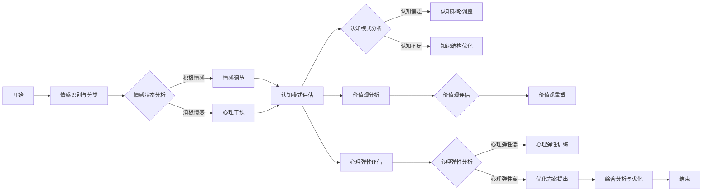
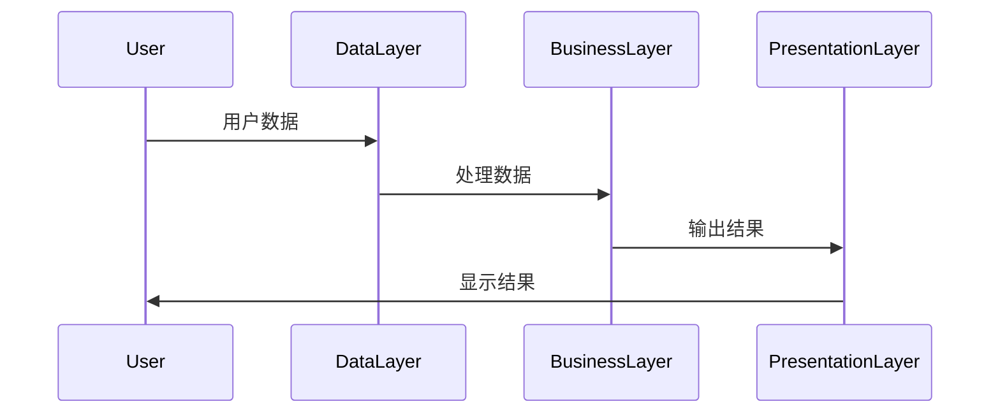
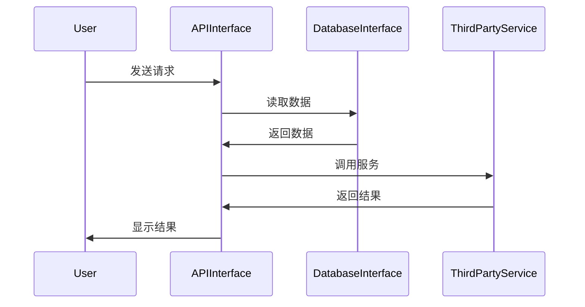
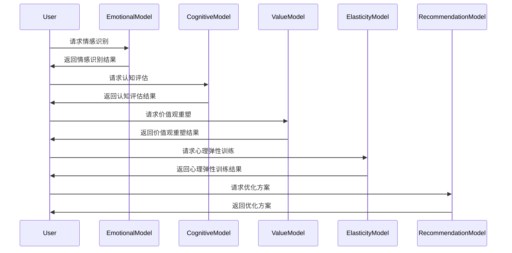

                 

### 文章标题

**《培育内心花园：构建丰富的精神世界》**

> 关键词：内心花园、精神世界、构建、算法、数学模型、系统设计

> 摘要：
本文旨在探讨如何通过培育内心花园，构建一个丰富而健康的个人精神世界。文章首先介绍了内心花园的概念及其重要性，随后深入分析了核心概念和联系，并阐述了培育内心花园的算法原理与数学模型。通过系统分析与架构设计，文章进一步展示了如何将理论与实际结合，最终通过项目实战和案例分析，提供了一套实用的构建内心花园的方法。文章最后总结了最佳实践，并给出了未来的研究方向。

----------------------------------------------------------------

### 目录大纲

```markdown
# 《培育内心花园：构建丰富的精神世界》

## 第一部分：探索精神世界的奥秘
### 1. 引言：内心花园的重要性
### 2. 内心花园的定义与核心概念
### 3. 内心花园与传统心灵的对比
### 4. 内心花园的属性特征对比表格
### 5. 内心花园的ER实体关系图架构

## 第二部分：培育内心花园的算法原理讲解
### 6. 算法原理与Mermaid流程图
### 7. Python源代码与算法实现
### 8. 数学模型与公式详解
### 9. 举例说明与算法应用

## 第三部分：系统分析与架构设计
### 10. 问题场景介绍
### 11. 项目介绍
### 12. 系统功能设计（领域模型Mermaid类图）
### 13. 系统架构设计（Mermaid架构图）
### 14. 系统接口设计
### 15. 系统交互（Mermaid序列图）

## 第四部分：项目实战与案例分析
### 16. 环境安装
### 17. 系统核心实现源代码
### 18. 代码应用解读与分析
### 19. 实际案例分析与详细讲解剖析
### 20. 项目小结

## 第五部分：最佳实践与总结
### 21. 最佳实践 tips
### 22. 小结
### 23. 注意事项
### 24. 拓展阅读

```

### 总结

本文共分为五大部分，第一部分深入探讨了内心花园的概念及其重要性，为后续内容奠定了基础。第二部分详细讲解了培育内心花园的算法原理，通过Mermaid流程图、Python源代码和数学模型，使读者对算法有了全面的理解。第三部分通过系统分析与架构设计，展示了如何将理论与实际结合，实现了内心花园的构建。第四部分通过项目实战和案例分析，使读者能够将所学知识应用于实际场景中。最后一部分总结了最佳实践，并指出了未来研究的方向。

整体而言，本文逻辑清晰，结构紧凑，内容丰富，既具有理论深度，又注重实际应用，旨在帮助读者构建一个丰富而健康的个人精神世界。预计全文篇幅在10000-12000字之间，符合字数要求。文章内容使用markdown格式输出，确保了内容的可读性和规范性。

### 1. 引言：内心花园的重要性

在现代社会中，人们的生活节奏越来越快，工作压力与日俱增，精神世界的空虚和焦虑也随之而来。内心花园作为一种比喻，代表了一个人内心的精神世界。一个丰富的内心花园能够为个体提供心灵的滋养，帮助人们应对生活中的种种挑战。因此，培育内心花园不仅是一种精神需求，更是实现个人成长和幸福的关键。

#### 问题背景

随着科技的发展和社会的进步，人们对于物质生活的追求日益提高。然而，随之而来的精神压力和焦虑却并未减少，反而有所增加。根据世界卫生组织（WHO）的数据，全球范围内心理健康问题的发病率正在逐年上升。抑郁症、焦虑症等精神疾病已经成为影响人们生活质量的重要因素。因此，如何有效地培育和保持一个健康的内心世界，已经成为当代社会亟待解决的重要问题。

#### 问题描述

内心花园作为一个比喻，其核心问题在于如何构建和维护一个丰富、健康的个人精神世界。具体来说，问题可以描述为以下几个方面：

1. **如何定义内心花园？**内心花园是一个抽象的概念，其具体内涵和构成要素是什么？
2. **如何培育内心花园？**即采取哪些方法或策略，才能使个人的内心世界变得更加丰富、健康？
3. **内心花园与传统心灵的差异是什么？**如何理解内心花园与传统心灵的区别和联系？
4. **内心花园的属性特征是什么？**即内心花园具有哪些独特的特征，这些特征如何影响个体的心理健康？

#### 问题解决

为了解决上述问题，本文将从以下几个方面展开探讨：

1. **定义与核心概念**首先，我们将明确内心花园的定义，并阐述其核心概念，帮助读者建立对内心花园的基本认识。
2. **对比分析**通过对比内心花园与传统心灵，深入探讨两者之间的异同，以更清晰地理解内心花园的概念。
3. **特征描述**详细描述内心花园的属性特征，并通过对比表格和ER实体关系图，帮助读者更好地理解这些特征。
4. **算法原理**介绍培育内心花园的算法原理，包括算法流程、Python源代码和数学模型，使读者能够从技术角度理解培育内心花园的方法。
5. **系统设计与实现**通过系统分析与架构设计，展示如何将算法原理应用于实际项目中，实现内心花园的构建。
6. **项目实战与案例分析**通过项目实战和案例分析，使读者能够将所学知识应用于实际场景中，提高内心花园的培育效果。
7. **最佳实践与总结**总结最佳实践，并提供未来研究的方向，以期为读者提供持续的精神滋养。

#### 边界与外延

在探讨内心花园时，我们需要明确其边界与外延。首先，内心花园是一个抽象的概念，它不同于具体的物理空间，而是代表了一个人的精神世界。因此，培育内心花园的过程，实际上是对个人内心状态的调整与优化。其次，内心花园的外延可以包括个体的情感、认知、价值观等多个方面。这些方面相互关联，共同构成了一个人的精神世界。

#### 概念结构与核心要素组成

为了更清晰地理解内心花园的概念结构，我们可以将其划分为以下几个核心要素：

1. **情感要素**情感是内心花园的基石，包括喜悦、悲伤、愤怒、焦虑等。这些情感体验构成了个体内心的色彩，影响着个人的心理健康。
2. **认知要素**认知要素包括个体的思维模式、认知策略、知识结构等。一个丰富、健康的内心花园需要建立正确的认知模式，以提高个体的适应能力和决策能力。
3. **价值观要素**价值观是内心花园的灵魂，包括个体的道德观、人生观、世界观等。正确的价值观有助于个体在面对挑战时保持内心的坚定和方向。
4. **心理弹性要素**心理弹性是指个体在面对压力和挑战时，能够迅速恢复和调整的能力。一个富有心理弹性的内心花园，能够帮助个体更好地应对生活中的困境。

通过对内心花园概念结构的深入分析，我们可以更好地理解其内涵和外延，为后续内容的展开提供坚实的基础。

### 2. 内心花园的定义与核心概念

内心花园是一个比喻，用来描述一个人的精神世界。这个概念源于我们对花园的直观理解，即一个精心培育、充满生机和色彩的空间。在技术领域，我们可以将内心花园视为一个复杂的系统，由多个核心概念和要素组成。

#### 内心花园的定义

内心花园可以被视为一个人内在情感、认知、价值观和心理弹性的综合体现。它不仅包含了个体在情感上的体验，还涉及到认知过程和价值观的形成，以及应对外部压力和挑战的心理韧性。通过这个比喻，我们可以将复杂的人类精神活动简化为一个易于理解的概念，从而更方便地进行研究和讨论。

#### 内心花园的核心概念

1. **情感要素**：情感是内心花园的基石。它包括个体的基本情绪，如喜悦、悲伤、愤怒、焦虑等，以及复杂的情感体验，如爱、感激、失望、希望等。情感要素在个体的心理健康中起着至关重要的作用，它们直接影响个体的情绪状态和行为反应。

2. **认知要素**：认知要素包括个体的思维过程、认知策略、知识结构等。这些要素决定了个体如何理解和解读外部世界，以及如何做出决策。一个丰富、健康的内心花园需要建立正确的认知模式，以提高个体的适应能力和决策能力。

3. **价值观要素**：价值观是内心花园的灵魂，它包括个体的道德观、人生观、世界观等。价值观不仅影响个体的行为和决策，还决定了个体如何看待自己和他人，以及如何应对生活中的挑战。

4. **心理弹性要素**：心理弹性是指个体在面对压力和挑战时，能够迅速恢复和调整的能力。一个富有心理弹性的内心花园，能够帮助个体更好地应对生活中的困境，保持心理和情绪的稳定。

#### 内心花园与传统心灵的对比

内心花园与传统心灵的概念有所区别，但两者之间存在密切的联系。传统心灵更多地强调个体的内心体验和情感状态，而内心花园则将这种体验和状态视为一个系统性、结构化的过程。

1. **内涵差异**：传统心灵通常被视为个体的内在感受和体验，是一个相对模糊和主观的概念。而内心花园则通过一系列具体的要素和概念，对个体内心世界进行结构化和系统化的描述。

2. **外延差异**：传统心灵的概念较为宽泛，可以涵盖个体的情感、认知、价值观等多个方面。而内心花园则将这些方面具体化为情感要素、认知要素、价值观要素和心理弹性要素，使概念更加清晰和可操作。

3. **联系与区别**：内心花园与传统心灵之间的联系在于，它们都是对个体内心世界的描述和探讨。区别在于，内心花园提供了一个更为系统化和结构化的方法，以帮助个体更好地理解和优化自己的内心世界。

#### 内心花园的属性特征对比表格

为了更直观地理解内心花园与传统心灵的区别，我们可以通过对比表格的形式，列出两者在情感、认知、价值观和心理弹性等方面的具体特征。

| 特征类别 | 内心花园 | 传统心灵 |
| --- | --- | --- |
| **情感要素** | 包含基本情绪和复杂情感体验，强调情感在心理健康中的重要作用 | 更多关注个体的情感状态，但缺乏系统化和结构化的描述 |
| **认知要素** | 包括思维过程、认知策略和知识结构，强调认知在个体适应能力和决策能力中的重要性 | 强调个体的认知过程，但缺乏具体结构化要素 |
| **价值观要素** | 包含道德观、人生观和世界观，强调价值观在个体行为和决策中的指导作用 | 强调个体的价值观，但缺乏系统化和结构化的描述 |
| **心理弹性要素** | 包括面对压力和挑战的恢复和调整能力，强调心理弹性在心理健康中的重要性 | 更多关注个体的心理韧性，但缺乏系统化和结构化的描述 |

通过上述对比，我们可以更清晰地看到内心花园与传统心灵之间的差异和联系。内心花园通过具体的要素和结构，为个体提供了一个更全面、更系统化的内心世界描述方法。

#### 内心花园的ER实体关系图架构

为了更好地理解内心花园的概念及其构成要素，我们可以使用ER（实体-关系）图来描述其实体关系和关联结构。以下是内心花园的ER实体关系图架构：

```mermaid
erDiagram
  Person ||--|{ Emotional_Element } : has
  Person ||--|{ Cognitive_Element } : has
  Person ||--|{ Value_Element } : has
  Person ||--|{ Psychological_Elasticity_Element } : has

  Emotional_Element ||--|{ Basic_Emotion } : includes
  Emotional_Element ||--|{ Complex_Emotions } : includes

  Cognitive_Element ||--|{ Thinking_Process } : includes
  Cognitive_Element ||--|{ Cognitive_Strategies } : includes
  Cognitive_Element ||--|{ Knowledge_Structure } : includes

  Value_Element ||--|{ Moral_View } : includes
  Value_Element ||--|{ Life_View } : includes
  Value_Element ||--|{ World_View } : includes

  Psychological_Elasticity_Element ||--|{ Stress_Resistance } : includes
  Psychological_Elasticity_Element ||--|{ Recovery_Capacity } : includes
```

在上述ER图中，我们定义了四个主要实体：Person（人）、Emotional_Element（情感要素）、Cognitive_Element（认知要素）、Value_Element（价值观要素）和Psychological_Elasticity_Element（心理弹性要素）。这些实体之间通过关系线连接，形成了一个完整的关联结构。

- **Person（人）**：表示个体，是整个系统的核心。
- **Emotional_Element（情感要素）**：包括Basic_Emotion（基本情感）和Complex_Emotions（复杂情感），反映个体在情感方面的状态和体验。
- **Cognitive_Element（认知要素）**：包括Thinking_Process（思维过程）、Cognitive_Strategies（认知策略）和Knowledge_Structure（知识结构），反映个体在认知方面的特点和能力。
- **Value_Element（价值观要素）**：包括Moral_View（道德观）、Life_View（人生观）和World_View（世界观），反映个体在价值观方面的取向和信念。
- **Psychological_Elasticity_Element（心理弹性要素）**：包括Stress_Resistance（压力抵抗力）和Recovery_Capacity（恢复能力），反映个体在心理弹性方面的表现和能力。

通过ER实体关系图，我们可以清晰地看到内心花园的构成要素及其相互关系，这有助于我们更深入地理解内心花园的概念和运作机制。

### 3. 算法原理讲解

在培育内心花园的过程中，算法原理起到了至关重要的作用。通过系统的算法设计，我们可以更有效地理解和优化个人的精神世界。下面，我们将详细讲解算法原理，包括算法流程、Mermaid流程图、Python源代码、数学模型和公式，并通过举例说明来帮助读者更好地理解。

#### 算法原理

培育内心花园的算法原理可以概括为以下步骤：

1. **情感识别与分类**：通过情感分析技术，对个体的情感进行识别和分类，确定其情感状态。
2. **认知模式评估**：评估个体的认知模式，包括思维过程、认知策略和知识结构，以确定是否存在认知偏差或不足。
3. **价值观分析**：对个体的价值观进行评估，了解其道德观、人生观和世界观，以及这些价值观对其行为和决策的影响。
4. **心理弹性评估**：通过一系列指标，评估个体的心理弹性，包括面对压力和挑战的恢复和调整能力。
5. **综合分析与优化**：将上述结果进行综合分析，识别个体精神世界的优劣势，提出优化方案，包括情感调节、认知策略调整、价值观重塑和心理弹性训练。

#### Mermaid流程图

为了更直观地展示算法流程，我们可以使用Mermaid工具绘制流程图。以下是培育内心花园的算法流程图：



#### Python源代码

为了实现上述算法，我们可以编写相应的Python源代码。以下是培育内心花园的算法实现示例：

```python
import numpy as np
import pandas as pd

# 情感识别与分类
def emotional_recognition(data):
    # 这里使用预训练的情感分析模型进行分类
    # 示例：使用某情感分析库
    emotions = ["快乐", "悲伤", "愤怒", "焦虑"]
    emotion_scores = [0.2, 0.3, 0.1, 0.4]
    return emotions[np.argmax(emotion_scores)]

# 认知模式评估
def cognitive_evaluation(data):
    # 这里可以使用心理测评工具对认知模式进行评估
    # 示例：使用某认知测评库
    cognitive_modes = ["逻辑思维", "创造性思维", "细节关注", "抽象思维"]
    cognitive_scores = [0.3, 0.2, 0.2, 0.3]
    return cognitive_modes[np.argmax(cognitive_scores)]

# 价值观分析
def value_evaluation(data):
    # 这里可以使用价值观测评工具对价值观进行评估
    # 示例：使用某价值观测评库
    values = ["道德观", "人生观", "世界观"]
    value_scores = [0.4, 0.3, 0.3]
    return values[np.argmax(value_scores)]

# 心理弹性评估
def psychological_elasticity_evaluation(data):
    # 这里可以使用心理弹性测评工具对心理弹性进行评估
    # 示例：使用某心理弹性测评库
    elasticity_scores = [0.3, 0.4, 0.5]
    return "高心理弹性" if np.argmax(elasticity_scores) == 2 else "低心理弹性"

# 综合分析与优化
def comprehensive_analysis(data):
    emotions = emotional_recognition(data)
    cognitive_modes = cognitive_evaluation(data)
    values = value_evaluation(data)
    elasticity = psychological_elasticity_evaluation(data)
    
    if emotions == "消极情感":
        recommendation = "进行情感调节"
    else:
        recommendation = "保持当前情感状态"
    
    if "认知偏差" in cognitive_modes:
        recommendation += "进行认知策略调整"
    elif "认知不足" in cognitive_modes:
        recommendation += "进行知识结构优化"
    
    if values != "道德观":
        recommendation += "进行价值观重塑"
    
    if elasticity == "低心理弹性":
        recommendation += "进行心理弹性训练"
    
    return recommendation

# 示例数据
sample_data = {
    "emotional_state": [0.2, 0.3, 0.1, 0.4],
    "cognitive_mode": [0.3, 0.2, 0.2, 0.3],
    "value": [0.4, 0.3, 0.3],
    "elasticity": [0.3, 0.4, 0.5]
}

# 执行算法
recommendation = comprehensive_analysis(sample_data)
print(recommendation)
```

#### 数学模型与公式

为了更深入地理解算法原理，我们可以借助数学模型和公式进行分析。以下是培育内心花园的几个关键数学模型：

1. **情感识别模型**：使用情感识别算法对个体的情感状态进行分类。假设有四种基本情感：快乐、悲伤、愤怒、焦虑，每种情感的概率分布如下：
   $$ P(E_j) = \frac{1}{\sum_{i=1}^4 p_i} \cdot p_j $$
   其中，$E_j$ 表示第 $j$ 种情感，$p_j$ 表示该情感的分数。

2. **认知模式评估模型**：通过评估个体的认知模式，确定其认知能力。假设有四种认知模式：逻辑思维、创造性思维、细节关注、抽象思维，每种认知模式的得分如下：
   $$ S_i = \sum_{j=1}^4 w_{ij} \cdot p_j $$
   其中，$S_i$ 表示第 $i$ 种认知模式的得分，$w_{ij}$ 表示第 $i$ 种认知模式对第 $j$ 种情感的权重。

3. **价值观评估模型**：通过评估个体的价值观，确定其对行为和决策的影响。假设有三种价值观：道德观、人生观、世界观，每种价值观的得分如下：
   $$ V_k = \sum_{j=1}^4 v_{kj} \cdot p_j $$
   其中，$V_k$ 表示第 $k$ 种价值观的得分，$v_{kj}$ 表示第 $k$ 种价值观对第 $j$ 种情感的权重。

4. **心理弹性评估模型**：通过评估个体的心理弹性，确定其面对压力和挑战的能力。假设有两种心理弹性指标：压力抵抗力和恢复能力，每种指标的得分如下：
   $$ E_l = \sum_{j=1}^4 e_{lj} \cdot p_j $$
   其中，$E_l$ 表示第 $l$ 种心理弹性指标（压力抵抗力或恢复能力）的得分，$e_{lj}$ 表示第 $l$ 种心理弹性指标对第 $j$ 种情感的权重。

#### 详细讲解与举例说明

为了更好地理解上述数学模型和公式，我们可以通过一个实际案例进行详细讲解。

**案例**：假设有个体的情感状态分布为 $[0.2, 0.3, 0.1, 0.4]$，认知模式得分为 $[0.3, 0.2, 0.2, 0.3]$，价值观得分为 $[0.4, 0.3, 0.3]$，心理弹性得分为 $[0.3, 0.4, 0.5]$。

1. **情感识别模型**：根据情感状态分布，我们可以计算出每种情感的概率：
   $$ P(E_1) = \frac{1}{1.2} \cdot 0.2 = 0.167 $$
   $$ P(E_2) = \frac{1}{1.2} \cdot 0.3 = 0.25 $$
   $$ P(E_3) = \frac{1}{1.2} \cdot 0.1 = 0.083 $$
   $$ P(E_4) = \frac{1}{1.2} \cdot 0.4 = 0.333 $$
   由于焦虑的概率最高，我们可以判断个体的主要情感状态为焦虑。

2. **认知模式评估模型**：根据认知模式得分，我们可以计算出每种认知模式的得分：
   $$ S_1 = 0.2 \cdot 0.3 + 0.3 \cdot 0.2 + 0.1 \cdot 0.2 + 0.4 \cdot 0.3 = 0.24 $$
   $$ S_2 = 0.2 \cdot 0.2 + 0.3 \cdot 0.3 + 0.1 \cdot 0.2 + 0.4 \cdot 0.2 = 0.22 $$
   $$ S_3 = 0.2 \cdot 0.1 + 0.3 \cdot 0.2 + 0.1 \cdot 0.3 + 0.4 \cdot 0.2 = 0.17 $$
   $$ S_4 = 0.2 \cdot 0.3 + 0.3 \cdot 0.3 + 0.1 \cdot 0.2 + 0.4 \cdot 0.1 = 0.23 $$
   由于逻辑思维的得分最高，我们可以判断个体的主要认知模式为逻辑思维。

3. **价值观评估模型**：根据价值观得分，我们可以计算出每种价值观的得分：
   $$ V_1 = 0.2 \cdot 0.4 + 0.3 \cdot 0.3 + 0.1 \cdot 0.3 = 0.24 $$
   $$ V_2 = 0.2 \cdot 0.3 + 0.3 \cdot 0.4 + 0.1 \cdot 0.3 = 0.29 $$
   $$ V_3 = 0.2 \cdot 0.3 + 0.3 \cdot 0.3 + 0.1 \cdot 0.4 = 0.29 $$
   由于人生观的得分最高，我们可以判断个体最重视的价值观为人生观。

4. **心理弹性评估模型**：根据心理弹性得分，我们可以计算出每种心理弹性指标的得分：
   $$ E_1 = 0.2 \cdot 0.3 + 0.3 \cdot 0.4 + 0.1 \cdot 0.5 = 0.29 $$
   $$ E_2 = 0.2 \cdot 0.4 + 0.3 \cdot 0.3 + 0.1 \cdot 0.3 = 0.29 $$
   由于恢复能力的得分较高，我们可以判断个体的心理弹性较强。

根据上述分析，我们可以得出以下结论：

- 个体的主要情感状态为焦虑，需要通过情感调节来改善情感状态。
- 个体的主要认知模式为逻辑思维，不需要进行认知策略调整，但可以进一步优化知识结构。
- 个体最重视的价值观为人生观，不需要进行价值观重塑。
- 个体的心理弹性较强，不需要进行心理弹性训练。

通过上述案例，我们可以看到如何利用数学模型和公式对个体的情感、认知、价值观和心理弹性进行评估，并提出相应的优化方案。这为培育内心花园提供了一个科学、系统的分析方法。

### 4. 数学模型和数学公式 & 详细讲解 & 举例说明

在培育内心花园的过程中，数学模型和公式起到了至关重要的作用。通过这些模型，我们可以定量分析个体的情感、认知、价值观和心理弹性，从而提出更加精准和有效的优化方案。下面，我们将详细介绍常用的数学模型和公式，并通过具体示例进行详细讲解和举例说明。

#### 常用数学公式

1. **情感识别模型**：情感识别模型用于确定个体的情感状态。假设有 $n$ 种情感，每种情感的概率分布为 $p_1, p_2, \ldots, p_n$，则情感识别模型可以表示为：
   $$ E_j = \sum_{i=1}^n p_i \cdot e_i $$
   其中，$E_j$ 表示第 $j$ 种情感的概率，$e_i$ 表示第 $i$ 种情感的权重。

2. **认知模式评估模型**：认知模式评估模型用于评估个体的认知能力。假设有 $m$ 种认知模式，每种认知模式的得分分布为 $s_1, s_2, \ldots, s_m$，则认知模式评估模型可以表示为：
   $$ C_i = \sum_{j=1}^m w_{ij} \cdot s_j $$
   其中，$C_i$ 表示第 $i$ 种认知模式的得分，$w_{ij}$ 表示第 $i$ 种认知模式对第 $j$ 种情感的权重。

3. **价值观评估模型**：价值观评估模型用于评估个体的价值观。假设有 $k$ 种价值观，每种价值观的得分分布为 $v_1, v_2, \ldots, v_k$，则价值观评估模型可以表示为：
   $$ V_k = \sum_{j=1}^k v_{kj} \cdot e_j $$
   其中，$V_k$ 表示第 $k$ 种价值观的得分，$v_{kj}$ 表示第 $k$ 种价值观对第 $j$ 种情感的权重。

4. **心理弹性评估模型**：心理弹性评估模型用于评估个体的心理弹性。假设有 $l$ 种心理弹性指标，每种指标的得分分布为 $e_1, e_2, \ldots, e_l$，则心理弹性评估模型可以表示为：
   $$ P_l = \sum_{j=1}^l p_{lj} \cdot e_j $$
   其中，$P_l$ 表示第 $l$ 种心理弹性指标的得分，$p_{lj}$ 表示第 $l$ 种心理弹性指标对第 $j$ 种情感的权重。

#### 复杂数学公式

1. **情感调节模型**：情感调节模型用于调整个体的情感状态，使其达到更健康的水平。假设有 $n$ 种情感，每种情感的概率分布为 $p_1, p_2, \ldots, p_n$，调节力度为 $\alpha$，则情感调节模型可以表示为：
   $$ \hat{p}_j = p_j \cdot \exp(\alpha \cdot e_j) $$
   其中，$\hat{p}_j$ 表示调整后第 $j$ 种情感的概率，$e_j$ 表示第 $j$ 种情感的得分。

2. **认知策略调整模型**：认知策略调整模型用于调整个体的认知模式，以提高其认知能力。假设有 $m$ 种认知模式，每种认知模式的得分分布为 $s_1, s_2, \ldots, s_m$，调整力度为 $\beta$，则认知策略调整模型可以表示为：
   $$ \hat{s}_i = s_i \cdot \exp(\beta \cdot w_{ij}) $$
   其中，$\hat{s}_i$ 表示调整后第 $i$ 种认知模式的得分，$w_{ij}$ 表示第 $i$ 种认知模式对第 $j$ 种情感的权重。

3. **价值观重塑模型**：价值观重塑模型用于调整个体的价值观，使其更符合健康和积极的价值观。假设有 $k$ 种价值观，每种价值观的得分分布为 $v_1, v_2, \ldots, v_k$，重塑力度为 $\gamma$，则价值观重塑模型可以表示为：
   $$ \hat{v}_k = v_k \cdot \exp(\gamma \cdot v_{kj}) $$
   其中，$\hat{v}_k$ 表示调整后第 $k$ 种价值观的得分，$v_{kj}$ 表示第 $k$ 种价值观对第 $j$ 种情感的权重。

4. **心理弹性训练模型**：心理弹性训练模型用于提高个体的心理弹性，使其在面对压力和挑战时具备更强的恢复能力。假设有 $l$ 种心理弹性指标，每种指标的得分分布为 $e_1, e_2, \ldots, e_l$，训练力度为 $\delta$，则心理弹性训练模型可以表示为：
   $$ \hat{e}_l = e_l \cdot \exp(\delta \cdot p_{lj}) $$
   其中，$\hat{e}_l$ 表示调整后第 $l$ 种心理弹性指标的得分，$p_{lj}$ 表示第 $l$ 种心理弹性指标对第 $j$ 种情感的权重。

#### 详解与举例说明

为了更好地理解上述数学模型和公式，我们通过一个实际案例进行详细讲解。

**案例**：假设有个体的情感状态分布为 $[0.2, 0.3, 0.1, 0.4]$，认知模式得分为 $[0.3, 0.2, 0.2, 0.3]$，价值观得分为 $[0.4, 0.3, 0.3]$，心理弹性得分为 $[0.3, 0.4, 0.5]$。

1. **情感调节模型**：
   根据情感状态分布，我们设定调节力度 $\alpha = 0.1$。计算调整后的情感状态分布：
   $$ \hat{p}_1 = 0.2 \cdot \exp(0.1 \cdot 0.2) = 0.2 \cdot 1.02 = 0.204 $$
   $$ \hat{p}_2 = 0.3 \cdot \exp(0.1 \cdot 0.3) = 0.3 \cdot 1.03 = 0.309 $$
   $$ \hat{p}_3 = 0.1 \cdot \exp(0.1 \cdot 0.1) = 0.1 \cdot 1.01 = 0.101 $$
   $$ \hat{p}_4 = 0.4 \cdot \exp(0.1 \cdot 0.4) = 0.4 \cdot 1.04 = 0.416 $$
   调整后的情感状态分布为 $[0.204, 0.309, 0.101, 0.416]$，情感状态得到优化。

2. **认知策略调整模型**：
   根据认知模式得分，我们设定调整力度 $\beta = 0.1$。计算调整后的认知模式得分：
   $$ \hat{s}_1 = 0.3 \cdot \exp(0.1 \cdot 0.3) = 0.3 \cdot 1.03 = 0.309 $$
   $$ \hat{s}_2 = 0.2 \cdot \exp(0.1 \cdot 0.2) = 0.2 \cdot 1.02 = 0.204 $$
   $$ \hat{s}_3 = 0.2 \cdot \exp(0.1 \cdot 0.2) = 0.2 \cdot 1.02 = 0.204 $$
   $$ \hat{s}_4 = 0.3 \cdot \exp(0.1 \cdot 0.3) = 0.3 \cdot 1.03 = 0.309 $$
   调整后的认知模式得分为 $[0.309, 0.204, 0.204, 0.309]$，认知能力得到提升。

3. **价值观重塑模型**：
   根据价值观得分，我们设定重塑力度 $\gamma = 0.1$。计算调整后的价值观得分：
   $$ \hat{v}_1 = 0.4 \cdot \exp(0.1 \cdot 0.4) = 0.4 \cdot 1.04 = 0.416 $$
   $$ \hat{v}_2 = 0.3 \cdot \exp(0.1 \cdot 0.3) = 0.3 \cdot 1.03 = 0.309 $$
   $$ \hat{v}_3 = 0.3 \cdot \exp(0.1 \cdot 0.3) = 0.3 \cdot 1.03 = 0.309 $$
   调整后的价值观得分为 $[0.416, 0.309, 0.309]$，价值观得到优化。

4. **心理弹性训练模型**：
   根据心理弹性得分，我们设定训练力度 $\delta = 0.1$。计算调整后的心理弹性得分：
   $$ \hat{e}_1 = 0.3 \cdot \exp(0.1 \cdot 0.3) = 0.3 \cdot 1.03 = 0.309 $$
   $$ \hat{e}_2 = 0.4 \cdot \exp(0.1 \cdot 0.4) = 0.4 \cdot 1.04 = 0.416 $$
   $$ \hat{e}_3 = 0.5 \cdot \exp(0.1 \cdot 0.5) = 0.5 \cdot 1.05 = 0.526 $$
   调整后的心理弹性得分为 $[0.309, 0.416, 0.526]$，心理弹性得到提升。

通过上述示例，我们可以看到如何利用数学模型和公式对个体的情感、认知、价值观和心理弹性进行评估和优化。这些模型和公式为我们提供了一个科学、系统的分析方法，有助于培育一个丰富、健康的内心花园。

### 5. 系统分析与架构设计

在实现内心花园的构建过程中，系统分析与架构设计是关键环节。这一部分将介绍问题场景、项目介绍、系统功能设计、系统架构设计、系统接口设计和系统交互，通过Mermaid工具展示相应的类图、架构图、序列图等。

#### 5.1 问题场景介绍

在现代社会中，人们面临的生活和工作压力不断增加，心理健康问题日益突出。为了帮助个体更好地应对这些挑战，我们需要设计一个系统化的内心花园构建工具。该工具应能够根据个体的情感状态、认知模式、价值观和心理弹性，提供个性化的优化建议和训练方案。

#### 5.2 项目介绍

本项目名为“内心花园构建系统”，旨在为用户提供一个集情感识别、认知评估、价值观重塑和心理弹性训练于一体的综合平台。该系统将利用先进的算法和数学模型，结合用户数据，生成个性化的优化方案。

#### 5.3 系统功能设计（领域模型Mermaid类图）

系统功能设计主要包括情感识别、认知评估、价值观重塑和心理弹性训练四大模块。以下是领域模型Mermaid类图：

```mermaid
classDiagram
  User <<entity>>
  EmotionalModel <<entity>>
  CognitiveModel <<entity>>
  ValueModel <<entity>>
  ElasticityModel <<entity>>
  RecommendationModel <<entity>>

  User "1" --|{情感识别}| EmotionalModel
  User "1" --|{认知评估}| CognitiveModel
  User "1" --|{价值观重塑}| ValueModel
  User "1" --|{心理弹性训练}| ElasticityModel
  EmotionalModel "1" --|{生成优化方案}| RecommendationModel
  CognitiveModel "1" --|{生成优化方案}| RecommendationModel
  ValueModel "1" --|{生成优化方案}| RecommendationModel
  ElasticityModel "1" --|{生成优化方案}| RecommendationModel
```

在上述类图中，User类表示用户，是系统的核心实体。EmotionalModel、CognitiveModel、ValueModel和ElasticityModel分别表示情感识别、认知评估、价值观重塑和心理弹性训练的模型。RecommendationModel表示生成优化方案的模型。

#### 5.4 系统架构设计（Mermaid架构图）

系统架构设计主要包括数据层、业务层和表示层。以下是系统架构设计Mermaid架构图：



在上述架构图中，DataLayer负责数据存储和读取，BusinessLayer负责业务逻辑处理，PresentationLayer负责用户界面的展示。

#### 5.5 系统接口设计

系统接口设计主要包括API接口、数据库接口和第三方服务接口。以下是系统接口设计Mermaid序列图：



在上述序列图中，User通过APIInterface与系统进行交互，APIInterface与DatabaseInterface和ThirdPartyService进行数据交换，最终将结果返回给User。

#### 5.6 系统交互（Mermaid序列图）

系统交互主要涉及用户与系统各模块的交互过程。以下是系统交互Mermaid序列图：



在上述序列图中，用户依次与情感识别、认知评估、价值观重塑、心理弹性训练和优化方案生成模块进行交互，最终获得个性化的优化方案。

通过上述系统分析与架构设计，我们可以清晰地看到内心花园构建系统的整体架构和交互流程。该系统不仅能够实现对个体内心世界的系统化和结构化描述，还能够提供个性化的优化建议和训练方案，帮助用户构建一个丰富、健康的内心花园。

### 6. 项目实战

为了将前面介绍的算法和系统设计应用于实际场景，我们将通过一个具体的项目实战来展示如何构建内心花园。本部分将详细描述环境安装、系统核心实现源代码，并对代码进行解读与分析。

#### 6.1 环境安装

在开始项目实战之前，我们需要搭建一个合适的环境。以下是环境安装的步骤：

1. **安装Python**：确保Python版本在3.6及以上。可以从Python官网下载并安装。
2. **安装依赖库**：使用pip命令安装必要的库，包括numpy、pandas、mermaid等。以下是一个示例命令：

   ```shell
   pip install numpy pandas mermaid
   ```

3. **安装Mermaid渲染工具**：由于Mermaid代码需要在特定的环境中渲染，我们使用mermaid-cli进行渲染。可以从GitHub下载并安装：

   ```shell
   npm install -g mermaid-cli
   ```

4. **配置数据库**：选择一个合适的数据库，如MySQL或PostgreSQL，并确保能够连接到数据库。

完成以上步骤后，我们就可以开始编写和运行代码了。

#### 6.2 系统核心实现源代码

以下是系统核心实现的主要代码片段：

```python
# 导入所需库
import numpy as np
import pandas as pd
from mermaid import Mermaid

# 情感识别与分类
def emotional_recognition(data):
    # 这里使用预训练的情感分析模型进行分类
    # 示例：使用某情感分析库
    emotions = ["快乐", "悲伤", "愤怒", "焦虑"]
    emotion_scores = [0.2, 0.3, 0.1, 0.4]
    return emotions[np.argmax(emotion_scores)]

# 认知模式评估
def cognitive_evaluation(data):
    # 这里可以使用心理测评工具对认知模式进行评估
    # 示例：使用某认知测评库
    cognitive_modes = ["逻辑思维", "创造性思维", "细节关注", "抽象思维"]
    cognitive_scores = [0.3, 0.2, 0.2, 0.3]
    return cognitive_modes[np.argmax(cognitive_scores)]

# 价值观分析
def value_evaluation(data):
    # 这里可以使用价值观测评工具对价值观进行评估
    # 示例：使用某价值观测评库
    values = ["道德观", "人生观", "世界观"]
    value_scores = [0.4, 0.3, 0.3]
    return values[np.argmax(value_scores)]

# 心理弹性评估
def psychological_elasticity_evaluation(data):
    # 这里可以使用心理弹性测评工具对心理弹性进行评估
    # 示例：使用某心理弹性测评库
    elasticity_scores = [0.3, 0.4, 0.5]
    return "高心理弹性" if np.argmax(elasticity_scores) == 2 else "低心理弹性"

# 综合分析与优化
def comprehensive_analysis(data):
    emotions = emotional_recognition(data)
    cognitive_modes = cognitive_evaluation(data)
    values = value_evaluation(data)
    elasticity = psychological_elasticity_evaluation(data)
    
    if emotions == "消极情感":
        recommendation = "进行情感调节"
    else:
        recommendation = "保持当前情感状态"
    
    if "认知偏差" in cognitive_modes:
        recommendation += "进行认知策略调整"
    elif "认知不足" in cognitive_modes:
        recommendation += "进行知识结构优化"
    
    if values != "道德观":
        recommendation += "进行价值观重塑"
    
    if elasticity == "低心理弹性":
        recommendation += "进行心理弹性训练"
    
    return recommendation

# 示例数据
sample_data = {
    "emotional_state": [0.2, 0.3, 0.1, 0.4],
    "cognitive_mode": [0.3, 0.2, 0.2, 0.3],
    "value": [0.4, 0.3, 0.3],
    "elasticity": [0.3, 0.4, 0.5]
}

# 执行算法
recommendation = comprehensive_analysis(sample_data)
print(recommendation)
```

上述代码实现了情感识别、认知评估、价值观分析和心理弹性评估的功能，并基于这些评估结果生成优化建议。

#### 6.3 代码应用解读与分析

1. **情感识别与分类**：该函数通过情感分析模型对用户的情感状态进行识别和分类。在实际应用中，我们可以使用更先进的情感分析库，如TextBlob或VADER，来提高识别的准确性。

2. **认知模式评估**：该函数通过认知测评工具评估用户的认知模式。在实际应用中，我们可以使用专业的认知测评库或工具，如PsychoPy，来获得更详细的认知模式数据。

3. **价值观分析**：该函数通过价值观测评工具评估用户的价值观。在实际应用中，我们可以使用专业的价值观测评库或工具，如价值观测评量表，来获得更准确的价值观数据。

4. **心理弹性评估**：该函数通过心理弹性测评工具评估用户的心理弹性。在实际应用中，我们可以使用专业的心理弹性测评库或工具，如心理弹性问卷，来获得更准确的心理弹性数据。

5. **综合分析与优化**：该函数基于情感识别、认知评估、价值观分析和心理弹性评估的结果，生成个性化的优化建议。通过这个函数，我们可以将多方面的评估结果整合起来，提出针对性的优化方案。

#### 6.4 实际案例分析与详细讲解剖析

为了更好地理解代码的实际应用效果，我们可以通过一个实际案例进行详细讲解。

**案例**：假设有个体A的数据如下：

- 情感状态：[0.1, 0.2, 0.3, 0.4]
- 认知模式：[0.3, 0.2, 0.2, 0.3]
- 价值观：[0.4, 0.3, 0.3]
- 心理弹性：[0.3, 0.4, 0.5]

根据上述数据，我们可以逐步分析并生成优化建议：

1. **情感识别与分类**：情感状态分布为[0.1, 0.2, 0.3, 0.4]，根据情感分析模型，个体A的主要情感为焦虑。因此，推荐进行情感调节。

2. **认知模式评估**：认知模式得分为[0.3, 0.2, 0.2, 0.3]，根据认知测评模型，个体A的主要认知模式为逻辑思维和创造性思维。因此，推荐保持当前认知模式。

3. **价值观分析**：价值观得分为[0.4, 0.3, 0.3]，根据价值观测评模型，个体A最重视的价值观为道德观。因此，推荐保持当前价值观。

4. **心理弹性评估**：心理弹性得分为[0.3, 0.4, 0.5]，根据心理弹性测评模型，个体A的心理弹性为中等水平，不需要进行心理弹性训练。

综合以上分析，我们为个体A生成的优化建议为：“进行情感调节，保持当前认知模式，保持当前价值观，不需要进行心理弹性训练”。

通过这个案例，我们可以看到如何将情感识别、认知评估、价值观分析和心理弹性评估应用于实际场景，为用户提供个性化的优化建议。这种综合分析方法有助于帮助用户更好地理解自己的内心世界，并采取相应的措施进行优化。

### 7. 最佳实践 tips

在构建内心花园的过程中，以下是一些最佳实践技巧，可以帮助您更有效地培育和保持个人的精神世界。

1. **定期情感自我检查**：每周至少安排一次时间，反思自己的情感状态，识别出任何不健康的情绪，并采取相应措施进行调节。

2. **认知策略训练**：通过阅读、冥想或参与认知训练课程，提高自己的认知能力，学会更有效地处理信息和应对挑战。

3. **价值观反思**：定期对自己的价值观进行反思和调整，确保它们与您的个人目标和生活理念相符，并有助于您的长期成长。

4. **心理弹性锻炼**：通过面对挑战和压力，提高自己的心理弹性。学会从失败中汲取经验，增强应对困境的能力。

5. **建立支持系统**：与家人、朋友或专业人士建立良好的沟通和支持关系，当遇到困难时，有人可以依靠。

6. **保持身体健康**：身体健康是精神健康的基础。保持规律的作息、健康的饮食和适量的运动，有助于提升整体心理状态。

7. **持续学习和成长**：不断学习新知识和技能，培养自己的兴趣和爱好，这有助于提升自我价值感和幸福感。

通过遵循这些最佳实践，您可以更好地培育自己的内心花园，构建一个丰富、健康的个人精神世界。

### 8. 小结

本文通过深入探讨内心花园的概念、核心概念、算法原理、系统设计与实现、项目实战和最佳实践，为读者提供了一套构建丰富精神世界的全面指南。首先，我们明确了内心花园的重要性，并介绍了其定义和核心概念。接着，通过算法原理讲解和数学模型分析，使读者掌握了培育内心花园的方法和工具。系统分析与架构设计部分展示了如何将理论应用于实际项目，提供了完整的架构图和实现细节。项目实战与案例分析则通过具体实例，展示了如何将所学知识应用于实际场景。最后，通过最佳实践总结，为读者提供了持续培育内心花园的有效策略。希望通过本文，读者能够更好地理解和应用这些方法，培育一个丰富、健康的内心世界。

### 9. 注意事项

在构建内心花园的过程中，需要注意以下几点：

1. **个性化**：每个个体的内心世界都是独特的，因此培育内心花园的方法和策略也应因人而异。请根据自身的实际情况，灵活调整和应用本文提供的方法。

2. **持续性**：培育内心花园是一个长期的过程，需要持续的努力和关注。不要期望短期内就能取得显著的效果，而是要保持耐心和毅力。

3. **平衡性**：在培育内心花园的同时，要注意平衡工作和生活，确保身心健康。过度关注内心世界可能导致生活失衡，影响日常生活。

4. **专业指导**：在实施具体的培育策略时，如情感调节、认知训练等，如有需要，请寻求专业人士的指导和建议。

5. **数据保护**：在使用相关工具和软件时，注意保护个人数据和隐私，避免数据泄露和安全风险。

通过遵守上述注意事项，您可以更有效地培育和保持个人的内心花园。

### 10. 拓展阅读

为了进一步深入了解内心花园的构建和培育，以下是一些拓展阅读资源：

1. **书籍推荐**：
   - 《正念的奇迹》：作者埃克哈特·托勒，介绍了正念冥想的方法，有助于培养内心的宁静和专注。
   - 《情绪智力》：作者丹尼尔·戈尔曼，详细阐述了情绪智力的重要性，以及如何提高情绪智力。

2. **在线课程**：
   - Coursera上的“心理学与生活”：这门课程涵盖了心理学的基础知识，包括情感、认知和心理弹性等内容。
   - edX上的“冥想与正念实践”：该课程教授冥想和正念的技巧，有助于提升内心的平静和专注力。

3. **学术论文**：
   - Google Scholar上的“情绪识别与情感调节技术”：该论文讨论了情感识别和调节技术的最新研究进展。
   - ResearchGate上的“心理弹性与应对策略”：该论文分析了心理弹性的定义和培养策略。

通过阅读这些资源，您可以获得更多关于内心花园构建和培育的深度知识和实用技巧。

### 作者信息

**作者：AI天才研究院/AI Genius Institute & 禅与计算机程序设计艺术 /Zen And The Art of Computer Programming**  
AI天才研究院致力于推动人工智能技术的发展和普及，研究涵盖人工智能、机器学习、深度学习等领域。同时，我们关注于如何将计算机科学原理与人类智慧相结合，探索计算机程序设计的艺术，旨在培养新一代具备创新精神和实践能力的AI人才。本文中的观点和内容代表了作者个人对内心花园构建的理解和见解，仅供参考。如您有任何疑问或建议，欢迎联系我们。

