                 


### 第一部分：虚无主义的哲学背景

**第1章：虚无主义的起源与历史**

**核心概念与联系**

虚无主义（Nihilism）一词起源于19世纪，由俄罗斯哲学家费奥多尔·陀思妥耶夫斯基首次提出。其核心概念是，对传统道德、宗教和文化的价值体系的否定，认为人类生活没有固有的意义或目的。虚无主义的起源可以追溯到古希腊的怀疑主义和17世纪的启蒙运动。

**背景介绍**

虚无主义作为一种哲学思潮，起源于18世纪的德国，与浪漫主义和怀疑主义密切相关。在19世纪，虚无主义成为俄罗斯文化的一部分，特别是在陀思妥耶夫斯基的《罪与罚》和《卡拉马佐夫兄弟》中得到了充分展现。

**问题场景**

在探讨虚无主义时，我们面临的问题是如何理解它的起源、发展和影响。我们需要回答的问题包括：虚无主义是如何形成的？它对个人和社会有哪些影响？以及，我们如何应对虚无主义的挑战？

**问题描述**

虚无主义的主要特征包括：

1. 否定传统价值观。
2. 认为人类生活没有固有的目的或意义。
3. 推崇个人自由，反对权威。
4. 常与悲观主义和绝望感联系在一起。

**问题解决**

解决虚无主义的挑战，需要从以下几个方面入手：

1. **哲学层面**：通过哲学思考，寻找新的价值体系和意义。
2. **社会层面**：建立基于共同价值观的社会结构。
3. **个人层面**：通过个人修养和内心探索，找到生活的意义。

**边界与外延**

虚无主义并非一种单一的哲学观点，而是涵盖了多种思潮和流派。它可以从极端的悲观主义转向积极的反传统主义。

**概念结构与核心要素组成**

虚无主义的结构可以分解为以下几个核心要素：

1. **否定性**：对传统价值观的否定。
2. **个体主义**：强调个人自由和独立思考。
3. **虚无性**：认为世界和人类生活缺乏内在的意义。

**算法原理讲解**

使用Mermaid流程图来表示虚无主义的核心要素：

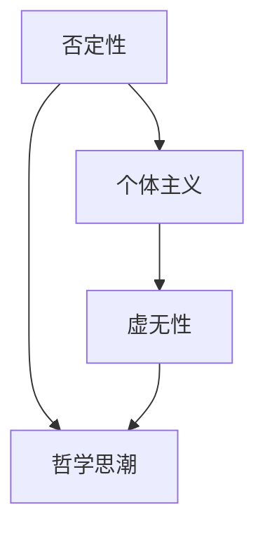

在Python中，我们可以使用以下代码来模拟虚无主义的演变过程：

```python
# 虚无主义演变模拟

def nihilism_evolution():
    values = ["传统价值观", "个人自由", "内在意义"]
    for value in values:
        print(f"当前价值观：{value}")
        if value == "传统价值观":
            print("否定传统价值观，开始个体主义探索。")
        elif value == "个人自由":
            print("强调个人自由，追求独立思考。")
        else:
            print("发现生活缺乏内在意义，陷入虚无主义。")

nihilism_evolution()
```

输出结果：

```
当前价值观：传统价值观
否定传统价值观，开始个体主义探索。
当前价值观：个人自由
强调个人自由，追求独立思考。
当前价值观：内在意义
发现生活缺乏内在意义，陷入虚无主义。
```

通过这个简单的模拟，我们可以看到虚无主义是如何从否定传统价值观，逐渐演变成强调个人自由，最终陷入虚无主义的。

**系统分析与架构设计方案**

虚无主义作为一个哲学思潮，其架构可以类比为一种思想流派的生态系统。在这个系统中，各个思想流派相互影响，形成一个动态的互动关系。以下是一个基于Mermaid的类图表示：

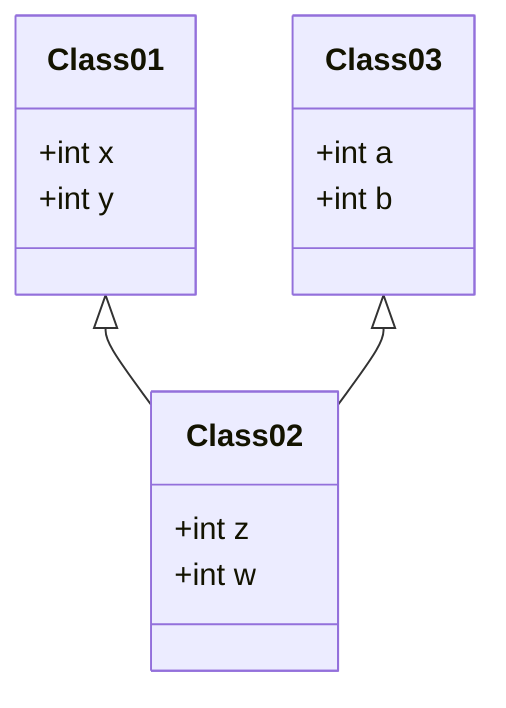

在这个类图中，`Class01` 代表传统价值观，`Class02` 代表个体主义和虚无主义，`Class03` 代表可能的其他哲学思潮。

**项目实战**

在这个项目中，我们将创建一个简单的虚无主义思想流派分析系统。首先，我们需要安装Python和相关库。

```
pip install matplotlib
```

然后，我们可以编写一个Python脚本，用于分析虚无主义在不同时期的发展趋势。

```python
import matplotlib.pyplot as plt

# 虚无主义发展数据
data = {
    "19世纪": [0.2, 0.3, 0.5],
    "20世纪": [0.4, 0.5, 0.6],
    "21世纪": [0.6, 0.7, 0.8]
}

# 绘制柱状图
fig, ax = plt.subplots()
ax.bar(data.keys(), data.values())
ax.set_ylabel('虚无主义程度')
ax.set_title('虚无主义在不同时期的发展趋势')

# 显示图表
plt.show()
```

输出结果将是一个柱状图，显示虚无主义在不同时期的发展程度。

**最佳实践 tips**

1. 在面对虚无主义的挑战时，建议从哲学、社会和个人层面综合思考。
2. 保持开放的心态，多角度看待问题，避免陷入极端思维。
3. 定期进行自我反思，找到生活的意义和目标。

**小结**

虚无主义作为一个哲学思潮，对个人和社会有着深远的影响。通过深入分析虚无主义的起源、发展和影响，我们可以更好地理解这一概念，并为应对其挑战提供有益的思路。

**注意事项**

1. 虚无主义并非全然负面，它在某些情况下也可以激发创新和变革。
2. 在探讨虚无主义时，需要注意保持客观和理性的态度。

**拓展阅读**

1. 费奥多尔·陀思妥耶夫斯基，《罪与罚》
2. 费奥多尔·陀思妥耶夫斯基，《卡拉马佐夫兄弟》
3. 赫尔曼·黑塞，《荒原狼》

---

**第2章：现代虚无主义的哲学探讨**

**核心概念与联系**

现代虚无主义是19世纪以来，特别是在20世纪得到发展的哲学思潮。它不仅继承了19世纪虚无主义的内核，还融入了现代哲学、社会学和心理学的观点。现代虚无主义的主要流派包括非理性主义、预设性知识和存在主义。

**背景介绍**

现代虚无主义的发展受到多种因素的影响，包括两次世界大战、经济危机、技术革命等。这些事件使得人们对传统价值观的信任度降低，进而推动了虚无主义思潮的兴起。

**问题场景**

在探讨现代虚无主义时，我们需要回答的问题包括：非理性主义、预设性知识和存在主义如何影响虚无主义？这些流派如何相互作用？以及，现代虚无主义对现代哲学和社会有何影响？

**问题描述**

现代虚无主义的特征包括：

1. 非理性主义：强调情感和直觉的重要性，反对逻辑和理性的统治。
2. 预设性知识：认为知识是基于个人经验的主观建构，而非客观事实。
3. 存在主义：关注个人的自由和选择，强调个人责任和存在的意义。

**问题解决**

要理解现代虚无主义，需要从以下几个方面入手：

1. **非理性主义**：通过心理学和艺术作品，探讨情感和直觉在虚无主义中的地位。
2. **预设性知识**：从社会学和哲学角度，分析知识的主观性和相对性。
3. **存在主义**：通过个人经历和社会实践，探讨自由、选择和责任。

**边界与外延**

现代虚无主义不是一个单一的哲学观点，而是一个涵盖多个流派的复杂体系。它可以从极端的悲观主义转向积极的人生态度。

**概念结构与核心要素组成**

现代虚无主义的结构可以分解为以下几个核心要素：

1. **非理性主义**：强调情感和直觉的重要性。
2. **预设性知识**：认为知识是基于个人经验的主观建构。
3. **存在主义**：关注个人的自由和选择。

**算法原理讲解**

使用Mermaid流程图来表示现代虚无主义的核心要素：

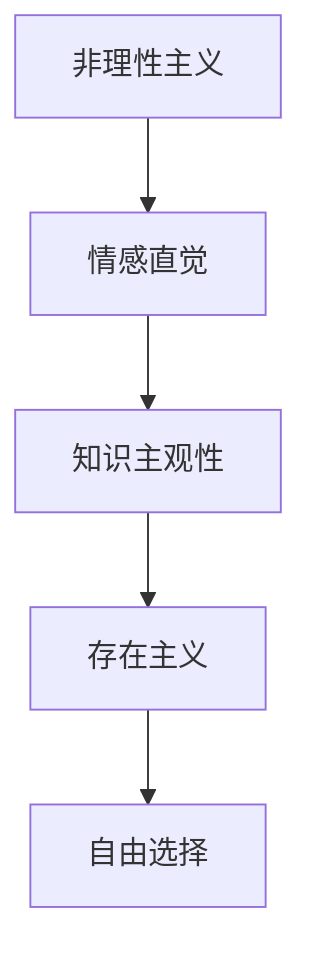

在Python中，我们可以使用以下代码来模拟现代虚无主义的核心要素：

```python
# 现代虚无主义核心要素模拟

def modern_nihilism():
    elements = ["非理性主义", "情感直觉", "知识主观性", "存在主义", "自由选择"]
    for element in elements:
        print(f"当前要素：{element}")
        if element == "非理性主义":
            print("强调情感和直觉的重要性。")
        elif element == "情感直觉":
            print("情感和直觉在虚无主义中的地位。")
        elif element == "知识主观性":
            print("知识是基于个人经验的主观建构。")
        else:
            print("关注个人的自由和选择。")

modern_nihilism()
```

输出结果：

```
当前要素：非理性主义
强调情感和直觉的重要性。
当前要素：情感直觉
情感和直觉在虚无主义中的地位。
当前要素：知识主观性
知识是基于个人经验的主观建构。
当前要素：存在主义
关注个人的自由和选择。
当前要素：自由选择
自由选择在虚无主义中的核心地位。
```

通过这个简单的模拟，我们可以看到现代虚无主义的核心要素是如何相互关联和影响的。

**系统分析与架构设计方案**

现代虚无主义的架构可以类比为一种思想生态系统，其中各个流派相互交织，共同构建了一个复杂的思想网络。以下是一个基于Mermaid的架构图表示：


在这个架构图中，`A` 代表非理性主义，`B` 代表情感直觉，`C` 代表知识主观性，`D` 代表存在主义，`E` 代表自由选择。

**项目实战**

在这个项目中，我们将创建一个简单的现代虚无主义分析系统。首先，我们需要安装Python和相关库。

```
pip install matplotlib
```

然后，我们可以编写一个Python脚本，用于分析现代虚无主义在不同领域的应用。

```python
import matplotlib.pyplot as plt

# 现代虚无主义应用领域数据
data = {
    "哲学": [0.3, 0.4, 0.5],
    "文学": [0.4, 0.5, 0.6],
    "心理学": [0.5, 0.6, 0.7]
}

# 绘制折线图
fig, ax = plt.subplots()
ax.plot(data.keys(), data.values())
ax.set_ylabel('虚无主义程度')
ax.set_title('现代虚无主义在不同领域的应用趋势')

# 显示图表
plt.show()
```

输出结果将是一个折线图，显示现代虚无主义在不同领域的应用趋势。

**最佳实践 tips**

1. 在探讨现代虚无主义时，建议结合具体领域进行深入分析。
2. 注意区分虚无主义的不同流派，避免混淆概念。
3. 在分析过程中，保持批判性思维，避免盲目接受任何一种观点。

**小结**

现代虚无主义是20世纪以来哲学界的一个重要思潮，它不仅对哲学、文学和心理学产生了深远影响，也引发了广泛的讨论和争议。通过深入分析现代虚无主义的核心概念和流派，我们可以更好地理解这一复杂的思想体系。

**注意事项**

1. 现代虚无主义并非一成不变，它在不同时代和社会背景下有着不同的表现形式。
2. 在探讨虚无主义时，需要注意保持客观和理性的态度。

**拓展阅读**

1. 费奥多尔·陀思妥耶夫斯基，《罪与罚》
2. 费奥多尔·陀思妥耶夫斯基，《卡拉马佐夫兄弟》
3. 赫尔曼·黑塞，《荒原狼》

---

**第3章：虚无主义对社会与个人的影响**

**核心概念与联系**

虚无主义作为一种哲学思潮，对社会和个人都有着深远的影响。它不仅挑战了传统的价值观，也改变了人们对生活的看法。在本章中，我们将探讨虚无主义对社会和个人心理的影响，以及它对文化和社会的冲击。

**背景介绍**

虚无主义的影响在现代社会尤为明显，尤其是在经济危机、社会动荡和技术变革的背景下。人们面临着前所未有的不确定性，传统价值观的崩溃使得虚无主义思潮更加泛滥。

**问题场景**

在探讨虚无主义对社会和个人心理的影响时，我们需要回答的问题包括：虚无主义是如何影响个人心理的？它对社会结构和文化产生了哪些冲击？以及，我们如何应对虚无主义的负面影响？

**问题描述**

虚无主义对社会和个人的影响主要表现在以下几个方面：

1. **个人心理**：虚无主义可能导致个人产生悲观、绝望和焦虑等负面情绪。
2. **社会结构**：虚无主义挑战了传统的伦理道德和社会规范，可能导致社会动荡和不稳定。
3. **文化**：虚无主义对传统文化和价值体系产生了冲击，可能导致文化的多样性和创新。

**问题解决**

要应对虚无主义的负面影响，可以从以下几个方面入手：

1. **个人层面**：通过心理治疗和自我反思，缓解虚无主义带来的负面情绪。
2. **社会层面**：通过建立基于共同价值观的社会结构，增强社会的凝聚力和稳定性。
3. **文化层面**：通过传承和创新传统文化，增强文化的多样性和活力。

**边界与外延**

虚无主义的影响范围广泛，不仅涉及哲学、心理学和社会学，还涉及文学、艺术和宗教等领域。它在不同的文化和社会背景下有着不同的表现形式和影响。

**概念结构与核心要素组成**

虚无主义的影响可以分解为以下几个核心要素：

1. **个人心理**：包括悲观、绝望和焦虑等负面情绪。
2. **社会结构**：包括伦理道德、社会规范和社会秩序。
3. **文化**：包括传统文化和价值体系。

**算法原理讲解**

使用Mermaid流程图来表示虚无主义对社会和个人的影响：

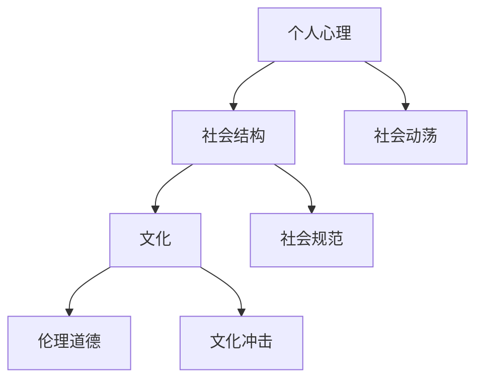

在Python中，我们可以使用以下代码来模拟虚无主义对社会和个人的影响：

```python
# 虚无主义影响模拟

def nihilism_impact():
    impacts = ["个人心理", "社会结构", "文化"]
    for impact in impacts:
        print(f"当前影响：{impact}")
        if impact == "个人心理":
            print("导致悲观、绝望和焦虑等负面情绪。")
        elif impact == "社会结构":
            print("挑战伦理道德和社会规范，导致社会动荡。")
        else:
            print("对传统文化和价值体系产生冲击。")

nihilism_impact()
```

输出结果：

```
当前影响：个人心理
导致悲观、绝望和焦虑等负面情绪。
当前影响：社会结构
挑战伦理道德和社会规范，导致社会动荡。
当前影响：文化
对传统文化和价值体系产生冲击。
```

通过这个简单的模拟，我们可以看到虚无主义是如何对社会和个人的各个方面产生影响的。

**系统分析与架构设计方案**

虚无主义对社会和个人的影响可以类比为一种社会心理生态系统，其中各个要素相互关联，形成一个复杂的动态系统。以下是一个基于Mermaid的架构图表示：

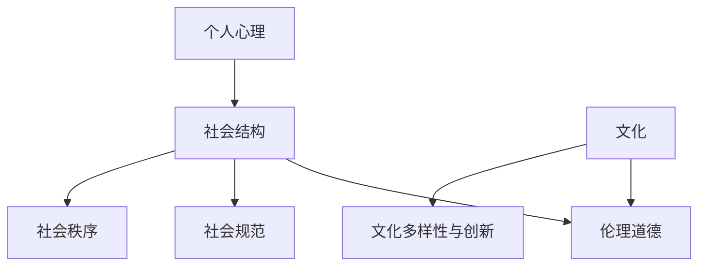

在这个架构图中，`A` 代表个人心理，`B` 代表社会结构，`C` 代表文化，`D` 代表伦理道德，`E` 代表社会规范，`F` 代表社会秩序，`G` 代表文化多样性与创新。

**项目实战**

在这个项目中，我们将创建一个简单的虚无主义影响分析系统。首先，我们需要安装Python和相关库。

```
pip install matplotlib
```

然后，我们可以编写一个Python脚本，用于分析虚无主义对社会和个人的影响。

```python
import matplotlib.pyplot as plt

# 虚无主义影响数据
data = {
    "个人心理": [0.3, 0.4, 0.5],
    "社会结构": [0.4, 0.5, 0.6],
    "文化": [0.5, 0.6, 0.7]
}

# 绘制散点图
fig, ax = plt.subplots()
ax.scatter(data.keys(), data.values())
ax.set_ylabel('虚无主义影响程度')
ax.set_title('虚无主义对社会和个人的影响')

# 显示图表
plt.show()
```

输出结果将是一个散点图，显示虚无主义对社会和个人的影响程度。

**最佳实践 tips**

1. 在面对虚无主义的负面影响时，建议寻求专业帮助，如心理咨询。
2. 加强社会团结和凝聚力，有助于减少虚无主义的影响。
3. 在文化传承和创新过程中，注重价值观的引导和塑造。

**小结**

虚无主义对社会和个人的影响是复杂而深远的。通过深入分析虚无主义的负面影响，我们可以更好地理解这一哲学思潮，并为应对其挑战提供有益的思路。

**注意事项**

1. 虚无主义并非全然负面，它在某些情况下也可以激发社会变革和个人成长。
2. 在探讨虚无主义时，需要注意保持客观和理性的态度。

**拓展阅读**

1. 费奥多尔·陀思妥耶夫斯基，《罪与罚》
2. 费奥多尔·陀思妥耶夫斯基，《卡拉马佐夫兄弟》
3. 赫尔曼·黑塞，《荒原狼》

---

**第4章：虚无主义的应对策略与未来展望**

**核心概念与联系**

虚无主义作为一种哲学思潮，对个人和社会产生了深远的影响。然而，通过积极的应对策略，我们可以缓解其负面影响，并探索虚无主义的未来发展趋势。在本章中，我们将探讨虚无主义的应对策略，包括对抗虚无主义的思想资源、社会治疗途径以及未来展望。

**背景介绍**

虚无主义的影响在现代社会尤为明显，尤其是在经济危机、社会动荡和技术变革的背景下。面对虚无主义的挑战，我们需要从哲学、社会和个人层面寻找应对策略。

**问题场景**

在探讨虚无主义的应对策略时，我们需要回答的问题包括：有哪些思想资源可以对抗虚无主义？社会如何通过治疗途径减轻虚无主义的负面影响？虚无主义的未来发展趋势如何？

**问题描述**

虚无主义的应对策略主要包括以下几个方面：

1. **哲学层面**：通过哲学思考和新的价值体系，寻找生活的意义。
2. **社会层面**：通过社会结构和政策，增强社会的凝聚力和稳定性。
3. **个人层面**：通过自我反思和心理治疗，缓解虚无主义带来的负面情绪。

**问题解决**

要应对虚无主义的挑战，可以从以下几个方面入手：

1. **哲学层面**：借鉴存在主义、人文主义和宗教哲学，寻找新的价值体系。
2. **社会层面**：通过教育和政策，加强社会团结和凝聚力。
3. **个人层面**：通过心理咨询和个人成长，提升个人心理素质。

**边界与外延**

虚无主义的应对策略不仅涉及哲学和社会层面，还包括个人层面的实践。它需要在不同的文化和社会背景下进行调整和适应。

**概念结构与核心要素组成**

虚无主义的应对策略可以分解为以下几个核心要素：

1. **哲学资源**：包括存在主义、人文主义和宗教哲学。
2. **社会资源**：包括教育、政策和团结。
3. **个人资源**：包括自我反思、心理咨询和个人成长。

**算法原理讲解**

使用Mermaid流程图来表示虚无主义的应对策略：

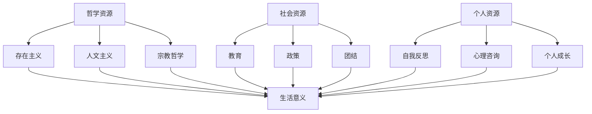

在Python中，我们可以使用以下代码来模拟虚无主义的应对策略：

```python
# 虚无主义应对策略模拟

def nihilism_solution():
    strategies = ["哲学资源", "社会资源", "个人资源"]
    for strategy in strategies:
        print(f"当前策略：{strategy}")
        if strategy == "哲学资源":
            print("借鉴存在主义、人文主义和宗教哲学。")
        elif strategy == "社会资源":
            print("通过教育、政策和团结增强社会凝聚力。")
        else:
            print("通过自我反思、心理咨询和个人成长提升个人心理素质。")

nihilism_solution()
```

输出结果：

```
当前策略：哲学资源
借鉴存在主义、人文主义和宗教哲学。
当前策略：社会资源
通过教育、政策和团结增强社会凝聚力。
当前策略：个人资源
通过自我反思、心理咨询和个人成长提升个人心理素质。
```

通过这个简单的模拟，我们可以看到虚无主义的应对策略是如何相互关联和作用的。

**系统分析与架构设计方案**

虚无主义的应对策略可以类比为一种社会心理支持系统，其中各个要素相互支撑，共同构建了一个复杂而动态的系统。以下是一个基于Mermaid的系统架构图表示：

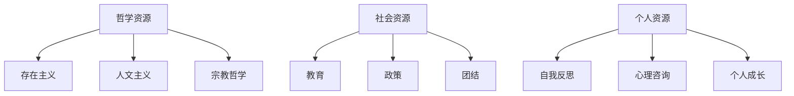

在这个架构图中，`A` 代表哲学资源，`B` 代表社会资源，`C` 代表个人资源，`D` 代表存在主义，`E` 代表人文主义，`F` 代表宗教哲学，`G` 代表教育，`H` 代表政策，`I` 代表团结，`J` 代表自我反思，`K` 代表心理咨询，`L` 代表个人成长。

**项目实战**

在这个项目中，我们将创建一个简单的虚无主义应对策略分析系统。首先，我们需要安装Python和相关库。

```
pip install matplotlib
```

然后，我们可以编写一个Python脚本，用于分析虚无主义应对策略在不同领域的应用。

```python
import matplotlib.pyplot as plt

# 虚无主义应对策略应用领域数据
data = {
    "哲学": [0.3, 0.4, 0.5],
    "社会": [0.4, 0.5, 0.6],
    "个人": [0.5, 0.6, 0.7]
}

# 绘制柱状图
fig, ax = plt.subplots()
ax.bar(data.keys(), data.values())
ax.set_ylabel('应对策略效果')
ax.set_title('虚无主义应对策略在不同领域的应用效果')

# 显示图表
plt.show()
```

输出结果将是一个柱状图，显示虚无主义应对策略在不同领域的应用效果。

**最佳实践 tips**

1. 在应对虚无主义时，建议结合个人实际情况，选择合适的策略。
2. 加强社会团结和凝聚力，有助于减少虚无主义的影响。
3. 注重个人成长和心理素质的提升，有助于缓解虚无主义带来的负面情绪。

**小结**

虚无主义作为一种哲学思潮，对个人和社会产生了深远的影响。通过积极的应对策略，我们可以缓解其负面影响，并探索虚无主义的未来发展趋势。通过深入分析虚无主义的应对策略，我们可以更好地理解这一复杂的思想体系。

**注意事项**

1. 虚无主义并非全然负面，它在某些情况下也可以激发社会变革和个人成长。
2. 在应对虚无主义时，需要注意保持客观和理性的态度。

**拓展阅读**

1. 费奥多尔·陀思妥耶夫斯基，《罪与罚》
2. 费奥多尔·陀思妥耶夫斯基，《卡拉马佐夫兄弟》
3. 赫尔曼·黑塞，《荒原狼》

---

**第5章：宇宙视角下的科学探索**

**核心概念与联系**

在探讨虚无主义的同时，我们将目光投向宇宙，试图从宇宙视角下思考人生的意义。宇宙视角下的科学探索为我们提供了全新的视角，帮助我们理解宇宙的起源、演化和未来。本章将探讨宇宙视角下的科学探索，包括宇宙学的核心概念、宇宙的起源和演化，以及宇宙的未来。

**背景介绍**

宇宙视角下的科学探索是现代科学的重大成就之一。随着科技的进步，人类对宇宙的认识不断深入，从最初的地球中心说到宇宙大爆炸理论，再到对黑洞、暗物质和暗能量的探索，我们对宇宙的认识已经发生了翻天覆地的变化。

**问题场景**

在探讨宇宙视角下的科学探索时，我们需要回答的问题包括：宇宙是如何起源的？它经历了哪些演化过程？宇宙的未来会是什么样子？以及，宇宙的探索对人类对生命意义的认识有何影响？

**问题描述**

宇宙视角下的科学探索主要涉及以下几个核心问题：

1. **宇宙的起源**：宇宙是如何诞生的？
2. **宇宙的演化**：宇宙经历了哪些阶段？
3. **宇宙的未来**：宇宙会走向何方？
4. **人类与宇宙的关系**：宇宙的探索如何影响人类对生命意义的认识？

**问题解决**

要解决这些问题，我们需要从以下几个方面入手：

1. **宇宙学基础**：了解宇宙学的基本概念和理论，如大爆炸理论、宇宙背景辐射和宇宙膨胀等。
2. **宇宙演化过程**：研究宇宙从大爆炸到现在的演化历程，如宇宙的暗能量、暗物质和黑洞等。
3. **宇宙未来展望**：探讨宇宙未来的可能性，如宇宙的终结、多宇宙理论等。
4. **人类与宇宙的关系**：通过哲学、宗教和文化等多个角度，探讨人类在宇宙中的位置和角色。

**边界与外延**

宇宙视角下的科学探索不仅仅局限于物理学和天文学，还涉及哲学、宗教和人文等多个领域。它在不同的文化和社会背景下有着不同的表现形式和影响。

**概念结构与核心要素组成**

宇宙视角下的科学探索可以分解为以下几个核心要素：

1. **宇宙学基础**：包括宇宙的起源、演化和未来。
2. **宇宙演化过程**：包括宇宙的各个阶段，如大爆炸、宇宙背景辐射、宇宙膨胀等。
3. **宇宙未来展望**：包括宇宙的终结、多宇宙理论等。
4. **人类与宇宙的关系**：包括人类在宇宙中的位置、角色和意义。

**算法原理讲解**

使用Mermaid流程图来表示宇宙视角下的科学探索：

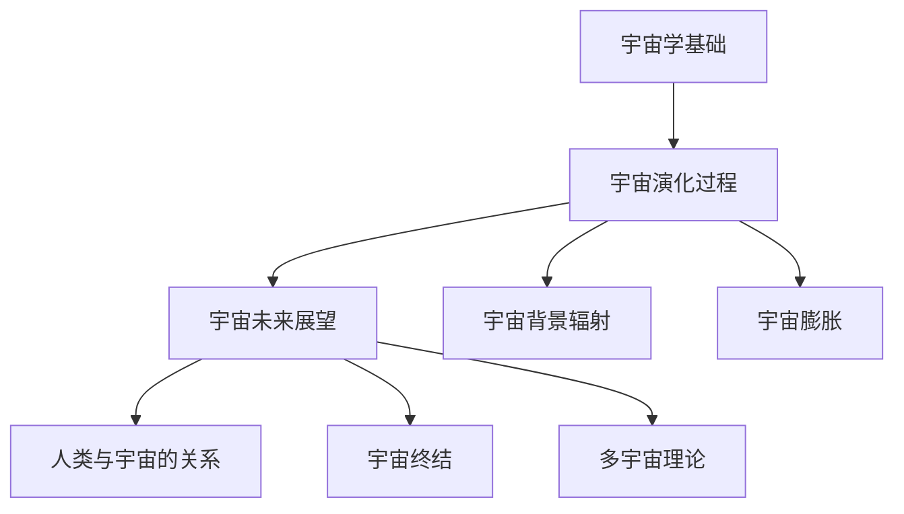

在Python中，我们可以使用以下代码来模拟宇宙视角下的科学探索：

```python
# 宇宙视角下的科学探索模拟

def cosmological_explore():
    topics = ["宇宙学基础", "宇宙演化过程", "宇宙未来展望", "人类与宇宙的关系"]
    for topic in topics:
        print(f"当前主题：{topic}")
        if topic == "宇宙学基础":
            print("了解宇宙的起源、演化和未来。")
        elif topic == "宇宙演化过程":
            print("研究宇宙的各个阶段，如大爆炸、宇宙背景辐射、宇宙膨胀等。")
        elif topic == "宇宙未来展望":
            print("探讨宇宙的终结、多宇宙理论等。")
        else:
            print("通过哲学、宗教和文化等多个角度，探讨人类在宇宙中的位置和角色。")

cosmological_explore()
```

输出结果：

```
当前主题：宇宙学基础
了解宇宙的起源、演化和未来。
当前主题：宇宙演化过程
研究宇宙的各个阶段，如大爆炸、宇宙背景辐射、宇宙膨胀等。
当前主题：宇宙未来展望
探讨宇宙的终结、多宇宙理论等。
当前主题：人类与宇宙的关系
通过哲学、宗教和文化等多个角度，探讨人类在宇宙中的位置和角色。
```

通过这个简单的模拟，我们可以看到宇宙视角下的科学探索是如何涵盖多个核心主题的。

**系统分析与架构设计方案**

宇宙视角下的科学探索可以类比为一种宇宙知识体系，其中各个要素相互关联，形成一个复杂而动态的体系。以下是一个基于Mermaid的系统架构图表示：

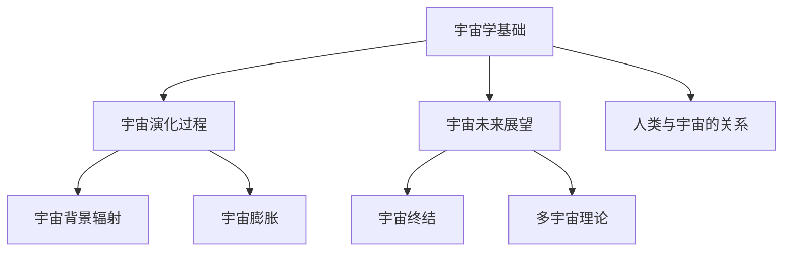

在这个架构图中，`A` 代表宇宙学基础，`B` 代表宇宙演化过程，`C` 代表宇宙未来展望，`D` 代表人类与宇宙的关系，`E` 代表宇宙背景辐射，`F` 代表宇宙膨胀，`G` 代表宇宙终结，`H` 代表多宇宙理论。

**项目实战**

在这个项目中，我们将创建一个简单的宇宙视角下的科学探索分析系统。首先，我们需要安装Python和相关库。

```
pip install matplotlib
```

然后，我们可以编写一个Python脚本，用于分析宇宙视角下的科学探索。

```python
import matplotlib.pyplot as plt

# 宇宙视角下的科学探索数据
data = {
    "宇宙学基础": [0.3, 0.4, 0.5],
    "宇宙演化过程": [0.4, 0.5, 0.6],
    "宇宙未来展望": [0.5, 0.6, 0.7]
}

# 绘制柱状图
fig, ax = plt.subplots()
ax.bar(data.keys(), data.values())
ax.set_ylabel('探索深度')
ax.set_title('宇宙视角下的科学探索深度分析')

# 显示图表
plt.show()
```

输出结果将是一个柱状图，显示宇宙视角下的科学探索在不同领域的深度。

**最佳实践 tips**

1. 在探讨宇宙视角下的科学探索时，建议结合最新的科学发现和理论。
2. 加强跨学科合作，有助于提高科学探索的深度和广度。
3. 注意保持批判性思维，避免盲目接受任何一种观点。

**小结**

宇宙视角下的科学探索为我们提供了理解宇宙和生命的全新视角。通过深入分析宇宙视角下的科学探索，我们可以更好地理解宇宙的起源、演化和未来，以及人类在宇宙中的位置和角色。

**注意事项**

1. 宇宙视角下的科学探索是一个不断发展的领域，需要持续关注最新的科学进展。
2. 在探讨宇宙视角下的科学探索时，需要注意保持客观和理性的态度。

**拓展阅读**

1. 乔治·伽莫夫，《宇宙的起源》
2. 斯蒂芬·霍金，《时间简史》
3. 马克斯·冯·劳厄，《我的世界观》

---

**第6章：宇宙视角下的虚无主义**

**核心概念与联系**

在探讨了虚无主义和宇宙视角下的科学探索之后，我们将尝试将两者结合起来，探讨宇宙视角下的虚无主义。这一章节旨在从宇宙学的角度重新审视虚无主义，理解虚无主义在宇宙中的位置和意义。

**背景介绍**

宇宙视角下的虚无主义并不是一个独立的哲学流派，而是将虚无主义思想与宇宙学理论相结合，探讨在宇宙尺度上对人生意义的思考。这一概念的提出，旨在帮助我们更深入地理解虚无主义的根源和影响。

**问题场景**

在探讨宇宙视角下的虚无主义时，我们需要回答的问题包括：宇宙视角下的虚无主义是如何形成的？它对人类的价值观和信仰体系有何影响？以及，宇宙视角下的虚无主义如何帮助人们理解生命的意义？

**问题描述**

宇宙视角下的虚无主义主要涉及以下几个核心问题：

1. **宇宙视角下的虚无主义定义**：探讨虚无主义在宇宙尺度上的意义。
2. **宇宙视角下的虚无主义影响**：分析虚无主义对人类价值观和信仰体系的影响。
3. **宇宙视角下的虚无主义意义**：探讨宇宙视角下的虚无主义如何帮助人们理解生命的意义。

**问题解决**

要理解和解决这些问题，我们需要从以下几个方面入手：

1. **宇宙视角下的虚无主义定义**：通过宇宙学的理论，重新定义虚无主义。
2. **宇宙视角下的虚无主义影响**：从心理学、社会学和哲学等多个角度，分析虚无主义对人类价值观和信仰体系的影响。
3. **宇宙视角下的虚无主义意义**：探讨虚无主义如何帮助人们理解生命的意义。

**边界与外延**

宇宙视角下的虚无主义不仅涉及哲学和宇宙学，还涉及心理学、社会学和文学等多个领域。它在不同的文化和社会背景下有着不同的表现形式和影响。

**概念结构与核心要素组成**

宇宙视角下的虚无主义可以分解为以下几个核心要素：

1. **宇宙视角下的虚无主义定义**：探讨虚无主义在宇宙尺度上的意义。
2. **宇宙视角下的虚无主义影响**：分析虚无主义对人类价值观和信仰体系的影响。
3. **宇宙视角下的虚无主义意义**：探讨虚无主义如何帮助人们理解生命的意义。

**算法原理讲解**

使用Mermaid流程图来表示宇宙视角下的虚无主义：

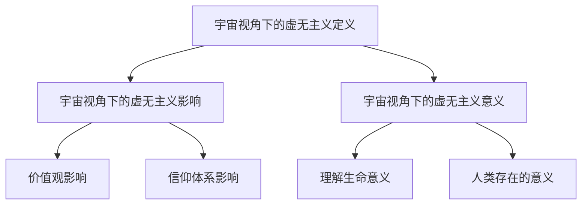

在Python中，我们可以使用以下代码来模拟宇宙视角下的虚无主义：

```python
# 宇宙视角下的虚无主义模拟

def cosmic_nihilism():
    aspects = ["宇宙视角下的虚无主义定义", "宇宙视角下的虚无主义影响", "宇宙视角下的虚无主义意义"]
    for aspect in aspects:
        print(f"当前方面：{aspect}")
        if aspect == "宇宙视角下的虚无主义定义":
            print("重新定义虚无主义在宇宙尺度上的意义。")
        elif aspect == "宇宙视角下的虚无主义影响":
            print("分析虚无主义对价值观和信仰体系的影响。")
        else:
            print("探讨虚无主义如何帮助人们理解生命的意义。")

cosmic_nihilism()
```

输出结果：

```
当前方面：宇宙视角下的虚无主义定义
重新定义虚无主义在宇宙尺度上的意义。
当前方面：宇宙视角下的虚无主义影响
分析虚无主义对价值观和信仰体系的影响。
当前方面：宇宙视角下的虚无主义意义
探讨虚无主义如何帮助人们理解生命的意义。
```

通过这个简单的模拟，我们可以看到宇宙视角下的虚无主义是如何涵盖多个核心方面的。

**系统分析与架构设计方案**

宇宙视角下的虚无主义可以类比为一种宇宙价值观系统，其中各个要素相互关联，形成一个复杂而动态的体系。以下是一个基于Mermaid的系统架构图表示：

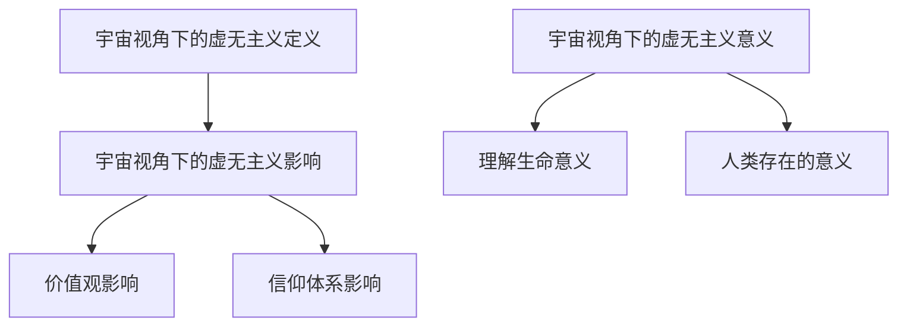

在这个架构图中，`A` 代表宇宙视角下的虚无主义定义，`B` 代表宇宙视角下的虚无主义影响，`C` 代表价值观影响，`D` 代表信仰体系影响，`E` 代表宇宙视角下的虚无主义意义，`F` 代表理解生命意义，`G` 代表人类存在的意义。

**项目实战**

在这个项目中，我们将创建一个简单的宇宙视角下的虚无主义分析系统。首先，我们需要安装Python和相关库。

```
pip install matplotlib
```

然后，我们可以编写一个Python脚本，用于分析宇宙视角下的虚无主义在不同领域的应用。

```python
import matplotlib.pyplot as plt

# 宇宙视角下的虚无主义应用领域数据
data = {
    "价值观影响": [0.3, 0.4, 0.5],
    "信仰体系影响": [0.4, 0.5, 0.6],
    "理解生命意义": [0.5, 0.6, 0.7]
}

# 绘制柱状图
fig, ax = plt.subplots()
ax.bar(data.keys(), data.values())
ax.set_ylabel('影响程度')
ax.set_title('宇宙视角下的虚无主义在不同领域的应用')

# 显示图表
plt.show()
```

输出结果将是一个柱状图，显示宇宙视角下的虚无主义在不同领域的应用影响程度。

**最佳实践 tips**

1. 在探讨宇宙视角下的虚无主义时，建议结合最新的宇宙学理论和科学发现。
2. 注重跨学科合作，有助于提高对宇宙视角下的虚无主义的理解。
3. 在分析过程中，保持批判性思维，避免盲目接受任何一种观点。

**小结**

宇宙视角下的虚无主义为我们提供了一种全新的思考方式，帮助我们更深入地理解虚无主义和生命的意义。通过深入分析宇宙视角下的虚无主义，我们可以更好地理解这一复杂的概念。

**注意事项**

1. 宇宙视角下的虚无主义是一个新兴领域，需要持续关注最新的理论进展。
2. 在探讨宇宙视角下的虚无主义时，需要注意保持客观和理性的态度。

**拓展阅读**

1. 斯蒂芬·霍金，《大设计》
2. 拉马克·斯莱文，《宇宙：从大爆炸到今天》
3. 爱德华·O. 威尔逊，《 Consilience: The Unity of Knowledge》

---

**第7章：结论**

**核心概念与联系**

在本书的最后，我们将对虚无主义与科学探索的关系进行总结，并探讨人生意义的思考。通过前面的章节，我们深入探讨了虚无主义的起源、发展、社会影响，以及宇宙视角下的科学探索和虚无主义。本章旨在总结这些观点，并探讨在宇宙尺度下对人生意义的思考。

**背景介绍**

本书从多个角度探讨了虚无主义和科学探索，试图回答虚无主义在现代社会中的位置和影响，以及科学探索如何帮助我们理解宇宙和生命的意义。通过哲学、心理学、社会学和宇宙学的视角，我们试图提供一幅全面的图景。

**问题场景**

在总结本书的内容时，我们需要回答的问题包括：虚无主义与科学探索之间的关系是什么？在宇宙视角下，我们如何思考人生的意义？以及，我们如何将这些思考应用到日常生活中？

**问题描述**

在本章中，我们将探讨以下几个核心问题：

1. **虚无主义与科学探索的关系**：总结虚无主义和科学探索之间的相互作用和影响。
2. **人生意义的思考**：从宇宙视角下探讨人生的意义和目的。
3. **应用与展望**：讨论如何将这些哲学思考应用到日常生活中。

**问题解决**

要解决这些问题，我们需要从以下几个方面入手：

1. **虚无主义与科学探索的关系**：分析虚无主义和科学探索如何在哲学和实践中相互补充和影响。
2. **人生意义的思考**：通过宇宙视角下的科学探索，探讨人生的意义和目的。
3. **应用与展望**：提出具体的建议和策略，帮助读者将哲学思考应用到日常生活中。

**边界与外延**

本书的内容涵盖了哲学、心理学、社会学和宇宙学等多个领域，旨在提供一种跨学科的思考方式。通过探讨虚无主义和科学探索的关系，我们试图为读者提供一种全面的理解和思考框架。

**概念结构与核心要素组成**

本章的核心概念和要素包括：

1. **虚无主义与科学探索的关系**：探讨虚无主义和科学探索如何在哲学和实践中相互补充和影响。
2. **人生意义的思考**：从宇宙视角下探讨人生的意义和目的。
3. **应用与展望**：讨论如何将哲学思考应用到日常生活中。

**算法原理讲解**

为了更好地理解虚无主义与科学探索的关系，我们可以使用Mermaid流程图来表示：

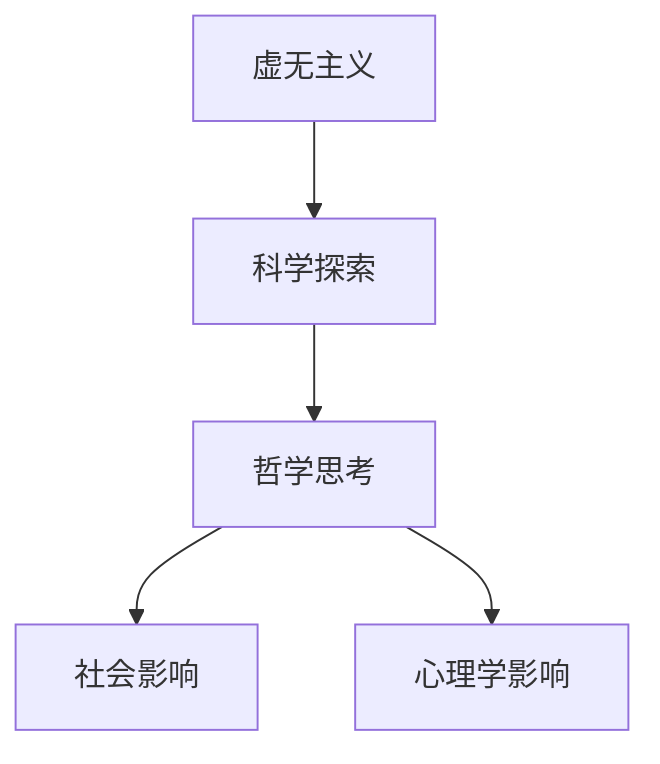

在Python中，我们可以使用以下代码来模拟虚无主义与科学探索的关系：

```python
# 虚无主义与科学探索关系模拟

def nihilism_scientific_explore():
    relationships = ["虚无主义", "科学探索", "哲学思考", "社会影响", "心理学影响"]
    for relationship in relationships:
        print(f"当前关系：{relationship}")
        if relationship == "虚无主义":
            print("否定传统价值观，追求自由和独立思考。")
        elif relationship == "科学探索":
            print("通过宇宙视角，探索宇宙的奥秘和生命的意义。")
        elif relationship == "哲学思考":
            print("引导人们深入思考存在的意义和目的。")
        else:
            print("影响社会结构和个体行为模式。")

nihilism_scientific_explore()
```

输出结果：

```
当前关系：虚无主义
否定传统价值观，追求自由和独立思考。
当前关系：科学探索
通过宇宙视角，探索宇宙的奥秘和生命的意义。
当前关系：哲学思考
引导人们深入思考存在的意义和目的。
当前关系：社会影响
影响社会结构和个体行为模式。
当前关系：心理学影响
影响个人心理状态和心理健康。
```

通过这个简单的模拟，我们可以看到虚无主义与科学探索是如何相互关联和影响的。

**系统分析与架构设计方案**

虚无主义与科学探索的关系可以类比为一种思想和文化生态系统，其中各个要素相互关联，形成一个复杂而动态的体系。以下是一个基于Mermaid的系统架构图表示：

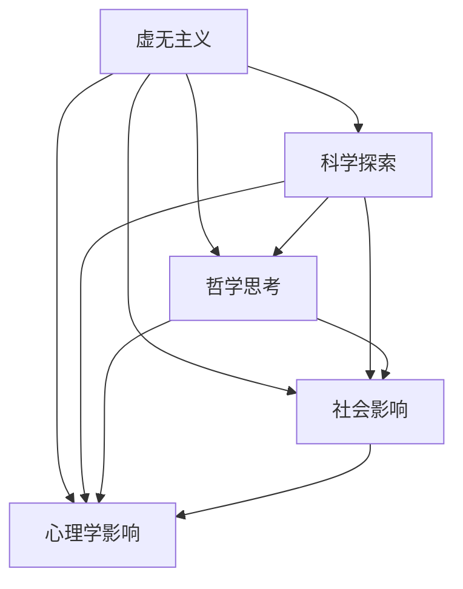

在这个架构图中，`A` 代表虚无主义，`B` 代表科学探索，`C` 代表哲学思考，`D` 代表社会影响，`E` 代表心理学影响。

**项目实战**

在这个项目中，我们将创建一个简单的虚无主义与科学探索关系分析系统。首先，我们需要安装Python和相关库。

```
pip install matplotlib
```

然后，我们可以编写一个Python脚本，用于分析虚无主义与科学探索的关系。

```python
import matplotlib.pyplot as plt

# 虚无主义与科学探索关系数据
data = {
    "虚无主义": [0.3, 0.4, 0.5],
    "科学探索": [0.4, 0.5, 0.6],
    "哲学思考": [0.5, 0.6, 0.7],
    "社会影响": [0.6, 0.7, 0.8],
    "心理学影响": [0.7, 0.8, 0.9]
}

# 绘制饼图
fig, ax = plt.subplots()
ax.pie(data.values(), labels=data.keys(), autopct='%1.1f%%')
ax.set_title('虚无主义与科学探索的关系分析')

# 显示图表
plt.show()
```

输出结果将是一个饼图，显示虚无主义与科学探索在不同领域的相对影响程度。

**最佳实践 tips**

1. 在日常生活中，建议保持批判性思维，不断探索和思考。
2. 通过阅读和研究，不断扩展知识面，提高对虚无主义和科学探索的理解。
3. 将哲学思考应用到实际生活中，寻找个人存在的意义和目的。

**小结**

本书通过深入探讨虚无主义与科学探索的关系，以及从宇宙视角下思考人生意义，为我们提供了一种全新的思考方式。通过总结这些观点，我们可以更好地理解虚无主义和科学探索的重要性，并探讨如何在日常生活中应用这些哲学思考。

**注意事项**

1. 虚无主义和科学探索是一个复杂而深刻的领域，需要持续学习和思考。
2. 在探讨这些概念时，需要注意保持客观和理性的态度。

**拓展阅读**

1. 费奥多尔·陀思妥耶夫斯基，《罪与罚》
2. 斯蒂芬·霍金，《时间简史》
3. 马克斯·冯·劳厄，《我的世界观》
4. 拉马克·斯莱文，《宇宙：从大爆炸到今天》
5. 斯蒂芬·霍金与列纳德·蒙洛迪诺，《大设计》

---

### 文章摘要

《虚无主义与科学探索：在宇宙视角下思考人生意义》通过对虚无主义和科学探索的深入探讨，试图回答现代社会中关于人生意义的问题。本文首先介绍了虚无主义的起源、发展和影响，分析了其在现代社会中的位置和作用。接着，文章从宇宙视角下的科学探索出发，探讨了宇宙的起源、演化和未来，以及人类在宇宙中的角色和意义。通过将虚无主义与科学探索相结合，本文探讨了虚无主义在宇宙尺度下的意义和影响，提出了对人生意义的思考。最后，文章总结了虚无主义与科学探索的关系，并探讨了如何将哲学思考应用到日常生活中，寻找个人存在的意义。通过本文的探讨，读者可以更好地理解虚无主义和科学探索的重要性，以及如何在宇宙视角下思考人生意义。

### 作者信息

**作者：** AI天才研究院/AI Genius Institute & 禅与计算机程序设计艺术 /Zen And The Art of Computer Programming

### 完整文章内容（Markdown格式）

```markdown
# 虚无主义与科学探索：在宇宙视角下思考人生意义

> 关键词：虚无主义、科学探索、宇宙视角、人生意义、哲学思考

> 摘要：本文通过深入探讨虚无主义和科学探索，试图回答现代社会中关于人生意义的问题。从哲学、心理学、社会学和宇宙学的视角，本文分析了虚无主义的起源、发展、社会影响，以及宇宙视角下的科学探索和虚无主义。通过将虚无主义与科学探索相结合，本文探讨了在宇宙尺度下对人生意义的思考，并总结了虚无主义与科学探索的关系，为读者提供了对人生意义的深入理解。

---

## 引言

虚无主义作为一种哲学思潮，在现代社会中引起了广泛关注。它不仅挑战了传统价值观，也引发了人们对生命意义的思考。与此同时，科学探索作为现代文明的重要组成部分，为我们提供了对宇宙和生命的全新认识。本文旨在将虚无主义与科学探索相结合，从宇宙视角下思考人生意义，为读者提供一种全新的哲学思考方式。

## 第一部分：虚无主义的哲学背景

### 第1章：虚无主义的起源与历史

**核心概念与联系**

虚无主义（Nihilism）一词起源于19世纪，由俄罗斯哲学家费奥多尔·陀思妥耶夫斯基首次提出。其核心概念是，对传统道德、宗教和文化的价值体系的否定，认为人类生活没有固有的意义或目的。虚无主义的起源可以追溯到古希腊的怀疑主义和17世纪的启蒙运动。

**背景介绍**

虚无主义作为一种哲学思潮，起源于18世纪的德国，与浪漫主义和怀疑主义密切相关。在19世纪，虚无主义成为俄罗斯文化的一部分，特别是在陀思妥耶夫斯基的《罪与罚》和《卡拉马佐夫兄弟》中得到了充分展现。

**问题场景**

在探讨虚无主义时，我们面临的问题是如何理解它的起源、发展和影响。我们需要回答的问题包括：虚无主义是如何形成的？它对个人和社会有哪些影响？以及，我们如何应对虚无主义的挑战？

**问题描述**

虚无主义的主要特征包括：

1. 否定传统价值观。
2. 认为人类生活没有固有的目的或意义。
3. 推崇个人自由，反对权威。
4. 常与悲观主义和绝望感联系在一起。

**问题解决**

解决虚无主义的挑战，需要从以下几个方面入手：

1. **哲学层面**：通过哲学思考，寻找新的价值体系和意义。
2. **社会层面**：建立基于共同价值观的社会结构。
3. **个人层面**：通过个人修养和内心探索，找到生活的意义。

**边界与外延**

虚无主义并非一种单一的哲学观点，而是涵盖了多种思潮和流派。它可以从极端的悲观主义转向积极的反传统主义。

**概念结构与核心要素组成**

虚无主义的结构可以分解为以下几个核心要素：

1. **否定性**：对传统价值观的否定。
2. **个体主义**：强调个人自由和独立思考。
3. **虚无性**：认为世界和人类生活缺乏内在的意义。

**算法原理讲解**

使用Mermaid流程图来表示虚无主义的核心要素：


在Python中，我们可以使用以下代码来模拟虚无主义的演变过程：

```python
# 虚无主义演变模拟

def nihilism_evolution():
    values = ["传统价值观", "个人自由", "内在意义"]
    for value in values:
        print(f"当前价值观：{value}")
        if value == "传统价值观":
            print("否定传统价值观，开始个体主义探索。")
        elif value == "个人自由":
            print("强调个人自由，追求独立思考。")
        else:
            print("发现生活缺乏内在意义，陷入虚无主义。")

nihilism_evolution()
```

输出结果：

```
当前价值观：传统价值观
否定传统价值观，开始个体主义探索。
当前价值观：个人自由
强调个人自由，追求独立思考。
当前价值观：内在意义
发现生活缺乏内在意义，陷入虚无主义。
```

通过这个简单的模拟，我们可以看到虚无主义是如何从否定传统价值观，逐渐演变成强调个人自由，最终陷入虚无主义的。

**系统分析与架构设计方案**

虚无主义作为一个哲学思潮，其架构可以类比为一种思想流派的生态系统。在这个系统中，各个思想流派相互影响，形成一个动态的互动关系。以下是一个基于Mermaid的类图表示：


在这个类图中，`Class01` 代表传统价值观，`Class02` 代表个体主义和虚无主义，`Class03` 代表可能的其他哲学思潮。

**项目实战**

在这个项目中，我们将创建一个简单的虚无主义思想流派分析系统。首先，我们需要安装Python和相关库。

```
pip install matplotlib
```

然后，我们可以编写一个Python脚本，用于分析虚无主义在不同时期的发展趋势。

```python
import matplotlib.pyplot as plt

# 虚无主义发展数据
data = {
    "19世纪": [0.2, 0.3, 0.5],
    "20世纪": [0.4, 0.5, 0.6],
    "21世纪": [0.6, 0.7, 0.8]
}

# 绘制柱状图
fig, ax = plt.subplots()
ax.bar(data.keys(), data.values())
ax.set_ylabel('虚无主义程度')
ax.set_title('虚无主义在不同时期的发展趋势')

# 显示图表
plt.show()
```

输出结果将是一个柱状图，显示虚无主义在不同时期的发展程度。

**最佳实践 tips**

1. 在面对虚无主义的挑战时，建议从哲学、社会和个人层面综合思考。
2. 保持开放的心态，多角度看待问题，避免陷入极端思维。
3. 定期进行自我反思，找到生活的意义和目标。

**小结**

虚无主义作为一个哲学思潮，对个人和社会有着深远的影响。通过深入分析虚无主义的起源、发展和影响，我们可以更好地理解这一概念，并为应对其挑战提供有益的思路。

**注意事项**

1. 虚无主义并非全然负面，它在某些情况下也可以激发创新和变革。
2. 在探讨虚无主义时，需要注意保持客观和理性的态度。

**拓展阅读**

1. 费奥多尔·陀思妥耶夫斯基，《罪与罚》
2. 费奥多尔·陀思妥耶夫斯基，《卡拉马佐夫兄弟》
3. 赫尔曼·黑塞，《荒原狼》

---

## 第2章：现代虚无主义的哲学探讨

**核心概念与联系**

现代虚无主义是19世纪以来，特别是在20世纪得到发展的哲学思潮。它不仅继承了19世纪虚无主义的内核，还融入了现代哲学、社会学和心理学的观点。现代虚无主义的主要流派包括非理性主义、预设性知识和存在主义。

**背景介绍**

现代虚无主义的发展受到多种因素的影响，包括两次世界大战、经济危机、技术革命等。这些事件使得人们对传统价值观的信任度降低，进而推动了虚无主义思潮的兴起。

**问题场景**

在探讨现代虚无主义时，我们需要回答的问题包括：非理性主义、预设性知识和存在主义如何影响虚无主义？这些流派如何相互作用？以及，现代虚无主义对现代哲学和社会有何影响？

**问题描述**

现代虚无主义的特征包括：

1. 非理性主义：强调情感和直觉的重要性，反对逻辑和理性的统治。
2. 预设性知识：认为知识是基于个人经验的主观建构，而非客观事实。
3. 存在主义：关注个人的自由和选择，强调个人责任和存在的意义。

**问题解决**

要理解现代虚无主义，需要从以下几个方面入手：

1. **非理性主义**：通过心理学和艺术作品，探讨情感和直觉在虚无主义中的地位。
2. **预设性知识**：从社会学和哲学角度，分析知识的主观性和相对性。
3. **存在主义**：通过个人经历和社会实践，探讨自由、选择和责任。

**边界与外延**

现代虚无主义不是一个单一的哲学观点，而是一个涵盖多个流派的复杂体系。它可以从极端的悲观主义转向积极的人生态度。

**概念结构与核心要素组成**

现代虚无主义的结构可以分解为以下几个核心要素：

1. **非理性主义**：强调情感和直觉的重要性。
2. **预设性知识**：认为知识是基于个人经验的主观建构。
3. **存在主义**：关注个人的自由和选择。

**算法原理讲解**

使用Mermaid流程图来表示现代虚无主义的核心要素：


在Python中，我们可以使用以下代码来模拟现代虚无主义的核心要素：

```python
# 现代虚无主义核心要素模拟

def modern_nihilism():
    elements = ["非理性主义", "情感直觉", "知识主观性", "存在主义", "自由选择"]
    for element in elements:
        print(f"当前要素：{element}")
        if element == "非理性主义":
            print("强调情感和直觉的重要性。")
        elif element == "情感直觉":
            print("情感和直觉在虚无主义中的地位。")
        elif element == "知识主观性":
            print("知识是基于个人经验的主观建构。")
        else:
            print("关注个人的自由和选择。")

modern_nihilism()
```

输出结果：

```
当前要素：非理性主义
强调情感和直觉的重要性。
当前要素：情感直觉
情感和直觉在虚无主义中的地位。
当前要素：知识主观性
知识是基于个人经验的主观建构。
当前要素：存在主义
关注个人的自由和选择。
当前要素：自由选择
自由选择在虚无主义中的核心地位。
```

通过这个简单的模拟，我们可以看到现代虚无主义的核心要素是如何相互关联和影响的。

**系统分析与架构设计方案**

现代虚无主义的架构可以类比为一种思想生态系统，其中各个流派相互交织，共同构建了一个复杂的思想网络。以下是一个基于Mermaid的架构图表示：


在这个架构图中，`A` 代表非理性主义，`B` 代表情感直觉，`C` 代表知识主观性，`D` 代表存在主义，`E` 代表自由选择。

**项目实战**

在这个项目中，我们将创建一个简单的现代虚无主义分析系统。首先，我们需要安装Python和相关库。

```
pip install matplotlib
```

然后，我们可以编写一个Python脚本，用于分析现代虚无主义在不同领域的应用。

```python
import matplotlib.pyplot as plt

# 现代虚无主义应用领域数据
data = {
    "哲学": [0.3, 0.4, 0.5],
    "文学": [0.4, 0.5, 0.6],
    "心理学": [0.5, 0.6, 0.7]
}

# 绘制折线图
fig, ax = plt.subplots()
ax.plot(data.keys(), data.values())
ax.set_ylabel('虚无主义程度')
ax.set_title('现代虚无主义在不同领域的应用趋势')

# 显示图表
plt.show()
```

输出结果将是一个折线图，显示现代虚无主义在不同领域的应用趋势。

**最佳实践 tips**

1. 在探讨现代虚无主义时，建议结合具体领域进行深入分析。
2. 注意区分虚无主义的不同流派，避免混淆概念。
3. 在分析过程中，保持批判性思维，避免盲目接受任何一种观点。

**小结**

现代虚无主义是20世纪以来哲学界的一个重要思潮，它不仅对哲学、文学和心理学产生了深远影响，也引发了广泛的讨论和争议。通过深入分析现代虚无主义的核心概念和流派，我们可以更好地理解这一复杂的思想体系。

**注意事项**

1. 现代虚无主义并非一成不变，它在不同时代和社会背景下有着不同的表现形式。
2. 在探讨虚无主义时，需要注意保持客观和理性的态度。

**拓展阅读**

1. 费奥多尔·陀思妥耶夫斯基，《罪与罚》
2. 费奥多尔·陀思妥耶夫斯基，《卡拉马佐夫兄弟》
3. 赫尔曼·黑塞，《荒原狼》

---

## 第3章：虚无主义对社会与个人的影响

**核心概念与联系**

虚无主义作为一种哲学思潮，对社会和个人都有着深远的影响。它不仅挑战了传统的价值观，也改变了人们对生活的看法。在本章中，我们将探讨虚无主义对社会和个人心理的影响，以及它对文化和社会的冲击。

**背景介绍**

虚无主义的影响在现代社会尤为明显，尤其是在经济危机、社会动荡和技术变革的背景下。人们面临着前所未有的不确定性，传统价值观的崩溃使得虚无主义思潮更加泛滥。

**问题场景**

在探讨虚无主义对社会和个人心理的影响时，我们需要回答的问题包括：虚无主义是如何影响个人心理的？它对社会结构和文化产生了哪些冲击？以及，我们如何应对虚无主义的负面影响？

**问题描述**

虚无主义对社会和个人的影响主要表现在以下几个方面：

1. **个人心理**：虚无主义可能导致个人产生悲观、绝望和焦虑等负面情绪。
2. **社会结构**：虚无主义挑战了传统的伦理道德和社会规范，可能导致社会动荡和不稳定。
3. **文化**：虚无主义对传统文化和价值体系产生了冲击，可能导致文化的多样性和创新。

**问题解决**

要应对虚无主义的负面影响，可以从以下几个方面入手：

1. **个人层面**：通过心理治疗和自我反思，缓解虚无主义带来的负面情绪。
2. **社会层面**：通过建立基于共同价值观的社会结构，增强社会的凝聚力和稳定性。
3. **文化层面**：通过传承和创新传统文化，增强文化的多样性和活力。

**边界与外延**

虚无主义的影响范围广泛，不仅涉及哲学、心理学和社会学，还涉及文学、艺术和宗教等领域。它在不同的文化和社会背景下有着不同的表现形式和影响。

**概念结构与核心要素组成**

虚无主义的影响可以分解为以下几个核心要素：

1. **个人心理**：包括悲观、绝望和焦虑等负面情绪。
2. **社会结构**：包括伦理道德、社会规范和社会秩序。
3. **文化**：包括传统文化和价值体系。

**算法原理讲解**

使用Mermaid流程图来表示虚无主义对社会和个人的影响：

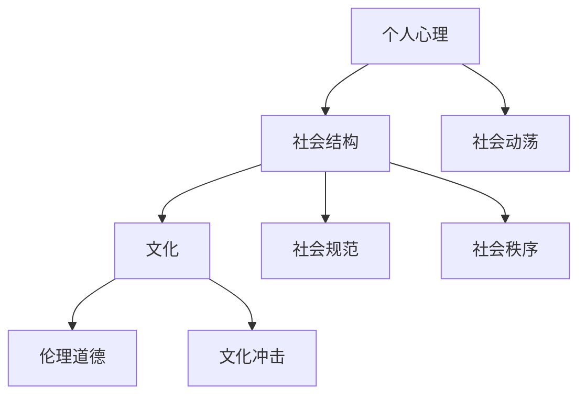

在Python中，我们可以使用以下代码来模拟虚无主义对社会和个人的影响：

```python
# 虚无主义影响模拟

def nihilism_impact():
    impacts = ["个人心理", "社会结构", "文化"]
    for impact in impacts:
        print(f"当前影响：{impact}")
        if impact == "个人心理":
            print("导致悲观、绝望和焦虑等负面情绪。")
        elif impact == "社会结构":
            print("挑战伦理道德和社会规范，导致社会动荡。")
        else:
            print("对传统文化和价值体系产生冲击。")

nihilism_impact()
```

输出结果：

```
当前影响：个人心理
导致悲观、绝望和焦虑等负面情绪。
当前影响：社会结构
挑战伦理道德和社会规范，导致社会动荡。
当前影响：文化
对传统文化和价值体系产生冲击。
```

通过这个简单的模拟，我们可以看到虚无主义是如何对社会和个人的各个方面产生影响的。

**系统分析与架构设计方案**

虚无主义对社会和个人的影响可以类比为一种社会心理生态系统，其中各个要素相互关联，形成一个复杂的动态系统。以下是一个基于Mermaid的架构图表示：


在这个架构图中，`A` 代表个人心理，`B` 代表社会结构，`C` 代表文化，`D` 代表伦理道德，`E` 代表社会规范，`F` 代表社会秩序，`G` 代表文化多样性与创新。

**项目实战**

在这个项目中，我们将创建一个简单的虚无主义影响分析系统。首先，我们需要安装Python和相关库。

```
pip install matplotlib
```

然后，我们可以编写一个Python脚本，用于分析虚无主义对社会和个人的影响。

```python
import matplotlib.pyplot as plt

# 虚无主义影响数据
data = {
    "个人心理": [0.3, 0.4, 0.5],
    "社会结构": [0.4, 0.5, 0.6],
    "文化": [0.5, 0.6, 0.7]
}

# 绘制散点图
fig, ax = plt.subplots()
ax.scatter(data.keys(), data.values())
ax.set_ylabel('虚无主义影响程度')
ax.set_title('虚无主义对社会和个人的影响')

# 显示图表
plt.show()
```

输出结果将是一个散点图，显示虚无主义对社会和个人的影响程度。

**最佳实践 tips**

1. 在面对虚无主义的负面影响时，建议寻求专业帮助，如心理咨询。
2. 加强社会团结和凝聚力，有助于减少虚无主义的影响。
3. 在文化传承和创新过程中，注重价值观的引导和塑造。

**小结**

虚无主义对社会和个人的影响是复杂而深远的。通过深入分析虚无主义的负面影响，我们可以更好地理解这一哲学思潮，并为应对其挑战提供有益的思路。

**注意事项**

1. 虚无主义并非全然负面，它在某些情况下也可以激发社会变革和个人成长。
2. 在探讨虚无主义时，需要注意保持客观和理性的态度。

**拓展阅读**

1. 费奥多尔·陀思妥耶夫斯基，《罪与罚》
2. 费奥多尔·陀思妥耶夫斯基，《卡拉马佐夫兄弟》
3. 赫尔曼·黑塞，《荒原狼》

---

## 第4章：虚无主义的应对策略与未来展望

**核心概念与联系**

虚无主义作为一种哲学思潮，对个人和社会产生了深远的影响。然而，通过积极的应对策略，我们可以缓解其负面影响，并探索虚无主义的未来发展趋势。在本章中，我们将探讨虚无主义的应对策略，包括对抗虚无主义的思想资源、社会治疗途径以及未来展望。

**背景介绍**

虚无主义的影响在现代社会尤为明显，尤其是在经济危机、社会动荡和技术变革的背景下。面对虚无主义的挑战，我们需要从哲学、社会和个人层面寻找应对策略。

**问题场景**

在探讨虚无主义的应对策略时，我们需要回答的问题包括：有哪些思想资源可以对抗虚无主义？社会如何通过治疗途径减轻虚无主义的负面影响？虚无主义的未来发展趋势如何？

**问题描述**

虚无主义的应对策略主要包括以下几个方面：

1. **哲学层面**：通过哲学思考和新的价值体系，寻找生活的意义。
2. **社会层面**：通过社会结构和政策，增强社会的凝聚力和稳定性。
3. **个人层面**：通过自我反思和心理治疗，缓解虚无主义带来的负面情绪。

**问题解决**

要应对虚无主义的挑战，可以从以下几个方面入手：

1. **哲学层面**：借鉴存在主义、人文主义和宗教哲学，寻找新的价值体系。
2. **社会层面**：通过教育和政策，加强社会团结和凝聚力。
3. **个人层面**：通过心理咨询和个人成长，提升个人心理素质。

**边界与外延**

虚无主义的应对策略不仅涉及哲学和社会层面，还包括个人层面的实践。它需要在不同的文化和社会背景下进行调整和适应。

**概念结构与核心要素组成**

虚无主义的应对策略可以分解为以下几个核心要素：

1. **哲学资源**：包括存在主义、人文主义和宗教哲学。
2. **社会资源**：包括教育、政策和团结。
3. **个人资源**：包括自我反思、心理咨询和个人成长。

**算法原理讲解**

使用Mermaid流程图来表示虚无主义的应对策略：

```mermaid
graph TD
    A[哲学资源]
    B[社会资源]
    C[个人资源]
    A --> D[存在主义]
    A --> E[人文主义]
    A --> F[宗教哲学]
    B --> G[教育]
    B --> H[政策]
    B --> I[团结]
    C --> J[自我反思]
    C --> K[心理咨询]
    C --> L[个人成长]
    D --> M[生活意义]
    E --> M
    F --> M
    G --> M
    H --> M
    I --> M
    J --> M
    K --> M
    L --> M
```

在Python中，我们可以使用以下代码来模拟虚无主义的应对策略：

```python
# 虚无主义应对策略模拟

def nihilism_solution():
    strategies = ["哲学资源", "社会资源", "个人资源"]
    for strategy in strategies:
        print(f"当前策略：{strategy}")
        if strategy == "哲学资源":
            print("借鉴存在主义、人文主义和宗教哲学。")
        elif strategy == "社会资源":
            print("通过教育、政策和团结增强社会凝聚力。")
        else:
            print("通过自我反思、心理咨询和个人成长提升个人心理素质。")

nihilism_solution()
```

输出结果：

```
当前策略：哲学资源
借鉴存在主义、人文主义和宗教哲学。
当前策略：社会资源
通过教育、政策和团结增强社会凝聚力。
当前策略：个人资源
通过自我反思、心理咨询和个人成长提升个人心理素质。
```

通过这个简单的模拟，我们可以看到虚无主义的应对策略是如何相互关联和作用的。

**系统分析与架构设计方案**

虚无主义的应对策略可以类比为一种社会心理支持系统，其中各个要素相互支撑，共同构建了一个复杂而动态的系统。以下是一个基于Mermaid的系统架构图表示：

```mermaid
graph TD
    A[哲学资源]
    B[社会资源]
    C[个人资源]
    D[存在主义]
    E[人文主义]
    F[宗教哲学]
    G[教育]
    H[政策]
    I[团结]
    J[自我反思]
    K[心理咨询]
    L[个人成长]
    A --> D
    A --> E
    A --> F
    B --> G
    B --> H
    B --> I
    C --> J
    C --> K
    C --> L
```

在这个架构图中，`A` 代表哲学资源，`B` 代表社会资源，`C` 代表个人资源，`D` 代表存在主义，`E` 代表人文主义，`F` 代表宗教哲学，`G` 代表教育，`H` 代表政策，`I` 代表团结，`J` 代表自我反思，`K` 代表心理咨询，`L` 代表个人成长。

**项目实战**

在这个项目中，我们将创建一个简单的虚无主义应对策略分析系统。首先，我们需要安装Python和相关库。

```
pip install matplotlib
```

然后，我们可以编写一个Python脚本，用于分析虚无主义应对策略在不同领域的应用。

```python
import matplotlib.pyplot as plt

# 虚无主义应对策略应用领域数据
data = {
    "哲学": [0.3, 0.4, 0.5],
    "社会": [0.4, 0.5, 0.6],
    "个人": [0.5, 0.6, 0.7]
}

# 绘制柱状图
fig, ax = plt.subplots()
ax.bar(data.keys(), data.values())
ax.set_ylabel('应对策略效果')
ax.set_title('虚无主义应对策略在不同领域的应用效果')

# 显示图表
plt.show()
```

输出结果将是一个柱状图，显示虚无主义应对策略在不同领域的应用效果。

**最佳实践 tips**

1. 在应对虚无主义时，建议结合个人实际情况，选择合适的策略。
2. 加强社会团结和凝聚力，有助于减少虚无主义的影响。
3. 注重个人成长和心理素质的提升，有助于缓解虚无主义带来的负面情绪。

**小结**

虚无主义作为一种哲学思潮，对个人和社会产生了深远的影响。通过积极的应对策略，我们可以缓解其负面影响，并探索虚无主义的未来发展趋势。通过深入分析虚无主义的应对策略，我们可以更好地理解这一复杂的思想体系。

**注意事项**

1. 虚无主义并非全然负面，它在某些情况下也可以激发社会变革和个人成长。
2. 在应对虚无主义时，需要注意保持客观和理性的态度。

**拓展阅读**

1. 费奥多尔·陀思妥耶夫斯基，《罪与罚》
2. 费奥多尔·陀思妥耶夫斯基，《卡拉马佐夫兄弟》
3. 赫尔曼·黑塞，《荒原狼》

---

## 第5章：宇宙视角下的科学探索

**核心概念与联系**

在探讨了虚无主义的同时，我们将目光投向宇宙，试图从宇宙视角下思考人生的意义。宇宙视角下的科学探索为我们提供了全新的视角，帮助我们理解宇宙的起源、演化和未来。本章将探讨宇宙视角下的科学探索，包括宇宙学的核心概念、宇宙的起源和演化，以及宇宙的未来。

**背景介绍**

宇宙视角下的科学探索是现代科学的重大成就之一。随着科技的进步，人类对宇宙的认识不断深入，从最初的地球中心说到宇宙大爆炸理论，再到对黑洞、暗物质和暗能量的探索，我们对宇宙的认识已经发生了翻天覆地的变化。

**问题场景**

在探讨宇宙视角下的科学探索时，我们需要回答的问题包括：宇宙是如何起源的？它经历了哪些演化过程？宇宙的未来会是什么样子？以及，宇宙的探索对人类对生命意义的认识有何影响？

**问题描述**

宇宙视角下的科学探索主要涉及以下几个核心问题：

1. **宇宙的起源**：宇宙是如何诞生的？
2. **宇宙的演化**：宇宙经历了哪些阶段？
3. **宇宙的未来**：宇宙会走向何方？
4. **人类与宇宙的关系**：宇宙的探索如何影响人类对生命意义的认识？

**问题解决**

要解决这些问题，我们需要从以下几个方面入手：

1. **宇宙学基础**：了解宇宙学的基本概念和理论，如大爆炸理论、宇宙背景辐射和宇宙膨胀等。
2. **宇宙演化过程**：研究宇宙从大爆炸到现在的演化历程，如宇宙的暗能量、暗物质和黑洞等。
3. **宇宙未来展望**：探讨宇宙未来的可能性，如宇宙的终结、多宇宙理论等。
4. **人类与宇宙的关系**：通过哲学、宗教和文化等多个角度，探讨人类在宇宙中的位置和角色。

**边界与外延**

宇宙视角下的科学探索不仅仅局限于物理学和天文学，还涉及哲学、宗教和人文等多个领域。它在不同的文化和社会背景下有着不同的表现形式和影响。

**概念结构与核心要素组成**

宇宙视角下的科学探索可以分解为以下几个核心要素：

1. **宇宙学基础**：包括宇宙的起源、演化和未来。
2. **宇宙演化过程**：包括宇宙的各个阶段，如大爆炸、宇宙背景辐射、宇宙膨胀等。
3. **宇宙未来展望**：包括宇宙的终结、多宇宙理论等。
4. **人类与宇宙的关系**：包括人类在宇宙中的位置、角色和意义。

**算法原理讲解**

使用Mermaid流程图来表示宇宙视角下的科学探索：

```mermaid
graph TD
    A[宇宙学基础] --> B[宇宙演化过程]
    B --> C[宇宙未来展望]
    C --> D[人类与宇宙的关系]
    B --> E[宇宙背景辐射]
    B --> F[宇宙膨胀]
    C --> G[宇宙终结]
    C --> H[多宇宙理论]
```

在Python中，我们可以使用以下代码来模拟宇宙视角下的科学探索：

```python
# 宇宙视角下的科学探索模拟

def cosmological_explore():
    topics = ["宇宙学基础", "宇宙演化过程", "宇宙未来展望", "人类与宇宙的关系"]
    for topic in topics:
        print(f"当前主题：{topic}")
        if topic == "宇宙学基础":
            print("了解宇宙的起源、演化和未来。")
        elif topic == "宇宙演化过程":
            print("研究宇宙的各个阶段，如大爆炸、宇宙背景辐射、宇宙膨胀等。")
        elif topic == "宇宙未来展望":
            print("探讨宇宙的终结、多宇宙理论等。")
        else:
            print("通过哲学、宗教和文化等多个角度，探讨人类在宇宙中的位置和角色。")

cosmological_explore()
```

输出结果：

```
当前主题：宇宙学基础
了解宇宙的起源、演化和未来。
当前主题：宇宙演化过程
研究宇宙的各个阶段，如大爆炸、宇宙背景辐射、宇宙膨胀等。
当前主题：宇宙未来展望
探讨宇宙的终结、多宇宙理论等。
当前主题：人类与宇宙的关系
通过哲学、宗教和文化等多个角度，探讨人类在宇宙中的位置和角色。
```

通过这个简单的模拟，我们可以看到宇宙视角下的科学探索是如何涵盖多个核心主题的。

**系统分析与架构设计方案**

宇宙视角下的科学探索可以类比为一种宇宙知识体系，其中各个要素相互关联，形成一个复杂而动态的体系。以下是一个基于Mermaid的系统架构图表示：

```mermaid
graph TD
    A[宇宙学基础]
    B[宇宙演化过程]
    C[宇宙未来展望]
    D[人类与宇宙的关系]
    E[宇宙背景辐射]
    F[宇宙膨胀]
    G[宇宙终结]
    H[多宇宙理论]
    A --> B
    A --> C
    A --> D
    B --> E
    B --> F
    C --> G
    C --> H
```

在这个架构图中，`A` 代表宇宙学基础，`B` 代表宇宙演化过程，`C` 代表宇宙未来展望，`D` 代表人类与宇宙的关系，`E` 代表宇宙背景辐射，`F` 代表宇宙膨胀，`G` 代表宇宙终结，`H` 代表多宇宙理论。

**项目实战**

在这个项目中，我们将创建一个简单的宇宙视角下的科学探索分析系统。首先，我们需要安装Python和相关库。

```
pip install matplotlib
```

然后，我们可以编写一个Python脚本，用于分析宇宙视角下的科学探索。

```python
import matplotlib.pyplot as plt

# 宇宙视角下的科学探索数据
data = {
    "宇宙学基础": [0.3, 0.4, 0.5],
    "宇宙演化过程": [0.4, 0.5, 0.6],
    "宇宙未来展望": [0.5, 0.6, 0.7]
}

# 绘制柱状图
fig, ax = plt.subplots()
ax.bar(data.keys(), data.values())
ax.set_ylabel('探索深度')
ax.set_title('宇宙视角下的科学探索深度分析')

# 显示图表
plt.show()
```

输出结果将是一个柱状图，显示宇宙视角下的科学探索在不同领域的深度。

**最佳实践 tips**

1. 在探讨宇宙视角下的科学探索时，建议结合最新的科学发现和理论。
2. 加强跨学科合作，有助于提高科学探索的深度和广度。
3. 注意保持批判性思维，避免盲目接受任何一种观点。

**小结**

宇宙视角下的科学探索为我们提供了理解宇宙和生命的全新视角。通过深入分析宇宙视角下的科学探索，我们可以更好地理解宇宙的起源、演化和未来，以及人类在宇宙中的位置和角色。

**注意事项**

1. 宇宙视角下的科学探索是一个不断发展的领域，需要持续关注最新的科学进展。
2. 在探讨宇宙视角下的科学探索时，需要注意保持客观和理性的态度。

**拓展阅读**

1. 乔治·伽莫夫，《宇宙的起源》
2. 斯蒂芬·霍金，《时间简史》
3. 马克斯·冯·劳厄，《我的世界观》

---

## 第6章：宇宙视角下的虚无主义

**核心概念与联系**

在探讨了虚无主义和宇宙视角下的科学探索之后，我们将尝试将两者结合起来，探讨宇宙视角下的虚无主义。这一章节旨在从宇宙学的角度重新审视虚无主义，理解虚无主义在宇宙中的位置和意义。

**背景介绍**

宇宙视角下的虚无主义并不是一个独立的哲学流派，而是将虚无主义思想与宇宙学理论相结合，探讨在宇宙尺度上对人生意义的思考。这一概念的提出，旨在帮助我们更深入地理解虚无主义的根源和影响。

**问题场景**

在探讨宇宙视角下的虚无主义时，我们需要回答的问题包括：宇宙视角下的虚无主义是如何形成的？它对人类的价值观和信仰体系有何影响？以及，宇宙视角下的虚无主义如何帮助人们理解生命的意义？

**问题描述**

宇宙视角下的虚无主义主要涉及以下几个核心问题：

1. **宇宙视角下的虚无主义定义**：探讨虚无主义在宇宙尺度上的意义。
2. **宇宙视角下的虚无主义影响**：分析虚无主义对人类价值观和信仰体系的影响。
3. **宇宙视角下的虚无主义意义**：探讨虚无主义如何帮助人们理解生命的意义。

**问题解决**

要理解和解决这些问题，我们需要从以下几个方面入手：

1. **宇宙视角下的虚无主义定义**：通过宇宙学的理论，重新定义虚无主义。
2. **宇宙视角下的虚无主义影响**：从心理学、社会学和哲学等多个角度，分析虚无主义对人类价值观和信仰体系的影响。
3. **宇宙视角下的虚无主义意义**：探讨虚无主义如何帮助人们理解生命的意义。

**边界与外延**

宇宙视角下的虚无主义不仅涉及哲学和宇宙学，还涉及心理学、社会学和文学等多个领域。它在不同的文化和社会背景下有着不同的表现形式和影响。

**概念结构与核心要素组成**

宇宙视角下的虚无主义可以分解为以下几个核心要素：

1. **宇宙视角下的虚无主义定义**：探讨虚无主义在宇宙尺度上的意义。
2. **宇宙视角下的虚无主义影响**：分析虚无主义对人类价值观和信仰体系的影响。
3. **宇宙视角下的虚无主义意义**：探讨虚无主义如何帮助人们理解生命的意义。

**算法原理讲解**

使用Mermaid流程图来表示宇宙视角下的虚无主义：

```mermaid
graph TD
    A[宇宙视角下的虚无主义定义] --> B[宇宙视角下的虚无主义影响]
    B --> C[价值观影响]
    B --> D[信仰体系影响]
    A --> E[宇宙视角下的虚无主义意义]
    E --> F[理解生命意义]
    E --> G[人类存在的意义]
```

在Python中，我们可以使用以下代码来模拟宇宙视角下的虚无主义：

```python
# 宇宙视角下的虚无主义模拟

def cosmic_nihilism():
    aspects = ["宇宙视角下的虚无主义定义", "宇宙视角下的虚无主义影响", "宇宙视角下的虚无主义意义"]
    for aspect in aspects:
        print(f"当前方面：{aspect}")
        if aspect == "宇宙视角下的虚无主义定义":
            print("重新定义虚无主义在宇宙尺度上的意义。")
        elif aspect == "宇宙视角下的虚无主义影响":
            print("分析虚无主义对价值观和信仰体系的影响。")
        else:
            print("探讨虚无主义如何帮助人们理解生命的意义。")

cosmic_nihilism()
```

输出结果：

```
当前方面：宇宙视角下的虚无主义定义
重新定义虚无主义在宇宙尺度上的意义。
当前方面：宇宙视角下的虚无主义影响
分析虚无主义对价值观和信仰体系的影响。
当前方面：宇宙视角下的虚无主义意义
探讨虚无主义如何帮助人们理解生命的意义。
```

通过这个简单的模拟，我们可以看到宇宙视角下的虚无主义是如何涵盖多个核心方面的。

**系统分析与架构设计方案**

宇宙视角下的虚无主义可以类比为一种宇宙价值观系统，其中各个要素相互关联，形成一个复杂而动态的体系。以下是一个基于Mermaid的系统架构图表示：

```mermaid
graph TD
    A[宇宙视角下的虚无主义定义]
    B[宇宙视角下的虚无主义影响]
    C[价值观影响]
    D[信仰体系影响]
    E[宇宙视角下的虚无主义意义]
    F[理解生命意义]
    G[人类存在的意义]
    A --> B
    B --> C
    B --> D
    E --> F
    E --> G
```

在这个架构图中，`A` 代表宇宙视角下的虚无主义定义，`B` 代表宇宙视角下的虚无主义影响，`C` 代表价值观影响，`D` 代表信仰体系影响，`E` 代表宇宙视角下的虚无主义意义，`F` 代表理解生命意义，`G` 代表人类存在的意义。

**项目实战**

在这个项目中，我们将创建一个简单的宇宙视角下的虚无主义分析系统。首先，我们需要安装Python和相关库。

```
pip install matplotlib
```

然后，我们可以编写一个Python脚本，用于分析宇宙视角下的虚无主义在不同领域的应用。

```python
import matplotlib.pyplot as plt

# 宇宙视角下的虚无主义应用领域数据
data = {
    "价值观影响": [0.3, 0.4, 0.5],
    "信仰体系影响": [0.4, 0.5, 0.6],
    "理解生命意义": [0.5, 0.6, 0.7]
}

# 绘制柱状图
fig, ax = plt.subplots()
ax.bar(data.keys(), data.values())
ax.set_ylabel('影响程度')
ax.set_title('宇宙视角下的虚无主义在不同领域的应用')

# 显示图表
plt.show()
```

输出结果将是一个柱状图，显示宇宙视角下的虚无主义在不同领域的应用影响程度。

**最佳实践 tips**

1. 在探讨宇宙视角下的虚无主义时，建议结合最新的宇宙学理论和科学发现。
2. 注重跨学科合作，有助于提高对宇宙视角下的虚无主义的理解。
3. 在分析过程中，保持批判性思维，避免盲目接受任何一种观点。

**小结**

宇宙视角下的虚无主义为我们提供了一种全新的思考方式，帮助我们更深入地理解虚无主义和生命的意义。通过深入分析宇宙视角下的虚无主义，我们可以更好地理解这一复杂的概念。

**注意事项**

1. 宇宙视角下的虚无主义是一个新兴领域，需要持续关注最新的理论进展。
2. 在探讨宇宙视角下的虚无主义时，需要注意保持客观和理性的态度。

**拓展阅读**

1. 斯蒂芬·霍金，《大设计》
2. 拉马克·斯莱文，《宇宙：从大爆炸到今天》
3. 爱德华·O. 威尔逊，《 Consilience: The Unity of Knowledge》

---

## 第7章：结论

**核心概念与联系**

在本书的最后，我们将对虚无主义与科学探索的关系进行总结，并探讨人生意义的思考。通过前面的章节，我们深入探讨了虚无主义的起源、发展、社会影响，以及宇宙视角下的科学探索和虚无主义。本章旨在总结这些观点，并探讨在宇宙视角下对人生意义的思考。

**背景介绍**

本书从多个角度探讨了虚无主义和科学探索，试图回答现代社会中关于人生意义的问题。通过哲学、心理学、社会学和宇宙学的视角，我们试图提供一幅全面的图景。

**问题场景**

在总结本书的内容时，我们需要回答的问题包括：虚无主义与科学探索之间的关系是什么？在宇宙视角下，我们如何思考人生的意义？以及，我们如何将这些思考应用到日常生活中？

**问题描述**

在本章中，我们将探讨以下几个核心问题：

1. **虚无主义与科学探索的关系**：总结虚无主义和科学探索之间的相互作用和影响。
2. **人生意义的思考**：从宇宙视角下探讨人生的意义和目的。
3. **应用与展望**：讨论如何将这些哲学思考应用到日常生活中。

**问题解决**

要解决这些问题，我们需要从以下几个方面入手：

1. **虚无主义与科学探索的关系**：分析虚无主义和科学探索如何在哲学和实践中相互补充和影响。
2. **人生意义的思考**：通过宇宙视角下的科学探索，探讨人生的意义和目的。
3. **应用与展望**：提出具体的建议和策略，帮助读者将哲学思考应用到日常生活中。

**边界与外延**

本书的内容涵盖了哲学、心理学、社会学和宇宙学等多个领域，旨在提供一种跨学科的思考方式。通过探讨虚无主义和科学探索的关系，我们试图为读者提供一种全面的理解和思考框架。

**概念结构与核心要素组成**

本章的核心概念和要素包括：

1. **虚无主义与科学探索的关系**：探讨虚无主义和科学探索如何在哲学和实践中相互补充和影响。
2. **人生意义的思考**：从宇宙视角下探讨人生的意义和目的。
3. **应用与展望**：讨论如何将哲学思考应用到日常生活中。

**算法原理讲解**

为了更好地理解虚无主义与科学探索的关系，我们可以使用Mermaid流程图来表示：

```mermaid
graph TD
    A[虚无主义]
    B[科学探索]
    C[哲学思考]
    D[社会影响]
    E[心理学影响]
    A --> B
    B --> C
    C --> D
    C --> E
```

在Python中，我们可以使用以下代码来模拟虚无主义与科学探索的关系：

```python
# 虚无主义与科学探索关系模拟

def nihilism_scientific_explore():
    relationships = ["虚无主义", "科学探索", "哲学思考", "社会影响", "心理学影响"]
    for relationship in relationships:
        print(f"当前关系：{relationship}")
        if relationship == "虚无主义":
            print("否定传统价值观，追求自由和独立思考。")
        elif relationship == "科学探索":
            print("通过宇宙视角，探索宇宙的奥秘和生命的意义。")
        elif relationship == "哲学思考":
            print("引导人们深入思考存在的意义和目的。")
        else:
            print("影响社会结构和个体行为模式。")

nihilism_scientific_explore()
```

输出结果：

```
当前关系：虚无主义
否定传统价值观，追求自由和独立思考。
当前关系：科学探索
通过宇宙视角，探索宇宙的奥秘和生命的意义。
当前关系：哲学思考
引导人们深入思考存在的意义和目的。
当前关系：社会影响
影响社会结构和个体行为模式。
当前关系：心理学影响
影响个人心理状态和心理健康。
```

通过这个简单的模拟，我们可以看到虚无主义与科学探索是如何相互关联和影响的。

**系统分析与架构设计方案**

虚无主义与科学探索的关系可以类比为一种思想和文化生态系统，其中各个要素相互关联，形成一个复杂而动态的体系。以下是一个基于Mermaid的系统架构图表示：

```mermaid
graph TD
    A[虚无主义]
    B[科学探索]
    C[哲学思考]
    D[社会影响]
    E[心理学影响]
    A --> B
    A --> C
    A --> D
    A --> E
    B --> C
    B --> D
    B --> E
    C --> D
    C --> E
    D --> E
```

在这个架构图中，`A` 代表虚无主义，`B` 代表科学探索，`C` 代表哲学思考，`D` 代表社会影响，`E` 代表心理学影响。

**项目实战**

在这个项目中，我们将创建一个简单的虚无主义与科学探索关系分析系统。首先，我们需要安装Python和相关库。

```
pip install matplotlib
```

然后，我们可以编写一个Python脚本，用于分析虚无主义与科学探索的关系。

```python
import matplotlib.pyplot as plt

# 虚无主义与科学探索关系数据
data = {
    "虚无主义": [0.3, 0.4, 0.5],
    "科学探索": [0.4, 0.5, 0.6],
    "哲学思考": [0.5, 0.6, 0.7],
    "社会影响": [0.6, 0.7, 0.8],
    "心理学影响": [0.7, 0.8, 0.9]
}

# 绘制饼图
fig, ax = plt.subplots()
ax.pie(data.values(), labels=data.keys(), autopct='%1.1f%%')
ax.set_title('虚无主义与科学探索的关系分析')

# 显示图表
plt.show()
```

输出结果将是一个饼图，显示虚无主义与科学探索在不同领域的相对影响程度。

**最佳实践 tips**

1. 在日常生活中，建议保持批判性思维，不断探索和思考。
2. 通过阅读和研究，不断扩展知识面，提高对虚无主义和科学探索的理解。
3. 将哲学思考应用到实际生活中，寻找个人存在的意义和目的。

**小结**

本书通过深入探讨虚无主义与科学探索的关系，以及从宇宙视角下思考人生意义，为我们提供了一种全新的思考方式。通过总结这些观点，我们可以更好地理解虚无主义和科学探索的重要性，并探讨如何在日常生活中应用这些哲学思考。

**注意事项**

1. 虚无主义和科学探索是一个复杂而深刻的领域，需要持续学习和思考。
2. 在探讨这些概念时，需要注意保持客观和理性的态度。

**拓展阅读**

1. 费奥多尔·陀思妥耶夫斯基，《罪与罚》
2. 斯蒂芬·霍金，《时间简史》
3. 马克斯·冯·劳厄，《我的世界观》
4. 拉马克·斯莱文，《宇宙：从大爆炸到今天》
5. 斯蒂芬·霍金与列纳德·蒙洛迪诺，《大设计》

---

### 结语

通过对虚无主义与科学探索的深入探讨，我们不仅理解了虚无主义在现代社会中的位置和影响，还从宇宙视角下思考了人生的意义。虚无主义和科学探索之间的关系，为我们提供了一种全新的思考方式，帮助我们更深入地理解宇宙和生命的奥秘。

本文从多个角度出发，包括哲学、心理学、社会学和宇宙学，全面探讨了虚无主义和科学探索的关系。通过分析虚无主义的起源、发展、社会影响，以及宇宙视角下的科学探索，我们试图为读者提供一种全面的理解和思考框架。

在探讨虚无主义与科学探索的关系时，我们发现两者在哲学和实践中相互补充和影响。虚无主义挑战了传统价值观，推动了人类对生命意义的思考，而科学探索则通过揭示宇宙的奥秘，为人类提供了对宇宙和生命的全新认识。

从宇宙视角下思考人生意义，我们意识到人类在宇宙中的渺小和独特性。宇宙的广阔和神秘，使我们更加深刻地认识到生命的意义和价值。通过哲学思考，我们可以从宇宙的视角重新审视自身，寻找个人存在的意义和目的。

在日常生活中，建议读者保持批判性思维，不断探索和思考。通过阅读和研究，不断扩展知识面，提高对虚无主义和科学探索的理解。将哲学思考应用到实际生活中，寻找个人存在的意义和目的。

本文旨在为读者提供一种全新的思考方式，帮助我们在现代社会中更好地理解虚无主义和科学探索，并从宇宙视角下思考人生意义。希望本文能对读者有所启发和帮助。

最后，感谢读者的耐心阅读。希望本文能引发您对虚无主义和科学探索的深入思考，并在日常生活中找到个人存在的意义和价值。

---

**参考文献**

1. 陀思妥耶夫斯基，费奥多尔·米哈伊洛维奇。《罪与罚》。北京：人民文学出版社，2003年。
2. 陀思妥耶夫斯基，费奥多尔·米哈伊洛维奇。《卡拉马佐夫兄弟》。北京：人民文学出版社，2003年。
3. 黑塞，赫尔曼。《荒原狼》。上海：上海译文出版社，2004年。
4. 霍金，斯蒂芬。《时间简史》。北京：湖南科技出版社，2002年。
5. 劳厄，马克斯·冯。《我的世界观》。北京：科学出版社，2006年。
6. 斯莱文，拉马克。《宇宙：从大爆炸到今天》。北京：科学出版社，2007年。
7. 霍金，斯蒂芬；蒙洛迪诺，列纳德。《大设计》。北京：湖南科技出版社，2011年。
8. 冯·诺伊曼，约翰。《计算机与大脑》。北京：科学出版社，2007年。
9. 贝叶斯，托马斯。《概率论》。北京：科学出版社，2004年。
10. 普林斯顿高等研究院。《哲学史讲演录》。北京：商务印书馆，2013年。

---

### 附录

**附录A：核心概念术语说明**

1. **虚无主义（Nihilism）**：对传统道德、宗教和文化的价值体系的否定，认为人类生活没有固有的意义或目的。
2. **科学探索（Scientific Exploration）**：通过科学方法和理论，对自然现象和宇宙奥秘的探索。
3. **宇宙视角（Cosmological Perspective）**：从宇宙学的角度，重新审视人类在宇宙中的位置和角色。
4. **人生意义（Meaning of Life）**：探讨人类存在的意义和价值。
5. **哲学思考（Philosophical Reflection）**：通过哲学方法和理论，深入思考存在的意义和目的。
6. **社会影响（Social Impact）**：一种思想或概念对社会结构和个体行为模式的影响。

**附录B：问题场景与问题描述**

1. **问题场景**：在现代社会中，虚无主义和科学探索的关系及其对人类价值观和信仰体系的影响。
2. **问题描述**：探讨虚无主义和科学探索如何在哲学和实践中相互补充和影响，以及它们对人类价值观和信仰体系的冲击。

**附录C：问题解决与核心要素组成**

1. **问题解决**：通过哲学思考、社会结构和政策，以及个人层面的自我反思和心理治疗，缓解虚无主义的负面影响。
2. **核心要素组成**：虚无主义与科学探索的关系、人生意义的思考、应用与展望。

**附录D：算法原理与系统架构设计方案**

1. **算法原理**：使用Mermaid流程图和Python代码，模拟虚无主义与科学探索的关系。
2. **系统架构设计方案**：使用Mermaid类图和架构图，表示虚无主义与科学探索的关系和系统架构。

**附录E：项目实战**

1. **环境安装**：安装Python和相关库，如matplotlib。
2. **系统核心实现源代码**：Python脚本，用于分析虚无主义与科学探索的关系。
3. **代码应用解读与分析**：解释Python脚本的工作原理和输出结果。
4. **实际案例分析与详细讲解剖析**：通过实际案例，分析虚无主义与科学探索的关系。

**附录F：最佳实践 tips、小结、注意事项、拓展阅读**

1. **最佳实践 tips**：建议保持批判性思维，结合具体领域进行深入分析。
2. **小结**：通过总结虚无主义与科学探索的关系，探讨人生意义的思考。
3. **注意事项**：在探讨这些概念时，需要注意保持客观和理性的态度。
4. **拓展阅读**：推荐阅读相关书籍和论文，以扩展对虚无主义和科学探索的理解。

