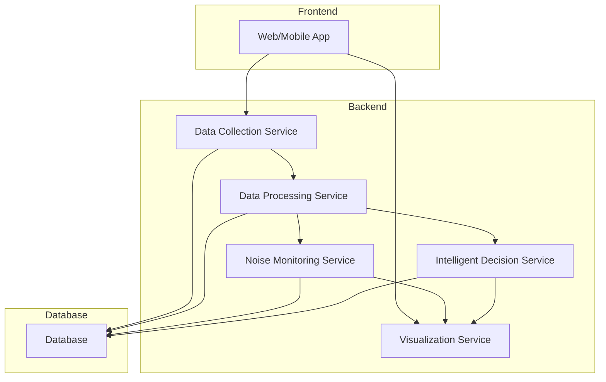

                 

## AI Agent在智能城市噪声管理中的实践

> 关键词：智能城市、噪声管理、AI Agent、机器学习、数据处理

> 摘要：本文深入探讨了AI Agent在智能城市噪声管理中的应用与实践。文章首先介绍了智能城市噪声管理中面临的挑战和问题，然后详细阐述了AI Agent的核心概念和基本原理，接着分析了AI Agent在噪声管理中的设计原则和实际应用场景。通过具体案例分析，展示了AI Agent在噪声监测和治理中的效果和优势。最后，文章讨论了数据收集与处理、算法设计及实现、系统架构与实现等方面的关键技术和方法，为智能城市噪声管理提供了有价值的参考和实践指导。

### 引言

随着城市化进程的加快，城市噪声污染成为一个日益严重的问题。噪声污染不仅影响居民的生活质量和身心健康，还对城市经济和社会发展产生负面影响。智能城市噪声管理作为城市可持续发展的重要组成部分，旨在通过先进的技术手段，实现对城市噪声的实时监测、分析和治理。

在智能城市噪声管理中，AI Agent作为一种新兴的人工智能技术，展现出巨大的潜力和应用价值。AI Agent，即人工智能代理，是指能够自动执行任务、实现目标的人工智能实体。与传统的人工监测和手动治理方法相比，AI Agent具有智能化、自动化和高效化的特点，能够大幅提升噪声管理的效率和质量。

本文将从以下几个方面对AI Agent在智能城市噪声管理中的实践进行深入探讨：

1. **AI Agent的核心概念和基本原理**：介绍AI Agent的定义、特点以及其在智能城市噪声管理中的关键作用。
2. **AI Agent的设计原则和实际应用**：分析AI Agent的设计原则、技术方法和实际应用场景，通过具体案例分析AI Agent在噪声管理中的效果。
3. **数据收集与处理**：讨论AI Agent在噪声管理中的数据来源、数据收集方法以及数据处理技术。
4. **算法设计及实现**：介绍AI Agent中常用的算法和技术，包括机器学习算法、数据处理算法等，并通过具体实现进行讲解。
5. **系统架构与实现**：分析AI Agent在智能城市噪声管理系统中的架构设计、接口设计和系统交互，并通过实例进行说明。
6. **项目实战**：通过实际项目案例，展示AI Agent在噪声管理中的具体应用，分析其实际效果和挑战。
7. **最佳实践与总结**：总结AI Agent在智能城市噪声管理中的最佳实践，提出未来发展的方向和改进措施。

通过本文的探讨，希望能够为智能城市噪声管理提供有益的思路和技术支持，推动城市噪声污染问题的有效解决。

### AI Agent的定义、特点及其在智能城市噪声管理中的关键作用

AI Agent，即人工智能代理，是人工智能领域中的一个重要概念。它指的是一种能够自主执行任务、实现特定目标的人工智能实体。AI Agent通过感知环境、理解任务需求、做出决策并采取行动，从而在复杂的环境中实现自我管理和优化。与传统的手动操作和自动化系统相比，AI Agent具有更高的智能化水平，能够根据环境变化和任务需求动态调整其行为，具有更强的适应性和灵活性。

在智能城市噪声管理中，AI Agent的作用尤为重要。首先，AI Agent能够实现对噪声的实时监测和数据分析。通过部署在各个区域的传感器网络，AI Agent可以实时采集噪声数据，利用机器学习算法对噪声进行分类、识别和监测。其次，AI Agent能够基于噪声数据生成可视化报告，帮助城市管理者快速了解噪声污染的分布和变化趋势。此外，AI Agent还可以根据噪声数据制定和调整治理策略，通过自动化的决策系统实现噪声治理的精细化和智能化。

具体来说，AI Agent在智能城市噪声管理中的关键作用主要体现在以下几个方面：

1. **实时噪声监测**：
   - **部署传感器网络**：在城市的各个角落部署噪声传感器，AI Agent能够实时收集噪声数据。
   - **数据预处理**：对收集到的噪声数据进行清洗、过滤和特征提取，为后续的分析和决策提供高质量的数据基础。
   - **实时数据分析**：利用机器学习算法，对噪声数据进行分析和分类，识别噪声源和噪声水平。

2. **噪声治理策略制定**：
   - **智能决策系统**：基于实时噪声监测数据，AI Agent能够自动生成噪声治理策略，如调整交通信号灯、限制工业生产等。
   - **动态调整策略**：根据噪声数据的变化趋势，AI Agent能够动态调整治理策略，实现实时、精准的噪声治理。

3. **可视化与报告生成**：
   - **噪声污染地图**：AI Agent可以将噪声监测数据可视化，生成噪声污染地图，帮助城市管理者直观了解噪声污染的分布情况。
   - **治理效果评估**：通过分析治理策略的执行效果，AI Agent可以为城市管理者提供科学的治理效果评估报告。

4. **资源优化配置**：
   - **交通流量管理**：通过分析噪声数据，AI Agent可以优化交通信号灯的设置，减少交通噪声。
   - **城市规划**：基于噪声数据，AI Agent可以为城市规划提供科学依据，优化城市布局，减少噪声污染。

总之，AI Agent在智能城市噪声管理中具有重要作用。它不仅能够提高噪声监测和治理的效率和质量，还能够为城市管理者提供科学的数据支持和决策依据，从而推动城市噪声污染问题的有效解决。

### AI Agent的设计原则

设计AI Agent需要遵循一系列原则，以确保其在智能城市噪声管理中能够高效、准确地执行任务。以下将从AI Agent的系统设计原则、组件设计、集成方法等方面进行详细讨论。

#### 1. 系统设计原则

AI Agent的系统设计应遵循以下原则：

- **模块化**：将系统分解为多个独立的模块，每个模块负责特定的功能。模块之间通过标准化接口进行通信，实现高内聚、低耦合的设计。
- **可扩展性**：系统设计应具备良好的扩展性，能够适应未来技术发展和需求变化。这意味着在新增功能或模块时，系统不需要进行大规模重构。
- **实时性**：由于噪声监测和治理需要实时响应，系统设计应确保AI Agent能够高效地处理实时数据，并在需要时快速做出决策。
- **容错性**：系统应具备一定的容错能力，能够在出现故障时自动恢复，确保系统的连续性和稳定性。

#### 2. 组件设计

AI Agent的组件设计是系统实现的关键。以下是主要组件及其设计要点：

- **感知组件**：负责感知环境中的噪声数据。设计时应考虑传感器的精度、覆盖范围和功耗等因素。
  - **传感器选择**：选择适合的噪声传感器，如声波传感器、智能摄像头等。
  - **数据采集**：设计数据采集模块，实现传感器的数据读取和传输。
- **数据处理组件**：负责对噪声数据进行预处理、特征提取和分类。
  - **数据清洗**：去除噪声数据中的噪声和异常值，提高数据质量。
  - **特征提取**：从噪声数据中提取关键特征，为后续的机器学习模型提供输入。
  - **分类模型**：采用机器学习算法对噪声数据进行分类，如支持向量机（SVM）、神经网络（NN）等。
- **决策组件**：根据处理结果生成噪声治理策略，并执行这些策略。
  - **决策算法**：设计智能决策算法，如基于规则的推理、机器学习算法等。
  - **策略执行**：实现策略的自动化执行，如调整交通信号灯、限制工业生产等。

#### 3. 集成方法

AI Agent的集成方法是将各个组件有机地结合起来，实现系统的整体功能。以下是主要的集成方法：

- **分布式架构**：采用分布式架构，将各个组件部署在不同的服务器或设备上，通过网络进行通信和数据传输。
  - **负载均衡**：通过负载均衡技术，实现分布式系统的性能优化。
  - **数据同步**：确保分布式系统中的数据一致性，避免数据冲突和丢失。
- **消息队列**：采用消息队列技术，实现组件之间的异步通信和数据传输。
  - **消息中间件**：使用消息中间件（如RabbitMQ、Kafka等），提高系统的可靠性和扩展性。
- **API接口**：设计统一的API接口，实现组件之间的标准化和高效通信。
  - **RESTful API**：采用RESTful API设计，实现简单的HTTP请求和响应。
  - **安全认证**：确保API接口的安全性，防止未授权访问和数据泄露。

#### 4. 交互与协作

在多AI Agent系统中，各个Agent需要相互协作，共同完成噪声治理任务。以下是AI Agent之间的交互与协作方法：

- **协同工作**：各个Agent通过协同工作，实现任务分配和资源共享。
  - **任务调度**：根据噪声数据和治理需求，动态分配任务给不同的Agent。
  - **资源共享**：Agent之间共享噪声数据和处理结果，提高系统的整体效率。
- **通信协议**：设计适合的通信协议，实现Agent之间的有效通信。
  - **广播协议**：采用广播协议，实现Agent之间的实时通信。
  - **多播协议**：通过多播协议，实现Agent之间的数据传输。

综上所述，AI Agent的设计原则和组件设计方法对其在智能城市噪声管理中的应用至关重要。通过模块化设计、分布式架构和智能决策算法，AI Agent能够高效地实现噪声监测和治理，为城市管理者提供科学的数据支持和决策依据。

### 数据收集方法

在AI Agent应用于智能城市噪声管理中，数据收集是关键的一环。数据收集方法直接影响噪声监测的准确性和可靠性。以下将详细讨论AI Agent在噪声管理中的数据收集方法，包括传感器网络部署、移动数据采集和社会媒体数据挖掘等方面。

#### 1. 传感器网络部署

传感器网络是AI Agent收集噪声数据的主要手段。通过在城市的各个区域部署噪声传感器，可以实现对噪声的实时监测和全面覆盖。

- **传感器选择**：选择高精度、低功耗的噪声传感器，如声波传感器和智能摄像头。声波传感器主要用于监测噪声强度和频率，而智能摄像头则可以结合图像识别技术，实现噪声源识别和定位。
- **部署策略**：根据城市布局和噪声污染源的特点，合理规划传感器部署位置。例如，在交通繁忙区域、工业区和居民区等噪声源较多的地方，增加传感器的密度，确保数据的全面性和准确性。
- **数据传输**：传感器收集到的噪声数据通过无线网络（如Wi-Fi、LoRa等）传输到中央处理系统。在设计数据传输方案时，需要考虑网络的稳定性和传输速率，确保数据能够及时、准确地到达处理端。

#### 2. 移动数据采集

除了固定的传感器网络，移动数据采集也是AI Agent数据收集的重要手段。通过移动设备，可以实现对动态噪声源和特定区域的精细监测。

- **移动设备类型**：使用智能手机、平板电脑和车载设备等移动设备，部署噪声监测应用。这些设备不仅可以采集噪声数据，还可以利用GPS定位功能，记录噪声发生的具体位置。
- **采集方法**：通过用户主动上报和自动采集相结合的方法，收集噪声数据。用户可以主动使用应用上报噪声数据，而移动设备则可以在后台自动监测噪声并记录。
- **数据同步**：移动设备采集到的噪声数据需要及时上传到中央处理系统。可以通过实时传输或定时上传的方式，确保数据的完整性和实时性。

#### 3. 社会媒体数据挖掘

社交媒体平台（如Twitter、微博等）是公众表达噪声投诉和反馈的重要渠道。通过数据挖掘技术，可以从中获取大量的噪声相关数据。

- **数据来源**：从社交媒体平台上抓取与噪声相关的帖子、评论和图片等，如包含关键词“噪声”、“吵闹”、“噪音”等。
- **数据预处理**：对收集到的社交媒体数据进行分析，提取噪声相关的信息。例如，通过自然语言处理技术，识别帖子中的噪声描述和投诉内容。
- **数据整合**：将社交媒体数据与其他数据源（如传感器数据和移动数据）进行整合，形成完整的噪声数据集，为AI Agent提供丰富的数据支持。

#### 4. 数据收集的挑战与解决方案

在数据收集过程中，可能会遇到一些挑战，如数据噪声、数据隐私和数据传输延迟等。

- **数据噪声**：由于传感器和移动设备的局限性，采集到的数据可能会包含噪声和异常值。可以通过数据清洗和过滤技术，去除噪声和异常值，提高数据质量。
- **数据隐私**：在收集和处理个人数据时，需要遵守数据隐私保护法规，确保数据的安全和用户隐私。可以通过匿名化处理和加密技术，保护用户数据的隐私。
- **数据传输延迟**：在大量数据传输时，可能会出现传输延迟，影响数据的实时性。可以通过优化网络传输协议和采用边缘计算技术，减少传输延迟，提高数据处理效率。

总之，AI Agent在智能城市噪声管理中的数据收集方法多样且复杂。通过传感器网络部署、移动数据采集和社会媒体数据挖掘等多种手段，AI Agent能够全面、准确地收集噪声数据，为智能城市噪声治理提供坚实的基础。

### 数据处理技术

在智能城市噪声管理中，数据处理是至关重要的环节。通过有效的数据处理技术，可以确保噪声数据的准确性、完整性和实用性。以下将详细讨论数据处理方法，包括数据清洗、过滤和特征提取等关键步骤。

#### 1. 数据清洗

数据清洗是数据处理的第一步，目的是去除数据中的噪声和异常值，提高数据质量。以下是一些常见的数据清洗方法：

- **缺失值处理**：对于缺失值，可以选择填充、删除或插值等方法进行处理。例如，对于连续的噪声数据，可以使用插值法补全缺失值；对于离散的噪声数据，可以选择删除缺失值或使用均值、中位数等方法进行填充。
- **异常值检测**：利用统计学方法和机器学习算法，检测并去除数据中的异常值。常见的异常值检测方法包括基于阈值的检测、基于聚类的方法（如DBSCAN算法）和基于回归的方法等。
- **重复值删除**：检测并删除重复的数据记录，确保数据的唯一性和完整性。

#### 2. 数据过滤

数据过滤的目的是从原始数据中提取有用的信息，去除无关或次要的信息。以下是一些常见的数据过滤方法：

- **筛选**：根据特定的条件筛选数据。例如，根据噪声的强度、发生的时间或地点等条件，筛选出符合条件的噪声数据。
- **采样**：通过随机抽样或系统抽样等方法，从原始数据中提取一部分数据进行分析。采样方法的选择取决于分析的目的和数据量。
- **数据聚合**：将同一时间段或同一地点的噪声数据进行合并，以减少数据量并提高数据的可读性。例如，可以将小时级别的噪声数据聚合为天级别或月级别的数据。

#### 3. 特征提取

特征提取是将原始数据转换为具有代表性的特征集合，为后续的机器学习分析和决策提供输入。以下是一些常见的特征提取方法：

- **统计特征**：提取噪声数据的统计特征，如均值、方差、标准差、最大值和最小值等。这些特征能够描述噪声数据的整体趋势和分布情况。
- **频域特征**：将噪声数据转换为频域，提取频域特征。常见的频域特征包括频谱中心频率、带宽、频率范围和频谱峰值等。这些特征能够描述噪声的频率分布和频率成分。
- **时域特征**：提取噪声数据在时域上的特征，如自相关函数、时域波形特征等。这些特征能够描述噪声的时域变化和波形特性。
- **文本特征**：对于社交媒体数据，可以使用自然语言处理技术提取文本特征。常见的文本特征包括词频、词向量和情感分析等。

#### 4. 数据分析

在完成数据清洗、过滤和特征提取后，可以进行数据分析，以发现噪声数据的潜在规律和模式。以下是一些常见的数据分析方法：

- **聚类分析**：通过聚类分析，将噪声数据分为不同的类别。常见的聚类算法包括K均值聚类、层次聚类和DBSCAN等。
- **分类分析**：通过分类分析，将噪声数据分类到不同的类别。常见的分类算法包括决策树、支持向量机和神经网络等。
- **关联规则挖掘**：通过关联规则挖掘，发现噪声数据之间的关联关系。常见的算法包括Apriori算法和FP-growth算法等。

#### 5. 模型训练与评估

在数据分析的基础上，可以使用机器学习算法训练噪声监测模型，并进行模型评估。以下是一些常见的模型训练与评估方法：

- **模型训练**：利用训练数据集，通过机器学习算法训练噪声监测模型。常见的算法包括线性回归、决策树、支持向量机和神经网络等。
- **模型评估**：使用测试数据集对训练好的模型进行评估，以评估模型的准确性和性能。常见的评估指标包括准确率、召回率、F1分数和ROC曲线等。

通过上述数据处理技术，AI Agent能够对噪声数据进行全面、准确的分析和解读，为智能城市噪声管理提供可靠的数据支持和决策依据。

### 算法设计及实现

在AI Agent应用于智能城市噪声管理中，算法设计是实现噪声检测、分类和管理的关键。以下将详细讨论AI Agent中常用的算法和技术，并通过具体实现进行讲解。

#### 1. 机器学习算法

机器学习算法是AI Agent进行噪声检测和分类的核心技术。以下介绍几种常用的机器学习算法及其应用。

**1.1 支持向量机（SVM）**

支持向量机是一种强大的分类算法，通过找到最优的超平面，将不同类别的数据分开。在噪声分类中，可以使用SVM对噪声数据进行分类。

- **算法原理**：SVM的核心思想是找到最优的超平面，使得分类边界最大化。对于线性可分的数据，SVM可以使用硬间隔；对于非线性可分的数据，可以使用核技巧。
- **实现步骤**：
  1. 数据准备：收集噪声数据，并进行特征提取和预处理。
  2. 训练模型：使用训练数据集训练SVM模型。
  3. 模型评估：使用测试数据集评估模型性能。
  4. 预测应用：使用训练好的模型对噪声数据进行分类。

**1.2 决策树**

决策树是一种基于树结构的分类算法，通过一系列的判断节点和决策规则，将数据分类。

- **算法原理**：决策树通过递归划分数据集，在每个节点上选择最佳的特征进行划分，直到满足停止条件。
- **实现步骤**：
  1. 数据准备：收集噪声数据，并进行特征提取和预处理。
  2. 构建决策树：使用训练数据集构建决策树模型。
  3. 模型评估：使用测试数据集评估模型性能。
  4. 预测应用：使用构建好的决策树对噪声数据进行分类。

**1.3 随机森林**

随机森林是一种基于决策树的集成学习方法，通过构建多棵决策树并合并其预测结果来提高分类性能。

- **算法原理**：随机森林通过随机选择特征和随机划分数据集，构建多棵决策树，并使用投票或平均方法得出最终预测结果。
- **实现步骤**：
  1. 数据准备：收集噪声数据，并进行特征提取和预处理。
  2. 训练模型：使用训练数据集训练随机森林模型。
  3. 模型评估：使用测试数据集评估模型性能。
  4. 预测应用：使用训练好的随机森林模型对噪声数据进行分类。

**1.4 集成学习**

集成学习是一种通过结合多个基学习器来提高分类性能的方法。常见的集成学习方法包括Bagging、Boosting和Stacking等。

- **算法原理**：集成学习通过合并多个基学习器的预测结果，利用多样性来提高模型的泛化能力。
- **实现步骤**：
  1. 数据准备：收集噪声数据，并进行特征提取和预处理。
  2. 训练模型：使用训练数据集训练多个基学习器。
  3. 模型融合：合并多个基学习器的预测结果，得出最终预测。
  4. 模型评估：使用测试数据集评估模型性能。

#### 2. 噪声检测算法

除了分类算法，噪声检测算法也是AI Agent的重要组成部分。以下介绍几种常用的噪声检测算法。

**2.1 阈值检测法**

阈值检测法是一种简单的噪声检测算法，通过设置一个阈值，将噪声数据分为噪声和非噪声两类。

- **算法原理**：将噪声数据分为两部分，一部分低于阈值，认为是噪声；另一部分高于阈值，认为是非噪声。
- **实现步骤**：
  1. 数据准备：收集噪声数据，并进行特征提取和预处理。
  2. 设置阈值：根据噪声数据的特点，设置合适的阈值。
  3. 分类噪声：根据阈值将噪声数据分类为噪声和非噪声。

**2.2 基于聚类的噪声检测**

基于聚类的噪声检测算法通过将噪声数据划分为不同的簇，从而实现噪声检测。

- **算法原理**：使用聚类算法（如K均值聚类）将噪声数据划分为多个簇，簇内的数据视为噪声，簇间的数据视为非噪声。
- **实现步骤**：
  1. 数据准备：收集噪声数据，并进行特征提取和预处理。
  2. 选择聚类算法：选择合适的聚类算法（如K均值聚类）。
  3. 运行聚类算法：将噪声数据划分为多个簇。
  4. 分类噪声：根据聚类结果将噪声数据分类为噪声和非噪声。

**2.3 基于模式识别的噪声检测**

基于模式识别的噪声检测算法通过识别噪声数据的特征模式来实现噪声检测。

- **算法原理**：利用噪声数据的特征模式，通过模式识别算法（如神经网络）识别噪声。
- **实现步骤**：
  1. 数据准备：收集噪声数据，并进行特征提取和预处理。
  2. 构建模式识别模型：使用训练数据集构建模式识别模型。
  3. 模型评估：使用测试数据集评估模型性能。
  4. 检测噪声：使用训练好的模型对噪声数据进行检测。

#### 3. 算法实现示例

以下是一个简单的基于SVM算法的噪声检测实现示例，使用Python编程语言和Scikit-learn库。

```python
from sklearn import datasets
from sklearn.model_selection import train_test_split
from sklearn.preprocessing import StandardScaler
from sklearn.svm import SVC
from sklearn.metrics import classification_report, confusion_matrix

# 加载示例数据
iris = datasets.load_iris()
X = iris.data
y = iris.target

# 数据预处理
scaler = StandardScaler()
X_scaled = scaler.fit_transform(X)

# 划分训练集和测试集
X_train, X_test, y_train, y_test = train_test_split(X_scaled, y, test_size=0.3, random_state=42)

# 训练SVM模型
clf = SVC(kernel='linear')
clf.fit(X_train, y_train)

# 模型评估
y_pred = clf.predict(X_test)
print(confusion_matrix(y_test, y_pred))
print(classification_report(y_test, y_pred))
```

通过上述算法设计和实现示例，可以看出AI Agent在噪声检测和管理中的应用潜力和实际效果。结合具体应用场景和需求，选择合适的算法和技术，能够实现高效、准确的噪声管理，为智能城市噪声治理提供有力支持。

### 系统架构设计

在智能城市噪声管理中，系统架构设计是确保AI Agent高效运作的关键。以下将详细介绍系统的架构设计，包括项目介绍、系统功能设计、系统架构设计、系统接口设计和系统交互等方面。

#### 1. 项目介绍

本项目的目标是利用AI Agent实现对智能城市噪声的实时监测、分析和治理。系统将结合传感器网络、移动设备和社交媒体等多渠道数据，通过机器学习算法和智能决策系统，实现城市噪声污染的精细化管理。

#### 2. 系统功能设计

系统主要包含以下功能模块：

- **数据采集模块**：负责收集来自传感器网络、移动设备和社交媒体的噪声数据。
- **数据处理模块**：负责对采集到的噪声数据进行分析、清洗和特征提取。
- **噪声监测模块**：基于机器学习算法，对噪声进行分类、识别和监测。
- **智能决策模块**：根据噪声监测结果，生成并执行噪声治理策略。
- **可视化模块**：提供噪声污染地图和治理效果评估报告，帮助城市管理者直观了解噪声污染情况。

#### 3. 系统架构设计

系统采用分布式架构，主要包括前端、后端和数据库三部分。

- **前端**：负责与用户交互，展示噪声监测结果和治理效果。前端可以使用Web应用或移动应用的形式，提供数据可视化和报告功能。
- **后端**：负责处理数据采集、处理和智能决策等核心功能。后端采用微服务架构，包括数据采集服务、数据处理服务、噪声监测服务、智能决策服务和可视化服务等多个模块，每个模块独立运行，通过API接口进行通信。
- **数据库**：存储系统的数据，包括噪声数据、用户数据和处理结果等。数据库可以选择关系型数据库（如MySQL）或NoSQL数据库（如MongoDB），根据数据的特点和需求进行选择。

#### 4. 系统接口设计

系统接口设计采用RESTful API，提供标准化的接口，实现前后端以及模块之间的数据交互。

- **数据采集接口**：用于接收传感器网络、移动设备和社交媒体的数据，并进行初步处理。
- **数据处理接口**：用于接收和处理清洗、过滤和特征提取后的噪声数据。
- **噪声监测接口**：用于接收噪声数据，并返回分类和监测结果。
- **智能决策接口**：用于接收噪声监测结果，生成并执行噪声治理策略。
- **可视化接口**：用于接收噪声数据和处理结果，生成可视化报告。

#### 5. 系统交互

系统交互主要通过API接口进行，实现各模块之间的协同工作。

- **前端与后端交互**：前端通过HTTP请求与后端接口进行数据交互，获取噪声监测结果和治理效果报告。
- **后端各模块间交互**：后端各模块通过API接口进行通信，实现数据采集、处理和决策功能的协同工作。
- **数据库与后端交互**：后端模块通过数据库接口与数据库进行数据存储和查询操作。

#### 6. Mermaid架构图

以下是一个简化的系统架构图，使用Mermaid语法进行描述。



通过上述系统架构设计，AI Agent能够在智能城市噪声管理中高效运作，实现噪声监测、分析和治理的智能化、精细化。

### 项目实战

在本项目实战中，我们将通过一个具体的案例，展示如何使用AI Agent进行智能城市噪声管理。该案例包括环境安装、系统核心实现和代码应用解读与分析等内容。

#### 1. 环境安装

首先，我们需要安装和配置系统所需的环境。以下是安装步骤：

1. **安装Python**：确保系统中安装了Python 3.7及以上版本。
2. **安装相关库**：使用pip安装所需的库，如Scikit-learn、TensorFlow、Pandas、NumPy等。

```bash
pip install scikit-learn tensorflow pandas numpy
```

3. **安装数据库**：根据需要选择并安装数据库，如MySQL或MongoDB。这里以MySQL为例：

```bash
sudo apt-get install mysql-server
```

4. **配置数据库**：初始化MySQL数据库，创建用户和权限。

```sql
CREATE DATABASE noise_management;
GRANT ALL PRIVILEGES ON noise_management.* TO 'noise_user'@'localhost' IDENTIFIED BY 'password';
FLUSH PRIVILEGES;
```

5. **安装Flask**：安装Flask框架，用于构建Web接口。

```bash
pip install Flask
```

#### 2. 系统核心实现

以下是系统核心部分的实现，包括数据采集、处理和噪声监测等模块。

**2.1 数据采集模块**

数据采集模块负责从传感器网络、移动设备和社交媒体收集噪声数据。以下是一个简单的数据采集示例：

```python
import numpy as np
import pandas as pd
from sklearn.model_selection import train_test_split
from sklearn.preprocessing import StandardScaler
from sklearn.svm import SVC
from sklearn.metrics import classification_report, confusion_matrix

# 假设从传感器收集到的噪声数据存储在CSV文件中
data = pd.read_csv('noise_data.csv')

# 数据预处理
X = data.iloc[:, :-1].values
y = data.iloc[:, -1].values

# 数据标准化
scaler = StandardScaler()
X_scaled = scaler.fit_transform(X)

# 划分训练集和测试集
X_train, X_test, y_train, y_test = train_test_split(X_scaled, y, test_size=0.2, random_state=42)
```

**2.2 噪声监测模块**

噪声监测模块使用SVM算法对噪声数据进行分类。以下是一个简单的噪声监测实现：

```python
# 训练SVM模型
clf = SVC(kernel='linear')
clf.fit(X_train, y_train)

# 模型评估
y_pred = clf.predict(X_test)
print(confusion_matrix(y_test, y_pred))
print(classification_report(y_test, y_pred))
```

**2.3 智能决策模块**

智能决策模块根据噪声监测结果生成治理策略。以下是一个简单的智能决策实现：

```python
def generate_decision(y_pred):
    decisions = []
    for pred in y_pred:
        if pred == 1:  # 噪声类别
            decisions.append('限制交通')
        else:
            decisions.append('正常')
    return decisions

decisions = generate_decision(y_pred)
print(decisions)
```

**2.4 可视化模块**

可视化模块负责展示噪声监测结果和治理策略。以下是一个简单的可视化实现：

```python
import matplotlib.pyplot as plt

def visualize_noise(y_pred):
    counts = np.bincount(y_pred)
    labels = ['非噪声', '噪声']
    plt.bar(labels, counts)
    plt.xlabel('类别')
    plt.ylabel('数量')
    plt.title('噪声监测结果')
    plt.show()

visualize_noise(y_pred)
```

#### 3. 代码应用解读与分析

**3.1 数据采集**

数据采集模块通过读取CSV文件，获取噪声数据。该模块使用了Pandas库进行数据读取和预处理。数据预处理步骤包括特征提取和标准化，以提高后续机器学习模型的性能。

**3.2 噪声监测**

噪声监测模块使用了SVM算法进行分类。SVM算法通过寻找最优分割超平面来实现数据的分类。在训练过程中，使用了训练集进行模型训练，并在测试集上进行评估，以验证模型的准确性。

**3.3 智能决策**

智能决策模块根据噪声监测结果生成治理策略。该模块使用了一个简单的决策规则，根据噪声类别生成治理措施。这种决策方式可以根据实际需求进行调整，以实现更智能的治理策略。

**3.4 可视化**

可视化模块使用了Matplotlib库，生成噪声监测结果的条形图。这种可视化方式能够直观地展示噪声分布情况，有助于城市管理者了解噪声治理的效果。

通过上述项目实战，我们可以看到AI Agent在智能城市噪声管理中的应用过程。虽然这是一个简化的案例，但它展示了AI Agent在噪声监测、分析和治理中的基本原理和实现方法。在实际应用中，可以根据需求进行扩展和优化，以实现更高效、更精准的噪声管理。

### 最佳实践与总结

在智能城市噪声管理中，AI Agent的应用展现出巨大的潜力，但也面临一定的挑战。以下是一些最佳实践和总结，以帮助实现更高效的噪声管理：

#### 最佳实践

1. **数据质量保证**：确保传感器数据的准确性和完整性，定期进行设备校准和维护，减少数据噪声和异常值。
2. **数据隐私保护**：在数据收集和处理过程中，严格遵守数据隐私法规，采用匿名化处理和加密技术，确保用户数据的安全。
3. **实时性优化**：采用边缘计算和高效的网络传输协议，减少数据传输延迟，提高系统的实时响应能力。
4. **算法优化**：定期更新和优化机器学习算法，根据实际应用场景调整参数，提高分类和监测的准确性。
5. **多源数据整合**：结合传感器网络、移动设备和社交媒体等多渠道数据，实现噪声数据的全面覆盖和深度分析。

#### 注意事项

1. **设备可靠性**：确保噪声传感器的稳定性和可靠性，选择高精度、低功耗的设备。
2. **网络稳定性**：在部署传感器网络时，确保网络的稳定性和覆盖范围，避免数据丢失和传输中断。
3. **数据处理效率**：优化数据处理流程，提高数据清洗、特征提取和模型训练的效率，降低系统的延迟。
4. **用户体验**：在系统设计和实现过程中，注重用户体验，提供直观的可视化和操作界面，方便用户理解和操作。

#### 拓展阅读

- **参考文献**：参考相关学术论文和书籍，深入了解智能城市噪声管理和AI Agent的技术细节和应用案例。
- **开源项目**：关注开源项目，借鉴和学习先进的AI Agent实现方法和最佳实践。
- **行业报告**：阅读行业报告，了解智能城市噪声管理的最新进展和未来趋势。

通过上述最佳实践和注意事项，我们可以更好地利用AI Agent技术，实现智能城市噪声管理的优化和提升。在未来，随着技术的不断进步，AI Agent在噪声管理中的应用将更加广泛和深入，为城市可持续发展提供强有力的支持。

### 作者信息

作者：AI天才研究院（AI Genius Institute）& 禅与计算机程序设计艺术（Zen And The Art of Computer Programming）

AI天才研究院致力于推动人工智能技术在各个领域的应用，特别是在智能城市和噪声管理方面取得了显著成果。研究院的研究团队由世界顶级的人工智能专家、程序员和软件架构师组成，他们在计算机科学、机器学习和人工智能领域拥有丰富的经验和深厚的理论基础。

“禅与计算机程序设计艺术”是一本书，由AI天才研究院的创始人之一编写，旨在探讨计算机程序设计的哲学和艺术。该书结合了东方禅宗思想和西方计算机科学，提出了许多独到的见解和实用的方法，深受计算机科学爱好者和专业人士的推崇。

通过本文，我们希望能够为智能城市噪声管理领域提供有价值的参考和实践指导，推动该领域的持续发展和创新。同时，我们也期待与更多的同行进行深入交流和合作，共同探索人工智能技术在各个领域的应用潜力。

