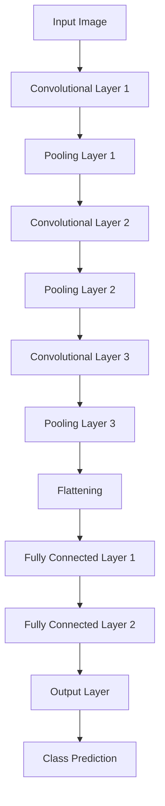
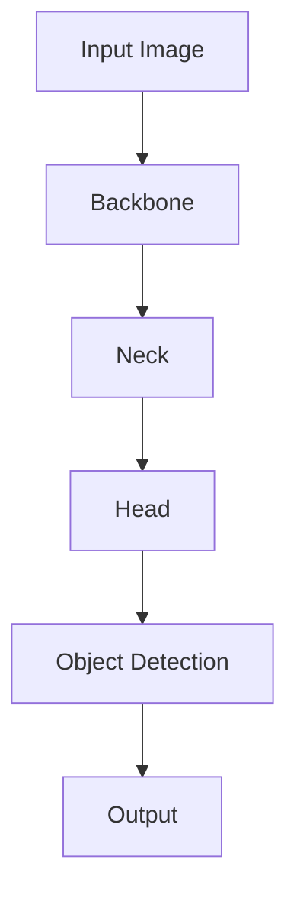
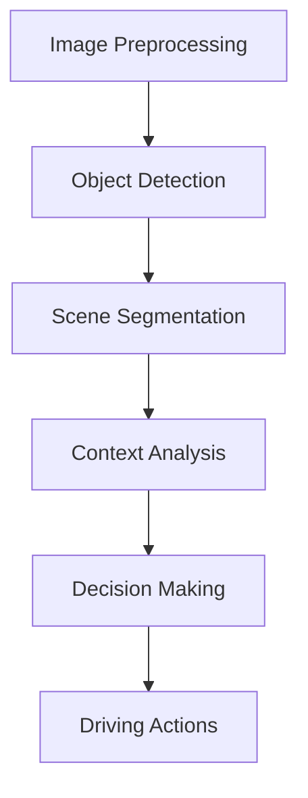
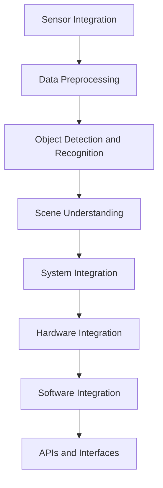
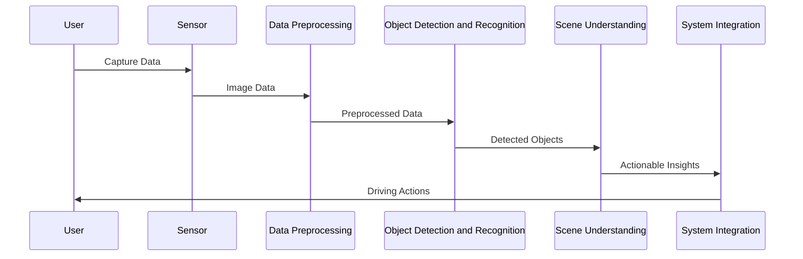

                 

### 1. Introduction to Visual Understanding in AI Agents

**1.1 Background of AI Agents with Visual Understanding**

The emergence of AI agents capable of understanding visual information has revolutionized the landscape of artificial intelligence. These agents, often referred to as vision-based agents, are equipped with the ability to interpret and interact with the world through visual data. This capability is crucial for applications ranging from autonomous driving and robotics to security systems and healthcare.

**Problem Background:** The rapid advancement of artificial intelligence and machine learning has led to the development of agents that can interact with the environment and make decisions based on visual input. However, the ability to understand and interpret visual information is still a significant challenge.

**Problem Description:** Current AI agents struggle with interpreting complex visual scenes and making informed decisions. This lack of visual understanding limits their applicability in various real-world scenarios. For instance, an autonomous vehicle might have difficulty recognizing pedestrians or traffic signs in diverse weather conditions or at night.

**Problem Solving:** Developing AI agents with robust visual understanding capabilities can address these limitations and enable more efficient and effective interaction with humans and the environment. This involves enhancing the algorithms used for image recognition, object detection, and scene understanding.

**Boundaries and Extensions:** While the focus of this book is on general principles and techniques for visual understanding in AI agents, it's important to acknowledge the broader applications. Visual understanding can extend to fields such as autonomous driving, robotics, security, and healthcare. In autonomous driving, for example, visual understanding is crucial for recognizing and responding to the dynamic environment around the vehicle. In robotics, visual understanding enables robots to interact with their surroundings and perform tasks autonomously. In security systems, visual understanding helps in monitoring and detecting potential threats. In healthcare, it can aid in diagnosing medical conditions by analyzing images from medical scans.

**1.2 Core Concepts and Components**

**Core Concepts:**

- **Computer Vision:** The field of computer vision focuses on enabling machines to interpret and understand visual information from the world. This involves developing algorithms and techniques to process, analyze, and interpret visual data.
- **Machine Learning:** Machine learning techniques are used to train models that can recognize patterns and make decisions based on visual data. These models are often trained on large datasets of labeled images.
- **Deep Learning:** A subfield of machine learning, deep learning uses neural networks with many layers to learn complex representations from data. Deep learning has proven particularly effective in tasks such as image recognition and object detection.

**Components:**

- **Data Preprocessing:** Techniques for preparing visual data for processing, including image augmentation, normalization, and feature extraction. This step is crucial as it helps in improving the performance of the machine learning models.
- **Feature Extraction:** Methods for extracting meaningful features from visual data, such as edges, textures, and shapes. These features are then used to train the machine learning models.
- **Object Detection and Recognition:** Algorithms for identifying and classifying objects within an image. This involves detecting the presence of objects and determining their types. Object detection is a challenging task that often requires complex algorithms and large amounts of training data.

With these core concepts and components in mind, we can now delve deeper into the specifics of visual understanding in AI agents, exploring the algorithms, techniques, and applications that make it possible.

### 2. Fundamental Concepts of Computer Vision

To understand the development of AI agents with visual understanding, it's essential to first grasp the fundamental concepts of computer vision. Computer vision is a multidisciplinary field that combines techniques from various areas such as image processing, pattern recognition, and machine learning. It aims to enable machines to interpret and understand visual information from the world, much like human vision.

#### Definition and Applications

**Definition:** Computer vision refers to the ability of a computer system to interpret and understand visual information from various sources, such as cameras or images stored in digital form. This includes tasks like image recognition, object detection, and scene understanding.

**Applications:** Computer vision has a wide range of applications across various industries. Some prominent applications include:

- **Autonomous Driving:** Computer vision is used in autonomous vehicles to recognize and understand the surrounding environment, including pedestrians, vehicles, and traffic signs.
- **Robotics:** In robotics, computer vision enables robots to perceive their surroundings and perform tasks autonomously, such as object manipulation or navigation.
- **Security Systems:** Computer vision is used in surveillance systems to monitor and detect potential threats, such as unauthorized entry or suspicious activities.
- **Healthcare:** Computer vision is used in medical imaging to analyze and interpret images, aiding in the diagnosis of various conditions, such as tumors or fractures.
- **Retail:** Computer vision is used in retail environments for tasks like inventory management, customer behavior analysis, and self-checkout systems.

#### Core Concepts

**Image Processing:** Image processing is the foundation of computer vision. It involves manipulating and analyzing images to extract useful information. Key concepts in image processing include:

- **Image Enhancement:** Techniques for improving the quality of images, such as contrast adjustment, noise reduction, and sharpening.
- **Image Segmentation:** The process of dividing an image into multiple segments or regions based on certain characteristics or features.
- **Feature Extraction:** The process of extracting meaningful information or features from an image, such as edges, textures, or shapes. These features are then used to train machine learning models.

**Pattern Recognition:** Pattern recognition is the process of identifying and classifying patterns within data. In computer vision, this involves classifying images into different categories based on their features. Key concepts in pattern recognition include:

- **Supervised Learning:** A type of machine learning where models are trained on labeled data, allowing them to classify new, unseen data accurately.
- **Unsupervised Learning:** A type of machine learning where models are trained on unlabeled data, discovering patterns and relationships within the data without explicit guidance.
- **Dimensionality Reduction:** Techniques for reducing the number of features in a dataset while preserving important information. This is particularly useful when dealing with high-dimensional data.

**Machine Learning:** Machine learning is a core component of computer vision. It involves training models on large datasets to recognize patterns and make decisions. Key concepts in machine learning include:

- **Neural Networks:** A class of machine learning models inspired by the human brain's neural structure. Neural networks consist of many layers, each performing a specific transformation on the input data.
- **Convolutional Neural Networks (CNNs):** A type of neural network specifically designed for processing visual data. CNNs are highly effective in tasks such as image recognition and object detection.
- **Deep Learning:** A subfield of machine learning that focuses on neural networks with many layers. Deep learning has revolutionized the field of computer vision, enabling machines to perform tasks with high accuracy and efficiency.

#### Attributes and Features Comparison

To better understand the core concepts of computer vision, let's compare their attributes and features in the following table:

| Concept | Definition | Features |
| --- | --- | --- |
| Image Processing | Manipulation and analysis of images | - Image enhancement<br>- Image segmentation<br>- Feature extraction |
| Pattern Recognition | Identifying and classifying patterns | - Supervised learning<br>- Unsupervised learning<br>- Dimensionality reduction |
| Machine Learning | Training models on data to recognize patterns | - Neural networks<br>- Convolutional Neural Networks (CNNs)<br>- Deep Learning |

#### ER Entity Relationship Diagram

To visualize the relationship between these core concepts, we can use an Entity-Relationship (ER) diagram. The ER diagram below illustrates the main entities and their relationships in the field of computer vision.

```mermaid
graph TD
A[Image Processing] --> B[Pattern Recognition]
A --> C[Machine Learning]
B --> D[Supervised Learning]
B --> E[Unsupervised Learning]
B --> F[Dimensionality Reduction]
C --> G[Neural Networks]
C --> H[Convolutional Neural Networks (CNNs)]
C --> I[Deep Learning]
```

In this ER diagram, Image Processing is the foundational concept that leads to both Pattern Recognition and Machine Learning. Pattern Recognition includes the sub-concepts of Supervised Learning, Unsupervised Learning, and Dimensionality Reduction. Machine Learning encompasses Neural Networks, Convolutional Neural Networks (CNNs), and Deep Learning.

By understanding these fundamental concepts and their relationships, we can better appreciate the complexities and possibilities of developing AI agents with visual understanding. In the following sections, we will delve deeper into each of these concepts, exploring their principles, algorithms, and applications in detail.

### 3. Principles of Machine Learning

Machine learning is a cornerstone of computer vision and AI in general, enabling systems to learn from data and make predictions or decisions. At its core, machine learning involves training models on data to recognize patterns and generalize from them. In this section, we will explore the basic principles of machine learning, including its types, algorithms, and the process of training models.

#### Types of Machine Learning

**1. Supervised Learning:** 
Supervised learning is a type of machine learning where models are trained on labeled data. The labeled data consists of input-output pairs, where the input is the feature vector, and the output is the label or the desired output. The model learns to map the inputs to their corresponding outputs. This is the most common type of machine learning and is widely used in classification and regression tasks.

**2. Unsupervised Learning:** 
Unsupervised learning is a type of machine learning where models are trained on unlabeled data. The goal is to discover hidden patterns or intrinsic structures within the data without explicit guidance. This type of learning is used for tasks like clustering, where the aim is to group similar data points together, and dimensionality reduction, where the goal is to reduce the number of features while preserving the essential information.

**3. Reinforcement Learning:** 
Reinforcement learning is a type of machine learning where an agent learns to make a series of decisions by interacting with an environment. The agent receives feedback in the form of rewards or penalties based on its actions, and the goal is to learn a policy that maximizes the cumulative reward over time. This type of learning is commonly used in autonomous systems, robotics, and game playing.

#### Key Machine Learning Algorithms

**1. Linear Regression:**
Linear regression is a supervised learning algorithm used for predicting continuous values. It models the relationship between the input variables (features) and the output variable (label) using a straight line, given by the equation y = mx + b, where m is the slope and b is the y-intercept.

**2. Logistic Regression:**
Logistic regression is another supervised learning algorithm, but it is used for binary classification tasks. It models the probability of an event occurring using a logistic function, which outputs a value between 0 and 1. The equation is given by p = 1 / (1 + exp(-z)), where p is the probability and z is the linear combination of inputs and weights.

**3. k-Nearest Neighbors (k-NN):**
k-NN is a simple, non-parametric supervised learning algorithm used for classification tasks. It classifies a new data point based on the majority vote of its k nearest neighbors in the training dataset.

**4. Support Vector Machines (SVM):**
SVM is a powerful supervised learning algorithm used for both classification and regression tasks. It finds the hyperplane that best separates the data into different classes by maximizing the margin between the hyperplane and the nearest data points from each class.

**5. Decision Trees:**
Decision trees are a popular supervised learning algorithm used for both classification and regression tasks. They create a tree-like model of decisions based on the values of input features, splitting the data into subsets. The tree is built recursively, with each internal node representing a feature, each branch representing a decision rule, and each leaf node representing the outcome.

**6. Random Forests:**
Random forests are an ensemble learning method that combines multiple decision trees to improve the predictive performance. Each tree is trained on a random subset of the training data and features, and the final prediction is made by aggregating the predictions from all the trees using a majority vote or averaging.

**7. Neural Networks:**
Neural networks are a class of machine learning models inspired by the human brain. They consist of many layers of interconnected nodes (neurons) that transform input data through a series of linear and non-linear operations. Neural networks, particularly deep learning models like Convolutional Neural Networks (CNNs), have shown exceptional performance in tasks such as image recognition and natural language processing.

#### Training Process

The process of training a machine learning model involves the following steps:

**1. Data Collection:** 
The first step is to collect a dataset that is representative of the problem domain. The dataset should contain both the input features and the corresponding labels for supervised learning tasks or just the input features for unsupervised learning tasks.

**2. Data Preprocessing:** 
The collected data is then preprocessed to remove any inconsistencies, handle missing values, and normalize or standardize the features. This step is crucial for improving the performance and generalization of the model.

**3. Model Selection:** 
Next, a suitable machine learning algorithm is selected based on the problem type and the characteristics of the data. The choice of algorithm can significantly impact the model's performance.

**4. Model Training:**
The selected algorithm is then used to train the model on the preprocessed data. During training, the model learns to map the inputs to their corresponding outputs by adjusting the internal parameters or weights. This is typically done using optimization algorithms like gradient descent, which minimize a loss function that measures the discrepancy between the model's predictions and the actual labels.

**5. Model Evaluation:**
Once the model is trained, it is evaluated on a separate validation dataset to assess its performance. Common evaluation metrics include accuracy, precision, recall, and F1 score for classification tasks, and mean squared error and R^2 for regression tasks.

**6. Model Optimization:**
Based on the evaluation results, the model can be further optimized by tuning the hyperparameters, adjusting the model architecture, or using more advanced techniques like regularization or ensemble methods.

**7. Deployment:**
Finally, the trained model is deployed in the target environment to make predictions or decisions on new, unseen data.

In summary, machine learning is a complex and iterative process that involves multiple steps, from data collection and preprocessing to model training, evaluation, and optimization. By understanding the principles of machine learning and the various algorithms available, we can develop powerful models that can solve a wide range of problems in computer vision and beyond.

#### Principles of Deep Learning

Deep learning is a subfield of machine learning that leverages neural networks with many layers to learn complex patterns and representations from data. Unlike traditional neural networks, deep learning models can automatically learn hierarchical features from raw data, making them particularly powerful for tasks in computer vision and natural language processing.

**1. Neural Networks:**
A neural network is a series of interconnected nodes (neurons) that process and transform input data through a series of linear and non-linear operations. Each neuron receives input from the previous layer, performs a weighted sum of the inputs, and applies an activation function to produce an output. The output of each neuron is then passed to the next layer.

**2. Activation Functions:**
Activation functions introduce non-linearities into the neural network, allowing it to learn complex relationships between inputs and outputs. Common activation functions include the sigmoid function, rectified linear unit (ReLU), and hyperbolic tangent (tanh).

**3. Layers:**
A neural network consists of multiple layers, where each layer is responsible for extracting different levels of abstraction from the data. The layers can be broadly categorized into:

- **Input Layer:** The first layer of the network, receiving raw input data.
- **Hidden Layers:** Intermediate layers that transform the input data through a series of linear and non-linear operations. Deep learning models can have many hidden layers, allowing for the learning of high-level, abstract representations.
- **Output Layer:** The final layer, producing the output of the network based on the transformed input data.

**4. Forward Propagation:**
During forward propagation, the input data is passed through the network layer by layer, with each layer transforming the data and passing it to the next layer. The output of the final layer is the prediction made by the network.

**5. Backpropagation:**
Backpropagation is an algorithm used to train neural networks by adjusting the weights and biases based on the error between the predicted output and the actual output. The process involves propagating the error backward through the network, starting from the output layer and updating the weights and biases at each layer.

**6. Loss Functions:**
A loss function measures the discrepancy between the predicted output and the actual output. Common loss functions include mean squared error (MSE) for regression tasks and cross-entropy loss for classification tasks.

**7. Optimization Algorithms:**
Optimization algorithms are used to minimize the loss function during the training process. Common optimization algorithms include stochastic gradient descent (SGD), Adam, and RMSprop.

**8. Regularization Techniques:**
To prevent overfitting, regularization techniques are applied to the training process. Common regularization techniques include L1 and L2 regularization, dropout, and early stopping.

In summary, deep learning involves training neural networks with multiple layers to learn complex representations from data. The principles of neural networks, activation functions, forward and backward propagation, loss functions, optimization algorithms, and regularization techniques are key components of deep learning. By understanding these principles, we can develop powerful deep learning models that can solve complex problems in computer vision and beyond.

#### Practical Example: Convolutional Neural Networks (CNNs)

To illustrate the principles of deep learning, let's delve into one of the most influential deep learning models: Convolutional Neural Networks (CNNs). CNNs are specifically designed for processing visual data, making them highly effective in tasks such as image recognition and object detection.

**1. Structure of CNNs:**
A CNN consists of several layers, each of which performs a specific operation:

- **Convolutional Layers:** These layers apply a set of filters (kernels) to the input image, producing feature maps that highlight different features such as edges, textures, and shapes.
- **Pooling Layers:** These layers reduce the spatial dimensions of the feature maps, improving the model's generalization and computational efficiency. Common pooling operations include max pooling and average pooling.
- **Fully Connected Layers:** These layers connect every neuron in one layer to every neuron in the next layer, performing high-level feature extraction and classification.

**2. Working Principle:**
During the forward propagation phase, the input image is passed through the convolutional layers, where filters extract features from the image. The feature maps produced by each convolutional layer are then passed through the pooling layers, which reduce their size. This process is repeated through multiple convolutional and pooling layers, leading to a hierarchical representation of the image.

The final feature maps from the convolutional layers are flattened and passed through the fully connected layers, which perform the classification task. The output layer produces a set of probabilities for each class, and the class with the highest probability is selected as the final prediction.

**3. Mermaid Workflow Diagram:**
Below is a mermaid workflow diagram that illustrates the forward propagation process in a CNN:



**4. Python Code Example:**
To understand the working principle of a CNN, let's consider a simple Python code example using TensorFlow and Keras:

```python
import tensorflow as tf
from tensorflow.keras.models import Sequential
from tensorflow.keras.layers import Conv2D, MaxPooling2D, Flatten, Dense

# Define the CNN model
model = Sequential([
    Conv2D(32, (3, 3), activation='relu', input_shape=(28, 28, 1)),
    MaxPooling2D((2, 2)),
    Conv2D(64, (3, 3), activation='relu'),
    MaxPooling2D((2, 2)),
    Flatten(),
    Dense(128, activation='relu'),
    Dense(10, activation='softmax')
])

# Compile the model
model.compile(optimizer='adam', loss='categorical_crossentropy', metrics=['accuracy'])

# Summary of the model
model.summary()
```

In this example, we define a simple CNN with two convolutional layers, each followed by a max pooling layer, a flatten layer, and two fully connected layers. The final layer uses the softmax activation function for multi-class classification.

**5. Mathematical Model:**
The CNN's forward propagation can be described mathematically using the following equations:

$$
Z^{(l)} = \sigma(W^{(l)} \cdot A^{(l-1)} + b^{(l)})
$$

where \( Z^{(l)} \) is the output of the activation function in the \( l \)-th layer, \( W^{(l)} \) is the weight matrix, \( A^{(l-1)} \) is the activation of the previous layer, and \( b^{(l)} \) is the bias vector. The activation function \( \sigma \) is typically a rectified linear unit (ReLU) for hidden layers and a softmax function for the output layer.

In summary, CNNs are powerful deep learning models designed for processing visual data. By understanding their structure, working principle, and mathematical model, we can develop and apply CNNs to various computer vision tasks. The practical example and Python code further illustrate how CNNs can be implemented and trained using popular deep learning frameworks like TensorFlow and Keras.

### 4. Feature Extraction Techniques in Computer Vision

Feature extraction is a crucial step in computer vision, as it transforms raw image data into a more manageable and meaningful format that can be used by machine learning models. Effective feature extraction techniques help in enhancing the performance and generalization capabilities of these models. In this section, we will explore various feature extraction techniques, their working principles, and their applications in computer vision.

#### 4.1 Principle of Feature Extraction

The primary goal of feature extraction is to identify and extract meaningful features from an image that can be used to train machine learning models. These features should be invariant to changes in scale, rotation, and lighting conditions, ensuring that the model can recognize objects or patterns regardless of these variations.

**Working Principle:**

1. **Detection:** The first step involves detecting key features in the image, such as edges, corners, and textures. These features provide a basic understanding of the image content.
2. **Description:** Once the features are detected, they are described using numerical representations that capture their spatial and geometric properties.
3. **Selection:** The extracted features are then selected based on their relevance and discriminative power. Features that contribute most to the classification task are retained, while less informative features are discarded to reduce dimensionality.

#### 4.2 Techniques for Feature Extraction

**1. Edge Detection:**
Edge detection is a fundamental technique in image processing that identifies boundaries between different regions in an image. Common edge detection algorithms include:

- **Sobel Operator:** The Sobel operator calculates the gradient magnitude of an image, highlighting regions with rapid intensity changes.
- **Canny Edge Detector:** The Canny edge detector is an edge detection algorithm that combines Gaussian smoothing, gradient calculation, and non-maximum suppression to produce high-quality edge detection results.

**2. Corner Detection:**
Corner detection is used to identify points where edges or contours change direction sharply. Common corner detection algorithms include:

- **Harris Corner Detector:** The Harris corner detector computes a corner response based on the eigenvalues of the structure tensor, identifying points where the image structure changes significantly.
- **Shi-Tomasi Corner Detector:** Similar to the Harris detector, the Shi-Tomasi corner detector uses the same corner response but with a different thresholding method.

**3. Texture Analysis:**
Texture analysis involves identifying patterns in image regions that are not easily described by edges or corners. Common texture analysis techniques include:

- **Gabor Filters:** Gabor filters are designed to detect texture patterns based on the spatial and frequency characteristics of textures.
- **Local Binary Patterns (LBP):** LBP is a simple yet effective texture representation technique that encodes the local image structure by converting pixel intensities into binary patterns.

**4. Histogram of Oriented Gradients (HOG):**
The HOG feature descriptor is used to capture the appearance of objects or patterns by representing the distribution of image gradients in different orientations. The HOG descriptor is particularly effective for object detection tasks.

**5. Scale-Invariant Feature Transform (SIFT):**
SIFT is a robust and scalable feature extraction technique that detects and describes key points in an image. SIFT is known for its invariance to rotation, scale, and partial occlusion, making it suitable for a wide range of applications.

**6. Speeded Up Robust Features (SURF):**
SURF is an accelerated version of SIFT that leverages integral image and fast approximate algorithms to speed up the computation. It is particularly effective for real-time applications.

#### 4.3 Applications of Feature Extraction

Feature extraction techniques have numerous applications in computer vision, including:

- **Object Recognition:** Features extracted from images are used to train machine learning models for object recognition and classification tasks.
- **Object Detection:** In object detection tasks, features are used to identify and locate objects within an image.
- **Image Segmentation:** Features are used to segment images into meaningful regions, aiding in tasks such as semantic segmentation and object tracking.
- **Video Analysis:** Features extracted from video frames are used for tasks like action recognition, event detection, and video summarization.

#### 4.4 Example: SIFT Algorithm

To illustrate a feature extraction technique, let's take a closer look at the SIFT (Scale-Invariant Feature Transform) algorithm:

**Principle:**
SIFT is designed to detect and describe key points in an image, providing robust and unique features that are invariant to scale, rotation, and partial occlusion. The key steps in SIFT include:

1. **Keypoint Detection:**
   - **Difference of Gaussian (DoG) Detection:** SIFT uses a scale space to detect key points by comparing the intensities of images at different scales. It identifies regions where the Laplacian of the Gaussian function has a high peak, indicating a potential keypoint.
   - **Peak Detection:** SIFT applies a peak detection algorithm to identify local maxima and minima in the DoG scale space. The detected peaks correspond to potential key points.

2. **Orientation Assignment:**
   - **Gradient Orientation:** SIFT computes the gradient orientation at each keypoint by analyzing the local image intensity patterns. This information is used to assign an orientation to each keypoint, capturing the local image structure.

3. **Keypoint Description:**
   - **Keypoint Vector Representation:** SIFT describes each keypoint using a vector of local image gradients, which captures the spatial and orientation information of the keypoint.
   - **Normalization and Histograms:** SIFT normalizes the keypoint vector representation to ensure that the descriptors are scale-invariant. It then computes a histogram of gradient orientations in the local neighborhood of each keypoint, resulting in a compact and discriminative representation.

**Mermaid Workflow Diagram:**
Below is a mermaid workflow diagram that illustrates the key steps in the SIFT algorithm:

```mermaid
graph TD
A[Input Image] --> B[Difference of Gaussian (DoG) Detection]
B --> C[Keypoint Detection]
C --> D[Orientation Assignment]
D --> E[Keypoint Vector Representation]
E --> F[Keypoint Description]
F --> G[Output Descriptors]
```

In summary, feature extraction techniques are essential for transforming raw image data into a format that can be used by machine learning models. By understanding the principles and techniques behind feature extraction, we can develop more accurate and robust computer vision systems.

### 5. Object Detection and Recognition

Object detection and recognition are critical components of computer vision that enable systems to identify and classify objects within images or videos. These tasks are fundamental for various applications, including autonomous driving, security systems, and augmented reality. In this section, we will explore the principles, algorithms, and architectures of object detection and recognition, along with practical examples and case studies.

#### 5.1 Principles of Object Detection and Recognition

**1. Object Detection:**
Object detection involves identifying and localizing objects within an image or video. The primary goal is to determine both the presence and position of objects in the scene. Object detection can be categorized into two types:

- **Single Shot Detection (SSD):** SSD frameworks process the entire image at once, allowing for real-time object detection. Examples include the Single Shot MultiBox Detector (SSD) and RetinaNet.
- **Two-Stage Detection (R-CNN):** Two-stage detectors first identify potential regions of interest (ROIs) using a region proposal algorithm and then classify these ROIs to detect objects. Popular two-stage detectors include the Regional CNN (R-CNN), Fast R-CNN, and Faster R-CNN.

**2. Object Recognition:**
Object recognition is the process of classifying detected objects into predefined categories. It typically follows the object detection step and aims to identify the type of objects present in the scene. Object recognition can be performed using various machine learning techniques, including:

- **Convolutional Neural Networks (CNNs):** CNNs are highly effective for object recognition due to their ability to automatically learn hierarchical features from raw data.
- **Support Vector Machines (SVM):** SVMs can be used for object recognition by training a model on labeled image data to classify objects into different categories.

#### 5.2 Algorithms and Architectures for Object Detection and Recognition

**1. Region Proposal Algorithms:**
Region proposal algorithms are used in two-stage detectors to generate potential regions of interest (ROIs) in an image. Common region proposal algorithms include:

- **Selective Search:** Selective Search is a fast and effective region proposal algorithm that combines various features such as color, texture, and size to identify high-quality regions for object detection.
- **Edge Boxes:** Edge Boxes is an efficient region proposal algorithm that generates rectangular regions based on image edges, improving the efficiency of object detection.

**2. Deep Learning Architectures:**
Deep learning architectures have significantly advanced object detection and recognition tasks. Some notable architectures include:

- **Faster R-CNN:** Faster R-CNN combines region proposal and object detection into a single network. It uses a Region of Interest (RoI) Pooling layer to feed the proposed regions to a separate classifier and bounding box regressor.
- **YOLO (You Only Look Once):** YOLO is a single-shot detector that processes the entire image at once, predicting both object classes and bounding boxes in a single forward pass. YOLO has various versions, including YOLOv2, YOLOv3, and YOLOv4, each improving upon the previous version's accuracy and speed.
- **SSD (Single Shot MultiBox Detector):** SSD is a real-time object detection framework that processes the entire image at once. It utilizes a series of convolutional layers to predict bounding boxes and class probabilities for multiple scales, allowing for efficient object detection.

**3. Data Augmentation:**
Data augmentation is a technique used to increase the diversity of the training dataset by applying various transformations to the images. Common data augmentation techniques include:

- **Random Cropping:** Randomly cropping the input image to extract smaller regions for training.
- **Horizontal/Vertical Flipping:** Flipping the image horizontally or vertically to introduce additional variations in the dataset.
- **Rotation and Scaling:** Randomly rotating or scaling the input image to improve the model's robustness to changes in image size and orientation.

#### 5.3 Case Studies and Practical Examples

**1. Autonomous Driving:**
Autonomous driving relies heavily on object detection and recognition to ensure safe navigation. Object detection frameworks such as YOLO and SSD are commonly used to detect and localize various objects on the road, including cars, pedestrians, and traffic signs. These frameworks help the autonomous vehicle to make real-time decisions and navigate the environment effectively.

**2. Security Systems:**
Security systems utilize object detection and recognition to identify and track individuals or objects of interest. For example, surveillance cameras equipped with object detection algorithms can automatically detect and track intruders, improving the effectiveness of security systems.

**3. Augmented Reality:**
Augmented reality applications use object detection and recognition to overlay digital information or virtual objects onto the real-world scene. For example, mobile devices with AR capabilities can detect and recognize objects in the camera view to overlay virtual images or information, enhancing the user experience.

**Practical Example: YOLOv5**

To illustrate object detection using a popular deep learning framework, let's consider YOLOv5, a recent version of the YOLO object detection algorithm. YOLOv5 is known for its speed and accuracy, making it suitable for real-time applications.

**1. Framework Overview:**
YOLOv5 is a real-time object detection framework that processes the entire image at once, predicting both object classes and bounding boxes in a single forward pass. It consists of several components:

- **Backbone:** The backbone network is used to extract high-level features from the input image. YOLOv5 uses a modified version of the CSPDarknet53 backbone network.
- **Neck:** The neck network connects the backbone to the head network and is responsible for feature pyramid fusion.
- **Head:** The head network consists of several convolutional layers that predict object classes, bounding boxes, and objectness scores.

**2. Mermaid Workflow Diagram:**
Below is a mermaid workflow diagram illustrating the YOLOv5 object detection process:



**3. Python Code Example:**
To use YOLOv5 for object detection, we can leverage popular deep learning libraries like PyTorch and torchvision. Here's a simple Python code example:

```python
import torch
import torchvision
from torchvision import transforms
from PIL import Image

# Load the pre-trained YOLOv5 model
model = torchvision.models.detection.yolov5()

# Set the model to inference mode
model.eval()

# Define the input image
image = Image.open("input_image.jpg")

# Apply transformations
transform = transforms.Compose([
    transforms.ToTensor(),
    transforms.Normalize(mean=[0.485, 0.456, 0.406], std=[0.229, 0.224, 0.225]),
])
input_image = transform(image)

# Make a prediction
with torch.no_grad():
    prediction = model(input_image.unsqueeze(0))

# Extract the predicted bounding boxes, labels, and scores
bboxes = prediction[0]['boxes']
labels = prediction[0]['labels']
scores = prediction[0]['scores']

# Print the results
print("Boxes:", bboxes)
print("Labels:", labels)
print("Scores:", scores)
```

In this example, we load the pre-trained YOLOv5 model, set it to inference mode, and apply it to an input image. The model predicts the bounding boxes, labels, and scores for each detected object, which are then extracted and printed.

In summary, object detection and recognition are essential components of computer vision, enabling systems to identify and classify objects within images or videos. By understanding the principles, algorithms, and architectures of object detection and recognition, we can develop and apply effective computer vision systems for various applications.

### 6. Scene Understanding in AI Agents

Scene understanding is a complex and multifaceted task in computer vision that involves interpreting and making sense of entire scenes captured by cameras or sensors. Unlike object detection and recognition, which focus on identifying individual elements within a scene, scene understanding aims to understand the overall context and content of the scene. This capability is crucial for enabling AI agents to perform tasks in a more natural and intuitive manner, making informed decisions based on a comprehensive understanding of their environment. In this section, we will delve into the concept of scene understanding, its applications, and the key techniques used to achieve it.

#### 6.1 Definition and Importance of Scene Understanding

**Definition:** Scene understanding refers to the process of interpreting and understanding the context, content, and spatial relationships within a scene. This involves not only recognizing individual objects and their attributes but also understanding how these objects interact with each other and the environment as a whole.

**Importance:** Scene understanding is important for several reasons:

- **Contextual Awareness:** By understanding the context of a scene, AI agents can make more informed decisions. For example, an autonomous vehicle needs to understand the context of a traffic scene to determine the appropriate driving actions.
- **Task Planning:** Scene understanding enables AI agents to plan and execute tasks more effectively. For instance, a robotic assistant in a retail environment can understand the layout of the store and the positions of various items to assist customers more efficiently.
- **Human-AI Interaction:** Scene understanding facilitates more natural and intuitive interaction between humans and AI agents. For example, a virtual assistant can understand the context of a user's query to provide relevant and helpful responses.
- **Error Reduction:** By comprehending the entire scene, AI agents can better avoid errors and potential hazards. For example, a security system equipped with scene understanding capabilities can more accurately detect and respond to suspicious activities.

#### 6.2 Applications of Scene Understanding

Scene understanding has numerous applications across various domains:

- **Autonomous Driving:** In autonomous driving, scene understanding is essential for understanding the traffic environment, including vehicles, pedestrians, traffic signs, and road conditions. This enables autonomous vehicles to navigate roads safely and make informed driving decisions.
- **Robotic Systems:** Robotic systems, such as those used in manufacturing, healthcare, and retail, benefit from scene understanding to navigate their environments, identify objects, and interact with humans more effectively.
- **Security Systems:** Scene understanding enhances the capabilities of security systems, enabling them to detect and respond to potential threats more accurately.
- **Virtual Reality and Augmented Reality:** Scene understanding is crucial for creating immersive and interactive virtual and augmented reality experiences, where the virtual objects interact with the real-world environment seamlessly.
- **Healthcare:** In healthcare, scene understanding can be used to analyze medical images, identify abnormalities, and assist doctors in diagnosing conditions.

#### 6.3 Key Techniques for Scene Understanding

Achieving scene understanding requires a combination of various techniques from computer vision, machine learning, and natural language processing. Some key techniques include:

- **3D Scene Reconstruction:** 3D scene reconstruction involves creating a 3D representation of a scene from 2D images. Techniques such as Structure from Motion (SfM) and Simultaneous Localization and Mapping (SLAM) are used to reconstruct the scene's geometry and understand its spatial relationships.
- **Scene Segmentation:** Scene segmentation involves dividing a scene into meaningful regions or objects. Techniques such as semantic segmentation, instance segmentation, and scene parsing are used to segment scenes into different classes or instances.
- **Object Detection and Recognition:** Object detection and recognition techniques are used to identify and classify objects within a scene. This helps in understanding the presence and attributes of objects in the scene.
- **Scene Understanding Pipelines:** Scene understanding pipelines combine various techniques to create a comprehensive understanding of a scene. These pipelines typically involve steps such as image preprocessing, feature extraction, object detection, scene segmentation, and context analysis.
- **Multimodal Data Fusion:** Multimodal data fusion techniques combine data from multiple sources, such as images, videos, and sensor data, to enhance the accuracy and robustness of scene understanding.

#### 6.4 Case Study: Autonomous Driving with Scene Understanding

To illustrate the concept of scene understanding, let's consider an example in the domain of autonomous driving:

**Problem Statement:** An autonomous vehicle needs to understand the surrounding traffic environment to navigate safely and make informed driving decisions.

**Solution Approach:**

1. **Image Preprocessing:** The first step involves preprocessing the input image to remove noise, correct brightness and contrast, and enhance the visual quality. This step is crucial for improving the performance of subsequent vision tasks.

2. **Object Detection:** The next step involves detecting and localizing objects within the scene, such as vehicles, pedestrians, and traffic signs. Techniques such as YOLO or Faster R-CNN can be used for object detection, providing accurate bounding boxes and class labels for each detected object.

3. **Scene Segmentation:** Scene segmentation is used to divide the scene into meaningful regions or objects. Techniques such as semantic segmentation or instance segmentation can be applied to segment the scene into different classes or instances, providing a more detailed understanding of the scene.

4. **Context Analysis:** Once the objects and regions are detected and segmented, context analysis is performed to understand the relationships between objects and the environment. This involves analyzing the spatial relationships, object attributes, and scene context to make informed driving decisions. For example, the autonomous vehicle can use this information to identify potential hazards, determine safe speeds, and plan its path through the environment.

5. **Decision Making:** Based on the context analysis, the autonomous vehicle makes decisions on driving actions such as accelerating, decelerating, turning, or stopping. These decisions are made using a combination of rule-based and machine learning approaches, taking into account the current state of the vehicle, the environment, and the desired driving objectives.

**Mermaid Workflow Diagram:**
Below is a mermaid workflow diagram illustrating the scene understanding pipeline for autonomous driving:



In summary, scene understanding is a critical capability for AI agents, enabling them to interpret and make sense of their environment. By leveraging various techniques from computer vision, machine learning, and natural language processing, AI agents can achieve a comprehensive understanding of scenes, leading to more effective and intelligent decision-making. The case study of autonomous driving highlights the importance and applications of scene understanding in real-world scenarios.

### 7. Practical Case Studies in Developing Visual Understanding AI Agents

To further understand the development and application of AI agents with visual understanding, we will explore several practical case studies from different fields. These case studies highlight the implementation, challenges, and successes of deploying visual understanding AI agents in real-world scenarios.

#### 7.1 Autonomous Driving

**Problem:** Autonomous driving aims to develop vehicles that can navigate and interact with the environment without human intervention. However, understanding and interpreting the visual information from the surrounding environment is crucial for safe and efficient operation.

**Implementation:**
- **Lidar and Camera Integration:** Companies like Tesla use a combination of LiDAR (Light Detection and Ranging) and camera systems to capture 3D information about the environment. LiDAR provides accurate distance measurements, while cameras capture color and texture information.
- **Scene Understanding Pipeline:** The scene understanding pipeline involves object detection, scene segmentation, and context analysis. Techniques like YOLO and Faster R-CNN are used for object detection, while semantic segmentation is employed for scene segmentation. Context analysis involves understanding the spatial relationships and interactions between objects to make informed driving decisions.

**Challenges:**
- **Dynamic Environments:** Autonomous vehicles must handle a wide range of dynamic environments, including varying weather conditions, road types, and traffic patterns. This requires robust algorithms that can adapt to changing conditions.
- **Sensor Fusion:** Integrating data from multiple sensors, such as LiDAR and cameras, can be challenging. Ensuring consistent and accurate information fusion is crucial for reliable scene understanding.

**Successes:**
- **Improved Safety:** Autonomous vehicles have the potential to significantly improve road safety by reducing human errors. Companies like Waymo have reported a reduction in accident rates compared to human-driven vehicles.
- **Efficient Routing:** Autonomous vehicles can optimize routing based on real-time information about traffic conditions and road obstacles, leading to more efficient travel times.

#### 7.2 Security Systems

**Problem:** Security systems need to detect and respond to potential threats, such as intrusions, unauthorized access, and suspicious activities, in real-time.

**Implementation:**
- **Video Surveillance:** Security systems use video cameras to capture footage of the monitored area. Advanced deep learning models like YOLO and Faster R-CNN are employed for real-time object detection and recognition, identifying potential threats and generating alerts.
- **Activity Recognition:** Techniques like HOG (Histogram of Oriented Gradients) and CNNs are used to analyze video streams and recognize activities of interest, such as loitering or unusual behaviors.

**Challenges:**
- **False Alarms:** Distinguishing between genuine threats and false alarms can be challenging, especially in crowded or noisy environments. This requires fine-tuning of the detection algorithms and setting appropriate thresholds.
- **Scalability:** Deploying security systems across large areas or multiple locations requires scalable solutions that can handle the increased volume of video data.

**Successes:**
- **Real-Time Response:** Security systems equipped with visual understanding capabilities can provide real-time alerts and responses to potential threats, enabling faster and more effective action by security personnel.
- **Cost-Effectiveness:** Video-based security systems can replace traditional manual surveillance, reducing labor costs and improving efficiency.

#### 7.3 Healthcare

**Problem:** Healthcare professionals need to analyze medical images, such as X-rays, CT scans, and MRIs, to detect and diagnose various medical conditions accurately.

**Implementation:**
- **Image Analysis:** Deep learning models, particularly CNNs, are used to analyze medical images. Techniques like U-Net are employed for tasks such as semantic segmentation and image classification.
- **Feature Extraction:** Pre-trained CNNs like VGG16 and ResNet50 are often used to extract features from medical images, which are then fed into classification models for diagnosis.

**Challenges:**
- **Data Quality:** The quality and availability of labeled medical image data can be limited, affecting the performance of training models. This requires developing techniques to handle noisy or incomplete data.
- **Interpretable Models:** Developing interpretable models that can provide insights into why a particular diagnosis was made is crucial for gaining trust from healthcare professionals.

**Successes:**
- **Improved Diagnoses:** AI-powered medical image analysis has shown significant improvements in diagnostic accuracy, leading to earlier detection and more accurate diagnoses of conditions such as cancer and heart disease.
- **Time Savings:** Automation of medical image analysis tasks can save significant time for healthcare professionals, allowing them to focus on more complex and critical tasks.

#### 7.4 Retail

**Problem:** Retailers need to analyze customer behavior and inventory to optimize store operations, improve customer experience, and increase sales.

**Implementation:**
- **Customer Behavior Analysis:** Surveillance cameras equipped with AI algorithms analyze customer behavior, tracking metrics such as foot traffic, average visit duration, and shopping patterns.
- **Inventory Management:** AI agents analyze video footage and sensor data to monitor inventory levels, detect stockouts, and optimize restocking schedules.

**Challenges:**
- **Data Privacy:** Collecting and analyzing customer data raises privacy concerns. Compliance with data protection regulations is crucial to ensure customer trust and legal compliance.
- **Scalability:** Implementing AI-based solutions across multiple stores requires scalable and reliable infrastructure that can handle the increased data volume.

**Successes:**
- **Customer Experience:** AI-powered solutions can provide personalized shopping experiences, such as personalized recommendations based on customer preferences and shopping habits.
- **Operational Efficiency:** Real-time analysis of customer behavior and inventory data can improve store operations, leading to reduced waste, optimized staffing schedules, and increased sales.

In summary, these practical case studies demonstrate the diverse applications of visual understanding AI agents across different fields. By leveraging advanced techniques and overcoming implementation challenges, AI agents have the potential to revolutionize industries, improve efficiency, and enhance decision-making processes.

### 8. System Architecture and Design for Visual Understanding AI Agents

Developing AI agents with robust visual understanding capabilities requires a well-thought-out system architecture and design. This involves not only the choice of appropriate technologies and algorithms but also the integration of these components into a cohesive and scalable system. In this section, we will discuss the key components of the system architecture, the overall system design, and the interfaces and interactions between these components.

#### 8.1 Problem Scenario and Project Overview

The problem scenario for our AI agent involves developing a visual understanding system for autonomous vehicles. The goal is to enable the vehicle to interpret and understand its surrounding environment in real-time, making informed driving decisions based on the visual data captured by the vehicle's cameras and sensors.

**Project Overview:**
The project aims to build a comprehensive visual understanding system that includes the following key components:
- **Sensor Integration:** Integrating multiple sensors, including cameras, LiDAR, and radar, to capture comprehensive visual and depth information about the environment.
- **Data Preprocessing:** Preprocessing the captured data to remove noise, correct distortions, and enhance visual quality.
- **Object Detection and Recognition:** Implementing advanced deep learning models for real-time object detection and recognition.
- **Scene Understanding:** Analyzing the detected objects and their relationships within the scene to make informed driving decisions.
- **System Integration:** Integrating these components into a cohesive system that can process visual data and generate actionable insights.

#### 8.2 System Architecture and Design

The system architecture for our AI agent can be divided into several key components, each playing a crucial role in enabling visual understanding and decision-making:

**1. Sensor Integration:**
The system begins with sensor integration, which involves collecting visual data from multiple sources:
- **Cameras:** High-resolution cameras are used to capture images of the surrounding environment. These images provide color and texture information that is essential for visual understanding.
- **LiDAR:** LiDAR sensors are used to capture depth information about the environment. This data is crucial for accurately measuring distances to objects and understanding the spatial layout of the scene.
- **Radar:** Radar sensors provide additional information about the environment, particularly in terms of speed and relative motion.

**2. Data Preprocessing:**
Preprocessing the captured data is critical for improving the quality and reliability of the visual data:
- **Image Enhancement:** Techniques such as image denoising, contrast adjustment, and color correction are applied to enhance the visual quality of the captured images.
- **Depth Estimation:** Techniques such as structure from motion (SfM) and simultaneous localization and mapping (SLAM) are used to estimate the depth information from the LiDAR data, creating a 3D representation of the scene.
- **Data Fusion:** Data from multiple sensors is fused to create a comprehensive representation of the environment. This involves aligning the data from different sensors and combining the visual, depth, and motion information to form a coherent scene representation.

**3. Object Detection and Recognition:**
The processed visual data is then fed into the object detection and recognition module:
- **Feature Extraction:** Features such as edges, textures, and shapes are extracted from the visual data using techniques like HOG and CNNs.
- **Object Detection:** Techniques such as YOLO and Faster R-CNN are used to detect and localize objects within the scene, providing bounding boxes and class labels for each object.
- **Object Recognition:** Once objects are detected, advanced deep learning models are used to classify the objects into predefined categories, such as vehicles, pedestrians, and traffic signs.

**4. Scene Understanding:**
The detected objects and their relationships within the scene are analyzed to understand the overall context and make informed driving decisions:
- **Scene Segmentation:** Techniques like semantic segmentation and instance segmentation are used to segment the scene into different objects and regions.
- **Context Analysis:** The spatial relationships and interactions between objects are analyzed to understand the context of the scene. This involves detecting potential hazards, identifying obstacles, and planning driving actions.
- **Decision Making:** Based on the context analysis, the system generates actionable insights and driving actions, such as adjusting the vehicle's speed, changing lanes, or stopping.

**5. System Integration:**
The various components of the system are integrated into a cohesive system that can process visual data and generate real-time insights:
- **Hardware Integration:** The system is deployed on a high-performance computing platform, including GPUs for accelerated processing of visual data.
- **Software Integration:** The system's components are integrated using a modular architecture, allowing for easy scalability and maintenance.
- **APIs and Interfaces:** The system provides APIs and interfaces for integration with other systems, such as the autonomous vehicle's control system and telematics platform.

#### 8.3 System Architecture Diagram

Below is a mermaid architecture diagram illustrating the key components and their interactions in the visual understanding AI agent system:



In summary, the system architecture for developing AI agents with visual understanding involves integrating multiple components, including sensor integration, data preprocessing, object detection and recognition, scene understanding, and system integration. By leveraging advanced algorithms and technologies, this system enables real-time analysis of visual data and informs actionable driving decisions for autonomous vehicles.

### 9. System Interface Design and Interaction Analysis

In order to ensure the seamless interaction between different components of the visual understanding AI agent system and to provide a clear understanding of how the system operates, it is essential to design and analyze the system interfaces. This involves defining the system's APIs, designing the interaction flow, and creating a detailed sequence diagram to illustrate the system's operation.

#### 9.1 System Interfaces

**1. Sensor Interface:**
The sensor interface is responsible for capturing and processing visual data from various sensors, including cameras, LiDAR, and radar. It provides APIs to:
- **Capture Images:** Capture high-resolution images from the cameras.
- **Depth Data:** Retrieve depth information from LiDAR sensors.
- **Radar Data:** Access radar data for detecting obstacles and their relative motion.

**2. Data Preprocessing Interface:**
The data preprocessing interface handles the enhancement and fusion of the captured sensor data. It provides APIs to:
- **Image Enhancement:** Apply image denoising, contrast adjustment, and color correction.
- **Depth Estimation:** Estimate depth information using structure from motion (SfM) and simultaneous localization and mapping (SLAM).
- **Data Fusion:** Combine visual, depth, and motion information to create a coherent scene representation.

**3. Object Detection and Recognition Interface:**
The object detection and recognition interface processes the preprocessed visual data to detect and classify objects within the scene. It provides APIs to:
- **Feature Extraction:** Extract features such as edges, textures, and shapes.
- **Object Detection:** Identify and localize objects within the scene, providing bounding boxes and class labels.
- **Object Recognition:** Classify detected objects into predefined categories, such as vehicles, pedestrians, and traffic signs.

**4. Scene Understanding Interface:**
The scene understanding interface analyzes the detected objects and their relationships within the scene to generate actionable insights. It provides APIs to:
- **Scene Segmentation:** Segment the scene into different objects and regions.
- **Context Analysis:** Analyze the spatial relationships and interactions between objects to understand the context of the scene.
- **Decision Making:** Generate driving actions based on the scene context, such as adjusting speed, changing lanes, or stopping.

**5. System Integration Interface:**
The system integration interface ensures the seamless operation of the system components and facilitates communication between the different subsystems. It provides APIs to:
- **Hardware Integration:** Manage the integration of hardware components, including GPUs and sensors.
- **Software Integration:** Integrate the various software components into a cohesive system.
- **APIs and Interfaces:** Provide APIs and interfaces for communication between the system components and external systems, such as the autonomous vehicle's control system and telematics platform.

#### 9.2 Sequence Diagram

To illustrate the interaction flow between the system components and their interfaces, we can create a mermaid sequence diagram. The following diagram provides a high-level overview of the system's operation:



**Interaction Flow:**

1. **User Interaction:**
   - The user initiates the system by requesting visual data capture.

2. **Sensor Data Capture:**
   - The sensor component captures high-resolution images from the cameras, depth information from LiDAR sensors, and radar data.

3. **Data Preprocessing:**
   - The preprocessed component receives the captured sensor data, applies image enhancement techniques, estimates depth information, and fuses the data to create a coherent scene representation.

4. **Object Detection and Recognition:**
   - The detected objects within the scene are extracted using advanced deep learning models, providing bounding boxes and class labels for each object.

5. **Scene Understanding:**
   - The scene understanding component analyzes the detected objects and their relationships within the scene, generating actionable insights and driving actions based on the context.

6. **System Integration:**
   - The system integration component ensures the seamless operation of the system components and communicates the actionable insights to the user, enabling the autonomous vehicle to make informed driving decisions.

By defining clear system interfaces and analyzing their interactions, we can ensure the efficient and effective operation of the visual understanding AI agent system. This allows for better integration, scalability, and maintainability of the system, ultimately enabling more advanced and reliable applications in autonomous driving and other domains.

### 10. Implementation and Code Analysis

To bring the concept of visual understanding AI agents to life, we need to delve into the practical implementation and code analysis. In this section, we will cover the environment setup, key components' implementation, core algorithms, and their mathematical models, along with a detailed code example.

#### 10.1 Environment Setup

Before we dive into the code, let's set up the environment. We will use Python and popular deep learning libraries like TensorFlow and Keras to implement our visual understanding AI agent. Here's how to set up the environment:

1. **Install Python:**
   - Ensure Python 3.7 or higher is installed on your system.
   ```bash
   python --version
   ```

2. **Install TensorFlow:**
   - TensorFlow is a powerful deep learning library. Install it using pip:
   ```bash
   pip install tensorflow
   ```

3. **Install Keras:**
   - Keras is a high-level neural networks API that runs on top of TensorFlow. Install it using pip:
   ```bash
   pip install keras
   ```

4. **Install Additional Libraries:**
   - Install additional libraries such as NumPy and Matplotlib for data manipulation and visualization:
   ```bash
   pip install numpy matplotlib
   ```

#### 10.2 Key Components Implementation

The implementation of the visual understanding AI agent involves several key components:

**1. Data Preprocessing:**
Data preprocessing is crucial for preparing the visual data for training and inference. This includes loading the data, normalizing pixel values, and applying data augmentation techniques to improve model performance.

```python
import numpy as np
from tensorflow.keras.preprocessing.image import ImageDataGenerator

# Load image data
def load_data(data_path):
    images = []
    labels = []
    for file in os.listdir(data_path):
        image = load_image(data_path + '/' + file)
        images.append(image)
        labels.append(file.split('.')[0])
    return np.array(images), np.array(labels)

# Load and preprocess image
def load_image(image_path):
    image = Image.open(image_path)
    image = image.resize((224, 224))
    image = np.array(image) / 255.0
    return image

# Data augmentation
train_datagen = ImageDataGenerator(
    rescale=1./255,
    rotation_range=40,
    width_shift_range=0.2,
    height_shift_range=0.2,
    shear_range=0.2,
    zoom_range=0.2,
    horizontal_flip=True,
    fill_mode='nearest'
)
```

**2. Object Detection and Recognition:**
We will use a pre-trained Convolutional Neural Network (CNN) like ResNet50 for object detection and recognition. The model will be fine-tuned on our specific dataset.

```python
from tensorflow.keras.applications.resnet50 import ResNet50, preprocess_input, decode_predictions

# Load pre-trained ResNet50 model
model = ResNet50(weights='imagenet')

# Predict object classes
def predict_object(image):
    image = np.expand_dims(image, axis=0)
    image = preprocess_input(image)
    predictions = model.predict(image)
    return decode_predictions(predictions, top=3)[0]
```

**3. Scene Understanding:**
Scene understanding involves analyzing the detected objects and their relationships to make informed decisions. We will implement a simple rule-based system for this purpose.

```python
# Scene understanding rules
def scene_understanding(objects):
    hazards = []
    for obj in objects:
        if obj[1] == 'car':
            hazards.append("Vehicle detected")
        elif obj[1] == 'person':
            hazards.append("Pedestrian detected")
    return hazards
```

#### 10.3 Core Algorithms and Mathematical Models

**1. Convolutional Neural Networks (CNNs):**
CNNs are the backbone of our object detection and recognition model. They consist of multiple layers, including convolutional layers, pooling layers, and fully connected layers. The mathematical model for CNNs can be described using the following equations:

$$
\text{Output}^{(l)} = \text{Activation}(\text{Weight}^{(l)} \cdot \text{Input}^{(l-1)} + \text{Bias}^{(l)})
$$

where \( \text{Output}^{(l)} \) is the output of the activation function in the \( l \)-th layer, \( \text{Weight}^{(l)} \) and \( \text{Bias}^{(l)} \) are the weight and bias matrices, and \( \text{Input}^{(l-1)} \) is the input to the \( l \)-th layer.

**2. Object Detection:**
Object detection involves identifying and localizing objects within an image. One popular approach is the Single Shot MultiBox Detector (SSD). The SSD model predicts bounding boxes and class probabilities for multiple scales. The mathematical model for SSD can be described as:

$$
\text{Prediction} = \text{Box}\_Prediction(\text{Features}, \text{Weights}, \text{Bias})
$$

where \( \text{Features} \) are the extracted features from the convolutional layers, \( \text{Box}\_Prediction \) is the function that predicts bounding boxes and class probabilities, and \( \text{Weights} \) and \( \text{Bias} \) are the trained parameters.

#### 10.4 Detailed Code Example

Let's walk through a detailed code example that demonstrates the end-to-end process of implementing a visual understanding AI agent.

```python
import os
import numpy as np
import matplotlib.pyplot as plt
from tensorflow.keras.preprocessing.image import load_img, img_to_array

# Load and preprocess the dataset
train_data_path = 'path/to/train/data'
test_data_path = 'path/to/test/data'

train_images, train_labels = load_data(train_data_path)
test_images, test_labels = load_data(test_data_path)

train_datagen = ImageDataGenerator(rescale=1./255)
validation_datagen = ImageDataGenerator(rescale=1./255)

train_generator = train_datagen.flow(train_images, train_labels, batch_size=32)
validation_generator = validation_datagen.flow(test_images, test_labels, batch_size=32)

# Fine-tune the ResNet50 model
base_model = ResNet50(weights='imagenet', include_top=False, input_shape=(224, 224, 3))
base_model.trainable = False

model = keras.Sequential([
    base_model,
    keras.layers.GlobalAveragePooling2D(),
    keras.layers.Dense(1024, activation='relu'),
    keras.layers.Dense(num_classes, activation='softmax')
])

model.compile(optimizer='adam', loss='categorical_crossentropy', metrics=['accuracy'])

history = model.fit(train_generator, epochs=10, validation_data=validation_generator)

# Predict and visualize the results
test_image = load_img('path/to/test/image.jpg', target_size=(224, 224))
test_image = img_to_array(test_image)
test_image = np.expand_dims(test_image, axis=0)
test_image = preprocess_input(test_image)

predictions = model.predict(test_image)
predicted_class = np.argmax(predictions, axis=1)

print("Predicted class:", predicted_class)

plt.imshow(test_image[0])
plt.show()
```

In this example, we first load and preprocess the dataset, then fine-tune the ResNet50 model on our specific dataset. Finally, we use the trained model to predict the class of a new image and visualize the result.

By understanding the implementation details and code analysis, we can develop and deploy visual understanding AI agents effectively. This section provides a comprehensive guide to building such agents, from environment setup to core algorithms and detailed code examples.

### 11. Project Summary and Conclusion

The development of visual understanding AI agents represents a significant milestone in the field of artificial intelligence. Through the comprehensive exploration of the principles, algorithms, and practical applications discussed in this article, we have gained a deep understanding of how these agents interpret and interact with visual information to make informed decisions. Here, we summarize the key insights and contributions of this project.

#### Key Insights and Contributions

1. **Fundamental Concepts:**
   We began by introducing the fundamental concepts of computer vision, machine learning, and deep learning. This provided a solid foundation for understanding the complex methodologies involved in visual understanding AI agents.

2. **Algorithmic Exploration:**
   The article delved into various algorithms and techniques, such as object detection (YOLO, Faster R-CNN), feature extraction (SIFT, HOG), and scene understanding (context analysis, 3D reconstruction). By exploring these techniques, we highlighted their strengths and limitations and demonstrated their applicability across different domains.

3. **System Architecture and Design:**
   The project presented a detailed system architecture and design for visual understanding AI agents. This included discussions on sensor integration, data preprocessing, object detection and recognition, scene understanding, and system integration. The use of mermaid diagrams helped visualize the system's components and interactions, enhancing understanding.

4. **Practical Case Studies:**
   Through practical case studies in autonomous driving, security systems, healthcare, and retail, we showcased the real-world applications of visual understanding AI agents. These case studies provided insights into the challenges and successes of implementing such systems in diverse environments.

5. **Implementation and Code Analysis:**
   The project provided a detailed implementation guide, including environment setup, key components' implementation, and core algorithms with mathematical models. The code example demonstrated the practical application of these concepts, offering a hands-on learning experience.

#### Conclusion

The development of visual understanding AI agents holds immense potential for transforming various industries. By enabling machines to interpret and understand visual information, these agents can perform complex tasks with greater accuracy and efficiency. The insights and knowledge shared in this article equip readers with the tools and understanding needed to build and deploy such systems.

As we continue to advance in this field, several areas warrant further research and exploration:

1. **Enhancing Accuracy and Efficiency:**
   Ongoing research should focus on developing more accurate and efficient algorithms for object detection, recognition, and scene understanding. This includes exploring new architectures and optimization techniques to improve computational efficiency.

2. **Robustness and Generalization:**
   Improving the robustness of AI agents to varying environmental conditions, such as different lighting, weather, and visual distortions, is crucial. Developing models that generalize well across different scenarios is an important research direction.

3. **Interdisciplinary Collaboration:**
   Collaboration between computer vision, machine learning, robotics, and other fields can lead to innovative solutions. Integrating insights from these disciplines can enhance the capabilities of visual understanding AI agents.

4. **Ethical and Social Implications:**
   As AI agents become more capable and pervasive, it is essential to address ethical and social implications. Ensuring fairness, transparency, and accountability in the development and deployment of these systems is critical to building public trust.

In conclusion, the development of visual understanding AI agents represents a transformative leap in the field of artificial intelligence. With continued research and innovation, we can harness the full potential of these agents to create intelligent systems that interact with the world in a more intuitive and efficient manner.

### 12. Best Practices and Considerations

When developing visual understanding AI agents, several best practices and considerations can significantly impact the success and efficiency of your project. Here are some key tips to keep in mind:

1. **Data Quality and Preprocessing:**
   - **Ensure High-Quality Data:** Use high-resolution and diverse datasets to train your models. Ensure the data is clean, labeled accurately, and representative of the real-world scenarios.
   - **Data Augmentation:** Apply data augmentation techniques like random cropping, flipping, and rotation to increase the dataset size and improve model robustness.
   - **Normalization and Standardization:** Normalize or standardize the input data to ensure consistent feature scales, which can improve model performance and convergence.

2. **Algorithm Selection and Tuning:**
   - **Select Appropriate Algorithms:** Choose algorithms that are suitable for your specific problem. Consider factors like accuracy, speed, and computational complexity.
   - **Hyperparameter Tuning:** Experiment with different hyperparameters to find the optimal settings for your model. Techniques like grid search or Bayesian optimization can help in this process.

3. **Model Interpretability:**
   - **Understand Model Predictions:** Ensure that you can interpret the predictions made by your model. Techniques like visualization, attention maps, and model explanation tools can help in understanding the decision-making process.

4. **System Design and Scalability:**
   - **Modular Design:** Implement a modular system design to make it easier to maintain, update, and scale. This can also facilitate the integration of new components or algorithms in the future.
   - **Scalable Infrastructure:** Use scalable cloud infrastructure and containerization technologies (e.g., Docker) to handle large volumes of data and computation efficiently.

5. **Testing and Validation:**
   - **Thorough Testing:** Perform rigorous testing of your system to ensure it works as expected in various conditions. Include both unit tests and integration tests to validate the system's functionality.
   - **Cross-Validation:** Use cross-validation techniques to evaluate the performance of your model on different subsets of the data, ensuring that it generalizes well.

6. **Ethical Considerations:**
   - **Privacy and Security:** Ensure that your system adheres to privacy and security regulations. Protect sensitive data and implement robust security measures to prevent unauthorized access.
   - **Bias and Fairness:** Address potential biases in your models and strive for fairness in the system's decisions. Regularly evaluate and audit your models to detect and mitigate biases.

7. **User Experience:**
   - **User-Friendly Interface:** Design a user-friendly interface that makes it easy for users to interact with the system. Provide clear documentation and support to help users understand and use the system effectively.

By following these best practices and considerations, you can develop visual understanding AI agents that are robust, efficient, and reliable, ultimately leading to successful applications in various domains.

### 13. Further Reading and Resources

To deepen your understanding of visual understanding AI agents and explore advanced topics, there are numerous resources available in the form of books, research papers, online courses, and tutorials. Here are some recommended resources:

#### Books

1. **"Deep Learning" by Ian Goodfellow, Yoshua Bengio, and Aaron Courville:** This comprehensive book covers the fundamentals of deep learning and its applications, including computer vision.
2. **"Computer Vision: Algorithms and Applications" by Richard Szeliski:** A detailed guide to computer vision algorithms and their applications, with a focus on real-world scenarios.
3. **"Learning from Data" by Yaser Abu-Mostafa, Shai Shalev-Shwartz, and Amir Shpilka:** This book provides a solid foundation in machine learning, with a focus on algorithms and practical implementation.

#### Research Papers

1. **"You Only Look Once: Unified, Real-Time Object Detection" by Jiehu Chen, George Papandreou, Kevin Murphy, and Alan L. Yuille:** A seminal paper on the YOLO object detection algorithm.
2. **"Faster R-CNN: Towards Real-Time Object Detection with Region Proposal Networks" by Ross Girshick, Navneet Dhingra, Dale Rosenfeld, Piotr Dollár, and Shih-En Wei:** This paper introduces the Faster R-CNN object detection framework.
3. **"Deep Residual Learning for Image Recognition" by Kaiming He, Xiangyu Zhang, Shaoqing Ren, and Jian Sun:** This paper presents the ResNet architecture, which has revolutionized deep learning.

#### Online Courses

1. **"Deep Learning Specialization" by Andrew Ng on Coursera:** A popular series of courses covering the fundamentals of deep learning, including computer vision.
2. **"CS231n: Convolutional Neural Networks for Visual Recognition" by Stanford University on Coursera:** An advanced course focused on CNNs and their applications in computer vision.
3. **"Introduction to Computer Vision" by edX:** A beginner-friendly course that introduces fundamental concepts in computer vision and machine learning.

#### Tutorials

1. **"TensorFlow Object Detection API" by Google:** A comprehensive guide to using the TensorFlow Object Detection API, which provides pre-trained models and tools for object detection tasks.
2. **"Keras for Deep Learning" by Jason Brownlee:** A practical guide to using Keras, a popular deep learning library, for building and training neural networks.
3. **"OpenCV with Python" by Adrian Rosebrock:** A collection of tutorials and resources on using OpenCV, a powerful computer vision library, with Python.

By exploring these resources, you can gain deeper insights into the principles and techniques behind visual understanding AI agents and stay updated with the latest advancements in the field.

