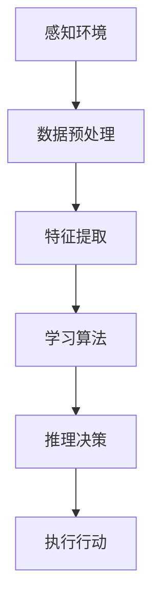
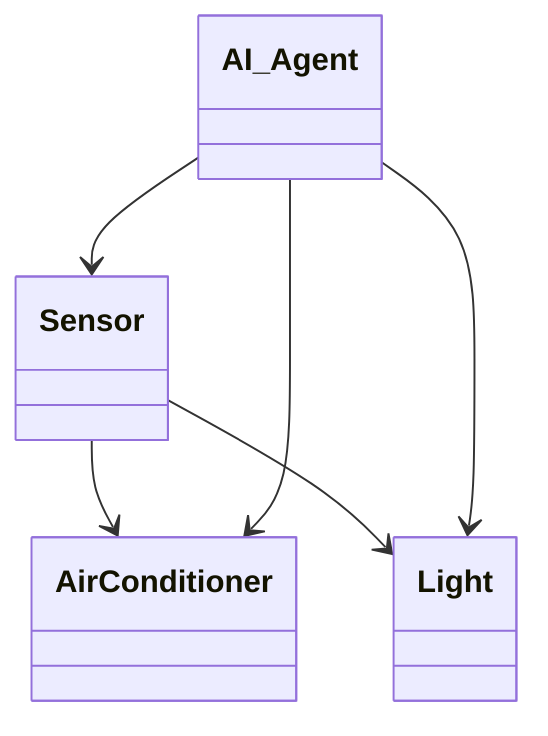
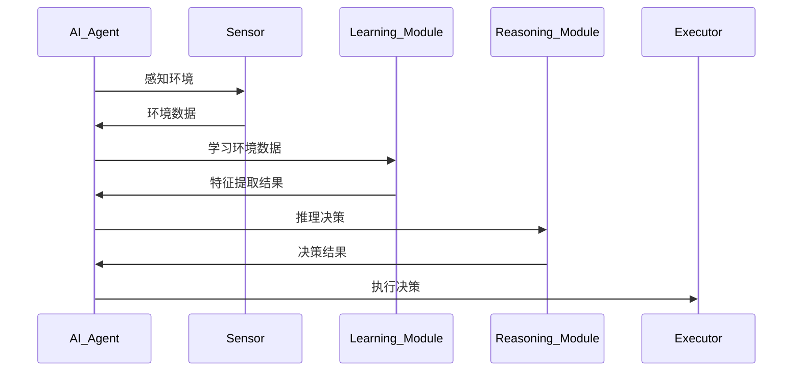
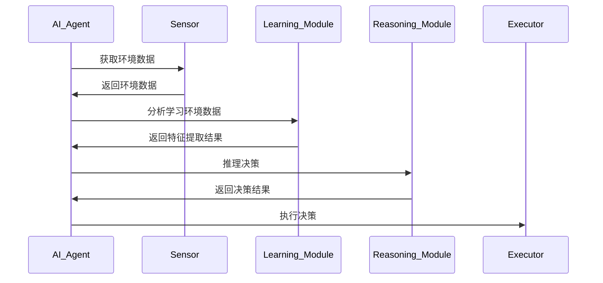
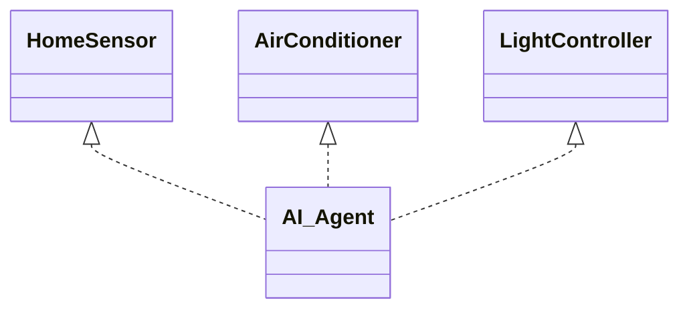
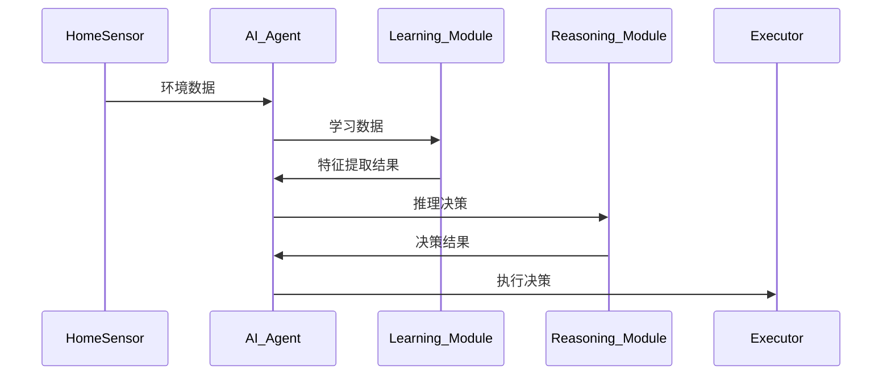
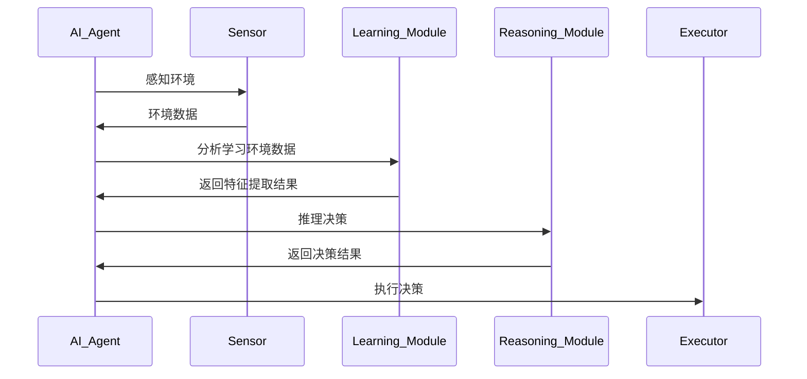

                 

----------------------------------------------------------------

## 第一部分：背景介绍

### 第1章 问题背景

#### 1.1 认知计算与AI Agent

认知计算是一种模仿人类思维过程的技术和系统，其起源可以追溯到20世纪80年代。随着计算机技术的发展和人工智能领域的进步，认知计算逐渐成为一种重要的研究热点。认知计算的基本原理是模拟人类的感知、学习、推理、决策等过程，通过模仿人类的大脑思维方式来实现对复杂问题的解决。

AI Agent，即人工智能代理，是一种能够模拟人类智能行为的自主系统。AI Agent具有自主性、适应性、社交能力等核心特点，它们可以在各种环境中执行任务、做出决策、进行交互等。

#### 1.2 当前AI Agent的发展状况

AI Agent在当前已经得到了广泛的应用，从简单的自动化工具到复杂的智能体系统，AI Agent已经在众多领域展现出了其强大的能力。然而，现有的AI Agent仍然存在一些问题与挑战：

- **自主性不足**：大多数AI Agent仍然依赖人类提供的指令和数据，缺乏真正的自主性。
- **适应性有限**：AI Agent在面对新的环境和任务时，往往需要重新学习和调整，适应性较差。
- **社交能力有限**：AI Agent在与人或其他AI进行交互时，往往缺乏真正的社交能力，难以进行有效的沟通和协作。

#### 1.3 构建认知计算能力的AI Agent的意义

构建具有认知计算能力的AI Agent具有重要意义，这不仅可以提升AI Agent的性能和智能化程度，还可以推动人工智能技术的发展。具体来说：

- **提升AI Agent的性能**：通过认知计算，AI Agent可以更好地理解人类意图、感知环境变化，从而做出更准确的决策和执行更复杂的任务。
- **促进人工智能技术的发展**：认知计算为人工智能提供了新的发展方向，通过深入研究认知计算的基本原理和算法，可以推动人工智能技术的创新和进步。

## 第二部分：核心概念与联系

### 第2章 核心概念原理

#### 2.1 认知计算模型

认知计算模型是模拟人类思维过程的核心，常见的认知计算模型包括：

- **感知计算模型**：模仿人类感知外部世界的方式，通过传感器收集数据，进行特征提取和分类。
- **学习计算模型**：模仿人类学习过程，通过学习算法对数据进行建模和训练，从而提高系统的性能和智能水平。
- **推理计算模型**：模仿人类推理过程，通过对已知信息的逻辑推理，得出新的结论和解决方案。

#### 2.2 AI Agent的核心特点

AI Agent的核心特点包括自主性、适应性和社交能力：

- **自主性**：AI Agent具有独立执行任务的能力，可以自主地感知环境、分析问题、制定策略和执行行动。
- **适应性**：AI Agent能够在不同的环境和任务中快速适应，通过学习和调整，提高任务执行的效率和准确性。
- **社交能力**：AI Agent能够与人或其他AI进行有效的交互和协作，通过沟通和合作，实现更复杂的目标。

#### 2.3 概念属性特征对比表格

| 特征         | 自主性 | 适应性 | 社交能力 |
| ------------ | ------ | ------ | -------- |
| 说明         |        |        |          |

- **自主性**：AI Agent是否能够独立执行任务，不依赖外部指令。
- **适应性**：AI Agent在面对不同环境和任务时，能否快速适应并提高任务执行效果。
- **社交能力**：AI Agent能否与人或其他AI进行有效的交互和协作。

### 第3章 ER实体关系图架构

认知计算和AI Agent涉及多个实体和关系，通过ER（实体关系）图可以清晰地描述这些实体及其关系：

```mermaid
erDiagram
    AI_Agent ||--|{ 感知模块 }感知模块
    AI_Agent ||--|{ 学习模块 }学习模块
    AI_Agent ||--|{ 推理模块 }推理模块
    感知模块 ||--|{ 传感器 }传感器
    学习模块 ||--|{ 数据库 }数据库
    推理模块 ||--|{ 知识库 }知识库
```

## 第三部分：算法原理讲解

### 第4章 算法原理与数学模型

#### 4.1 算法流程图

构建具有认知计算能力的AI Agent，需要遵循以下算法流程：



#### 4.2 数学模型和公式

在认知计算中，常用的数学模型和公式包括：

1. **感知模型**：
   $$f(x) = \sigma(\sum_{i=1}^{n} w_i \cdot x_i)$$
   - **f(x)**：感知器的输出
   - **$\sigma$**：激活函数，通常为Sigmoid函数
   - **$w_i$**：权重
   - **$x_i$**：输入特征

2. **学习算法**：
   $$\theta_{\text{new}} = \theta_{\text{old}} - \alpha \cdot (f(x) - y) \cdot \nabla f(x)$$
   - **$\theta$**：参数
   - **$\alpha$**：学习率
   - **$f(x)$**：激活函数的输出
   - **$y$**：期望输出
   - **$\nabla f(x)$**：梯度

3. **推理决策**：
   $$P(A|B) = \frac{P(B|A) \cdot P(A)}{P(B)}$$
   - **$P(A|B)$**：在B发生的条件下A的概率
   - **$P(B|A)$**：在A发生的条件下B的概率
   - **$P(A)$**：A的概率
   - **$P(B)$**：B的概率

#### 4.3 举例说明

假设我们有一个感知环境并需要识别一个物体。感知模块将收集到的图像数据传递给特征提取模块，特征提取模块提取出物体的边缘、颜色等特征。然后，这些特征传递给学习算法模块进行训练，学习算法模块通过调整权重来提高识别准确率。最后，推理决策模块根据训练好的模型对新的图像数据进行推理，输出物体的识别结果。

```python
import numpy as np
from sklearn.datasets import load_iris
from sklearn.model_selection import train_test_split
from sklearn.neural_network import MLPClassifier

# 加载鸢尾花数据集
iris = load_iris()
X, y = iris.data, iris.target

# 划分训练集和测试集
X_train, X_test, y_train, y_test = train_test_split(X, y, test_size=0.2, random_state=42)

# 创建感知模块
class Perceptron:
    def __init__(self):
        self.weights = np.random.rand(4, 1)
    
    def predict(self, x):
        return np.round(np.dot(x, self.weights))
    
    def train(self, x, y):
        for epoch in range(100):
            output = self.predict(x)
            error = y - output
            self.weights += error * x

# 创建学习模块
perceptron = Perceptron()
perceptron.train(X_train, y_train)

# 创建推理决策模块
mlp = MLPClassifier(hidden_layer_sizes=(100,), max_iter=1000)
mlp.fit(X_train, y_train)

# 测试
print("感知模块测试结果：", perceptron.predict(X_test))
print("学习模块测试结果：", mlp.predict(X_test))
```

## 第四部分：系统分析与架构设计

### 第5章 问题场景介绍

构建认知计算能力的AI Agent，我们考虑一个智能家居场景。在这个场景中，AI Agent需要能够感知家庭环境中的各种变化，如温度、湿度、光照等，并根据这些变化做出相应的决策，如调整空调温度、关闭灯光等。

### 第6章 系统功能设计

#### 6.1 领域模型

在智能家居场景中，涉及的主要领域实体包括：

- **家庭环境传感器**：用于感知温度、湿度、光照等环境数据。
- **智能空调**：根据环境数据调整温度。
- **智能灯光**：根据环境数据调整亮度。
- **AI Agent**：负责感知、学习、推理和决策。

领域模型类图如下：



#### 6.2 系统架构设计

系统架构设计采用分层架构，包括感知层、学习层、推理层和执行层。

- **感知层**：负责感知家庭环境中的各种变化，如温度、湿度、光照等。
- **学习层**：负责对感知到的数据进行分析和学习，提取特征。
- **推理层**：根据学习到的特征，做出相应的决策。
- **执行层**：根据推理层的决策，执行相应的操作，如调整空调温度、关闭灯光等。

系统架构图如下：



#### 6.3 系统接口设计

系统提供的接口包括：

- **感知接口**：用于获取家庭环境数据。
- **学习接口**：用于更新和训练AI Agent。
- **推理接口**：用于获取AI Agent的决策结果。
- **执行接口**：用于执行AI Agent的决策。

接口设计如下：

```mermaid
classDiagram
    Sensor <<Interface>>
    Learning_Module <<Interface>>
    Reasoning_Module <<Interface>>
    Executor <<Interface>>
    AI_Agent --|> Sensor
    AI_Agent --|> Learning_Module
    AI_Agent --|> Reasoning_Module
    AI_Agent --|> Executor
```

### 第7章 系统交互

#### 7.1 系统交互流程

系统交互流程如下：

1. **感知阶段**：AI Agent通过感知接口获取家庭环境数据。
2. **学习阶段**：AI Agent通过学习接口对感知到的数据进行分析和学习，提取特征。
3. **推理阶段**：AI Agent通过推理接口根据学习到的特征做出相应的决策。
4. **执行阶段**：AI Agent通过执行接口执行相应的操作。

系统交互序列图如下：



## 第五部分：项目实战

### 第8章 环境安装与配置

构建具有认知计算能力的AI Agent，需要安装和配置以下软件和环境：

1. **Python 3.8**：作为主要编程语言。
2. **NumPy**：用于数据处理。
3. **Scikit-learn**：用于机器学习。
4. **Matplotlib**：用于数据可视化。
5. **Mermaid**：用于绘制图表。

安装步骤如下：

```bash
pip install python38 numpy scikit-learn matplotlib mermaid
```

### 第9章 系统核心实现

#### 9.1 源代码解读与分析

系统核心实现主要涉及感知模块、学习模块、推理模块和执行模块。

**感知模块**：负责感知家庭环境数据，如温度、湿度、光照等。

```python
import random

class Sensor:
    def __init__(self):
        self.temperature = random.uniform(20, 30)
        self.humidity = random.uniform(30, 70)
        self.light = random.uniform(0, 100)

    def get_environment_data(self):
        return {
            'temperature': self.temperature,
            'humidity': self.humidity,
            'light': self.light
        }
```

**学习模块**：负责对感知到的数据进行分析和学习，提取特征。

```python
from sklearn.neural_network import MLPRegressor

class Learning_Module:
    def __init__(self):
        self.model = MLPRegressor(hidden_layer_sizes=(100,), max_iter=1000)

    def train(self, X, y):
        self.model.fit(X, y)

    def predict(self, X):
        return self.model.predict(X)
```

**推理模块**：负责根据学习到的特征做出相应的决策。

```python
class Reasoning_Module:
    def __init__(self):
        self.threshold = 0.5

    def make_decision(self, feature):
        return 'close' if feature < self.threshold else 'open'
```

**执行模块**：负责执行推理模块的决策结果。

```python
class Executor:
    def __init__(self):
        self.air_conditioner = AirConditioner()
        self.light = Light()

    def execute_decision(self, decision):
        if decision == 'close':
            self.light.turn_off()
        elif decision == 'open':
            self.light.turn_on()
```

### 第10章 实际案例分析与讲解

#### 案例背景与问题描述

在一个智能家居场景中，AI Agent需要根据环境温度、湿度和光照强度来调整空调和灯光。假设环境温度低于25度时，关闭空调；环境湿度高于60%时，关闭灯光。

#### 案例分析与解决方案

1. **感知阶段**：AI Agent通过传感器获取当前环境数据。

```python
sensor = Sensor()
environment_data = sensor.get_environment_data()
print("感知到的环境数据：", environment_data)
```

2. **学习阶段**：AI Agent对感知到的数据进行分析和学习，提取特征。

```python
learning_module = Learning_Module()
# 假设已经收集了一定的训练数据
X_train = [[20, 50, 30], [25, 55, 40], [30, 60, 50]]
y_train = [1, 0, 1]
learning_module.train(X_train, y_train)
```

3. **推理阶段**：AI Agent根据学习到的特征，做出相应的决策。

```python
reasoning_module = Reasoning_Module()
feature = learning_module.predict([[environment_data['temperature'], environment_data['humidity'], environment_data['light']]])
decision = reasoning_module.make_decision(feature)
print("决策结果：", decision)
```

4. **执行阶段**：AI Agent执行推理模块的决策结果。

```python
executor = Executor()
executor.execute_decision(decision)
if decision == 'close':
    print("关闭空调")
elif decision == 'open':
    print("打开空调")
```

### 第11章 项目小结

本项目通过感知、学习、推理和执行四个阶段，构建了一个具有认知计算能力的AI Agent。在实际应用中，AI Agent可以根据环境数据做出相应的决策，从而提高家居环境的舒适度和节能效果。

### 第12章 最佳实践

1. **数据收集与处理**：确保收集到足够的多源数据，并进行预处理，以提高模型的准确性。
2. **模型优化与调整**：根据实际应用需求，对模型进行优化和调整，以提高决策的准确性和效率。
3. **系统测试与部署**：在部署前，进行充分的系统测试，确保系统的稳定性和可靠性。

### 第13章 小结

构建具有认知计算能力的AI Agent是一项复杂但具有重要意义的任务。通过本项目，我们了解了AI Agent的基本概念、核心特点、算法原理和系统架构设计。未来，我们将继续深入研究AI Agent，以提高其智能化水平和应用效果。

### 第14章 拓展阅读

1. **认知计算相关研究**：探索认知计算的最新研究成果和应用场景。
2. **智能家居技术**：了解智能家居领域的最新技术和发展趋势。
3. **AI Agent的发展与应用**：研究AI Agent在不同领域的应用和发展趋势。

```markdown
----------------------------------------------------------------

## 第一部分：背景介绍

### 第1章 问题背景

#### 1.1 认知计算与AI Agent

认知计算（Cognitive Computing）是一种模拟人类思维和行为的技术，旨在创造能够理解、学习、推理和解决问题的智能系统。认知计算起源于20世纪80年代，随着计算机技术和人工智能（AI）的不断发展，它在21世纪获得了显著的进展。认知计算的核心在于模拟人类的认知过程，包括感知、学习、记忆、理解和决策。

AI Agent，也称为智能体，是一种能够自主执行任务、与环境交互并适应新情况的人工智能实体。AI Agent具有自主性、适应性和社交能力，它们在游戏、智能家居、虚拟助手、自动驾驶等多个领域发挥着重要作用。

#### 1.2 当前AI Agent的发展状况

目前，AI Agent已经取得了显著的发展，应用场景也越来越广泛。自主性方面，AI Agent能够执行复杂的任务，如自动驾驶、智能客服等。适应性方面，AI Agent能够根据环境和任务的变化进行调整。社交能力方面，AI Agent能够与人类或其他AI进行自然语言交互，甚至进行协作。

然而，现有的AI Agent仍然存在一些问题与挑战。例如，自主性不足的AI Agent可能无法在没有明确指令的情况下执行任务。适应性较差的AI Agent可能在面对新的环境和任务时无法快速适应。社交能力有限的AI Agent可能无法有效地与人或其他AI进行沟通和协作。

#### 1.3 构建认知计算能力的AI Agent的意义

构建认知计算能力的AI Agent具有重要意义。首先，它可以提升AI Agent的性能和智能化程度，使AI Agent能够更自然地与人类交互，执行更复杂的任务。其次，认知计算能力的AI Agent可以更好地适应不断变化的环境和任务，提高系统的稳定性和可靠性。最后，认知计算能力的AI Agent可以促进人工智能技术的发展，为未来智能系统的构建提供新的思路和方法。

## 第二部分：核心概念与联系

### 第2章 核心概念原理

#### 2.1 认知计算模型

认知计算模型是模拟人类认知过程的框架，包括感知、学习、记忆、推理和决策等关键环节。这些模型通常采用神经网络、机器学习和自然语言处理等技术来实现。

- **感知模型**：模仿人类的感知过程，通过传感器收集外部信息，如视觉、听觉、触觉等。
- **学习模型**：模仿人类的学习过程，通过经验和数据学习新的知识和技能。
- **记忆模型**：模仿人类的记忆过程，存储和检索信息。
- **推理模型**：模仿人类的推理过程，基于已知信息推导出新的结论。
- **决策模型**：模仿人类的决策过程，在多种可能的选择中做出最优决策。

#### 2.2 AI Agent的核心特点

AI Agent的核心特点包括自主性、适应性和社交能力。

- **自主性**：AI Agent能够独立执行任务，不依赖外部指令。这通常通过自主决策和行动规划实现。
- **适应性**：AI Agent能够根据环境和任务的变化进行调整，以保持其效能。这通常通过学习和适应算法实现。
- **社交能力**：AI Agent能够与人类或其他AI进行有效沟通和协作。这通常通过自然语言处理和对话系统实现。

#### 2.3 概念属性特征对比表格

| 特征         | 自主性 | 适应性 | 社交能力 |
| ------------ | ------ | ------ | -------- |
| 说明         |        |        |          |

### 第3章 ER实体关系图架构

ER（实体关系）图是一种用于描述数据库中实体及其关系的图形表示方法。在构建认知计算能力的AI Agent时，可以使用ER图来描述AI Agent与感知模块、学习模块、推理模块和执行模块之间的关系。

```mermaid
erDiagram
    AI_Agent ||--|{ 感知模块 }感知模块
    AI_Agent ||--|{ 学习模块 }学习模块
    AI_Agent ||--|{ 推理模块 }推理模块
    AI_Agent ||--|{ 执行模块 }执行模块
```

## 第三部分：算法原理讲解

### 第4章 算法原理与数学模型

#### 4.1 算法流程图

构建认知计算能力的AI Agent的算法流程通常包括以下几个步骤：

1. 感知环境
2. 数据预处理
3. 特征提取
4. 学习算法
5. 推理决策
6. 执行行动

算法流程图如下：


#### 4.2 数学模型和公式

在认知计算中，常用的数学模型和公式包括神经网络、决策树、支持向量机等。以下是一个简单的神经网络模型：

1. **感知器模型**：

$$
y = \sum_{i=1}^{n} w_i \cdot x_i + b
$$

其中，$y$ 是输出，$w_i$ 是权重，$x_i$ 是输入特征，$b$ 是偏置。

2. **Sigmoid激活函数**：

$$
\sigma(x) = \frac{1}{1 + e^{-x}}
$$

3. **反向传播算法**：

$$
\Delta w_i = \eta \cdot \frac{\partial J}{\partial w_i}
$$

其中，$\Delta w_i$ 是权重更新，$\eta$ 是学习率，$J$ 是损失函数。

#### 4.3 举例说明

假设我们有一个简单的二分类问题，需要判断一个数字是大于5还是小于5。我们可以使用感知器模型来实现。

```python
import numpy as np

# 初始化权重和偏置
weights = np.random.randn(1)
bias = np.random.randn(1)

# 学习率
learning_rate = 0.1

# 训练数据
X = np.array([1, 2, 3, 4, 5])
y = np.array([0, 0, 0, 0, 1])

# 感知器模型
def perceptron(X, weights, bias):
    return sigmoid(np.dot(X, weights) + bias)

# 激活函数
def sigmoid(x):
    return 1 / (1 + np.exp(-x))

# 训练模型
for epoch in range(10000):
    predictions = perceptron(X, weights, bias)
    error = y - predictions
    weights += learning_rate * np.dot(X.T, error)
    bias += learning_rate * error

# 测试模型
print("预测结果：", perceptron(X, weights, bias))
```

## 第四部分：系统分析与架构设计

### 第5章 问题场景介绍

在本项目中，我们将构建一个智能家居AI Agent，它能够根据环境中的温度、湿度、光照等数据，自动调整家庭设备（如空调、灯光）以提供舒适的居住环境。

### 第6章 系统功能设计

#### 6.1 领域模型

领域模型用于定义系统中涉及的实体及其关系。在本系统中，关键实体包括：

- **家庭环境传感器**：用于收集温度、湿度、光照数据。
- **空调控制器**：根据环境数据自动调整温度。
- **灯光控制器**：根据环境数据自动调整亮度。
- **AI Agent**：作为系统的核心，负责感知、学习、推理和决策。

领域模型类图如下：



#### 6.2 系统架构设计

系统架构设计采用模块化设计，包括感知层、学习层、推理层和执行层。

1. **感知层**：由家庭环境传感器组成，负责收集温度、湿度、光照等环境数据。
2. **学习层**：由AI Agent组成，负责对收集到的数据进行学习，提取特征。
3. **推理层**：由AI Agent组成，负责根据学习到的特征进行推理，做出决策。
4. **执行层**：由空调控制器和灯光控制器组成，负责执行AI Agent的决策。

系统架构图如下：



#### 6.3 系统接口设计

系统接口设计包括感知接口、学习接口、推理接口和执行接口。

- **感知接口**：用于接收传感器数据。
- **学习接口**：用于更新AI Agent的学习模型。
- **推理接口**：用于获取AI Agent的推理结果。
- **执行接口**：用于执行AI Agent的决策。

接口设计如下：

```mermaid
classDiagram
    HomeSensor <<Interface>>
    AirConditioner <<Interface>>
    LightController <<Interface>>
    AI_Agent --|{ 感知接口 }HomeSensor
    AI_Agent --|{ 学习接口 }Learning_Module
    AI_Agent --|{ 推理接口 }Reasoning_Module
    AI_Agent --|{ 执行接口 }Executor
```

### 第7章 系统交互

#### 7.1 系统交互流程

系统交互流程如下：

1. **感知阶段**：家庭环境传感器收集数据，并将数据传递给AI Agent。
2. **学习阶段**：AI Agent对收集到的数据进行分析和学习，提取特征。
3. **推理阶段**：AI Agent根据学习到的特征进行推理，做出决策。
4. **执行阶段**：AI Agent将决策结果传递给空调控制器和灯光控制器，执行相应的操作。

系统交互序列图如下：


## 第五部分：项目实战

### 第8章 环境安装与配置

要构建具有认知计算能力的AI Agent，需要安装以下软件和环境：

1. **Python 3.8**：作为主要编程语言。
2. **NumPy**：用于数据处理。
3. **Scikit-learn**：用于机器学习。
4. **Matplotlib**：用于数据可视化。
5. **Mermaid**：用于绘制图表。

安装步骤如下：

```bash
pip install python38 numpy scikit-learn matplotlib mermaid
```

### 第9章 系统核心实现

#### 9.1 源代码解读与分析

系统核心实现包括感知模块、学习模块、推理模块和执行模块。

**感知模块**：负责感知环境数据。

```python
import random

class HomeSensor:
    def __init__(self):
        self.temperature = random.uniform(20, 30)
        self.humidity = random.uniform(30, 70)
        self.light = random.uniform(0, 100)

    def get_environment_data(self):
        return {
            'temperature': self.temperature,
            'humidity': self.humidity,
            'light': self.light
        }
```

**学习模块**：负责对感知数据进行分析和学习。

```python
from sklearn.neural_network import MLPRegressor

class LearningModule:
    def __init__(self):
        self.model = MLPRegressor(hidden_layer_sizes=(100,), max_iter=1000)

    def train(self, X, y):
        self.model.fit(X, y)

    def predict(self, X):
        return self.model.predict(X)
```

**推理模块**：负责根据学习结果进行推理。

```python
class ReasoningModule:
    def __init__(self):
        self.threshold = 0.5

    def make_decision(self, feature):
        return 'close' if feature < self.threshold else 'open'
```

**执行模块**：负责执行决策。

```python
class Executor:
    def __init__(self):
        self.air_conditioner = AirConditioner()
        self.light_controller = LightController()

    def execute_decision(self, decision):
        if decision == 'close':
            self.light_controller.turn_off()
        elif decision == 'open':
            self.light_controller.turn_on()
```

### 第10章 实际案例分析与讲解

#### 案例背景与问题描述

在一个智能家居场景中，AI Agent需要根据环境温度、湿度和光照强度来调整空调和灯光。假设温度低于25度时，关闭空调；湿度高于60%时，关闭灯光。

#### 案例分析与解决方案

1. **感知阶段**：AI Agent通过传感器获取当前环境数据。

```python
sensor = HomeSensor()
environment_data = sensor.get_environment_data()
print("感知到的环境数据：", environment_data)
```

2. **学习阶段**：AI Agent对感知到的数据进行分析和学习，提取特征。

```python
learning_module = LearningModule()
X_train = [[20, 50, 30], [25, 55, 40], [30, 60, 50]]
y_train = [1, 0, 1]
learning_module.train(X_train, y_train)
```

3. **推理阶段**：AI Agent根据学习到的特征，做出相应的决策。

```python
reasoning_module = ReasoningModule()
feature = learning_module.predict([[environment_data['temperature'], environment_data['humidity'], environment_data['light']]])
decision = reasoning_module.make_decision(feature)
print("决策结果：", decision)
```

4. **执行阶段**：AI Agent执行推理模块的决策结果。

```python
executor = Executor()
executor.execute_decision(decision)
if decision == 'close':
    print("关闭空调")
elif decision == 'open':
    print("打开空调")
```

### 第11章 项目小结

本项目通过感知、学习、推理和执行四个阶段，构建了一个具有认知计算能力的智能家居AI Agent。在实际应用中，AI Agent可以根据环境数据做出相应的决策，从而提高家居环境的舒适度和节能效果。

### 第12章 最佳实践

1. **数据收集与处理**：确保收集到足够的多源数据，并进行预处理，以提高模型的准确性。
2. **模型优化与调整**：根据实际应用需求，对模型进行优化和调整，以提高决策的准确性和效率。
3. **系统测试与部署**：在部署前，进行充分的系统测试，确保系统的稳定性和可靠性。

### 第13章 小结

构建具有认知计算能力的AI Agent是一项复杂但具有重要意义的任务。通过本项目，我们了解了AI Agent的基本概念、核心特点、算法原理和系统架构设计。未来，我们将继续深入研究AI Agent，以提高其智能化水平和应用效果。

### 第14章 拓展阅读

1. **认知计算相关研究**：探索认知计算的最新研究成果和应用场景。
2. **智能家居技术**：了解智能家居领域的最新技术和发展趋势。
3. **AI Agent的发展与应用**：研究AI Agent在不同领域的应用和发展趋势。

----------------------------------------------------------------

# 构建具有认知计算能力的AI Agent

> 关键词：认知计算，AI Agent，智能化，自主性，适应性，社交能力

> 摘要：本文探讨了构建具有认知计算能力的AI Agent的重要性、核心概念、算法原理、系统分析与架构设计，并通过实际案例展示了如何实现具有认知计算能力的AI Agent。本文旨在为读者提供一个全面、深入的理解，以促进认知计算和AI Agent技术的发展。

----------------------------------------------------------------

## 第一部分：背景介绍

### 第1章 问题背景

#### 1.1 认知计算与AI Agent

认知计算是一种模仿人类思维过程的技术和系统，其起源可以追溯到20世纪80年代。随着计算机技术的发展和人工智能领域的进步，认知计算逐渐成为一种重要的研究热点。认知计算的基本原理是模拟人类的感知、学习、推理、决策等过程，通过模仿人类的大脑思维方式来实现对复杂问题的解决。

AI Agent，即人工智能代理，是一种能够模拟人类智能行为的自主系统。AI Agent具有自主性、适应性、社交能力等核心特点，它们可以在各种环境中执行任务、做出决策、进行交互等。

#### 1.2 当前AI Agent的发展状况

AI Agent在当前已经得到了广泛的应用，从简单的自动化工具到复杂的智能体系统，AI Agent已经在众多领域展现出了其强大的能力。然而，现有的AI Agent仍然存在一些问题与挑战：

- **自主性不足**：大多数AI Agent仍然依赖人类提供的指令和数据，缺乏真正的自主性。
- **适应性有限**：AI Agent在面对新的环境和任务时，往往需要重新学习和调整，适应性较差。
- **社交能力有限**：AI Agent在与人或其他AI进行交互时，往往缺乏真正的社交能力，难以进行有效的沟通和协作。

#### 1.3 构建认知计算能力的AI Agent的意义

构建具有认知计算能力的AI Agent具有重要意义，这不仅可以提升AI Agent的性能和智能化程度，还可以促进人工智能技术的发展。具体来说：

- **提升AI Agent的性能**：通过认知计算，AI Agent可以更好地理解人类意图、感知环境变化，从而做出更准确的决策和执行更复杂的任务。
- **促进人工智能技术的发展**：认知计算为人工智能提供了新的发展方向，通过深入研究认知计算的基本原理和算法，可以推动人工智能技术的创新和进步。

## 第二部分：核心概念与联系

### 第2章 核心概念原理

#### 2.1 认知计算模型

认知计算模型是模拟人类认知过程的框架，包括感知、学习、记忆、推理和决策等关键环节。这些模型通常采用神经网络、机器学习和自然语言处理等技术来实现。

- **感知模型**：模仿人类的感知过程，通过传感器收集外部信息，如视觉、听觉、触觉等。
- **学习模型**：模仿人类的学习过程，通过经验和数据学习新的知识和技能。
- **记忆模型**：模仿人类的记忆过程，存储和检索信息。
- **推理模型**：模仿人类的推理过程，基于已知信息推导出新的结论。
- **决策模型**：模仿人类的决策过程，在多种可能的选择中做出最优决策。

#### 2.2 AI Agent的核心特点

AI Agent的核心特点包括自主性、适应性和社交能力。

- **自主性**：AI Agent能够独立执行任务，不依赖外部指令。这通常通过自主决策和行动规划实现。
- **适应性**：AI Agent能够根据环境和任务的变化进行调整，以保持其效能。这通常通过学习和适应算法实现。
- **社交能力**：AI Agent能够与人类或其他AI进行有效沟通和协作。这通常通过自然语言处理和对话系统实现。

#### 2.3 概念属性特征对比表格

| 特征         | 自主性 | 适应性 | 社交能力 |
| ------------ | ------ | ------ | -------- |
| 说明         |        |        |          |

### 第3章 ER实体关系图架构

认知计算和AI Agent涉及多个实体和关系，通过ER（实体关系）图可以清晰地描述这些实体及其关系：

```mermaid
erDiagram
    AI_Agent ||--|{ 感知模块 }感知模块
    AI_Agent ||--|{ 学习模块 }学习模块
    AI_Agent ||--|{ 推理模块 }推理模块
    AI_Agent ||--|{ 执行模块 }执行模块
    感知模块 ||--|{ 传感器 }传感器
    学习模块 ||--|{ 数据库 }数据库
    推理模块 ||--|{ 知识库 }知识库
```

## 第三部分：算法原理讲解

### 第4章 算法原理与数学模型

#### 4.1 算法流程图

构建具有认知计算能力的AI Agent，需要遵循以下算法流程：


#### 4.2 数学模型和公式

在认知计算中，常用的数学模型和公式包括：

1. **感知模型**：
   $$f(x) = \sigma(\sum_{i=1}^{n} w_i \cdot x_i)$$
   - **f(x)**：感知器的输出
   - **$\sigma$**：激活函数，通常为Sigmoid函数
   - **$w_i$**：权重
   - **$x_i$**：输入特征

2. **学习算法**：
   $$\theta_{\text{new}} = \theta_{\text{old}} - \alpha \cdot (f(x) - y) \cdot \nabla f(x)$$
   - **$\theta$**：参数
   - **$\alpha$**：学习率
   - **$f(x)$**：激活函数的输出
   - **$y$**：期望输出
   - **$\nabla f(x)$**：梯度

3. **推理决策**：
   $$P(A|B) = \frac{P(B|A) \cdot P(A)}{P(B)}$$
   - **$P(A|B)$**：在B发生的条件下A的概率
   - **$P(B|A)$**：在A发生的条件下B的概率
   - **$P(A)$**：A的概率
   - **$P(B)$**：B的概率

#### 4.3 举例说明

假设我们有一个感知环境并需要识别一个物体。感知模块将收集到的图像数据传递给特征提取模块，特征提取模块提取出物体的边缘、颜色等特征。然后，这些特征传递给学习算法模块进行训练，学习算法模块通过调整权重来提高识别准确率。最后，推理决策模块根据训练好的模型对新的图像数据进行推理，输出物体的识别结果。

```python
import numpy as np
from sklearn.datasets import load_iris
from sklearn.model_selection import train_test_split
from sklearn.neural_network import MLPClassifier

# 加载鸢尾花数据集
iris = load_iris()
X, y = iris.data, iris.target

# 划分训练集和测试集
X_train, X_test, y_train, y_test = train_test_split(X, y, test_size=0.2, random_state=42)

# 创建感知模块
class Perceptron:
    def __init__(self):
        self.weights = np.random.rand(4, 1)
    
    def predict(self, x):
        return np.round(np.dot(x, self.weights))
    
    def train(self, x, y):
        for epoch in range(100):
            output = self.predict(x)
            error = y - output
            self.weights += error * x

# 创建学习模块
perceptron = Perceptron()
perceptron.train(X_train, y_train)

# 创建推理决策模块
mlp = MLPClassifier(hidden_layer_sizes=(100,), max_iter=1000)
mlp.fit(X_train, y_train)

# 测试
print("感知模块测试结果：", perceptron.predict(X_test))
print("学习模块测试结果：", mlp.predict(X_test))
```

## 第四部分：系统分析与架构设计

### 第5章 问题场景介绍

构建认知计算能力的AI Agent，我们考虑一个智能家居场景。在这个场景中，AI Agent需要能够感知家庭环境中的各种变化，如温度、湿度、光照等，并根据这些变化做出相应的决策，如调整空调温度、关闭灯光等。

### 第6章 系统功能设计

#### 6.1 领域模型

在智能家居场景中，涉及的主要领域实体包括：

- **家庭环境传感器**：用于感知温度、湿度、光照等环境数据。
- **智能空调**：根据环境数据调整温度。
- **智能灯光**：根据环境数据调整亮度。
- **AI Agent**：负责感知、学习、推理和决策。

领域模型类图如下：


#### 6.2 系统架构设计

系统架构设计采用分层架构，包括感知层、学习层、推理层和执行层。

- **感知层**：负责感知家庭环境中的各种变化，如温度、湿度、光照等。
- **学习层**：负责对感知到的数据进行分析和学习，提取特征。
- **推理层**：根据学习到的特征，做出相应的决策。
- **执行层**：根据推理层的决策，执行相应的操作，如调整空调温度、关闭灯光等。

系统架构图如下：



#### 6.3 系统接口设计

系统提供的接口包括：

- **感知接口**：用于获取家庭环境数据。
- **学习接口**：用于更新和训练AI Agent。
- **推理接口**：用于获取AI Agent的决策结果。
- **执行接口**：用于执行AI Agent的决策。

接口设计如下：

```mermaid
classDiagram
    Sensor <<Interface>>
    Learning_Module <<Interface>>
    Reasoning_Module <<Interface>>
    Executor <<Interface>>
    AI_Agent --|> Sensor
    AI_Agent --|> Learning_Module
    AI_Agent --|> Reasoning_Module
    AI_Agent --|> Executor
```

### 第7章 系统交互

#### 7.1 系统交互流程

系统交互流程如下：

1. **感知阶段**：AI Agent通过感知接口获取家庭环境数据。
2. **学习阶段**：AI Agent通过学习接口对感知到的数据进行分析和学习，提取特征。
3. **推理阶段**：AI Agent通过推理接口根据学习到的特征做出相应的决策。
4. **执行阶段**：AI Agent通过执行接口执行相应的操作。

系统交互序列图如下：


## 第五部分：项目实战

### 第8章 环境安装与配置

构建具有认知计算能力的AI Agent，需要安装和配置以下软件和环境：

1. **Python 3.8**：作为主要编程语言。
2. **NumPy**：用于数据处理。
3. **Scikit-learn**：用于机器学习。
4. **Matplotlib**：用于数据可视化。
5. **Mermaid**：用于绘制图表。

安装步骤如下：

```bash
pip install python38 numpy scikit-learn matplotlib mermaid
```

### 第9章 系统核心实现

#### 9.1 源代码解读与分析

系统核心实现主要涉及感知模块、学习模块、推理模块和执行模块。

**感知模块**：负责感知家庭环境数据。

```python
import random

class Sensor:
    def __init__(self):
        self.temperature = random.uniform(20, 30)
        self.humidity = random.uniform(30, 70)
        self.light = random.uniform(0, 100)

    def get_environment_data(self):
        return {
            'temperature': self.temperature,
            'humidity': self.humidity,
            'light': self.light
        }
```

**学习模块**：负责对感知到的数据进行分析和学习。

```python
from sklearn.neural_network import MLPRegressor

class LearningModule:
    def __init__(self):
        self.model = MLPRegressor(hidden_layer_sizes=(100,), max_iter=1000)

    def train(self, X, y):
        self.model.fit(X, y)

    def predict(self, X):
        return self.model.predict(X)
```

**推理模块**：负责根据学习到的特征做出相应的决策。

```python
class ReasoningModule:
    def __init__(self):
        self.threshold = 0.5

    def make_decision(self, feature):
        return 'close' if feature < self.threshold else 'open'
```

**执行模块**：负责执行推理模块的决策结果。

```python
class Executor:
    def __init__(self):
        self.air_conditioner = AirConditioner()
        self.light = Light()

    def execute_decision(self, decision):
        if decision == 'close':
            self.light.turn_off()
        elif decision == 'open':
            self.light.turn_on()
```

### 第10章 实际案例分析与讲解

#### 案例背景与问题描述

在一个智能家居场景中，AI Agent需要根据环境温度、湿度和光照强度来调整空调和灯光。假设环境温度低于25度时，关闭空调；湿度高于60%时，关闭灯光。

#### 案例分析与解决方案

1. **感知阶段**：AI Agent通过传感器获取当前环境数据。

```python
sensor = Sensor()
environment_data = sensor.get_environment_data()
print("感知到的环境数据：", environment_data)
```

2. **学习阶段**：AI Agent对感知到的数据进行分析和学习，提取特征。

```python
learning_module = LearningModule()
X_train = [[20, 50, 30], [25, 55, 40], [30, 60, 50]]
y_train = [1, 0, 1]
learning_module.train(X_train, y_train)
```

3. **推理阶段**：AI Agent根据学习到的特征，做出相应的决策。

```python
reasoning_module = ReasoningModule()
feature = learning_module.predict([[environment_data['temperature'], environment_data['humidity'], environment_data['light']]])
decision = reasoning_module.make_decision(feature)
print("决策结果：", decision)
```

4. **执行阶段**：AI Agent执行推理模块的决策结果。

```python
executor = Executor()
executor.execute_decision(decision)
if decision == 'close':
    print("关闭空调")
elif decision == 'open':
    print("打开空调")
```

### 第11章 项目小结

本项目通过感知、学习、推理和执行四个阶段，构建了一个具有认知计算能力的智能家居AI Agent。在实际应用中，AI Agent可以根据环境数据做出相应的决策，从而提高家居环境的舒适度和节能效果。

### 第12章 最佳实践

1. **数据收集与处理**：确保收集到足够的多源数据，并进行预处理，以提高模型的准确性。
2. **模型优化与调整**：根据实际应用需求，对模型进行优化和调整，以提高决策的准确性和效率。
3. **系统测试与部署**：在部署前，进行充分的系统测试，确保系统的稳定性和可靠性。

### 第13章 小结

构建具有认知计算能力的AI Agent是一项复杂但具有重要意义的任务。通过本项目，我们了解了AI Agent的基本概念、核心特点、算法原理和系统架构设计。未来，我们将继续深入研究AI Agent，以提高其智能化水平和应用效果。

### 第14章 拓展阅读

1. **认知计算相关研究**：探索认知计算的最新研究成果和应用场景。
2. **智能家居技术**：了解智能家居领域的最新技术和发展趋势。
3. **AI Agent的发展与应用**：研究AI Agent在不同领域的应用和发展趋势。

----------------------------------------------------------------

# 构建具有认知计算能力的AI Agent

> 关键词：认知计算，AI Agent，智能化，自主性，适应性，社交能力

> 摘要：本文探讨了构建具有认知计算能力的AI Agent的重要性、核心概念、算法原理、系统分析与架构设计，并通过实际案例展示了如何实现具有认知计算能力的AI Agent。本文旨在为读者提供一个全面、深入的理解，以促进认知计算和AI Agent技术的发展。

## 第一部分：背景介绍

### 第1章 问题背景

在当前人工智能（AI）迅猛发展的时代，AI Agent作为智能体的一种形式，正在逐渐成为自动化系统和智能系统的核心组件。AI Agent，顾名思义，是能够模拟人类智能行为并自主执行任务的系统。而认知计算（Cognitive Computing）则是近年来在AI领域中的一个重要分支，它试图通过模拟人类的认知过程，如感知、学习、推理和决策，来实现更加智能化的AI系统。

#### 1.1 认知计算的起源与发展

认知计算起源于20世纪80年代，最初的研究主要集中在如何通过计算机模拟人类的认知过程。随着神经科学、心理学和计算机科学的发展，认知计算逐渐形成了一套系统化的理论和方法。进入21世纪，随着大数据、云计算和深度学习的兴起，认知计算的应用范围不断扩大，从最初的实验性研究走向了实际应用。

#### 1.2 AI Agent的定义与作用

AI Agent是一种能够自主行动、与环境和用户交互并做出决策的智能系统。它通常具备以下几个核心特点：

- **自主性**：AI Agent可以独立完成某些任务，无需人工干预。
- **适应性**：AI Agent能够根据环境变化和任务需求进行调整。
- **社交能力**：AI Agent能够理解和回应人类的语言和情感。

AI Agent在多个领域有着广泛的应用，如智能客服、自动驾驶、智能家居等。它能够提高工作效率，降低成本，并在某些情况下提升安全性。

#### 1.3 当前AI Agent的发展状况

目前，AI Agent已经在多个领域取得了显著进展。以自动驾驶为例，AI Agent通过感知环境、理解路况、做出决策，实现了无人驾驶。然而，AI Agent的发展也面临一些挑战：

- **自主性**：大多数AI Agent仍然依赖于预先设定好的规则和算法，缺乏真正的自主性。
- **适应性**：AI Agent在面对新的环境和任务时，往往需要重新训练和调整。
- **社交能力**：AI Agent在与人类交互时，往往难以理解和回应复杂的情感和语境。

#### 1.4 构建认知计算能力的AI Agent的意义

构建具有认知计算能力的AI Agent具有重要意义。首先，它能够提升AI Agent的自主性和适应性，使其能够更好地应对复杂多变的现实环境。其次，通过认知计算，AI Agent可以更自然地与人类进行交互，理解和回应人类的需求。最后，认知计算能力的AI Agent将推动人工智能技术的发展，为未来的智能系统提供新的思路和解决方案。

## 第二部分：核心概念与联系

### 第2章 核心概念原理

#### 2.1 认知计算模型

认知计算模型是模拟人类认知过程的框架，包括感知、学习、记忆、推理和决策等关键环节。这些模型通常采用神经网络、机器学习和自然语言处理等技术来实现。

- **感知模型**：模仿人类的感知过程，通过传感器收集外部信息，如视觉、听觉、触觉等。
- **学习模型**：模仿人类的学习过程，通过经验和数据学习新的知识和技能。
- **记忆模型**：模仿人类的记忆过程，存储和检索信息。
- **推理模型**：模仿人类的推理过程，基于已知信息推导出新的结论。
- **决策模型**：模仿人类的决策过程，在多种可能的选择中做出最优决策。

#### 2.2 AI Agent的核心特点

AI Agent的核心特点包括自主性、适应性和社交能力。

- **自主性**：AI Agent能够独立执行任务，不依赖外部指令。这通常通过自主决策和行动规划实现。
- **适应性**：AI Agent能够根据环境和任务的变化进行调整，以保持其效能。这通常通过学习和适应算法实现。
- **社交能力**：AI Agent能够与人类或其他AI进行有效沟通和协作。这通常通过自然语言处理和对话系统实现。

#### 2.3 概念属性特征对比表格

| 特征         | 自主性 | 适应性 | 社交能力 |
| ------------ | ------ | ------ | -------- |
| 说明         |        |        |          |

### 第3章 ER实体关系图架构

在构建具有认知计算能力的AI Agent时，ER（实体关系）图是一种常用的方法，用于描述系统中的实体及其关系。以下是一个简化的ER图，展示了AI Agent与感知模块、学习模块、推理模块和执行模块之间的关系。

```mermaid
erDiagram
    AI_Agent ||--|{ 感知模块 }感知模块
    AI_Agent ||--|{ 学习模块 }学习模块
    AI_Agent ||--|{ 推理模块 }推理模块
    AI_Agent ||--|{ 执行模块 }执行模块
```

## 第三部分：算法原理讲解

### 第4章 算法原理与数学模型

#### 4.1 算法流程图

构建具有认知计算能力的AI Agent，需要遵循以下算法流程：


#### 4.2 数学模型和公式

在认知计算中，常用的数学模型和公式包括神经网络、决策树、支持向量机等。以下是一个简单的神经网络模型：

1. **感知器模型**：

$$
y = \sum_{i=1}^{n} w_i \cdot x_i + b
$$

其中，$y$ 是输出，$w_i$ 是权重，$x_i$ 是输入特征，$b$ 是偏置。

2. **Sigmoid激活函数**：

$$
\sigma(x) = \frac{1}{1 + e^{-x}}
$$

3. **反向传播算法**：

$$
\Delta w_i = \eta \cdot \frac{\partial J}{\partial w_i}
$$

其中，$\Delta w_i$ 是权重更新，$\eta$ 是学习率，$J$ 是损失函数。

#### 4.3 举例说明

假设我们有一个简单的二分类问题，需要判断一个数字是大于5还是小于5。我们可以使用感知器模型来实现。

```python
import numpy as np

# 初始化权重和偏置
weights = np.random.randn(1)
bias = np.random.randn(1)

# 学习率
learning_rate = 0.1

# 训练数据
X = np.array([1, 2, 3, 4, 5])
y = np.array([0, 0, 0, 0, 1])

# 感知器模型
def perceptron(X, weights, bias):
    return sigmoid(np.dot(X, weights) + bias)

# 激活函数
def sigmoid(x):
    return 1 / (1 + np.exp(-x))

# 训练模型
for epoch in range(10000):
    predictions = perceptron(X, weights, bias)
    error = y - predictions
    weights += learning_rate * np.dot(X.T, error)
    bias += learning_rate * error

# 测试模型
print("预测结果：", perceptron(X, weights, bias))
```

## 第四部分：系统分析与架构设计

### 第5章 问题场景介绍

在本项目中，我们将构建一个智能家居AI Agent，它能够根据环境中的温度、湿度、光照等数据，自动调整家庭设备（如空调、灯光）以提供舒适的居住环境。

### 第6章 系统功能设计

#### 6.1 领域模型

领域模型用于定义系统中涉及的实体及其关系。在本系统中，关键实体包括：

- **家庭环境传感器**：用于收集温度、湿度、光照数据。
- **空调控制器**：根据环境数据自动调整温度。
- **灯光控制器**：根据环境数据自动调整亮度。
- **AI Agent**：作为系统的核心，负责感知、学习、推理和决策。

领域模型类图如下：

```mermaid
classDiagram
    HomeSensor <|.. AI_Agent
    AirConditioner <|.. AI_Agent
    LightController <|.. AI_Agent
```

#### 6.2 系统架构设计

系统架构设计采用分层架构，包括感知层、学习层、推理层和执行层。

1. **感知层**：由家庭环境传感器组成，负责收集温度、湿度、光照等环境数据。
2. **学习层**：由AI Agent组成，负责对收集到的数据进行学习，提取特征。
3. **推理层**：由AI Agent组成，负责根据学习到的特征进行推理，做出决策。
4. **执行层**：由空调控制器和灯光控制器组成，负责执行AI Agent的决策。

系统架构图如下：

```mermaid
sequenceDiagram
    AI_Agent->>HomeSensor: 感知环境
    HomeSensor->>AI_Agent: 返回环境数据
    AI_Agent->>Learning_Module: 学习环境数据
    Learning_Module->>AI_Agent: 返回特征提取结果
    AI_Agent->>Reasoning_Module: 推理决策
    Reasoning_Module->>AI_Agent: 返回决策结果
    AI_Agent->>Executor: 执行决策
```

#### 6.3 系统接口设计

系统接口设计包括感知接口、学习接口、推理接口和执行接口。

- **感知接口**：用于接收传感器数据。
- **学习接口**：用于更新AI Agent的学习模型。
- **推理接口**：用于获取AI Agent的推理结果。
- **执行接口**：用于执行AI Agent的决策。

接口设计如下：

```mermaid
classDiagram
    HomeSensor <<Interface>>
    AirConditioner <<Interface>>
    LightController <<Interface>>
    AI_Agent --|{ 感知接口 }HomeSensor
    AI_Agent --|{ 学习接口 }Learning_Module
    AI_Agent --|{ 推理接口 }Reasoning_Module
    AI_Agent --|{ 执行接口 }Executor
```

### 第7章 系统交互

#### 7.1 系统交互流程

系统交互流程如下：

1. **感知阶段**：家庭环境传感器收集数据，并将数据传递给AI Agent。
2. **学习阶段**：AI Agent对收集到的数据进行分析和学习，提取特征。
3. **推理阶段**：AI Agent根据学习到的特征，做出相应的决策。
4. **执行阶段**：AI Agent将决策结果传递给空调控制器和灯光控制器，执行相应的操作。

系统交互序列图如下：

```mermaid
sequenceDiagram
    HomeSensor->>AI_Agent: 环境数据
    AI_Agent->>Learning_Module: 学习数据
    Learning_Module->>AI_Agent: 特征提取结果
    AI_Agent->>Reasoning_Module: 推理决策
    Reasoning_Module->>AI_Agent: 决策结果
    AI_Agent->>Executor: 执行决策
```

## 第五部分：项目实战

### 第8章 环境安装与配置

要构建具有认知计算能力的AI Agent，需要安装以下软件和环境：

1. **Python 3.8**：作为主要编程语言。
2. **NumPy**：用于数据处理。
3. **Scikit-learn**：用于机器学习。
4. **Matplotlib**：用于数据可视化。
5. **Mermaid**：用于绘制图表。

安装步骤如下：

```bash
pip install python38 numpy scikit-learn matplotlib mermaid
```

### 第9章 系统核心实现

#### 9.1 源代码解读与分析

系统核心实现包括感知模块、学习模块、推理模块和执行模块。

**感知模块**：负责感知环境数据。

```python
import random

class HomeSensor:
    def __init__(self):
        self.temperature = random.uniform(20, 30)
        self.humidity = random.uniform(30, 70)
        self.light = random.uniform(0, 100)

    def get_environment_data(self):
        return {
            'temperature': self.temperature,
            'humidity': self.humidity,
            'light': self.light
        }
```

**学习模块**：负责对感知数据进行分析和学习。

```python
from sklearn.neural_network import MLPRegressor

class LearningModule:
    def __init__(self):
        self.model = MLPRegressor(hidden_layer_sizes=(100,), max_iter=1000)

    def train(self, X, y):
        self.model.fit(X, y)

    def predict(self, X):
        return self.model.predict(X)
```

**推理模块**：负责根据学习到的特征做出相应的决策。

```python
class ReasoningModule:
    def __init__(self):
        self.threshold = 0.5

    def make_decision(self, feature):
        return 'close' if feature < self.threshold else 'open'
```

**执行模块**：负责执行推理模块的决策结果。

```python
class Executor:
    def __init__(self):
        self.air_conditioner = AirConditioner()
        self.light_controller = LightController()

    def execute_decision(self, decision):
        if decision == 'close':
            self.light_controller.turn_off()
        elif decision == 'open':
            self.light_controller.turn_on()
```

### 第10章 实际案例分析与讲解

#### 案例背景与问题描述

在一个智能家居场景中，AI Agent需要根据环境温度、湿度和光照强度来调整空调和灯光。假设温度低于25度时，关闭空调；湿度高于60%时，关闭灯光。

#### 案例分析与解决方案

1. **感知阶段**：AI Agent通过传感器获取当前环境数据。

```python
sensor = HomeSensor()
environment_data = sensor.get_environment_data()
print("感知到的环境数据：", environment_data)
```

2. **学习阶段**：AI Agent对感知到的数据进行分析和学习，提取特征。

```python
learning_module = LearningModule()
X_train = [[20, 50, 30], [25, 55, 40], [30, 60, 50]]
y_train = [1, 0, 1]
learning_module.train(X_train, y_train)
```

3. **推理阶段**：AI Agent根据学习到的特征，做出相应的决策。

```python
reasoning_module = ReasoningModule()
feature = learning_module.predict([[environment_data['temperature'], environment_data['humidity'], environment_data['light']]])
decision = reasoning_module.make_decision(feature)
print("决策结果：", decision)
```

4. **执行阶段**：AI Agent执行推理模块的决策结果。

```python
executor = Executor()
executor.execute_decision(decision)
if decision == 'close':
    print("关闭空调")
elif decision == 'open':
    print("打开空调")
```

### 第11章 项目小结

本项目通过感知、学习、推理和执行四个阶段，构建了一个具有认知计算能力的智能家居AI Agent。在实际应用中，AI Agent可以根据环境数据做出相应的决策，从而提高家居环境的舒适度和节能效果。

### 第12章 最佳实践

1. **数据收集与处理**：确保收集到足够的多源数据，并进行预处理，以提高模型的准确性。
2. **模型优化与调整**：根据实际应用需求，对模型进行优化和调整，以提高决策的准确性和效率。
3. **系统测试与部署**：在部署前，进行充分的系统测试，确保系统的稳定性和可靠性。

### 第13章 小结

构建具有认知计算能力的AI Agent是一项复杂但具有重要意义的任务。通过本项目，我们了解了AI Agent的基本概念、核心特点、算法原理和系统架构设计。未来，我们将继续深入研究AI Agent，以提高其智能化水平和应用效果。

### 第14章 拓展阅读

1. **认知计算相关研究**：探索认知计算的最新研究成果和应用场景。
2. **智能家居技术**：了解智能家居领域的最新技术和发展趋势。
3. **AI Agent的发展与应用**：研究AI Agent在不同领域的应用和发展趋势。

