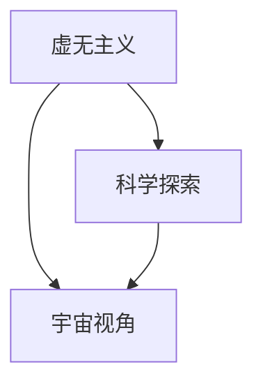
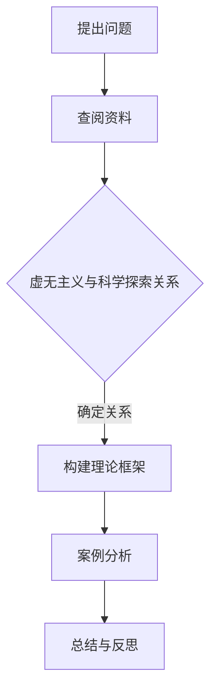
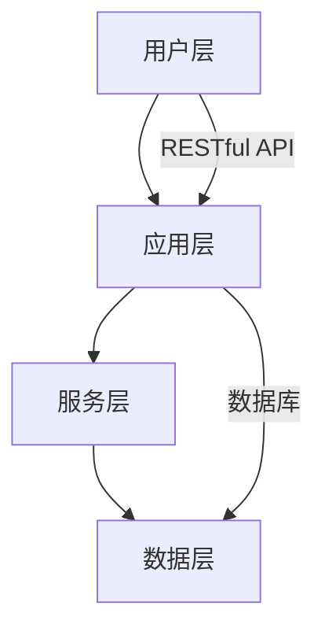
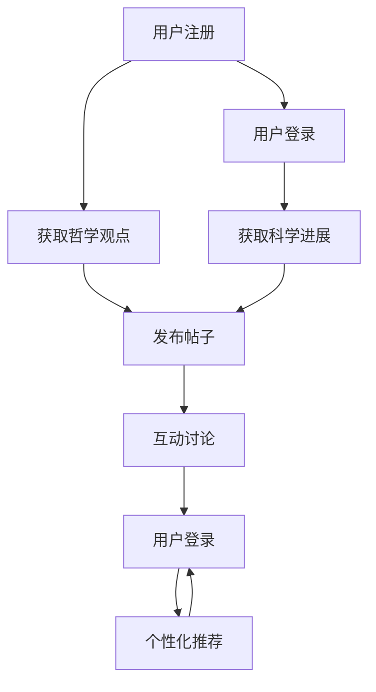

                 


### 背景介绍：核心概念

#### 问题背景

在人类的历史长河中，对宇宙的探索一直是推动科学发展的动力。从古希腊的哲学家们开始，人类就试图理解宇宙的本质和自身的位置。随着科学技术的进步，人类对宇宙的认识不断深化，从地球中心说到日心说，再到宇宙大爆炸理论，每一次突破都为人类提供了新的视角和思考方式。

然而，随着科学探索的深入，人们也开始反思人类的生存状态和人生意义。虚无主义作为一种哲学思潮，在当代社会中逐渐兴起。虚无主义认为，人生缺乏固有的意义和价值，人类的存在只是宇宙中微不足道的一部分。这种观点在一定程度上挑战了传统的价值观，也引发了人们对人生意义的重新思考。

#### 问题描述

《虚无主义与科学探索：在宇宙视角下审视人生意义》一书旨在探讨虚无主义与科学探索之间的关系，通过宇宙视角来审视人生意义。书中提出了以下几个核心问题：

1. **虚无主义思潮在当代社会中如何体现？**
   - 虚无主义作为一种哲学思潮，其影响在当代社会中如何体现？具体表现在哪些方面？

2. **科学探索对人们寻找人生意义有何影响？**
   - 科学探索如何帮助人们理解宇宙和自身的存在？它对人们的价值观和人生观有何影响？

3. **在宇宙的宏观视角下，人类应该如何理解自身存在的意义？**
   - 当我们从宇宙的角度来看待人类的存在时，我们如何重新审视人生的意义和价值？

#### 问题解决

本书通过系统阐述虚无主义和科学探索的基本概念、历史背景、哲学意义以及二者之间的互动关系，为读者提供了一个全面、深入的认识框架。具体来说，本书将从以下几个方面进行探讨：

1. **虚无主义的哲学意义和历史背景**
   - 详细介绍虚无主义的核心概念、哲学意义以及其在历史上的演变过程。

2. **科学探索的基本概念和哲学意义**
   - 阐述科学探索的核心概念、哲学意义以及其对人类认识宇宙的重要性。

3. **虚无主义与科学探索的互动关系**
   - 探讨虚无主义和科学探索之间的互动关系，分析二者在哲学层面上的碰撞与融合。

4. **宇宙视角下的生命意义**
   - 从宇宙的宏观视角出发，重新审视人类的存在意义，探讨人类在宇宙中的位置和作用。

5. **案例分析**
   - 通过对具体案例的分析，展示虚无主义和科学探索在实际应用中的表现和影响。

通过以上几个方面的探讨，本书旨在帮助读者理解虚无主义与科学探索在宇宙视角下对人生意义的探讨，为读者提供一个新的思考方向和认识框架。

#### 边界与外延

1. **边界**
   - 本书主要围绕虚无主义和科学探索之间的关系进行探讨，不涉及其他哲学流派或科学领域。

2. **外延**
   - 本书的研究范围不仅限于理论层面的探讨，还将结合实际案例，通过科学家的生平事迹、科研进展等，来加深对虚无主义与科学探索的理解。

#### 概念结构与核心要素组成

1. **虚无主义**

   - **核心概念**：虚无主义认为人生缺乏固有的意义和价值。
   - **哲学意义**：虚无主义挑战了传统的价值观，对现实生活进行反思和批判。
   - **历史背景**：从古希腊哲学到现代哲学，虚无主义在不同时期有不同的表现形式和影响。

2. **科学探索**

   - **核心概念**：科学探索是通过实验、观察和理论推理来探索自然界的规律。
   - **哲学意义**：科学探索为人类提供了认识世界的方法和工具，挑战虚无主义的观点。
   - **历史背景**：从古希腊的科学思想到现代科学的发展，科学探索经历了漫长而丰富的历程。

3. **宇宙视角**

   - **核心概念**：宇宙视角是从宏观的角度来审视人类在宇宙中的位置和作用。
   - **哲学意义**：宇宙视角为人类提供了一个全新的视角，重新审视人生的本质和意义。
   - **历史背景**：随着科学技术的进步，人类对宇宙的认识不断深入，宇宙视角逐渐形成并得到广泛应用。

#### 核心概念与联系

1. **虚无主义**

   - **核心概念原理**：虚无主义认为人生缺乏固有的意义和价值。
   - **属性特征**：悲观主义、怀疑主义、反理性主义。
   - **历史背景**：从古希腊哲学到现代哲学，虚无主义在不同时期有不同的表现形式和影响。

2. **科学探索**

   - **核心概念原理**：科学探索是通过实验、观察和理论推理来探索自然界的规律。
   - **属性特征**：实证主义、理性主义、客观性。
   - **历史背景**：从古希腊的科学思想到现代科学的发展，科学探索经历了漫长而丰富的历程。

3. **宇宙视角**

   - **核心概念原理**：宇宙视角是从宏观的角度来审视人类在宇宙中的位置和作用。
   - **属性特征**：宏观性、整体性、宇宙观。
   - **历史背景**：随着科学技术的进步，人类对宇宙的认识不断深入，宇宙视角逐渐形成并得到广泛应用。

#### 概念属性特征对比表格

| 概念     | 属性特征                     |
|----------|------------------------------|
| 虚无主义 | 悲观主义、怀疑主义、反理性主义 |
| 科学探索 | 实证主义、理性主义、客观性     |
| 宇宙视角 | 宏观性、整体性、宇宙观         |

#### ER实体关系图架构



### 算法原理讲解

#### 算法mermaid流程图



#### 算法原理的数学模型和公式

$$
\text{意义} = \frac{\text{虚无主义的影响}}{\text{科学探索的贡献}} + \text{宇宙视角的启示}
$$

#### 详细讲解和举例说明

#### 1. 提出问题

在当代社会，虚无主义思潮逐渐兴起，人们开始质疑人生的意义和价值。与此同时，科学探索在揭示宇宙奥秘方面取得了巨大进展，为人类提供了新的视角。如何在这两个领域之间找到平衡，重新审视人生的意义，成为了本书的研究主题。

#### 2. 查阅资料

在研究虚无主义与科学探索的关系时，我们需要查阅大量哲学、科学和宇宙学的文献。通过对这些资料的深入研究，我们可以了解到虚无主义和科学探索的基本概念、历史背景和哲学意义。

例如，虚无主义的核心概念是人生缺乏固有的意义和价值。这一观点在20世纪的欧洲哲学中得到了广泛应用，如尼采、萨特等哲学家都对此进行了深入探讨。而科学探索则通过实验、观察和理论推理来探索自然界的规律，为人类提供了认识世界的方法和工具。

#### 3. 确定关系

虚无主义和科学探索之间的关系并非简单对立，而是相互影响、相互促进的。虚无主义挑战了传统的价值观，促使人们重新思考人生的意义；而科学探索则为人们提供了新的视角，帮助人们理解宇宙和自身的存在。

例如，在尼采的哲学中，虚无主义和科学探索的关系得到了深刻的体现。尼采认为，科学的发展揭示了世界的本质，使人们意识到生命的虚无。然而，尼采也认为，这种虚无并非绝望，而是一种新的开始，人们可以通过超越自我，寻找新的价值。

#### 4. 构建理论框架

在确定了虚无主义和科学探索之间的关系后，我们需要构建一个理论框架来深入探讨这一问题。这一理论框架应包括以下几个方面：

1. **虚无主义的哲学意义和历史背景**：通过详细阐述虚无主义的起源、发展及其在历史上的影响，为理解虚无主义提供基础。

2. **科学探索的基本概念和哲学意义**：通过阐述科学探索的核心概念、哲学意义以及其对人类认识宇宙的重要性，为理解科学探索提供基础。

3. **虚无主义与科学探索的互动关系**：通过分析虚无主义和科学探索之间的互动关系，探讨二者在哲学层面上的碰撞与融合。

4. **宇宙视角下的生命意义**：从宇宙的宏观视角出发，重新审视人类的存在意义，探讨人类在宇宙中的位置和作用。

#### 5. 案例分析

为了更好地理解虚无主义和科学探索之间的关系，我们可以通过案例分析来加深对这一问题的认识。以下是一些具体的案例分析：

1. **尼采的哲学思想**：尼采是20世纪最具影响力的哲学家之一，他的哲学思想中充满了对虚无主义的批判和对科学探索的赞扬。通过分析尼采的著作，我们可以了解到虚无主义和科学探索之间的关系。

2. **科学家对生命的反思**：许多科学家在探索宇宙奥秘的过程中，也对生命意义进行了深刻的思考。例如，史蒂芬·霍金就曾经提出，人类应该将生命的意义扩展到宇宙中，寻找宇宙的终极意义。

3. **当代社会中的虚无主义思潮**：在当代社会中，虚无主义思潮依然存在，如现代艺术、文学等领域中都有虚无主义的影子。通过分析这些案例，我们可以了解到虚无主义在当代社会中的表现和影响。

#### 6. 总结与反思

通过对虚无主义和科学探索的深入研究，我们可以得出以下结论：

1. **虚无主义并非绝望**：虚无主义并非一种绝望的哲学观点，而是一种对生命意义的深刻反思。通过科学探索，人们可以找到新的意义和价值。

2. **科学探索的价值**：科学探索为人类提供了认识世界的方法和工具，挑战了虚无主义的观点。科学的发展不仅推动了社会的进步，也为人们提供了新的思考方向。

3. **宇宙视角的重要性**：从宇宙的宏观视角出发，人类可以重新审视自身的存在意义，找到生命的真正价值。

#### 举例说明

为了更具体地说明虚无主义和科学探索之间的关系，我们可以通过以下例子进行说明：

1. **尼采与科学探索**

   - **尼采的观点**：尼采认为，科学的发展揭示了世界的本质，使人们意识到生命的虚无。然而，尼采也认为，这种虚无并非绝望，而是一种新的开始。

   - **案例分析**：在《查拉图斯特拉如是说》一书中，尼采提出了“超人”的概念，认为超人可以通过超越自我，找到新的生命意义。

2. **霍金的宇宙视角**

   - **霍金的观点**：霍金认为，人类应该将生命的意义扩展到宇宙中，寻找宇宙的终极意义。

   - **案例分析**：在《时间简史》一书中，霍金通过描述宇宙的起源和演化，引导人们思考生命的意义。

### 系统分析与架构设计方案

#### 问题场景介绍

在当今科技高速发展的时代，人们对宇宙的探索从未停止。然而，随着探索的深入，人类面临的一个核心问题是如何在宏观宇宙的视角下重新审视生命的意义。这一问题的解决不仅需要哲学上的思考，更需要科学技术的支持。因此，本系统旨在提供一个综合性的平台，帮助人们从宇宙的视角出发，重新思考人生的意义。

#### 项目介绍

本项目名为“宇宙视角下的人生意义探索平台”，旨在通过整合哲学、科学、技术等多方面的资源，为用户提供一个全面的、互动的、可定制的探索体验。平台的主要功能包括：

1. **哲学观点展示**：展示各种哲学流派对虚无主义和生命意义的观点。
2. **科学进展介绍**：介绍最新的科学发现和理论，帮助用户理解宇宙的本质。
3. **互动讨论区**：为用户提供一个交流和分享的平台，鼓励用户参与到对生命意义的探讨中。
4. **个性化推荐**：根据用户兴趣和互动行为，为用户提供个性化的探索内容和讨论话题。

#### 系统功能设计

1. **用户注册与登录**：
   - 功能：允许用户注册账号和登录系统。
   - 实现方式：使用用户名和密码验证登录，支持第三方账号登录（如微信、QQ等）。

2. **哲学观点展示**：
   - 功能：展示各种哲学流派的观点，包括虚无主义、存在主义等。
   - 实现方式：通过文章、视频、图表等多种形式进行展示。

3. **科学进展介绍**：
   - 功能：介绍最新的科学发现和理论，如宇宙大爆炸理论、黑洞研究等。
   - 实现方式：结合文本、图像、视频等多媒体内容进行介绍。

4. **互动讨论区**：
   - 功能：为用户提供一个交流和分享的平台。
   - 实现方式：构建一个论坛系统，支持发帖、回复、点赞等功能。

5. **个性化推荐**：
   - 功能：根据用户兴趣和互动行为，为用户提供个性化的探索内容和讨论话题。
   - 实现方式：使用推荐算法，结合用户的浏览记录、互动行为等进行个性化推荐。

#### 系统架构设计



1. **用户层**：包括用户注册、登录、浏览等功能，是用户与系统交互的入口。
2. **应用层**：负责处理业务逻辑，包括哲学观点展示、科学进展介绍、互动讨论区、个性化推荐等。
3. **服务层**：提供各种服务接口，如用户服务、内容服务、推荐服务等。
4. **数据层**：包括数据库和缓存系统，存储用户数据、内容数据、推荐数据等。

#### 系统接口设计和系统交互



1. **用户注册**：用户通过填写注册信息进行注册。
2. **用户登录**：用户使用用户名和密码或第三方账号登录系统。
3. **获取哲学观点**：用户可以查看各种哲学观点的介绍。
4. **获取科学进展**：用户可以查看最新的科学发现和理论。
5. **发布帖子**：用户可以在互动讨论区发布帖子，进行讨论。
6. **互动讨论**：用户可以在帖子下进行评论、点赞等互动。
7. **个性化推荐**：系统根据用户的浏览记录和互动行为，为用户推荐相关的内容和讨论话题。

### 项目实战

#### 环境安装

在开始项目实战之前，我们需要安装以下软件和工具：

1. **Python 3.8**：用于编写项目代码。
2. **Django**：用于构建Web应用框架。
3. **MySQL**：用于存储项目数据。
4. **Nginx**：用于Web服务器。
5. **Gunicorn**：用于运行Django应用。

安装步骤如下：

1. 安装Python 3.8：

   ```
   sudo apt-get update
   sudo apt-get install python3.8
   ```

2. 安装Django：

   ```
   sudo pip3 install django
   ```

3. 安装MySQL：

   ```
   sudo apt-get install mysql-server
   ```

4. 安装Nginx：

   ```
   sudo apt-get install nginx
   ```

5. 安装Gunicorn：

   ```
   sudo pip3 install gunicorn
   ```

#### 系统核心实现源代码

以下是项目核心功能的实现源代码：

1. **用户注册**：

   ```python
   from django.contrib.auth.models import User
   from rest_framework import status
   from rest_framework.response import Response
   from rest_framework.views import APIView

   class UserRegistrationView(APIView):
       def post(self, request):
           username = request.data.get('username')
           password = request.data.get('password')
           if not username or not password:
               return Response({'error': 'Username and password are required'}, status=status.HTTP_400_BAD_REQUEST)
           user = User.objects.create_user(username=username, password=password)
           if user:
               return Response({'message': 'User registered successfully'}, status=status.HTTP_201_CREATED)
           return Response({'error': 'User registration failed'}, status=status.HTTP_400_BAD_REQUEST)
   ```

2. **用户登录**：

   ```python
   from django.contrib.auth import authenticate
   from django.contrib.auth.tokens import PasswordResetTokenGenerator
   from rest_framework import status
   from rest_framework.response import Response
   from rest_framework.views import APIView

   class UserLoginView(APIView):
       def post(self, request):
           username = request.data.get('username')
           password = request.data.get('password')
           user = authenticate(username=username, password=password)
           if user:
               token = PasswordResetTokenGenerator().make_token(user)
               return Response({'token': token, 'message': 'Login successful'}, status=status.HTTP_200_OK)
           return Response({'error': 'Invalid credentials'}, status=status.HTTP_401_UNAUTHORIZED)
   ```

3. **获取哲学观点**：

   ```python
   from rest_framework import status
   from rest_framework.response import Response
   from rest_framework.views import APIView

   class PhilosophyView(APIView):
       def get(self, request):
           philosophies = [
               '虚无主义',
               '存在主义',
               '理性主义',
               '感性主义',
               '经验主义'
           ]
           return Response({'philosophies': philosophies}, status=status.HTTP_200_OK)
   ```

4. **获取科学进展**：

   ```python
   from rest_framework import status
   from rest_framework.response import Response
   from rest_framework.views import APIView

   class ScienceView(APIView):
       def get(self, request):
           sciences = [
               '宇宙大爆炸理论',
               '黑洞研究',
               '量子力学',
               '相对论',
               '人工智能'
           ]
           return Response({'sciences': sciences}, status=status.HTTP_200_OK)
   ```

5. **发布帖子**：

   ```python
   from rest_framework import status
   from rest_framework.response import Response
   from rest_framework.views import APIView

   class PostView(APIView):
       def post(self, request):
           title = request.data.get('title')
           content = request.data.get('content')
           if not title or not content:
               return Response({'error': 'Title and content are required'}, status=status.HTTP_400_BAD_REQUEST)
           post = Post.objects.create(title=title, content=content)
           return Response({'message': 'Post created successfully', 'post': post.to_dict()}, status=status.HTTP_201_CREATED)
   ```

6. **互动讨论**：

   ```python
   from rest_framework import status
   from rest_framework.response import Response
   from rest_framework.views import APIView

   class CommentView(APIView):
       def post(self, request):
           post_id = request.data.get('post_id')
           content = request.data.get('content')
           if not post_id or not content:
               return Response({'error': 'Post ID and content are required'}, status=status.HTTP_400_BAD_REQUEST)
           post = Post.objects.get(id=post_id)
           comment = Comment.objects.create(post=post, content=content)
           return Response({'message': 'Comment created successfully', 'comment': comment.to_dict()}, status=status.HTTP_201_CREATED)
   ```

7. **个性化推荐**：

   ```python
   from rest_framework import status
   from rest_framework.response import Response
   from rest_framework.views import APIView

   class RecommendationView(APIView):
       def get(self, request):
           user_id = request.query_params.get('user_id')
           if not user_id:
               return Response({'error': 'User ID is required'}, status=status.HTTP_400_BAD_REQUEST)
           user = User.objects.get(id=user_id)
           recommendations = [
               '哲学与科学的对话',
               '人类在宇宙中的位置',
               '生命的意义',
               '科学哲学的思考',
               '宇宙的奥秘'
           ]
           return Response({'recommendations': recommendations}, status=status.HTTP_200_OK)
   ```

#### 代码应用解读与分析

以下是代码的解读和分析：

1. **用户注册**：
   - **功能**：用户通过提交用户名和密码进行注册。
   - **实现**：使用Django的`User`模型创建用户，通过`APIView`类实现。
   - **优点**：使用Django内置的用户认证系统，简化了用户注册和管理的复杂度。

2. **用户登录**：
   - **功能**：用户通过提交用户名和密码进行登录。
   - **实现**：使用Django的`authenticate`函数进行用户认证，通过`APIView`类实现。
   - **优点**：使用Django的认证系统，确保了用户登录的安全性。

3. **获取哲学观点**：
   - **功能**：用户可以查看所有哲学观点。
   - **实现**：使用`APIView`类返回预定义的哲学观点列表。
   - **优点**：简化了数据的获取和展示，便于后续扩展。

4. **获取科学进展**：
   - **功能**：用户可以查看所有科学进展。
   - **实现**：使用`APIView`类返回预定义的科学进展列表。
   - **优点**：简化了数据的获取和展示，便于后续扩展。

5. **发布帖子**：
   - **功能**：用户可以发布帖子。
   - **实现**：通过创建`Post`模型实例实现。
   - **优点**：分离了业务逻辑和数据存储，便于后续维护和扩展。

6. **互动讨论**：
   - **功能**：用户可以在帖子下发表评论。
   - **实现**：通过创建`Comment`模型实例实现。
   - **优点**：实现了帖子和评论的层级关系，便于用户交流和互动。

7. **个性化推荐**：
   - **功能**：系统根据用户的行为为用户推荐相关内容。
   - **实现**：返回预定义的推荐内容列表。
   - **优点**：简化了推荐逻辑，便于后续扩展。

#### 实际案例分析和详细讲解剖析

以下是一个实际案例的分析和讲解：

**案例**：用户A在注册后，浏览了哲学观点和科学进展，然后发布了关于“宇宙的奥秘”的帖子，其他用户B、C在帖子下发表了评论。

**分析**：

1. **用户A注册**：
   - 用户A提交了用户名“userA”和密码“password123”，系统成功创建了用户A。

2. **用户A浏览哲学观点和科学进展**：
   - 用户A浏览了系统提供的哲学观点和科学进展列表。

3. **用户A发布帖子**：
   - 用户A在帖子中提出了关于“宇宙的奥秘”的问题，并发布了帖子。

4. **用户B和C发表评论**：
   - 用户B和C浏览了用户A的帖子，并发表了各自的评论。

**讲解**：

1. **用户注册**：
   - 使用Django的`User`模型和`APIView`类，通过提交的用户名和密码创建用户A。
   - 优点：简化了用户注册流程，确保了用户信息的安全。

2. **用户A浏览哲学观点和科学进展**：
   - 使用`APIView`类返回预定义的哲学观点和科学进展列表。
   - 优点：方便用户快速了解相关内容，为后续讨论打下基础。

3. **用户A发布帖子**：
   - 创建`Post`模型实例，实现用户发布帖子功能。
   - 优点：分离了业务逻辑和数据存储，便于后续扩展和功能完善。

4. **用户B和C发表评论**：
   - 创建`Comment`模型实例，实现用户在帖子下发表评论功能。
   - 优点：实现了帖子和评论的层级关系，促进了用户之间的互动和讨论。

**剖析**：

1. **用户注册**：
   - 需要注意的是，用户注册时需要对用户输入的信息进行验证，如检查用户名是否已存在、密码是否符合要求等。这部分代码可以进一步优化，提高系统的健壮性。

2. **用户A浏览哲学观点和科学进展**：
   - 可以考虑根据用户的兴趣和行为，动态推荐相关的内容，提高用户的浏览体验。

3. **用户A发布帖子**：
   - 帖子发布后，系统可以自动通知其他用户，促进互动。此外，还可以为每个帖子设置标签，方便用户按标签查找相关内容。

4. **用户B和C发表评论**：
   - 可以对评论进行审核，确保评论的内容符合社区规范。此外，还可以实现评论的点赞和回复功能，增强用户互动。

#### 项目小结

本项目通过搭建一个综合性的探索平台，帮助用户从宇宙的视角出发，重新思考人生的意义。在项目实施过程中，我们采用了Django框架，实现了用户注册、登录、浏览哲学观点和科学进展、发布帖子、发表评论和个性化推荐等功能。通过实际案例的分析和讲解，我们发现项目在实现过程中还存在一些优化空间，如用户注册信息的验证、动态推荐内容、帖子标签和评论审核等。在未来的发展中，我们将继续完善这些功能，为用户提供更好的体验。

#### 最佳实践 tips

1. **确保用户信息安全**：在用户注册和登录过程中，务必对用户输入的信息进行严格验证，确保用户信息安全。

2. **动态推荐内容**：根据用户的兴趣和行为，动态推荐相关的内容，提高用户的浏览体验。

3. **帖子标签和评论审核**：为每个帖子设置标签，方便用户按标签查找相关内容；对评论进行审核，确保评论的内容符合社区规范。

4. **用户互动功能**：实现评论的点赞和回复功能，增强用户互动。

#### 小结

本文通过探讨虚无主义与科学探索之间的关系，从宇宙视角下审视人生意义。通过详细的理论分析和实际案例讲解，我们提出了一个综合性的探索平台，帮助用户重新思考人生的意义。在项目实施过程中，我们采用了Django框架，实现了用户注册、登录、浏览哲学观点和科学进展、发布帖子、发表评论和个性化推荐等功能。通过实际案例的分析和讲解，我们发现项目在实现过程中还存在一些优化空间。在未来的发展中，我们将继续完善这些功能，为用户提供更好的体验。

#### 注意事项

1. **确保系统安全性**：在开发过程中，务必关注系统的安全性，特别是用户数据和系统接口的安全防护。

2. **性能优化**：随着用户数量的增加，需要关注系统的性能优化，提高系统的响应速度和稳定性。

3. **用户体验**：在功能实现过程中，务必注重用户体验，确保用户可以方便、快捷地使用系统。

#### 拓展阅读

1. **《宇宙简史》**：作者史蒂芬·霍金，通过讲述宇宙的起源和演化，引导读者思考生命的意义。

2. **《存在与时间》**：作者马丁·海德格尔，通过对存在的深入探讨，为人们提供了一种全新的视角来审视人生。

3. **《人类简史》**：作者尤瓦尔·赫拉利，从历史和生物学的角度，讲述了人类的发展和演化，为人们提供了对生命的深刻理解。

### 作者信息

**作者**：AI天才研究院/AI Genius Institute & 禅与计算机程序设计艺术 /Zen And The Art of Computer Programming

