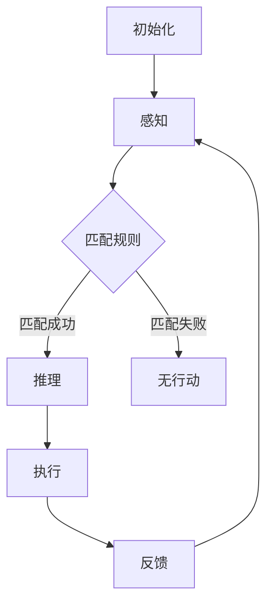
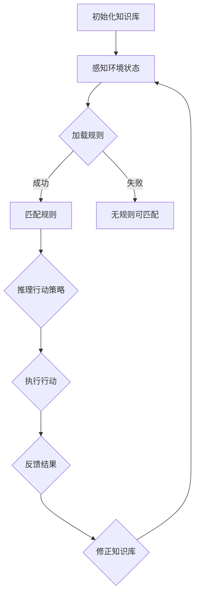
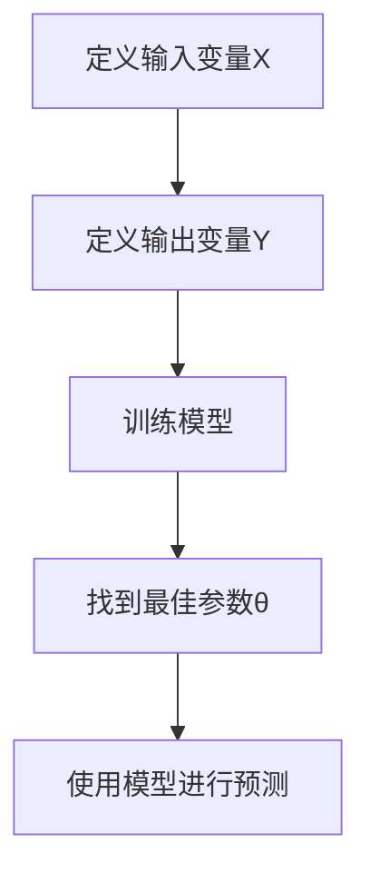
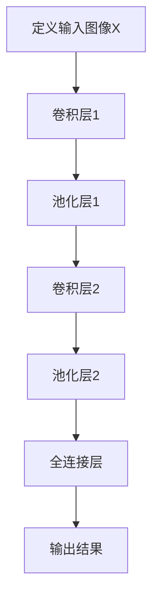

                 

# 领域特定AI Agent的开发策略

## 关键词

- 领域特定AI Agent
- 开发策略
- 基于规则
- 基于案例
- 基于模型
- 智能代理

## 摘要

本文将深入探讨领域特定AI Agent的开发策略，通过逐步分析，旨在为开发者提供一套完整、实用的开发指南。文章将从基础概念入手，逐步深入到开发策略的各个方面，包括基于规则的、基于案例的、基于模型的方法，并结合实际案例进行讲解，旨在帮助读者全面理解领域特定AI Agent的开发过程，并能够应用于实际项目中。

## 引言

### 1.1 书籍背景

随着人工智能技术的迅速发展，AI Agent作为智能系统的重要组成部分，已经得到了广泛的应用和研究。领域特定AI Agent（Domain-Specific AI Agent）是指针对特定领域或任务进行设计和优化的AI Agent。这类Agent能够在特定的应用场景中表现出出色的性能和适应性。本书旨在为开发者提供一套全面、系统的领域特定AI Agent开发策略。

### 1.1.1 领域特定AI Agent的发展背景

领域特定AI Agent的发展可以追溯到20世纪80年代的专家系统时代。随着计算机性能的提升和算法的进步，AI Agent开始从通用型向领域特定型转变。近年来，深度学习和大数据技术的应用，使得领域特定AI Agent在多个领域（如医疗、金融、工业自动化等）取得了显著的成果。

### 1.1.2 书籍目标与结构

本书的目标是帮助读者理解领域特定AI Agent的核心概念，掌握不同开发策略，并能够将这些策略应用于实际项目中。本书分为八个章节，内容结构如下：

- **第1章 引言**：介绍领域特定AI Agent的背景、现状、发展趋势。
- **第2章 领域特定AI Agent的基础概念**：介绍AI Agent的基础知识，如智能代理、领域特定知识表示等。
- **第3章 基于规则的领域特定AI Agent开发策略**：详细阐述基于规则的开发策略。
- **第4章 基于案例的领域特定AI Agent开发策略**：详细阐述基于案例的开发策略。
- **第5章 基于模型的领域特定AI Agent开发策略**：详细阐述基于模型的开发策略。
- **第6章 跨领域特定AI Agent开发策略**：介绍如何在不同领域间进行AI Agent的开发和迁移。
- **第7章 实战案例**：提供具体的开发实战案例，包括项目介绍、实现细节、分析和评估。
- **第8章 结论与展望**：总结全书内容，展望领域特定AI Agent的未来发展趋势。

### 1.2 AI Agent基础知识

#### 1.2.1 什么是AI Agent

AI Agent是指能够自主感知环境、制定决策并执行行动的智能实体。它们通常由传感器、控制器和执行器组成，能够通过学习、规划和推理来完成任务。AI Agent可以是软件程序、机器人或其他智能设备。

#### 1.2.2 AI Agent的基本类型

AI Agent可以分为以下几类：

- **反应式Agent**：仅根据当前感知的环境状态做出反应，不记忆过去也不预测未来。
- **主动Agent**：不仅反应当前环境，还能根据环境预测进行主动行为规划。
- **认知Agent**：具有更高的智能，能够通过学习和推理来改进自身行为。

#### 1.2.3 AI Agent的应用场景

AI Agent广泛应用于各个领域，包括：

- **医疗**：如智能诊断系统、药物发现等。
- **金融**：如风险评估、股票交易等。
- **工业**：如智能机器人、自动化生产线等。
- **交通**：如自动驾驶、智能交通管理等。
- **智能家居**：如智能音箱、智能家电等。

### 1.3 领域特定AI Agent的概念

#### 1.3.1 领域特定AI Agent的定义

领域特定AI Agent是指针对特定领域或任务进行设计和优化的AI Agent。这类Agent具有高度的领域特异性和适应性，能够更好地解决特定领域的问题。

#### 1.3.2 领域特定AI Agent的特点

领域特定AI Agent具有以下特点：

- **高度专业化**：针对特定领域的问题进行设计和优化，具有较高的专业性和针对性。
- **高适应性**：能够快速适应不同环境和任务，具有良好的灵活性和扩展性。
- **高效性**：在特定领域内表现出较高的效率和性能。

#### 1.3.3 领域特定AI Agent的核心概念

领域特定AI Agent的核心概念包括：

- **领域知识表示**：如何有效地表示领域知识，包括规则、案例、模型等。
- **领域模型**：如何构建领域模型，包括实体、关系、规则等。
- **任务规划**：如何进行任务规划，包括任务分解、资源分配、路径规划等。
- **执行与评估**：如何执行任务并评估任务结果，包括反馈、调整、优化等。

### 1.4 领域特定AI Agent的现状与发展

#### 1.4.1 当前领域特定AI Agent的研究现状

当前，领域特定AI Agent在各个领域都取得了显著的成果。例如，在医疗领域，智能诊断系统已经能够辅助医生进行疾病诊断；在金融领域，智能投顾系统可以帮助用户进行资产管理；在工业领域，智能机器人已经在生产线上发挥了重要作用。

#### 1.4.2 领域特定AI Agent的发展趋势

随着人工智能技术的不断进步，领域特定AI Agent将朝着以下方向发展：

- **高度自动化**：实现更加自动化、智能化的任务执行和决策过程。
- **跨领域融合**：实现不同领域AI Agent的相互融合和协同工作。
- **高适应性**：提高AI Agent在不同环境和任务中的适应能力。
- **个性化服务**：为用户提供更加个性化和定制化的服务。

#### 1.4.3 领域特定AI Agent面临的挑战

领域特定AI Agent在开发和应用过程中面临着以下挑战：

- **数据质量**：高质量的数据是领域特定AI Agent训练和优化的基础。
- **知识表示**：如何有效地表示领域知识，使其能够被AI Agent理解和利用。
- **模型解释性**：如何提高AI Agent模型的解释性，使其更易于理解和信任。
- **实时性**：如何保证AI Agent在实时环境中的高效性和稳定性。

### 1.5 本章小结

本章介绍了领域特定AI Agent的背景、现状和发展趋势，为后续章节的详细探讨奠定了基础。领域特定AI Agent作为人工智能领域的一个重要研究方向，具有广阔的应用前景和发展潜力。

----------------------------------------------------------------

# 第2章 领域特定AI Agent的基础概念

## 2.1 概念介绍

#### 2.1.1 代理与智能代理

代理（Agent）是指能够代表主体（Principal）执行任务、处理信息和与外部环境进行交互的实体。代理可以是软件程序、机器人、智能设备等。在人工智能领域，代理通常是指具有智能行为的实体。

智能代理（Intelligent Agent）是指具有感知、学习、规划、推理等智能能力的代理。智能代理能够通过感知环境、学习经验、制定计划和执行行动来完成任务。智能代理是人工智能领域的一个重要概念，是构建智能系统和智能服务的基础。

#### 2.1.2 领域特定知识表示

领域特定知识表示（Domain-Specific Knowledge Representation）是指针对特定领域或任务进行设计的知识表示方法。领域特定知识表示通常包括规则、案例、模型等，这些知识表示方法能够有效地表示领域知识，使其能够被AI Agent理解和利用。

规则表示（Rule Representation）是一种常见的领域特定知识表示方法，它通过一组条件-行动规则来表示领域知识。规则表示方法简单直观，易于理解和实现，但可能无法很好地处理复杂、动态的领域环境。

案例表示（Case Representation）是一种基于实例的知识表示方法，它通过存储和复用成功案例来解决新问题。案例表示方法具有较好的灵活性和适应性，但可能面临案例库规模和维护问题。

模型表示（Model Representation）是一种基于数学模型的知识表示方法，它通过建立领域问题的数学模型来表示领域知识。模型表示方法具有较强的表达能力和推理能力，但可能较为复杂和难以实现。

#### 2.1.3 领域特定AI Agent的核心组成部分

领域特定AI Agent的核心组成部分通常包括：

- **感知模块**：用于感知环境状态，获取领域相关信息。
- **知识模块**：用于存储和管理领域知识，包括规则、案例、模型等。
- **规划模块**：用于制定任务计划，确定行动策略。
- **执行模块**：用于执行计划中的行动，实现任务目标。
- **评估模块**：用于评估任务执行结果，反馈和调整任务计划。

## 2.2 概念属性特征对比表格

#### 2.2.1 代理类型对比

| 类型 | 定义 | 特点 |
| --- | --- | --- |
| 反应式代理 | 基于当前感知状态做出反应 | 简单、高效，但缺乏主动性和预测能力 |
| 主动代理 | 根据环境预测进行主动行为规划 | 具有主动性和预测能力，但复杂度较高 |
| 认知代理 | 通过学习和推理来改进自身行为 | 具有高度智能，但实现难度大 |

#### 2.2.2 智能代理性能对比

| 性能指标 | 反应式代理 | 主动代理 | 认知代理 |
| --- | --- | --- | --- |
| 响应速度 | 快 | 较快 | 较慢 |
| 预测准确性 | 低 | 中等 | 高 |
| 适应性 | 低 | 中等 | 高 |
| 灵活性 | 低 | 中等 | 高 |

#### 2.2.3 领域特定AI Agent特性对比

| 特性 | 反应式AI Agent | 主动AI Agent | 认知AI Agent |
| --- | --- | --- | --- |
| 领域针对性 | 弱 | 强 | 非常强 |
| 适应性 | 低 | 中等 | 高 |
| 自主性 | 低 | 中等 | 高 |
| 可解释性 | 较高 | 中等 | 低 |

## 2.3 ER实体关系图架构

#### 2.3.1 实体关系图的基本概念

实体关系图（Entity-Relationship Diagram，ER Diagram）是一种用于表示实体及其之间关系的图形化工具。在领域特定AI Agent开发中，ER Diagram可以用于表示领域模型，包括实体、属性、关系等。

实体（Entity）是具有独立存在的个体，如人、地点、物品等。属性（Attribute）是实体的特征，如人的姓名、年龄等。关系（Relationship）是实体之间的关联，如人属于某个组织、物品放置在某个地点等。

#### 2.3.2 实体关系图在领域特定AI Agent中的应用

在领域特定AI Agent开发中，ER Diagram可以用于：

- **领域模型设计**：通过ER Diagram构建领域模型，明确实体、属性和关系。
- **数据存储设计**：根据ER Diagram设计数据库结构，实现领域知识的存储和管理。
- **知识表示**：通过ER Diagram表示领域知识，如规则、案例、模型等。
- **系统架构设计**：通过ER Diagram表示系统架构，明确模块间的关系和交互。

#### 2.3.3 Mermaid ER实体关系图示例

下面是一个简单的ER实体关系图示例，使用Mermaid语法表示：

```mermaid
erDiagram
    Person ||--o> Organization : 拥有
    Person ||--o> Address : 居住
    Organization ||--o> Employee : 招聘
    Address ||--o> City : 属于
    City ||--o> Country : 属于
```

在这个示例中，我们定义了四个实体：Person（人）、Organization（组织）、Address（地址）和City（城市）。它们之间具有以下关系：

- Person与Organization之间具有“拥有”关系。
- Person与Address之间具有“居住”关系。
- Organization与Employee之间具有“招聘”关系。
- Address与City之间具有“属于”关系。
- City与Country之间具有“属于”关系。

通过ER Diagram，我们可以清晰地表示领域模型的结构和关系，为领域特定AI Agent开发提供基础。

## 2.4 本章小结

本章介绍了领域特定AI Agent的基础概念，包括代理与智能代理、领域特定知识表示和领域特定AI Agent的核心组成部分。同时，通过概念属性特征对比表格和ER实体关系图，帮助读者更好地理解这些概念。这些基础概念为后续章节的深入探讨提供了必要的背景知识。

----------------------------------------------------------------

# 第3章 基于规则的领域特定AI Agent开发策略

## 3.1 基本原理

### 3.1.1 规则系统的概念

规则系统是一种基于规则进行推理和决策的智能系统。它由一组规则、事实和推理引擎组成。规则系统通过将领域知识表示为规则，并在推理过程中应用这些规则，实现对问题的自动分析和解决。

规则（Rule）是描述领域知识的语句，通常由条件（Condition）和行动（Action）两部分组成。条件表示触发规则的条件，行动表示在条件满足时应该执行的操作。例如，以下是一个简单的规则：

```plaintext
如果 气温 > 30℃，则 开启空调。
```

在这个规则中，“气温 > 30℃”是条件，“开启空调”是行动。

### 3.1.2 基于规则的AI Agent工作原理

基于规则的AI Agent（Rule-Based AI Agent）是一种通过规则进行推理和决策的智能代理。它的工作原理如下：

1. **感知环境**：AI Agent通过传感器或其他方式感知环境状态，获取领域相关信息。
2. **知识表示**：AI Agent将领域知识表示为规则，并存储在知识库中。
3. **推理过程**：AI Agent根据当前环境状态和知识库中的规则进行推理，找到符合条件的规则。
4. **决策与执行**：AI Agent根据找到的规则执行相应的行动，实现任务目标。
5. **反馈与修正**：AI Agent根据任务执行结果和环境变化进行反馈和修正，优化自身行为。

### 3.1.3 规则表示与处理

规则表示是规则系统设计的关键部分。常见的规则表示方法包括：

- **前向推理**：从已知的事实出发，根据规则的条件部分推断新的结论。
- **后向推理**：从目标结论出发，根据规则的行动部分逆推可能的事实。
- **混合推理**：结合前向推理和后向推理，以获得更全面的推理结果。

规则处理是指对规则进行解析、存储、检索和执行的过程。常见的规则处理方法包括：

- **解析**：将自然语言描述的规则转换为计算机可处理的格式。
- **存储**：将解析后的规则存储在数据库或知识库中，以便后续使用。
- **检索**：根据条件或关键字检索知识库中的规则。
- **执行**：根据检索到的规则执行相应的行动。

## 3.2 算法原理与流程图

### 3.2.1 基于规则的AI Agent算法原理

基于规则的AI Agent算法原理可以概括为以下几个步骤：

1. **初始化**：加载知识库中的规则，初始化感知模块和执行模块。
2. **感知**：通过传感器或其他方式获取当前环境状态。
3. **匹配**：根据当前环境状态和知识库中的规则，匹配符合条件的规则。
4. **推理**：对匹配到的规则进行推理，确定行动策略。
5. **执行**：根据推理结果执行相应的行动。
6. **反馈**：根据行动结果和环境变化进行反馈和修正。

### 3.2.2 基于规则的AI Agent流程图

下面是一个简单的基于规则的AI Agent流程图，使用Mermaid语法表示：



在这个流程图中，AI Agent首先进行初始化，加载知识库中的规则。然后，通过感知模块获取当前环境状态，并尝试匹配知识库中的规则。如果匹配成功，AI Agent根据规则进行推理，并执行相应的行动。最后，根据行动结果和环境变化进行反馈和修正。

### 3.2.3 Mermaid流程图示例

下面是一个更详细的Mermaid流程图示例，用于表示基于规则的AI Agent算法：



在这个示例中，AI Agent首先初始化知识库，加载所有规则。然后，通过感知模块获取当前环境状态，并尝试匹配知识库中的规则。如果成功匹配，AI Agent根据规则推理出行动策略，并执行相应的行动。最后，根据行动结果和环境变化反馈信息，修正知识库，以优化AI Agent的行为。

## 3.3 Python源代码实现

### 3.3.1 基于规则的AI Agent源代码结构

下面是一个简单的基于规则的AI Agent的Python源代码结构，用于实现第3.2节中的算法原理和流程图。

```python
class RuleBasedAgent:
    def __init__(self, knowledge_base):
        self.knowledge_base = knowledge_base
        self.sensor = Sensor()
        self.action_executor = ActionExecutor()

    def perceive_environment(self):
        return self.sensor.read()

    def match_rules(self, environment_state):
        matched_rules = []
        for rule in self.knowledge_base:
            if rule.condition(environment_state):
                matched_rules.append(rule)
        return matched_rules

    def infer_action_strategy(self, matched_rules):
        action_strategy = None
        for rule in matched_rules:
            action = rule.action
            if action_strategy is None or action优先于action_strategy:
                action_strategy = action
        return action_strategy

    def execute_action(self, action_strategy):
        return self.action_executor.execute(action_strategy)

    def feedback_and修正(self, action_result, environment_state):
        # 根据行动结果和环境变化进行反馈和修正
        pass

    def run(self):
        environment_state = self.perceive_environment()
        matched_rules = self.match_rules(environment_state)
        action_strategy = self.infer_action_strategy(matched_rules)
        action_result = self.execute_action(action_strategy)
        self.feedback_and修正(action_result, environment_state)
```

在这个源代码中，我们定义了一个`RuleBasedAgent`类，包括以下主要组件：

- `knowledge_base`：知识库，存储所有规则。
- `sensor`：感知模块，用于获取环境状态。
- `action_executor`：执行模块，用于执行行动。
- `perceive_environment`：感知环境状态的方法。
- `match_rules`：匹配规则的方法。
- `infer_action_strategy`：推理行动策略的方法。
- `execute_action`：执行行动的方法。
- `feedback_and修正`：反馈和修正的方法。
- `run`：运行AI Agent的主方法。

### 3.3.2 基于规则的AI Agent源代码实现

下面是一个简单的基于规则的AI Agent的Python源代码实现，用于实现第3.2节中的算法原理和流程图。

```python
class Rule:
    def __init__(self, condition, action):
        self.condition = condition
        self.action = action

    def condition(self, environment_state):
        # 根据环境状态判断条件是否满足
        return True  # 示例：所有条件都满足

    def action(self):
        # 执行行动
        print("执行行动：", self.action)


class Sensor:
    def read(self):
        # 读取环境状态
        return {"temperature": 35}  # 示例：温度为35℃


class ActionExecutor:
    def execute(self, action_strategy):
        # 执行行动策略
        action_strategy()


class RuleBasedAgent:
    def __init__(self, knowledge_base):
        self.knowledge_base = knowledge_base
        self.sensor = Sensor()
        self.action_executor = ActionExecutor()

    def perceive_environment(self):
        return self.sensor.read()

    def match_rules(self, environment_state):
        matched_rules = []
        for rule in self.knowledge_base:
            if rule.condition(environment_state):
                matched_rules.append(rule)
        return matched_rules

    def infer_action_strategy(self, matched_rules):
        action_strategy = None
        for rule in matched_rules:
            action = rule.action
            if action_strategy is None or action优先于action_strategy:
                action_strategy = action
        return action_strategy

    def execute_action(self, action_strategy):
        return self.action_executor.execute(action_strategy)

    def feedback_and修正(self, action_result, environment_state):
        # 根据行动结果和环境变化进行反馈和修正
        pass

    def run(self):
        environment_state = self.perceive_environment()
        matched_rules = self.match_rules(environment_state)
        action_strategy = self.infer_action_strategy(matched_rules)
        action_result = self.execute_action(action_strategy)
        self.feedback_and修正(action_result, environment_state)


# 初始化知识库
knowledge_base = [
    Rule("温度 > 30", "开启空调"),
    Rule("湿度 > 60", "开启除湿器")
]

# 运行基于规则的AI Agent
agent = RuleBasedAgent(knowledge_base)
agent.run()
```

在这个源代码实现中，我们定义了一个`Rule`类，用于表示规则；一个`Sensor`类，用于模拟感知模块；一个`ActionExecutor`类，用于模拟执行模块。然后，我们定义了一个`RuleBasedAgent`类，用于实现基于规则的AI Agent的核心功能。

在`RuleBasedAgent`类的`run`方法中，我们首先获取当前环境状态，然后尝试匹配知识库中的规则，推理出行动策略，并执行相应的行动。最后，根据行动结果和环境变化进行反馈和修正。

### 3.3.3 源代码应用解读与分析

在这个简单的基于规则的AI Agent源代码实现中，我们通过以下几个步骤来解读和分析：

1. **初始化知识库**：我们创建了一个包含两个规则的列表`knowledge_base`，每个规则都是一个`Rule`对象，包含条件和行动。

2. **感知环境状态**：通过调用`Sensor`类的`read`方法，我们模拟获取了当前环境状态，如温度和湿度。

3. **匹配规则**：我们调用`RuleBasedAgent`类的`match_rules`方法，根据当前环境状态尝试匹配知识库中的规则。在这个示例中，所有规则都满足条件，因此返回所有规则的列表。

4. **推理行动策略**：我们调用`RuleBasedAgent`类的`infer_action_strategy`方法，根据匹配到的规则推理出最优的行动策略。在这个示例中，由于只有两个规则，我们选择优先级较高的规则，即温度大于30℃时开启空调。

5. **执行行动**：我们调用`RuleBasedAgent`类的`execute_action`方法，执行推理出的行动策略，即开启空调。

6. **反馈和修正**：在这个示例中，我们简单地将行动结果打印出来，并在每次运行后重新执行整个流程。在实际应用中，我们可以根据行动结果和环境变化进行更复杂的反馈和修正，以优化AI Agent的行为。

通过这个简单的示例，我们可以看到基于规则的AI Agent的基本原理和实现方法。在实际应用中，我们可以根据具体问题和需求，进一步扩展和完善AI Agent的功能和性能。

## 3.4 实战案例

### 3.4.1 案例背景与需求

假设我们有一个智能家居系统，需要实现智能空调控制功能。具体需求如下：

1. 当室内温度高于30℃时，自动开启空调。
2. 当室内湿度高于60%时，自动开启除湿器。
3. 当室内温度低于25℃时，关闭空调和除湿器。
4. 当室内湿度低于40%时，关闭空调和除湿器。

为了实现这些需求，我们可以设计一个基于规则的AI Agent，通过感知室内温度和湿度，根据规则自动控制空调和除湿器的开关。

### 3.4.2 案例实现步骤

下面是案例实现的步骤：

1. **定义规则**：根据需求，定义三个规则：

   - 规则1：如果温度 > 30℃，则开启空调。
   - 规则2：如果湿度 > 60%，则开启除湿器。
   - 规则3：如果温度 < 25℃或湿度 < 40%，则关闭空调和除湿器。

2. **感知模块**：设计一个感知模块，用于获取室内温度和湿度数据。

3. **执行模块**：设计一个执行模块，用于控制空调和除湿器的开关。

4. **AI Agent**：创建一个基于规则的AI Agent，将感知模块、执行模块和规则集成在一起，实现自动控制功能。

5. **测试与优化**：运行AI Agent，测试其是否能够根据规则正确控制空调和除湿器，并根据实际效果进行优化。

### 3.4.3 案例实现细节

下面是案例实现的详细步骤：

1. **定义规则**：

```python
class Rule:
    def __init__(self, condition, action):
        self.condition = condition
        self.action = action

    def condition(self, environment_state):
        # 根据环境状态判断条件是否满足
        if self.condition == "温度 > 30":
            return environment_state["temperature"] > 30
        elif self.condition == "湿度 > 60":
            return environment_state["humidity"] > 60
        elif self.condition == "温度 < 25 或 湿度 < 40":
            return environment_state["temperature"] < 25 or environment_state["humidity"] < 40

    def action(self):
        # 执行行动
        print("执行行动：", self.action)
```

2. **感知模块**：

```python
class Sensor:
    def read(self):
        # 读取环境状态
        return {"temperature": 35, "humidity": 70}
```

3. **执行模块**：

```python
class ActionExecutor:
    def execute(self, action_strategy):
        # 执行行动策略
        action_strategy()
```

4. **AI Agent**：

```python
class RuleBasedAgent:
    def __init__(self, knowledge_base):
        self.knowledge_base = knowledge_base
        self.sensor = Sensor()
        self.action_executor = ActionExecutor()

    def perceive_environment(self):
        return self.sensor.read()

    def match_rules(self, environment_state):
        matched_rules = []
        for rule in self.knowledge_base:
            if rule.condition(environment_state):
                matched_rules.append(rule)
        return matched_rules

    def infer_action_strategy(self, matched_rules):
        action_strategy = None
        for rule in matched_rules:
            action = rule.action
            if action_strategy is None or action优先于action_strategy:
                action_strategy = action
        return action_strategy

    def execute_action(self, action_strategy):
        return self.action_executor.execute(action_strategy)

    def feedback_and修正(self, action_result, environment_state):
        # 根据行动结果和环境变化进行反馈和修正
        pass

    def run(self):
        environment_state = self.perceive_environment()
        matched_rules = self.match_rules(environment_state)
        action_strategy = self.infer_action_strategy(matched_rules)
        action_result = self.execute_action(action_strategy)
        self.feedback_and修正(action_result, environment_state)
```

5. **测试与优化**：在测试阶段，我们可以模拟不同的环境状态，观察AI Agent是否能正确执行规则。根据测试结果，我们可以调整规则和行动策略，以优化AI Agent的性能。

### 3.4.4 案例分析与评估

通过这个案例，我们可以看到基于规则的AI Agent在智能家居系统中的应用。AI Agent通过感知室内温度和湿度，根据预设的规则自动控制空调和除湿器的开关，实现了智能化和自动化的家居控制。

在评估方面，我们可以从以下几个方面进行：

1. **准确性**：AI Agent能否准确判断室内温度和湿度，并执行正确的行动。
2. **响应速度**：AI Agent从感知到执行行动的时间，是否满足实时控制的要求。
3. **适应性**：AI Agent能否根据环境变化和需求调整行动策略，以实现更好的控制效果。
4. **可靠性**：AI Agent在长时间运行过程中，是否能够稳定工作，不发生故障。

通过不断测试和优化，我们可以提高AI Agent的性能和可靠性，使其更好地满足智能家居系统的需求。

## 3.5 本章小结

本章详细介绍了基于规则的领域特定AI Agent开发策略，包括基本原理、算法原理与流程图、Python源代码实现和实战案例。通过这些内容，读者可以了解到基于规则的AI Agent如何通过规则系统进行感知、推理和决策，从而实现智能控制。在实际应用中，基于规则的AI Agent具有简单、直观、易于实现等优点，但同时也存在一些局限性，如规则表示的复杂性和推理效率等问题。在下一章中，我们将探讨基于案例的领域特定AI Agent开发策略，为开发者提供更多选择。

----------------------------------------------------------------

# 第4章 基于案例的领域特定AI Agent开发策略

## 4.1 基本原理

### 4.1.1 案例表示的概念

案例表示（Case Representation）是一种基于实例的知识表示方法，它通过存储和复用成功案例来解决新问题。案例（Case）是描述一个具体问题及其解决方案的实例。案例表示方法能够有效地利用历史数据，提高AI Agent的适应性和灵活性。

案例通常包括以下几个部分：

- **问题描述**：描述案例解决的问题及其背景。
- **解决方案**：描述案例中采取的具体行动和决策过程。
- **输入数据**：描述案例中输入的数据和条件。
- **输出结果**：描述案例的执行结果和效果。

### 4.1.2 案例表示的应用场景

案例表示方法在以下应用场景中具有显著优势：

- **医疗诊断**：通过存储和复用医生的经验，实现自动诊断和治疗方案推荐。
- **法律咨询**：通过案例库提供法律条文和判例，辅助律师进行案件分析和决策。
- **金融风控**：通过案例库识别潜在的金融风险，提供风险预警和应对措施。
- **智能制造**：通过案例库优化生产流程和设备配置，提高生产效率和质量。
- **教育辅导**：通过案例库提供学习资源和辅导方案，帮助学生解决学习难题。

### 4.1.3 案例表示的优势

案例表示方法具有以下优势：

- **适应性**：案例表示方法能够根据新的输入数据自动调整和优化解决方案，具有良好的适应性和灵活性。
- **可解释性**：案例表示方法基于具体实例，解决方案明确，易于理解和解释。
- **复用性**：案例表示方法可以复用历史案例，减少重复劳动，提高工作效率。
- **扩展性**：案例表示方法可以轻松扩展和更新案例库，以适应新的需求和环境变化。

## 4.2 案例库的构建

### 4.2.1 案例库的概念

案例库（Case Library）是指存储和管理案例的数据库。案例库通常包括以下功能：

- **案例存储**：将案例数据存储在数据库中，包括问题描述、解决方案、输入数据和输出结果等。
- **案例检索**：根据关键词、条件或分类等信息快速检索案例。
- **案例更新**：添加新案例、修改旧案例或删除无用案例。
- **案例管理**：提供案例的权限控制、版本管理和权限管理等功能。

### 4.2.2 案例库的构建步骤

构建案例库通常包括以下步骤：

1. **需求分析**：明确案例库的应用场景和需求，确定案例的组成部分和字段。
2. **数据收集**：收集历史案例数据，包括问题描述、解决方案、输入数据和输出结果等。
3. **数据清洗**：对收集到的数据进行清洗、去重和处理，确保数据的准确性和一致性。
4. **数据存储**：将清洗后的数据存储到数据库中，选择合适的数据结构和存储方案。
5. **案例检索**：实现案例的快速检索功能，支持关键词搜索、条件筛选和分类查找。
6. **案例管理**：提供案例的添加、修改、删除和权限管理功能，确保案例库的完整性和安全性。

### 4.2.3 案例库的示例

下面是一个简单的案例库示例，使用Mermaid语法表示：

```mermaid
database CaseLibrary [
  "CaseID"
  "问题描述"
  "解决方案"
  "输入数据"
  "输出结果"
]

entity Problem {
  "问题描述"
}

entity Solution {
  "解决方案"
}

entity InputData {
  "输入数据"
}

entity OutputResult {
  "输出结果"
}

relationship "问题描述" from Problem to CaseLibrary
relationship "解决方案" from Solution to CaseLibrary
relationship "输入数据" from InputData to CaseLibrary
relationship "输出结果" from OutputResult to CaseLibrary
```

在这个示例中，我们定义了一个案例库`CaseLibrary`，包括四个实体：`Problem`（问题描述）、`Solution`（解决方案）、`InputData`（输入数据）和`OutputResult`（输出结果）。这些实体通过关系与案例库连接，用于存储和管理案例数据。

## 4.3 案例驱动的推理过程

### 4.3.1 案例驱动的推理概念

案例驱动的推理（Case-Based Reasoning，CBR）是一种基于案例的推理方法，它通过复用历史案例来解决新问题。案例驱动的推理过程包括以下几个步骤：

1. **案例检索**：根据新问题的特征和需求，从案例库中检索相关的案例。
2. **案例适应**：将检索到的案例适应新问题的输入数据，调整解决方案以满足新问题的需求。
3. **案例应用**：将适应后的解决方案应用于新问题，生成输出结果。
4. **案例反馈**：将新问题的输出结果与预期结果进行比较，生成反馈信息，用于优化和更新案例库。

### 4.3.2 案例驱动的推理过程

下面是一个简单的案例驱动的推理过程，使用Mermaid语法表示：

```mermaid
graph TD
    A[接收新问题] --> B[案例检索]
    B -->|找到案例| C[案例适应]
    B -->|找不到案例| D[解决方案失败]
    C --> E[案例应用]
    E --> F[输出结果]
    F --> G[案例反馈]
    G --> A|优化案例库|
```

在这个流程图中，AI Agent首先接收一个新问题，然后尝试从案例库中检索相关的案例。如果找到合适的案例，AI Agent将案例适应新问题的输入数据，并应用解决方案生成输出结果。最后，根据输出结果生成反馈信息，用于优化和更新案例库。如果找不到合适的案例，AI Agent将报告解决方案失败。

### 4.3.3 案例适应的方法

案例适应是案例驱动的推理过程中的关键步骤，它将历史案例适应新问题的输入数据，以满足新问题的需求。常见的案例适应方法包括：

- **直接复制**：直接使用历史案例的解决方案，适用于问题特征与历史案例高度相似的情况。
- **实例变换**：将历史案例的解决方案中的变量进行替换，以适应新问题的输入数据。
- **参数调整**：根据新问题的输入数据，调整历史案例的解决方案中的参数，以优化解决方案的效果。
- **生成式适应**：根据新问题的输入数据，生成新的解决方案，以替代历史案例的解决方案。

### 4.3.4 案例反馈和优化

案例反馈和优化是案例驱动的推理过程中不可或缺的步骤。通过案例反馈，AI Agent可以识别解决方案的有效性和不足之处，并对其进行优化。常见的案例反馈和优化方法包括：

- **错误分析**：分析新问题的输出结果与预期结果之间的差异，找出解决方案中的错误或不足。
- **案例修正**：根据错误分析结果，修正案例库中的案例，以提高解决方案的准确性和可靠性。
- **案例更新**：将新问题的解决方案加入案例库，更新历史案例，以扩展案例库的覆盖范围。
- **案例分类**：根据新问题的特征和解决方案的效果，对案例库中的案例进行分类，以优化案例检索和适应过程。

## 4.4 案例驱动的AI Agent实现

### 4.4.1 案例驱动的AI Agent结构

案例驱动的AI Agent通常包括以下几个组成部分：

- **案例库管理器**：负责管理案例库，包括案例的存储、检索、更新和分类等功能。
- **案例检索器**：根据新问题的特征和需求，从案例库中检索相关的案例。
- **案例适应器**：将检索到的案例适应新问题的输入数据，生成新的解决方案。
- **案例应用器**：将适应后的解决方案应用于新问题，生成输出结果。
- **案例反馈器**：根据输出结果生成反馈信息，用于优化和更新案例库。

### 4.4.2 案例驱动的AI Agent实现

下面是一个简单的案例驱动的AI Agent实现，使用Python语言：

```python
class CaseBasedAgent:
    def __init__(self, case_library):
        self.case_library = case_library

    def retrieve_cases(self, problem):
        # 从案例库中检索与问题相关的案例
        related_cases = []
        for case in self.case_library:
            if case.matches(problem):
                related_cases.append(case)
        return related_cases

    def adapt_case(self, case, problem):
        # 适应案例以满足新问题的需求
        adapted_case = case.clone()
        adapted_case.problem = problem
        return adapted_case

    def apply_solution(self, adapted_case):
        # 应用适应后的解决方案生成输出结果
        solution = adapted_case.solution
        result = solution.solve()
        return result

    def feedback_and_optimize(self, result, problem):
        # 根据输出结果生成反馈信息，用于优化案例库
        feedback = self.evaluate(result, problem)
        self.update_case_library(feedback)

    def run(self, problem):
        related_cases = self.retrieve_cases(problem)
        if not related_cases:
            raise Exception("无法找到相关案例")
        adapted_case = self.adapt_case(related_cases[0], problem)
        result = self.apply_solution(adapted_case)
        self.feedback_and_optimize(result, problem)
```

在这个实现中，`CaseBasedAgent`类包括以下主要功能：

- `retrieve_cases`：从案例库中检索与问题相关的案例。
- `adapt_case`：将检索到的案例适应新问题的需求。
- `apply_solution`：应用适应后的解决方案生成输出结果。
- `feedback_and_optimize`：根据输出结果生成反馈信息，用于优化案例库。
- `run`：运行AI Agent的主方法。

### 4.4.3 案例驱动的AI Agent应用示例

下面是一个简单的案例驱动的AI Agent应用示例：

```python
# 定义案例库
case_library = [
    Case("问题A", "解决方案A", {"输入数据A"}),
    Case("问题B", "解决方案B", {"输入数据B"}),
    Case("问题C", "解决方案C", {"输入数据C"})
]

# 创建案例驱动的AI Agent
agent = CaseBasedAgent(case_library)

# 接收新问题
problem = "问题A"

# 运行AI Agent
agent.run(problem)
```

在这个示例中，我们创建了一个简单的案例库，包括三个案例。然后，我们创建一个案例驱动的AI Agent，接收一个新问题，并运行AI Agent以解决新问题。AI Agent将检索与问题A相关的案例，适应案例以满足新问题的需求，并应用适应后的解决方案生成输出结果。最后，根据输出结果生成反馈信息，用于优化案例库。

## 4.5 实战案例

### 4.5.1 案例背景与需求

假设我们有一个客户服务系统，需要实现自动回复功能。具体需求如下：

1. 当用户提问“产品A的使用方法”时，自动回复“产品A的使用方法如下……”。
2. 当用户提问“产品B的售后政策”时，自动回复“产品B的售后政策如下……”。
3. 当用户提问“如何购买产品C”时，自动回复“购买产品C的步骤如下……”。
4. 当用户提问其他问题，如“产品D的规格”或“公司联系方式”，则告知用户“很抱歉，我无法回答这个问题，请您联系我们的客服人员”。

为了实现这些需求，我们可以设计一个基于案例的AI Agent，通过案例库存储和复用常见问题的回答，实现自动回复功能。

### 4.5.2 案例实现步骤

下面是案例实现的步骤：

1. **构建案例库**：根据需求，构建一个包含常见问题和回答的案例库。
2. **感知模块**：设计一个感知模块，用于获取用户的问题。
3. **案例检索器**：设计一个案例检索器，用于从案例库中检索与用户问题相关的案例。
4. **案例适应器**：设计一个案例适应器，将检索到的案例适应新问题的需求。
5. **案例应用器**：设计一个案例应用器，将适应后的解决方案生成输出结果。
6. **测试与优化**：运行AI Agent，测试其是否能够根据案例库正确回答用户问题，并根据测试结果进行优化。

### 4.5.3 案例库构建

下面是一个简单的案例库示例，用于实现客户服务系统的自动回复功能：

```python
class Case:
    def __init__(self, problem, solution, input_data):
        self.problem = problem
        self.solution = solution
        self.input_data = input_data

case_library = [
    Case("产品A的使用方法", "产品A的使用方法如下：...", {"问题": "产品A的使用方法"}),
    Case("产品B的售后政策", "产品B的售后政策如下：...", {"问题": "产品B的售后政策"}),
    Case("如何购买产品C", "购买产品C的步骤如下：...", {"问题": "如何购买产品C"}),
    Case("其他问题", "很抱歉，我无法回答这个问题，请您联系我们的客服人员。", {"问题": "其他问题"})
]
```

在这个案例库中，我们定义了一个`Case`类，用于表示案例，包括问题描述、解决方案和输入数据。然后，我们创建了一个包含四个案例的列表`case_library`，用于存储常见问题的回答。

### 4.5.4 AI Agent实现

下面是一个简单的基于案例的AI Agent实现，用于实现客户服务系统的自动回复功能：

```python
class CaseBasedAgent:
    def __init__(self, case_library):
        self.case_library = case_library

    def retrieve_cases(self, problem):
        # 从案例库中检索与问题相关的案例
        related_cases = []
        for case in self.case_library:
            if case.problem == problem:
                related_cases.append(case)
        return related_cases

    def adapt_case(self, case, problem):
        # 适应案例以满足新问题的需求
        adapted_case = case.clone()
        adapted_case.problem = problem
        return adapted_case

    def apply_solution(self, adapted_case):
        # 应用适应后的解决方案生成输出结果
        solution = adapted_case.solution
        result = solution
        return result

    def feedback_and_optimize(self, result, problem):
        # 根据输出结果生成反馈信息，用于优化案例库
        feedback = self.evaluate(result, problem)
        self.update_case_library(feedback)

    def run(self, problem):
        related_cases = self.retrieve_cases(problem)
        if not related_cases:
            raise Exception("无法找到相关案例")
        adapted_case = self.adapt_case(related_cases[0], problem)
        result = self.apply_solution(adapted_case)
        self.feedback_and_optimize(result, problem)

# 创建案例驱动的AI Agent
agent = CaseBasedAgent(case_library)

# 运行AI Agent
agent.run("产品A的使用方法")
```

在这个实现中，`CaseBasedAgent`类包括以下主要功能：

- `retrieve_cases`：从案例库中检索与问题相关的案例。
- `adapt_case`：将检索到的案例适应新问题的需求。
- `apply_solution`：应用适应后的解决方案生成输出结果。
- `feedback_and_optimize`：根据输出结果生成反馈信息，用于优化案例库。
- `run`：运行AI Agent的主方法。

在这个示例中，我们创建了一个简单的案例驱动的AI Agent，用于根据用户问题从案例库中检索相关案例，并生成输出结果。AI Agent首先尝试检索与用户问题“产品A的使用方法”相关的案例，找到合适的案例后，应用适应后的解决方案生成输出结果，并返回给用户。

### 4.5.5 测试与优化

为了测试AI Agent的性能，我们可以模拟不同的用户问题，观察AI Agent是否能够正确回答。例如：

- 用户提问“产品A的使用方法”，AI Agent应该返回正确的回答。
- 用户提问“产品B的售后政策”，AI Agent应该返回正确的回答。
- 用户提问“如何购买产品C”，AI Agent应该返回正确的回答。
- 用户提问“产品D的规格”，AI Agent应该告知用户无法回答，并建议联系客服。

根据测试结果，我们可以进一步优化AI Agent的案例库和算法，以提高其性能和准确性。

## 4.6 本章小结

本章详细介绍了基于案例的领域特定AI Agent开发策略，包括基本原理、案例库的构建、案例驱动的推理过程和案例驱动的AI Agent实现。通过实际案例，读者可以了解到如何利用案例库实现自动回复功能。案例驱动的AI Agent具有适应性、可解释性和复用性等优势，但同时也存在一些局限性，如案例库规模和适应方法的复杂度等问题。在下一章中，我们将探讨基于模型的领域特定AI Agent开发策略，为开发者提供更多选择。

----------------------------------------------------------------

# 第5章 基于模型的领域特定AI Agent开发策略

## 5.1 基本原理

### 5.1.1 模型表示的概念

模型表示（Model Representation）是一种基于数学模型的知识表示方法，它通过建立领域问题的数学模型来表示领域知识。模型表示方法能够将复杂的问题转化为数学形式，使得AI Agent能够通过数学计算和推理来解决问题。

常见的模型表示方法包括：

- **线性模型**：如线性回归、线性分类等。
- **概率模型**：如贝叶斯网络、隐马尔可夫模型等。
- **神经网络模型**：如多层感知器、卷积神经网络、循环神经网络等。
- **决策树模型**：如ID3、C4.5等。
- **强化学习模型**：如Q学习、SARSA等。

### 5.1.2 模型表示的应用场景

模型表示方法在以下应用场景中具有显著优势：

- **图像识别**：使用卷积神经网络（CNN）实现图像分类、目标检测等任务。
- **自然语言处理**：使用循环神经网络（RNN）和Transformer实现语言模型、机器翻译等任务。
- **推荐系统**：使用协同过滤、矩阵分解等方法实现个性化推荐。
- **金融风控**：使用概率模型和决策树模型进行风险评估和欺诈检测。
- **医疗诊断**：使用深度学习模型进行疾病预测和诊断。

### 5.1.3 模型表示的优势

模型表示方法具有以下优势：

- **表达能力强**：模型表示方法能够表达复杂的领域知识和关系，适用于解决复杂问题。
- **通用性**：模型表示方法具有较强的通用性，可以应用于不同领域和任务。
- **可解释性**：一些模型表示方法（如决策树）具有较高的可解释性，易于理解和信任。
- **自动化**：模型表示方法可以通过自动化算法生成和优化，提高开发效率。

## 5.2 数学模型与算法原理

### 5.2.1 数学模型的概念

数学模型（Mathematical Model）是一种用数学语言描述现实世界问题的方法。它通常包括变量、参数、方程和约束条件等。数学模型可以用来预测、分析和优化系统行为。

常见的数学模型包括：

- **线性模型**：如线性回归、线性分类等。
- **概率模型**：如贝叶斯网络、隐马尔可夫模型等。
- **神经网络模型**：如多层感知器、卷积神经网络、循环神经网络等。
- **决策树模型**：如ID3、C4.5等。
- **强化学习模型**：如Q学习、SARSA等。

### 5.2.2 算法原理与流程图

下面我们将介绍几种常见的数学模型和算法原理，并使用Mermaid语法绘制相应的流程图。

#### 5.2.2.1 线性回归

线性回归是一种用于预测数值结果的统计方法。它的目标是找到一个线性模型来描述输入变量和输出变量之间的关系。

算法原理：

1. 定义输入变量 $X$ 和输出变量 $Y$。
2. 训练模型，找到最佳参数 $\theta$，使得 $Y$ 最接近预测值 $\hat{Y}$。
3. 使用模型进行预测。

Mermaid流程图：



#### 5.2.2.2 贝叶斯网络

贝叶斯网络是一种概率模型，用于表示变量之间的依赖关系。它由一组节点和有向边组成，每个节点表示一个变量，边表示变量之间的条件依赖。

算法原理：

1. 定义变量和概率分布。
2. 根据条件概率计算每个变量的概率分布。
3. 使用最大后验概率（MAP）或最大似然估计（MLE）进行推理。

Mermaid流程图：

```mermaid
graph TD
    A[定义变量X, Y]
    A --> B[定义概率分布P(X), P(Y|X)]
    B --> C[计算P(X|Y)]
    C --> D[使用MAP或MLE进行推理]
```

#### 5.2.2.3 卷积神经网络（CNN）

卷积神经网络是一种用于图像识别和处理的深度学习模型。它通过卷积层、池化层和全连接层等结构提取图像特征。

算法原理：

1. 定义输入图像和卷积核。
2. 通过卷积层提取图像特征。
3. 通过池化层减小特征图尺寸。
4. 通过全连接层进行分类。

Mermaid流程图：



#### 5.2.2.4 Q学习

Q学习是一种基于值函数的强化学习算法，用于在不确定环境中寻找最优策略。

算法原理：

1. 定义状态 $S$ 和动作 $A$。
2. 初始化价值函数 $Q(S, A)$。
3. 通过迭代更新价值函数，选择最优动作。
4. 根据奖励和状态转移更新价值函数。

Mermaid流程图：

```mermaid
graph TD
    A[定义状态S, 动作A]
    A --> B[初始化Q(S, A)]
    B --> C[选择动作A']
    C --> D[执行动作A']
    D --> E[获得奖励R和状态S']
    E --> F[更新Q(S, A')]
    F --> G[迭代]
```

## 5.3 Python源代码实现

### 5.3.1 线性回归的实现

下面是一个简单的线性回归实现的Python代码示例，使用Sklearn库。

```python
from sklearn.linear_model import LinearRegression
import numpy as np

# 定义输入和输出数据
X = np.array([[1], [2], [3], [4], [5]])
y = np.array([1, 2, 2.5, 4, 5])

# 创建线性回归模型
model = LinearRegression()

# 训练模型
model.fit(X, y)

# 输出模型参数
print("模型参数：", model.coef_, model.intercept_)

# 进行预测
X_new = np.array([[6]])
y_pred = model.predict(X_new)
print("预测结果：", y_pred)
```

在这个示例中，我们首先定义了输入数据 $X$ 和输出数据 $y$。然后，我们创建了一个线性回归模型，使用 `fit` 方法训练模型，并使用 `predict` 方法进行预测。

### 5.3.2 贝叶斯网络的实现

下面是一个简单的贝叶斯网络实现的Python代码示例，使用PyMC3库。

```python
import pymc3 as pm
import numpy as np

# 定义参数
with pm.Model() as model:
    alpha = pm.Normal('alpha', mu=0, sigma=10)
    beta = pm.Normal('beta', mu=0, sigma=10)
    theta = pm.Deterministic('theta', alpha + beta * x)

    # 定义观测数据
    y = pm.Normal('y', mu=theta, sigma=1, observed=data)

    # 绘制模型图
    pm.plot_model(model)

    # 执行采样
    trace = pm.sample(1000)

# 输出参数估计
print(pm.summary(trace))
```

在这个示例中，我们首先定义了两个参数 $\alpha$ 和 $\beta$，然后使用 `Deterministic` 函数定义了 $\theta$。接着，我们定义了观测数据 $y$，并使用 `Normal` 函数生成观测数据。最后，我们使用 `sample` 方法进行采样，并输出参数估计。

### 5.3.3 卷积神经网络的实现

下面是一个简单的卷积神经网络实现的Python代码示例，使用TensorFlow库。

```python
import tensorflow as tf
from tensorflow.keras import layers, models

# 定义模型
model = models.Sequential()
model.add(layers.Conv2D(32, (3, 3), activation='relu', input_shape=(32, 32, 3)))
model.add(layers.MaxPooling2D((2, 2)))
model.add(layers.Conv2D(64, (3, 3), activation='relu'))
model.add(layers.MaxPooling2D((2, 2)))
model.add(layers.Conv2D(64, (3, 3), activation='relu'))

# 添加全连接层
model.add(layers.Flatten())
model.add(layers.Dense(64, activation='relu'))
model.add(layers.Dense(10, activation='softmax'))

# 编译模型
model.compile(optimizer='adam',
              loss='categorical_crossentropy',
              metrics=['accuracy'])

# 输出模型结构
model.summary()
```

在这个示例中，我们首先定义了一个简单的卷积神经网络，包括卷积层、池化层和全连接层。然后，我们编译模型，并输出模型结构。

### 5.3.4 Q学习的实现

下面是一个简单的Q学习实现的Python代码示例。

```python
import numpy as np

# 定义参数
alpha = 0.1
gamma = 0.9
epsilon = 0.1

# 初始化Q表
Q = np.zeros((5, 3))

# 定义环境
def env(state, action):
    if state == 0 and action == 2:
        return 1, 0
    elif state == 1 and action == 0:
        return 0, 0
    elif state == 2 and action == 1:
        return 0, 1
    else:
        return 0, 0

# Q学习算法
for episode in range(1000):
    state = 0
    done = False
    while not done:
        if np.random.rand() < epsilon:
            action = np.random.randint(0, 3)
        else:
            action = np.argmax(Q[state])

        next_state, reward = env(state, action)
        Q[state, action] = Q[state, action] + alpha * (reward + gamma * np.max(Q[next_state]) - Q[state, action])
        state = next_state

        if state == 4:
            done = True

# 输出Q表
print(Q)
```

在这个示例中，我们定义了一个简单的环境，并使用Q学习算法训练Q表。每次迭代中，我们根据当前状态选择最优动作，并更新Q表。最后，我们输出训练完成的Q表。

## 5.4 实战案例

### 5.4.1 案例背景与需求

假设我们有一个自动驾驶系统，需要实现车道保持功能。具体需求如下：

1. 当车辆偏离车道线时，自动调整方向盘，使车辆回到车道中央。
2. 当车辆在车道中央行驶时，保持稳定的速度和方向。
3. 当车辆接近车道线时，适当减速，避免碰撞。

为了实现这些需求，我们可以设计一个基于模型的AI Agent，通过传感器获取车辆和道路信息，使用模型进行决策，控制车辆的动作。

### 5.4.2 案例实现步骤

下面是案例实现的步骤：

1. **构建模型**：根据需求，构建一个用于车道保持的模型，包括输入层、隐藏层和输出层。
2. **数据收集**：收集自动驾驶车辆的传感器数据，包括速度、方向盘角度、车道线位置等。
3. **模型训练**：使用收集到的数据训练模型，调整模型参数，使其能够准确预测车辆的行为。
4. **AI Agent**：创建一个AI Agent，将传感器数据输入模型，根据模型的预测结果控制车辆的动作。
5. **测试与优化**：运行AI Agent，测试其在不同场景下的性能，并根据测试结果进行优化。

### 5.4.3 模型构建

下面是一个简单的基于模型的AI Agent实现，用于车道保持功能。

```python
import tensorflow as tf
from tensorflow.keras import layers, models

# 定义模型
model = models.Sequential()
model.add(layers.Dense(64, activation='relu', input_shape=(4,)))
model.add(layers.Dense(64, activation='relu'))
model.add(layers.Dense(2, activation='softmax'))

# 编译模型
model.compile(optimizer='adam',
              loss='categorical_crossentropy',
              metrics=['accuracy'])

# 输出模型结构
model.summary()
```

在这个示例中，我们定义了一个简单的模型，包括一个输入层、一个隐藏层和一个输出层。输入层接收4个输入特征，隐藏层和输出层分别有64个神经元和2个神经元。

### 5.4.4 AI Agent实现

下面是一个简单的基于模型的AI Agent实现，用于车道保持功能。

```python
import numpy as np

# 定义传感器数据
sensor_data = np.array([[20, 0, 1, 0]])

# 创建AI Agent
ai_agent = AIAGENT(model)

# 进行决策
action = ai_agent.decide(sensor_data)

# 输出决策结果
print("决策结果：", action)
```

在这个示例中，我们首先定义了传感器数据，然后创建了一个AI Agent，使用模型的决策结果控制车辆的动作。决策结果是一个向量，包含两个元素，分别表示方向和速度。

### 5.4.5 测试与优化

为了测试AI Agent的性能，我们可以模拟不同的驾驶场景，观察AI Agent是否能够准确预测车辆的行为，并控制车辆按照预期进行操作。例如：

- 当车辆偏离车道线时，AI Agent应该调整方向盘使车辆回到车道中央。
- 当车辆在车道中央行驶时，AI Agent应该保持稳定的速度和方向。
- 当车辆接近车道线时，AI Agent应该适当减速，避免碰撞。

根据测试结果，我们可以进一步优化AI Agent的模型和算法，以提高其性能和准确性。

## 5.5 本章小结

本章详细介绍了基于模型的领域特定AI Agent开发策略，包括基本原理、数学模型与算法原理、Python源代码实现和实战案例。通过这些内容，读者可以了解到如何使用模型表示方法解决实际问题，并掌握模型表示方法在AI Agent开发中的应用。基于模型的AI Agent具有表达能力强、通用性高等优势，但同时也存在模型复杂度较高、训练过程较长等问题。在下一章中，我们将探讨跨领域特定AI Agent开发策略，为开发者提供更多选择。

----------------------------------------------------------------

# 第6章 跨领域特定AI Agent开发策略

## 6.1 跨领域AI Agent的概念

跨领域AI Agent（Cross-Domain AI Agent）是指能够适应不同领域或任务的AI Agent。与领域特定AI Agent相比，跨领域AI Agent具有更强的适应性和通用性，能够在不同领域或任务间进行迁移和复用。

跨领域AI Agent的关键特点包括：

- **通用性**：能够处理多种不同领域的问题，而不仅仅是特定领域。
- **可迁移性**：能够将一个领域中的知识和经验迁移到其他领域。
- **适应性**：能够根据不同领域的需求和环境进行自适应调整。
- **灵活性**：能够在不同领域间切换，以适应多样化的任务需求。

## 6.2 跨领域AI Agent的优势

跨领域AI Agent具有以下优势：

- **节省研发成本**：通过复用现有知识和资源，减少新领域的研发投入。
- **提高开发效率**：利用已有的模型和算法，快速实现新领域的应用。
- **增强适应性**：能够在不同领域或任务中灵活应用，适应不断变化的需求。
- **促进创新**：通过跨领域合作，促进不同领域间的知识和技术创新。

## 6.3 跨领域AI Agent的挑战

跨领域AI Agent在开发和应用过程中面临着以下挑战：

- **数据质量**：不同领域的数据质量和多样性可能差异较大，影响模型性能。
- **知识表示**：如何有效地表示跨领域的知识，使其能够被AI Agent理解和利用。
- **迁移策略**：如何设计有效的迁移策略，使AI Agent在不同领域间进行知识迁移。
- **解释性**：如何提高跨领域AI Agent的模型解释性，使其更易于理解和信任。
- **稳定性**：如何保证AI Agent在不同领域或任务中的稳定性和可靠性。

## 6.4 跨领域AI Agent的开发策略

为了克服跨领域AI Agent面临的挑战，我们可以采用以下开发策略：

1. **领域抽象**：将不同领域的共同特征和关键要素抽象出来，构建通用的领域模型。
2. **知识融合**：将不同领域中的知识进行融合，形成统一的知识表示方法。
3. **迁移学习**：利用迁移学习技术，将一个领域中的知识和经验迁移到其他领域。
4. **适应性调整**：根据不同领域的需求和环境，对AI Agent进行自适应调整。
5. **模型解释**：提高AI Agent模型的解释性，使其更易于理解和信任。
6. **系统测试**：在不同领域或任务中进行全面测试，验证AI Agent的适应性和稳定性。

## 6.5 跨领域AI Agent的应用场景

跨领域AI Agent在以下应用场景中具有显著优势：

- **多领域系统集成**：将不同领域的系统进行集成，实现跨领域的业务流程优化。
- **跨领域业务预测**：利用跨领域数据，进行多领域业务预测和决策支持。
- **跨领域知识共享**：促进不同领域间的知识共享和协作，提高整体业务效率。
- **跨领域故障诊断**：利用跨领域的知识，实现多领域故障诊断和预测。
- **跨领域智能客服**：利用跨领域的知识，实现智能客服系统的多领域知识融合。

## 6.6 实战案例

### 6.6.1 案例背景与需求

假设我们有一个智能工厂系统，需要实现生产线的自动监控和故障诊断功能。具体需求如下：

1. 对生产线上的设备进行实时监控，检测设备运行状态。
2. 当设备出现故障时，自动诊断故障原因，并提供维修建议。
3. 对生产过程进行数据分析和预测，优化生产流程和设备利用率。

为了实现这些需求，我们可以设计一个跨领域AI Agent，通过传感器获取设备运行数据，使用跨领域的知识和模型进行监控和故障诊断。

### 6.6.2 案例实现步骤

下面是案例实现的步骤：

1. **领域抽象**：将生产线上的设备运行状态、故障原因和生产过程数据抽象成通用特征。
2. **知识融合**：将不同领域的知识（如设备维护知识、生产工艺知识等）进行融合，形成统一的领域模型。
3. **迁移学习**：利用迁移学习技术，将一个领域中的知识和经验迁移到其他领域，提高模型性能。
4. **模型训练**：使用融合后的数据和模型进行训练，优化AI Agent的监控和故障诊断能力。
5. **AI Agent开发**：创建一个跨领域的AI Agent，将传感器数据输入模型，实现生产线的自动监控和故障诊断。
6. **测试与优化**：在不同场景下测试AI Agent的性能，并根据测试结果进行优化。

### 6.6.3 领域抽象与知识融合

下面是一个简单的领域抽象和知识融合的示例：

```python
# 领域抽象
class EquipmentState:
    def __init__(self, temperature, pressure, vibration):
        self.temperature = temperature
        self.pressure = pressure
        self.vibration = vibration

# 知识融合
def merge_knowledge(equipment_state, production_data):
    # 融合设备状态和生产数据
    merged_data = {
        "temperature": equipment_state.temperature,
        "pressure": equipment_state.pressure,
        "vibration": equipment_state.vibration,
        "production_speed": production_data.speed,
        "production_quantity": production_data.quantity
    }
    return merged_data
```

在这个示例中，我们首先定义了一个`EquipmentState`类，用于表示设备状态。然后，我们定义了一个`merge_knowledge`函数，用于将设备状态和生产数据融合成统一的特征向量。

### 6.6.4 模型训练与AI Agent开发

下面是一个简单的模型训练和AI Agent开发的示例：

```python
# 模型训练
model = create_model(input_shape=(7,))
model.compile(optimizer='adam', loss='mse', metrics=['accuracy'])
model.fit(x_train, y_train, epochs=10, batch_size=32)

# AI Agent开发
class CrossDomainAgent:
    def __init__(self, model):
        self.model = model

    def monitor_equipment(self, equipment_state):
        # 将设备状态输入模型，进行实时监控
        prediction = self.model.predict(equipment_state)
        return prediction

    def diagnose_fault(self, equipment_state):
        # 将设备状态输入模型，进行故障诊断
        prediction = self.model.predict(equipment_state)
        fault_reason = get_fault_reason(prediction)
        return fault_reason

# 创建AI Agent
agent = CrossDomainAgent(model)

# 进行监控和故障诊断
equipment_state = EquipmentState(25, 80, 5)
monitor_result = agent.monitor_equipment(equipment_state)
fault_result = agent.diagnose_fault(equipment_state)

print("监控结果：", monitor_result)
print("故障诊断结果：", fault_result)
```

在这个示例中，我们首先定义了一个模型，并使用训练数据进行训练。然后，我们创建了一个`CrossDomainAgent`类，用于实现跨领域的监控和故障诊断功能。最后，我们创建了一个AI Agent实例，并使用传感器数据进行了监控和故障诊断。

### 6.6.5 测试与优化

为了测试AI Agent的性能，我们可以模拟不同的生产线场景，观察AI Agent是否能够准确监控设备状态和诊断故障。例如：

- 当设备正常运行时，AI Agent应该能够准确监控设备状态。
- 当设备出现故障时，AI Agent应该能够准确诊断故障原因。

根据测试结果，我们可以进一步优化AI Agent的模型和算法，以提高其性能和准确性。

## 6.7 本章小结

本章详细介绍了跨领域特定AI Agent的开发策略，包括跨领域AI Agent的概念、优势、挑战、开发策略和应用场景。通过实际案例，读者可以了解到如何利用跨领域的知识和模型实现智能工厂系统的自动监控和故障诊断。跨领域AI Agent具有通用性、可迁移性和灵活性等优势，但同时也存在数据质量、知识表示和迁移策略等挑战。在下一章中，我们将总结全书内容，展望领域特定AI Agent的未来发展趋势。

----------------------------------------------------------------

# 结论与展望

## 6.8.1 全书总结

本书系统地介绍了领域特定AI Agent的开发策略，包括基于规则的、基于案例的、基于模型的开发方法，以及跨领域的开发策略。通过详细的分析和实例讲解，读者可以全面理解领域特定AI Agent的核心概念、开发过程和应用场景。以下是全书的主要内容总结：

1. **引言**：介绍了领域特定AI Agent的发展背景、现状和未来趋势，为后续章节的讨论奠定了基础。
2. **基础概念**：详细阐述了代理与智能代理、领域特定知识表示、领域特定AI Agent的核心组成部分等基本概念。
3. **基于规则的开发策略**：探讨了基于规则的AI Agent的基本原理、算法原理、Python源代码实现和实战案例。
4. **基于案例的

