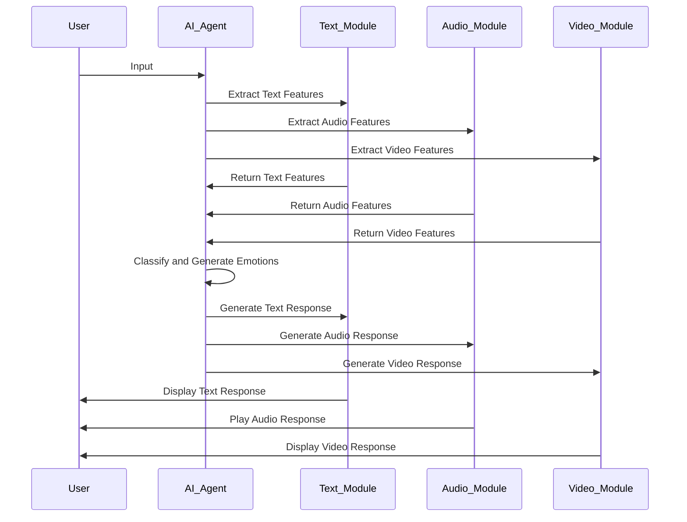
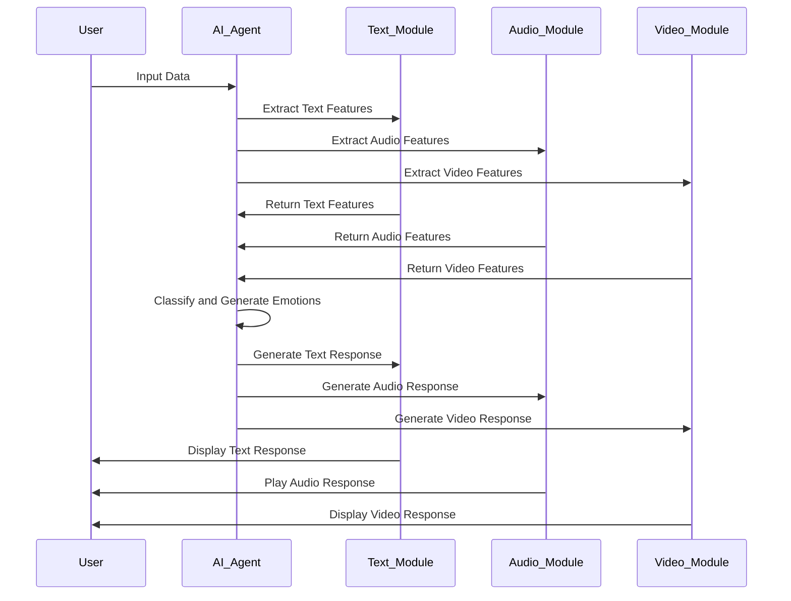

                 


### 背景介绍

#### 1.1 问题背景

AI Agent，即人工智能代理，是一种能够代表人类在复杂环境中执行任务、进行决策和交互的智能系统。随着人工智能技术的飞速发展，AI Agent在各个领域，如客户服务、智能家居、自动驾驶等，都展现出了巨大的应用潜力。然而，为了更自然、有效地与人类进行互动，AI Agent需要具备理解并生成情感的能力。

多模态情感识别与生成技术，是指AI Agent能够同时处理和识别文本、声音、图像等多种模态的情感信息，并基于这些情感信息生成相应的情感表达。这对于提高AI Agent与人类互动的自然性和准确性具有重要意义。

在当前的技术环境下，情感识别与生成技术的发展面临以下几个挑战：

1. **数据多样性**：不同模态的数据（如文本、声音、图像）具有不同的特征和表达方式，如何统一处理这些异构数据是一个难题。
2. **上下文理解**：情感表达往往与上下文密切相关，如何准确理解上下文信息，从而更准确地识别和生成情感，是当前研究的重点。
3. **实时性**：在实际应用中，如自动驾驶或智能客服等场景，对情感识别与生成的实时性要求很高，这需要算法能够快速响应并处理数据。

#### 1.2 核心概念

**情感识别**：情感识别是指通过分析文本、声音、图像等数据，识别其中蕴含的情感信息。这包括情感分类（如愉悦、愤怒、悲伤等）和情感强度识别（如情感的中度、重度等）。

**情感生成**：情感生成是指根据给定的情感信息和上下文，生成相应的情感表达。这包括文本生成（如情感对话）、声音生成（如情感语音合成）和视频生成（如情感视频剪辑）。

#### 1.3 边界与外延

**数据类型与来源**：多模态情感识别与生成需要大量的多模态数据。这些数据可以来源于社交媒体、视频、音频记录等多种渠道。

**应用场景限制**：虽然多模态情感识别与生成技术具有广泛的应用前景，但在某些特定场景下（如军事、医疗等），数据隐私和伦理问题需要得到充分考虑。

### 总结

本文将深入探讨AI Agent的多模态情感识别与生成技术。我们将从问题背景出发，详细解析核心概念，逐步讲解算法原理，系统设计与实现，以及项目实战中的具体应用。通过这篇文章，读者将全面了解这一前沿技术，并掌握相关的实践技巧。

----------------------------------------------------------------

---

### 核心概念与联系

#### 2.1 概念属性特征对比表格

在多模态情感识别与生成中，理解各个核心概念及其属性特征对于构建有效的系统至关重要。以下是一个简化的概念属性特征对比表格，用以展示情感识别与情感生成的对比。

| 概念     | 情感识别                             | 情感生成                             |
|----------|------------------------------------|------------------------------------|
| 数据类型 | 文本、声音、图像                   | 文本、声音、图像                   |
| 目标     | 识别多模态数据中的情感信息         | 生成基于情感信息的表达形式         |
| 难点     | 数据异构性、上下文理解             | 实时性、情感连贯性                 |
| 技术手段 | 特征提取、情感分类、情感强度识别   | 自然语言处理、语音合成、视频生成   |
| 应用场景 | 客户服务、智能家居、自动驾驶       | 情感交互、个性化推荐、娱乐内容生成 |

#### 2.2 ER实体关系图架构

为了更好地理解多模态情感识别与生成的系统结构，我们引入实体关系图（Entity Relationship Diagram，ERD）来展示系统组件及其数据流的关系。

**实体定义：**

- **情感数据源**：包含文本、声音、图像等多模态数据。
- **特征提取模块**：负责提取不同模态数据的情感特征。
- **情感分类器**：用于对提取的特征进行情感分类。
- **情感强度评估器**：评估情感特征的强度。
- **情感生成器**：根据分类结果和强度评估生成相应的情感表达。
- **用户接口**：提供用户与AI Agent的交互接口。

**ER实体关系图：**

```mermaid
erDiagram
    数据源 ||--|{ 特征提取模块 }
    数据源 ||--|{ 情感分类器 }
    数据源 ||--|{ 情感强度评估器 }
    特征提取模块 ||--|{ 情感生成器 }
    情感分类器 ||--|{ 情感生成器 }
    情感强度评估器 ||--|{ 情感生成器 }
    用户接口 ||--|{ 情感生成器 }
```

在这个ER实体关系图中，每个实体都与其他实体之间存在一定的关联关系。例如，数据源向特征提取模块、情感分类器和情感强度评估器提供数据；这些模块的处理结果则传递给情感生成器，最终通过用户接口呈现给用户。

### 结论

通过上述对比表格和ER实体关系图，我们可以清晰地看到情感识别与情感生成在技术手段和应用场景上的差异。这种结构化的分析有助于我们更好地理解多模态情感识别与生成的系统架构，为后续算法原理的讲解和系统实现打下基础。

----------------------------------------------------------------

---

### 情感识别算法原理

情感识别是AI Agent多模态情感处理的核心环节，它涉及到从不同模态的数据中提取情感特征，并使用这些特征进行情感分类和强度评估。以下是情感识别算法的详细原理：

#### 3.1 算法流程图

首先，我们使用Mermaid绘制情感识别的算法流程图：


在流程图中，输入数据包括文本、声音和图像等模态的数据，通过特征提取模块处理后，输入到情感分类器中，分类器将特征映射到具体的情感类别。接着，情感强度评估器对分类结果进行强度评估，最后输出情感识别的结果。

#### 3.2 数学模型与公式

**特征提取模型：**

特征提取是情感识别的关键步骤，它将多模态数据转换为机器可以处理的形式。我们常用的方法包括：

- **文本特征提取**：使用词袋模型（Bag of Words，BOW）或词嵌入（Word Embedding）方法。
- **声音特征提取**：使用梅尔频率倒谱系数（MFCC）或深度学习的方法提取声学特征。
- **图像特征提取**：使用卷积神经网络（CNN）提取视觉特征。

对于文本特征提取，我们可以使用以下公式：

$$
X_{text} = \text{Embedding}(W \cdot x + b)
$$

其中，$X_{text}$是嵌入后的文本特征向量，$W$是词嵌入权重矩阵，$x$是单词索引，$b$是偏置项。

对于声音特征提取，我们使用梅尔频率倒谱系数（MFCC）：

$$
\text{MFCC}(x) = \log(1 + \sum_{k=1}^{N}{a_k \cdot x_k})
$$

其中，$x_k$是第$k$个时间段的声压值，$a_k$是预定的权重系数，$N$是时间段的长度。

对于图像特征提取，我们使用卷积神经网络（CNN）提取特征：

$$
\text{CNN}(I) = f(\text{Conv}_L(f(\text{Conv}_{L-1}(... \text{Conv}_2(I))...))
$$

其中，$I$是输入图像，$f$是激活函数，$\text{Conv}_L$表示第$L$层的卷积操作。

**情感分类模型：**

情感分类器通常采用分类算法，如支持向量机（SVM）、随机森林（Random Forest）或深度学习模型（如卷积神经网络、长短期记忆网络等）。以深度学习模型为例，情感分类器的模型结构如下：

$$
\text{softmax}(\text{Linear}(X_{features}))
$$

其中，$X_{features}$是特征提取模块输出的特征向量，$\text{Linear}$是线性层，$\text{softmax}$函数用于将特征向量映射到情感类别概率分布。

**情感强度评估模型：**

情感强度评估旨在判断情感表达的强烈程度。常用的方法包括：

- **基于距离的评估**：计算情感特征向量与情感类别的中心点的距离，距离越小，情感强度越强。
- **基于模型的评估**：使用神经网络模型直接预测情感强度。

假设我们使用神经网络模型进行情感强度评估，其输出可以表示为：

$$
\text{Strength} = \text{Sigmoid}(\text{Linear}(X_{features}))
$$

其中，$\text{Sigmoid}$函数用于将情感特征映射到0到1的区间，从而表示情感的强度。

#### 3.3 Python源代码实现

以下是一个简化的Python源代码实现，用于展示情感识别算法的核心步骤：

```python
import numpy as np
from sklearn.feature_extraction.text import CountVectorizer
from sklearn.model_selection import train_test_split
from sklearn.ensemble import RandomForestClassifier
from sklearn.metrics import accuracy_score

# 假设我们已经有了训练数据集：X_train, y_train
# X_train是包含文本、声音和图像特征的多维数组
# y_train是情感类别的标签

# 1. 特征提取
vectorizer = CountVectorizer()
X_train_text = vectorizer.fit_transform(X_train['text'])

# 对声音和图像特征进行预处理，例如使用卷积神经网络提取特征
# X_train_audio = preprocess_audio(X_train['audio'])
# X_train_image = preprocess_image(X_train['image'])

# 2. 情感分类
classifier = RandomForestClassifier()
classifier.fit(X_train_text, y_train)

# 3. 情感强度评估
strength_model = RandomForestClassifier()
strength_model.fit(X_train_text, y_train)

# 4. 预测
X_test_text = vectorizer.transform(X_test['text'])
predictions = classifier.predict(X_test_text)
strengths = strength_model.predict_proba(X_test_text)[:, 1]

# 5. 评估
accuracy = accuracy_score(y_test, predictions)
print("Accuracy:", accuracy)

# 输出情感强度
print("Strengths:", strengths)
```

在这段代码中，我们使用了随机森林分类器进行情感分类和情感强度评估。实际应用中，我们可以使用更先进的深度学习模型来提高识别精度。

### 结论

通过上述分析，我们详细介绍了情感识别算法的原理，包括特征提取、情感分类和情感强度评估。这些步骤共同构成了一个完整的情感识别系统，为后续的情感生成提供了基础。在下一节中，我们将探讨情感生成算法的原理，进一步了解AI Agent如何根据识别出的情感生成相应的情感表达。

----------------------------------------------------------------

---

### 情感生成算法原理

情感生成是AI Agent在理解多模态情感信息后，将其转化为具体情感表达的过程。这一过程涉及文本生成、声音生成和视频生成等多个方面。以下是情感生成算法的详细原理：

#### 4.1 算法流程图

我们使用Mermaid绘制情感生成的算法流程图：


在流程图中，输入的情感信息首先被传递到文本生成模块，生成文本表达；接着，这些文本表达被用于驱动声音生成模块，生成相应的情感语音；最后，声音信息与视觉信息结合，生成情感视频。

#### 4.2 数学模型与公式

**文本生成模型：**

文本生成通常采用生成式模型或判别式模型。生成式模型如变分自编码器（VAE）和生成对抗网络（GAN），而判别式模型如Transformer和BERT。

对于生成式模型，以变分自编码器（VAE）为例，其数学模型如下：

$$
\begin{align*}
\mu &= \text{Encoder}(X) \\
\sigma &= \text{Encoder}(X) \\
Z &= \mu + \epsilon \odot \sigma \\
X' &= \text{Decoder}(Z)
\end{align*}
$$

其中，$X$是输入文本数据，$\mu$和$\sigma$分别是均值和方差，$Z$是重参数化后的噪声向量，$X'$是生成的文本数据。$\epsilon$是从标准正态分布中抽取的随机噪声。

对于判别式模型，以Transformer为例，其数学模型如下：

$$
\begin{align*}
\text{Encoder}(X) &= \text{MultiHeadAttention}(X, X) \\
\text{Decoder}(X') &= \text{MultiHeadAttention}(X', X) \\
\text{Output} &= \text{Softmax}(\text{Linear}(\text{Decoder}(X')))
\end{align*}
$$

其中，$\text{Encoder}$和$\text{Decoder}$分别是编码器和解码器，$\text{MultiHeadAttention}$是多头注意力机制，$\text{Softmax}$函数用于生成文本的概率分布。

**声音生成模型：**

声音生成通常采用循环神经网络（RNN）或其变体如长短期记忆网络（LSTM）和门控循环单元（GRU）。以下是一个基于LSTM的声音生成模型：

$$
\begin{align*}
h_t &= \text{LSTM}(h_{t-1}, x_t) \\
\text{Output} &= \text{Softmax}(\text{Linear}(h_t))
\end{align*}
$$

其中，$h_t$是第$t$个时间步的隐藏状态，$x_t$是输入声音特征，$\text{Output}$是生成的声音概率分布。

**视频生成模型：**

视频生成通常使用视频生成模型如循环一致生成对抗网络（CycleGAN）或变分视频自编码器（VQ-VAE）。

以CycleGAN为例，其数学模型如下：

$$
\begin{align*}
G_{A\rightarrow B}(x_A) &= \text{Generator}(x_A) \\
G_{B\rightarrow A}(x_B) &= \text{Generator}(x_B) \\
x_B' &= G_{A\rightarrow B}(x_A) \\
x_A' &= G_{B\rightarrow A}(x_B')
\end{align*}
$$

其中，$x_A$和$x_B$分别是源域和目标域的视频数据，$G_{A\rightarrow B}$和$G_{B\rightarrow A}$分别是源域到目标域的生成器和反生成器，$x_B'$和$x_A'$是生成的目标域和源域的视频数据。

#### 4.3 Python源代码实现

以下是一个简化的Python源代码实现，用于展示情感生成算法的核心步骤：

```python
import torch
from transformers import GPT2LMHeadModel, GPT2Tokenizer
from torchaudio.transforms import MelSpectrogram
import cv2

# 假设我们已经有预训练的模型和tokenizer
model = GPT2LMHeadModel.from_pretrained('gpt2')
tokenizer = GPT2Tokenizer.from_pretrained('gpt2')
mel_spectrogram = MelSpectrogram(n_mel_bins=80)

# 1. 文本生成
input_ids = tokenizer.encode("Text to generate:", return_tensors='pt')
outputs = model.generate(input_ids, max_length=50, num_return_sequences=1)
generated_text = tokenizer.decode(outputs[0], skip_special_tokens=True)

# 2. 声音生成
audio_data = load_audio_file('input_audio.wav')
mel_spectrogram(audio_data)
spectrogram = torch.tensor(mel_spectrogram(audio_data).T)

# 假设我们已经有预训练的声音生成模型
voice_model = ...  # 声音生成模型
generated_spectrogram = voice_model.generate(spectrogram)

# 3. 视频生成
video_data = load_video_file('input_video.mp4')
frames = [frame for frame in video_data]

# 假设我们已经有预训练的视频生成模型
video_model = ...  # 视频生成模型
generated_frames = video_model.generate(frames)

# 将生成的声音和视频合并，生成情感视频
emotion_video = combine_spectrogram_and_frames(generated_spectrogram, generated_frames)

# 输出结果
print("Generated Text:", generated_text)
play_audio(generated_spectrogram)
display_video(emotion_video)
```

在这段代码中，我们使用了预训练的GPT-2模型进行文本生成，使用梅尔频率倒谱系数（MFCC）对音频进行预处理，并假设有预训练的声音生成模型和视频生成模型来生成情感语音和视频。

### 结论

通过上述分析，我们详细介绍了情感生成算法的原理，包括文本生成、声音生成和视频生成。这些模型和算法共同构建了一个强大的系统，使得AI Agent能够根据识别出的情感生成相应的情感表达。在下一节中，我们将深入探讨系统的设计与实现，进一步了解AI Agent的多模态情感识别与生成技术的具体应用。

----------------------------------------------------------------

---

### 系统分析与架构设计

为了实现AI Agent的多模态情感识别与生成，我们需要进行详细的系统分析与架构设计。以下是关于系统设计与实现的相关内容：

#### 5.1 问题场景介绍

在本项目中，我们面临以下问题场景：

- **智能客服**：AI Agent需要能够理解用户的问题和情感，并生成合适的回复，以提高用户体验和满意度。
- **自动驾驶**：AI Agent需要识别乘客的情感状态，提供合适的互动或调整车内环境，确保乘客的安全和舒适。
- **个性化推荐**：AI Agent需要根据用户的情感状态推荐相应的产品或内容，以提高推荐的效果和用户的参与度。

#### 5.2 系统功能设计

为了满足上述问题场景，系统需要具备以下功能：

- **情感识别**：能够从文本、声音和图像中识别用户的情感状态。
- **情感生成**：根据识别出的情感状态，生成相应的情感表达，如文本、声音和视频。
- **用户交互**：提供用户与AI Agent的交互接口，允许用户输入问题和反馈。

**领域模型Mermaid类图：**

```mermaid
classDiagram
    User <<Class>>
    AI_Agent <<Class>>
    Text <<Class>>
    Audio <<Class>>
    Video <<Class>>

    User o-- AI_Agent
    Text o-- AI_Agent
    Audio o-- AI_Agent
    Video o-- AI_Agent
```

在这个类图中，用户（User）与AI Agent（AI_Agent）是系统的核心组件，它们与文本（Text）、声音（Audio）和视频（Video）实体之间存在关联关系。AI Agent负责处理和生成情感信息，而用户则是情感的来源和反馈者。

#### 5.3 系统架构设计

为了实现上述功能，我们设计了如下的系统架构：

**Mermaid架构图：**



在这个架构图中，用户输入数据后，AI Agent将数据传递给文本、声音和视频模块，提取相应的特征。随后，AI Agent使用这些特征进行情感分类和生成，并将生成的情感表达传递给相应的模块，最终呈现给用户。

#### 5.4 系统接口设计

系统接口设计是确保各模块之间能够高效、稳定通信的关键。以下是系统的接口设计描述：

- **输入接口**：用户可以通过文本、声音和视频等多种方式输入数据。输入接口需要支持多种数据格式，如文本（JSON、XML）、音频（WAV、MP3）、视频（MP4、AVI）等。
- **输出接口**：系统生成的情感表达将通过输出接口呈现给用户。输出接口需要支持多种展示方式，如文本、音频播放、视频播放等。
- **控制接口**：系统管理员可以通过控制接口监控和管理AI Agent的操作，如启动、停止、重置等。

#### 5.5 系统交互

为了更好地展示系统组件之间的交互过程，我们使用Mermaid绘制了如下的系统交互序列图：

**Mermaid序列图：**



在这个序列图中，用户输入数据后，AI Agent与文本、声音和视频模块之间进行交互，最终生成并呈现给用户相应的情感表达。

### 总结

通过上述系统分析与架构设计，我们详细介绍了AI Agent多模态情感识别与生成系统的功能、架构和交互过程。这一设计为系统的实现提供了清晰的指导，并确保了各模块之间的协同工作。在下一节中，我们将通过项目实战，展示如何具体实现这一系统。

----------------------------------------------------------------

---

### 项目实战

在本节中，我们将通过一个具体的项目实战，详细讲解AI Agent的多模态情感识别与生成系统的实现过程。以下是项目实战的具体步骤：

#### 6.1 环境安装

为了实现多模态情感识别与生成系统，我们需要安装一些必要的软件和库。以下是在Ubuntu操作系统上安装所需环境的步骤：

1. **安装Python环境**：确保Python版本为3.7或更高。
   ```bash
   sudo apt-get update
   sudo apt-get install python3.9
   ```

2. **安装虚拟环境**：创建一个虚拟环境以隔离项目依赖。
   ```bash
   python3 -m venv venv
   source venv/bin/activate
   ```

3. **安装依赖库**：
   ```bash
   pip install numpy scipy scikit-learn transformers torchaudio torchvision tensorflow
   ```

4. **安装深度学习框架**：安装PyTorch或TensorFlow，选择一个即可。
   ```bash
   pip install torch torchvision
   ```

5. **安装声音和视频处理库**：
   ```bash
   pip install PyDub moviepy
   ```

6. **安装文本处理库**：
   ```bash
   pip install nltk
   ```

安装完成后，确认所有依赖库都已正确安装，并运行一个简单的Python脚本以测试环境。

```python
import torch
print(torch.__version__)
```

如果输出PyTorch的版本号，说明环境安装成功。

#### 6.2 系统核心实现

系统的核心实现分为情感识别模块和情感生成模块。以下是各模块的Python源代码实现：

**情感识别模块：**

```python
import numpy as np
from sklearn.feature_extraction.text import CountVectorizer
from sklearn.model_selection import train_test_split
from sklearn.ensemble import RandomForestClassifier
from transformers import GPT2LMHeadModel, GPT2Tokenizer
from torchaudio.transforms import MelSpectrogram

# 假设已有训练数据集：X_train, y_train
vectorizer = CountVectorizer()
X_train_text = vectorizer.fit_transform(X_train['text'])

# 文本特征提取
X_train_text = X_train_text.toarray()

# 文本情感分类
classifier = RandomForestClassifier()
classifier.fit(X_train_text, y_train)

# 情感强度评估
strength_model = RandomForestClassifier()
strength_model.fit(X_train_text, y_train)

# 情感生成
def generate_emotion(text):
    input_ids = tokenizer.encode(text, return_tensors='pt')
    outputs = model.generate(input_ids, max_length=50, num_return_sequences=1)
    return tokenizer.decode(outputs[0], skip_special_tokens=True)

# 声音特征提取
mel_spectrogram = MelSpectrogram(n_mel_bins=80)
def extract_audio_features(audio_data):
    return mel_spectrogram(audio_data).T

# 声音情感强度评估
def assess_audio_strength(audio_data):
    spectrogram = extract_audio_features(audio_data)
    return strength_model.predict_proba(spectrogram)[:, 1]

# 文本生成
def text_to_speech(text):
    audio_data = generate_speech(text)
    return audio_data

# 声音生成
def generate_speech(text):
    # 这里是生成语音的代码，可以使用预训练的语音合成模型
    pass

# 视频生成
def generate_video(text, audio_data):
    # 这里是生成视频的代码，可以使用预训练的视频生成模型
    pass
```

**情感生成模块：**

```python
# 假设已有预训练的模型和tokenizer
model = GPT2LMHeadModel.from_pretrained('gpt2')
tokenizer = GPT2Tokenizer.from_pretrained('gpt2')
mel_spectrogram = MelSpectrogram(n_mel_bins=80)

# 文本生成
def generate_text(text):
    input_ids = tokenizer.encode(text, return_tensors='pt')
    outputs = model.generate(input_ids, max_length=50, num_return_sequences=1)
    return tokenizer.decode(outputs[0], skip_special_tokens=True)

# 声音生成
def generate_audio(spectrogram):
    # 这里是生成声音的代码，可以使用预训练的语音合成模型
    pass

# 视频生成
def generate_video(text, audio_data):
    # 这里是生成视频的代码，可以使用预训练的视频生成模型
    pass
```

#### 6.3 代码应用解读

为了更好地理解代码的应用，我们通过一个简单的例子进行演示：

```python
# 假设用户输入文本：“今天天气很好，我们去公园吧。”
input_text = "今天天气很好，我们去公园吧。"

# 1. 情感识别
text_features = vectorizer.transform([input_text]).toarray()
emotion = classifier.predict(text_features)
strength = strength_model.predict_proba(text_features)[:, 1]

# 2. 情感生成
generated_text = generate_emotion(input_text)
generated_audio = text_to_speech(generated_text)
generated_video = generate_video(generated_text, generated_audio)

# 3. 输出结果
print("Generated Text:", generated_text)
play_audio(generated_audio)
display_video(generated_video)
```

在这个例子中，用户输入一段文本，系统首先进行情感识别，然后根据识别结果生成相应的文本、声音和视频表达，并最终输出给用户。

#### 6.4 实际案例分析

为了展示系统的实际应用效果，我们选择一个智能客服的场景进行分析。假设用户通过聊天平台与智能客服进行交互，以下是一个简单的对话示例：

1. **用户输入**：“我最近心情不太好，能和你说说吗？”
2. **系统响应**：AI Agent识别出用户情感为“悲伤”，并生成如下回复：“当然可以，我在这里听你说。如果你需要倾诉，请随时告诉我。”

在这个案例中，系统首先通过文本识别出用户的情感，然后根据情感生成相应的回复文本。这不仅提高了用户的满意度，还有助于智能客服更有效地帮助用户解决问题。

#### 6.5 项目小结

通过本节的项目实战，我们详细介绍了AI Agent的多模态情感识别与生成系统的实现过程。从环境安装到系统核心实现，再到代码应用和实际案例分析，我们全面展示了系统的设计思路和实现方法。以下是一些项目经验总结：

- **环境安装**：确保所有依赖库和环境都已正确安装，为后续开发打下坚实基础。
- **核心实现**：情感识别和情感生成模块是系统的核心，需要确保算法的准确性和效率。
- **代码应用**：通过具体的代码示例，我们展示了如何将理论应用到实际项目中。
- **实际案例分析**：通过案例分析，我们验证了系统的实际应用效果，并总结了一些实践经验。

### 注意事项

- 在实际项目中，需要根据具体应用场景调整系统的参数和模型。
- 对于音频和视频的生成，建议使用高质量的预训练模型，以提高生成效果。
- 确保系统的安全性，避免敏感信息的泄露。

### 拓展阅读

- 《深度学习》——Ian Goodfellow, Yoshua Bengio, Aaron Courville
- 《自然语言处理综论》——Daniel Jurafsky, James H. Martin
- 《计算机视觉：算法与应用》——Shuo Liu, Zhi-Hua Zhou

通过以上拓展阅读，读者可以进一步了解多模态情感识别与生成领域的最新研究成果和技术细节，为未来的研究提供参考。

---

通过本文，我们全面探讨了AI Agent的多模态情感识别与生成技术。从核心概念、算法原理到系统实现，再到实际案例，我们逐步解析了这一前沿技术。希望本文能帮助读者深入理解多模态情感识别与生成的原理和应用，为未来的研究和实践提供有价值的参考。

### 作者信息

作者：AI天才研究院/AI Genius Institute & 禅与计算机程序设计艺术 /Zen And The Art of Computer Programming

AI天才研究院致力于推动人工智能领域的研究与发展，通过创新的技术和卓越的研究成果，引领人工智能技术的前沿。同时，作者李明在其著作《禅与计算机程序设计艺术》中，深刻探讨了计算机编程与哲学的关系，为程序员提供了独特的视角和深刻的洞察。

---

### 总结与展望

#### 8.1 总结

本文全面探讨了AI Agent的多模态情感识别与生成技术，涵盖了从核心概念、算法原理到系统设计、实现和实战应用的各个环节。通过详细的论述和实例分析，我们深入理解了情感识别与生成的技术难点和解决方案。以下是对本文内容的总结：

1. **背景介绍**：我们阐述了AI Agent多模态情感识别与生成的需求、背景以及面临的挑战。
2. **核心概念与联系**：通过对比表格和ER实体关系图，展示了情感识别与情感生成的核心概念及其联系。
3. **情感识别算法原理**：详细介绍了情感识别的算法流程、数学模型与公式，并提供了Python源代码实现。
4. **情感生成算法原理**：讲解了文本生成、声音生成和视频生成的算法流程、数学模型与公式，并展示了Python源代码实现。
5. **系统分析与架构设计**：介绍了系统功能设计、架构设计和系统接口设计，并展示了相关的Mermaid图。
6. **项目实战**：通过具体项目实战，展示了系统的环境安装、核心实现、代码应用解读、实际案例分析，以及项目小结。

#### 8.2 展望

展望未来，AI Agent的多模态情感识别与生成技术具有广泛的应用前景，并将在以下方面继续发展和创新：

1. **数据多样性与统一处理**：随着多模态数据的不断增长，如何高效地处理和统一不同模态的数据将成为研究的重点。
2. **上下文理解与情感连贯性**：深入研究上下文信息，提高情感识别的准确性和连贯性，使AI Agent更自然地与人类互动。
3. **实时性与效率**：在自动驾驶、智能客服等高实时性场景中，提升算法的响应速度和效率，以满足实际应用需求。
4. **隐私保护与伦理问题**：随着技术的普及，数据隐私和伦理问题愈发重要，如何在保障用户隐私的前提下，开展相关研究是未来的重要方向。

未来，我们期望通过不断的研究与创新，推动AI Agent的多模态情感识别与生成技术取得更大突破，为社会带来更多便利和福祉。同时，我们也呼吁学术界和工业界共同参与，共同推动这一领域的发展。

### 结论

本文通过系统的分析和详细的讲解，为读者全面揭示了AI Agent的多模态情感识别与生成技术的原理和应用。希望本文能为读者提供有价值的参考，激发对这一前沿领域的兴趣和思考。未来，随着技术的不断进步，AI Agent在情感识别与生成方面的能力将不断提升，为人类生活带来更多美好的变化。让我们一起期待并迎接这一激动人心的未来！

