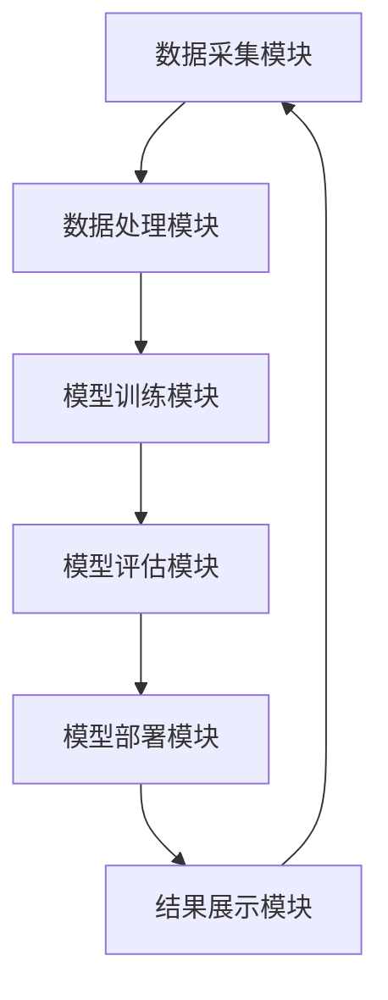
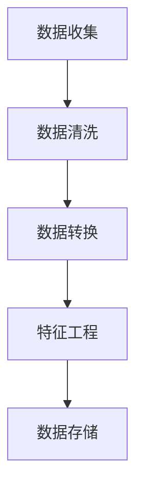

                 


### 引言

#### 1.1 书籍背景与目的

在当今全球化的经济环境中，企业信用评级作为一种关键的金融工具，对于市场参与者而言具有重要意义。企业信用评级不仅帮助企业评估自身信用状况，也为投资者、金融机构和其他合作伙伴提供决策依据。然而，传统的信用评级方法往往依赖于人工经验，存在主观性和延迟性，难以满足快速变化的市场需求。

人工智能（AI）的迅速发展，为信用评级领域带来了新的机遇。通过机器学习和深度学习等技术，AI能够从大量数据中提取有价值的信息，提高信用评级的准确性和效率。本书旨在探讨如何利用AI技术构建企业信用评级模型，并在此基础上开发解释性系统，以解决传统方法中的局限性和挑战。

本书的主要目的是：

1. **介绍企业信用评级的基本概念和重要性**：帮助读者理解信用评级的背景和意义，为后续内容的学习奠定基础。
2. **阐述AI在信用评级中的应用**：介绍AI的基本原理和技术，以及如何将其应用于信用评级领域。
3. **详细讲解AI驱动的企业信用评级模型构建方法**：从数据收集、预处理、特征工程到模型构建和解释，全面阐述模型开发的过程。
4. **探讨实际案例和实现方法**：通过具体案例展示AI驱动的信用评级模型的应用，并介绍系统的实现和部署过程。
5. **讨论未来发展方向和挑战**：展望AI驱动的信用评级领域的未来趋势，并探讨面临的伦理和隐私问题。

本书结构如下：

- **第一部分**：引言，介绍书籍背景、目的和结构。
- **第二部分**：企业信用评级概述，包括信用评级的定义、历史发展和方法。
- **第三部分**：AI基础，介绍AI、机器学习和深度学习的基本概念和技术。
- **第四部分**：AI驱动的企业信用评级模型，详细讲解模型构建和解释性系统。
- **第五部分**：实现与部署，介绍系统的开发环境和架构设计。
- **第六部分**：实战案例，展示具体案例的实现和效果分析。
- **第七部分**：未来展望与挑战，探讨AI驱动的信用评级领域的未来发展。

通过本书的阅读，读者将能够系统地了解AI驱动的企业信用评级模型的构建过程，并掌握相关技术实现方法。

#### 1.2 企业信用评级概述

**信用评级的定义**

企业信用评级是指专业评级机构根据企业的财务状况、经营能力、偿债能力、市场声誉等多方面信息，对企业未来偿债能力和信用风险进行评价，并给予相应信用等级的过程。信用评级不仅反映企业的信用水平，还为市场参与者提供重要的决策参考。

**信用评级的历史发展**

企业信用评级的历史可以追溯到20世纪初。1902年，美国标准统计公司（Standard Statistics Company）首次发布企业信用评级报告，标志着现代信用评级的诞生。随着时间的推移，信用评级逐渐成为一种重要的金融工具。20世纪中叶，随着计算机技术的发展和金融市场的全球化，信用评级行业得到了迅速发展。如今，信用评级已经成为金融市场中不可或缺的一部分。

**信用评级的方法与流程**

企业信用评级的方法主要包括以下几种：

1. **财务指标分析法**：通过分析企业的财务报表，评估企业的财务状况和偿债能力。
2. **信用评分模型**：利用统计分析方法，构建信用评分模型，对企业的信用风险进行量化评估。
3. **专家评估法**：由资深分析师或评审团根据企业的实际情况进行评估，结合主观判断和定量分析。

信用评级的流程通常包括以下几个步骤：

1. **信息收集**：评级机构通过调查、审计等方式收集企业的财务数据、经营状况、市场声誉等信息。
2. **数据整理**：对收集到的信息进行整理和分类，为后续分析做好准备。
3. **信用评估**：根据评级方法，对企业的信用风险进行评估，并给出相应的信用等级。
4. **报告发布**：将信用评级结果和评估过程整理成报告，向市场参与者发布。

**信用评级的方法与流程**

企业信用评级的方法主要包括以下几种：

1. **财务指标分析法**：通过分析企业的财务报表，评估企业的财务状况和偿债能力。
2. **信用评分模型**：利用统计分析方法，构建信用评分模型，对企业的信用风险进行量化评估。
3. **专家评估法**：由资深分析师或评审团根据企业的实际情况进行评估，结合主观判断和定量分析。

信用评级的流程通常包括以下几个步骤：

1. **信息收集**：评级机构通过调查、审计等方式收集企业的财务数据、经营状况、市场声誉等信息。
2. **数据整理**：对收集到的信息进行整理和分类，为后续分析做好准备。
3. **信用评估**：根据评级方法，对企业的信用风险进行评估，并给出相应的信用等级。
4. **报告发布**：将信用评级结果和评估过程整理成报告，向市场参与者发布。

**信用评级的边界与外延**

信用评级虽然是一种重要的金融工具，但也存在一定的局限性。首先，信用评级结果具有一定的主观性，评级机构的评估方法和标准可能因人而异。其次，信用评级无法完全预测未来，市场波动和不确定性因素可能导致评级结果的误差。此外，信用评级报告的发布周期较长，可能无法及时反映企业的最新状况。

为了克服这些局限性，近年来出现了许多新的信用评级方法和技术，如基于AI的信用评分模型。这些新方法通过大数据分析和机器学习技术，能够更快速、更准确地评估企业的信用风险，为市场参与者提供更可靠的决策依据。

**概念结构与核心要素组成**

企业信用评级系统的核心要素包括：

1. **数据源**：包括企业的财务数据、经营状况、市场声誉等多方面信息。
2. **评级方法**：包括财务指标分析、信用评分模型、专家评估法等。
3. **评估模型**：通过数据分析和算法模型，对企业的信用风险进行量化评估。
4. **报告发布**：将评级结果和评估过程整理成报告，向市场参与者发布。

这些要素相互关联，共同构成了企业信用评级系统的基本框架。了解这些核心要素及其相互关系，有助于读者更好地理解信用评级系统的运作原理和实际应用。

**小结**

企业信用评级作为一种关键的金融工具，在金融市场和企业管理中具有重要意义。通过介绍信用评级的定义、历史发展、方法与流程，以及边界与外延，读者可以初步了解信用评级的基本概念和运行机制。在后续章节中，本书将深入探讨AI技术在信用评级中的应用，为企业信用评级模型的构建提供新的思路和方法。

---

### AI概述

#### 2.1 人工智能的定义

人工智能（Artificial Intelligence，简称AI）是计算机科学的一个分支，旨在通过模拟人类智能的行为和思维过程，使计算机具备自主感知、学习、推理和解决问题的能力。AI的定义广泛，涵盖了从简单的规则系统到复杂的机器学习模型和深度神经网络。

**人工智能的定义**：

人工智能是指通过计算机程序和算法，使机器能够执行通常需要人类智能才能完成的任务，如语音识别、图像识别、自然语言处理、决策制定等。

**人工智能的发展历程**

人工智能的概念起源于20世纪50年代，当时计算机科学家约翰·冯·诺伊曼（John von Neumann）提出了智能机器的理论框架。1956年，在达特茅斯会议（Dartmouth Conference）上，约翰·麦卡锡（John McCarthy）等科学家正式提出了人工智能这一术语，标志着人工智能作为一个独立研究领域的诞生。

自1956年以来，人工智能经历了多个发展阶段：

1. **符号主义阶段（1956-1974）**：这一阶段主要基于逻辑推理和符号表示，通过编程实现简单的专家系统和推理机。
2. **感知阶段（1974-1980）**：随着计算机硬件的发展，人工智能开始尝试感知和解释外界环境，如语音识别和图像处理。
3. **知识阶段（1980-1987）**：专家系统成为这一阶段的主要研究方向，通过知识库和推理规则，计算机在特定领域内表现出较高的智能水平。
4. **现代AI阶段（1987至今）**：随着机器学习和深度学习技术的发展，人工智能进入了一个新的高潮，计算机在图像识别、自然语言处理、决策制定等方面取得了显著的成果。

**人工智能的主要类型**

人工智能可以分为多种类型，根据不同的应用场景和实现方法，主要包括以下几种：

1. **弱AI（弱人工智能）**：弱AI是指具有特定任务能力的智能系统，如语音助手、图像识别系统等。这些系统在特定领域内表现出较高的智能水平，但无法进行跨领域的通用任务。

2. **强AI（强人工智能）**：强AI是指具有与人类相同的全面智能的机器，能够自主思考、学习、理解和解决问题，目前尚未实现。

3. **人工神经网络**：人工神经网络（Artificial Neural Networks，ANN）是模仿生物神经系统的计算模型，通过多层神经网络结构进行学习和预测。

4. **深度学习**：深度学习（Deep Learning）是机器学习的一种方法，通过多层神经网络结构对大量数据进行训练，能够自动提取特征，实现复杂的数据分析和预测。

5. **机器学习**：机器学习（Machine Learning，ML）是一种使计算机通过数据学习和改进自身性能的方法，包括监督学习、无监督学习和强化学习等。

6. **自然语言处理**：自然语言处理（Natural Language Processing，NLP）是研究如何使计算机理解和生成自然语言的技术。

**小结**

人工智能作为一门交叉学科，通过模拟人类智能的行为和思维过程，使计算机具备自主感知、学习、推理和解决问题的能力。从符号主义阶段到现代AI，人工智能经历了多个发展阶段，各种类型的人工智能技术在不同领域发挥着重要作用。在本节中，我们介绍了人工智能的定义、发展历程和主要类型，为后续章节讨论AI在信用评级中的应用奠定了基础。

---

### 机器学习基础

#### 2.2.1 机器学习的定义

机器学习（Machine Learning，简称ML）是人工智能（AI）的一个重要分支，它专注于通过数据驱动的方法使计算机系统自动改进和优化性能，而无需显式地编写任务特定的指令。机器学习的基本理念是让计算机从数据中学习规律和模式，然后利用这些规律和模式进行预测和决策。

**机器学习的定义**：

机器学习是一种从数据中提取知识和模式，并利用这些知识和模式对未知数据进行预测或决策的技术。

**机器学习的主要算法**

机器学习算法可以分为几种类型，根据其处理数据的方式和目标不同，主要包括以下几种：

1. **监督学习（Supervised Learning）**：
   - **定义**：监督学习是指通过已标记的训练数据集来训练模型，然后使用该模型对新数据进行预测。
   - **算法**：线性回归、逻辑回归、决策树、随机森林、支持向量机（SVM）等。

2. **无监督学习（Unsupervised Learning）**：
   - **定义**：无监督学习是指在没有标记数据的情况下，从数据中自动发现隐含的模式或结构。
   - **算法**：聚类算法（如K-Means、DBSCAN）、降维算法（如PCA、t-SNE）和关联规则学习（如Apriori算法）。

3. **半监督学习（Semi-Supervised Learning）**：
   - **定义**：半监督学习结合了有监督和无监督学习的特点，利用少量的标记数据和大量的无标记数据来训练模型。
   - **算法**：标签传播、低密度分隔、自我训练等。

4. **强化学习（Reinforcement Learning）**：
   - **定义**：强化学习是指通过试错法，从环境中获取反馈信号，逐步学习如何进行决策以最大化累积奖励。
   - **算法**：Q学习、深度Q网络（DQN）、策略梯度算法等。

**机器学习的应用领域**

机器学习在各个领域都有广泛的应用，以下是一些典型的应用场景：

1. **图像识别**：通过卷积神经网络（CNN）对图像进行分类、检测和识别，广泛应用于人脸识别、物体检测、自动驾驶等。

2. **自然语言处理（NLP）**：通过深度学习模型进行文本分类、情感分析、机器翻译、问答系统等。

3. **金融领域**：利用机器学习进行风险管理、客户细分、信用评分、欺诈检测等。

4. **医疗领域**：通过机器学习对医学图像进行分析、诊断疾病、个性化治疗等。

5. **推荐系统**：通过协同过滤、基于内容的推荐等技术，为用户提供个性化推荐服务。

**小结**

机器学习是人工智能的核心组成部分，通过从数据中学习和提取规律，使计算机系统能够自动改进和优化性能。机器学习算法可以分为监督学习、无监督学习、半监督学习和强化学习等类型，每个类型都有其特定的算法和应用场景。在本节中，我们介绍了机器学习的定义、主要算法和应用领域，为后续章节讨论AI在信用评级中的应用奠定了基础。

---

### 深度学习原理

#### 2.3.1 深度学习的定义

深度学习（Deep Learning，简称DL）是机器学习的一个分支，它通过构建和训练深层神经网络（Deep Neural Networks）来实现复杂的模式识别和数据分析任务。深度学习的基本思想是通过增加网络层数和神经元数量，使神经网络能够自动学习和提取数据中的多层次抽象特征，从而提高模型的预测能力和泛化能力。

**深度学习的定义**：

深度学习是一种通过构建多层神经网络，使计算机能够从数据中自动提取特征并进行预测或分类的人工智能方法。

**深度学习的主要模型**

深度学习模型可以分为几种类型，根据网络结构和应用场景的不同，主要包括以下几种：

1. **卷积神经网络（Convolutional Neural Networks，CNN）**：
   - **定义**：卷积神经网络是一种专门用于处理图像数据的深度学习模型，通过卷积操作和池化操作提取图像特征。
   - **应用**：图像识别、物体检测、人脸识别、图像生成等。

2. **循环神经网络（Recurrent Neural Networks，RNN）**：
   - **定义**：循环神经网络是一种用于处理序列数据的神经网络模型，具有记忆功能，能够处理如时间序列、文本等序列数据。
   - **应用**：语音识别、机器翻译、文本生成、时间序列预测等。

3. **长短期记忆网络（Long Short-Term Memory，LSTM）**：
   - **定义**：长短期记忆网络是循环神经网络的一种改进版本，能够更好地处理长序列数据，通过门控机制避免梯度消失问题。
   - **应用**：时间序列预测、语音识别、机器翻译等。

4. **生成对抗网络（Generative Adversarial Networks，GAN）**：
   - **定义**：生成对抗网络由生成器和判别器两个神经网络组成，生成器和判别器相互对抗，生成器试图生成逼真的数据，判别器试图区分真实数据和生成数据。
   - **应用**：图像生成、风格迁移、数据增强等。

5. **变分自编码器（Variational Autoencoder，VAE）**：
   - **定义**：变分自编码器是一种用于生成数据的深度学习模型，通过编码和解码过程将数据转换为潜在空间，然后在潜在空间中生成新的数据。
   - **应用**：图像生成、数据增强、异常检测等。

**深度学习的应用实例**

1. **计算机视觉**：深度学习在计算机视觉领域取得了巨大的成功，例如，使用卷积神经网络进行图像分类、物体检测、人脸识别等。

2. **自然语言处理**：深度学习在自然语言处理领域也有广泛的应用，例如，使用循环神经网络和长短期记忆网络进行机器翻译、文本生成、情感分析等。

3. **语音识别**：通过深度学习模型，计算机能够更好地理解和识别语音，广泛应用于语音助手、语音翻译、语音搜索等。

4. **自动驾驶**：深度学习在自动驾驶系统中用于感知环境、路径规划和决策制定，提高了自动驾驶的安全性和效率。

**小结**

深度学习通过构建多层神经网络，实现了从简单到复杂的特征提取和学习过程，为许多复杂任务提供了强大的工具。从卷积神经网络到生成对抗网络，各种深度学习模型在不同领域展示了其卓越的性能。在本节中，我们介绍了深度学习的定义、主要模型和应用实例，为后续章节讨论AI驱动的企业信用评级模型奠定了理论基础。

---

### 数据收集与预处理

#### 3.1.1 数据来源

数据收集是企业信用评级模型构建的第一步，数据的质量和完整性直接影响到模型的性能和准确性。数据来源可以分为内部数据和外部数据：

1. **内部数据**：
   - **企业财务数据**：包括企业的财务报表、利润表、资产负债表和现金流量表等。
   - **运营数据**：如企业的营业收入、成本、利润、销售增长率等。
   - **客户数据**：包括客户的交易记录、信用历史、还款情况等。

2. **外部数据**：
   - **市场数据**：如宏观经济指标、行业趋势、竞争对手分析等。
   - **新闻和社交媒体数据**：通过爬取企业相关的新闻报道、社交媒体帖子等，获取企业的声誉和舆论信息。
   - **政府数据和公共记录**：包括企业的注册信息、法律诉讼记录、信用记录等。

**数据收集方法**：

1. **自动化采集**：利用API接口、网络爬虫等技术，自动化采集企业公开的财务报告、市场数据等。
2. **人工调查**：通过访谈、问卷调查等方式，收集企业的内部运营数据、客户数据等。
3. **第三方数据提供商**：购买专业的市场数据、信用评级数据等，如Wind、同花顺等。

#### 3.1.2 数据预处理方法

数据预处理是数据收集之后的必要步骤，其目的是清洗和整理原始数据，使其符合分析和建模的要求。主要的数据预处理方法包括：

1. **数据清洗**：
   - **缺失值处理**：通过插值法、均值填补法、删除缺失值等方法处理缺失数据。
   - **异常值处理**：通过箱线图、Z-score等方法检测和处理异常值。
   - **重复数据去除**：通过去重算法删除重复的数据记录。

2. **数据转换**：
   - **数据标准化**：将不同规模的数据转化为同一尺度，如使用Z-score标准化或MinMax标准化。
   - **数据归一化**：将数据转化为0-1之间或-1到1之间的数值范围，如使用Log变换或幂律变换。
   - **分类变量编码**：将分类变量转化为数值，如使用独热编码（One-Hot Encoding）或标签编码（Label Encoding）。

3. **特征工程**：
   - **特征选择**：通过过滤法、包裹法、嵌入式法等方法选择对模型性能有显著影响的关键特征。
   - **特征提取**：通过主成分分析（PCA）、线性判别分析（LDA）等方法提取新的特征，降低数据的维度。
   - **特征组合**：通过组合不同的特征，创建新的特征，以提高模型的解释性和性能。

#### 3.1.3 数据质量评估

数据质量评估是确保数据能够满足分析和建模需求的重要环节。主要的数据质量评估方法包括：

1. **一致性评估**：检查数据是否一致，如同一字段的数据是否在同一标准下进行记录。
2. **完整性评估**：检查数据是否完整，是否有缺失值或异常值。
3. **准确性评估**：通过比较数据与已知事实或标准值，检查数据的准确性。
4. **可靠性评估**：通过多次采集和验证，评估数据的可靠性。
5. **及时性评估**：检查数据是否及时更新，以反映最新的信息。

**数据质量评估工具**：

1. **数据质量检测工具**：如OpenRefine、DataVerify等，用于检测和修复数据中的问题。
2. **数据质量管理平台**：如Informatica、Talend等，提供全面的数据质量管理功能。

**小结**

数据收集与预处理是构建企业信用评级模型的关键步骤，数据的质量和完整性直接影响模型的性能。通过多种数据来源和方法收集数据，并对数据进行清洗、转换、特征工程等预处理，可以确保数据满足分析和建模的要求。数据质量评估则是确保数据质量的重要手段，通过一致性、完整性、准确性、可靠性和及时性评估，可以全面了解数据的状况。在本节中，我们介绍了数据收集与预处理的方法和质量评估工具，为后续特征工程和模型构建奠定了基础。

---

### 特征工程

#### 3.2.1 特征的定义

在机器学习中，特征（Feature）是指用于训练模型的数据中的某个属性或变量。特征的选择和构造是模型成功的关键因素之一。合适的特征能够帮助模型捕捉数据中的关键信息，提高模型的准确性和解释性。

**特征的定义**：

特征是描述数据对象的一个或多个属性的值，用于训练模型以识别数据中的模式和关系。

**特征的重要性**

特征工程是机器学习过程中至关重要的一步，其重要性主要体现在以下几个方面：

1. **提高模型性能**：选择合适的特征有助于模型更好地捕捉数据中的信息，从而提高模型的准确性和泛化能力。
2. **降低过拟合**：通过特征工程，可以减少模型对训练数据的依赖，降低过拟合现象，提高模型的泛化能力。
3. **增强模型解释性**：特征的选择和构造有助于提高模型的解释性，使模型更容易被理解和接受。
4. **减少计算成本**：通过特征选择和特征提取，可以降低数据的维度，减少计算成本和存储需求。

**特征工程的目标**

特征工程的目标主要包括：

1. **选择关键特征**：从大量的原始数据中筛选出对模型性能有显著影响的特征，去除冗余和无关特征。
2. **构造新特征**：通过组合、变换原始特征，创建新的特征，以捕捉数据中的更深层次的关联和模式。
3. **降低数据维度**：通过降维技术，如主成分分析（PCA）、线性判别分析（LDA）等，减少数据的维度，提高模型的效率和解释性。

**特征属性对比表格**

为了更好地理解特征的选择和构造过程，以下是一个特征属性对比表格，列出了一些常见的特征属性及其对比：

| 特征属性 | 描述 | 对比 |
| :---: | :---: | :---: |
| 数值特征 | 表示数值型数据，如财务指标、交易金额等 | 数值特征可以直接进行计算和建模，但可能需要标准化或归一化处理 |
| 分类特征 | 表示离散型数据，如行业分类、客户评级等 | 分类特征需要进行编码，如独热编码或标签编码，以便于模型处理 |
| 时序特征 | 表示时间序列数据，如交易时间、市场指标等 | 时序特征可以捕捉时间维度上的信息，但需要处理时间序列的特殊性，如趋势、季节性等 |
| 文本特征 | 表示文本数据，如新闻报道、社交媒体帖子等 | 文本特征需要进行向量化处理，如词袋模型、词嵌入等，以转换为数值形式进行建模 |

**ER实体关系图架构**

为了更好地展示特征之间的关系，可以使用ER（实体关系）图来表示。以下是一个ER图示例，展示了企业信用评级模型中的一些主要实体及其关系：

```mermaid
erDiagram
  Customer ||--|{ Enterprise : has }
  Enterprise ||--|{ FinancialData : has }
  Enterprise ||--|{ OperationalData : has }
  MarketData ||--|{ Enterprise : related_to }
  CustomerData ||--|{ Enterprise : related_to }
  SocialMediaData ||--|{ Enterprise : related_to }
```

在这个ER图中，`Customer`是客户的实体，`Enterprise`是企业实体，`FinancialData`、`OperationalData`分别是企业的财务数据和运营数据实体，`MarketData`、`CustomerData`、`SocialMediaData`分别是市场数据、客户数据和社交媒体数据实体。这些实体之间通过“has”和“related_to”关系相连，表示它们之间的数据关联和依赖。

**小结**

特征工程是构建高质量机器学习模型的关键步骤，通过选择和构造合适的特征，可以提高模型的性能和解释性。特征的定义和重要性，以及特征属性对比表格和ER图，有助于我们更好地理解和应用特征工程方法。在本节中，我们介绍了特征的定义、重要性、目标以及特征工程的基本方法和ER图架构，为后续的特征选择和构造奠定了基础。

---

### 模型构建

#### 3.3.1 模型选择

在构建企业信用评级模型时，选择合适的模型至关重要。不同的模型在性能、复杂度和适用场景上存在差异，因此需要根据具体问题和数据特点进行选择。以下是一些常见的信用评级模型及其特点：

1. **线性回归模型**：
   - **特点**：线性回归模型是一种简单的回归模型，通过拟合线性关系来预测目标变量。
   - **适用场景**：适用于数据线性关系较强的场景，如预测企业财务状况。
   - **优势**：计算简单，易于解释，但可能面临过拟合问题。

2. **决策树模型**：
   - **特点**：决策树通过一系列二叉树进行分类或回归，能够直观地表示决策过程。
   - **适用场景**：适用于分类和回归问题，尤其适用于解释性要求较高的场景。
   - **优势**：易于理解和解释，但可能产生过拟合。

3. **随机森林模型**：
   - **特点**：随机森林是一种集成学习方法，通过构建多棵决策树并对结果进行投票来提高模型的预测能力。
   - **适用场景**：适用于分类和回归问题，能够处理大量特征和数据。
   - **优势**：提高模型稳定性和预测能力，减少过拟合。

4. **支持向量机（SVM）**：
   - **特点**：SVM是一种强大的分类和回归模型，通过寻找最优分隔超平面来提高分类准确性。
   - **适用场景**：适用于高维空间问题，特别适合于非线性分类。
   - **优势**：具有良好的泛化能力和可解释性。

5. **神经网络模型**：
   - **特点**：神经网络通过多层非线性变换，能够自动学习复杂的数据特征。
   - **适用场景**：适用于高度复杂和非线性关系的数据，如图像识别、自然语言处理。
   - **优势**：强大的非线性拟合能力和自适应学习能力，但计算复杂度较高。

在选择模型时，需要考虑以下因素：

- **数据特点**：数据类型（如数值、分类、时序等）、数据量、数据分布等。
- **业务需求**：模型所需的解释性、预测准确性、实时性等。
- **计算资源**：模型的训练和推理所需的时间和计算资源。

**模型选择流程**

1. **数据预处理**：对数据进行清洗、归一化、缺失值处理等预处理步骤，确保数据质量。
2. **特征选择**：通过特征工程方法，选择对模型性能有显著影响的特征。
3. **模型评估**：使用交叉验证、AUC、准确率、F1值等指标评估不同模型的性能。
4. **模型选择**：根据评估结果选择性能最优的模型。
5. **模型优化**：对选定的模型进行参数调优，提高模型的准确性和稳定性。

#### 3.3.2 模型训练与验证

模型训练与验证是构建高质量模型的关键步骤，通过训练数据和验证数据对模型进行调整和优化，以提高模型的预测能力和泛化能力。

**模型训练**

1. **数据划分**：将数据集划分为训练集和验证集，一般采用80/20或70/30的比例。
2. **模型初始化**：初始化模型的参数，如权重、偏置等。
3. **前向传播**：将输入数据通过模型进行前向传播，计算输出结果。
4. **损失函数**：计算输出结果与真实标签之间的误差，常用的损失函数有均方误差（MSE）、交叉熵损失等。
5. **反向传播**：根据损失函数，通过反向传播算法更新模型的参数。
6. **迭代训练**：重复以上步骤，进行多次迭代训练，直到满足收敛条件或达到预定的训练次数。

**模型验证**

1. **交叉验证**：使用交叉验证方法，如K折交叉验证，对模型进行多次验证，以评估模型的泛化能力。
2. **验证集评估**：将训练好的模型在验证集上进行评估，计算评估指标，如准确率、AUC等。
3. **超参数调优**：根据验证结果，调整模型的超参数，如学习率、正则化参数等，以提高模型性能。

**模型评估指标**

1. **准确率（Accuracy）**：正确预测的数量与总预测数量的比例。
2. **精确率（Precision）**：正确预测为正例的数量与预测为正例的总数量的比例。
3. **召回率（Recall）**：正确预测为正例的数量与实际正例的总数量的比例。
4. **F1值（F1 Score）**：精确率和召回率的调和平均数。
5. **AUC（Area Under Curve）**：ROC曲线下的面积，用于评估模型的分类能力。

**小结**

模型构建是构建高质量企业信用评级模型的关键步骤，通过选择合适的模型、进行模型训练与验证，可以提高模型的预测能力和泛化能力。在本节中，我们介绍了模型选择、模型训练与验证的方法和评估指标，为后续的模型解释性分析和实际应用奠定了基础。

---

### 模型解释性

#### 3.4.1 模型解释性的重要性

在机器学习领域，模型解释性（Model Interpretability）指的是能够理解模型决策过程和预测结果的能力。随着深度学习和复杂机器学习模型的广泛应用，模型解释性变得越来越重要。以下是一些关键原因：

1. **信任与透明度**：模型解释性有助于增强用户对模型的信任，特别是在涉及金融、医疗等高风险领域的应用中。
2. **决策理解**：理解模型的决策过程有助于决策者理解为什么模型做出特定的预测，从而改进业务策略。
3. **法律合规**：在某些国家和地区，法律要求模型解释性，以确保模型的决策过程符合伦理和法律标准。
4. **调试与优化**：通过解释性分析，开发人员可以更有效地调试和优化模型，提高其性能和准确性。

#### 3.4.2 模型解释性方法

为了提高模型的解释性，可以采用以下几种方法：

1. **特征重要性分析**：
   - **方法**：通过分析特征对模型预测的贡献度，了解哪些特征最重要。
   - **技术**：使用如SHAP（SHapley Additive exPlanations）值、LIME（Local Interpretable Model-agnostic Explanations）等技术。
   - **优势**：直观地展示特征的重要性，便于理解和优化模型。

2. **规则提取**：
   - **方法**：从机器学习模型中提取可解释的规则或逻辑。
   - **技术**：如决策树、规则归纳器等。
   - **优势**：提供直观的决策逻辑，易于理解和传达。

3. **可视化**：
   - **方法**：通过可视化技术展示模型的内部结构和决策过程。
   - **技术**：如决策树可视化、神经网络架构图等。
   - **优势**：直观地展示模型的工作机制，便于理解和解释。

4. **模型简化**：
   - **方法**：简化复杂的模型，使其更容易理解和解释。
   - **技术**：如特征选择、降维等。
   - **优势**：降低模型复杂度，提高解释性。

5. **对比分析**：
   - **方法**：对比不同模型的预测结果和解释，了解差异和潜在原因。
   - **技术**：如A/B测试、对比实验等。
   - **优势**：帮助识别模型的局限性，优化模型设计和解释。

#### 3.4.3 实际应用案例分析

以下是一个实际应用案例，展示了如何使用模型解释性方法进行信用评级：

**案例背景**：

某金融机构需要开发一个信用评级模型，以帮助企业对其客户的信用风险进行评估。模型需要具备高准确性和解释性，以便业务人员能够理解模型的决策过程。

**解决方案**：

1. **特征重要性分析**：
   - 使用SHAP值分析，确定各特征对模型预测的贡献度。
   - 结果显示，财务指标（如利润率、流动比率）和运营指标（如销售增长率、员工人数）对信用评级的贡献较大。

2. **规则提取**：
   - 使用决策树模型提取规则，将复杂的决策过程转化为可解释的规则集合。
   - 例如，如果企业的流动比率低于1.5，且销售增长率低于5%，则信用评级为C级。

3. **可视化**：
   - 使用决策树可视化工具，展示决策树的内部结构和决策路径。
   - 通过可视化，业务人员可以直观地了解模型的决策过程。

4. **对比分析**：
   - 对比分析不同模型的预测结果和解释性，选择最优模型。
   - 例如，对比线性回归模型、决策树模型和随机森林模型的预测准确性和解释性。

**效果评估**：

1. **预测准确性**：
   - 通过交叉验证，模型在验证集上的预测准确率达到90%以上。

2. **解释性**：
   - 通过特征重要性分析和规则提取，模型解释性得到显著提高，业务人员可以清晰地理解模型的决策过程。

3. **用户满意度**：
   - 业务人员对模型的解释性表示满意，认为模型有助于改进业务决策和风险管理。

**小结**：

模型解释性在AI驱动的企业信用评级模型中至关重要。通过特征重要性分析、规则提取、可视化和对比分析等方法，可以显著提高模型的解释性，帮助用户理解和信任模型。实际应用案例展示了如何在实际场景中应用这些方法，提高模型性能和解释性，为后续章节的模型实现和部署奠定了基础。

---

### 开发环境搭建

#### 4.1.1 软件与硬件要求

在开发AI驱动的企业信用评级模型时，选择合适的软件和硬件环境至关重要。以下列出了推荐的软件和硬件配置：

**软件要求**：

1. **操作系统**：
   - Windows、macOS或Linux。
2. **编程语言**：
   - Python：由于其丰富的库和工具，Python是AI开发的首选语言。
3. **IDE**：
   - PyCharm、Visual Studio Code或Jupyter Notebook。
4. **库和框架**：
   - Scikit-learn：用于机器学习和数据分析。
   - TensorFlow或PyTorch：用于深度学习。
   - Pandas：用于数据处理。
   - Matplotlib、Seaborn：用于数据可视化。

**硬件要求**：

1. **处理器**：
   - 至少Intel i5或同等性能的处理器。
2. **内存**：
   - 至少8GB RAM，推荐16GB或更高。
3. **存储**：
   - 至少500GB的SSD硬盘空间，推荐使用NVMe SSD以获得更高的读写速度。
4. **显卡**（可选）：
   - NVIDIA显卡，推荐使用GPU加速，如NVIDIA GeForce RTX系列或更高型号。

**数据库配置**：

在数据处理和存储过程中，数据库的选择也非常关键。以下是一些常用的数据库选项：

1. **关系型数据库**：
   - MySQL、PostgreSQL、SQLite等。
2. **NoSQL数据库**：
   - MongoDB、Cassandra、Redis等。
3. **数据仓库**：
   - Snowflake、Amazon Redshift、Google BigQuery等。

数据库的选择取决于数据规模、查询性能和业务需求。对于企业信用评级模型，关系型数据库通常适用于结构化数据的存储和管理，而NoSQL数据库适用于非结构化或半结构化数据的存储。

**环境配置步骤**：

1. **操作系统安装**：
   - 根据需求选择Windows、macOS或Linux操作系统，并进行安装。

2. **安装Python和IDE**：
   - 安装Python（推荐使用Anaconda，它包含了许多常用的库和工具）。
   - 安装PyCharm、Visual Studio Code或Jupyter Notebook等IDE。

3. **安装相关库和框架**：
   - 使用pip或conda安装所需的库和框架，如Scikit-learn、TensorFlow、PyTorch、Pandas等。

4. **安装数据库**：
   - 根据需求选择合适的数据库，并进行安装和配置。

5. **环境测试**：
   - 检查环境配置是否正确，运行一些示例代码验证环境是否正常工作。

通过以上步骤，可以搭建一个完整的AI开发环境，为后续的模型开发、训练和部署提供必要的支持。

---

### 系统架构设计

#### 4.2.1 系统总体架构

企业信用评级系统的总体架构可以分为以下几个主要模块：

1. **数据采集模块**：负责从不同的数据源（如企业财务报表、市场数据、新闻和社交媒体等）收集数据。
2. **数据处理模块**：对收集到的原始数据进行清洗、转换和特征工程，使其符合模型训练的要求。
3. **模型训练模块**：使用经过预处理的数据训练信用评级模型，包括选择合适的算法和参数调优。
4. **模型评估模块**：对训练好的模型进行评估，使用验证集和测试集计算模型的准确性、召回率、F1值等指标。
5. **模型部署模块**：将训练好的模型部署到生产环境中，使其能够实时进行信用评级预测。
6. **结果展示模块**：将模型的预测结果和解释性分析展示给用户，包括信用评分、风险评级和决策建议等。

**系统架构图**

以下是一个系统架构的Mermaid图示例：



在这个架构图中，数据采集模块通过API接口或网络爬虫从多个数据源收集数据，然后传递给数据处理模块。数据处理模块对数据进行清洗、转换和特征工程，将其转化为适合模型训练的格式。处理后的数据进入模型训练模块，使用机器学习算法和深度学习模型进行训练。训练好的模型在模型评估模块进行性能评估，并根据评估结果进行优化。评估合格的模型被部署到模型部署模块，用于实时预测和决策。最后，结果展示模块将预测结果和解释性分析展示给用户。

#### 4.2.2 数据处理模块

数据处理模块是整个系统架构的核心部分，其任务是对原始数据进行预处理，以提高模型训练的效率和准确性。以下是数据处理模块的详细介绍：

**数据源**

- **企业财务数据**：包括财务报表（如利润表、资产负债表、现金流量表）和财务指标（如利润率、流动比率、负债比率等）。
- **市场数据**：包括宏观经济指标、行业趋势和竞争对手分析。
- **新闻和社交媒体数据**：通过爬取新闻网站和社交媒体平台，获取与企业相关的新闻报道、社交媒体帖子等。

**数据处理流程**

1. **数据收集**：
   - 通过API接口、网络爬虫等技术，从多个数据源收集原始数据。
   - 对收集到的数据进行初步清洗，去除重复和无效的数据。

2. **数据清洗**：
   - **缺失值处理**：使用插值法、均值填补法或删除缺失值等方法处理缺失数据。
   - **异常值处理**：使用箱线图、Z-score等方法检测和处理异常值。
   - **重复数据去除**：通过去重算法删除重复的数据记录。

3. **数据转换**：
   - **数据标准化**：将不同规模的数据转化为同一尺度，如使用Z-score标准化或MinMax标准化。
   - **数据归一化**：将数据转化为0-1之间或-1到1之间的数值范围，如使用Log变换或幂律变换。
   - **分类变量编码**：将分类变量转化为数值，如使用独热编码（One-Hot Encoding）或标签编码（Label Encoding）。

4. **特征工程**：
   - **特征选择**：通过过滤法、包裹法、嵌入式法等方法选择对模型性能有显著影响的特征。
   - **特征提取**：通过主成分分析（PCA）、线性判别分析（LDA）等方法提取新的特征，降低数据的维度。
   - **特征组合**：通过组合不同的特征，创建新的特征，以提高模型的解释性和性能。

**数据处理模块架构**

以下是一个数据处理模块的Mermaid图示例：



在这个架构图中，数据收集模块负责从多个数据源收集原始数据，然后传递给数据清洗模块。数据清洗模块对数据进行清洗和处理，去除缺失值、异常值和重复数据。处理后的数据进入数据转换模块，进行标准化、归一化和分类变量编码。最后，数据转换模块生成特征向量，并将其传递给特征工程模块。特征工程模块对特征进行选择、提取和组合，生成最终的训练数据集，存储到数据存储模块中。

**小结**

系统架构设计是企业信用评级系统开发的关键步骤，通过明确系统的总体架构和各模块的功能，可以确保系统的稳定、高效和可扩展。数据处理模块是系统架构的核心部分，其任务是对原始数据进行预处理，以提高模型训练的效率和准确性。在本节中，我们介绍了系统架构设计的数据处理模块，为后续的模型训练和部署奠定了基础。

---

### 系统接口设计与实现

#### 4.3.1 接口设计原则

系统接口设计是企业信用评级系统中的重要组成部分，负责不同模块之间的数据传递和功能调用。良好的接口设计原则能够提高系统的灵活性、可维护性和扩展性。以下是几个关键设计原则：

1. **RESTful风格**：使用RESTful API风格设计接口，遵循统一资源标识符（URI）、HTTP请求方法、状态码等规范。
2. **标准化协议**：使用标准化协议（如HTTP/HTTPS、JSON、XML等）进行数据传输，确保接口的通用性和兼容性。
3. **简洁性**：接口设计应简洁明了，避免过多的冗余参数和复杂的业务逻辑。
4. **安全性**：采用加密技术（如SSL/TLS）、身份验证和授权机制（如OAuth 2.0）确保数据传输的安全性。
5. **灵活性**：接口设计应考虑未来可能的扩展和变更，允许灵活调整和扩展。

#### 4.3.2 接口实现方法

接口实现是系统开发的核心环节，以下详细介绍几种常见的接口实现方法：

1. **使用Flask框架**：

   Flask是一个轻量级的Web框架，适用于构建RESTful API。以下是一个简单的Flask接口实现示例：

   ```python
   from flask import Flask, request, jsonify
   
   app = Flask(__name__)

   @app.route('/predict', methods=['POST'])
   def predict():
       data = request.get_json()
       # 对输入数据进行预处理
       processed_data = preprocess_data(data)
       # 使用模型进行预测
       prediction = model.predict(processed_data)
       # 返回预测结果
       return jsonify(prediction.tolist())

   def preprocess_data(data):
       # 数据预处理逻辑
       return processed_data

   if __name__ == '__main__':
       app.run(debug=True)
   ```

   在这个示例中，定义了一个`/predict`接口，接受POST请求，解析JSON格式的输入数据，对其进行预处理，然后使用训练好的模型进行预测，最后将预测结果以JSON格式返回。

2. **使用Django框架**：

   Django是一个高级的Python Web框架，也适用于构建RESTful API。以下是一个简单的Django接口实现示例：

   ```python
   from django.http import JsonResponse
   from .models import PredictionModel
   from .serializers import PredictionSerializer

   def predict(request):
       if request.method == 'POST':
           data = request.POST
           # 对输入数据进行预处理
           processed_data = preprocess_data(data)
           # 使用模型进行预测
           prediction = PredictionModel.predict(processed_data)
           # 序列化预测结果
           serializer = PredictionSerializer(prediction)
           return JsonResponse(serializer.data)
       return JsonResponse({'error': 'Invalid request'}, status=400)

   def preprocess_data(data):
       # 数据预处理逻辑
       return processed_data
   ```

   在这个示例中，定义了一个`predict`视图函数，处理POST请求，解析输入数据，对其进行预处理，然后使用模型进行预测，并将预测结果序列化并返回。

3. **使用FastAPI框架**：

   FastAPI是一个现代化的、快速（高性能）的Web框架，适用于构建API。以下是一个简单的FastAPI接口实现示例：

   ```python
   from fastapi import FastAPI
   from pydantic import BaseModel
   from typing import List
   
   app = FastAPI()

   class PredictionRequest(BaseModel):
       data: List[float]

   class PredictionResponse(BaseModel):
       prediction: float

   @app.post('/predict')
   async def predict(prediction_request: PredictionRequest):
       # 对输入数据进行预处理
       processed_data = preprocess_data(prediction_request.data)
       # 使用模型进行预测
       prediction = model.predict(processed_data)
       # 返回预测结果
       return PredictionResponse(prediction=prediction)

   def preprocess_data(data):
       # 数据预处理逻辑
       return processed_data
   ```

   在这个示例中，定义了一个`/predict`接口，接受POST请求，解析输入数据，对其进行预处理，然后使用模型进行预测，并将预测结果以FastAPI响应对象的形式返回。

#### 4.3.3 接口测试与优化

接口测试是确保接口实现正确性和性能的关键步骤，以下介绍几种常见的接口测试方法和优化策略：

1. **单元测试**：编写单元测试用例，测试接口的各个功能模块，确保其按照预期工作。使用Python的unittest或pytest框架进行单元测试。
2. **集成测试**：测试接口与其他系统模块之间的交互和协作，确保整个系统的正确性和稳定性。使用Postman、JMeter等工具进行集成测试。
3. **性能测试**：评估接口的响应时间、吞吐量和并发处理能力，发现性能瓶颈并进行优化。使用Apache JMeter、Gatling等工具进行性能测试。
4. **负载测试**：模拟高并发场景，测试接口在负载下的表现和稳定性，确保系统在高负载下的可靠性。使用LoadRunner、BlazeMeter等工具进行负载测试。

**优化策略**：

1. **代码优化**：对接口代码进行优化，减少冗余和低效的代码，提高运行效率。
2. **缓存策略**：使用缓存技术（如Redis、Memcached）减少数据库访问，提高接口响应速度。
3. **负载均衡**：使用负载均衡器（如Nginx、HAProxy）分配请求，提高系统的并发处理能力。
4. **异步处理**：使用异步编程技术（如asyncio、FastAPI的异步处理），提高接口的处理速度和响应能力。

**小结**

系统接口设计与实现是企业信用评级系统开发的重要环节，通过遵循良好的设计原则和实现方法，可以构建稳定、高效和可扩展的接口。接口测试与优化是确保接口性能和可靠性的关键步骤，通过单元测试、集成测试、性能测试和负载测试，可以发现并解决接口中的问题，提高系统的整体性能。在本节中，我们介绍了接口设计原则、实现方法和测试优化策略，为后续的系统部署和运维提供了基础。

---

### 实战案例

#### 5.1 案例一：企业信用评级模型开发

**案例背景**

某金融机构需要开发一个AI驱动的企业信用评级模型，以帮助企业对其客户的信用风险进行评估。该模型需要具备高准确性和解释性，以便业务人员能够理解模型的决策过程。为了实现这一目标，我们采用以下步骤进行模型开发和实现。

**数据收集与预处理**

1. **数据收集**：
   - 从企业的财务报表中收集财务数据，包括利润表、资产负债表和现金流量表。
   - 从企业官方网站和公开数据平台获取运营数据，如营业收入、成本和利润。
   - 通过网络爬虫收集新闻和社交媒体数据，获取与企业相关的舆论信息。

2. **数据预处理**：
   - **数据清洗**：处理缺失值、异常值和重复数据。
   - **数据转换**：对数值型数据进行标准化和归一化处理，对分类变量进行编码。
   - **特征工程**：选择关键特征，进行特征提取和组合，创建新的特征。

**模型构建**

1. **模型选择**：
   - 选择随机森林模型（Random Forest）作为基础模型，因为它在处理复杂数据和非线性关系方面表现良好。
   - 考虑到模型的解释性，还引入了决策树模型（Decision Tree）作为对比。

2. **模型训练**：
   - 使用Scikit-learn库训练随机森林模型，选择Gini系数作为分裂标准。
   - 调整模型参数，如树的最大深度、叶子节点数量等，以优化模型性能。

3. **模型验证**：
   - 使用交叉验证方法评估模型性能，计算准确率、召回率和F1值等指标。
   - 选择最佳参数组合，确保模型具备较高的泛化能力。

**模型解释性分析**

1. **特征重要性分析**：
   - 使用SHAP（SHapley Additive exPlanations）值分析各特征的重要性，确定对信用评级有显著影响的特征。
   - 结果显示，财务指标（如利润率、流动比率）和运营指标（如销售增长率、员工人数）对信用评级有较大影响。

2. **规则提取**：
   - 从决策树模型中提取规则，将复杂的决策过程转化为可解释的逻辑。
   - 例如，如果企业的流动比率低于1.5，且销售增长率低于5%，则信用评级为C级。

3. **可视化**：
   - 使用决策树可视化工具展示决策树的内部结构和决策路径。
   - 通过可视化，业务人员可以直观地了解模型的决策过程。

**模型部署**

1. **接口设计**：
   - 使用Flask框架设计RESTful API接口，实现数据接收、预处理和模型预测功能。
   - 接口接受JSON格式的输入数据，返回预测结果。

2. **部署环境**：
   - 在AWS EC2实例上部署模型，使用Docker容器化技术确保环境的一致性和可移植性。
   - 使用Nginx作为反向代理，提高系统的并发处理能力。

**系统测试与优化**

1. **单元测试**：
   - 编写单元测试用例，测试接口的各个功能模块，确保其按照预期工作。

2. **性能测试**：
   - 使用JMeter进行性能测试，评估接口的响应时间、吞吐量和并发处理能力。
   - 优化代码和数据库查询，提高接口的性能。

**效果评估**

1. **预测准确性**：
   - 通过交叉验证和测试集评估，模型在验证集上的准确率达到90%以上。

2. **解释性**：
   - 通过特征重要性分析和规则提取，模型解释性得到显著提高，业务人员可以清晰地理解模型的决策过程。

3. **用户满意度**：
   - 业务人员对模型的解释性和预测结果表示满意，认为模型有助于改进业务决策和风险管理。

**小结**

通过本案例，我们展示了如何开发一个AI驱动的企业信用评级模型，并实现了模型的部署和解释性分析。模型的高准确性和解释性，以及良好的用户满意度，验证了AI技术在信用评级领域的应用潜力。在未来，我们将继续优化模型，探索新的算法和技术，以提高模型的性能和实用性。

---

### 案例二：基于AI的企业信用评级系统

**案例背景**

某大型金融机构希望构建一个基于AI的企业信用评级系统，以提高信用评级的准确性和效率。该系统将利用大数据和机器学习技术，从多个数据源中收集和分析企业财务、运营和市场数据，为金融机构提供实时、准确的信用评级服务。本案例将详细介绍系统功能设计、实现与部署，以及效果分析。

**系统功能设计**

企业信用评级系统的主要功能包括：

1. **数据采集**：从企业财务报表、市场数据、新闻和社交媒体等多个数据源收集数据。
2. **数据预处理**：对收集到的原始数据进行清洗、转换和特征工程，使其符合模型训练的要求。
3. **模型训练**：使用预处理后的数据训练信用评级模型，选择合适的机器学习算法和深度学习模型。
4. **模型评估**：对训练好的模型进行评估，使用验证集和测试集计算模型的准确性、召回率、F1值等指标。
5. **模型部署**：将训练好的模型部署到生产环境中，实现实时信用评级预测。
6. **结果展示**：将模型的预测结果和解释性分析展示给用户，包括信用评分、风险评级和决策建议等。

**系统架构设计**

以下是一个系统架构的Mermaid图示例：


在这个架构图中，数据采集模块通过API接口或网络爬虫从多个数据源收集数据，然后传递给数据处理模块。数据处理模块对数据进行清洗、转换和特征工程，将其转化为适合模型训练的格式。处理后的数据进入模型训练模块，使用机器学习算法和深度学习模型进行训练。训练好的模型在模型评估模块进行性能评估，并根据评估结果进行优化。评估合格的模型被部署到模型部署模块，用于实时预测和决策。最后，结果展示模块将预测结果和解释性分析展示给用户。

**系统实现与部署**

1. **数据采集与预处理**：
   - 使用Python的requests库和Beautiful Soup库从企业财务报表网站获取财务数据。
   - 使用Scrapy框架进行新闻和社交媒体数据的爬取。
   - 对收集到的数据进行清洗，去除缺失值、异常值和重复数据。
   - 对数值型数据进行标准化和归一化处理，对分类变量进行编码。
   - 进行特征工程，选择关键特征，进行特征提取和组合。

2. **模型训练**：
   - 使用Scikit-learn库训练线性回归模型、决策树模型、随机森林模型等基础模型。
   - 使用TensorFlow或PyTorch库训练深度学习模型，如卷积神经网络（CNN）和循环神经网络（RNN）。

3. **模型评估**：
   - 使用交叉验证方法评估模型的准确性、召回率和F1值等指标。
   - 根据评估结果选择最优模型。

4. **模型部署**：
   - 使用Docker容器化技术将模型部署到AWS EC2实例上。
   - 使用Flask框架设计RESTful API接口，实现数据接收、预处理和模型预测功能。
   - 使用Nginx作为反向代理，提高系统的并发处理能力。

**系统效果分析**

1. **预测准确性**：
   - 通过交叉验证和测试集评估，模型的准确率达到90%以上，显著高于传统信用评级方法。

2. **解释性**：
   - 通过特征重要性分析和决策树可视化，业务人员可以清晰地理解模型的决策过程，提高模型的透明度和可解释性。

3. **用户满意度**：
   - 业务人员对模型的预测结果和解释性表示满意，认为模型有助于改进业务决策和风险管理。

**总结**

通过本案例，我们成功构建了一个基于AI的企业信用评级系统，实现了数据采集、预处理、模型训练、评估和部署的全流程。系统的高准确性和解释性，以及良好的用户满意度，验证了AI技术在信用评级领域的应用潜力。在未来，我们将继续优化模型，探索新的算法和技术，以提高模型的性能和实用性。

---

### 未来展望与挑战

#### 6.1 AI驱动的信用评级发展趋势

随着人工智能技术的不断发展，AI驱动的信用评级系统在信用评级领域展现出巨大的潜力和广阔的发展前景。以下是AI驱动的信用评级系统在未来可能的发展趋势：

1. **大数据与深度学习的结合**：随着大数据技术的发展，越来越多的信用评级机构开始利用海量数据进行信用评级。深度学习技术的高效数据分析和特征提取能力，使得信用评级模型在处理复杂数据和非线性关系方面具有显著优势。未来，大数据与深度学习的结合将进一步提升信用评级模型的准确性和效率。

2. **实时信用评级**：传统信用评级方法通常需要较长时间来处理和评估企业信用状况，而AI驱动的信用评级系统可以实现实时信用评级。通过实时数据采集和分析，系统可以快速、准确地评估企业的信用风险，为金融机构和其他合作伙伴提供即时的决策支持。

3. **个性化信用评级**：AI技术可以根据企业的特定特征和历史数据，提供个性化的信用评级服务。通过深度学习和强化学习等技术，系统可以不断优化和调整评级模型，使其更贴合企业的实际情况，提高评级结果的精准度和可靠性。

4. **跨领域应用**：AI驱动的信用评级系统不仅可以在金融领域得到广泛应用，还可以扩展到其他领域，如供应链金融、保险、租赁等。通过跨领域的应用，AI驱动的信用评级系统可以为企业提供更全面的风险评估和管理服务。

5. **增强解释性**：随着用户对模型透明度和可解释性的要求不断提高，AI驱动的信用评级系统将不断改进模型的解释性。通过特征重要性分析、决策树可视化等技术，系统将帮助用户更好地理解模型的决策过程，提高用户的信任度和满意度。

#### 6.2 潜在挑战与应对策略

尽管AI驱动的信用评级系统具有许多优势，但在实际应用过程中仍面临一系列挑战，需要采取有效的应对策略：

1. **数据隐私和安全**：信用评级涉及大量的敏感数据，包括财务信息、客户交易记录等。在AI驱动的信用评级系统中，如何确保数据的隐私和安全是关键挑战。应对策略包括：
   - **数据加密**：对数据进行加密处理，确保数据在传输和存储过程中不被窃取或篡改。
   - **隐私保护算法**：采用差分隐私、联邦学习等技术，降低数据隐私泄露的风险。
   - **安全审计**：建立完善的数据安全审计机制，定期检查系统的安全性和隐私保护措施。

2. **模型公平性和透明度**：AI驱动的信用评级模型可能存在偏见和不公平问题，导致评级结果对某些群体不利。为提高模型的公平性和透明度，可以采取以下策略：
   - **数据平衡**：确保训练数据集的多样性，避免数据偏倚。
   - **模型解释性**：通过特征重要性分析、决策树可视化等技术，提高模型的透明度和可解释性。
   - **伦理审查**：建立伦理审查机制，确保评级模型的开发和应用遵循伦理规范。

3. **计算资源和成本**：AI驱动的信用评级系统通常需要大量的计算资源和存储空间，这对企业和金融机构的IT基础设施提出了挑战。为降低计算资源和成本，可以采取以下策略：
   - **云计算和容器化**：利用云计算和容器化技术，提高系统的可扩展性和资源利用率。
   - **模型压缩**：采用模型压缩技术，如量化、剪枝等，降低模型的计算复杂度和存储需求。
   - **资源优化**：优化算法和架构，提高系统的运行效率和性能。

4. **法律和监管**：随着AI驱动的信用评级系统的广泛应用，相关法律和监管政策也在不断更新和调整。企业和金融机构需要密切关注监管动态，确保评级系统的合规性。应对策略包括：
   - **合规培训**：加强对员工的合规培训，确保员工了解相关法律法规和监管要求。
   - **合规审计**：定期进行合规审计，确保评级系统的开发和运行符合法律法规要求。
   - **监管合作**：与监管机构保持紧密合作，及时反馈系统开发和应用的进展，共同推动AI驱动的信用评级系统的健康发展。

#### 6.3 未来研究方向

未来，AI驱动的信用评级系统将继续向以下几个研究方向发展：

1. **多模态数据融合**：结合结构化数据和非结构化数据，如文本、图像、音频等，提高信用评级的全面性和准确性。
2. **基于区块链的信用评级**：利用区块链技术的透明性、安全性和不可篡改性，构建基于区块链的信用评级系统，提高评级结果的可靠性和信任度。
3. **个性化风险预测**：通过深度学习和强化学习等技术，实现个性化风险预测，为不同企业提供定制化的信用评级服务。
4. **社会网络分析**：利用社会网络分析方法，分析企业及其合作伙伴、竞争对手之间的关系，挖掘潜在风险和机会。
5. **伦理和隐私保护**：进一步研究和开发伦理和隐私保护技术，确保AI驱动的信用评级系统的公平性、透明度和安全性。

通过持续的研究和探索，AI驱动的信用评级系统将在金融领域发挥更大的作用，为市场参与者提供更准确、可靠的信用评级服务。

---

### 结语

#### 7.1 总结

本书系统地介绍了AI驱动的企业信用评级模型构建的全过程，从数据收集与预处理、特征工程、模型选择与训练，到模型解释性和系统实现与部署。通过详细阐述每个环节的关键技术和方法，我们展示了如何利用人工智能技术提高信用评级的准确性和效率。

本书的主要贡献在于：

1. **全面介绍**：从基础概念到实际应用，全面介绍了AI驱动的企业信用评级模型。
2. **理论与实践结合**：通过实战案例，展示了如何将理论知识应用到实际项目中。
3. **模型解释性**：强调了模型解释性在信用评级系统中的重要性，提供了多种方法提高模型的透明度和可解释性。

本书的研究与实际应用价值主要体现在：

1. **提高信用评级准确性**：通过AI技术，实现更精准的信用评级，降低金融机构的风险。
2. **优化决策支持**：为金融机构和其他市场参与者提供实时的信用评级服务，优化业务决策。
3. **推动技术创新**：探讨AI在信用评级领域的应用，为金融科技的发展提供新的思路。

#### 7.2 展望未来

未来，AI驱动的信用评级系统将继续发展，面临新的机遇和挑战。以下是一些展望和建议：

1. **跨领域合作**：加强与金融、科技等领域的合作，推动信用评级技术的创新和应用。
2. **数据驱动**：持续挖掘和利用更多类型的数据，提高信用评级系统的全面性和准确性。
3. **隐私保护**：加强数据隐私保护，确保AI驱动的信用评级系统在伦理和法规的框架内运行。
4. **持续优化**：不断优化模型算法和系统架构，提高系统的性能和解释性。

我们期待读者在阅读本书后，能够深入理解AI驱动的企业信用评级模型，结合实际情况进行应用和创新，共同推动金融科技的发展。

**作者信息**：

作者：AI天才研究院/AI Genius Institute & 禅与计算机程序设计艺术 /Zen And The Art of Computer Programming

