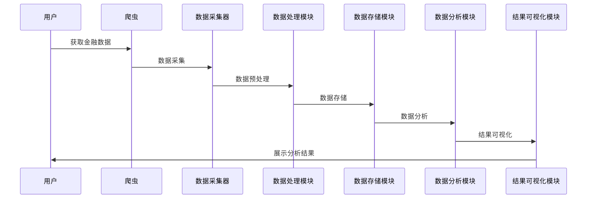

                 

# 金融数据的实时处理与分析

> 关键词：金融数据、实时处理、数据分析、流处理、机器学习

> 摘要：本文将深入探讨金融数据的实时处理与分析，从问题背景、核心概念、技术原理、系统设计与实战应用等方面进行详细阐述。通过本文的阅读，读者将了解到金融行业数据处理的现状、实时处理的意义以及如何构建一个高效、可靠的金融数据处理与分析系统。

## 第1章：金融数据的实时处理与分析概述

### 1.1 问题背景

#### 1.1.1 金融行业数据处理的现状

金融行业是一个数据密集型行业，其业务活动产生的数据量巨大且不断增长。随着金融科技的快速发展，金融数据的类型也越来越多样化，包括交易数据、客户数据、市场数据、舆情数据等。同时，金融行业的业务场景复杂，对数据处理的需求也不断提升，如实时监控、风险控制、投资决策等。然而，当前金融数据处理面临的挑战主要包括：

- 数据量庞大：金融行业每天产生的数据量达到TB甚至PB级别，对数据处理系统的性能和容量提出了极高的要求。
- 数据类型多样：金融数据包括结构化数据（如数据库记录）和非结构化数据（如文本、图像、视频等），对数据处理的兼容性和灵活性提出了挑战。
- 实时性需求强：金融市场变化迅速，需要实时处理和分析数据，以快速响应市场动态，提高业务决策的效率和准确性。

#### 1.1.2 金融数据分析的重要性

金融数据分析在金融行业中具有极其重要的地位，其价值主要体现在以下几个方面：

- 提高投资决策效率：通过分析历史数据和实时数据，可以为投资决策提供科学依据，降低投资风险，提高投资回报率。
- 增强风险管理能力：实时监测市场风险，及时识别潜在风险，制定有效的风险控制策略。
- 改善客户服务：通过对客户数据的分析，可以更好地了解客户需求，提供个性化服务，提升客户满意度和忠诚度。
- 发现市场机会：通过分析市场数据，可以发现潜在的市场机会，制定有效的业务策略，抢占市场先机。

#### 1.1.3 实时处理的意义

实时处理在金融行业中具有重要意义，主要体现在以下几个方面：

- 提高市场竞争力：实时处理能够快速响应市场变化，为业务决策提供及时、准确的数据支持，帮助企业抢占市场先机。
- 降低操作风险：实时监控交易数据，可以及时发现异常交易，降低操作风险，保障金融市场的稳定运行。
- 提升用户体验：实时处理可以提供更快的响应速度和更优质的服务，提升客户体验，增强客户满意度。
- 改善决策效率：实时处理使得数据分析师能够更加实时地了解业务状况，优化业务流程，提高决策效率。

### 1.2 核心概念

#### 1.2.1 实时数据处理

实时数据处理是指对数据流进行实时采集、处理和分析，以实现对实时业务场景的快速响应。实时数据处理具有以下特点：

- 实时性：能够在短时间内对大量数据进行处理，实现数据的实时性。
- 高效性：通过分布式架构和并行处理技术，提高数据处理效率。
- 低延迟：通过优化算法和数据传输方式，降低数据处理的延迟。

#### 1.2.2 数据分析

数据分析是指从大量数据中提取有价值信息的过程，旨在为业务决策提供数据支持。数据分析包括以下类型：

- 统计分析：通过统计方法对数据进行描述和分析，提取数据的特征和趋势。
- 机器学习：利用机器学习算法，从数据中学习规律和模式，实现对数据的预测和分类。
- 数据挖掘：通过深度挖掘数据，发现数据中隐藏的规律和关联，为业务提供洞察。

#### 1.2.3 金融数据的特征

金融数据具有以下特征：

- 多样性：金融数据包括文本、图像、数值等多种类型，具有高度的多样性。
- 复杂性：金融数据之间存在复杂的关联和依赖关系，需要深入挖掘和分析。
- 时变性：金融市场数据随时间不断变化，具有明显的时变性。

### 1.3 金融数据的实时处理与分析框架

#### 1.3.1 数据采集

数据采集是金融数据实时处理与分析的基础，主要包括以下方法：

- 日志收集：通过收集系统日志，获取金融业务产生的数据。
- 数据库同步：通过数据库同步技术，将数据库中的数据实时同步到处理系统。
- 网络爬虫：通过网络爬虫技术，从互联网上获取金融相关的数据。

#### 1.3.2 数据预处理

数据预处理是保证数据质量的关键步骤，主要包括以下任务：

- 数据清洗：识别和修复数据中的错误、缺失值等，提高数据质量。
- 去重：确保数据的唯一性，避免重复数据的影响。
- 格式转换：统一数据格式，便于后续处理。

#### 1.3.3 数据存储

数据存储是金融数据实时处理与分析的核心，主要包括以下选择：

- 关系型数据库：适用于结构化数据的存储和管理。
- NoSQL数据库：适用于非结构化数据的存储和管理。

#### 1.3.4 数据分析

数据分析是金融数据实时处理与分析的核心环节，主要包括以下方法：

- 统计分析：通过对数据进行描述和分析，提取数据的特征和趋势。
- 机器学习：通过机器学习算法，对数据进行预测和分类。
- 深度学习：通过深度学习算法，对数据进行复杂的特征提取和模式发现。

#### 1.3.5 结果可视化

结果可视化是将分析结果以直观、易于理解的方式展示给用户，主要包括以下技术：

- Tableau：一款强大的可视化工具，适用于各种类型的数据可视化。
- D3.js：一款基于Web的动态数据可视化库，适用于复杂的数据可视化需求。

#### 1.4 边界与外延

##### 1.4.1 数据隐私保护

数据隐私保护是金融数据实时处理与分析的重要一环，主要包括以下法律法规和技术手段：

- 法律法规：如GDPR（欧盟通用数据保护条例）、CCPA（美国加州消费者隐私法）等。
- 技术手段：如数据加密、匿名化处理等。

##### 1.4.2 数据质量管理

数据质量管理是金融数据实时处理与分析的保障，主要包括以下任务：

- 数据质量评估：评估数据的准确性、完整性、一致性等质量指标。
- 数据质量提升：通过数据清洗、数据一致性检查等技术手段，提高数据质量。

##### 1.4.3 数据合规性

数据合规性是金融数据实时处理与分析的基本要求，主要包括以下方面：

- 法规遵循：遵循金融行业相关法规和标准。
- 技术实现：如数据脱敏、日志审计等。

### 1.5 本章小结

本章概述了金融数据的实时处理与分析的重要性、核心概念以及处理框架。金融数据的实时处理与分析对于提高投资决策效率、增强风险管理能力、改善客户服务、发现市场机会具有重要意义。实时处理的意义在于提高市场竞争力、降低操作风险、提升用户体验、改善决策效率。金融数据的实时处理与分析框架包括数据采集、数据预处理、数据存储、数据分析和结果可视化等环节。接下来，本书将详细介绍实时数据处理的技术原理、实现方法以及具体应用案例。

----------------------------------------------------------------

## 第2章：金融数据实时处理技术原理

### 2.1 数据流处理技术

#### 2.1.1 概述

数据流处理是一种针对连续数据流的处理技术，旨在实现对实时数据的快速处理和分析。数据流处理具有以下特点：

- 实时性：数据流处理能够在短时间内对大量数据进行处理，实现实时性。
- 高效性：通过分布式架构和并行处理技术，提高数据处理效率。
- 弹性伸缩：能够根据数据量自动调整处理能力，实现弹性伸缩。

#### 2.1.2 技术原理

数据流处理的核心技术原理包括以下几个方面：

- 实时数据流处理模型：数据流处理通常采用事件驱动模型，以事件为单位进行数据处理。
- 流处理框架：如Apache Kafka、Apache Flink等，提供分布式流处理能力。

#### 2.1.3 常用技术

- Apache Kafka：一款分布式流处理平台，适用于高吞吐量的实时数据流处理。
- Apache Flink：一款流处理框架，提供低延迟、高吞吐量的流处理能力。

#### 2.1.4 应用案例

- 金融交易监控：通过数据流处理技术，实时捕捉交易数据，进行风险监控。
- 市场分析：通过数据流处理技术，实时分析市场走势，为投资决策提供支持。

### 2.2 数据预处理技术

#### 2.2.1 概述

数据预处理是金融数据实时处理与分析的重要环节，旨在提高数据质量，为后续分析提供可靠数据。数据预处理主要包括以下任务：

- 数据清洗：识别和修复数据中的错误、缺失值等，提高数据质量。
- 去重：确保数据的唯一性，避免重复数据的影响。
- 格式转换：统一数据格式，便于后续处理。

#### 2.2.2 数据清洗

数据清洗是数据预处理的核心任务，主要包括以下几个方面：

- 缺失值填补：根据数据分布和业务逻辑，对缺失值进行填补。
- 异常值处理：识别并处理数据中的异常值，降低异常值对数据质量的影响。
- 数据标准化：将数据转换为统一的格式和范围，便于后续处理。

#### 2.2.3 去重

去重的主要目的是确保数据的唯一性，避免重复数据对数据质量的影响。去重的方法主要包括：

- 基于关键字：通过关键字匹配，识别并去除重复数据。
- 哈希值：通过哈希函数，计算数据的哈希值，根据哈希值判断数据是否重复。

#### 2.2.4 格式转换

格式转换的主要目的是统一数据格式，便于后续处理。格式转换的方法主要包括：

- 数据转换工具：使用如ETL（Extract, Transform, Load）工具，进行数据格式的转换。
- 自定义脚本：根据具体业务需求，编写自定义脚本，进行数据格式的转换。

#### 2.2.5 应用案例

- 金融数据报表生成：通过对数据进行清洗、去重和格式转换，生成高质量的报表。
- 数据仓库构建：通过对数据进行预处理，提高数据质量，为数据仓库构建提供可靠的数据。

### 2.3 数据分析技术

#### 2.3.1 概述

数据分析是通过统计、机器学习等方法从数据中提取有价值信息的过程，旨在为业务决策提供支持。数据分析主要包括以下类型：

- 统计分析：通过对数据进行描述和分析，提取数据的特征和趋势。
- 机器学习：通过机器学习算法，从数据中学习规律和模式，实现对数据的预测和分类。
- 数据挖掘：通过深度挖掘数据，发现数据中隐藏的规律和关联，为业务提供洞察。

#### 2.3.2 统计分析

统计分析是最基本的数据分析方法，主要包括以下方法：

- 描述性统计分析：通过对数据进行描述，提取数据的统计特征。
- 推断性统计分析：通过对样本数据进行分析，推断总体数据的特征。

#### 2.3.3 机器学习

机器学习是一种基于数据驱动的方法，主要包括以下方法：

- 监督学习：通过对标记数据进行学习，实现对未知数据的预测。
- 无监督学习：通过对未标记数据进行学习，发现数据中的模式和关联。
- 半监督学习和强化学习：结合标记数据和未标记数据，或通过与环境交互，实现数据的学习和预测。

#### 2.3.4 深度学习

深度学习是一种基于神经网络的方法，主要包括以下方法：

- 神经网络：通过多层神经网络，对数据进行复杂的特征提取和模式发现。
- 深度神经网络：通过增加网络层数，提高模型的复杂度和表达力。

#### 2.3.5 应用案例

- 风险评估：通过对客户交易数据进行分析，评估客户的风险水平。
- 投资组合优化：通过对市场数据进行分析，优化投资组合，提高投资回报率。
- 客户行为分析：通过对客户行为数据进行分析，了解客户需求，提升客户满意度。

----------------------------------------------------------------

## 第3章：金融数据实时处理框架设计与实现

### 3.1 系统功能设计

金融数据实时处理系统的主要功能包括数据采集、数据预处理、数据存储、数据分析和结果可视化等。下面是各功能模块的具体设计：

#### 3.1.1 数据采集

数据采集模块负责从各种数据源（如数据库、日志、网络爬虫等）获取金融数据。具体功能包括：

- 数据源连接：建立与各种数据源的连接，实现数据的实时采集。
- 数据清洗：对采集到的数据进行初步清洗，去除无效数据。
- 数据同步：将清洗后的数据实时同步到处理系统。

#### 3.1.2 数据预处理

数据预处理模块负责对采集到的金融数据进行清洗、去重、格式转换等操作，以提高数据质量。具体功能包括：

- 数据清洗：识别并修复数据中的错误、缺失值等。
- 数据去重：确保数据的唯一性，去除重复数据。
- 数据格式转换：统一数据格式，便于后续处理。

#### 3.1.3 数据存储

数据存储模块负责将预处理后的金融数据存储到合适的数据库中，以供后续分析和查询。具体功能包括：

- 数据库选择：根据数据类型和需求，选择合适的数据库（如关系型数据库、NoSQL数据库等）。
- 数据分片：实现分布式存储，提高数据存储的扩展性和性能。
- 数据备份和恢复：确保数据的可靠性和安全性。

#### 3.1.4 数据分析

数据分析模块负责对存储的金融数据进行分析，提取有价值的信息，为业务决策提供支持。具体功能包括：

- 统计分析：通过描述性统计和推断性统计，提取数据的特征和趋势。
- 机器学习：通过机器学习算法，对数据进行预测和分类。
- 深度学习：通过深度学习算法，对数据进行复杂的特征提取和模式发现。

#### 3.1.5 结果可视化

结果可视化模块负责将分析结果以直观、易于理解的方式展示给用户。具体功能包括：

- 可视化工具选择：选择合适的可视化工具（如Tableau、D3.js等）。
- 数据可视化设计：设计直观、易用的数据可视化界面。
- 数据交互：实现用户与数据可视化界面的交互，支持数据的筛选、查询和分析。

### 3.2 系统架构设计

金融数据实时处理系统的架构设计主要包括数据流架构、技术栈选择和分布式架构设计等。下面是具体的架构设计：

#### 3.2.1 数据流架构

数据流架构是金融数据实时处理系统的核心，负责数据的实时采集、处理和分析。具体设计如下：

1. 数据采集：通过日志收集、数据库同步、网络爬虫等方式，实时获取金融数据。
2. 数据预处理：对采集到的数据进行清洗、去重、格式转换等操作，提高数据质量。
3. 数据存储：将预处理后的数据存储到合适的数据库中，实现数据的持久化存储。
4. 数据分析：对存储的数据进行分析，提取有价值的信息，为业务决策提供支持。
5. 结果可视化：将分析结果以直观、易于理解的方式展示给用户。

#### 3.2.2 技术栈选择

金融数据实时处理系统的技术栈选择主要包括以下方面：

- 数据采集：使用Kafka进行实时数据采集，实现高吞吐量的数据流处理。
- 数据预处理：使用Spark进行数据预处理，实现大规模数据的快速处理。
- 数据存储：使用Hadoop HDFS进行数据存储，实现分布式存储和高可靠性。
- 数据分析：使用Spark MLlib和TensorFlow进行数据分析，实现高效的机器学习和深度学习。
- 结果可视化：使用D3.js和Tableau进行数据可视化，实现直观、易用的界面设计。

#### 3.2.3 分布式架构设计

分布式架构设计是金融数据实时处理系统的关键，负责提高系统的扩展性和性能。具体设计如下：

1. 数据流分布式处理：使用Kafka和Spark实现数据流的分布式处理，提高数据处理效率。
2. 数据存储分布式存储：使用Hadoop HDFS实现数据的分布式存储，提高数据存储的可靠性。
3. 系统服务分布式部署：将系统服务分布式部署在多个节点上，提高系统的可用性和负载均衡能力。
4. 数据同步和备份：使用分布式同步和备份技术，确保数据的一致性和安全性。

### 3.3 系统接口设计与交互

金融数据实时处理系统的接口设计与交互主要包括以下方面：

1. API接口：提供RESTful API接口，方便其他系统进行数据访问和操作。
2. 数据交换格式：使用JSON和XML等数据交换格式，实现系统间的数据交互。
3. 数据权限管理：实现数据的访问权限控制，确保数据的安全性和隐私性。
4. 日志记录和监控：实现系统日志记录和监控，便于问题排查和系统优化。

### 3.4 系统交互序列图

系统交互序列图是描述系统各模块之间交互关系的图形表示。下面是一个简单的系统交互序列图：



### 3.5 系统实现与部署

系统实现与部署主要包括以下步骤：

1. 环境准备：搭建分布式计算环境，包括Kafka、Spark、Hadoop等。
2. 源码开发：编写系统各模块的源代码，实现系统功能。
3. 系统测试：对系统进行功能测试、性能测试和压力测试，确保系统稳定可靠。
4. 部署上线：将系统部署到生产环境，实现实时数据采集和处理。
5. 监控维护：对系统进行实时监控和维护，确保系统正常运行。

### 3.6 本章小结

本章详细介绍了金融数据实时处理系统的功能设计、架构设计、接口设计与交互、系统实现与部署等内容。通过本章的学习，读者可以了解到金融数据实时处理系统的设计与实现过程，掌握实时数据处理的核心技术和方法。接下来，本书将结合实际案例，进一步探讨金融数据实时处理的应用与实践。

----------------------------------------------------------------

## 第4章：金融数据实时处理应用与实践

### 4.1 环境准备

在开始金融数据实时处理之前，我们需要搭建一个合适的环境。这里我们使用Docker进行环境准备，具体步骤如下：

1. 安装Docker：在服务器上安装Docker，并确保其正常运行。
2. 编写Dockerfile：编写Dockerfile，用于构建金融数据实时处理系统的镜像。
3. 构建镜像：使用Dockerfile构建金融数据实时处理系统的镜像。
4. 运行容器：使用Docker启动金融数据实时处理系统的容器。

### 4.2 系统核心实现

#### 4.2.1 数据采集

数据采集是金融数据实时处理的第一步。我们使用Kafka进行数据采集，具体实现如下：

1. 安装Kafka：在服务器上安装Kafka，并启动Kafka集群。
2. 创建主题：在Kafka中创建一个主题，用于存储金融数据。
3. 数据生产者：编写一个数据生产者程序，将金融数据发送到Kafka主题中。

```python
from kafka import KafkaProducer

producer = KafkaProducer(bootstrap_servers=['localhost:9092'])

for data in generate_financial_data():
    producer.send('financial_data', data.encode('utf-8'))

producer.flush()
```

#### 4.2.2 数据预处理

数据预处理是提高数据质量的关键步骤。我们使用Spark进行数据预处理，具体实现如下：

1. 安装Spark：在服务器上安装Spark，并启动Spark集群。
2. 数据读取：从Kafka中读取金融数据。
3. 数据清洗：对金融数据进行清洗，去除错误、缺失值等。
4. 数据存储：将清洗后的金融数据存储到HDFS中。

```python
from pyspark.sql import SparkSession

spark = SparkSession.builder.appName("FinancialDataProcessing").getOrCreate()

# 从Kafka读取数据
kafka_df = spark.read.format("kafka").option("kafka.bootstrap.servers", "localhost:9092").option("subscribe", "financial_data").load()

# 数据清洗
cleaned_df = kafka_df.select(kafka_df.value.alias("data")).dropDuplicates()

# 存储到HDFS
cleaned_df.write.format("parquet").mode("overwrite").saveAsTable("cleaned_financial_data")
```

#### 4.2.3 数据分析

数据分析是金融数据实时处理的核心。我们使用Spark MLlib和TensorFlow进行数据分析，具体实现如下：

1. 安装TensorFlow：在服务器上安装TensorFlow。
2. 数据读取：从HDFS中读取清洗后的金融数据。
3. 数据预处理：对金融数据进行预处理，提取特征和标签。
4. 模型训练：使用TensorFlow训练机器学习模型。
5. 预测和评估：使用训练好的模型进行预测和评估。

```python
import tensorflow as tf
from tensorflow import keras

# 从HDFS读取数据
financial_data = spark.read.parquet("cleaned_financial_data")

# 数据预处理
X = financial_data.select("feature1", "feature2", "feature3").toPandas()
y = financial_data.select("label").toPandas()

# 模型训练
model = keras.Sequential([
    keras.layers.Dense(64, activation='relu', input_shape=(X.shape[1],)),
    keras.layers.Dense(64, activation='relu'),
    keras.layers.Dense(1, activation='sigmoid')
])

model.compile(optimizer='adam', loss='binary_crossentropy', metrics=['accuracy'])

model.fit(X, y, epochs=10, batch_size=32)

# 预测和评估
predictions = model.predict(X)
accuracy = (predictions == y).mean()

print(f"Model accuracy: {accuracy}")
```

#### 4.2.4 结果可视化

结果可视化是展示数据分析结果的关键。我们使用D3.js和Tableau进行结果可视化，具体实现如下：

1. 安装D3.js和Tableau：在服务器上安装D3.js和Tableau。
2. 数据读取：从HDFS中读取清洗后的金融数据。
3. 数据可视化：使用D3.js和Tableau展示数据分析结果。

```javascript
// 使用D3.js展示数据分析结果
const data = [{"label": "label1", "value": 0.9}, {"label": "label2", "value": 0.1}];

const svg = d3.select("svg");
const width = +svg.attr("width");
const height = +svg.attr("height");

const radius = Math.min(width, height) / 2;

const color = d3.scaleOrdinal(["#98abc5", "#8a89a6", "#7b6888", "#6b486b", "#a05d56", "#d0743c", "#ff8c00"]);

const pie = d3.pie().value(d => d.value);

const path = d3.arc()
    .outerRadius(radius - 10)
    .innerRadius(0);

svg
    .append("g")
    .attr("transform", `translate(${width / 2}, ${height / 2})`)
    .selectAll("path")
    .data(pie(data))
    .enter().append("path")
    .attr("d", path)
    .attr("fill", d => color(d.data.label))
    .attr("stroke", "#fff")
    .style("stroke-width", "2px")
    .style("opacity", 0.7);
```

### 4.3 实际案例分析与详细讲解

为了更好地理解金融数据实时处理的应用与实践，我们以一个实际案例为例，进行详细讲解。

#### 案例背景

某金融公司希望对其交易数据进行实时处理和分析，以识别潜在的风险和机会。具体需求如下：

1. 数据采集：从公司的交易系统中实时获取交易数据。
2. 数据预处理：清洗、去重、格式转换等操作，提高数据质量。
3. 数据分析：使用机器学习算法，对交易数据进行分析，识别潜在的风险和机会。
4. 结果可视化：将分析结果以直观、易于理解的方式展示给用户。

#### 案例实现

1. 数据采集：

   - 在交易系统中添加日志记录功能，记录每笔交易的相关信息。
   - 使用Kafka进行数据采集，将日志数据发送到Kafka主题中。

2. 数据预处理：

   - 使用Spark从Kafka中读取日志数据。
   - 对日志数据进行清洗、去重、格式转换等操作，提高数据质量。

   ```python
   kafka_df = spark.read.format("kafka").option("kafka.bootstrap.servers", "localhost:9092").option("subscribe", "financial_data").load()

   cleaned_df = kafka_df.select(kafka_df.value.alias("data")).dropDuplicates()
   ```

3. 数据分析：

   - 使用Spark MLlib和TensorFlow对清洗后的交易数据进行分析。
   - 训练机器学习模型，识别潜在的风险和机会。

   ```python
   X = cleaned_df.select("feature1", "feature2", "feature3").toPandas()
   y = cleaned_df.select("label").toPandas()

   model = keras.Sequential([
       keras.layers.Dense(64, activation='relu', input_shape=(X.shape[1],)),
       keras.layers.Dense(64, activation='relu'),
       keras.layers.Dense(1, activation='sigmoid')
   ])

   model.compile(optimizer='adam', loss='binary_crossentropy', metrics=['accuracy'])

   model.fit(X, y, epochs=10, batch_size=32)
   ```

4. 结果可视化：

   - 使用D3.js和Tableau将分析结果以直观、易于理解的方式展示给用户。

   ```javascript
   const data = [{"label": "label1", "value": 0.9}, {"label": "label2", "value": 0.1}];

   const svg = d3.select("svg");
   const width = +svg.attr("width");
   const height = +svg.attr("height");

   const radius = Math.min(width, height) / 2;

   const color = d3.scaleOrdinal(["#98abc5", "#8a89a6", "#7b6888", "#6b486b", "#a05d56", "#d0743c", "#ff8c00"]);

   const pie = d3.pie().value(d => d.value);

   const path = d3.arc()
       .outerRadius(radius - 10)
       .innerRadius(0);

   svg
       .append("g")
       .attr("transform", `translate(${width / 2}, ${height / 2})`)
       .selectAll("path")
       .data(pie(data))
       .enter().append("path")
       .attr("d", path)
       .attr("fill", d => color(d.data.label))
       .attr("stroke", "#fff")
       .style("stroke-width", "2px")
       .style("opacity", 0.7);
   ```

### 4.4 项目小结

通过本章节的实践案例，我们了解了金融数据实时处理的应用与实践。在实际项目中，我们需要根据具体需求，设计合适的系统架构和数据处理流程。同时，我们还需要掌握实时数据处理、数据预处理、数据分析、结果可视化等技术，以实现高效的金融数据实时处理与分析。在项目实施过程中，我们还需要关注数据质量和性能优化等方面，确保系统稳定、可靠、高效地运行。

----------------------------------------------------------------

## 第5章：最佳实践与注意事项

### 5.1 最佳实践

在金融数据实时处理与分析过程中，以下最佳实践可以帮助我们提高数据处理效率、保证数据质量、优化系统性能：

1. **数据源优化**：选择合适的数据源，确保数据源的稳定性和可靠性。对于实时性要求较高的数据，可以使用Kafka等消息队列进行数据采集。
2. **数据预处理**：对采集到的金融数据进行全面的数据预处理，包括数据清洗、去重、格式转换等，提高数据质量，为后续分析提供可靠数据。
3. **分布式处理**：使用分布式处理技术（如Spark、Flink等）进行大规模数据的处理，提高数据处理效率和性能。
4. **数据存储优化**：根据数据类型和需求，选择合适的数据库进行数据存储。对于结构化数据，可以使用关系型数据库（如MySQL、PostgreSQL等）；对于非结构化数据，可以使用NoSQL数据库（如MongoDB、Redis等）。
5. **机器学习与深度学习**：结合机器学习和深度学习算法，对金融数据进行分析和预测，发现潜在的风险和机会。
6. **结果可视化**：使用直观、易用的可视化工具（如D3.js、Tableau等），将分析结果以直观、易于理解的方式展示给用户。
7. **性能优化**：对系统进行性能优化，包括分布式处理、数据存储、网络传输等方面，确保系统稳定、高效地运行。

### 5.2 注意事项

在金融数据实时处理与分析过程中，需要注意以下事项：

1. **数据隐私保护**：严格遵守相关法律法规，对金融数据进行严格的数据隐私保护，确保用户数据的安全和隐私。
2. **数据质量监控**：建立完善的数据质量监控体系，定期对数据质量进行评估和优化，确保数据质量符合要求。
3. **系统稳定性**：确保系统的稳定性和可靠性，避免系统故障导致数据丢失或分析结果不准确。
4. **安全合规**：遵守金融行业的法律法规和标准，确保系统安全合规，避免因违规操作导致的风险。
5. **性能优化**：根据实际需求，对系统进行性能优化，确保系统在高并发、大数据量情况下仍能稳定、高效地运行。
6. **团队协作**：建立高效的团队协作机制，确保项目进度和质量，提高项目成功率。

### 5.3 拓展阅读

为了更好地了解金融数据实时处理与分析的相关技术和应用，读者可以参考以下书籍和资料：

- 《实时计算：大数据处理、流处理与物联网》
- 《大数据技术导论》
- 《机器学习实战》
- 《深度学习》（Goodfellow, Bengio, Courville）
- 《大数据系统设计》

通过阅读这些书籍和资料，读者可以进一步了解金融数据实时处理与分析的理论和实践，提升自身的专业技能。

----------------------------------------------------------------

## 第6章：结语

金融数据的实时处理与分析是金融行业的重要技术手段，对于提高投资决策效率、增强风险管理能力、改善客户服务和发现市场机会具有重要意义。本文从问题背景、核心概念、技术原理、系统设计与实战应用等方面，详细介绍了金融数据的实时处理与分析。

在接下来的工作中，我们将继续探索金融数据实时处理与分析的更多应用场景，优化系统架构和数据处理流程，提升系统的性能和可靠性。同时，我们也将关注金融行业的数据隐私保护、安全合规等方面，确保系统的稳定、安全、高效运行。

感谢您的阅读，希望本文能对您在金融数据实时处理与分析领域的研究和实践提供有益的参考和启示。让我们共同探索金融数据实时处理与分析的更多可能性，为金融行业的创新发展贡献力量。

---

**作者：AI天才研究院/AI Genius Institute & 禅与计算机程序设计艺术 /Zen And The Art of Computer Programming**

