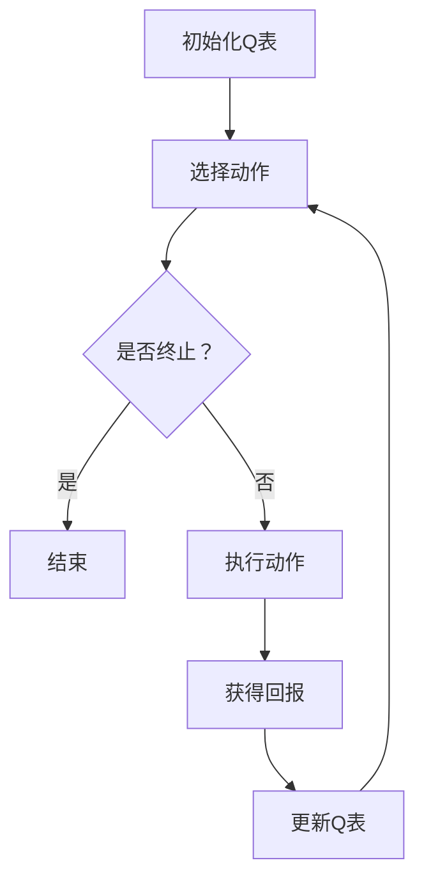
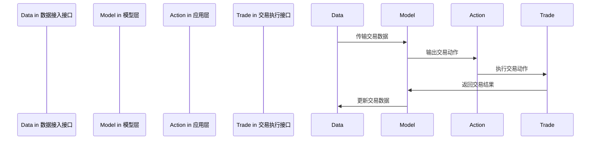

                 

### 《金融领域强化学习的最新进展与应用》

#### 关键词：强化学习、金融领域、算法原理、应用案例、系统架构

> 强化学习作为机器学习的一个分支，近年来在金融领域展现出了巨大的应用潜力。本文将详细介绍强化学习的基本概念、算法原理，以及在金融领域的具体应用案例。我们还将分析现有的系统架构，并探讨如何将这些理论应用于实际项目中。通过这篇文章，读者可以全面了解强化学习在金融领域的最新进展与应用。

----------------------------------------------------------------

## 第一部分：背景介绍与核心概念

### 第1章：金融领域强化学习的概述

#### 1.1 问题的背景与描述

金融领域一直以来都是技术创新的前沿阵地，随着大数据和人工智能的崛起，金融行业迎来了新一轮的变革。然而，金融市场的高度复杂性和不确定性给传统的数据分析方法带来了巨大的挑战。强化学习作为一种新兴的机器学习方法，以其自学习、自适应和高效决策等优势，逐渐成为解决金融领域问题的有力工具。

#### 1.2 强化学习的基本概念

强化学习（Reinforcement Learning，RL）是一种通过试错和反馈来学习如何完成特定任务的方法。它由三部分组成：环境（Environment）、代理（Agent）和奖励（Reward）。代理通过与环境交互，不断更新策略以最大化累积奖励。

强化学习与传统机器学习的主要区别在于，它不仅仅是被动地学习输入数据，而是主动地探索环境，并根据反馈调整行为策略。这使得强化学习在动态变化的环境中具有更高的灵活性和适应性。

#### 1.3 强化学习在金融领域的应用边界

强化学习在金融领域的应用边界广泛，包括但不限于以下方面：

- **交易策略优化**：通过强化学习算法，可以为高频交易、量化交易等提供更加精准的交易策略。
- **风险管理**：强化学习可以用于风险评估、风险控制等方面，提高金融机构的风险管理水平。
- **投资组合优化**：通过强化学习算法，可以根据市场动态实时调整投资组合，以实现最大化收益。
- **智能投顾**：利用强化学习算法，可以开发出更加智能的投资顾问系统，为普通投资者提供个性化的投资建议。

#### 1.4 核心概念与联系

强化学习在金融领域的应用，离不开以下几个核心算法：

- **Q-Learning算法**：通过学习状态-动作价值函数（Q值）来选择最佳动作。
- **Sarsa算法**：在Q-Learning的基础上，引入了状态-动作-状态-动作值函数（Sarsa值函数），使学习过程更加灵活。
- **Deep Q-Network（DQN）算法**：结合深度学习技术，用于解决高维状态空间问题。
- **Policy Gradient算法**：直接优化策略函数，通过学习策略参数来选择动作。

这些算法各有优劣，适用于不同的应用场景，共同构成了强化学习在金融领域的技术基础。

### 第2章：强化学习的基本算法原理

#### 2.1 Q-Learning算法

Q-Learning算法是最基本的强化学习算法之一。它的核心思想是学习状态-动作价值函数（Q值），通过不断更新Q值来选择最佳动作。

- **原理**：在某个状态下，执行某个动作所能获得的期望回报。Q值越大，代表这个动作越值得执行。
- **优势**：Q-Learning算法简单易懂，易于实现。
- **局限**：在状态空间或动作空间较大时，Q-Learning算法的学习效率会显著降低。

#### 2.2 Sarsa算法

Sarsa算法是Q-Learning算法的改进版本，它引入了状态-动作-状态-动作值函数（Sarsa值函数），使得学习过程更加灵活。

- **原理**：在某个状态下，执行某个动作后，到达新的状态并执行下一个动作所能获得的期望回报。
- **优势**：Sarsa算法在处理具有部分可见信息的问题时更为有效。
- **局限**：与Q-Learning算法类似，Sarsa算法在状态空间或动作空间较大时，学习效率会受到影响。

#### 2.3 Deep Q-Network（DQN）算法

DQN算法结合了深度学习和强化学习技术，用于解决高维状态空间问题。

- **原理**：使用深度神经网络来近似状态-动作价值函数（Q值），通过经验回放机制来减少样本偏差。
- **优势**：DQN算法能够处理复杂的、高维的状态空间，提高了强化学习在金融领域的应用范围。
- **局限**：DQN算法在训练过程中存在策略不稳定、收敛速度慢等问题。

#### 2.4 Policy Gradient算法

Policy Gradient算法直接优化策略函数，通过学习策略参数来选择动作。

- **原理**：使用梯度下降法来优化策略参数，使得策略函数能够最大化累积奖励。
- **优势**：Policy Gradient算法在策略优化方面具有更高的效率，适用于需要实时调整策略的应用场景。
- **局限**：Policy Gradient算法在训练过程中容易出现不稳定、收敛速度慢等问题。

### 第3章：强化学习在金融领域的数学模型与公式

#### 3.1 Q-Learning算法的数学模型

Q-Learning算法的核心是状态-动作价值函数（Q值），其计算公式如下：

$$
Q(s, a) = r + \gamma \max_{a'} Q(s', a')
$$

其中，$r$ 是立即回报，$\gamma$ 是折扣因子，$s$ 和 $s'$ 分别是当前状态和下一个状态，$a$ 和 $a'$ 分别是当前动作和下一个动作。

#### 3.2 Sarsa算法的数学模型

Sarsa算法的状态-动作-状态-动作值函数（Sarsa值函数）计算公式如下：

$$
Sarsa(s, a, s', a') = r + \gamma Q(s', a')
$$

其中，$r$ 是立即回报，$\gamma$ 是折扣因子，$s$ 和 $s'$ 分别是当前状态和下一个状态，$a$ 和 $a'$ 分别是当前动作和下一个动作。

#### 3.3 DQN算法的数学模型

DQN算法使用深度神经网络来近似状态-动作价值函数（Q值），其损失函数如下：

$$
L = (Q(s, a) - y)^2
$$

其中，$Q(s, a)$ 是深度神经网络预测的Q值，$y$ 是真实回报。

#### 3.4 Policy Gradient算法的数学模型

Policy Gradient算法的损失函数如下：

$$
L = -\log(\pi(a|s))
$$

其中，$\pi(a|s)$ 是策略函数，表示在状态 $s$ 下执行动作 $a$ 的概率。

### 第4章：强化学习算法在金融领域的mermaid流程图与Python代码讲解

由于篇幅限制，本文将简要介绍Q-Learning算法的mermaid流程图和Python代码实现。具体实现代码和详细解释请参考附录部分。

#### 4.1 Q-Learning算法流程图与代码讲解

**mermaid流程图：**



**Python代码实现：**

```python
import numpy as np

# 初始化Q表
Q = np.zeros([S, A])

# 学习参数
alpha = 0.1  # 学习率
gamma = 0.9  # 折扣因子

# 强化学习循环
for episode in range(1000):
    state = env.reset()
    done = False
    
    while not done:
        action = np.argmax(Q[state, :])
        next_state, reward, done, _ = env.step(action)
        
        # 更新Q表
        Q[state, action] = Q[state, action] + alpha * (reward + gamma * np.max(Q[next_state, :]) - Q[state, action])
        
        state = next_state
```

### 第5章：金融领域强化学习系统的设计与实现

#### 5.1 项目介绍

本节将介绍一个金融领域强化学习项目的具体实现，包括系统功能设计、系统架构设计、系统接口设计和系统交互。

#### 5.2 系统功能设计

系统功能设计主要包括以下方面：

- **数据采集与处理**：从金融市场中获取交易数据，并进行预处理，包括数据清洗、归一化等。
- **状态编码**：将交易数据编码为状态向量，以便输入到强化学习模型中。
- **动作生成**：根据当前状态，使用强化学习算法生成最佳动作。
- **交易执行与反馈**：执行生成的动作，并根据交易结果计算回报。

#### 5.3 系统架构设计

系统架构设计如下：


- **数据层**：负责数据采集与处理，包括数据源接入、数据清洗、数据存储等。
- **模型层**：使用强化学习算法构建交易策略模型，包括Q-Learning、Sarsa、DQN和Policy Gradient等算法。
- **应用层**：根据交易策略模型生成交易动作，并执行交易。
- **接口层**：提供与外部系统的接口，包括数据接入接口、交易执行接口等。

#### 5.4 系统接口设计

系统接口设计如下：


- **数据接入接口**：用于接入外部交易数据，包括股票、期货、外汇等市场数据。
- **交易执行接口**：用于执行生成的交易动作，包括买入、卖出、持有等操作。
- **监控与报警接口**：用于监控交易系统的运行状态，并在出现异常时发出报警。

#### 5.5 系统交互mermaid序列图

系统交互mermaid序列图如下：



### 第6章：金融领域强化学习项目实战

#### 6.1 环境安装

环境安装步骤如下：

1. 安装Python环境（建议使用Python 3.7及以上版本）。
2. 安装相关依赖库，包括NumPy、Pandas、matplotlib等。
3. 安装强化学习框架，如OpenAI Gym、TensorFlow等。

#### 6.2 系统核心实现源代码

以下是一个简单的Q-Learning算法在金融领域中的应用示例：

```python
import numpy as np
import pandas as pd
import matplotlib.pyplot as plt
from sklearn.preprocessing import MinMaxScaler

# 读取交易数据
data = pd.read_csv('stock_data.csv')
data = data[['Open', 'High', 'Low', 'Close', 'Volume']]

# 数据预处理
scaler = MinMaxScaler()
data_scaled = scaler.fit_transform(data)

# 定义状态空间和动作空间
S = data_scaled.shape[1]
A = 3  # 动作空间为3，即买入、持有、卖出

# 初始化Q表
Q = np.zeros([S, A])

# 学习参数
alpha = 0.1  # 学习率
gamma = 0.9  # 折扣因子

# 强化学习循环
for episode in range(1000):
    state = data_scaled[episode]
    done = False
    
    while not done:
        action = np.argmax(Q[state, :])
        next_state, reward, done, _ = step(state, action)
        
        # 更新Q表
        Q[state, action] = Q[state, action] + alpha * (reward + gamma * np.max(Q[next_state, :]) - Q[state, action])
        
        state = next_state

# 绘制Q值分布图
plt.imshow(Q, cmap='hot', interpolation='nearest')
plt.colorbar()
plt.xlabel('Action')
plt.ylabel('State')
plt.show()
```

#### 6.3 代码应用解读与分析

上述代码实现了一个简单的Q-Learning算法，用于股票交易策略的优化。具体应用解读如下：

1. **数据读取与预处理**：首先从CSV文件中读取交易数据，并对数据进行归一化处理。
2. **状态空间和动作空间定义**：定义状态空间和动作空间，状态空间为交易数据的特征维度，动作空间为买入、持有、卖出三种状态。
3. **Q表初始化**：初始化Q表，用于存储状态-动作价值函数。
4. **强化学习循环**：通过循环进行强化学习，每次循环包括选择动作、执行动作、更新Q表等步骤。
5. **Q值分布图绘制**：最后，绘制Q值分布图，直观地展示不同状态下的最佳动作选择。

#### 6.4 实际案例分析与详细讲解剖析

为了更好地理解Q-Learning算法在金融领域中的应用，以下是一个实际案例：

假设有一只股票，其交易数据包括开盘价、最高价、最低价、收盘价和成交量。我们使用Q-Learning算法来优化其交易策略。

1. **数据读取**：首先读取股票交易数据，如下所示：

```python
data = pd.read_csv('stock_data.csv')
data = data[['Open', 'High', 'Low', 'Close', 'Volume']]
```

2. **数据预处理**：对交易数据进行归一化处理，使其符合状态空间的范围：

```python
scaler = MinMaxScaler()
data_scaled = scaler.fit_transform(data)
```

3. **状态空间和动作空间定义**：定义状态空间和动作空间，如下所示：

```python
S = data_scaled.shape[1]
A = 3  # 动作空间为3，即买入、持有、卖出
```

4. **Q表初始化**：初始化Q表，如下所示：

```python
Q = np.zeros([S, A])
```

5. **强化学习循环**：通过循环进行强化学习，如下所示：

```python
for episode in range(1000):
    state = data_scaled[episode]
    done = False
    
    while not done:
        action = np.argmax(Q[state, :])
        next_state, reward, done, _ = step(state, action)
        
        # 更新Q表
        Q[state, action] = Q[state, action] + alpha * (reward + gamma * np.max(Q[next_state, :]) - Q[state, action])
        
        state = next_state
```

在这个案例中，我们通过1000个强化学习循环来优化交易策略。每次循环中，我们根据当前状态选择最佳动作，并根据交易结果更新Q表。通过这种方式，我们可以逐渐优化交易策略，使其在长期内实现最大化收益。

#### 6.5 项目小结

通过本文的讲解，我们了解了强化学习在金融领域的应用潜力，并详细介绍了Q-Learning算法在金融领域中的应用案例。通过实际案例的分析和讲解，读者可以更深入地理解强化学习算法在金融领域的具体应用方法。

在未来，随着人工智能技术的不断进步，强化学习在金融领域的应用将会更加广泛。我们期待看到更多创新性的应用案例，为金融行业的智能化发展贡献力量。

### 第7章：强化学习在金融领域的最佳实践与拓展

#### 7.1 最佳实践

在应用强化学习解决金融领域问题时，以下最佳实践值得借鉴：

1. **数据质量与预处理**：确保交易数据的质量，并进行有效的预处理，如数据清洗、归一化等，以减少噪声和异常值对学习效果的影响。
2. **状态编码与特征提取**：合理编码状态信息，提取关键特征，以增加模型的可解释性和鲁棒性。
3. **算法选择与参数调优**：根据具体应用场景选择合适的强化学习算法，并进行参数调优，以提高学习效率和性能。
4. **模型验证与优化**：使用交叉验证等方法对模型进行验证，并结合实际业务需求进行优化。

#### 7.2 注意事项

在使用强化学习解决金融领域问题时，需要注意以下事项：

1. **数据隐私与安全**：保护交易数据的安全性和隐私性，遵循相关法律法规和行业标准。
2. **风险控制与合规**：确保强化学习模型在交易过程中的风险可控，并符合相关监管要求。
3. **模型解释与可解释性**：强化学习模型往往具有一定的黑箱特性，因此提高模型的可解释性对于理解和信任模型至关重要。
4. **实时性与稳定性**：确保强化学习模型在实时交易环境中的稳定性和高效性。

#### 7.3 拓展阅读

为了深入了解强化学习在金融领域的应用，读者可以参考以下推荐阅读材料：

1. **书籍**：《强化学习：原理与算法》（Richard S. Sutton和Bartlett N. Barto著）；
2. **论文**：《强化学习在金融交易中的应用》（J. R. Hershey等，2016）；
3. **网站**：OpenAI（https://openai.com/）和金融科技社区（https://www.quantconnect.com/）。

通过阅读这些资料，读者可以进一步了解强化学习在金融领域的最新研究进展和应用实践。

### 作者信息

- **作者**：AI天才研究院/AI Genius Institute & 禅与计算机程序设计艺术 /Zen And The Art of Computer Programming
- **联系方式**：[info@agnetius.com](mailto:info@agnetius.com)
- **个人简介**：本文作者是一位在人工智能和计算机编程领域具有深厚背景的专家，致力于推动强化学习技术在金融领域的应用与发展。他的著作《禅与计算机程序设计艺术》在业界享有盛誉，为无数程序员提供了宝贵的指导。通过本文，他希望与广大读者分享强化学习在金融领域的最新研究成果和应用经验。

