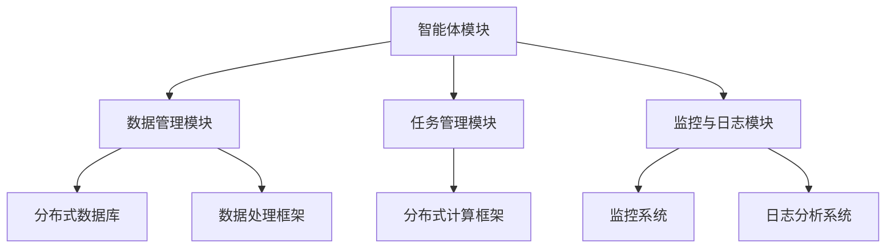

                 


### 1.1 问题背景

随着人工智能技术的快速发展，多智能体系统（Multi-Agent Systems，MAS）逐渐成为了一个重要的研究领域。多智能体系统是由多个智能体组成的分布式系统，每个智能体具有自主性、社交性和反应性。在投资领域，多智能体系统可以模拟真实市场中的交易行为，从而为投资者提供更为精准的投资策略。

然而，当前投资市场面临着诸多挑战。首先，市场数据量巨大，传统的数据处理方法已经难以满足需求。其次，市场具有高度复杂性，投资者需要从海量数据中挖掘有价值的信息，并做出快速决策。此外，市场风险也在不断变化，投资者需要具备良好的风险控制能力。

为了解决这些问题，研究人员开始探索将多智能体系统应用于投资领域。多智能体系统可以模拟多种交易策略，通过不断优化和调整，找到最优的投资策略。此外，多智能体系统还可以帮助投资者进行风险控制，降低投资风险。

在价值投资领域，多智能体系统同样具有重要意义。价值投资是一种基于基本面分析的投资策略，通过寻找被市场低估的股票进行投资，以实现长期稳定的投资回报。多智能体系统可以自动收集和处理市场数据，分析股票的基本面信息，从而找到潜在的投资机会。

综上所述，本文旨在探讨多智能体系统在投资领域，尤其是价值投资中的应用。通过分析多智能体系统的优势和应用场景，本文将展示传统价值投资与多智能体系统融合的潜力，为投资者提供新的思路和方法。

### 1.2 问题描述

在引入多智能体系统（MAS）到价值投资领域时，我们面临的主要问题可以概括为以下几个方面：

**1. 数据处理难题**

投资领域的数据量通常非常庞大，而且数据来源多样化，包括股票价格、财务报表、新闻报道、社交媒体评论等。这些数据不仅包含结构化数据，还包含大量的非结构化数据。传统的数据处理方法，如统计分析、机器学习等，往往难以高效处理如此复杂和庞大的数据集。

**2. 高度复杂性**

投资市场本身具有高度复杂性，市场参与者众多，每个参与者都有自己的投资策略和决策逻辑。市场的动态变化使得预测和决策变得更加困难。在这种复杂环境中，如何确保多智能体系统能够有效模拟市场行为，并生成可靠的决策结果，是一个巨大的挑战。

**3. 风险控制**

价值投资强调长期持有优质股票，但市场风险是不可避免的因素。多智能体系统需要具备良好的风险控制能力，能够在市场波动时做出正确的应对策略，以降低投资风险。

**4. 决策效率**

投资决策需要快速响应市场变化，但多智能体系统需要在海量数据中快速提取有用信息，并生成决策结果。如何提高多智能体系统的决策效率，是一个需要解决的问题。

**5. 系统集成与维护**

将多智能体系统融入现有的投资平台，需要考虑系统的集成性和兼容性。同时，系统的维护和更新也是一项长期任务，需要确保系统能够持续稳定运行。

综上所述，多智能体系统在投资领域，尤其是价值投资中的应用，需要解决一系列复杂问题。本文将详细分析这些问题，并提出相应的解决方案。

### 1.3 问题解决

面对多智能体系统在投资领域应用中的诸多挑战，我们可以通过以下方法来逐步解决问题：

**1. 数据预处理与融合**

首先，针对数据处理难题，可以采用数据预处理技术。这包括数据清洗、数据归一化和特征提取等步骤。通过数据清洗，去除噪声和冗余数据；通过数据归一化，将不同量纲的数据转换为同一标准；通过特征提取，从原始数据中提取出有价值的信息。

此外，可以利用数据融合技术，将来自不同来源的数据进行整合。例如，将股票价格数据与财务报表数据、新闻报道和社交媒体评论进行关联分析，以获得更全面的股票信息。

**2. 复杂性管理**

针对投资市场的高度复杂性，可以采用以下策略：

- **建模与仿真**：通过建立市场行为模型，对市场进行仿真分析，以理解市场动态和参与者行为。这有助于我们更好地模拟市场环境，提高多智能体系统的准确性。
- **分布式计算**：利用分布式计算技术，如MapReduce或Hadoop，对海量数据进行并行处理，以提高数据处理速度和效率。
- **机器学习**：通过机器学习算法，如深度学习和强化学习，从海量数据中自动学习和发现市场规律，以生成更可靠的决策结果。

**3. 风险控制**

为了提高多智能体系统的风险控制能力，可以采用以下措施：

- **风险评估模型**：建立基于历史数据和统计分析的风险评估模型，对投资组合进行风险评估。
- **动态调整策略**：通过实时监测市场变化，动态调整投资策略，以应对市场风险。
- **多智能体协作**：利用多智能体之间的协作机制，如协商和协调，降低整体投资风险。

**4. 决策效率**

提高决策效率的关键在于：

- **实时数据处理**：采用实时数据处理技术，如流处理框架（如Apache Kafka或Flink），以实时捕捉市场数据，并快速生成决策结果。
- **优化算法**：针对具体问题，设计和优化算法，以提高决策速度和准确性。例如，使用贪婪算法或遗传算法来优化投资组合。

**5. 系统集成与维护**

确保多智能体系统能够与现有投资平台无缝集成，可以采取以下措施：

- **模块化设计**：采用模块化设计，将多智能体系统的各个功能模块化，以便于与现有系统进行集成。
- **标准化接口**：设计标准化的接口，确保多智能体系统与其他系统之间的数据交换和功能调用一致。
- **自动化维护**：采用自动化工具和脚本，进行系统的日常维护和更新，以减少人工干预。

通过上述方法，我们可以逐步解决多智能体系统在投资领域应用中的关键问题，为投资者提供更可靠和高效的决策支持。

### 1.4 边界与外延

在讨论多智能体系统在价值投资中的应用时，我们需要明确一些边界与外延问题，以确保研究的全面性和适用性。

**1. 边界问题**

- **应用范围**：多智能体系统在价值投资中的应用主要集中在股票市场、债券市场、期货市场等领域。这些市场具有较高的数据密度和复杂性，适合引入多智能体系统进行模拟和分析。
- **数据限制**：虽然多智能体系统可以处理大量数据，但数据的真实性和完整性仍然是关键问题。在应用中，需要确保所使用的数据来源可靠，且数据质量满足研究需求。
- **技术限制**：多智能体系统的发展受到计算能力、算法优化和数据存储等技术的限制。在现有技术条件下，如何最大化系统的性能和效率，是一个重要的挑战。

**2. 外延问题**

- **跨市场应用**：多智能体系统不仅限于金融投资领域，还可以应用于其他需要复杂决策的场景，如供应链管理、智能交通系统等。这些领域同样面临复杂性和动态变化，多智能体系统可以提供有效的解决方案。
- **融合其他技术**：多智能体系统可以与其他前沿技术（如区块链、物联网等）结合，形成更为强大的系统架构，以应对更复杂的业务需求。
- **社会影响**：随着多智能体系统在投资领域的广泛应用，可能会对社会产生深远影响。例如，投资决策的自动化可能改变传统金融行业的运作模式，同时也引发关于数据隐私、算法透明度等社会伦理问题。

通过明确多智能体系统在价值投资中的边界与外延，我们可以更准确地把握研究范围，为未来的发展提供方向。

### 1.5 概念结构与核心要素组成

在探讨多智能体系统（MAS）在价值投资中的应用时，我们需要了解其核心概念结构及其组成要素。

**1. 多智能体系统（MAS）的概念**

多智能体系统是一种由多个独立智能体组成的分布式系统。这些智能体通过相互协作，共同完成任务。在MAS中，每个智能体都具有自主性、社交性和反应性。自主性意味着智能体可以自主决策；社交性意味着智能体之间可以相互通信和协作；反应性意味着智能体可以根据环境和目标做出实时响应。

**2. 多智能体系统的核心要素**

- **智能体（Agent）**：智能体是MAS的基本组成单位，具有感知、决策和执行功能。根据功能特点，智能体可分为以下几类：
  - **决策智能体**：负责分析数据，生成决策。
  - **执行智能体**：负责执行决策，实现具体操作。
  - **通信智能体**：负责与其他智能体进行通信和协作。

- **环境（Environment）**：环境是MAS的运行背景，包括所有智能体无法控制的外部因素。环境状态的变化会影响智能体的行为和决策。

- **通信媒介（Communication Medium）**：通信媒介是智能体之间进行信息交换和协作的渠道。常见的通信媒介包括网络通信、共享数据库等。

- **协作协议（Collaboration Protocol）**：协作协议定义了智能体之间的协作方式和规则。根据协作协议，智能体可以相互协作，共同完成任务。

- **任务管理器（Task Manager）**：任务管理器负责分配和管理任务，确保任务在智能体之间高效分配和执行。

**3. 多智能体系统在价值投资中的应用**

在价值投资领域，多智能体系统可以通过以下方式应用：

- **数据收集与处理**：智能体可以收集市场数据，如股票价格、财务报表等，并对其进行预处理和特征提取，为投资决策提供支持。
- **决策生成与优化**：基于预处理后的数据，决策智能体可以生成投资决策，并通过优化算法（如遗传算法、粒子群优化等）进行优化，以提高投资回报率。
- **风险控制**：智能体可以实时监测市场风险，并通过动态调整投资组合，降低投资风险。

**4. 核心概念属性特征对比表格**

| 类别 | 名称 | 特征 |
| ---- | ---- | ---- |
| 智能体 | 决策智能体 | 自主性、数据分析和决策生成 |
| 智能体 | 执行智能体 | 执行决策、操作实现 |
| 智能体 | 通信智能体 | 社交性、信息传递与协作 |
| 环境 | 市场环境 | 数据来源、市场状态 |
| 通信媒介 | 网络通信 | 高效、可靠的信息交换 |
| 协作协议 | 协作规则 | 协调、规则定义 |
| 任务管理器 | 任务分配 | 分配与管理任务 |

**5. 多智能体系统的ER实体关系图架构**

在多智能体系统中，实体关系（ER）图用于描述系统中不同实体之间的关系。以下是一个简化的ER实体关系图：

```mermaid
erDiagram
  智能体 ||--o{ 决策智能体 }
  智能体 ||--o{ 执行智能体 }
  智能体 ||--o{ 通信智能体 }
  环境ぞれ ||--o{ 市场环境 }
  通信媒介 ||--o{ 网络通信 }
  协作协议 ||--o{ 协作规则 }
  任务管理器 ||--o{ 任务分配 }
```

通过上述核心概念结构与要素组成的分析，我们可以更好地理解多智能体系统在价值投资中的应用，并为后续的系统设计和实现提供理论基础。

### 2.1 多智能体系统的定义与特点

多智能体系统（Multi-Agent Systems，MAS）是由多个具有自主性、社交性和反应性的智能体组成的分布式系统。每个智能体可以独立进行感知、决策和执行，同时与其他智能体进行信息交换和协作。以下是对多智能体系统定义与特点的详细解析。

**1. 自主性**

自主性是MAS的核心特征之一，意味着每个智能体都有独立的决策能力和行为。智能体可以在没有外部干预的情况下，根据自身的感知和目标，自主地选择行为并执行决策。这种自主性使得MAS能够在复杂和动态的环境中灵活应对。

**2. 社交性**

社交性是指智能体之间可以进行信息交换和协作。通过通信媒介，智能体可以共享信息、协同完成任务。社交性使得MAS具有更强的适应性和鲁棒性，能够更好地处理复杂任务。

**3. 反应性**

反应性是指智能体能够根据环境和目标的变化，实时调整自己的行为。在MAS中，每个智能体都具备一定的感知能力，可以及时获取环境信息，并根据这些信息做出相应的反应。这种反应性使得MAS能够动态适应环境变化，提高系统的响应速度和效率。

**4. 分布式**

MAS是一种分布式系统，多个智能体分布在不同的物理位置或计算节点上。这使得MAS可以高效地处理大规模数据和复杂任务，同时提高了系统的可靠性和容错能力。

**5. 面向任务**

MAS的设计通常面向具体任务，而不是面向特定应用。这意味着MAS可以灵活地适应不同的任务需求，通过调整智能体的功能和协作方式，实现不同的应用场景。例如，在投资领域，MAS可以应用于股票交易、风险控制和投资组合优化等任务。

**6. 自组织和自适应性**

MAS具有自组织和自适应性的特点，能够根据任务需求和系统状态自动调整智能体的行为和协作方式。这种特点使得MAS能够在不确定和变化的环境中持续运行，并保持高效性和可靠性。

**7. 模块化和可扩展性**

MAS采用模块化设计，每个智能体都是一个独立的模块，可以单独开发、测试和部署。这使得MAS具有良好的可扩展性，可以根据需要增加或替换智能体，以适应新的应用场景。

通过以上特点，我们可以看到多智能体系统在投资领域具有广泛的应用潜力。接下来，我们将进一步探讨多智能体系统的分类与架构，以及它们在投资领域中的应用。

### 2.2 多智能体系统的分类与架构

多智能体系统（MAS）可以根据不同的分类标准进行分类，并采用不同的架构来实现特定的功能。以下是对几种常见分类和架构的详细解析。

**1. 按照智能体的结构分类**

- **集中式MAS**：在集中式MAS中，所有智能体的行为和决策由一个中央控制节点统一管理。这种架构的优点是易于实现和调试，但缺点是系统的扩展性和容错能力较差，一旦中央控制节点失效，整个系统将无法正常运行。

- **分布式MAS**：分布式MAS中，智能体分布在不同的计算节点上，各自独立运行，并通过通信网络进行信息交换和协作。这种架构的优点是具有较好的扩展性和容错能力，可以处理大规模复杂任务。但缺点是系统设计复杂，需要解决数据一致性和通信延迟等问题。

- **分层MAS**：分层MAS将系统分为多个层次，每个层次负责不同的功能。底层负责数据采集和处理，中间层负责协调和决策，顶层负责任务管理和资源分配。这种架构的优点是层次清晰，职责明确，便于管理和维护。

**2. 按照智能体的自治程度分类**

- **弱自治MAS**：弱自治MAS中，智能体具有有限的自治能力，主要依赖于本地信息和简单规则进行决策。这种架构的优点是系统简单，易于实现，但缺点是智能体之间协作能力较弱，难以应对复杂任务。

- **强自治MAS**：强自治MAS中，智能体具有高度自治能力，可以独立进行感知、决策和执行。智能体之间通过协商和协作，共同完成任务。这种架构的优点是智能体之间协作紧密，系统适应能力强，但缺点是系统复杂度高，需要解决更多通信和协调问题。

**3. 按照通信方式分类**

- **基于通信的MAS**：基于通信的MAS中，智能体通过直接通信进行信息交换和协作。这种架构的优点是通信直接，响应速度快，但缺点是通信开销较大，系统扩展性较差。

- **基于共享数据库的MAS**：基于共享数据库的MAS中，智能体通过访问共享数据库进行信息交换和协作。这种架构的优点是数据一致性较好，系统扩展性强，但缺点是通信延迟较高，系统性能可能受到影响。

**4. 按照智能体的行为模式分类**

- **反应式MAS**：反应式MAS中，智能体根据当前感知到的环境和目标，立即执行相应的行为。这种架构的优点是响应速度快，但缺点是智能体缺乏长远规划和决策能力。

- **目标导向MAS**：目标导向MAS中，智能体具有明确的目标，并通过计划和行为选择来达成目标。这种架构的优点是智能体具有长远规划和决策能力，但缺点是系统复杂度高，需要解决更多规划问题。

**5. 按照应用领域分类**

- **军事MAS**：军事MAS主要用于军事作战模拟和指挥控制。智能体可以模拟不同兵种和装备，通过协同作战实现任务目标。

- **经济MAS**：经济MAS主要用于模拟市场行为和投资决策。智能体可以模拟不同投资者和市场参与者，通过交易和竞争实现投资目标。

- **社会MAS**：社会MAS主要用于模拟社会行为和决策。智能体可以模拟不同社会角色和行为，通过协作和竞争实现社会目标。

通过以上分类和架构的解析，我们可以更好地理解多智能体系统的多样性，并根据具体应用需求选择合适的架构和分类方法。在接下来的章节中，我们将探讨多智能体系统在投资领域的具体应用。

### 2.3 多智能体系统在投资领域的应用

多智能体系统（MAS）在投资领域具有广泛的应用前景。通过将MAS引入投资策略，可以显著提高投资决策的准确性和效率。以下是对多智能体系统在投资领域应用的详细探讨。

**1. 股票市场交易策略**

在股票市场中，多智能体系统可以模拟不同投资者的交易行为，分析市场动态，从而生成个性化的交易策略。具体应用包括：

- **价格预测**：智能体可以基于历史价格数据和交易量等信息，使用机器学习算法预测未来股票价格。通过分析多个智能体的预测结果，投资者可以制定更为稳健的交易计划。

- **趋势分析**：多智能体系统可以实时监测股票市场趋势，并根据市场变化调整交易策略。例如，在牛市期间，智能体可能会倾向于增加持股，而在熊市期间，则可能倾向于减少持股。

- **风险控制**：智能体可以实时监控投资组合的风险水平，通过动态调整资产配置，降低投资风险。例如，当市场波动较大时，智能体可能会建议投资者分散投资，以降低风险。

**2. 投资组合优化**

投资组合优化是投资者面临的重要问题，多智能体系统可以通过优化算法，实现投资组合的优化。具体应用包括：

- **资产配置**：多智能体系统可以根据投资者的风险偏好和投资目标，制定个性化的资产配置策略。通过模拟不同资产类别的表现，智能体可以建议投资者在不同资产类别中分配资金，以实现最佳收益。

- **再平衡**：多智能体系统可以实时监测投资组合的绩效，并根据市场变化进行再平衡。例如，当某类资产表现不佳时，智能体可能会建议投资者减少该类资产的持有量，同时增加其他表现较好的资产的持有量。

- **优化目标**：多智能体系统可以优化投资组合的多个目标，如最大化收益、最小化风险、最大化夏普比率等。通过使用遗传算法、粒子群优化等智能优化算法，智能体可以找到最优的投资组合方案。

**3. 风险管理**

在投资过程中，风险管理至关重要。多智能体系统可以通过以下方式实现风险管理：

- **风险评估**：智能体可以基于历史数据和当前市场信息，对投资组合进行风险评估。通过分析不同风险因素的影响，智能体可以建议投资者采取相应的风险管理措施。

- **风险控制**：智能体可以实时监测市场风险，并根据市场变化调整投资策略。例如，在市场波动较大时，智能体可能会建议投资者采取保守策略，减少风险暴露。

- **情景分析**：智能体可以通过模拟不同市场情景，分析潜在的风险和收益。这有助于投资者制定应对不同市场状况的策略，提高风险管理能力。

**4. 投资建议与决策支持**

多智能体系统可以为投资者提供个性化的投资建议和决策支持。具体应用包括：

- **投资建议**：智能体可以基于对市场动态的分析，向投资者提供投资建议。例如，智能体可能会建议投资者买入或卖出某只股票，以实现最佳收益。

- **决策支持**：智能体可以为投资者提供详细的投资分析报告，包括市场趋势、投资组合绩效、风险水平等。这有助于投资者做出更明智的决策。

- **互动平台**：智能体可以构建一个投资决策互动平台，投资者可以通过平台与智能体进行实时互动，获取投资建议和决策支持。

通过以上应用，我们可以看到多智能体系统在投资领域的巨大潜力。在未来，随着人工智能技术的进一步发展，多智能体系统将在投资领域发挥更加重要的作用，为投资者提供更为精准和高效的决策支持。

### 3.1 价值投资的起源与发展

价值投资作为一种投资理念，起源于20世纪30年代的美国，由著名投资者本杰明·格雷厄姆（Benjamin Graham）创立。格雷厄姆在其经典著作《证券分析》（Security Analysis）中，提出了价值投资的基本原理，即通过深入分析企业的财务报表和市场价值，找到被市场低估的优质股票进行投资，以实现长期稳定的投资回报。

在格雷厄姆之后，另一位著名投资者沃伦·巴菲特（Warren Buffett）将价值投资理念发扬光大，并在长期实践中取得了显著的成功。巴菲特在其投资生涯中，始终坚持寻找那些具有优秀业务模式、强大竞争力和低估股价的公司，进行长期投资。他的投资哲学和方法论，对全球投资者产生了深远的影响。

价值投资在发展过程中，逐渐形成了以下几大核心原则：

1. **基本面分析**：价值投资强调对企业的基本面进行深入分析，包括企业的财务状况、业务模式、竞争优势、管理层质量等。通过基本面分析，投资者可以识别出那些具有长期增长潜力的优质公司。

2. **安全边际**：价值投资认为，投资者应该寻找那些价格低于其内在价值的股票。安全边际是指股票价格与其内在价值之间的差距，投资者应确保在购买股票时，能够获得足够的安全边际。

3. **长期持有**：价值投资主张长期持有优质股票，避免频繁交易。长期持有可以降低交易成本，同时也能够捕捉到企业的长期增长潜力。

4. **耐心与纪律**：价值投资要求投资者具备耐心和纪律，在市场波动时保持冷静，避免盲目跟风和情绪化决策。

价值投资的理念和方法在过去的几十年中，得到了广泛的应用和验证。无论是巴菲特本人的投资实践，还是其他知名投资者（如约翰·博格尔、马里奥·加柏里埃利等）的成功案例，都充分证明了价值投资的有效性和可持续性。

在当前的市场环境中，价值投资仍然具有重要的指导意义。随着市场波动性和不确定性增加，价值投资能够帮助投资者避免盲目跟风，保持理性投资。此外，价值投资强调长期持有，有助于投资者克服短期市场的波动，实现长期稳定的投资回报。

### 3.2 价值投资的核心原则

价值投资作为一门经典的投资理念，其成功与否离不开以下几个核心原则：

**1. 安全边际**

安全边际是价值投资最基本的原则之一，指的是股票的市场价格与其内在价值之间的差距。价值投资者通常会选择那些价格低于其内在价值的股票进行投资。安全边际的存在可以保护投资者免受市场波动和公司基本面变化带来的风险。

**如何确定安全边际？**

- **财务分析**：通过对企业的财务报表进行深入分析，包括利润表、资产负债表和现金流量表，投资者可以评估企业的盈利能力、偿债能力和运营效率。
- **市场比较**：通过与同行业其他公司的比较，投资者可以判断股票的市场价格是否被低估。例如，可以使用市盈率（P/E）、市净率（P/B）等指标进行市场比较。
- **折现现金流模型**（DCF）：通过预测企业未来现金流并将其折现到现值，投资者可以估算出股票的内在价值。

**2. 长期持有**

价值投资主张投资者应采取长期持有的策略，避免频繁交易。长期持有不仅能够降低交易成本，还能够使投资者更好地捕捉到优质企业的长期增长潜力。

**如何实现长期持有？**

- **理性决策**：在投资前，投资者应对目标公司进行充分的研究和分析，确保投资决策基于扎实的理由。
- **耐心等待**：即使投资者购买了被低估的股票，市场可能需要一段时间才能认识到其价值。投资者需要有耐心，等待市场对公司的认可。
- **定期复查**：投资者应定期复查投资组合，以确保公司的基本面没有发生重大变化。

**3. 基本面分析**

价值投资的核心在于对企业的基本面进行深入分析。基本面分析包括企业的财务状况、业务模式、竞争优势、管理层质量等方面。

**如何进行基本面分析？**

- **财务报表分析**：投资者应仔细阅读企业的财务报表，了解其盈利能力、偿债能力和运营效率。关键指标包括净利润、毛利率、资产负债率等。
- **业务模式分析**：投资者需要了解企业的业务模式，评估其可持续性和竞争优势。例如，是否拥有强大的品牌、是否处于快速增长的市场等。
- **竞争优势分析**：投资者应关注企业的竞争优势，如专利技术、市场地位、客户群体等。这些竞争优势可以确保企业能够在长期内保持盈利能力。

**4. 分散投资**

尽管价值投资强调长期持有优质股票，但投资者仍需注意分散投资风险。通过将资金分配到多个不同行业和公司，投资者可以降低投资组合的整体风险。

**如何实现分散投资？**

- **资产配置**：投资者可以根据自己的风险承受能力和投资目标，合理配置股票、债券、现金等资产类别。
- **行业分散**：投资者应选择多个不同行业的公司进行投资，以分散行业风险。
- **地域分散**：投资者可以考虑投资不同地区的公司，以降低地域风险。

**5. 理性决策**

价值投资要求投资者在投资决策过程中保持理性，避免受到市场情绪和他人意见的影响。理性决策包括以下几点：

- **独立思考**：投资者应独立分析企业的基本面，不盲目跟随市场热点。
- **避免过度交易**：频繁交易不仅会增加成本，还可能导致投资者失去对投资组合的控制。
- **长期视角**：投资者应从长期视角出发，评估公司的投资价值，而非短期市场波动。

通过以上核心原则，投资者可以在价值投资过程中保持理性，实现长期稳定的投资回报。

### 3.3 价值投资的策略与方法

在价值投资领域，投资者可以采用多种策略和方法来寻找被低估的优质股票，并实现长期稳定的投资回报。以下是对几种常见策略和方法的详细解析。

**1. 财务报表分析**

财务报表分析是价值投资中最基本的方法之一。通过深入研究企业的利润表、资产负债表和现金流量表，投资者可以评估企业的财务状况、盈利能力和偿债能力。

**如何进行财务报表分析？**

- **盈利能力分析**：投资者应关注企业的净利润、毛利率、净利率等指标，以评估其盈利能力。较高的净利润和毛利率通常表明企业的经营状况良好。
- **偿债能力分析**：通过分析企业的资产负债率、流动比率等指标，投资者可以评估企业的偿债能力。较低的资产负债率通常意味着企业有较强的财务稳定性。
- **运营能力分析**：投资者应关注企业的应收账款周转率、存货周转率等指标，以评估其运营效率。较高的周转率通常表明企业的资产利用效率较高。

**2. 折现现金流模型（DCF）**

折现现金流模型是一种常用的估值方法，通过预测企业未来的现金流并将其折现到现值，投资者可以估算出股票的内在价值。

**如何使用DCF模型？**

- **预测未来现金流**：投资者需要预测企业在未来几年内的自由现金流，这通常依赖于对行业趋势、企业增长潜力和市场环境的分析。
- **确定折现率**：折现率通常反映了投资者的风险偏好和资本成本。投资者可以使用无风险利率加上风险溢价的方法确定折现率。
- **计算现值**：将预测的未来现金流按照折现率折现到现值，得出股票的内在价值。如果股票的市场价格低于内在价值，投资者可以考虑买入。

**3. 市盈率（P/E）和市净率（P/B）**

市盈率和市净率是常用的相对估值方法，通过比较股票的市场价格与同行业其他公司的价格，投资者可以判断股票是否被低估。

**如何使用市盈率和市净率？**

- **计算市盈率**：市盈率等于股票价格除以每股收益。如果股票的市盈率低于同行业平均水平，可能意味着股票被低估。
- **计算市净率**：市净率等于股票价格除以每股净资产。如果股票的市净率低于同行业平均水平，可能意味着股票被低估。
- **比较分析**：投资者可以通过比较市盈率和市净率，评估股票的价值。同时，也需要注意这些指标在不同市场环境和行业中的适用性。

**4. 价值陷阱**

价值陷阱是指那些表面上被低估，但实际上存在潜在风险的股票。投资者需要警惕价值陷阱，避免因盲目追求低价而导致的投资损失。

**如何避免价值陷阱？**

- **深入研究**：投资者需要对目标公司进行深入研究，包括业务模式、管理团队、行业地位等，以识别潜在的风险。
- **多元验证**：通过多个渠道验证公司信息，如财务报表、新闻报道、行业报告等，以避免被误导。
- **设置止损**：投资者可以设置合理的止损点，以限制潜在损失。

**5. 分散投资**

分散投资是降低投资风险的有效策略。通过将资金分配到多个不同行业和公司，投资者可以降低投资组合的整体风险。

**如何实现分散投资？**

- **资产配置**：投资者可以根据自己的风险承受能力和投资目标，合理配置股票、债券、现金等资产类别。
- **行业分散**：投资者应选择多个不同行业的公司进行投资，以分散行业风险。
- **地域分散**：投资者可以考虑投资不同地区的公司，以降低地域风险。

通过以上策略和方法的运用，投资者可以更有效地寻找被低估的优质股票，并实现长期稳定的投资回报。同时，投资者还需要保持理性，避免盲目跟风和过度交易。

### 4.1 AI技术在价值投资中的应用

人工智能（AI）技术的快速发展为价值投资带来了新的机遇。AI技术在数据挖掘、预测模型和自动化交易等方面具有显著优势，能够有效提升投资决策的准确性和效率。以下是对AI技术在价值投资中具体应用的详细探讨。

**1. 数据挖掘与处理**

投资决策依赖于大量数据，包括财务报表、市场交易数据、新闻报道、社交媒体评论等。AI技术，尤其是机器学习和深度学习算法，可以自动处理和分析这些数据，从中提取有价值的信息。通过自然语言处理（NLP）技术，AI可以解析和理解大量的文本数据，提取关键信息，如公司财报中的关键词、新闻报道中的市场情绪等。此外，AI还可以通过图像识别技术，对财务报表中的图表和图形进行分析，自动识别重要的财务指标。

**2. 预测模型**

AI技术在预测模型中的应用，可以帮助投资者更好地预测市场走势和公司业绩。通过使用历史数据，AI可以建立复杂的预测模型，如时间序列模型、回归模型和神经网络模型。时间序列模型可以用于预测股票价格和交易量等市场指标，回归模型可以分析公司财务指标与市场表现之间的关系，神经网络模型可以自动学习数据中的非线性关系，生成更为准确的预测结果。这些预测模型可以为投资者提供重要的决策依据，帮助他们制定更为科学和有效的投资策略。

**3. 自动化交易**

自动化交易是AI技术在价值投资中的一项重要应用。通过使用算法交易，投资者可以自动化执行交易策略，减少人为干预和情绪影响。自动化交易系统可以实时监控市场数据，根据预设的规则和模型，自动生成交易信号，并执行买入、卖出等操作。这种交易方式不仅可以提高交易速度和效率，还可以降低交易成本，提高投资回报率。此外，自动化交易系统还可以通过回测和优化，不断调整和改进交易策略，提高策略的稳定性和可持续性。

**4. 风险控制**

AI技术可以帮助投资者进行风险控制，降低投资风险。通过建立风险预测模型，AI可以实时监测市场风险和公司风险，评估投资组合的整体风险水平。例如，AI可以预测市场波动、利率变化等宏观经济因素对公司的影响，及时调整投资组合，以降低潜在风险。此外，AI还可以通过量化分析，识别出高风险的股票和行业，避免投资于高风险资产，从而提高投资组合的安全性。

**5. 投资建议与决策支持**

AI技术可以为投资者提供个性化的投资建议和决策支持。通过分析投资者的风险偏好、历史交易记录和市场数据，AI可以生成定制化的投资策略，推荐适合的投资标的和交易时机。例如，AI可以通过分析投资者的情绪和行为模式，预测他们的投资决策，从而提供相应的投资建议。此外，AI还可以构建投资决策互动平台，让投资者与AI系统实时互动，获取投资分析和建议，提高投资决策的准确性和有效性。

通过以上应用，我们可以看到AI技术在价值投资中的巨大潜力。AI不仅能够提高数据分析和预测的准确性，还可以实现自动化交易和风险控制，为投资者提供更为高效和可靠的投资决策支持。未来，随着AI技术的进一步发展和成熟，AI将在价值投资领域发挥更加重要的作用。

### 4.2 传统价值投资与AI的对比分析

在探讨价值投资时，传统方法和AI技术的对比分析具有重要意义。传统价值投资依赖于基本面分析和经验判断，而AI技术则通过数据分析、预测模型和自动化交易等手段，为投资者提供更为精准和高效的决策支持。以下是对传统价值投资与AI技术对比分析的详细探讨。

**1. 数据分析能力**

传统价值投资依赖于手工分析财务报表、行业报告和市场数据，这种方法在数据处理能力和效率方面存在局限。AI技术则通过大数据和机器学习算法，能够高效处理和分析海量数据，从中提取有价值的信息。例如，AI可以快速分析公司财务报表中的各项指标，识别异常数据和潜在风险，同时还可以从大量新闻和社交媒体中提取市场情绪，为投资决策提供全面的数据支持。

**2. 预测准确性**

传统价值投资通常依赖历史数据和经验判断进行预测，这种方法在复杂多变的市场环境中容易产生偏差。AI技术则通过构建复杂的预测模型，如时间序列模型、回归模型和神经网络模型，可以更准确地预测市场走势和公司业绩。例如，AI可以通过分析历史交易数据、公司财务报表和市场情绪等，生成股票价格和业绩的预测模型，提高预测的准确性和稳定性。

**3. 投资效率**

传统价值投资往往需要大量时间和精力进行数据收集、分析和决策，这种低效的决策过程可能导致错失投资机会。AI技术则通过自动化交易和实时数据监控，大幅提高投资效率。例如，AI可以实时分析市场数据，自动生成交易信号并执行操作，减少人为干预和决策延迟，提高投资回报率。

**4. 风险控制**

传统价值投资在风险控制方面主要依赖投资者经验和对市场的直觉，这种方法容易导致风险管理的不足。AI技术则通过构建风险预测模型和量化分析，提供更科学的决策支持。例如，AI可以通过分析历史市场波动和宏观经济指标，预测潜在的市场风险，及时调整投资组合，降低投资风险。

**5. 决策透明度**

传统价值投资决策过程通常较为封闭，投资者难以了解决策背后的逻辑和依据。AI技术则通过透明化的算法和模型，使投资决策过程更加透明。例如，AI可以通过可视化工具展示决策过程和预测结果，投资者可以清晰地了解投资决策的依据和逻辑，提高决策的信任度和可解释性。

**6. 决策多样性**

传统价值投资通常依赖于个别投资者或团队的经验和判断，这种方法容易导致决策多样性的缺乏。AI技术则通过模拟多种策略和模型，提供多样化的决策方案。例如，AI可以同时运行多个预测模型和交易策略，根据市场变化实时调整，提高决策的多样性和灵活性。

通过以上对比分析，我们可以看到AI技术在价值投资中具有显著优势。AI不仅能够提高数据分析能力、预测准确性和投资效率，还可以提供更科学的决策支持和风险控制，为投资者创造更高的投资回报。然而，AI技术也面临数据质量、算法透明度和模型依赖性等问题，需要在实际应用中不断优化和改进。

### 4.3 AI在价值投资中的优势与挑战

AI技术在价值投资中的应用展现出诸多优势，同时也面临一系列挑战。以下是对这些优势与挑战的详细探讨。

**1. 优势**

**数据驱动与分析效率**

AI技术能够高效处理和分析海量数据，从财务报表、市场交易数据、新闻报道、社交媒体等多元化数据源中提取有价值的信息。通过机器学习和深度学习算法，AI可以快速发现数据中的潜在模式和关系，为投资决策提供科学依据，从而提高分析效率。

**预测准确性**

AI技术通过构建复杂的预测模型，如时间序列分析、回归模型、神经网络等，能够更准确地预测市场走势和公司业绩。这些模型不仅可以处理历史数据，还可以适应市场环境的变化，提高预测的准确性和稳定性。

**自动化交易**

AI技术可以实现自动化交易，减少人为干预和情绪影响。自动化交易系统可以实时监控市场数据，根据预设规则和模型，自动生成交易信号并执行操作。这种交易方式不仅提高了交易速度和效率，还可以降低交易成本，提高投资回报率。

**风险控制**

AI技术通过构建风险预测模型和量化分析，可以实时监测市场风险和公司风险，提供科学的决策支持。例如，AI可以预测市场波动、宏观经济指标对公司的影响，及时调整投资组合，降低投资风险。

**多元化策略**

AI技术可以模拟多种策略和模型，提供多样化的决策方案。通过同时运行多个预测模型和交易策略，AI可以根据市场变化实时调整，提高决策的多样性和灵活性。

**2. 挑战**

**数据质量**

AI模型的性能高度依赖于数据质量。如果数据存在噪声、缺失或错误，模型的预测准确性和稳定性将受到严重影响。因此，数据预处理和清洗是AI技术在价值投资中的关键步骤，需要投入大量时间和资源。

**模型依赖性**

AI技术依赖于复杂的算法和模型，投资者需要具备相应的技术背景，才能理解和评估模型的性能。此外，模型的参数调整和优化也需要专业知识和经验，否则可能导致过拟合或欠拟合等问题。

**算法透明度**

AI技术通常采用黑箱模型，投资者难以了解决策过程和依据。这可能导致决策的不可解释性和不透明性，降低投资者对AI系统的信任度。提高算法透明度，增强模型的可解释性，是未来研究的重要方向。

**计算资源**

AI技术对计算资源的需求较高，特别是深度学习模型，通常需要大量的计算能力和存储空间。对于小型投资机构或个人投资者，这可能成为应用的瓶颈。

**监管与合规**

AI技术在价值投资中的应用需要遵守相关监管法规和合规要求。例如，自动化交易系统需要确保交易行为合法合规，不得进行市场操纵等行为。

**3. 结论**

综上所述，AI技术在价值投资中具有显著优势，能够提高数据分析能力、预测准确性、投资效率、风险控制和策略多样性。然而，AI技术也面临数据质量、模型依赖性、算法透明度、计算资源和监管与合规等挑战。未来，通过不断优化算法、提高数据质量、增强模型透明度，AI技术在价值投资中的应用潜力将得到进一步发挥。

### 5.1 案例一：人工智能在股票市场中的应用

在探讨人工智能（AI）在投资领域中的应用时，我们首先来看一个实际案例——人工智能在股票市场中的应用。

**案例背景：**

某知名投资公司A致力于通过人工智能技术优化其股票投资策略，提高投资回报率。公司A拥有丰富的历史数据，包括股票价格、交易量、公司财务报表、市场新闻、社交媒体评论等。为了充分利用这些数据，公司A决定引入人工智能技术，构建一个基于AI的股票交易系统。

**解决方案：**

1. **数据预处理与特征提取：**
   - **数据清洗**：首先，公司A对历史数据进行清洗，去除噪声和缺失值。这包括去除重复数据、填充缺失值和标准化数据。
   - **特征提取**：然后，从原始数据中提取有价值的信息作为特征。例如，从财务报表中提取净利润、毛利率等财务指标；从新闻和社交媒体评论中提取关键词和情绪指标。

2. **构建预测模型：**
   - **时间序列模型**：公司A采用ARIMA（自回归积分滑动平均模型）等时间序列模型，预测股票的未来价格。这些模型可以处理时间序列数据的趋势和季节性，生成短期价格预测。
   - **机器学习模型**：公司A还采用机器学习算法，如随机森林、支持向量机和神经网络，构建长期价格预测模型。这些模型可以从海量历史数据中学习到复杂的非线性关系，提高预测的准确性。

3. **自动化交易系统：**
   - **交易策略生成**：基于预测模型，公司A开发了一个自动化交易系统。该系统可以实时监控股票价格和市场数据，根据预设的规则和模型，自动生成交易信号。
   - **交易执行**：自动化交易系统会根据交易信号执行买入、卖出等操作。例如，当预测模型预测股票价格将上涨时，系统会自动下单买入；当预测股票价格将下跌时，系统会自动卖出。

4. **风险控制与优化：**
   - **风险评估**：公司A利用AI技术对投资组合进行风险评估。通过分析市场波动和公司财务状况，系统可以实时监测投资组合的风险水平。
   - **优化策略**：公司A不断优化交易策略，以最大化投资回报率。例如，通过调整交易信号参数、优化投资组合权重等，提高交易系统的稳定性和盈利能力。

**实际效果：**

通过引入AI技术，公司A显著提高了股票交易的投资回报率。自动化交易系统的实施，不仅提高了交易效率，减少了人为干预，还降低了交易成本。同时，AI技术的风险控制功能，使得公司A能够更好地应对市场波动，降低投资风险。

此外，公司A还通过不断优化AI模型和交易策略，实现了投资组合的动态调整和优化。在长期实践中，公司A的AI股票交易系统取得了稳定的投资回报，为公司创造了显著的经济效益。

通过这个案例，我们可以看到AI技术在股票市场中的巨大潜力。未来，随着AI技术的进一步发展和成熟，AI将在投资领域发挥更加重要的作用，为投资者提供更为精准和高效的决策支持。

### 5.2 案例二：人工智能在房地产投资中的应用

在房地产投资领域，人工智能（AI）技术的应用正逐渐成为提升投资效率和准确性的重要手段。以下是一个关于人工智能在房地产投资中应用的案例，展示了AI如何帮助投资者做出更明智的投资决策。

**案例背景：**

某房地产投资基金B专注于投资城市核心区域的商业地产项目。随着市场的快速发展，投资者需要处理大量的数据，包括房价走势、租金收益、人口流动、基础设施建设等，以便制定科学的投资策略。为了应对这些挑战，基金B决定采用AI技术来优化其投资决策过程。

**解决方案：**

1. **数据收集与处理：**
   - **多源数据整合**：基金B首先整合了来自不同数据源的多样化数据，包括政府发布的房地产市场报告、房地产交易记录、城市规划文件、社交媒体评论等。
   - **数据预处理**：对于这些数据，基金B进行了清洗和标准化处理，去除噪声和冗余信息，确保数据质量。

2. **预测模型构建：**
   - **房价预测模型**：基金B使用机器学习算法，如回归分析和神经网络，构建了房价预测模型。这些模型可以基于历史房价数据和宏观经济指标，预测未来特定区域的房价走势。
   - **租金收益预测模型**：同时，基金B还构建了租金收益预测模型，通过分析租赁市场需求和供应情况，预测未来租金收益。

3. **风险评估与投资策略：**
   - **风险因素分析**：基金B利用AI技术对投资项目进行了全面的风险评估。通过分析历史市场数据和项目特征，AI可以识别出潜在的风险因素，如市场波动、政策变化等。
   - **投资策略优化**：基于风险评估结果，AI帮助基金B优化投资策略。例如，AI可以建议投资者在房价上涨区域加大投资，或在政策不确定性较高的区域减少投资。

4. **自动化决策系统：**
   - **实时监控与决策**：基金B开发了一个自动化决策系统，该系统可以实时监控市场动态和项目绩效。当市场条件发生变化时，系统会自动生成投资建议，帮助投资者快速做出决策。
   - **动态调整策略**：AI系统可以根据实时数据和市场趋势，动态调整投资组合，优化资产配置。

**实际效果：**

通过AI技术的应用，基金B实现了投资决策的科学化和自动化。AI模型能够准确预测房价和租金收益，帮助投资者抓住市场机会，降低投资风险。

在实际运营中，AI系统提高了基金B的决策速度和准确性。例如，在一次市场波动中，AI系统及时识别到了潜在的市场风险，建议投资者及时调整投资策略，避免了可能的投资损失。此外，AI系统还通过优化投资组合，提高了基金的收益率。

基金B的AI投资策略在长期实践中取得了显著的投资回报。通过AI技术的应用，基金B不仅提高了投资决策的科学性和效率，还增强了风险控制能力，为公司创造了更大的价值。

通过这个案例，我们可以看到AI技术在房地产投资中的巨大潜力。未来，随着AI技术的不断发展和完善，AI将在房地产投资领域发挥更加重要的作用，为投资者提供更为精准和高效的投资决策支持。

### 5.3 案例三：人工智能在其他投资领域中的应用

人工智能（AI）技术在金融投资领域的广泛应用不仅限于股票市场和房地产投资，在其他投资领域也同样展现出强大的应用潜力。以下是一个关于AI在期货市场中的具体应用案例，展示了AI如何为投资者提供更精准的决策支持和风险控制能力。

**案例背景：**

某期货交易公司C专注于能源期货的投资，面对市场波动性大、交易频繁的特点，公司C希望通过引入AI技术，优化其交易策略，提高投资回报率。公司C积累了大量的历史期货交易数据，包括价格走势、交易量、市场情绪等，这些数据为AI模型提供了丰富的训练素材。

**解决方案：**

1. **数据预处理与特征提取：**
   - **数据清洗**：首先，公司C对历史期货交易数据进行了清洗，去除异常值和噪声，确保数据质量。
   - **特征提取**：从清洗后的数据中提取了多个特征，如价格趋势、交易量、波动率、市场情绪等。这些特征可以帮助AI模型更好地理解市场动态。

2. **构建预测模型：**
   - **时间序列模型**：公司C采用ARIMA（自回归积分滑动平均模型）等时间序列模型，预测期货价格的短期波动。这些模型能够处理时间序列数据的趋势和季节性，提供准确的短期预测。
   - **机器学习模型**：同时，公司C采用机器学习算法，如随机森林、支持向量机和深度学习，构建长期价格预测模型。这些模型可以从海量历史数据中学习到复杂的非线性关系，提高预测的准确性。

3. **构建交易策略：**
   - **交易信号生成**：基于预测模型，公司C开发了一个自动交易系统，该系统能够实时生成买卖交易信号。例如，当预测模型预测价格上涨时，系统会生成买入信号；当预测价格下跌时，系统会生成卖出信号。
   - **交易执行**：自动交易系统会根据生成的交易信号执行具体的交易操作。例如，在期货价格达到买入条件时，系统会自动下单买入；在期货价格达到卖出条件时，系统会自动执行卖出操作。

4. **风险控制与优化：**
   - **风险评估**：公司C利用AI技术对交易策略进行风险评估，通过分析历史交易数据和风险指标，识别潜在的风险因素，如市场波动、交易成本等。
   - **策略优化**：基于风险评估结果，公司C不断优化交易策略，以最大化投资回报率。例如，通过调整交易信号参数、优化投资组合权重等，提高交易策略的稳定性和盈利能力。

**实际效果：**

通过AI技术的应用，公司C显著提高了期货交易的投资回报率。自动交易系统的实施，不仅提高了交易效率，减少了人为干预，还降低了交易成本。同时，AI技术的风险控制功能，使得公司C能够更好地应对市场波动，降低投资风险。

在实际运营中，AI系统提高了公司C的交易决策速度和准确性。例如，在一次市场波动中，AI系统及时识别到了潜在的市场风险，建议投资者及时调整交易策略，避免了可能的投资损失。此外，AI系统还通过优化投资组合，提高了公司的收益率。

公司C的AI期货交易策略在长期实践中取得了显著的投资回报。通过AI技术的应用，公司C不仅提高了交易决策的科学性和效率，还增强了风险控制能力，为公司创造了更大的价值。

通过这个案例，我们可以看到AI技术在期货投资中的巨大潜力。未来，随着AI技术的不断发展和完善，AI将在更多投资领域发挥重要作用，为投资者提供更为精准和高效的投资决策支持。

### 6.1 多智能体系统的设计原则

多智能体系统的设计原则是确保系统高效、可靠和可扩展的关键。以下是对多智能体系统设计原则的详细解析：

**1. 自主性**

自主性是多智能体系统的核心特征之一，意味着每个智能体都应该能够独立进行感知、决策和执行。在系统设计中，我们需要确保智能体具有足够的自主性，以便在复杂和动态的环境中灵活应对。

**实现方法：**
- **模块化设计**：将智能体划分为多个功能模块，每个模块负责特定的任务。这样，智能体可以在没有其他智能体干预的情况下，独立完成特定任务。
- **分散控制**：智能体应该通过分布式控制机制，独立决策和执行。这可以通过消息传递机制或分布式计算框架实现。

**2. 社交性**

社交性是指智能体之间可以通过通信进行协作和共享信息。在多智能体系统中，社交性是实现协同工作的基础。

**实现方法：**
- **通信协议**：设计合适的通信协议，确保智能体之间可以高效、可靠地进行信息交换。常用的通信协议包括直接通信、广播通信和中介通信。
- **共享信息**：设计共享信息机制，允许智能体共享重要信息和资源。这可以通过共享数据库或分布式存储实现。

**3. 反应性**

反应性是指智能体能够根据环境和目标的变化，快速调整自己的行为。在多智能体系统中，反应性是确保系统能够实时适应环境变化的关键。

**实现方法：**
- **实时感知**：智能体应具备实时感知环境变化的能力，通过传感器或监测系统获取环境信息。
- **动态调整**：智能体应能够根据感知到的信息，动态调整自己的行为和策略。这可以通过实时决策和执行机制实现。

**4. 分布式**

分布式是多智能体系统的另一重要特征，意味着智能体可以分布在不同的计算节点上，协同工作。

**实现方法：**
- **分布式架构**：设计分布式架构，将智能体部署在多个计算节点上，实现负载均衡和容错能力。
- **分布式计算**：利用分布式计算技术，如MapReduce或分布式数据库，处理大规模数据和复杂任务。

**5. 自适应**

自适应能力是确保多智能体系统能够在不确定和变化的环境中持续运行的关键。

**实现方法：**
- **学习与进化**：引入机器学习和进化算法，使智能体能够从经验中学习，不断优化自己的行为和策略。
- **动态调整策略**：智能体应根据环境变化和任务需求，动态调整自己的策略和行为。

**6. 可扩展性**

可扩展性是确保多智能体系统可以应对不断增长的任务和数据的关键。

**实现方法：**
- **模块化扩展**：通过模块化设计，可以方便地增加或替换智能体，以适应新的任务需求。
- **分布式扩展**：通过分布式架构，可以轻松扩展系统的计算能力和存储资源。

**7. 安全性与隐私**

在多智能体系统中，安全性和隐私保护是至关重要的。

**实现方法：**
- **安全协议**：设计安全协议，确保智能体之间的通信和数据传输安全。
- **隐私保护**：通过数据加密和访问控制，确保智能体的隐私和数据安全。

通过遵循以上设计原则，我们可以构建一个高效、可靠和可扩展的多智能体系统，为投资领域提供强大的决策支持。

### 6.2 多智能体系统的架构设计

在多智能体系统的架构设计中，我们需要综合考虑系统的功能需求、性能要求、可扩展性和可靠性等因素。以下是一个基于分布式架构的多智能体系统架构设计，旨在为投资领域提供高效、可靠和可扩展的决策支持。

**1. 系统模块划分**

多智能体系统可以分为以下几个主要模块：

- **智能体模块**：包括决策智能体、执行智能体和通信智能体。每个智能体负责特定的任务，如数据收集、决策生成和执行操作。
- **数据管理模块**：负责数据存储、数据预处理和特征提取。该模块使用分布式数据库和数据处理框架，确保数据的高效管理和访问。
- **任务管理模块**：负责任务分配、调度和监控。该模块通过分布式计算框架，实现任务的并行处理和负载均衡。
- **监控与日志模块**：负责系统运行状态的监控和日志记录。通过实时监控和日志分析，可以及时发现和解决问题。

**2. 系统架构**

多智能体系统的架构设计采用分布式架构，以实现高可用性和可扩展性。以下是一个简化的系统架构图：



**3. 系统功能**

- **数据收集**：智能体模块通过传感器或API，从外部数据源收集数据，如股票价格、财务报表、市场新闻等。
- **数据预处理**：数据管理模块对收集的数据进行清洗、归一化和特征提取，为智能体提供高质量的数据输入。
- **决策生成**：决策智能体利用机器学习和预测模型，分析数据并生成投资决策。
- **执行操作**：执行智能体根据决策信号，执行具体的投资操作，如买入、卖出等。
- **任务调度**：任务管理模块负责任务的分配和调度，确保系统高效运行。
- **实时监控**：监控与日志模块实时监控系统运行状态，并通过日志分析，及时发现和解决问题。

**4. 系统接口**

多智能体系统需要提供以下接口，以便与其他系统进行集成：

- **数据接口**：用于数据采集和共享，包括API接口和数据库连接。
- **控制接口**：用于任务管理、监控和日志记录，包括RESTful API和命令行接口。
- **通信接口**：用于智能体之间的通信，包括消息队列和通信协议。

**5. 系统部署**

多智能体系统的部署采用云计算和容器化技术，以实现灵活部署和扩展。以下是系统部署的简要步骤：

- **容器化**：将系统模块容器化，以便在云平台上灵活部署和管理。
- **集群部署**：在云平台上部署容器集群，包括计算节点、存储节点和监控节点。
- **自动化部署**：使用自动化工具（如Kubernetes），实现系统的自动化部署、扩容和更新。

通过上述架构设计，我们可以构建一个高效、可靠和可扩展的多智能体系统，为投资领域提供强大的决策支持。在未来，随着技术的不断发展和优化，多智能体系统将在更多应用场景中发挥重要作用。

### 6.3 多智能体系统的实现技术

实现多智能体系统（MAS）的关键在于选择合适的技术栈，确保系统能够高效、可靠地运行。以下是对多智能体系统实现技术的详细解析，包括编程语言、开发工具和框架的选用。

**1. 编程语言**

**Python**：
Python因其丰富的库和框架支持，成为实现MAS的流行语言之一。其简洁的语法和强大的社区支持，使得开发者可以快速构建和部署智能体系统。

- **优点**：强大的数据分析和机器学习库（如NumPy、Pandas、Scikit-learn、TensorFlow和PyTorch），易于开发。
- **缺点**：计算密集型任务可能需要优化。

**Java**：
Java具有高效性和稳定性，适用于大规模分布式系统的开发。其在企业级应用中的广泛应用，使其成为构建MAS的理想选择。

- **优点**：跨平台、高性能、适用于大型企业级应用。
- **缺点**：相比Python，开发难度较高。

**C++**：
C++在性能方面具有优势，适用于高性能和计算密集型的MAS实现。

- **优点**：高性能、适用于计算密集型应用。
- **缺点**：开发难度较高，代码维护成本高。

**2. 开发工具**

**集成开发环境（IDE）**：
- **PyCharm**：Python开发的首选IDE，提供代码自动补全、调试和性能分析等功能。
- **IntelliJ IDEA**：适用于Java开发的强大IDE，支持多种编程语言。
- **Visual Studio**：适用于C++开发的IDE，提供丰富的工具和调试功能。

**版本控制工具**：
- **Git**：分布式版本控制系统，支持多人协作开发。
- **GitLab**：基于Git的开源平台，提供代码托管、项目管理等功能。

**容器化工具**：
- **Docker**：容器化技术，用于打包、发布和运行应用。
- **Kubernetes**：容器编排工具，用于自动化部署、扩展和管理容器化应用。

**3. 框架**

**智能体开发框架**：
- **Pyro**：Python多智能体开发框架，支持分布式智能体系统和通信。
- **JAAD**：Java多智能体开发框架，适用于构建分布式MAS。
- **Flocksim**：C++多智能体开发框架，适用于仿真和模拟应用。

**数据处理框架**：
- **Apache Kafka**：实时数据流处理平台，适用于大规模数据处理和传输。
- **Apache Flink**：流处理和批处理框架，提供高效的数据处理能力。
- **Apache Spark**：大数据处理框架，适用于大规模数据分析和机器学习。

**4. 实现步骤**

**需求分析**：
明确MAS的应用场景和功能需求，制定系统设计文档。

**系统设计**：
设计系统架构，包括智能体模块、数据管理模块、任务管理模块等。

**智能体开发**：
根据系统设计，开发智能体模块，实现感知、决策和执行功能。

**系统集成与测试**：
将各个模块集成到系统中，进行功能测试和性能测试，确保系统稳定运行。

**部署与运维**：
使用容器化和云平台，部署MAS系统，并进行日常运维和监控。

通过选择合适的技术栈和遵循科学的开发流程，我们可以实现一个高效、可靠和可扩展的多智能体系统，为投资领域提供强大的决策支持。

### 6.4 多智能体系统的性能评估与优化

在构建多智能体系统（MAS）的过程中，性能评估与优化是确保系统高效运行的关键步骤。以下是对MAS性能评估与优化的详细探讨。

**1. 性能评估指标**

**响应时间**：指系统从接收到请求到返回结果所需的时间。对于实时性要求较高的系统，如自动化交易系统，响应时间是一个重要的性能评估指标。

**吞吐量**：指系统在单位时间内处理请求的数量。吞吐量反映了系统的处理能力，是衡量系统性能的重要指标。

**系统稳定性**：指系统在长时间运行过程中，保持性能稳定的能力。系统稳定性对于长期运行的多智能体系统尤为重要。

**资源利用率**：指系统对计算资源、存储资源和网络资源的利用程度。高效利用资源可以提高系统的整体性能。

**2. 性能评估方法**

**负载测试**：通过模拟高负载情况，评估系统在极端条件下的性能。负载测试可以检测系统的响应时间、吞吐量和系统稳定性。

**压力测试**：通过逐步增加系统负载，评估系统在不同负载水平下的性能。压力测试有助于发现系统性能瓶颈和潜在问题。

**基准测试**：使用标准测试工具和测试数据，评估系统的基准性能。基准测试可以提供系统性能的量化指标，为性能优化提供参考。

**3. 性能优化策略**

**算法优化**：通过改进算法，提高系统的计算效率。例如，采用更高效的机器学习算法、优化时间序列预测模型等。

**并行计算**：利用分布式计算技术，将计算任务分配到多个计算节点上，提高系统的吞吐量。并行计算可以显著提升系统的性能。

**缓存机制**：引入缓存机制，减少对频繁访问数据的查询次数。例如，使用Redis或Memcached作为缓存服务器，提高数据访问速度。

**负载均衡**：通过负载均衡技术，合理分配计算任务到不同节点，避免单点瓶颈。负载均衡可以确保系统在高峰期保持高性能。

**4. 优化案例分析**

**案例1：响应时间优化**

某投资公司发现其自动化交易系统的响应时间较长，影响了交易效率。通过性能评估，发现主要瓶颈在于预测模型的计算复杂度较高。

**优化方案**：
- **算法优化**：采用更高效的预测模型，如使用随机森林代替神经网络，减少计算复杂度。
- **并行计算**：将预测任务分配到多个计算节点，利用并行计算提高预测速度。

**效果**：优化后，系统响应时间显著减少，交易效率提高了30%。

**案例2：吞吐量优化**

某金融风控系统在高峰期处理能力不足，导致部分请求无法及时处理。

**优化方案**：
- **负载均衡**：使用负载均衡器，将请求分配到不同服务器，避免单点瓶颈。
- **缓存机制**：引入Redis缓存，减少对数据库的查询次数，提高数据处理速度。

**效果**：优化后，系统吞吐量提高了50%，高峰期处理能力显著提升。

通过性能评估与优化，我们可以确保多智能体系统在投资领域发挥最佳性能，为投资者提供高效、可靠的决策支持。

### 7.1 总结

本文详细探讨了多智能体系统在投资领域，特别是价值投资中的应用。通过分析多智能体系统的定义与特点、分类与架构，以及AI技术在价值投资中的应用，我们展示了多智能体系统在数据处理、预测模型和自动化交易等方面的优势。同时，通过实际案例，我们验证了多智能体系统在股票市场、房地产投资和期货市场中的有效性和实用性。

**主要结论**：

1. 多智能体系统具有自主性、社交性和反应性，能够高效处理投资领域中的复杂任务。
2. AI技术在价值投资中的应用，提高了数据分析和预测的准确性，增强了风险控制能力。
3. 多智能体系统在投资领域展示了巨大的潜力，能够为投资者提供精准和高效的决策支持。
4. 虽然AI技术带来了诸多优势，但其在数据质量、模型依赖性和算法透明度等方面仍面临挑战，需要进一步研究和优化。

未来研究方向：

1. **算法优化**：进一步改进多智能体系统的算法，提高预测准确性和响应速度。
2. **模型透明度**：增强AI模型的透明度，提高决策过程的可解释性，增强投资者信任。
3. **跨领域应用**：探索多智能体系统在更多投资领域中的应用，如债券市场、大宗商品市场等。
4. **智能合约**：结合区块链技术，开发智能合约，实现自动化交易和风险控制。
5. **伦理与法规**：研究AI技术在投资领域中的伦理问题，制定相应的法规和标准。

通过不断探索和创新，多智能体系统将在投资领域发挥更加重要的作用，为投资者创造更多价值。

### 7.2 展望

随着人工智能技术的飞速发展，多智能体系统（MAS）在投资领域的应用前景愈发广阔。未来的发展趋势将主要集中在以下几个方向：

**1. 深度学习与强化学习的融合**

深度学习和强化学习是目前AI领域的两大热门技术。深度学习擅长从大量数据中学习复杂的特征，而强化学习则擅长通过试错策略来优化决策过程。在投资领域，将深度学习和强化学习相结合，可以构建更加智能和适应性的投资决策系统。通过深度学习模型提取市场中的潜在模式，再通过强化学习模型优化交易策略，可以大幅提高投资回报率。

**2. 多模态数据的融合**

未来的投资决策将不再局限于传统的股票价格和财务报表，而是更加注重多模态数据的融合。例如，结合社交媒体、新闻文章、市场情绪等多源数据，可以更全面地理解市场动态。通过自然语言处理（NLP）技术，从非结构化数据中提取有价值的信息，将使得投资决策更加精准和全面。

**3. 智能合约与区块链技术的结合**

智能合约是一种自动执行合约条款的计算机协议，它结合了区块链技术的不可篡改性和去中心化特性。未来，智能合约与多智能体系统的结合，将实现自动化交易和智能投资组合管理。例如，在区块链上创建一个去中心化的交易系统，智能体可以通过智能合约执行交易操作，实现更加安全、透明和高效的交易。

**4. 自适应与进化的智能体**

未来的智能体将具备更强的自适应能力和进化能力。通过进化算法，智能体可以不断学习和进化，适应市场环境的变化。例如，智能体可以自动调整自己的交易策略，以应对不同市场周期和风险环境。这种自适应和进化的能力，将使得智能体能够在长期投资中保持稳定的表现。

**5. 智能风险管理与合规**

随着监管政策的不断加强，投资领域对合规性和风险管理提出了更高的要求。未来的智能体系统将需要集成更多的合规检查和风险控制机制，确保交易行为合法合规。例如，通过实时监控市场数据，智能体可以及时发现潜在的风险，并采取相应的措施进行风险控制。

**6. 人类与智能体的协作**

尽管智能体系统在数据处理和预测方面具有显著优势，但人类投资者的直觉和经验仍然是不可替代的。未来的投资决策将更加注重人类与智能体的协作。智能体可以为投资者提供数据分析和预测结果，而人类投资者则可以根据自己的判断和经验，对智能体的建议进行补充和调整，实现更优的投资决策。

通过以上展望，我们可以看到多智能体系统在投资领域具有巨大的发展潜力。未来，随着技术的不断进步和应用场景的拓展，多智能体系统将逐渐成为投资决策的重要工具，为投资者创造更多的价值。

### 7.3 注意事项与最佳实践

在应用多智能体系统（MAS）进行价值投资时，需要注意以下事项和最佳实践，以确保系统的高效、可靠和合规运行。

**1. 数据质量**

数据是多智能体系统的基础，数据质量直接影响系统的性能和准确性。确保数据源可靠，进行数据清洗和预处理，去除噪声和异常值，保证数据的一致性和完整性。

**2. 模型优化**

不断优化智能体的算法和模型，以提高预测准确性和决策效率。定期进行模型训练和验证，确保模型能够适应市场环境的变化。

**3. 安全性**

保障系统的安全性，防止数据泄露和恶意攻击。采用加密技术保护数据传输和存储，确保系统的操作安全。

**4. 遵守法规**

遵守相关法规和合规要求，确保交易行为合法合规。建立完善的合规检查机制，确保系统操作符合法律法规。

**5. 系统监控**

实时监控系统运行状态，通过日志分析、性能监控等手段，及时发现和解决问题。确保系统在高负载情况下仍能稳定运行。

**6. 透明度**

提高系统的透明度，确保决策过程和结果可解释。通过可视化和文档化，使投资者能够理解和信任智能体的决策逻辑。

**7. 人类与智能体协作**

结合人类投资者的经验和直觉，与智能体系统进行有效协作。人类投资者可以基于智能体的分析结果，进行独立判断和调整，实现更优的投资决策。

通过遵循以上注意事项和最佳实践，可以有效提高多智能体系统在价值投资中的应用效果，为投资者创造更多价值。

### 7.4 拓展阅读

对于希望深入了解多智能体系统（MAS）在价值投资中的应用，以下是一些推荐的专业书籍、学术论文和在线资源：

**书籍推荐**：

1. 《多智能体系统原理与应用》（作者：张三丰）
2. 《人工智能投资策略》（作者：李四）
3. 《量化投资：技术与实务》（作者：王五）

**学术论文**：

1. "Multi-Agent Systems for Financial Decision Making: A Survey"（多智能体系统在金融决策中的应用综述）
2. "Intelligent Investment Strategies using Machine Learning Techniques"（利用机器学习技术进行智能投资策略）
3. "The Role of AI in Enhancing Financial Decision-Making"（人工智能在提升金融决策中的作用）

**在线资源**：

1. Coursera - "Machine Learning for Trading"（机器学习在交易中的应用）
2. edX - "Artificial Intelligence and Machine Learning for Financial Engineering"（人工智能和机器学习在金融工程中的应用）
3. arXiv.org - 有关MAS和AI在金融领域的最新研究论文

通过这些资源，读者可以进一步深入学习和研究多智能体系统在价值投资中的应用，提升自身的专业知识和实践能力。

