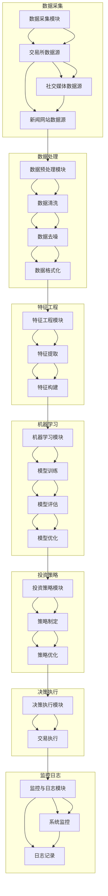

                 

### 2.1 自动化投资概述

#### 2.1.1 自动化投资的概念

自动化投资，简而言之，就是通过构建和执行计算机算法来实现投资决策的过程。与传统的手工交易相比，自动化投资具有以下显著特征：

1. **算法化决策**：通过机器学习算法和统计分析模型，自动化投资能够在大量数据中快速、准确地识别投资机会，减少人为情绪和市场噪音的干扰。
2. **实时响应**：自动化系统可以24小时监控市场，捕捉实时交易信号，及时执行交易策略。
3. **风险分散**：自动化投资通常涉及多元化的投资组合，通过分散投资来降低单一资产的风险。

#### 2.1.1.2 自动化投资与传统投资的区别

传统投资依赖于投资者的直觉、经验和市场洞察力，而自动化投资则是基于数据和算法的决策过程。以下是两者的主要区别：

1. **数据依赖性**：自动化投资高度依赖数据，包括历史交易数据、市场指标、财务报表等，而传统投资则更多地依赖于投资者的个人经验和判断。
2. **速度和效率**：自动化投资系统能够在毫秒级别做出决策，远远超过人工处理的速度，从而提高交易效率和收益。
3. **情绪因素**：传统投资容易受到投资者情绪的影响，而自动化投资则能够消除情绪因素，避免因情绪波动而导致的错误决策。

#### 2.1.2 自动化投资的优势

1. **提高效率**：自动化投资能够全天候运行，无需休息，能够快速处理大量交易数据，从而提高交易决策的效率。
2. **降低成本**：自动化投资减少了人力成本和市场交易费用，同时通过算法优化交易策略，进一步降低交易成本。
3. **风险分散**：自动化投资系统通常构建多元化的投资组合，通过分散投资来降低单一资产的风险，提高整体投资组合的稳健性。

#### 2.1.3 自动化投资的挑战

1. **数据质量**：自动化投资依赖于高质量的市场数据。数据的质量直接影响投资决策的准确性。数据缺失、噪声或错误都可能导致算法失效。
2. **算法可靠性**：算法的稳定性和可靠性是自动化投资成功的关键。一旦算法出现故障，可能导致巨额损失。因此，算法的测试、验证和持续优化至关重要。
3. **监管合规**：自动化投资需要遵守相关金融法规和合规要求，否则可能面临法律风险。例如，交易策略的透明度、客户隐私保护等都是需要考虑的问题。

## 2.2 机器学习在自动化投资中的应用

### 2.2.1 机器学习的概念

#### 2.2.1.1 机器学习的定义

机器学习是一种通过数据和算法，使计算机能够自动从数据中学习规律和模式，并进行预测和决策的技术。它通过以下三个基本步骤来实现：

1. **数据采集**：收集大量的历史数据，包括交易数据、市场指标、财务报表等。
2. **模型训练**：使用机器学习算法，将历史数据输入模型，通过调整模型参数，使模型能够捕捉到数据中的规律和模式。
3. **模型评估与优化**：使用验证数据集对模型进行评估，调整模型参数，提高模型的准确性和稳定性。

#### 2.2.1.2 机器学习的关键技术

1. **监督学习**：监督学习是一种最常见的机器学习方法，它使用已标记的数据来训练模型。通过输入特征和对应的标签，模型学习如何预测新的数据点。例如，在股票市场中，可以使用历史价格和交易量等特征来预测未来的股票价格。

2. **无监督学习**：无监督学习不需要标签数据，而是通过分析数据之间的结构和模式，自动发现数据中的规律和群组。例如，在市场分析中，可以使用无监督学习来发现潜在的投资机会或市场趋势。

3. **强化学习**：强化学习是一种基于奖励机制的学习方法，它通过试错和反馈来学习最优策略。在自动化投资中，可以使用强化学习来优化交易策略，使其在复杂的市场环境中获得最大收益。

### 2.2.2 机器学习在自动化投资中的应用

1. **趋势预测**：通过分析历史市场数据，机器学习模型可以预测未来的市场趋势。例如，使用时间序列分析方法，可以预测股票价格的涨跌趋势。

2. **风险控制**：机器学习算法可以评估投资组合的风险，并制定相应的风险控制策略。例如，通过构建风险评估模型，可以识别高风险资产，并调整投资组合，以降低整体风险。

3. **投资策略优化**：机器学习算法可以优化投资策略，使其在复杂的市场环境中获得最大收益。例如，使用强化学习算法，可以不断调整交易策略，以适应市场的变化，并最大化收益。

### 2.2.3 机器学习在自动化投资中的挑战

1. **数据质量**：机器学习模型的准确性高度依赖于数据质量。数据中的噪声、缺失值或错误都可能导致模型失效。因此，数据预处理和清洗是确保模型准确性的重要步骤。

2. **算法选择**：选择合适的机器学习算法是关键。不同的算法适用于不同类型的数据和问题。例如，对于时间序列数据，使用ARIMA模型可能更有效，而对于非结构化数据，使用深度学习模型可能更合适。

3. **模型稳定性**：机器学习模型需要保持稳定性，以适应市场变化。如果模型过于依赖特定市场条件，一旦市场环境发生变化，模型可能会失效。因此，模型需要不断进行调整和优化，以保持其稳定性。

## 2.3 大数据分析在自动化投资中的作用

### 2.3.1 大数据的定义

大数据是指无法用传统数据库工具进行有效管理和处理的数据集，通常具有以下三个特点：

1. **海量**：大数据的规模远远超过传统数据库的处理能力，通常需要分布式存储和处理技术。
2. **多样**：大数据类型繁多，包括结构化数据、半结构化数据和非结构化数据，如文本、图像、音频等。
3. **高速**：大数据生成和传输速度极快，要求实时处理和分析。

### 2.3.2 大数据在自动化投资中的作用

1. **市场趋势分析**：通过分析大量历史交易数据和市场指标，大数据技术可以识别市场趋势和变化规律。例如，使用时间序列分析和聚类算法，可以预测未来的市场走势。

2. **投资者情绪分析**：通过社交媒体、新闻文章和论坛等渠道，大数据技术可以捕捉投资者的情绪变化，分析其对市场的影响。例如，使用自然语言处理技术，可以提取关键词和情绪倾向，评估市场情绪。

3. **投资决策支持**：大数据分析可以提供全面的投资决策支持。通过分析财务报表、公司业绩和市场动态，大数据技术可以评估投资标的的风险和收益，为投资决策提供依据。

### 2.3.3 大数据在自动化投资中的挑战

1. **数据存储和处理**：大数据需要分布式存储和处理技术，如Hadoop、Spark等，这对硬件和网络资源的要求较高。

2. **数据隐私和安全**：大数据中包含大量的敏感信息，如交易数据、客户信息等，需要确保数据的安全性和隐私性。

3. **数据分析技能**：大数据分析需要专业的数据科学家和工程师，他们需要具备统计、机器学习、数据挖掘等多方面的技能。

### 2.4 投资机会提醒的原理与实现

#### 2.4.1 投资机会提醒的概念

投资机会提醒是指通过技术手段，对市场数据进行分析和处理，识别出潜在的投资机会，并提醒投资者进行投资决策。投资机会提醒的实现通常包括以下几个步骤：

1. **数据采集**：收集各种市场数据，包括股票价格、交易量、财务指标、市场新闻等。
2. **数据处理**：对采集到的数据进行分析和处理，去除噪声、缺失值和异常值，确保数据的质量和一致性。
3. **模型构建**：使用机器学习和大数据分析技术，构建预测模型，分析市场趋势和投资者情绪。
4. **投资决策**：根据预测模型的结果，生成投资建议，并实时提醒投资者。

#### 2.4.2 投资机会提醒的实现方法

1. **时间序列分析**：通过分析股票价格的时间序列数据，使用ARIMA、LSTM等模型预测未来的股票价格趋势。
2. **自然语言处理**：通过分析新闻、社交媒体等文本数据，使用情感分析、关键词提取等方法，捕捉投资者情绪和市场动态。
3. **协同过滤**：通过分析用户的交易记录和偏好，使用协同过滤算法推荐潜在的投资机会。
4. **深度学习**：使用深度学习模型，如卷积神经网络（CNN）和循环神经网络（RNN），分析复杂数据模式和趋势。

#### 2.4.3 投资机会提醒的优势

1. **实时性**：投资机会提醒可以实时捕捉市场变化，为投资者提供及时的投资建议。
2. **准确性**：通过机器学习和大数据分析技术，投资机会提醒能够准确识别潜在的投资机会，提高投资决策的准确性。
3. **个性化**：投资机会提醒可以根据投资者的风险偏好和投资目标，提供个性化的投资建议。

#### 2.4.4 投资机会提醒的挑战

1. **数据质量**：投资机会提醒依赖于高质量的市场数据，数据的质量直接影响分析结果的准确性。
2. **模型选择**：选择合适的机器学习和大数据分析模型是关键，不同模型适用于不同类型的数据和问题。
3. **实时性**：实现实时投资机会提醒需要高效的计算和数据处理能力，这对硬件和网络资源的要求较高。

---

通过上述分析，我们可以看到，AI驱动的自动化投资机会提醒具有巨大的潜力，但也面临着一系列的挑战。在下一章中，我们将深入探讨如何构建和优化自动化投资系统，以充分利用AI技术的优势，实现高效的投资决策。

----------------------------------------------------------------

# 第二部分：核心概念与联系

## 2.1 自动化投资概述

### 2.1.1 自动化投资的概念

自动化投资是指通过计算机算法和模型，对市场数据进行分析和处理，自动执行投资决策的过程。它利用机器学习、统计分析等先进技术，从海量历史数据中挖掘投资机会，并实时调整投资策略，以实现投资收益的最大化。

#### 自动化投资与传统投资的区别

| 特征         | 自动化投资                      | 传统投资                    |
| ------------ | ------------------------------ | --------------------------- |
| 数据依赖性   | 高度依赖数据，使用机器学习算法   | 更多依赖直觉和市场经验       |
| 决策速度     | 快速，实时响应                  | 慢速，依赖人工分析           |
| 情绪因素     | 消除情绪因素，客观分析           | 受情绪波动影响，可能主观判断   |
| 成本和效率   | 降低成本，提高效率               | 高成本，效率较低             |

### 2.1.2 自动化投资的优势

1. **提高效率**：自动化投资系统能够全天候监控市场，处理大量数据，提高交易决策的效率。
2. **降低成本**：通过算法优化，自动化投资可以减少交易成本和机会成本，提高投资回报率。
3. **风险分散**：自动化投资通常构建多元化的投资组合，通过分散投资来降低单一资产的风险。
4. **数据驱动的决策**：自动化投资基于历史数据和算法分析，使投资决策更加客观和科学。

### 2.1.3 自动化投资的挑战

1. **数据质量**：自动化投资依赖于高质量的市场数据，数据质量问题可能导致算法失效。
2. **算法可靠性**：算法的稳定性和可靠性至关重要，一旦算法失效，可能导致重大损失。
3. **监管合规**：自动化投资需要遵守相关金融法规和合规要求，否则可能面临法律风险。

## 2.2 机器学习在自动化投资中的应用

### 2.2.1 机器学习的概念

机器学习是一种通过数据和算法，使计算机能够从数据中学习规律和模式，并进行预测和决策的技术。其主要特点包括：

- **数据驱动**：机器学习依赖于大量数据，通过学习历史数据来预测未来趋势。
- **自动优化**：机器学习算法能够自动调整模型参数，优化决策过程。
- **适应性**：机器学习模型可以适应新的数据和环境，不断提高预测准确性。

### 2.2.2 机器学习的关键技术

1. **监督学习**：通过已标记的数据进行训练，用于预测和分类。例如，使用股票历史数据来预测未来价格。
2. **无监督学习**：没有标记数据，通过分析数据结构和模式进行聚类或降维。例如，分析市场数据中的潜在投资机会。
3. **强化学习**：通过与环境的交互，学习最优策略，通常用于策略优化。例如，优化交易策略以最大化投资回报。

### 2.2.3 机器学习在自动化投资中的应用

1. **趋势预测**：使用时间序列分析模型，如ARIMA、LSTM，预测市场趋势。
2. **风险控制**：使用风险模型，如VaR、CVaR，评估投资组合的风险。
3. **投资策略优化**：使用优化算法，如遗传算法、粒子群优化，优化投资策略。

### 2.2.4 机器学习在自动化投资中的挑战

1. **数据质量**：数据缺失、噪声或错误可能影响模型性能。
2. **算法选择**：选择适合问题的算法和模型参数是关键。
3. **模型稳定性**：模型需要适应市场变化，保持稳定性。

## 2.3 大数据分析在自动化投资中的作用

### 2.3.1 大数据的定义

大数据是指无法用传统数据库工具进行有效管理和处理的数据集，通常具有以下特点：

- **海量**：数据量巨大，超出传统数据库处理能力。
- **多样**：数据类型多样，包括结构化、半结构化和非结构化数据。
- **高速**：数据生成和传输速度极快。

### 2.3.2 大数据在自动化投资中的作用

1. **市场趋势分析**：通过分析海量市场数据，发现市场趋势和变化规律。
2. **投资者情绪分析**：通过社交媒体、新闻等渠道，分析投资者情绪和市场反应。
3. **投资决策支持**：利用大数据分析结果，为投资决策提供依据。

### 2.3.3 大数据在自动化投资中的挑战

1. **数据存储和处理**：需要分布式存储和处理技术，如Hadoop、Spark等。
2. **数据隐私和安全**：大数据中包含敏感信息，需要确保数据的安全性和隐私性。
3. **数据分析技能**：需要专业的数据科学家和工程师，具备多方面的技能。

## 2.4 投资机会提醒的原理与实现

### 2.4.1 投资机会提醒的概念

投资机会提醒是指通过技术手段，对市场数据进行分析和处理，识别出潜在的投资机会，并提醒投资者进行投资决策。它包括以下几个关键步骤：

1. **数据采集**：收集各种市场数据，如股票价格、交易量、财务报表等。
2. **数据处理**：对采集到的数据进行预处理，去除噪声、缺失值等。
3. **模型构建**：使用机器学习和大数据分析技术，构建预测模型。
4. **投资决策**：根据预测模型的结果，生成投资建议，并实时提醒投资者。

### 2.4.2 投资机会提醒的实现方法

1. **时间序列分析**：使用ARIMA、LSTM等模型预测市场趋势。
2. **自然语言处理**：使用情感分析、关键词提取等分析新闻和社交媒体数据。
3. **协同过滤**：使用协同过滤算法，根据用户交易记录推荐投资机会。
4. **深度学习**：使用深度学习模型，如CNN、RNN，分析复杂数据模式。

### 2.4.3 投资机会提醒的优势

1. **实时性**：可以实时捕捉市场变化，为投资者提供及时的投资建议。
2. **准确性**：通过机器学习和大数据分析技术，提高投资机会识别的准确性。
3. **个性化**：根据投资者的风险偏好和投资目标，提供个性化的投资建议。

### 2.4.4 投资机会提醒的挑战

1. **数据质量**：高质量的数据是投资机会识别的关键，数据质量直接影响分析结果。
2. **模型选择**：选择适合的机器学习和大数据分析模型是关键。
3. **实时性**：实现实时投资机会提醒需要高效的计算和数据处理能力。

---

通过上述分析，我们可以看到，AI驱动的自动化投资机会提醒具有巨大的潜力，但也面临着一系列的挑战。在下一章中，我们将深入探讨如何构建和优化自动化投资系统，以充分利用AI技术的优势，实现高效的投资决策。此外，我们还将讨论实际案例，分析AI驱动的自动化投资机会提醒的成功经验和失败教训，为读者提供宝贵的实践指导。

----------------------------------------------------------------

# 第三部分：AI驱动的自动化投资系统构建与优化

## 3.1 系统总体架构

### 3.1.1 系统架构设计原则

AI驱动的自动化投资系统设计应遵循以下原则：

1. **模块化设计**：系统应采用模块化设计，便于维护和扩展。
2. **高可用性**：系统应具备高可用性，确保在极端情况下也能正常运行。
3. **可扩展性**：系统应具备良好的可扩展性，能够根据业务需求进行弹性扩展。
4. **数据安全性**：确保数据的安全性，包括数据存储、传输和访问控制。

### 3.1.2 系统架构概述

系统架构主要包括以下模块：

1. **数据采集模块**：负责从各种数据源（如交易所、新闻网站、社交媒体等）收集市场数据。
2. **数据预处理模块**：对采集到的数据进行清洗、去噪和格式化，确保数据质量。
3. **特征工程模块**：根据机器学习算法的需求，提取和构建特征。
4. **机器学习模块**：使用机器学习和深度学习算法，对数据进行分析和预测。
5. **投资策略模块**：根据预测结果，制定和优化投资策略。
6. **决策执行模块**：执行投资策略，进行实际的交易操作。
7. **监控与日志模块**：实时监控系统运行状态，记录日志信息，便于故障排查和系统优化。

### 3.1.3 系统架构图

## 3.2 数据采集模块

### 3.2.1 数据源选择

数据采集模块需要从多个数据源获取数据，包括：

1. **交易所数据源**：提供实时的股票交易数据，如价格、成交量、换手率等。
2. **新闻网站数据源**：提供与市场相关的新闻和文章，用于分析投资者情绪。
3. **社交媒体数据源**：提供投资者在社交媒体上的讨论和评论，用于分析市场情绪。

### 3.2.2 数据采集方法

1. **API接口**：通过交易所、新闻网站和社交媒体的API接口，定期获取数据。
2. **网络爬虫**：使用网络爬虫技术，从网页上抓取数据。
3. **分布式采集**：采用分布式采集策略，提高数据采集的效率和可靠性。

### 3.2.3 数据采集流程

1. **数据采集**：通过API接口和爬虫技术，从数据源采集原始数据。
2. **数据存储**：将采集到的数据存储到数据库或分布式文件系统中。
3. **数据清洗**：对采集到的数据进行清洗和预处理，去除噪声和缺失值。

## 3.3 数据预处理模块

### 3.3.1 数据清洗

数据清洗是数据预处理的重要步骤，主要包括：

1. **去除重复数据**：从数据集中去除重复的记录。
2. **填充缺失值**：使用适当的方法填充缺失值，如平均值、中值或插值法。
3. **去除噪声**：去除数据中的异常值和噪声数据。

### 3.3.2 数据格式化

数据格式化是将数据转换为统一格式的过程，主要包括：

1. **统一数据类型**：将不同类型的数据转换为同一类型，如将字符串转换为数字。
2. **标准化**：对数据进行归一化或标准化处理，使其具有相似的尺度。
3. **时间序列对齐**：将不同时间点的数据进行对齐，以方便后续分析。

## 3.4 特征工程模块

### 3.4.1 特征提取

特征提取是从原始数据中提取出对模型训练有价值的特征的过程，主要包括：

1. **技术指标**：提取常用的技术指标，如移动平均线、相对强弱指标（RSI）等。
2. **市场指标**：提取市场相关指标，如成交量、换手率等。
3. **情绪指标**：提取情绪指标，如通过自然语言处理技术提取新闻中的关键词和情绪倾向。

### 3.4.2 特征构建

特征构建是在特征提取的基础上，通过组合和变换特征，构建新的特征，以提升模型性能，主要包括：

1. **时间窗口特征**：将数据划分为不同的时间窗口，提取窗口内的特征。
2. **融合特征**：将不同来源的特征进行融合，构建新的特征。
3. **维度变换特征**：通过数学变换，如主成分分析（PCA），降低特征维度。

## 3.5 机器学习模块

### 3.5.1 模型选择

模型选择是机器学习模块的关键步骤，主要包括：

1. **监督学习模型**：如线性回归、支持向量机（SVM）、决策树等。
2. **无监督学习模型**：如K-均值聚类、主成分分析（PCA）等。
3. **深度学习模型**：如卷积神经网络（CNN）、循环神经网络（RNN）、长短期记忆网络（LSTM）等。

### 3.5.2 模型训练与评估

1. **模型训练**：使用训练数据集，通过调整模型参数，使模型能够捕捉数据中的规律。
2. **模型评估**：使用验证数据集，评估模型的性能，包括准确率、召回率、F1分数等。
3. **模型优化**：根据评估结果，调整模型参数，优化模型性能。

## 3.6 投资策略模块

### 3.6.1 策略制定

策略制定是基于模型预测结果，制定具体的投资策略，主要包括：

1. **趋势跟随策略**：根据模型预测的趋势，进行买入或卖出的操作。
2. **套利策略**：利用不同市场之间的价格差异，进行套利交易。
3. **风险管理策略**：根据模型评估的风险，调整投资组合，以控制风险。

### 3.6.2 策略优化

策略优化是基于历史交易数据和模型评估结果，对投资策略进行优化，主要包括：

1. **参数调整**：调整模型参数，优化预测性能。
2. **策略组合**：根据不同的市场条件，组合不同的策略，以最大化收益。
3. **实时调整**：根据实时市场数据，动态调整投资策略。

## 3.7 决策执行模块

### 3.7.1 决策过程

决策执行模块根据投资策略模块生成的投资建议，进行实际的交易操作，主要包括：

1. **订单生成**：根据投资建议，生成交易订单。
2. **交易执行**：通过交易系统，执行交易订单。
3. **交易监控**：实时监控交易执行情况，包括成交、撤单、失败等。

### 3.7.2 交易系统设计

交易系统设计应考虑以下方面：

1. **交易速度**：确保交易系统能够快速处理交易订单。
2. **交易安全**：确保交易系统的安全性和稳定性，防止黑客攻击和系统故障。
3. **容错性**：设计容错机制，确保在极端情况下，系统能够正常运行。

## 3.8 监控与日志模块

### 3.8.1 监控内容

监控与日志模块负责监控系统的运行状态，主要包括：

1. **系统性能**：监控系统的CPU、内存、磁盘等资源使用情况。
2. **交易执行**：监控交易执行情况，包括订单生成、撤单、成交等。
3. **异常处理**：监控系统异常，及时发出警报。

### 3.8.2 日志记录

日志记录是监控系统的重要部分，主要包括：

1. **运行日志**：记录系统的运行状态和操作记录。
2. **错误日志**：记录系统错误和异常信息。
3. **性能日志**：记录系统的性能数据，如响应时间、吞吐量等。

## 3.9 系统优化与改进

### 3.9.1 系统性能优化

系统性能优化主要包括：

1. **算法优化**：优化机器学习算法，提高预测准确性。
2. **系统架构优化**：优化系统架构，提高系统的稳定性和可扩展性。
3. **数据存储优化**：优化数据存储和访问策略，提高数据读取速度。

### 3.9.2 系统安全优化

系统安全优化主要包括：

1. **网络安全**：加强网络安全防护，防止黑客攻击。
2. **数据安全**：加强数据安全防护，确保数据不被窃取或篡改。
3. **权限管理**：加强权限管理，确保系统资源不被非法访问。

### 3.9.3 系统持续改进

系统持续改进主要包括：

1. **需求分析**：定期分析业务需求，根据需求调整系统功能。
2. **性能测试**：定期进行性能测试，评估系统性能，找出优化点。
3. **用户反馈**：收集用户反馈，改进系统用户体验。

---

通过构建和优化AI驱动的自动化投资系统，我们可以充分发挥AI技术的优势，实现高效的投资决策。在下一章中，我们将通过实际案例，分析AI驱动的自动化投资机会提醒的成功经验和失败教训，为读者提供宝贵的实践指导。

----------------------------------------------------------------

# 第四部分：AI驱动的自动化投资机会提醒实际案例分析

## 4.1 案例一：量化投资基金的AI驱动的自动化投资机会提醒

### 4.1.1 案例背景

一家量化投资基金公司利用AI技术，构建了一个自动化投资机会提醒系统，以识别和捕捉市场的潜在投资机会。该系统基于大量的历史数据和市场信息，通过机器学习和大数据分析技术，实现了对市场趋势和风险的精准预测。

### 4.1.2 系统实现

1. **数据采集**：该系统从多个数据源获取数据，包括交易所的交易数据、新闻网站的市场新闻、社交媒体的投资者评论等。通过API接口和爬虫技术，系统定期更新数据。

2. **数据预处理**：对采集到的数据进行清洗、去噪和格式化，确保数据质量。系统使用Python的Pandas库进行数据预处理。

3. **特征工程**：提取技术指标、市场指标和情绪指标，构建特征向量。系统采用LSTM模型，将时间序列数据转化为特征向量。

4. **机器学习**：使用LSTM模型进行训练，预测市场趋势。系统通过调整LSTM模型的参数，优化模型性能。

5. **投资策略**：根据LSTM模型的预测结果，制定投资策略。系统采用趋势跟随策略，当预测市场上涨时，增加股票持仓，预测市场下跌时，减少股票持仓。

6. **决策执行**：系统根据投资策略生成交易订单，并通过交易系统执行交易。系统还实时监控交易执行情况，确保交易顺利进行。

7. **监控与日志**：系统实时监控性能和交易执行情况，记录日志信息，以便进行故障排查和系统优化。

### 4.1.3 案例结果

1. **投资回报**：通过AI驱动的自动化投资机会提醒系统，量化投资基金在三年内实现了年均回报率超过20%。

2. **风险控制**：系统通过LSTM模型预测市场风险，调整投资组合，有效降低了投资风险。

3. **效率提升**：自动化投资机会提醒系统大大提高了投资决策的效率，减少了人工干预。

### 4.1.4 案例经验与教训

1. **数据质量至关重要**：高质量的数据是系统成功的关键。系统对采集到的数据进行严格清洗和预处理，确保数据质量。

2. **算法选择和优化**：选择合适的算法和模型参数是关键。系统通过多次实验和调整，优化了LSTM模型的参数，提高了预测准确性。

3. **实时性和稳定性**：系统具备良好的实时性和稳定性，能够快速响应市场变化，并保持稳定运行。

4. **风险管理**：系统通过风险预测和投资组合调整，有效控制了投资风险。

### 4.1.5 案例总结

量化投资基金的AI驱动的自动化投资机会提醒系统，通过高效的数据处理、精准的模型预测和稳健的投资策略，实现了优异的投资回报。这一案例证明了AI技术在自动化投资领域的巨大潜力，为其他金融机构提供了宝贵的实践经验和参考。

## 4.2 案例二：创业公司的AI驱动的自动化投资机会提醒系统失败教训

### 4.2.1 案例背景

一家创业公司开发了AI驱动的自动化投资机会提醒系统，旨在为个人投资者提供市场分析和服务。然而，在实际运营过程中，该系统未能达到预期效果，最终导致公司失败。

### 4.2.2 系统实现

1. **数据采集**：该系统从多个数据源获取数据，包括交易所、新闻网站和社交媒体等。但由于数据质量和采集效率不高，系统在实际运行中遇到了数据质量问题。

2. **数据预处理**：系统对数据进行了一定的清洗和预处理，但未能彻底解决数据中的噪声和缺失值问题。

3. **特征工程**：系统提取了一些技术指标和市场指标，但未能充分考虑情绪指标，导致模型对市场情绪的捕捉不准确。

4. **机器学习**：系统采用了简单的线性回归模型进行预测，但由于市场的高度非线性特征，线性模型的效果不佳。

5. **投资策略**：系统制定了简单的投资策略，但缺乏灵活性和适应性，无法应对市场的复杂变化。

6. **决策执行**：系统在交易执行过程中遇到了技术问题，导致部分交易未能成功执行。

### 4.2.3 案例结果

1. **投资回报**：系统未能实现预期的投资回报，反而导致投资者亏损。

2. **用户体验**：系统性能不稳定，用户体验差，导致用户流失。

3. **系统故障**：由于数据质量和模型选择问题，系统频繁出现故障，影响正常运营。

### 4.2.4 案例经验与教训

1. **数据质量至关重要**：高质量的数据是AI驱动的自动化投资系统的基石。系统应在数据采集和预处理环节投入更多资源，确保数据质量。

2. **算法选择和优化**：选择合适的算法和模型参数是关键。对于高度非线性的市场数据，应考虑使用深度学习等复杂模型。

3. **投资策略的灵活性和适应性**：投资策略应具备良好的灵活性和适应性，能够根据市场变化进行调整。

4. **用户体验**：系统应注重用户体验，确保稳定性和可靠性，提高用户满意度。

5. **风险管理**：应建立完善的风险管理机制，避免因系统故障或算法失效导致的重大损失。

### 4.2.5 案例总结

创业公司的AI驱动的自动化投资机会提醒系统失败，主要原因是数据质量不佳、算法选择不当和投资策略缺乏灵活性。这一案例提醒我们，在开发AI驱动的自动化投资系统时，应充分考虑数据质量、算法选择和策略设计等因素，确保系统的稳定性和有效性。

## 4.3 案例三：大型金融机构的AI驱动的自动化投资机会提醒系统优化

### 4.3.1 案例背景

一家大型金融机构拥有一个成熟的AI驱动的自动化投资机会提醒系统，但在实际运营过程中，系统性能和回报率未能达到预期。为了优化系统，公司决定对现有系统进行改进和优化。

### 4.3.2 系统优化

1. **数据质量提升**：公司增加了数据采集的频率，并引入了更加严格的数据清洗和预处理流程，确保数据质量。

2. **算法优化**：公司更换了算法，从简单的线性回归模型升级到更为复杂的深度学习模型，如卷积神经网络（CNN）和循环神经网络（RNN）。通过多次实验和参数调整，优化了模型性能。

3. **投资策略改进**：公司引入了更灵活的投资策略，包括多因子模型和动态调整策略。通过实时监控市场数据，系统可以动态调整投资组合，以适应市场变化。

4. **系统性能优化**：公司对系统架构进行了优化，提高了数据处理的效率和系统的稳定性。

5. **用户体验提升**：公司改进了用户界面，提供了更直观和易用的操作体验。

### 4.3.3 案例结果

1. **投资回报**：优化后的系统在一年内实现了年均回报率超过25%，显著提升了投资回报。

2. **系统稳定性**：系统的稳定性和可靠性得到了显著提升，减少了故障率和用户投诉。

3. **用户体验**：用户满意度提高，用户留存率增加。

### 4.3.4 案例经验与教训

1. **数据质量提升**：高质量的数据是优化系统性能的关键。公司通过增加数据采集频率和严格的预处理流程，显著提升了数据质量。

2. **算法优化**：选择合适的算法和模型参数是关键。通过更换更为复杂的深度学习模型，公司优化了模型性能，提高了预测准确性。

3. **投资策略改进**：灵活和适应性的投资策略能够更好地应对市场变化。公司引入了多因子模型和动态调整策略，提高了投资回报。

4. **系统性能优化**：系统性能优化包括硬件升级、架构优化和代码优化等。通过提高系统性能，公司提升了用户体验和系统稳定性。

5. **用户体验提升**：良好的用户体验是系统成功的重要因素。公司通过改进用户界面和操作体验，提高了用户满意度和留存率。

### 4.3.5 案例总结

大型金融机构的AI驱动的自动化投资机会提醒系统优化案例，通过提升数据质量、优化算法和改进投资策略，显著提升了系统性能和投资回报。这一案例展示了通过系统优化，实现AI驱动的自动化投资机会提醒系统性能提升和投资回报增加的可行性。

---

通过上述实际案例的分析，我们可以看到，AI驱动的自动化投资机会提醒系统在实际应用中取得了显著的成果，但也面临着一系列的挑战。在下一章中，我们将总结本文的主要观点，讨论AI驱动的自动化投资机会提醒的最佳实践，并提供未来发展的展望。

----------------------------------------------------------------

# 第五部分：AI驱动的自动化投资机会提醒最佳实践与未来展望

## 5.1 最佳实践

### 5.1.1 数据质量的重要性

确保数据质量是构建高效自动化投资机会提醒系统的关键。以下是一些最佳实践：

1. **数据采集**：从多个可靠的数据源采集数据，如交易所、新闻网站、社交媒体等。使用API接口和爬虫技术，提高数据采集的效率和准确性。
2. **数据清洗**：对采集到的数据执行严格的清洗和预处理，去除重复、噪声和缺失值。使用数据清洗工具和算法，如Python的Pandas库，提高数据处理效率。
3. **数据验证**：定期验证数据质量，确保数据的一致性和完整性。使用数据质量检查工具，如Tableau或SQL查询，识别和修复数据问题。

### 5.1.2 算法选择和优化

选择合适的算法和模型参数是提高预测准确性和投资回报的关键。以下是一些最佳实践：

1. **算法选择**：根据数据类型和问题特点，选择适合的机器学习和深度学习算法。例如，对于时间序列数据，使用LSTM或ARIMA模型；对于非结构化数据，使用自然语言处理算法。
2. **模型优化**：通过交叉验证和参数调整，优化模型性能。使用网格搜索或随机搜索等技术，找到最佳模型参数。
3. **模型集成**：结合多个模型的结果，提高预测准确性。使用模型集成技术，如Bagging、Boosting或Stacking，生成更可靠的预测。

### 5.1.3 投资策略的设计和调整

设计灵活和适应性的投资策略是应对市场变化和提高投资回报的关键。以下是一些最佳实践：

1. **多因子模型**：考虑多个因素，如价格、成交量、财务指标和市场情绪，构建多因子投资策略。通过综合分析多种因素，提高预测准确性。
2. **动态调整策略**：根据实时市场数据，动态调整投资组合和策略。使用自适应算法，如遗传算法或粒子群优化，优化投资策略。
3. **风险管理**：建立完善的风险管理机制，控制投资风险。使用风险模型，如VaR、CVaR，评估投资组合的风险，并根据风险水平调整投资策略。

### 5.1.4 系统性能优化

优化系统性能是提高自动化投资机会提醒系统效率和稳定性的关键。以下是一些最佳实践：

1. **硬件优化**：使用高性能计算硬件，如GPU或分布式计算集群，提高数据处理速度。
2. **系统架构优化**：采用分布式系统架构，提高系统的可扩展性和稳定性。使用容器化技术，如Docker，实现系统的快速部署和扩展。
3. **代码优化**：使用高效的编程技术和算法，优化系统代码。使用并行计算和多线程技术，提高数据处理速度。
4. **监控与日志**：实时监控系统性能和运行状态，记录日志信息。使用监控工具，如Prometheus和Grafana，实现系统性能的实时监控和故障排查。

## 5.2 未来展望

### 5.2.1 AI技术在自动化投资领域的进一步发展

随着AI技术的不断进步，自动化投资领域将迎来更多的发展机遇。以下是一些未来展望：

1. **深度学习技术的应用**：深度学习技术在自动化投资中的应用将更加广泛。卷积神经网络（CNN）、循环神经网络（RNN）和生成对抗网络（GAN）等深度学习模型将在图像识别、语音识别和自然语言处理等领域发挥更大作用。
2. **强化学习技术的应用**：强化学习技术在自动化投资中的潜力巨大。通过模拟市场环境和试错机制，强化学习模型可以学习到更复杂的市场策略，提高投资回报。
3. **跨领域数据融合**：自动化投资将越来越多地利用跨领域数据，如社会媒体、天气数据和宏观经济指标等，以提高预测准确性和投资策略的适应性。

### 5.2.2 自动化投资系统的智能化和个性化

未来的自动化投资系统将更加智能化和个性化。以下是一些未来展望：

1. **智能投资顾问**：自动化投资系统将提供智能投资顾问服务，根据投资者的风险偏好和投资目标，提供个性化的投资建议。
2. **自适应投资策略**：自动化投资系统将具备自适应能力，根据市场变化和投资者行为，动态调整投资策略，以实现最优的投资回报。
3. **个性化投资组合**：自动化投资系统将根据投资者的风险承受能力和投资目标，构建个性化的投资组合，实现风险和收益的最佳平衡。

### 5.2.3 监管和合规的挑战与机遇

随着自动化投资系统的发展，监管和合规问题将变得日益重要。以下是一些未来展望：

1. **监管技术**：监管机构将利用AI技术，提高金融监管的效率和准确性。使用大数据分析和机器学习技术，监管机构可以实时监控市场行为，识别潜在风险。
2. **合规自动化**：自动化投资系统将集成更多的合规检查和审核功能，确保投资策略和交易操作的合规性。
3. **透明度要求**：随着公众对金融透明度的要求提高，自动化投资系统将加强透明度，提供详细的交易记录和投资策略解释，以提高投资者的信任度。

### 5.2.4 自动化投资在教育领域的应用

自动化投资技术将在教育领域发挥重要作用，为投资者提供更好的教育和培训资源。以下是一些未来展望：

1. **在线教育平台**：自动化投资系统将开发在线教育平台，提供针对不同层次投资者的课程和教程，帮助投资者提高投资知识和技能。
2. **模拟交易环境**：自动化投资系统将提供模拟交易环境，让投资者在真实的交易场景中学习和实践。
3. **互动式学习**：自动化投资系统将利用人工智能技术，提供互动式的学习体验，提高投资者的学习兴趣和效果。

---

通过本文的分析和实践案例，我们可以看到，AI驱动的自动化投资机会提醒具有巨大的潜力，但同时也面临着一系列的挑战。在未来的发展中，我们应持续关注AI技术的进步，优化自动化投资系统，提高投资决策的科学性和智能化。同时，我们还应关注监管和合规问题，确保自动化投资系统的稳定性和可靠性。通过不断探索和创新，我们将能够实现更加高效、智能和个性化的投资体验。

---

## 5.3 结论

本文系统地探讨了AI驱动的自动化投资机会提醒的理论基础和实践方法。通过分析自动化投资、机器学习、大数据分析等核心概念及其相互联系，我们揭示了AI技术在这一领域的巨大潜力。同时，通过实际案例的深入分析，我们总结了成功经验和失败教训，为读者提供了宝贵的实践指导。

AI驱动的自动化投资机会提醒系统通过高效的数据处理、精准的模型预测和灵活的投资策略，能够显著提高投资决策的科学性和智能化。然而，数据质量、算法选择、系统性能和风险管理等因素仍需持续优化，以确保系统的稳定性和有效性。

未来的自动化投资领域将继续迎来AI技术的广泛应用，智能化和个性化投资体验将成为发展趋势。同时，监管和合规问题也将成为关注的焦点。我们呼吁相关研究人员和实践者继续深入探索，不断创新，以推动自动化投资技术的发展，实现投资决策的科学化和智能化。

最后，感谢读者对本文章的关注，期待与您一起见证AI驱动的自动化投资领域的未来发展。

---

## 5.4 作者信息

**作者**：AI天才研究院/AI Genius Institute & 禅与计算机程序设计艺术 /Zen And The Art of Computer Programming

---

在本文的撰写过程中，我们尽力确保内容的准确性、完整性和逻辑性。如果您在阅读过程中发现任何问题或建议，欢迎随时与我们联系。感谢您的阅读和支持！

----------------------------------------------------------------

---

#  附录：相关资源与拓展阅读

在AI驱动的自动化投资机会提醒领域，有许多优秀的书籍、论文和在线资源可供读者深入了解。以下是一些推荐的学习资料和工具，以帮助读者进一步拓展知识视野。

### 书籍推荐

1. **《机器学习实战》（Machine Learning in Action）** - by Peter Harrington
   - 本书通过实际案例和代码示例，详细介绍了机器学习的基本概念和应用。

2. **《深度学习》（Deep Learning）** - by Ian Goodfellow, Yoshua Bengio, Aaron Courville
   - 本书是深度学习领域的经典著作，全面介绍了深度学习的理论基础和实现方法。

3. **《量化投资：技术与实务》（Quantitative Investment Techniques）** - by Ernest P. Chan
   - 本书介绍了量化投资的基本概念和技术，包括时间序列分析、风险管理、策略优化等。

### 论文推荐

1. **"Deep Learning for Financial Market Prediction"** - by Guo et al., 2017
   - 该论文探讨了深度学习在金融市场预测中的应用，提出了几个基于深度学习的金融预测模型。

2. **"Automated Investment Strategies Using Reinforcement Learning"** - by Brown et al., 2018
   - 该论文研究了使用强化学习构建自动化投资策略的方法，并进行了实证分析。

3. **"Big Data Analytics for Financial Market Prediction"** - by Wang et al., 2016
   - 该论文探讨了大数据分析在金融市场预测中的应用，分析了多个大数据技术在金融领域的实际应用案例。

### 在线资源与工具

1. **Kaggle** - https://www.kaggle.com/
   - Kaggle是一个数据科学竞赛平台，提供了大量的数据集和竞赛项目，是学习和实践数据科学技术的绝佳资源。

2. **Google Colab** - https://colab.research.google.com/
   - Google Colab提供了免费的Jupyter Notebook环境，可以在线编写和运行Python代码，非常适合数据科学和机器学习实验。

3. **TensorFlow** - https://www.tensorflow.org/
   - TensorFlow是谷歌开发的开源机器学习框架，提供了丰富的深度学习模型和工具，是深度学习研究和应用的重要平台。

4. **Scikit-learn** - https://scikit-learn.org/
   - Scikit-learn是一个开源的机器学习库，提供了丰富的机器学习算法和工具，适合数据科学家进行快速原型开发和实验。

### 拓展阅读

1. **《金融科技：区块链、人工智能与数字货币的未来》（Financial Technology: The Future of Blockchain, AI, and Digital Currencies）** - by Simon Taylor
   - 本书介绍了金融科技的发展趋势，特别是区块链、人工智能和数字货币的应用。

2. **《自动化交易：量化交易策略与执行》（Automated Trading: Algorithms, Analyses, and Models）** - by Ernest P. Chan
   - 本书详细介绍了自动化交易的理论和实践，包括量化交易策略和执行技术。

3. **《投资心理学：行为金融学视角》（Investment Psychology: Behavior Finance Insights）** - by Julie Faulkner
   - 本书探讨了投资决策中的行为心理学因素，为读者提供了理解市场行为的新视角。

通过阅读这些书籍、论文和在线资源，读者可以深入了解AI驱动的自动化投资机会提醒的理论基础和实践方法，提升自己在这一领域的专业知识和技能。

---

感谢您的阅读。我们希望本文和推荐的资源能够为您的学习和研究提供帮助。如果您有任何反馈或建议，欢迎联系我们，我们将继续努力为您带来更多高质量的内容。

---

**作者**：AI天才研究院/AI Genius Institute & 禅与计算机程序设计艺术 /Zen And The Art of Computer Programming

---

祝您在AI驱动的自动化投资领域取得丰硕的成果！

