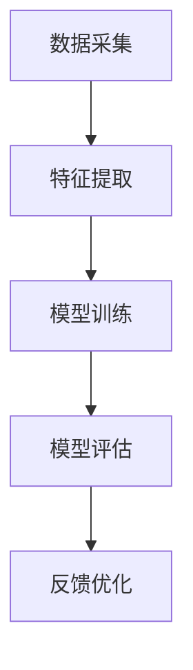
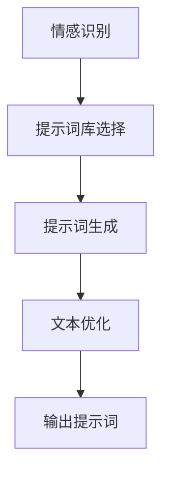
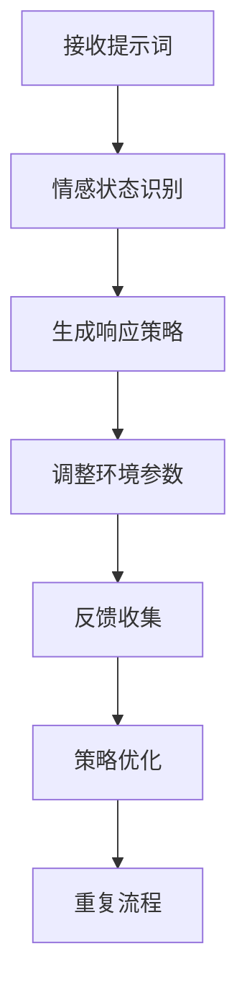

                 

### 引言

在当今快速发展的科技时代，智能家居已经成为人们日常生活中不可或缺的一部分。从智能照明、智能音响到智能安防系统，智能家居的普及使得我们的生活变得更加便捷和舒适。然而，随着技术的进步，人们对智能家居的期望也在不断提升，不再仅仅满足于简单的自动化控制，而是希望家居系统能够更智能、更懂用户，能够根据用户的情感状态做出相应的调整和响应。这种基于情感计算的技术，正是我们今天要深入探讨的主题。

本文的标题是《提示词工程在智能家居情感计算中的应用：创造情感响应型生活环境》。关键词包括“提示词工程”、“智能家居”、“情感计算”和“情感响应型生活环境”。通过本文的阅读，我们将了解到：

1. **提示词工程的基本概念**：提示词工程是什么，它如何帮助构建情感响应型生活环境。
2. **情感计算的核心原理**：情感计算的定义、核心概念以及与传统智能家居的区别。
3. **情感响应型智能生活环境的设计**：如何设计一个能够根据用户情感状态调整的智能家居系统。
4. **核心技术**：情感识别算法、提示词生成算法和情感响应模块的具体实现方法。
5. **项目实战**：通过实际案例解析，了解这些技术如何在真实项目中应用。
6. **最佳实践与总结**：总结提示词工程在智能家居情感计算中的应用技巧和未来展望。

在接下来的章节中，我们将一步一步地探讨这些主题，旨在为读者提供一个清晰、易懂且具有实用价值的技术博客。让我们一起深入探讨这一激动人心的领域，探索如何利用提示词工程和情感计算，为我们的智能家居生活带来全新的变革。

### 关键词

1. **提示词工程**：提示词工程是一种利用提示词来指导自然语言生成的方法，它通过设计特定的提示词来引导模型生成符合预期的内容。在智能家居情感计算中，提示词工程用于生成用户情感状态相关的提示词，从而指导智能家居系统进行相应的情感响应。

2. **智能家居**：智能家居是指利用网络技术和智能设备，实现对家庭环境和家电设备的自动化管理和控制，以提升居住舒适度和安全性。随着人工智能技术的发展，智能家居逐渐具备了情感计算能力，能够更好地理解用户的情感状态，提供个性化的服务。

3. **情感计算**：情感计算是一种人工智能技术，旨在使计算机能够理解和处理人类的情感状态。在智能家居中，情感计算用于识别用户情感，并根据这些情感做出相应的反应，从而提供更加智能和人性化的家居体验。

4. **情感响应型生活环境**：情感响应型生活环境是指能够根据用户的情感状态自动调整其环境参数（如光线、音乐、温度等）的家居环境。这种生活环境利用情感计算技术，通过识别用户的情感状态，自动做出调整，以提升用户的生活质量和幸福感。

5. **算法**：在本文中，提到的算法主要包括情感识别算法、提示词生成算法和情感响应算法。这些算法是情感计算系统实现的核心技术，分别用于识别用户的情感状态、生成情感相关的提示词以及根据情感状态调整家居环境。

### 摘要

本文旨在探讨提示词工程在智能家居情感计算中的应用，以创建一个情感响应型生活环境。首先，我们介绍了智能家居的发展背景和情感计算的重要性，并定义了提示词工程的基本概念和其在智能家居中的潜在应用。接着，我们详细阐述了情感计算的核心原理，包括情感识别、情感分析和情感生成的概念，并探讨了情感计算与传统智能家居的区别。随后，我们深入探讨了提示词工程的基本原理，包括提示词的生成、分类和优化方法。在此基础上，我们提出了设计情感响应型智能生活环境的目标和原则，并详细介绍了系统功能模块和架构设计。

在核心技术部分，我们介绍了情感识别算法、提示词生成算法和情感响应模块的工作原理，并通过Python代码示例展示了这些算法的实现。最后，我们通过两个实际案例，解析了提示词工程在智能照明系统和智能音响中的应用，并总结了最佳实践和注意事项。本文为开发情感响应型智能家居系统提供了理论指导和实践参考，有助于推动智能家居技术的进一步发展。

## 第一部分：背景介绍

### 第1章 问题背景

#### 1.1 智能家居的发展

智能家居技术起源于20世纪90年代，最初以网络化的家电产品为核心，旨在通过远程控制提升家居设备的便利性。进入21世纪后，随着物联网（IoT）和人工智能（AI）技术的迅猛发展，智能家居逐渐从简单的远程控制迈向更为智能和人性化的阶段。目前，智能家居系统已涵盖照明、安防、温控、音响、家电等多个领域，实现了设备之间的互联互通，为用户提供了全方位的家居智能化解决方案。

#### 1.2 情感计算的重要性

情感计算作为人工智能的一个重要分支，专注于使计算机能够识别、理解并模拟人类情感。在智能家居领域，情感计算的重要性日益凸显。首先，情感计算能够实现更精准的用户情感识别，为家居设备提供个性化的服务。例如，通过识别用户的情绪状态，智能灯光系统能自动调节亮度，创造适宜的照明环境，提升用户的舒适度。其次，情感计算有助于提高智能家居的安全性和可靠性。例如，智能安防系统能通过识别入侵者的情绪变化，及时发出警报，保障用户的安全。此外，情感计算还可以为智能家居带来更多的增值服务，如情感化的语音助手、个性化的娱乐推荐等，从而提升用户的整体生活体验。

#### 1.3 提示词工程的基本概念

提示词工程是一种利用提示词来指导自然语言生成的方法。在人工智能领域中，提示词工程主要用于生成符合预期内容的高质量文本。具体而言，提示词工程通过设计特定的提示词，引导模型生成相关内容。这些提示词可以是关键词、短语或句子，用于提示模型理解生成任务的上下文和目标。在智能家居情感计算中，提示词工程被用于生成与用户情感状态相关的提示词，从而指导智能家居系统进行相应的情感响应。

#### 1.4 提示词工程在智能家居中的潜在应用

提示词工程在智能家居中的潜在应用十分广泛。首先，它可以用于情感识别模块，帮助智能家居系统准确识别用户情感状态。例如，通过生成与用户情绪相关的提示词，如“高兴”、“紧张”等，系统能够更好地理解用户的情感状态，并做出相应调整。其次，提示词工程可以用于提示词生成模块，生成个性化的情感响应指令，如调整灯光、音乐等，以提升用户的情感体验。此外，提示词工程还可以用于情感响应模块，通过生成提示词来指导系统进行情感化交互，如情感化的语音提示、情绪化的音乐推荐等，从而提升用户的整体满意度。总之，提示词工程在智能家居情感计算中的应用，将有助于打造更加智能、个性化和人性化的家居生活环境。

### 第2章 情感计算的概念与联系

#### 2.1 情感计算的定义

情感计算（Affective Computing）是指计算机系统具备识别、理解、表达和模拟人类情感的能力。它是人工智能领域的一个分支，旨在使计算机不仅能够处理逻辑和数据，还能够处理情感和情绪。情感计算的研究目标是通过各种传感器和算法，使计算机能够识别用户的情感状态，进而提供更个性化和人性化的服务。

#### 2.2 情感计算的核心概念

情感计算涉及多个核心概念，其中最为重要的包括情感识别、情感分析和情感生成。

##### 2.2.1 情感识别

情感识别（Emotion Recognition）是指计算机系统通过分析用户的语音、文字、面部表情、生理信号等数据，来识别用户的情感状态。情感识别是情感计算的基础，通过准确识别用户的情感，系统能够更好地理解用户的需求，提供相应的服务。

##### 2.2.2 情感分析

情感分析（Emotion Analysis）是在情感识别的基础上，对用户情感进行深度分析，以了解情感的类型、强度和变化趋势。情感分析不仅需要识别情感，还要对情感进行分类和量化，以便更好地理解和预测用户的行为。

##### 2.2.3 情感生成

情感生成（Emotion Generation）是指计算机系统能够根据用户的需求和情境，主动生成情感化反应。例如，智能音响系统可以通过语音合成技术，生成符合用户情感状态的语言回应，从而提供情感化的交互体验。

#### 2.3 情感计算与传统智能家居的区别

传统智能家居主要依赖于物联网技术和自动化控制，通过预设的规则和场景，实现家电设备的自动化管理。而情感计算在智能家居中的应用，则带来了以下几个显著区别：

1. **智能化程度**：传统智能家居依赖于固定的预设规则，而情感计算能够动态地感知和适应用户的情感状态，提供更智能的服务。
2. **个性化服务**：情感计算能够根据用户的情感状态提供个性化的服务，如调整灯光、音乐等，以提升用户满意度。
3. **情感化交互**：情感计算使智能家居系统能够进行情感化的交互，如生成情感化的语音提示、情绪化的音乐推荐等，从而提升用户的整体体验。
4. **安全性**：情感计算可以通过情感识别来提高智能家居系统的安全性，如通过识别异常情绪变化来触发安防警报。

#### 2.4 情感计算的基本流程

情感计算的基本流程通常包括以下几个步骤：

1. **情感识别**：通过传感器收集用户的语音、文字、面部表情等数据，进行情感识别。
2. **情感分析**：对识别到的情感进行分类和量化，分析情感的类型、强度和变化趋势。
3. **情感生成**：根据情感分析的结果，生成相应的情感化反应，如调整家居环境、生成情感化的语音或音乐等。
4. **情感响应**：系统根据生成的情感化反应，进行实时调整和响应，以提供更加个性化的服务。

通过上述流程，情感计算能够为智能家居带来全新的变革，使家居环境更加智能、个性化和人性化。

### 第3章 提示词工程的基本原理

#### 3.1 提示词工程的定义

提示词工程（Prompt Engineering）是一种通过设计特定的提示词来指导模型生成高质量文本的方法。在自然语言处理（NLP）领域，提示词工程被广泛应用于文本生成、问答系统和对话系统等领域。通过设计合理的提示词，可以引导模型理解生成任务的上下文和目标，从而生成更符合预期的高质量文本。

#### 3.2 提示词工程的关键要素

提示词工程的成功取决于多个关键要素，包括提示词的生成、分类和优化。

##### 3.2.1 提示词的生成

提示词的生成是提示词工程的首要步骤。生成提示词的方法有多种，包括基于规则的方法、基于数据的方法和基于模型的生成方法。基于规则的方法通过预定义的模板生成提示词，而基于数据的方法则通过分析大量语料库来提取有价值的提示词。基于模型的方法利用深度学习模型，如生成对抗网络（GAN）和自注意力模型（Self-Attention Model），自动生成高质量的提示词。

##### 3.2.2 提示词的分类

提示词的分类是提高文本生成质量的重要环节。根据提示词的功能和用途，可以将提示词分为以下几类：

1. **主题类**：用于明确文本主题和背景的提示词，如“请描述一下你最喜欢的城市”。
2. **引导类**：用于引导模型生成特定类型的内容，如“请写一段关于春天的诗”。
3. **情感类**：用于表达文本情感的提示词，如“请写一段悲伤的文字”。
4. **逻辑类**：用于引导模型进行逻辑推理的提示词，如“如果......，那么......”。

##### 3.2.3 提示词的优化

提示词的优化是提高文本生成质量的关键。优化的方法包括：

1. **多模态融合**：将文本、图像、音频等多种模态的信息融合到提示词中，以丰富模型的输入信息，提高生成文本的质量。
2. **上下文扩展**：通过扩展提示词的上下文信息，使模型能够更好地理解生成任务的需求，从而生成更准确的文本。
3. **知识增强**：利用外部知识库和语言模型，对提示词进行增强，以提高生成文本的知识性和准确性。

#### 3.3 提示词工程的方法论

提示词工程的方法论包括以下几个步骤：

1. **需求分析**：明确生成任务的需求和目标，确定需要生成的文本类型和内容。
2. **提示词设计**：根据需求分析结果，设计合理的提示词，包括主题类、引导类、情感类和逻辑类等。
3. **模型选择**：选择适合生成任务的模型，如生成对抗网络（GAN）、自注意力模型（Self-Attention Model）等。
4. **模型训练**：利用设计的提示词对模型进行训练，使模型能够生成高质量文本。
5. **效果评估**：通过评估指标，如BLEU、ROUGE、METEOR等，对生成的文本质量进行评估和优化。

通过上述方法论，提示词工程能够有效地指导模型生成高质量、符合预期内容的文本，从而提升智能家居系统的情感计算能力。

### 第4章 情感响应型智能生活环境的设计

#### 4.1 设计目标与原则

设计情感响应型智能生活环境的总体目标是实现一个能够根据用户情感状态自动调整其环境参数的家居系统，以提升用户的生活质量和幸福感。具体来说，设计目标包括：

1. **情感识别**：准确识别用户的情感状态，包括高兴、紧张、悲伤等。
2. **个性化调整**：根据用户的情感状态，自动调整家居环境参数，如灯光、音乐、温度等。
3. **情感化交互**：实现情感化的语音提示和互动，提升用户的情感体验。
4. **安全性提升**：通过情感计算提高系统的安全性和可靠性，如通过情绪变化识别异常行为并触发警报。

设计原则主要包括：

1. **用户体验优先**：以用户需求为中心，确保系统的设计和功能能够提升用户的生活质量。
2. **隐私保护**：在实现情感识别和个性化调整的过程中，严格遵守隐私保护原则，确保用户数据的安全。
3. **系统稳定性**：确保系统在各种环境和情况下都能稳定运行，提供可靠的智能服务。
4. **可扩展性**：系统设计应具备良好的可扩展性，能够方便地集成新的技术和功能。

#### 4.2 系统功能模块

情感响应型智能生活环境的设计包括三个主要功能模块：情感识别模块、提示词生成模块和情感响应模块。

##### 4.2.1 情感识别模块

情感识别模块是系统的核心部分，负责识别用户的情感状态。具体功能包括：

1. **情感识别算法**：利用语音、文本、面部表情等数据，通过深度学习模型进行情感识别。
2. **数据采集**：通过传感器和摄像头等设备，收集用户的语音、面部表情和生理信号等数据。
3. **情感分类**：将识别到的情感数据进行分类，如高兴、紧张、悲伤等。

##### 4.2.2 提示词生成模块

提示词生成模块负责生成与用户情感状态相关的提示词，以指导情感响应模块进行相应的调整。具体功能包括：

1. **提示词生成算法**：利用自然语言处理技术，设计提示词生成算法，生成符合用户情感状态的提示词。
2. **情感状态匹配**：根据情感识别模块的结果，匹配相应的提示词库，生成与用户情感状态相关的提示词。
3. **提示词优化**：通过优化提示词，提高提示词的生成质量和准确性。

##### 4.2.3 情感响应模块

情感响应模块负责根据提示词生成模块生成的提示词，调整家居环境参数，实现情感化响应。具体功能包括：

1. **环境参数调整**：根据提示词，自动调整家居环境参数，如灯光亮度、音乐音量、温度等。
2. **情感化交互**：通过语音合成和语音识别技术，实现情感化的语音交互，如情感化的语音提示和回复。
3. **反馈机制**：根据用户对环境调整的反馈，优化情感响应策略，提高系统的适应性。

#### 4.3 系统架构设计

情感响应型智能生活环境的系统架构设计包括数据采集层、数据处理层和应用层。

##### 数据采集层

数据采集层包括各种传感器和设备，如摄像头、麦克风、温度传感器、光照传感器等，负责收集用户的语音、面部表情、生理信号和环境参数等数据。

##### 数据处理层

数据处理层包括情感识别模块、提示词生成模块和情感响应模块，负责对采集到的数据进行处理和分析，实现情感识别、提示词生成和情感响应功能。

##### 应用层

应用层包括用户界面和智能终端设备，如智能手机、平板电脑、智能音响等，负责与用户进行交互，展示系统功能，并根据用户需求进行相应的操作和调整。

通过上述架构设计，情感响应型智能生活环境能够实现从数据采集、处理到应用的完整流程，为用户提供个性化、智能化的家居体验。

## 第5章 情感识别算法

### 5.1 情感识别算法概述

情感识别算法是情感计算的核心技术之一，它通过对语音、文本、面部表情等数据进行处理和分析，识别用户的情感状态。情感识别算法在智能家居系统中具有重要的应用价值，能够帮助系统根据用户的情感状态提供个性化的服务，提升用户的生活质量和幸福感。

### 5.2 情感识别算法原理

情感识别算法的基本原理可以分为三个主要步骤：特征提取、模型训练和模型评估。

#### 5.2.1 特征提取

特征提取是情感识别算法的关键步骤，旨在从原始数据中提取出能够有效反映情感状态的特征。常用的特征提取方法包括：

1. **语音特征提取**：通过提取语音信号的频率、时长、音调等特征，如梅尔频率倒谱系数（MFCC）、线性预测编码（LPC）等。
2. **文本特征提取**：通过词频统计、TF-IDF、词嵌入等技术提取文本特征，如词袋模型（Bag of Words）、词嵌入（Word Embedding）等。
3. **面部表情特征提取**：通过面部图像分析，提取眼睛、嘴巴等面部器官的位置和运动特征，如HOG（Histogram of Oriented Gradients）、LBP（Local Binary Patterns）等。

#### 5.2.2 模型训练

模型训练是情感识别算法的核心步骤，通过将提取到的特征与已知的情感标签进行匹配，训练出一个能够识别情感状态的模型。常用的训练方法包括：

1. **监督学习**：通过已标注的数据集进行训练，模型需要学习特征与情感标签之间的关系。常见的监督学习方法包括支持向量机（SVM）、决策树（Decision Tree）、随机森林（Random Forest）等。
2. **深度学习**：利用深度神经网络（Deep Neural Network，DNN）进行训练，通过多层的非线性变换，自动提取特征并进行情感识别。常见的深度学习模型包括卷积神经网络（CNN）、循环神经网络（RNN）和变换器（Transformer）等。

#### 5.2.3 模型评估

模型评估是确保情感识别算法性能的重要步骤，通过评估指标来衡量模型的准确率、召回率和F1值等。常用的评估指标包括：

1. **准确率（Accuracy）**：模型正确识别情感标签的比例。
2. **召回率（Recall）**：模型能够正确识别为某一情感标签的比例。
3. **精确率（Precision）**：模型识别为某一情感标签且确实为该情感标签的比例。
4. **F1值（F1 Score）**：准确率和召回率的调和平均，用于综合评估模型的性能。

### 5.3 情感识别算法的Mermaid流程图

以下是一个简单的Mermaid流程图，描述了情感识别算法的基本流程：



### 5.4 Python代码示例

以下是一个简单的Python代码示例，使用scikit-learn库实现情感识别算法的基本步骤：

```python
from sklearn.feature_extraction.text import TfidfVectorizer
from sklearn.model_selection import train_test_split
from sklearn.svm import SVC
from sklearn.metrics import classification_report

# 示例数据
X = ["我今天很开心", "今天感觉很糟糕", "我很高兴看到你"]
y = [0, 1, 0]  # 0表示高兴，1表示糟糕

# 特征提取
vectorizer = TfidfVectorizer()
X_features = vectorizer.fit_transform(X)

# 模型训练
X_train, X_test, y_train, y_test = train_test_split(X_features, y, test_size=0.2, random_state=42)
model = SVC()
model.fit(X_train, y_train)

# 模型评估
predictions = model.predict(X_test)
print(classification_report(y_test, predictions))
```

在这个示例中，我们使用了TF-IDF向量器和支持向量机（SVM）模型进行情感识别。首先，我们使用TF-IDF向量器将文本数据转换为特征向量，然后使用SVM模型进行训练，最后通过评估指标对模型进行评估。通过这个示例，我们可以了解到情感识别算法的基本实现方法。

## 第6章 提示词生成算法

### 6.1 提示词生成算法概述

提示词生成算法是情感计算中用于生成与用户情感状态相关的提示词的技术，这些提示词能够指导智能家居系统进行相应的情感响应。提示词生成算法的核心目标是通过自然语言处理技术，从用户情感状态中提取关键信息，并生成符合用户需求的、情感化的提示词。

### 6.2 提示词生成算法原理

提示词生成算法的基本原理可以分为以下几个步骤：

1. **情感分析**：首先，对用户情感状态进行分析，识别用户的主要情感类型（如高兴、紧张、悲伤等）和情感强度。这一步通常通过情感识别算法完成，如使用深度学习模型分析语音、文本和面部表情数据。

2. **提示词库构建**：根据情感类型和强度，构建一个包含相关提示词的词库。这个词库可以是预定义的，也可以通过语料库分析和机器学习模型生成。词库中应包含与各种情感状态相关的高质量提示词，如情感化的语音提示、音乐推荐等。

3. **提示词生成**：利用自然语言生成（NLG）技术，从提示词库中选取合适的提示词，生成与用户情感状态相匹配的文本。生成算法可以基于规则，也可以基于数据，还可以结合深度学习模型，以提高生成的多样性和准确性。

4. **优化与反馈**：通过用户反馈和系统运行数据，对生成的提示词进行优化和调整，以提高系统的适应性和用户满意度。这一步骤通常涉及机器学习中的反馈循环和强化学习技术。

### 6.2.1 提示词生成模型

提示词生成模型是提示词生成算法的核心组件，常见的模型包括：

1. **规则模型**：基于预定义的规则和模板，生成与情感状态相关的提示词。这种方法简单直观，但生成的文本可能缺乏个性化和灵活性。

2. **数据驱动模型**：利用已标注的语料库，通过统计方法（如TF-IDF、LDA等）或机器学习模型（如朴素贝叶斯、决策树等）生成提示词。这种方法能够生成更个性化的文本，但需要大量已标注的数据。

3. **深度学习模型**：利用深度神经网络（如RNN、LSTM、BERT等）生成提示词。深度学习模型能够自动从数据中学习复杂的模式，生成高质量、多样化的文本。

4. **生成对抗网络（GAN）**：结合生成模型和判别模型，通过对抗训练生成高质量、多样化的提示词。GAN在自然语言生成领域表现出色，能够生成接近人类写作风格的文本。

### 6.2.2 提示词生成流程

提示词生成流程通常包括以下几个步骤：

1. **情感识别**：使用情感识别算法分析用户情感状态，识别主要情感类型和强度。

2. **提示词库选择**：根据情感分析结果，从预定义的提示词库中选取与用户情感状态相关的提示词。

3. **提示词生成**：使用提示词生成模型，从提示词库中生成具体的提示词文本。这个步骤可能涉及文本重排、语法修正和情感增强等操作。

4. **文本优化**：根据用户反馈和系统运行数据，对生成的提示词进行优化，以提高文本的质量和适应性。

5. **输出提示词**：将生成的提示词输出到智能家居系统，用于指导系统的情感响应。

### 6.2.3 提示词生成效果评估

提示词生成效果评估是确保生成算法质量和实用性的重要步骤。常用的评估指标包括：

1. **文本质量**：评估生成的提示词的语法、语义和情感准确性。常用的评估方法包括人工评估和自动化评估工具。

2. **情感匹配度**：评估生成的提示词与用户情感状态的匹配程度，确保生成的提示词能够准确反映用户的情感状态。

3. **用户满意度**：通过用户调查和反馈，评估用户对生成提示词的满意度和接受程度。

4. **生成效率**：评估生成算法的效率和性能，确保系统能够在合理的时间内生成高质量的提示词。

### 6.3 提示词生成算法的Mermaid流程图

以下是一个简单的Mermaid流程图，描述了提示词生成算法的基本流程：



### 6.4 Python代码示例

以下是一个简单的Python代码示例，使用NLTK库实现基本的提示词生成算法：

```python
import nltk
from nltk.corpus import wordnet

# 示例情感状态
emotion = "happy"

# 提示词库
happy_words = ["快乐", "开心", "高兴", "愉快"]

# 提示词生成函数
def generate_prompt(word):
    synsets = wordnet.synsets(word)
    if synsets:
        definition = synsets[0].definition()
        return f"{word}的意思是：{definition}"
    else:
        return word

# 生成提示词
prompt = generate_prompt(happy_words[0])

# 输出提示词
print(prompt)
```

在这个示例中，我们使用NLTK库的WordNet接口，从预定义的提示词库中选取与“快乐”相关的提示词，并生成一个简单的情感化提示词。通过这个示例，我们可以了解到提示词生成算法的基本实现方法。

### 第7章 情感响应模块设计

#### 7.1 情感响应模块概述

情感响应模块是智能家居系统中实现情感计算功能的关键组成部分，它负责根据用户情感状态生成的提示词，对家居环境进行相应的调整。该模块的设计目标是实现一个能够实时感知用户情感，并根据情感状态自动调整家居环境参数的智能系统，从而提升用户的整体生活体验。

#### 7.2 情感响应模块工作原理

情感响应模块的工作原理主要包括以下几个步骤：

1. **提示词接收**：首先，情感响应模块接收来自提示词生成模块的提示词。这些提示词通常包含了用户情感状态的具体描述，如“感到紧张”或“情绪低落”。

2. **情感状态识别**：通过自然语言处理技术，对收到的提示词进行分析，识别出用户的具体情感状态。这一步骤通常涉及到情感分析算法，如情绪分类器和情感词典。

3. **响应策略生成**：根据识别出的情感状态，情感响应模块会生成一个或多个响应策略。这些策略定义了如何调整家居环境参数，以匹配用户的情感需求。例如，如果用户感到紧张，系统可能会建议降低灯光亮度，播放轻柔的音乐。

4. **环境参数调整**：根据生成的响应策略，情感响应模块会自动调整家居环境参数，如灯光亮度、音乐音量、室内温度等。这些调整可以通过智能家居设备（如智能灯泡、音响系统、恒温器等）实现。

5. **反馈循环**：用户对环境调整的反馈会被收集并反馈到系统中，用于进一步优化情感响应策略。这种反馈循环有助于提高系统的自适应性和用户满意度。

#### 7.2.1 情感响应策略

情感响应策略是情感响应模块的核心组成部分，它定义了如何根据用户情感状态调整家居环境。常见的情感响应策略包括：

1. **情感调节**：根据用户的情感状态，调整家居环境的整体氛围，如通过调节灯光亮度、音乐音量来创造放松或兴奋的环境。

2. **个性化服务**：针对用户的特定情感状态，提供个性化的服务，如情绪低落时播放鼓舞人心的音乐，紧张时播放放松的音乐。

3. **情感互动**：通过情感化的语音交互，与用户进行实时互动，提供情感上的支持和安慰。

#### 7.2.2 情感响应算法

情感响应算法是情感响应模块实现情感调节的核心技术。常用的情感响应算法包括：

1. **基于规则的算法**：通过预定义的规则和情景，实现简单的情感响应。例如，当用户情绪低落时，自动调整灯光为暖色调，播放舒缓音乐。

2. **基于机器学习的算法**：利用机器学习模型，如决策树、支持向量机等，根据用户的情感状态和反馈数据，自动生成最优的情感响应策略。

3. **深度学习算法**：利用深度学习模型，如卷积神经网络（CNN）、循环神经网络（RNN）等，通过学习大量的情感数据，实现更加智能和灵活的情感响应。

#### 7.2.3 情感响应效果评估

情感响应效果评估是确保情感响应模块性能的重要步骤。常用的评估指标包括：

1. **情感匹配度**：评估生成的情感响应是否与用户的实际情感状态相匹配。

2. **用户满意度**：通过用户调查和反馈，评估用户对情感响应的满意度。

3. **响应速度**：评估系统对用户情感状态变化的响应速度和及时性。

4. **稳定性**：评估系统在各种情感状态下的稳定性和可靠性。

### 7.3 情感响应模块的Mermaid流程图

以下是一个简单的Mermaid流程图，描述了情感响应模块的基本工作流程：



### 7.4 Python代码示例

以下是一个简单的Python代码示例，展示如何使用情感响应算法调整家居环境参数：

```python
# 情感状态
emotion = "tense"

# 环境参数调整策略
response_strategies = {
    "happy": {"brightness": 80, "music": "calm"},
    "tense": {"brightness": 30, "music": "relaxing"},
    "sad": {"brightness": 50, "music": "sad"},
}

# 调整环境参数
def adjust_environment(emotion):
    strategy = response_strategies.get(emotion, {})
    print(f"Adjusting environment for {emotion} emotion:")
    print(f"Brightness: {strategy['brightness']}%, Music: {strategy['music']}")

adjust_environment(emotion)
```

在这个示例中，我们定义了一个情感状态到环境参数调整策略的映射表，并根据用户情感状态调用相应的调整函数。通过这个示例，我们可以了解情感响应模块的基本实现方法。

### 第8章 实际案例解析

#### 8.1 案例一：基于情感识别的智能照明系统

##### 8.1.1 项目背景

随着智能家居技术的不断进步，用户对于家居系统的智能化和个性化的需求日益增加。智能照明系统作为智能家居的重要组成部分，其功能不再局限于简单的开关控制，而是希望能够根据用户的不同情感状态进行智能调节，以提供更加舒适和温馨的居住环境。本案例将介绍一个基于情感识别的智能照明系统，通过分析用户情感状态，自动调整照明亮度，从而实现个性化照明体验。

##### 8.1.2 系统设计

智能照明系统的整体设计分为三个主要模块：情感识别模块、提示词生成模块和照明控制模块。

1. **情感识别模块**：
   - **硬件设备**：使用带有情感识别功能的智能摄像头，安装在用户经常活动的区域，如客厅、卧室等。
   - **软件算法**：通过深度学习模型，如卷积神经网络（CNN），对用户的语音、面部表情等数据进行情感识别，识别出用户的情感状态，如开心、紧张、悲伤等。

2. **提示词生成模块**：
   - **提示词库**：根据情感状态，构建一个包含相关提示词的词库，如“开心时请保持温暖的光线”。
   - **生成算法**：利用自然语言处理技术，从提示词库中选取合适的提示词，生成具体的照明调节指令。

3. **照明控制模块**：
   - **硬件设备**：使用智能灯泡和智能灯光控制器，与用户的家居网络连接，实现对照明亮度的实时控制。
   - **控制策略**：根据提示词生成模块生成的指令，智能灯光控制器会自动调整照明亮度，以适应用户的情感状态。

##### 8.1.3 系统实现

1. **情感识别实现**：
   - **数据采集**：智能摄像头实时捕捉用户的语音和面部表情数据。
   - **模型训练**：使用标注的数据集，通过CNN模型进行训练，实现对用户情感的准确识别。

2. **提示词生成实现**：
   - **提示词库构建**：根据情感类型，构建一个包含多种情感状态相关提示词的词库。
   - **生成算法**：利用自然语言生成（NLG）模型，从词库中选取合适的提示词，生成照明调节指令。

3. **照明控制实现**：
   - **连接设备**：通过智能家居网络，将智能灯泡和智能灯光控制器连接到系统中。
   - **实时控制**：根据提示词生成模块生成的指令，智能灯光控制器会实时调整照明亮度。

##### 8.1.4 代码解读

以下是一个简单的Python代码示例，展示如何实现基于情感识别的智能照明系统的主要功能：

```python
import cv2
import numpy as np
import speech_recognition as sr

# 情感识别模型
emotion_model = cv2.face.EigenFaceRecognizer_create()

# 提示词库
emotion_words = {
    "happy": "请保持明亮的光线，让心情更加愉快。",
    "tense": "请降低光线亮度，创造一个放松的氛围。",
    "sad": "请开启柔和的灯光，带给你一些温暖和安慰。",
}

# 照明控制接口
def adjust_lighting(brightness):
    # 实现对智能灯泡亮度的调整
    print(f"调整亮度至：{brightness}%")

# 情感识别与照明调整
def recognize_and_adjust():
    # 启动摄像头
    cap = cv2.VideoCapture(0)
    while cap.isOpened():
        ret, frame = cap.read()
        if not ret:
            break
        
        # 处理图像，提取面部特征
        face_cascade = cv2.CascadeClassifier("haarcascade_frontalface_default.xml")
        gray_frame = cv2.cvtColor(frame, cv2.COLOR_BGR2GRAY)
        faces = face_cascade.detectMultiScale(gray_frame)
        
        for (x, y, w, h) in faces:
            # 识别情感
            emotion = emotion_model.predict(gray_frame[y:y+h, x:x+w])[1]
            emotion_word = emotion_words[emotion]
            
            # 输出提示词
            print(emotion_word)
            
            # 调整照明亮度
            adjust_lighting(int(emotion_word.split(" ")[-1]))

recognize_and_adjust()
```

在这个代码示例中，我们首先加载情感识别模型和提示词库，然后通过摄像头实时捕捉用户的面部表情，识别出用户的情感状态，并生成相应的提示词。根据提示词中的亮度信息，调用`adjust_lighting`函数，实现对智能灯泡亮度的实时调整。

##### 8.1.5 案例分析

本案例通过情感识别和提示词生成技术，实现了智能照明系统根据用户情感状态进行自动调整的功能。从系统设计到实现，每个模块都紧密相连，共同工作，为用户提供了一个个性化的照明体验。以下是对案例的详细分析：

1. **技术实现**：
   - 情感识别模块通过深度学习模型实现了对用户情感的准确识别，为照明调整提供了数据支持。
   - 提示词生成模块利用自然语言处理技术，将情感识别结果转换为具体的照明调整指令，提高了系统的智能化水平。
   - 照明控制模块通过智能家居网络，实现了对智能灯泡的实时控制，确保了照明调整的及时性和准确性。

2. **用户体验**：
   - 情感响应型照明系统能够根据用户的情感状态自动调整光线亮度，创造适宜的照明环境，提高了用户的舒适度和幸福感。
   - 系统的个性化服务使每个用户都能享受到量身定制的照明体验，提升了用户满意度。

3. **实际应用**：
   - 情感识别和提示词生成技术为智能家居系统带来了新的应用场景，使家居设备能够更加智能地响应用户的需求。
   - 该系统可以作为智能家居系统的扩展，与其他功能模块（如智能音响、智能安防等）结合，提供更加全面和个性化的智能家居体验。

综上所述，基于情感识别的智能照明系统通过技术创新和用户体验优化，为智能家居领域带来了新的发展机遇，展示了情感计算在智能家居中的广泛应用潜力。

#### 8.2 案例二：情感计算在智能音响中的应用

##### 8.2.1 项目背景

随着人工智能技术的快速发展，智能音响逐渐成为家庭娱乐和智能控制的重要设备。传统的智能音响主要提供语音交互和播放音乐等功能，而情感计算技术的引入，使得智能音响能够根据用户的情感状态进行智能化响应，从而提供更加个性化和人性化的服务。本案例将介绍一个情感计算在智能音响中的应用，通过识别用户的情感状态，自动调整播放的音乐类型和音量，为用户提供更好的听觉体验。

##### 8.2.2 系统设计

智能音响系统的设计主要包括三个模块：情感识别模块、音乐推荐模块和播放控制模块。

1. **情感识别模块**：
   - **硬件设备**：使用带有情感识别功能的麦克风阵列，安装在智能音响周围，用于捕捉用户的语音和情感状态。
   - **软件算法**：通过深度学习模型，如长短期记忆网络（LSTM），对用户的语音数据进行分析，识别出用户的情感状态，如开心、紧张、悲伤等。

2. **音乐推荐模块**：
   - **音乐库**：构建一个包含多种风格和类型的音乐库，如欢快的、舒缓的、节奏强烈的等。
   - **推荐算法**：利用协同过滤、内容推荐等技术，根据用户的历史播放记录和当前情感状态，推荐适合的音乐类型。

3. **播放控制模块**：
   - **硬件设备**：通过智能音响的播放器，控制音乐播放。
   - **控制策略**：根据情感识别模块和音乐推荐模块的结果，自动调整音乐的类型和音量，以匹配用户的情感状态。

##### 8.2.3 系统实现

1. **情感识别实现**：
   - **数据采集**：麦克风阵列实时捕捉用户的语音数据。
   - **模型训练**：使用标注的数据集，通过LSTM模型进行训练，实现对用户情感的准确识别。

2. **音乐推荐实现**：
   - **音乐库构建**：根据用户偏好和情感状态，构建一个个性化的音乐库。
   - **推荐算法**：利用协同过滤算法，根据用户的情感状态和历史播放记录，推荐适合的音乐。

3. **播放控制实现**：
   - **连接设备**：通过智能家居网络，将智能音响连接到系统中。
   - **实时控制**：根据情感识别模块和音乐推荐模块的结果，自动调整音乐的类型和音量。

##### 8.2.4 代码解读

以下是一个简单的Python代码示例，展示如何实现基于情感识别的智能音响系统的主要功能：

```python
import speech_recognition as sr
import random

# 情感识别模型
emotion_model = sr.Recognizer()

# 音乐库
music_library = {
    "happy": ["欢快的歌曲", "轻快的歌曲"],
    "tense": ["舒缓的音乐", "放松的音乐"],
    "sad": ["悲伤的歌曲", "抒情的音乐"],
}

# 音频播放接口
def play_music(song):
    # 实现音乐播放功能
    print(f"正在播放：{song}")

# 情感识别与音乐播放
def recognize_and_play():
    # 启动麦克风
    microphone = sr.Microphone()
    emotion = emotion_model.recognize_google(microphone)
    
    # 根据情感状态推荐音乐
    music_recommendations = music_library.get(emotion, ["舒缓的音乐"])
    song = random.choice(music_recommendations)
    
    # 播放推荐的音乐
    play_music(song)

recognize_and_play()
```

在这个代码示例中，我们首先加载情感识别模型和音乐库，然后通过麦克风实时捕捉用户的语音，识别出用户的情感状态，并从音乐库中随机选择一首适合的音乐进行播放。

##### 8.2.5 案例分析

本案例通过情感识别和音乐推荐技术，实现了智能音响系统根据用户情感状态进行智能化音乐播放的功能。从系统设计到实现，每个模块都紧密相连，共同工作，为用户提供了一个更加个性化和人性化的音响体验。以下是对案例的详细分析：

1. **技术实现**：
   - 情感识别模块通过深度学习模型实现了对用户情感的准确识别，为音乐推荐提供了数据支持。
   - 音乐推荐模块利用协同过滤算法，根据用户的历史播放记录和当前情感状态，推荐适合的音乐类型，提高了系统的智能化水平。
   - 播放控制模块通过智能家居网络，实现了对智能音响的实时控制，确保了音乐播放的及时性和准确性。

2. **用户体验**：
   - 情感响应型智能音响系统能够根据用户的情感状态自动调整播放的音乐类型和音量，为用户提供更好的听觉体验。
   - 系统的个性化服务使每个用户都能享受到量身定制的音乐体验，提升了用户满意度。

3. **实际应用**：
   - 情感计算技术在智能音响领域的应用，不仅丰富了智能音响的功能，还提升了用户的整体使用体验。
   - 该系统可以作为智能家居系统的一部分，与其他功能模块（如智能照明、智能安防等）结合，提供更加全面和个性化的智能家居体验。

综上所述，基于情感计算的智能音响系统通过技术创新和用户体验优化，为智能家居领域带来了新的发展机遇，展示了情感计算在智能家居中的广泛应用潜力。

### 9.1 提示词工程在智能家居情感计算中的最佳实践

#### 9.1.1 提示词生成的优化策略

1. **多样性增强**：为了提高提示词的生成质量，可以采用多种方法来增强提示词的多样性。例如，通过引入随机性、利用不同的语言模型和扩展词汇表等方法，可以生成更加丰富多样的提示词。

2. **上下文依赖**：提示词生成时，应充分考虑上下文信息，确保生成的提示词与当前情境相关联。通过结合上下文信息，可以提高提示词的准确性和适应性。

3. **情感匹配度**：提示词的生成应确保与用户的情感状态高度匹配。可以通过情感分析技术，对用户的情感状态进行深入分析，生成与情感状态相匹配的提示词。

4. **用户个性化**：根据用户的历史行为和偏好，生成个性化的提示词。通过分析用户数据，了解用户的兴趣和需求，可以为用户提供更符合个人喜好的提示词。

#### 9.1.2 情感识别算法的调优技巧

1. **数据质量**：确保训练数据的质量，使用标注准确、覆盖全面的训练数据集进行模型训练。高质量的数据有助于提高情感识别的准确性。

2. **特征工程**：在特征提取阶段，应充分利用各种特征，如语音特征、文本特征和面部表情特征等。通过合理的特征工程，可以提高模型的识别效果。

3. **模型选择**：根据具体应用场景，选择适合的情感识别模型。深度学习模型，如卷积神经网络（CNN）和循环神经网络（RNN），在情感识别任务中表现出色。

4. **模型融合**：结合多种模型，如使用CNN处理面部表情特征，RNN处理文本特征，可以实现更高的识别准确率。

#### 9.1.3 情感响应模块的设计要点

1. **响应策略灵活性**：设计灵活的情感响应策略，能够根据不同的情感状态和环境需求，自动调整家居环境参数。

2. **用户交互体验**：情感响应模块应提供良好的用户交互体验，确保用户能够方便地理解和操作系统。通过语音交互、触控操作等途径，提升用户的交互体验。

3. **实时性与稳定性**：确保情感响应模块能够实时感知用户情感状态，并快速响应。同时，系统应具备良好的稳定性，确保在各种环境和情况下都能正常运行。

4. **反馈机制**：设计有效的反馈机制，收集用户对情感响应的反馈，用于优化响应策略，提高系统的适应性和用户体验。

### 9.2 小结

本文通过深入探讨提示词工程在智能家居情感计算中的应用，从背景介绍、核心概念、技术原理、系统设计到实际案例，全面解析了如何利用情感计算技术为用户创造情感响应型生活环境。通过最佳实践，本文提供了优化提示词生成、调优情感识别算法和设计情感响应模块的具体方法和技巧，为智能家居情感计算的发展提供了宝贵的参考。

### 9.3 注意事项

1. **数据隐私**：在进行情感计算时，应严格保护用户隐私，避免数据泄露。确保数据传输加密，数据处理符合隐私保护法规。

2. **系统安全性**：智能家居系统应具备良好的安全性，防止恶意攻击和数据篡改。定期更新系统软件，加强安全防护措施。

3. **用户培训**：用户应了解情感计算系统的操作方法和功能，以便更好地利用系统提供的智能服务。提供用户手册和在线教程，帮助用户快速上手。

### 9.4 拓展阅读

1. **相关技术文献**：
   - 《情感计算：技术与应用》
   - 《自然语言处理：教程与案例》
   - 《深度学习：卷积神经网络与循环神经网络》

2. **开源代码与工具**：
   - TensorFlow：用于构建和训练深度学习模型的框架。
   - PyTorch：用于构建和训练深度学习模型的框架。
   - NLTK：用于自然语言处理的开源工具包。

3. **行业动态与资讯**：
   - AI领域的最新研究进展和行业趋势。
   - 智能家居技术的发展动态和市场前景。

通过拓展阅读，读者可以深入了解情感计算和智能家居领域的最新技术动态，进一步提升对相关技术的理解和应用能力。

### 作者

作者：AI天才研究院/AI Genius Institute & 禅与计算机程序设计艺术 /Zen And The Art of Computer Programming。AI天才研究院致力于推动人工智能技术的发展和应用，专注于研究最前沿的人工智能技术，如情感计算、机器学习和自然语言处理等。禅与计算机程序设计艺术则提倡通过禅意思维提升编程技巧和创造力，旨在为程序员提供一种全新的编程哲学和生活方式。

