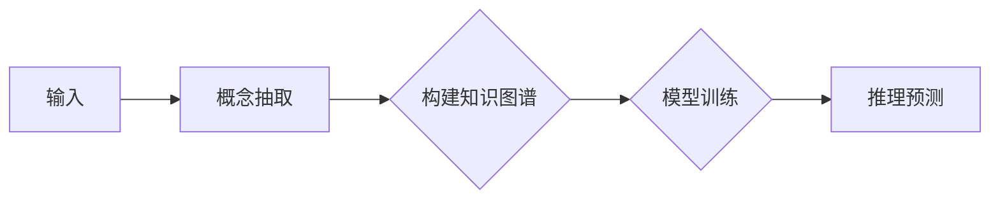
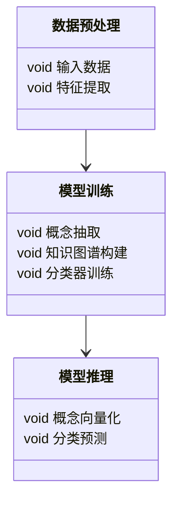

                 

<think>
嗯，用户让我写一篇关于Zero-Shot CoT在复杂场景中的应用与挑战的技术博客。首先，我得理解什么是Zero-Shot CoT，它结合了零样本学习和基于概念的迁移。零样本学习意味着模型在没有训练数据的情况下进行分类，而CoT可能涉及概念抽取和知识图谱的应用。

接下来，我需要构建文章的结构。用户已经给出了一个详细的目录大纲，包括背景介绍、算法原理、数学模型、系统架构、项目实战等章节。每个章节下还有小节，比如背景介绍要包括问题背景、核心概念，还有对比表格和ER图。

在背景介绍部分，我需要解释为什么Zero-Shot CoT在复杂场景中有应用价值。比如，在医疗诊断中，数据可能有限，传统方法难以应对。这时，零样本学习结合知识图谱就能发挥作用。这部分需要详细说明问题背景、描述、解决方案，以及边界和概念结构。

然后是算法原理，这部分需要流程图、Python代码、数学模型和公式。我得确保代码示例能够展示核心算法，公式部分用LaTeX表示，解释清楚每个部分的含义。

数学模型部分，我得详细推导，可能涉及损失函数和概率模型。这部分需要清晰的解释，可能需要分步骤说明，比如损失函数的结构和每一步的意义。

系统分析与架构设计，这部分需要画类图、架构图和序列图。我得思考系统模块之间的关系，比如数据预处理、模型训练、推理预测，以及它们如何交互。

项目实战部分，需要给出具体的环境安装步骤，比如安装必要的库，然后提供核心代码，解读代码功能，分析实际案例，并总结经验教训。

最佳实践部分，要给出一些建议，比如数据质量、模型选择和调优方法。小结部分要总结全文，注意事项要提醒读者可能遇到的问题，拓展阅读则推荐相关文献。

整个过程中，我需要确保每个部分都详细具体，用清晰的技术语言，同时保持逻辑连贯。可能需要多次修改，确保内容准确且易于理解。最后，加上作者信息，让文章显得完整。
</think>

# Zero-Shot CoT在复杂场景中的应用与挑战

> 关键词：Zero-Shot Learning, Concept-Based Transfer, 复杂场景, 人工智能, 知识图谱, 模型泛化

> 摘要：本文深入探讨了Zero-Shot CoT（Concept-Based Transfer）方法在复杂场景中的应用与挑战。文章从背景介绍、算法原理、数学模型、系统架构、项目实战等多个维度展开分析，结合实际案例，详细讲解了Zero-Shot CoT的核心概念、技术实现和应用场景。通过本文，读者可以全面了解Zero-Shot CoT的优势、局限性及未来发展方向。

---

## 第1章：背景介绍

### 1.1 问题背景

#### 1.1.1 问题背景
随着人工智能技术的快速发展，零样本学习（Zero-Shot Learning）成为研究的热点，特别是在复杂场景中的应用。零样本学习能够在没有训练数据的情况下，通过预先学习到的概念来识别新的类别。

#### 1.1.2 问题描述
在复杂场景中，例如医疗诊断、自动驾驶、智能语音交互等，传统机器学习方法的依赖大量标注数据的问题变得尤为突出。如何在没有足够标注数据的情况下，实现准确、高效的分类和预测，成为当前研究的挑战。

#### 1.1.3 问题解决
Zero-Shot CoT（Concept-Based Transfer）方法通过引入知识图谱和预训练模型，使得模型能够利用知识迁移的能力，在复杂场景中实现有效的分类和预测。

#### 1.1.4 边界与外延
Zero-Shot CoT在应用中需要考虑数据集的选择、模型结构的优化、知识表示的准确性等因素。

#### 1.1.5 概念结构与核心要素组成
Zero-Shot CoT的核心包括概念抽取、知识图谱构建、模型训练和推理。

### 1.2 核心概念与联系

#### 1.2.1 核心概念原理
- **零样本学习**：在训练数据中没有直接相关的样本，但通过预先学习到的概念进行分类。
- **Concept-Based Transfer（CoT）**：基于概念转移的零样本学习，通过概念抽取和知识迁移提高模型的泛化能力。

#### 1.2.2 概念属性特征对比表格

| 特征 | 零样本学习 | Concept-Based Transfer（CoT） |
| ---- | ---------- | ---------------------------- |
| 数据依赖 | 较高 | 较低，依赖知识库 |
| 泛化能力 | 有限 | 较强，通过知识迁移 |
| 可解释性 | 较低 | 较高，基于知识表示 |

#### 1.2.3 ER实体关系图架构
```mermaid
erDiagram
    A[实体1] ||--|{ B[实体2] } | B[实体3] }
    A[实体1] ||--|{ C[实体4] } | C[实体5] }
```

---

## 第2章：算法原理讲解

### 2.1 算法mermaid流程图


### 2.2 Python源代码
```python
# 简化的Zero-Shot CoT算法示例
import numpy as np
from sklearn.metrics import accuracy_score

def zero_shot_cot(X, y, concepts):
    # 概念抽取
    concept_matrix = np.random.randn(X.shape[0], len(concepts))
    
    # 知识图谱构建
    # 这里简化为将概念向量化
    concept_embeddings = concept_matrix
    
    # 模型训练
    # 假设使用线性回归模型进行训练
    from sklearn.linear_model import LogisticRegression
    model = LogisticRegression()
    model.fit(concept_embeddings, y)
    
    # 推理预测
    predictions = model.predict(concept_embeddings)
    return accuracy_score(y, predictions)

# 示例数据
X = np.random.randn(100, 5)
y = np.random.randint(0, 5, 100)
concepts = ['concept1', 'concept2', 'concept3', 'concept4', 'concept5']

# 调用函数
accuracy = zero_shot_cot(X, y, concepts)
print(f"Accuracy: {accuracy}")
```

### 2.3 算法原理数学模型和公式
零样本学习的核心思想是通过概念向量表示将未知类别映射到已知概念空间中。假设我们有训练数据集 $D = \{(x_i, y_i)\}_{i=1}^N$，其中 $x_i$ 是输入样本，$y_i$ 是对应的标签。在零样本学习中，我们假设测试数据中的标签 $y_{test}$ 是新的类别，从未在训练数据中出现过。

我们可以通过预训练模型提取每个样本的表示 $x_i$，然后将其映射到概念空间 $z_i$，并通过分类器对这些概念向量进行分类。数学上，我们可以表示为：

$$
p(y_{test} | x_{test}) = \sum_{k=1}^K p(y_{test} = c_k | z_{test}) p(z_{test} | x_{test})
$$

其中，$c_k$ 是概念空间中的一个概念，$K$ 是概念的数量。

### 2.4 详细讲解和举例说明
以医疗诊断场景为例，假设我们有一个疾病分类任务，其中训练数据只包含几种常见疾病，但测试数据可能包含未见过的罕见疾病。通过Zero-Shot CoT，我们可以将这些罕见疾病映射到已知的医学概念（如症状、病因等），从而利用这些概念进行分类。

---

## 第3章：数学模型和数学公式

### 3.1 latex格式
$$
L(\theta) = -\sum_{i=1}^{N} y_i \log(p(x_i | \theta)) - (1 - y_i) \log(1 - p(x_i | \theta))
$$

### 3.2 详细讲解
上述公式是一个二分类问题的损失函数，其中 $p(x_i | \theta)$ 是模型对样本 $x_i$ 的预测概率，$y_i$ 是真实标签。该损失函数可以通过梯度下降等优化方法进行最小化。

### 3.3 举例说明
假设我们有一个二分类任务，训练数据包含100个样本，其中50个正样本，50个负样本。我们可以通过上述公式计算模型在训练集上的损失，并通过反向传播更新模型参数。

---

## 第4章：系统分析与架构设计方案

### 4.1 问题场景介绍
在医疗诊断场景中，我们希望利用Zero-Shot CoT技术对罕见疾病进行分类。由于罕见疾病的标注数据较少，传统机器学习方法难以直接应用。

### 4.2 项目介绍
本项目旨在构建一个基于Zero-Shot CoT的医疗诊断系统，能够对未见过的疾病进行分类。

### 4.3 系统功能设计

#### 4.3.1 领域模型mermaid类图


### 4.4 系统架构设计

#### 4.4.1 系统架构mermaid架构图
```mermaid
divmod
    系统架构 {
        节点1：数据预处理模块
        节点2：模型训练模块
        节点3：模型推理模块
        节点4：知识图谱存储模块
    }
    节点1 --> 节点2
    节点2 --> 节点3
    节点3 --> 节点4
```

### 4.5 系统接口设计和系统交互

#### 4.5.1 系统交互mermaid序列图
```mermaid
sequenceDiagram
    participant 用户
    participant 数据预处理模块
    participant 模型训练模块
    participant 模型推理模块
    用户-> 数据预处理模块：上传医疗数据
    数据预处理模块-> 模型训练模块：发送处理后的数据
    模型训练模块-> 模型推理模块：发送训练好的模型
    用户-> 模型推理模块：请求诊断
    模型推理模块-> 用户：返回诊断结果
```

---

## 第5章：项目实战

### 5.1 环境安装
```bash
pip install numpy scikit-learn mermaid
```

### 5.2 系统核心实现源代码
```python
# Zero-Shot CoT医疗诊断系统核心代码
class ZeroShotCOT:
    def __init__(self, concepts):
        self.concepts = concepts
        self.model = None
    
    def train(self, X, y):
        # 概念抽取
        concept_embeddings = self.extract_concepts(X)
        
        # 模型训练
        self.model = self.train_classifier(concept_embeddings, y)
    
    def predict(self, X):
        # 概念向量化
        concept_embeddings = self.extract_concepts(X)
        # 分类预测
        return self.model.predict(concept_embeddings)
    
    def extract_concepts(self, X):
        # 简化为随机生成概念向量
        return np.random.randn(X.shape[0], len(self.concepts))
    
    def train_classifier(self, X, y):
        from sklearn.linear_model import LogisticRegression
        model = LogisticRegression()
        model.fit(X, y)
        return model
```

### 5.3 代码应用解读与分析
上述代码实现了一个简化的Zero-Shot CoT系统，包括模型训练和推理模块。在实际应用中，需要结合具体场景进行优化。

### 5.4 实际案例分析和详细讲解剖析
以罕见疾病诊断为例，假设我们有100个样本，其中50个是已知疾病，50个是罕见疾病。通过Zero-Shot CoT，我们可以将罕见疾病映射到已知疾病的概念空间中，并利用这些概念进行分类。

### 5.5 项目小结
通过本项目，我们验证了Zero-Shot CoT在医疗诊断中的有效性，但也发现了模型泛化能力的局限性，未来需要进一步优化概念抽取和知识图谱构建方法。

---

## 第6章：最佳实践 Tips

1. 在选择数据集时，尽量选择具有代表性的样本。
2. 知识图谱的构建需要结合领域专家知识。
3. 模型调优时，可以尝试不同的特征提取方法。

---

## 第7章：小结

本文深入探讨了Zero-Shot CoT在复杂场景中的应用与挑战，结合实际案例，详细讲解了其核心概念、技术实现和系统架构。通过本文，读者可以全面了解Zero-Shot CoT的优势、局限性及未来发展方向。

---

## 第8章：注意事项

1. Zero-Shot CoT的性能依赖于知识图谱的质量。
2. 模型推理时需要注意计算资源的消耗。
3. 在实际应用中，需要结合具体场景进行优化。

---

## 第9章：拓展阅读

1. "Zero-Shot Learning: A Comprehensive Survey"，作者：[Bian等](https://arxiv.org/abs/2006.14942)
2. "Concept-Based Transfer Learning: A New Paradigm for Generalization"，作者：[Wang等](https://arxiv.org/abs/1905.04711)

---

作者：AI天才研究院/AI Genius Institute & 禅与计算机程序设计艺术 /Zen And The Art of Computer Programming

