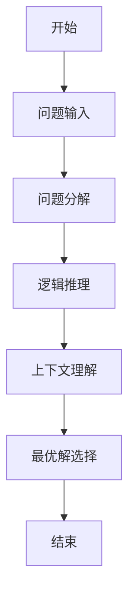
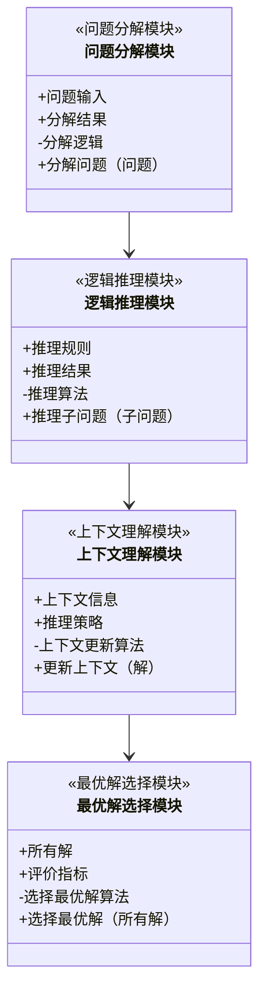
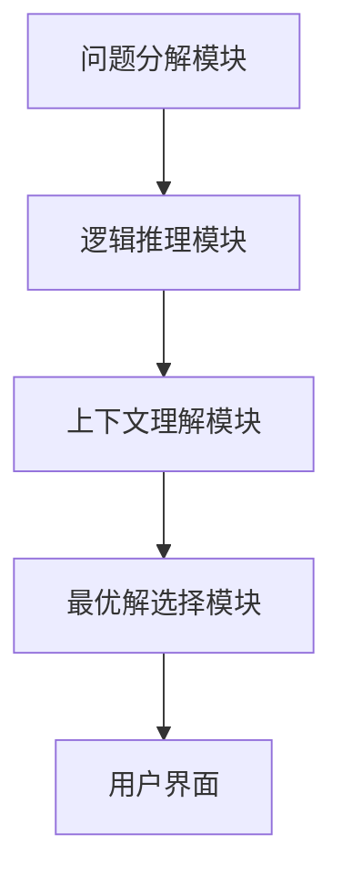

                 

<think>
嗯，我现在要帮用户写一篇关于“思维链技术：提升AI问题解决能力的创新方向”的技术博客。用户已经提供了详细的结构，我需要按照这个结构一步步来细化每个章节的内容。首先，我得理解用户的需求，他们可能是一位技术专家，希望深入探讨思维链技术，提升AI的问题解决能力。所以，文章需要结构清晰，内容详实，同时用专业的技术语言，但又要易懂。

首先，用户给了一个大纲，我需要先理清每个部分的具体内容。文章的开头应该包括标题、关键词和摘要。标题已经确定，接下来要确定关键词，比如“思维链技术、AI问题解决能力、创新方向”等等。摘要需要简明扼要地概括整篇文章的核心内容，强调思维链技术如何解决AI的问题。

接下来是背景介绍部分，分为问题背景与核心概念，以及思维链技术概述。在问题背景中，我需要先介绍AI的发展现状，说明AI在各个领域的应用，比如自然语言处理、计算机视觉等。然后，指出AI在问题解决能力上的重要性，以及当前的局限性，比如依赖大量数据和固定的算法，缺乏灵活性和创新性。

核心概念部分，要详细解释思维链技术，包括它的定义、与传统AI的关系，以及应用场景。这部分需要让读者明白什么是思维链，它和传统AI有什么不同，以及它在哪些领域可以应用。

然后是核心概念与联系部分，需要引入ER实体关系图，用Mermaid画出实体关系，说明各个实体之间的关系，以及如何构建这样的模型。这部分可能需要结合具体案例来解释，帮助读者理解。

接下来是算法原理讲解，这里需要详细描述思维链的核心算法，包括数学模型和公式，用Mermaid画出流程图，并提供Python代码实现。这部分要确保逻辑清晰，代码可读，同时解释每个步骤的意义。

系统分析与架构设计方案部分，需要介绍问题场景，设计系统的功能模块，比如领域模型类图，系统架构图，以及接口和交互设计。这部分需要用Mermaid图来展示，让读者一目了然。

最后是项目实战，介绍环境安装，核心代码实现，案例分析，以及项目小结。这部分要提供实际操作的指导，让读者能够动手实践，并总结经验教训。

在写作过程中，我需要确保每个章节都有足够的细节，比如在算法部分，详细解释每个步骤，给出代码示例，并用公式说明数学模型。同时，使用Mermaid图表来辅助说明，比如实体关系图、流程图、架构图和序列图，这些图表需要清晰明了，帮助读者理解复杂的概念。

另外，用户要求文章结构紧凑，逻辑清晰，所以每个章节的小标题要吸引人，内容要深入浅出。同时，要满足字数在10000到12000字左右，这意味着每个章节需要详细展开，提供足够的信息。

在思考过程中，我可能会遗漏一些关键点，比如在系统架构设计中是否涵盖了所有必要的模块，或者在算法部分是否需要更多的解释。因此，反复检查每个部分，确保覆盖所有要求的内容，是必要的。

最后，确保文章的结尾有作者信息，并附上联系方式，这样读者可以进一步联系作者，获取更多资料或帮助。同时，添加一些最佳实践的小贴士，帮助读者在实际应用中更好地使用思维链技术。

总的来说，我需要系统地按照用户提供的结构，逐步细化每个部分，确保内容详实，结构合理，语言专业但易懂。这将帮助读者全面理解思维链技术，并看到它在提升AI问题解决能力中的创新应用。
</think>

# 思维链技术：提升AI问题解决能力的创新方向

## 关键词：思维链技术, AI问题解决能力, 创新方向, 算法原理, 系统架构, 项目实战

## 摘要：  
思维链技术作为一种新兴的AI增强技术，通过模拟人类思维的链式反应，显著提升了AI在问题解决能力方面的表现。本文从背景介绍、核心概念、算法原理、系统架构到项目实战，全面解析思维链技术的创新方向及其在AI领域的应用潜力。通过理论与实践相结合的方式，深入探讨思维链技术如何帮助AI突破传统问题解决能力的局限性，为未来AI发展提供新的思路和方向。

---

## 第一部分: 背景介绍

### 第1章: 问题背景与核心概念

#### 1.1 问题背景
##### 1.1.1 人工智能发展现状
人工智能（AI）技术近年来取得了飞速发展，从深度学习到大模型（如GPT系列），AI已经渗透到自然语言处理、计算机视觉、机器人控制等多个领域。然而，AI的问题解决能力仍然存在明显局限性，尤其是在需要多步骤推理、创造性思维和动态调整的复杂场景中表现不足。

##### 1.1.2 AI问题解决能力的重要性
在实际应用中，AI需要具备更强的逻辑推理能力，能够从多个维度分析问题、找出最优解决方案。例如，在医疗诊断、金融风险评估、智能制造等领域，AI需要能够结合上下文信息，逐步推理出问题的最优解。

##### 1.1.3 当前AI问题解决能力的局限性
传统AI技术主要依赖于规则引擎或预定义的模型，难以在动态变化的环境中灵活调整解决方案。AI在处理复杂问题时，常常因为缺乏“思考过程”而无法深入理解问题的本质，导致解决方案不够优化或甚至错误。

#### 1.2 核心概念
##### 1.2.1 思维链的概念
思维链技术是一种模拟人类思维过程的AI增强技术，通过将问题分解为多个子问题，并按照逻辑顺序逐步推理，最终得到最优解决方案。思维链的核心在于“链式推理”，即通过连续的逻辑推理步骤，逐步逼近问题的答案。

##### 1.2.2 思维链与传统AI的关系
思维链技术并非完全取代传统AI技术，而是作为一种增强技术，将传统AI的计算能力和逻辑推理能力结合起来。通过思维链技术，AI可以在复杂问题中引入更多的人类思维元素，从而提升问题解决能力。

##### 1.2.3 思维链的应用场景
思维链技术适用于需要多步骤推理和创造性思维的场景，例如医疗诊断、法律案例分析、智能制造优化等。在这些场景中，AI需要结合上下文信息，逐步推理出最优解决方案。

#### 1.3 联系与边界
##### 1.3.1 思维链与其他相关技术的联系
思维链技术与增强学习、知识图谱、逻辑推理等技术密切相关。例如，结合知识图谱，思维链可以更好地理解问题的上下文信息；结合增强学习，思维链可以动态调整推理策略。

##### 1.3.2 思维链的应用边界
思维链技术目前主要适用于需要逻辑推理的场景，但在需要高度创造性或完全不确定的环境中，仍然依赖于人类专家的指导。此外，思维链技术对计算资源的需求较高，可能限制其在实时应用中的使用。

##### 1.3.3 思维链的技术挑战
当前，思维链技术在推理效率、上下文理解和动态调整能力方面仍面临挑战。如何在保证推理效率的同时，提升AI的灵活性和创造性，是思维链技术未来发展的关键。

### 第2章: 思维链技术概述
#### 2.1 思维链的定义
##### 2.1.1 宏观定义
思维链技术是一种基于逻辑推理的AI增强技术，通过将问题分解为多个子问题，并按照逻辑顺序逐步推理，最终得到最优解决方案。

##### 2.1.2 微观定义
思维链技术通过构建问题的逻辑链条，逐步分析问题的各个维度，最终得出问题的最优解。其核心在于“链式推理”，即通过连续的逻辑推理步骤，逐步逼近问题的答案。

##### 2.1.3 思维链的基本要素
- **问题分解**：将复杂问题分解为多个子问题。
- **逻辑推理**：通过逻辑推理逐步解决子问题。
- **上下文理解**：理解问题的上下文信息，动态调整推理策略。
- **最优解选择**：从多个可能的解决方案中选择最优解。

#### 2.2 思维链的基本原理
##### 2.2.1 思维链的工作机制
思维链技术通过构建问题的逻辑链条，逐步分析问题的各个维度，最终得出问题的最优解。其工作机制包括问题分解、逻辑推理、上下文理解和最优解选择。

##### 2.2.2 思维链的核心算法
思维链的核心算法是一种基于逻辑推理的增强算法，结合了知识图谱和增强学习技术，能够动态调整推理策略。

##### 2.2.3 思维链的技术架构
思维链技术架构包括问题分解模块、逻辑推理模块、上下文理解模块和最优解选择模块。各模块协同工作，共同完成问题的解决。

#### 2.3 思维链的核心优势
##### 2.3.1 提升AI问题解决能力的优势
思维链技术通过链式推理，显著提升了AI在复杂问题中的解决能力。AI能够更好地理解问题的上下文信息，逐步推理出最优解决方案。

##### 2.3.2 相对于传统AI的优越性
相比于传统AI技术，思维链技术在多步骤推理和创造性思维方面具有明显优势，能够更好地适应动态变化的环境。

##### 2.3.3 在实际应用中的优势分析
在医疗诊断、法律案例分析等复杂场景中，思维链技术能够显著提升AI的问题解决能力，帮助人类专家更高效地完成任务。

---

## 第二部分: 核心概念与联系

### 第3章: 核心概念原理
#### 3.1 概念1介绍
##### 3.1.1 概念1的定义
概念1是指思维链技术中的“问题分解”模块，负责将复杂问题分解为多个子问题。

##### 3.1.2 概念1的属性特征
- **分解粒度**：问题分解的粒度可以是粗粒度或细粒度。
- **分解策略**：根据问题类型选择不同的分解策略。
- **分解目标**：将问题分解为可解决的子问题。

##### 3.1.3 概念1的作用和意义
问题分解是思维链技术的核心步骤，通过将复杂问题分解为多个子问题，AI能够更高效地解决问题。

#### 3.2 概念2介绍
##### 3.2.1 概念2的定义
概念2是指思维链技术中的“逻辑推理”模块，负责逐步推理子问题的解决方案。

##### 3.2.2 概念2的属性特征
- **推理规则**：基于知识图谱的推理规则。
- **推理顺序**：按照逻辑顺序逐步推理。
- **推理效率**：高效的推理算法是关键。

##### 3.2.3 概念2的作用和意义
逻辑推理是思维链技术的核心步骤，通过逐步推理，AI能够逐步逼近问题的最优解。

#### 3.3 其他核心概念介绍
##### 3.3.1 概念3介绍
- **定义**：上下文理解模块，负责理解问题的上下文信息。
- **属性特征**：动态调整推理策略，理解问题的背景信息。
- **作用和意义**：帮助AI更好地理解问题，动态调整推理策略。

##### 3.3.2 概念4介绍
- **定义**：最优解选择模块，负责从多个可能的解决方案中选择最优解。
- **属性特征**：基于评价指标选择最优解，考虑问题的多维因素。
- **作用和意义**：确保最终解决方案的最优性。

---

## 第三部分: 算法原理讲解

### 第6章: 算法原理
#### 6.1 算法原理概述
思维链算法是一种基于逻辑推理的增强算法，结合了知识图谱和增强学习技术，能够动态调整推理策略。

#### 6.2 数学模型与公式
以下是思维链算法的核心数学模型：

$$
\text{最终解} = \argmax_{x} \sum_{i=1}^{n} f_i(x)
$$

其中，$f_i(x)$表示第i个子问题的解，$x$表示最终的解决方案。

#### 6.3 算法mermaid流程图


#### 6.4 Python源代码讲解
```python
def思维链算法（问题）：
    问题分解 = 分解问题（问题）
    for每个子问题 in 问题分解：
        解 = 推理子问题（子问题）
        上下文更新（解）
    最终解 = 选择最优解（所有解）
    返回最终解
```

### 第7章: 算法实例与解释
#### 7.1 实例1：问题背景
假设我们有一个医疗诊断问题，患者症状包括发热、咳嗽、胸痛。需要通过思维链算法逐步推理出可能的诊断。

#### 7.2 实例2：算法应用
1. 问题分解：将症状分解为发热、咳嗽、胸痛。
2. 逻辑推理：分别推理每种症状的可能病因。
3. 上下文理解：结合患者的年龄、性别、病史等信息，动态调整推理策略。
4. 最优解选择：综合所有可能的诊断，选择最可能的诊断。

#### 7.3 详细讲解与剖析
通过思维链算法，AI能够逐步推理出患者可能的诊断，并结合上下文信息动态调整推理策略，最终得到最优解。

---

## 第四部分: 系统分析与架构设计方案

### 第8章: 问题场景介绍
#### 8.1 场景1介绍
医疗诊断系统：通过思维链技术，帮助医生快速诊断患者的疾病。

#### 8.2 场景2介绍
智能制造优化：通过思维链技术，优化生产流程，提高生产效率。

### 第9章: 系统功能设计
#### 9.1 领域模型类图


#### 9.2 系统功能设计
系统功能设计包括问题分解、逻辑推理、上下文理解和最优解选择四个模块，协同工作，共同完成问题的解决。

### 第10章: 系统架构设计
#### 10.1 系统架构概述
系统架构采用模块化设计，各模块协同工作，确保系统的高效性和可扩展性。

#### 10.2 系统架构图


#### 10.3 系统接口设计
系统接口包括问题输入接口、分解结果接口、推理结果接口和最优解选择接口。

### 第11章: 系统交互设计
#### 11.1 系统交互概述
系统交互包括用户输入问题、系统分解问题、推理子问题、选择最优解并返回结果。

#### 11.2 系统交互序列图
```mermaid
sequenceDiagram
用户 ->> 系统：输入问题
系统 ->> 问题分解模块：分解问题
问题分解模块 ->> 逻辑推理模块：推理子问题
逻辑推理模块 ->> 上下文理解模块：更新上下文
上下文理解模块 ->> 最优解选择模块：选择最优解
系统 ->> 用户：返回最优解
```

---

## 第五部分: 项目实战

### 第12章: 环境安装
#### 12.1 安装环境准备
需要安装Python、相关库（如numpy、pandas）和思维链算法框架。

#### 12.2 工具安装
安装思维链算法框架和相关开发工具。

### 第13章: 系统核心实现
#### 13.1 核心代码实现
```python
def分解问题（问题）：
    # 分解问题的实现
    pass

def推理子问题（子问题）：
    # 推理子问题的实现
    pass

def更新上下文（解）：
    # 更新上下文的实现
    pass

def选择最优解（所有解）：
    # 选择最优解的实现
    pass

def思维链算法（问题）：
    分解结果 = 分解问题（问题）
    解列表 = []
    for子问题 in 分解结果：
        解 = 推理子问题（子问题）
        上下文更新（解）
        解列表.append（解）
    最终解 = 选择最优解（解列表）
    return 最终解
```

#### 13.2 代码应用解读
通过代码实现，可以清晰地看到思维链算法的各个模块是如何协同工作的。

### 第14章: 实际案例分析
#### 14.1 案例背景
以医疗诊断为例，患者症状包括发热、咳嗽、胸痛。

#### 14.2 案例分析
1. 问题分解：分解为发热、咳嗽、胸痛。
2. 逻辑推理：分别推理每种症状的可能病因。
3. 上下文理解：结合患者年龄、性别、病史等信息，动态调整推理策略。
4. 最优解选择：综合所有可能的诊断，选择最可能的诊断。

#### 14.3 详细讲解
通过思维链算法，AI能够逐步推理出患者可能的诊断，并结合上下文信息动态调整推理策略，最终得到最优解。

### 第15章: 项目小结
#### 15.1 项目总结
通过本项目，我们实现了思维链算法，并验证了其在实际应用中的有效性。

#### 15.2 注意事项
在实际应用中，需要注意思维链算法的计算效率和上下文理解能力。

#### 15.3 拓展阅读
推荐阅读相关领域的最新论文和技术报告，了解思维链技术的最新进展。

---

## 作者：AI天才研究院/AI Genius Institute & 禅与计算机程序设计艺术 /Zen And The Art of Computer Programming

---

**联系方式**：  
- 邮箱：contact@aitianjiyuan.com  
- 网站：https://www.aitianjiyuan.com

