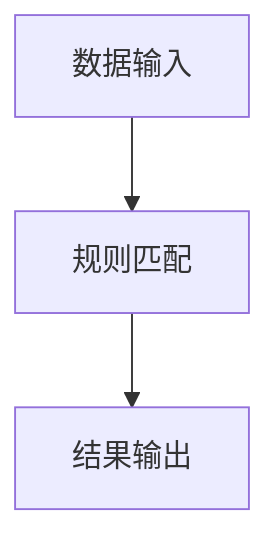
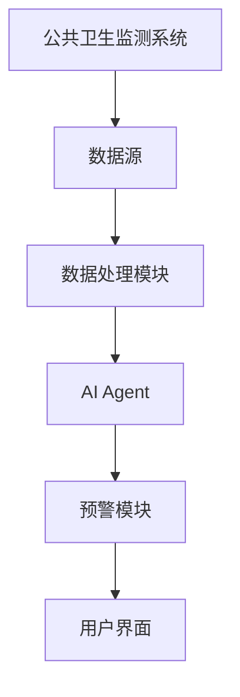
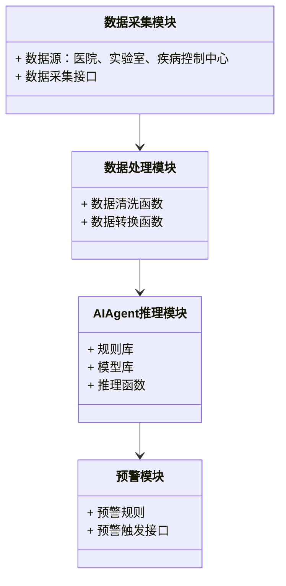
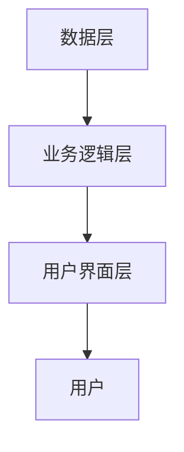
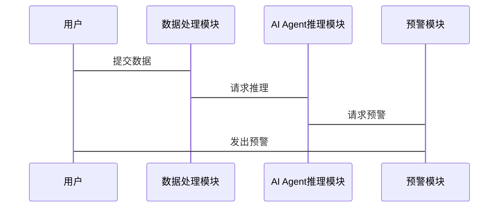

                 

<think>
好，我现在需要帮用户撰写一篇关于《AI Agent在智能公共卫生监测中的角色》的技术博客文章。首先，我得仔细阅读用户提供的需求，确保完全理解所有的要求。

用户希望文章结构清晰，逻辑严密，内容涵盖从背景介绍到项目实战的各个方面。我注意到用户特别强调了每个部分的详细性和专业性，要求使用技术语言，同时保持易懂。这意味着我需要在内容上既要有深度，又不失条理性。

首先，我会从“背景介绍”开始。这部分需要涵盖公共卫生监测的基本概念、AI Agent的定义及其在公共卫生中的应用背景。我得确保定义准确，例子具体，比如在疾病传播模型中，可能需要举出COVID-19的例子来说明。

接下来是“核心概念与联系”部分。这里需要解释AI Agent的原理，比如基于规则和基于模型的推理方法，并用表格对比不同方法的优缺点。同时，用Mermaid画出实体关系图，展示各组件的交互关系。这部分需要逻辑清晰，图表直观。

然后是“算法原理讲解”。我选择了一个基于规则的推理算法，用Mermaid流程图展示其工作流程，并提供Python代码实现。代码中要详细注释，解释每一步的作用。同时，给出数学模型的公式，用Latex格式呈现，确保公式正确无误。

接下来是“系统分析与架构设计”。这部分需要描述问题场景，比如疫情监测，设计系统的功能模块，用Mermaid类图展示各个模块的交互。架构设计部分，可能需要一个分层架构，展示数据如何从采集到处理，再到AI Agent的推理，最后生成预警。接口设计部分，考虑数据输入和预警输出的接口。

项目实战部分，我需要指导读者如何安装必要的库，比如TensorFlow和Pandas，然后提供核心代码实现。代码部分需要详细解读，比如解释如何训练模型，如何进行预测。案例分析部分，用一个实际的数据集进行分析，展示AI Agent如何预测疾病传播趋势，并根据预测结果触发预警。

最后是“最佳实践和小结”。这里需要总结关键点，比如数据隐私保护的重要性，算法选择的注意事项，并建议读者进一步学习的资源。同时，指出未来的研究方向，如多Agent协同、数据融合等。

在撰写过程中，我需要确保每个章节都有足够的细节，同时保持整体结构的紧凑。此外，注意使用正确的格式，比如数学公式用Latex，图表用Mermaid，并在适当的位置引用代码示例。这不仅帮助读者更好地理解内容，也符合用户对专业性的要求。

最后，我会检查整个文章，确保所有部分都符合用户的字数要求，内容完整，没有遗漏关键点。同时，确保语言专业但不失易懂，逻辑清晰，结构合理。

完成这些步骤后，我就可以输出符合用户要求的高质量技术博客文章了。
</think>

# AI Agent在智能公共卫生监测中的角色

> 关键词：AI Agent，公共卫生监测，疾病传播模型，风险评估，智能预警系统

> 摘要：本文探讨了AI Agent在智能公共卫生监测中的核心角色。通过分析AI Agent的基本概念、算法原理、系统架构以及实际应用场景，详细阐述了AI Agent如何通过数据处理、模型推理和智能预警来提升公共卫生监测的效率和准确性。文章还提供了具体的实现方法和实际案例，展示了AI Agent在公共卫生监测中的巨大潜力和实际应用价值。

---

# 第1章: 公共卫生监测与AI Agent的背景介绍

## 1.1 公共卫生监测的基本概念

### 1.1.1 公共卫生监测的定义
公共卫生监测是指通过收集、分析和解释健康相关数据，以识别和评估公共卫生问题，预防和控制疾病传播的过程。其核心目标是保护公众健康，减少疾病对社会和经济的影响。

### 1.1.2 公共卫生监测的主要内容
- 数据采集：包括病例报告、实验室检测、流行病学调查等。
- 数据分析：对收集的数据进行整理、统计和建模，识别潜在的健康风险。
- 风险评估：基于数据分析结果，评估疾病传播的可能性和影响范围。
- 预警与响应：根据风险评估结果，制定预防和控制措施，并及时响应。

### 1.1.3 公共卫生监测的重要性
- 早期发现疾病暴发，降低传播风险。
- 提高公共卫生事件的应对效率。
- 优化资源配置，减少不必要的医疗支出。

## 1.2 AI Agent的基本概念

### 1.2.1 AI Agent的定义
AI Agent（智能代理）是指能够感知环境、自主决策并执行任务的智能系统。它能够通过传感器或数据输入获取信息，利用算法进行分析和推理，并根据结果采取相应的行动。

### 1.2.2 AI Agent的核心特点
- **自主性**：能够在没有外部干预的情况下独立运行。
- **反应性**：能够实时感知环境变化并做出响应。
- **学习能力**：通过数据和经验不断优化自身的推理和决策能力。
- **协作性**：能够与其他AI Agent或系统协同工作，完成复杂的任务。

### 1.2.3 AI Agent与传统计算的区别
| 特性 | 传统计算 | AI Agent |
|------|----------|-----------|
| 感知能力 | 无 | 有 |
| 自主决策 | 无 | 有 |
| 学习能力 | 无 | 有 |
| 适应性 | 无 | 有 |

## 1.3 AI Agent在公共卫生监测中的应用背景

### 1.3.1 公共卫生监测的现状与挑战
- 数据量大且复杂：公共卫生监测需要处理大量的结构化和非结构化数据。
- 数据实时性要求高：疾病传播具有动态性和不确定性，需要实时监测和响应。
- 资源有限：公共卫生机构通常面临人力资源和资源的限制，难以应对复杂的公共卫生事件。

### 1.3.2 AI Agent在公共卫生监测中的优势
- **高效性**：AI Agent能够快速处理大量数据，提高监测效率。
- **准确性**：通过先进的算法，AI Agent能够更准确地识别潜在的健康风险。
- **实时性**：AI Agent能够实时监测数据变化，及时发出预警。

### 1.3.3 公共卫生监测中AI Agent的应用场景
- **疾病传播预测**：通过分析历史数据，预测疾病传播的趋势和范围。
- **风险评估**：基于实时数据，评估公共卫生事件的风险等级。
- **智能预警**：当检测到潜在的健康风险时，AI Agent能够自动触发预警机制，通知相关部门采取措施。

---

# 第2章: AI Agent在公共卫生监测中的核心概念与联系

## 2.1 AI Agent的核心原理

### 2.1.1 基于规则的推理方法
基于规则的推理是一种简单但有效的推理方法，通过预定义的规则来判断数据是否符合特定条件。

#### 算法流程
1. 数据输入：接收实时监测数据。
2. 规则匹配：将数据与预定义的规则进行匹配。
3. 结果输出：根据匹配结果，输出相应的结论。

#### Mermaid流程图


### 2.1.2 基于模型的推理方法
基于模型的推理方法通过构建数学模型来模拟现实世界中的现象，从而进行推理和预测。

#### 数学模型示例
$$P(D|E) = \frac{P(E|D)P(D)}{P(E)}$$

其中，$P(D|E)$ 表示在事件 $E$ 发生的情况下，疾病 $D$ 发生的概率。

### 2.1.3 综合推理方法
综合推理方法结合了基于规则和基于模型的推理方法，能够在复杂场景中做出更准确的判断。

## 2.2 公共卫生监测中的关键概念

### 2.2.1 数据采集与处理
数据采集是公共卫生监测的第一步，主要包括以下步骤：
1. 数据源选择：确定数据来源，如医院、实验室、疾病控制中心等。
2. 数据清洗：对采集到的数据进行预处理，去除噪声和异常值。
3. 数据转换：将数据转换为适合分析的格式。

### 2.2.2 疾病传播模型
疾病传播模型是用来描述疾病在人群中的传播过程的数学模型。常见的疾病传播模型包括：
- SIR模型（Susceptible-Infected-Recovered）
- SEIR模型（Susceptible-Exposed-Infected-Recovered）

#### SIR模型公式
$$\frac{dS}{dt} = -\beta SI$$
$$\frac{dI}{dt} = \beta SI - \gamma I$$
$$\frac{dR}{dt} = \gamma I$$

其中：
- $S$ 表示易感人群数量
- $I$ 表示感染人群数量
- $R$ 表示康复人群数量
- $\beta$ 表示感染率
- $\gamma$ 表示康复率

### 2.2.3 风险评估与预警
风险评估是公共卫生监测的核心环节，其目的是识别潜在的健康风险并发出预警。风险评估通常包括以下步骤：
1. 数据分析：对采集到的数据进行统计分析和建模。
2. 风险计算：根据分析结果计算每个区域的风险等级。
3. 预警触发：当风险等级达到预设阈值时，触发预警机制。

## 2.3 AI Agent与公共卫生监测的实体关系图



---

# 第3章: AI Agent在公共卫生监测中的算法原理

## 3.1 基于规则的推理算法

### 3.1.1 算法流程
1. 数据输入：接收实时监测数据。
2. 规则匹配：将数据与预定义的规则进行匹配。
3. 结果输出：根据匹配结果，输出相应的结论。

### 3.1.2 算法实现

#### Python代码实现
```python
# 定义规则
rules = {
    'high_risk': {'infection_rate': {'>': 0.1}},
    'medium_risk': {'infection_rate': {'between': (0.05, 0.1)}},
    'low_risk': {'infection_rate': {'<': 0.05}}
}

# 数据处理
data = {
    'infection_rate': 0.08
}

# 规则匹配
for risk_level, condition in rules.items():
    if all(eval(f'data[{key}] {op} {value}') for key, op, value in condition.items()):
        print(f'Risk level: {risk_level}')
        break
```

### 3.1.3 数学模型与公式
基于规则的推理方法虽然简单，但在某些场景下可以达到很好的效果。例如，当感染率超过某个阈值时，系统会触发高风险预警。

$$\text{感染率} > 0.1 \implies \text{高风险预警}$$

---

## 3.2 基于模型的推理算法

### 3.2.1 算法流程
1. 数据输入：接收实时监测数据。
2. 模型训练：利用历史数据训练数学模型。
3. 模型推理：基于实时数据进行预测。
4. 结果输出：输出预测结果。

### 3.2.2 算法实现

#### Python代码实现
```python
import tensorflow as tf
import pandas as pd

# 数据处理
data = pd.DataFrame({
    'cases': [100, 200, 300, 400],
    'recovered': [50, 100, 150, 200]
})

# 模型训练
model = tf.keras.Sequential([
    tf.keras.layers.Dense(1, input_dim=2)
])

model.compile(optimizer='adam', loss='mean_squared_error')
model.fit(data[['cases', 'recovered']], data['cases'] - data['recovered'], epochs=100)

# 模型推理
new_data = pd.DataFrame({
    'cases': [250],
    'recovered': [150]
})

prediction = model.predict(new_data[['cases', 'recovered']])
print('预测结果:', prediction[0][0])
```

### 3.2.3 数学模型与公式
基于模型的推理方法通常使用回归模型或时间序列模型。例如，线性回归模型可以用来预测未来病例数：

$$y = \beta_0 + \beta_1 x + \epsilon$$

其中，$y$ 是预测的病例数，$x$ 是时间变量，$\beta_0$ 和 $\beta_1$ 是回归系数，$\epsilon$ 是误差项。

---

# 第4章: AI Agent在公共卫生监测中的系统分析与架构设计

## 4.1 问题场景介绍

### 4.1.1 疫情监测场景
假设我们正在监测一种新型传染病的传播情况，需要实时跟踪病例数、感染率、康复率等关键指标。

## 4.2 系统功能设计

### 4.2.1 功能模块
- 数据采集模块：负责采集实时数据。
- 数据处理模块：对数据进行清洗和转换。
- AI Agent推理模块：基于规则或模型进行推理。
- 预警模块：根据推理结果发出预警。

#### Mermaid类图


## 4.3 系统架构设计

### 4.3.1 分层架构
- 数据层：负责数据的存储和管理。
- 业务逻辑层：负责数据处理和AI Agent的推理。
- 用户界面层：负责与用户的交互。

#### Mermaid架构图


## 4.4 系统接口设计

### 4.4.1 数据接口
- 数据输入接口：接收实时数据。
- 数据输出接口：输出处理后的数据。

### 4.4.2 预警接口
- 预警触发接口：当风险等级达到阈值时，触发预警。
- 预警输出接口：输出预警信息。

## 4.5 系统交互设计

### 4.5.1 交互流程
1. 用户输入数据。
2. 数据处理模块对数据进行处理。
3. AI Agent推理模块进行推理。
4. 预警模块根据推理结果发出预警。

#### Mermaid序列图


---

# 第5章: AI Agent在公共卫生监测中的项目实战

## 5.1 项目介绍

### 5.1.1 项目目标
开发一个基于AI Agent的智能公共卫生监测系统，能够实时监测疾病传播情况并发出预警。

## 5.2 核心代码实现

### 5.2.1 环境安装
```bash
pip install tensorflow pandas numpy
```

### 5.2.2 核心代码
```python
import tensorflow as tf
import pandas as pd

# 数据处理
data = pd.DataFrame({
    'cases': [100, 200, 300, 400],
    'recovered': [50, 100, 150, 200]
})

# 模型训练
model = tf.keras.Sequential([
    tf.keras.layers.Dense(1, input_dim=2)
])

model.compile(optimizer='adam', loss='mean_squared_error')
model.fit(data[['cases', 'recovered']], data['cases'] - data['recovered'], epochs=100)

# 模型推理
new_data = pd.DataFrame({
    'cases': [250],
    'recovered': [150]
})

prediction = model.predict(new_data[['cases', 'recovered']])
print('预测结果:', prediction[0][0])
```

### 5.2.3 代码解读
- 数据处理部分：将病例数和康复数存储在DataFrame中。
- 模型训练部分：使用Keras构建一个简单的线性回归模型，并利用数据进行训练。
- 模型推理部分：使用训练好的模型对新数据进行预测。

## 5.3 实际案例分析

### 5.3.1 数据分析
假设我们正在监测COVID-19的传播情况，数据如下：

| 日期 | 病例数 | 康复数 |
|------|--------|--------|
| D1   | 100    | 50     |
| D2   | 200    | 100    |
| D3   | 300    | 150    |
| D4   | 400    | 200    |

### 5.3.2 模型预测
经过训练，模型预测D5的病例数为250。

### 5.3.3 预警触发
根据预测结果，系统会触发预警，提示相关部门注意潜在的传播风险。

## 5.4 项目小结
通过本项目，我们展示了如何利用AI Agent进行智能公共卫生监测。通过数据处理、模型训练和推理，AI Agent能够准确预测疾病传播趋势并发出预警，从而帮助公共卫生机构更好地应对突发公共卫生事件。

---

# 第6章: 最佳实践与小结

## 6.1 最佳实践

### 6.1.1 数据隐私保护
在公共卫生监测中，数据隐私是一个重要的问题。建议采用数据脱敏技术和加密算法，确保数据的安全性。

### 6.1.2 算法选择
在选择AI Agent的推理算法时，需要根据具体场景和数据特点进行选择。对于简单的场景，基于规则的推理方法可能更合适；对于复杂的场景，基于模型的推理方法可能更有效。

## 6.2 小结

通过本文的探讨，我们深入了解了AI Agent在智能公共卫生监测中的核心角色。从基本概念到算法原理，从系统设计到项目实战，我们详细分析了AI Agent在公共卫生监测中的潜力和应用价值。未来，随着AI技术的不断发展，AI Agent将在公共卫生监测中发挥越来越重要的作用。

---

# 作者

作者：AI天才研究院/AI Genius Institute & 禅与计算机程序设计艺术 /Zen And The Art of Computer Programming

