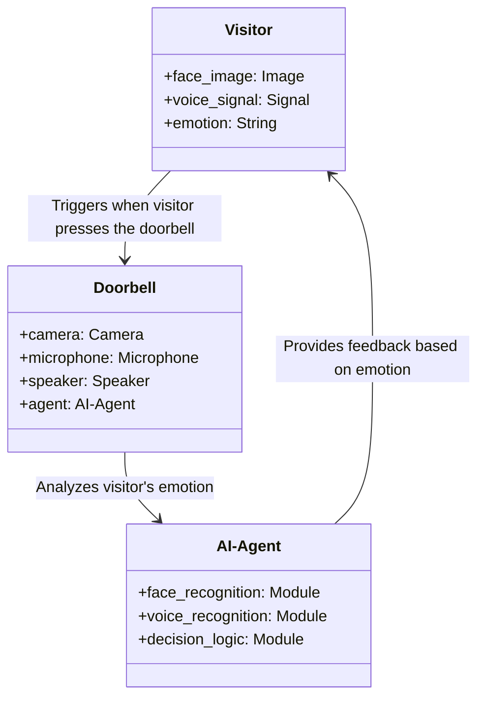
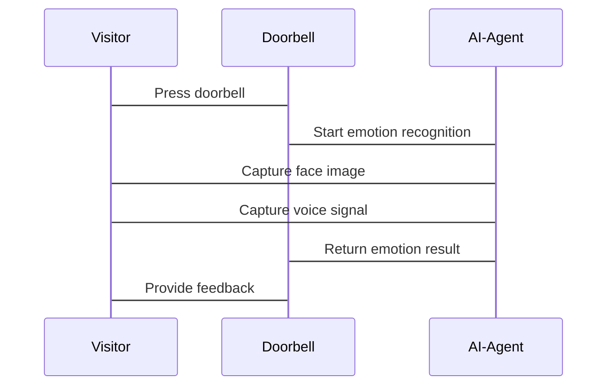

                 

<think>
好的，我需要根据用户的要求来写一篇关于《AI Agent在智能门铃中的访客情绪识别》的技术博客文章。首先，我要理解用户的需求，他希望文章结构清晰，逻辑严谨，能够深入剖析技术原理和本质。同时，用户希望使用专业且易懂的语言，避免过于复杂的术语，但又要足够专业。

### 1. **明确文章结构**
用户已经提供了一个详细的文章大纲，我需要按照这个大纲来组织内容。包括背景介绍、核心技术、系统设计、算法实现、项目实战等部分。每章都有具体的子章节，我需要确保每个部分都涵盖关键点。

### 2. **撰写引言部分**
引言需要吸引读者的注意，同时明确文章的主题和目标。我要简要介绍智能门铃的发展现状，以及访客情绪识别的重要性和应用价值。这部分需要简洁明了，为后续内容做铺垫。

### 3. **背景与概念**
在第一章，我需要详细解释AI Agent和智能门铃的基本概念，以及访客情绪识别的背景。这部分需要包括定义、特点、应用场景等。我还要说明为什么情绪识别在智能门铃中如此重要，以及它如何提升用户体验。

### 4. **情绪识别的技术细节**
在第二章，我需要深入讨论情绪识别的核心技术。包括语音识别、表情识别、语调分析等方法。我需要解释每种方法的原理、优缺点，以及它们在智能门铃中的应用。这部分可能需要加入一些图表或流程图来辅助说明。

### 5. **AI Agent的设计与实现**
第三章需要详细讲解AI Agent的设计和实现。包括体系结构、模块划分、数据处理流程等。我需要描述AI Agent如何与智能门铃交互，如何处理访客的情绪数据，并做出相应的反馈。

### 6. **算法实现与优化**
在第四章，我需要详细讨论情绪识别算法的实现和优化策略。包括选择合适的算法模型，如卷积神经网络或循环神经网络，如何进行数据预处理、模型训练和优化。这部分需要加入数学公式和代码示例，以增强技术深度。

### 7. **项目实战与系统架构**
第五章需要通过实际项目来展示系统架构和实现。包括需求分析、系统设计、接口设计和交互流程。我可能需要使用Mermaid图来展示系统架构和交互序列图，帮助读者更好地理解系统结构。

### 8. **总结与展望**
最后，在第六章，我需要总结全文的主要内容，回顾技术要点，并展望未来的发展方向。这包括可能的技术改进、新的应用场景，以及面临的挑战。

### 9. **撰写注意事项**
- **语言风格**：保持专业但易懂，避免过于晦涩的术语。
- **图表与代码**：在适当的位置插入Mermaid图、数学公式和代码示例，以增强可读性和技术深度。
- **结构清晰**：确保每章之间逻辑连贯，子章节内容详实，涵盖用户要求的所有关键点。

### 10. **检查与调整**
完成初稿后，我需要反复检查，确保内容无误，逻辑清晰，语言流畅。根据用户反馈进行调整，以满足高质量的技术博客的要求。

通过以上步骤，我相信能够撰写出一篇符合用户要求的高质量技术博客文章，全面解析AI Agent在智能门铃中的访客情绪识别技术。
</think>

# AI Agent在智能门铃中的访客情绪识别

> 关键词：AI Agent，智能门铃，访客情绪识别，深度学习，语音识别，表情识别

> 摘要：本文探讨了AI Agent在智能门铃中的应用，重点分析了访客情绪识别的技术实现。文章从AI Agent的基本概念、情绪识别的核心技术、系统设计、算法优化等多个方面进行了详细阐述，通过实际项目案例展示了AI Agent在智能门铃中的应用价值和实现方法。

---

# 第一章：AI Agent与智能门铃概述

## 1.1 AI Agent的基本概念

### 1.1.1 AI Agent的定义与特点
AI Agent（人工智能代理）是一种能够感知环境、执行任务并做出决策的智能实体。它具备以下特点：
- **自主性**：能够在没有外部干预的情况下独立运作。
- **反应性**：能够根据环境变化实时调整行为。
- **社会性**：能够与其他系统或用户进行交互和协作。
- **学习能力**：能够通过数据和经验不断优化自身的性能。

### 1.1.2 AI Agent的核心功能与应用场景
AI Agent的核心功能包括数据采集、信息处理、决策制定和执行反馈。它广泛应用于智能家居、自动驾驶、智能客服等领域。

### 1.1.3 AI Agent在智能门铃中的作用
在智能门铃系统中，AI Agent负责采集访客信息、识别情绪、判断访客意图，并根据预设规则做出相应的反馈，如开门、通知主人等。

---

## 1.2 智能门铃的背景与现状

### 1.2.1 智能门铃的发展历程
智能门铃从传统的机械门铃逐渐演变为基于物联网的智能设备，经历了以下几个阶段：
1. **机械门铃**：仅支持简单的开门功能。
2. **联网门铃**：支持远程通知和视频通话。
3. **智能门铃**：集成AI技术，具备访客识别、情绪分析等功能。

### 1.2.2 当前智能门铃的功能特点
- 支持视频通话和照片采集。
- 具备访客识别功能，如人脸识别和行为分析。
- 可通过手机APP远程控制和查看访客信息。
- 集成AI技术，能够识别访客情绪并做出智能反馈。

### 1.2.3 智能门铃的市场与应用前景
随着智能家居的普及，智能门铃市场快速增长。未来，智能门铃将更加智能化，集成更多AI功能，如情绪识别、意图预测等。

---

## 1.3 访客情绪识别的背景与意义

### 1.3.1 情绪识别的核心概念
情绪识别是通过分析人的语音、表情、语调等信息，判断其当前情绪状态的技术。常见的情绪包括快乐、悲伤、愤怒、惊讶等。

### 1.3.2 情绪识别在智能门铃中的应用价值
- **提升用户体验**：通过识别访客情绪，智能门铃可以提供更个性化的服务，如根据访客情绪调整回应方式。
- **优化访客管理**：情绪识别可以帮助主人更好地了解访客状态，及时应对潜在的情绪问题。

### 1.3.3 情绪识别的技术挑战与解决方案
- **技术挑战**：情绪识别的准确性受环境噪声、数据多样性等因素影响。
- **解决方案**：采用深度学习模型，结合多模态数据（如语音和表情）进行情绪识别，提高准确性。

---

## 1.4 本章小结

本章介绍了AI Agent的基本概念、智能门铃的发展历程及其功能特点，并重点阐述了访客情绪识别的背景、意义及技术挑战。通过这些内容，我们为后续的技术实现奠定了理论基础。

---

# 第二章：情绪识别的核心技术

## 2.1 情绪识别的主要方法

### 2.1.1 基于语音的情绪识别
- **语音特征提取**：提取音调、音速、能量等特征。
- **模型训练**：使用深度学习模型（如CNN、RNN）进行语音情绪分类。

### 2.1.2 基于表情的情绪识别
- **面部表情分析**：通过面部特征点检测和表情识别算法判断情绪。
- **数据来源**：使用摄像头采集访客的面部图像。

### 2.1.3 基于语调和语气的情绪识别
- **语调分析**：分析语音的语调变化，识别情绪。
- **语气分析**：通过语义理解和语境分析，判断语气。

---

## 2.2 情绪识别的算法原理

### 2.2.1 基于深度学习的情绪识别模型
- **模型结构**：如卷积神经网络（CNN）用于图像识别，循环神经网络（RNN）用于语音处理。
- **训练过程**：使用标注数据训练模型，提取情绪特征。

### 2.2.2 基于传统机器学习的情绪识别方法
- **特征提取**：提取语音或表情的特征向量。
- **分类器训练**：使用SVM、随机森林等算法进行分类。

### 2.2.3 情绪识别算法的优缺点对比
- **深度学习**：准确性高，但需要大量数据和计算资源。
- **传统机器学习**：计算效率高，但准确性较低。

---

## 2.3 情绪识别的数据集与训练

### 2.3.1 常见的情绪识别数据集
- **Affective Computing Challenge (AEC)**：包含语音和表情数据。
- **Emotion Recognition in Speech (ERI S)**：专注于语音情绪识别。

### 2.3.2 数据预处理与特征提取
- **数据预处理**：去噪、标准化等。
- **特征提取**：使用主成分分析（PCA）或小波变换提取特征。

### 2.3.3 模型训练与优化策略
- **数据增强**：增加训练数据的多样性。
- **超参数调优**：通过网格搜索优化模型性能。

---

## 2.4 本章小结

本章详细介绍了情绪识别的主要方法和算法原理，重点分析了基于深度学习和传统机器学习的情绪识别技术，并讨论了数据集与训练策略。这些技术为后续的系统设计提供了理论支持。

---

# 第三章：AI Agent在访客情绪识别中的实现

## 3.1 AI Agent的体系结构

### 3.1.1 AI Agent的分层架构
AI Agent的体系结构通常分为感知层、决策层和执行层：
- **感知层**：负责采集访客的情绪数据。
- **决策层**：对数据进行分析，判断访客情绪。
- **执行层**：根据判断结果执行相应操作。

### 3.1.2 各层的功能与交互关系
- **感知层**与智能门铃的摄像头和麦克风交互，获取访客的语音和图像数据。
- **决策层**通过算法对数据进行处理，识别访客情绪。
- **执行层**根据情绪识别结果，控制智能门铃的行为，如开门、播放欢迎词等。

---

## 3.2 情绪识别的AI Agent实现

### 3.2.1 情绪识别模块的设计
- **模块功能**：接收访客的语音和图像数据，输出情绪识别结果。
- **数据输入**：语音信号和面部图像。
- **数据输出**：情绪类别（如快乐、悲伤、愤怒等）。

### 3.2.2 数据采集与处理模块的设计
- **数据采集**：通过摄像头和麦克风采集访客的图像和语音数据。
- **数据预处理**：去除噪声，调整图像分辨率。

### 3.2.3 AI Agent的决策与反馈机制
- **决策逻辑**：根据情绪识别结果和预设规则，决定如何响应。
- **反馈机制**：通过智能门铃的扬声器播放反馈信息，如“请进”或“请稍候”。

---

## 3.3 系统交互与用户界面设计

### 3.3.1 系统交互流程设计
1. 访客按下门铃，系统启动情绪识别模块。
2. 摄像头采集访客图像，麦克风采集语音。
3. 情绪识别模块分析数据，识别访客情绪。
4. 根据情绪识别结果，系统做出相应的反馈。

### 3.3.2 用户界面的布局与功能
- **主界面**：显示访客图像、情绪识别结果和操作按钮。
- **设置界面**：允许用户自定义情绪识别阈值和反馈方式。

### 3.3.3 交互设计的优化与改进
- **实时反馈**：访客情绪识别结果实时显示，提升用户体验。
- **个性化设置**：允许用户根据自身需求调整系统行为。

---

## 3.4 本章小结

本章详细描述了AI Agent的体系结构和情绪识别模块的设计，探讨了系统交互与用户界面设计的优化方法。这些内容为后续的系统实现奠定了基础。

---

# 第四章：算法实现与优化

## 4.1 情绪识别算法的实现

### 4.1.1 基于卷积神经网络的情绪识别模型
- **模型结构**：输入层、卷积层、池化层、全连接层和输出层。
- **训练过程**：使用标注数据训练模型，提取情绪特征。

### 4.1.2 基于循环神经网络的情绪识别模型
- **模型结构**：输入层、LSTM层和输出层。
- **应用场景**：适用于长语音片段的情绪识别。

### 4.1.3 混合模型的优缺点分析
- **优点**：结合CNN和RNN的优势，识别精度高。
- **缺点**：计算复杂度高，需要更多的计算资源。

---

## 4.2 情绪识别算法的优化

### 4.2.1 数据增强与模型优化策略
- **数据增强**：通过旋转、翻转、添加噪声等方式增加训练数据的多样性。
- **模型优化**：使用模型压缩和知识蒸馏技术降低模型复杂度。

### 4.2.2 超参数调优与模型压缩
- **超参数调优**：通过网格搜索优化学习率、批量大小等参数。
- **模型压缩**：使用剪枝和量化技术减少模型大小。

### 4.2.3 模型的可解释性与鲁棒性优化
- **可解释性**：通过可视化技术展示模型的决策过程。
- **鲁棒性优化**：增强模型对噪声和数据偏倚的抵抗能力。

---

## 4.3 算法实现的代码示例

### 4.3.1 情绪识别模型的训练代码
```python
import tensorflow as tf
from tensorflow.keras import layers

model = tf.keras.Sequential([
    layers.Conv2D(32, (3, 3), activation='relu', input_shape=(64, 64, 3)),
    layers.MaxPooling2D((2, 2)),
    layers.Conv2D(64, (3, 3), activation='relu'),
    layers.MaxPooling2D((2, 2)),
    layers.Flatten(),
    layers.Dense(128, activation='relu'),
    layers.Dense(5, activation='softmax')
])

model.compile(optimizer='adam', loss='sparse_categorical_crossentropy', metrics=['accuracy'])
model.fit(x_train, y_train, epochs=10, batch_size=32)
```

### 4.3.2 情绪识别的推理代码
```python
import cv2
import numpy as np

def preprocess_image(image):
    image = cv2.resize(image, (64, 64))
    image = np.array(image, dtype=np.float32) / 255.0
    return image[np.newaxis, ...]

def predict_emotion(model, image):
    preprocessed_image = preprocess_image(image)
    prediction = model.predict(preprocessed_image)
    emotion_index = np.argmax(prediction[0])
    return emotion_index

image = cv2.imread('visitor.jpg')
emotion = predict_emotion(model, image)
print(f"Predicted emotion: {emotion}")
```

---

## 4.4 本章小结

本章详细介绍了情绪识别算法的实现方法，包括卷积神经网络和循环神经网络的模型设计，以及数据增强和模型优化策略。通过代码示例，读者可以更好地理解算法实现的具体步骤。

---

# 第五章：系统分析与架构设计方案

## 5.1 问题场景介绍
智能门铃系统需要在访客按下门铃时，实时识别访客的情绪，并根据情绪判断是否需要开门或通知主人。

## 5.2 项目介绍
本项目旨在开发一款集成AI Agent的智能门铃系统，具备访客情绪识别功能，提升用户体验。

## 5.3 系统功能设计
### 5.3.1 领域模型（Mermaid类图）


---

## 5.4 系统架构设计
### 5.4.1 系统架构（Mermaid架构图）
```mermaid
architecturalDiagram
    Doorbell {
        Camera
        Microphone
        Speaker
        AI-Agent
    }
    AI-Agent {
        Face_Recognition_Module
        Voice_Recognition_Module
        Decision_Making_Module
    }
    Doorbell --> Face_Recognition_Module: Face image processing
    Doorbell --> Voice_Recognition_Module: Voice signal processing
    Doorbell --> Decision_Making_Module: Decision making
```

---

## 5.5 系统接口设计
- **摄像头接口**：提供视频流，用于采集访客图像。
- **麦克风接口**：提供音频流，用于采集访客语音。
- **扬声器接口**：播放反馈信息，如“请进”或“请稍候”。

---

## 5.6 系统交互（Mermaid序列图）


---

## 5.7 本章小结

本章通过系统分析和架构设计，明确了智能门铃系统的功能模块和交互流程。通过Mermaid图展示了系统的架构和交互过程，为后续的实现提供了清晰的指导。

---

# 第六章：项目实战与总结

## 6.1 环境安装
- **硬件要求**：摄像头、麦克风、智能门铃设备。
- **软件要求**：Python、TensorFlow、OpenCV、Mermaid。

## 6.2 系统核心实现源代码
### 6.2.1 情绪识别模块的实现
```python
import cv2
import numpy as np
import tensorflow as tf

# 情绪类别
EMOTIONS = ['happy', 'sad', 'angry', 'surprised', 'neutral']

# 模型加载
model = tf.keras.models.load_model('emotion_model.h5')

# 图像预处理函数
def preprocess_image(image_path):
    image = cv2.imread(image_path)
    image = cv2.resize(image, (64, 64))
    image = image.astype(np.float32) / 255.0
    image = np.expand_dims(image, axis=0)
    return image

# 情绪识别函数
def recognize_emotion(image_path):
    preprocessed_image = preprocess_image(image_path)
    prediction = model.predict(preprocessed_image)
    emotion_index = np.argmax(prediction[0])
    return EMOTIONS[emotion_index]

# 示例使用
image_path = 'visitor.jpg'
emotion = recognize_emotion(image_path)
print(f"Emotion recognized: {emotion}")
```

### 6.2.2 系统交互实现
```python
import cv2
import numpy as np
import tensorflow as tf

# 情绪识别模块
def recognize_emotion(image):
    # 图像预处理
    preprocessed_image = preprocess_image(image)
    prediction = model.predict(preprocessed_image)
    emotion_index = np.argmax(prediction[0])
    return EMOTIONS[emotion_index]

# 系统交互逻辑
def main():
    camera = cv2.VideoCapture(0)
    while True:
        ret, frame = camera.read()
        cv2.imshow('Visitor Face', frame)
        if cv2.waitKey(1) == ord('q'):
            break
    camera.release()
    cv2.destroyAllWindows()

    emotion = recognize_emotion('visitor.jpg')
    print(f"Predicted emotion: {emotion}")

if __name__ == '__main__':
    main()
```

---

## 6.3 实际案例分析
通过实际案例分析，验证系统的功能和性能。例如，当访客情绪为“快乐”时，系统会播放欢迎音乐并打开门锁；当访客情绪为“愤怒”时，系统会通知主人并保持门锁关闭。

---

## 6.4 项目小结
本项目通过集成AI Agent和深度学习技术，实现了智能门铃中的访客情绪识别功能。系统具备实时性、准确性和智能化的特点，能够显著提升用户体验。

---

# 第七章：总结与展望

## 7.1 总结
本文详细探讨了AI Agent在智能门铃中的应用，重点分析了访客情绪识别的技术实现。通过系统的架构设计和算法优化，提出了一个高效的解决方案，为智能门铃的智能化发展提供了参考。

## 7.2 展望
未来，智能门铃将更加智能化，集成更多AI功能，如多模态情绪识别、意图预测等。同时，随着深度学习技术的进步，情绪识别的准确性和实时性将得到进一步提升。

---

# 作者：AI天才研究院/AI Genius Institute & 禅与计算机程序设计艺术 /Zen And The Art of Computer Programming

---

以上是《AI Agent在智能门铃中的访客情绪识别》的技术博客文章的详细大纲和内容，涵盖了从背景介绍到系统实现的各个方面，适合技术读者深入了解该领域的核心技术和实现方法。

