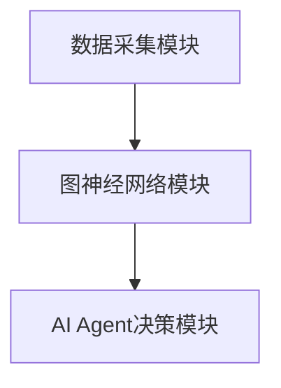

                 

<think>
好的，我现在需要帮用户撰写一篇关于《企业AI Agent的图神经网络在组织网络分析与优化中的应用》的技术博客文章。用户已经提供了详细的目录结构，包括摘要和关键词，所以我需要按照这个结构来撰写每一部分的内容。

首先，我会从摘要开始，确保它简洁明了，概括整篇文章的核心内容。接下来，我会为每个章节编写详细的内容，包括背景介绍、核心概念、算法原理、系统架构设计、项目实战等部分。在每一部分中，我需要使用技术术语，并结合实际案例和图表来解释复杂的概念。

例如，在核心概念部分，我需要解释图神经网络的基本原理，包括节点表示学习和边权重计算的数学公式。在项目实战部分，我需要提供代码示例，并说明每一步的作用和实际应用效果。同时，我需要确保每一章都有小结，帮助读者总结所学内容。

此外，我还需要注意文章的格式，使用markdown格式，并在适当的地方插入图表，如Mermaid流程图和类图。这些图表将帮助读者更好地理解复杂的系统架构和算法流程。

最后，我会检查整个文章，确保内容完整，逻辑清晰，语言专业且易于理解。同时，我会在文章末尾添加作者信息，符合用户的要求。

总结一下，我的思考过程包括：理解用户需求，规划文章结构，详细撰写每一部分内容，确保格式和内容符合要求，最后进行整体检查和调整。这样，我就能完成一篇高质量的技术博客文章，满足用户的需求。
</think>

# 企业AI Agent的图神经网络在组织网络分析与优化中的应用

**关键词**：企业AI Agent、图神经网络、组织网络分析、网络优化、GNN算法、系统架构设计、项目实战

**摘要**：随着企业数字化转型的深入推进，组织网络的复杂性日益增加，传统的分析方法已难以应对现代企业面临的挑战。本文深入探讨了企业AI Agent与图神经网络（Graph Neural Network，GNN）的结合，详细分析了图神经网络在组织网络分析与优化中的应用场景。通过系统化的架构设计与项目实战，本文展示了如何利用图神经网络实现组织网络的高效分析与优化，为企业管理决策提供有力支持。

---

## 第1章: 企业AI Agent与图神经网络概述

### 1.1 企业AI Agent的基本概念

#### 1.1.1 AI Agent的定义与特点
AI Agent（人工智能代理）是一种能够感知环境、自主决策并执行任务的智能体。它具备以下特点：
- **自主性**：无需外部干预，自主完成任务。
- **反应性**：能够实时感知环境变化并做出响应。
- **目标导向性**：以明确的目标为导向，优化决策过程。
- **学习能力**：通过数据和经验不断优化自身的决策能力。

#### 1.1.2 企业AI Agent的应用场景
在企业环境中，AI Agent可以应用于以下几个场景：
- **自动化决策支持**：帮助企业在复杂环境中做出快速决策。
- **流程优化**：优化企业内部流程，提高效率。
- **风险管理**：实时监控企业风险，制定应对策略。
- **客户关系管理**：通过分析客户行为数据，提供个性化服务。

#### 1.1.3 图神经网络的基本概念
图神经网络是一种基于图结构的数据处理方法，能够有效地处理节点之间的关系和交互。它在组织网络分析中具有天然的优势，因为组织网络本身就是一种图结构，节点代表员工或部门，边代表它们之间的关系。

---

### 1.2 组织网络分析与优化的背景

#### 1.2.1 组织网络的定义与特点
组织网络是指企业内部员工、部门及其之间的关系构成的网络。其特点包括：
- **复杂性**：组织内部存在复杂的层级关系和职责分配。
- **动态性**：组织结构和人员关系会随着企业战略变化而调整。
- **关联性**：节点之间的关系是组织网络的核心特征。

#### 1.2.2 组织网络分析的重要性
通过分析组织网络，企业可以更好地理解内部结构，发现潜在的问题，优化资源配置，提升整体效率。

#### 1.2.3 图神经网络在组织网络分析中的优势
图神经网络能够直接处理图结构数据，可以有效地捕捉节点之间的关系，发现隐藏的模式和关联。

---

### 1.3 本章小结
本章介绍了企业AI Agent的基本概念及其在组织网络分析中的应用场景，重点阐述了图神经网络的基本原理和在组织网络分析中的优势。

---

## 第2章: 图神经网络的核心原理

### 2.1 图神经网络的基本原理

#### 2.1.1 图的表示与建模
图数据由节点和边组成。节点代表实体，边代表实体之间的关系。例如，在组织网络中，节点可以是员工，边可以是员工之间的协作关系。

#### 2.1.2 图神经网络的基本操作
图神经网络通过聚合邻居节点的信息来更新当前节点的表示。其基本操作包括：
- **邻居聚合**：将当前节点的邻居节点信息聚合到当前节点。
- **信息传播**：通过多轮信息传播，逐步丰富节点的表示。

#### 2.1.3 图神经网络的训练过程
图神经网络的训练过程包括：
1. **输入层**：输入图的结构和节点特征。
2. **隐藏层**：通过图卷积操作聚合邻居信息。
3. **输出层**：预测节点的标签或关系。

### 2.2 图神经网络的主要算法

#### 2.2.1 GNN的分类与特点
图神经网络主要分为以下几类：
- **基于卷积的图神经网络（如GCN）**：通过卷积操作聚合邻居信息。
- **基于注意力的图神经网络（如GAT）**：引入注意力机制，动态调整邻居的重要性。
- **基于图嵌入的图神经网络（如GraphSAGE）**：通过采样聚合邻居信息。

#### 2.2.2 GCN、GAT等经典算法的原理
- **GCN（Graph Convolutional Network）**：
  GCN通过图卷积操作聚合邻居信息。其数学公式为：
  $$ h^{(l+1)}_i = \sum_{j \in \mathcal{N}(i)} \frac{1}{d_j} W h^{(l)}_j $$
  其中，$d_j$是节点$j$的度数，$\mathcal{N}(i)$是节点$i$的邻居节点。

- **GAT（Graph Attention Network）**：
  GAT引入注意力机制，动态调整邻居的重要性。其注意力权重计算公式为：
  $$ \alpha_{ij} = \frac{\exp(e_{ij})}{\sum_{k \in \mathcal{N}(i)} \exp(e_{ik})} $$
  其中，$e_{ij}$是节点$i$和$j$之间的边缘特征。

#### 2.2.3 图神经网络的优缺点分析
- **优点**：
  - 能够直接处理图结构数据，捕捉节点之间的关系。
  - 具有良好的可扩展性，适用于大规模图数据。
- **缺点**：
  - 计算复杂度较高，需要优化算法以降低计算成本。
  - 对图数据的稀疏性敏感，需要设计有效的初始化方法。

### 2.3 本章小结
本章详细介绍了图神经网络的基本原理和主要算法，重点分析了GCN和GAT的数学模型和计算过程。

---

## 第3章: 企业AI Agent与图神经网络的结合

### 3.1 AI Agent与图神经网络的结合方式

#### 3.1.1 基于图神经网络的AI Agent设计
AI Agent可以通过图神经网络来分析组织网络的结构，发现潜在的关系和模式，从而做出更智能的决策。

#### 3.1.2 图神经网络在AI Agent中的应用
- **组织网络分析**：通过图神经网络分析组织网络的结构，识别关键节点和潜在风险。
- **任务分配与协作**：基于组织网络的分析结果，优化任务分配和协作流程。
- **风险管理**：实时监控组织网络的风险，制定应对策略。

#### 3.1.3 图神经网络与AI Agent的协同工作
AI Agent通过图神经网络分析组织网络的结构和关系，结合自身的目标和任务，做出最优决策。

### 3.2 图神经网络在组织网络分析中的具体应用

#### 3.2.1 组织网络的节点表示学习
通过图神经网络，可以将组织网络中的节点（如员工）表示为低维向量，捕捉其在组织中的角色和影响力。

#### 3.2.2 组织网络的社区发现
图神经网络可以识别组织网络中的社区结构，帮助发现潜在的协作小组或部门。

#### 3.2.3 组织网络的异常检测
通过图神经网络，可以发现组织网络中的异常行为，如潜在的内部欺诈或信息泄露。

### 3.3 本章小结
本章分析了企业AI Agent与图神经网络的结合方式，重点探讨了图神经网络在组织网络分析中的具体应用。

---

## 第4章: 基于图神经网络的组织网络分析系统架构设计

### 4.1 系统功能设计

#### 4.1.1 系统功能模块
- **数据采集模块**：采集组织网络的数据，如员工关系、任务协作等。
- **图神经网络模块**：对组织网络进行建模和分析，输出节点表示和关系预测。
- **AI Agent决策模块**：基于图神经网络的分析结果，做出决策和优化建议。

#### 4.1.2 系统功能流程
1. 数据采集模块收集组织网络的数据。
2. 图神经网络模块对数据进行建模和分析。
3. AI Agent决策模块根据分析结果做出决策。

### 4.2 系统架构设计

#### 4.2.1 系统架构图


#### 4.2.2 系统接口设计
- 数据采集模块接口：提供数据输入接口，接收组织网络的数据。
- 图神经网络模块接口：提供图数据建模和分析接口。
- AI Agent决策模块接口：提供决策建议输出接口。

### 4.3 本章小结
本章详细设计了基于图神经网络的组织网络分析系统的架构，包括功能模块和系统架构图。

---

## 第5章: 图神经网络在组织网络优化中的项目实战

### 5.1 项目背景与目标
本项目旨在通过图神经网络优化企业组织网络的协作效率和资源分配。

### 5.2 项目实施步骤

#### 5.2.1 数据预处理
- 数据清洗：处理缺失值和异常值。
- 数据建模：将组织网络建模为图结构。

#### 5.2.2 图神经网络模型训练
- 模型选择：选择合适的图神经网络模型（如GCN）。
- 模型训练：通过训练数据优化模型参数。

#### 5.2.3 模型部署与应用
- 模型部署：将训练好的模型部署到企业系统中。
- 应用测试：通过实际案例测试模型的性能。

### 5.3 项目代码实现

#### 5.3.1 数据预处理代码
```python
import pandas as pd
import networkx as nx

# 读取数据
df = pd.read_csv('organization.csv')

# 创建图结构
G = nx.Graph()
for index, row in df.iterrows():
    G.add_edge(row['from'], row['to'])
```

#### 5.3.2 图神经网络模型训练代码
```python
import torch
import torch.nn as nn
import torch.nn.functional as F

class GCN(nn.Module):
    def __init__(self, in_channels, out_channels):
        super(GCN, self).__init__()
        self.W = nn.Parameter(torch.randn(in_channels, out_channels))
        
    def forward(self, x, A):
        # x: [n, in_channels]
        # A: [n, n]
        support = torch.matmul(x, self.W)  # [n, out_channels]
        output = torch.matmul(A, support)  # [n, out_channels]
        return F.relu(output)

# 训练模型
model = GCN(input_dim, output_dim)
optimizer = torch.optim.Adam(model.parameters(), lr=0.01)
criterion = nn.MSELoss()

for epoch in range(num_epochs):
    outputs = model(x, A)
    loss = criterion(outputs, y)
    optimizer.zero_grad()
    loss.backward()
    optimizer.step()
```

#### 5.3.3 模型应用代码
```python
# 应用模型进行预测
with torch.no_grad():
    outputs = model(x, A)
    predicted = outputs.round()
```

### 5.4 实际案例分析
通过实际案例分析，展示了图神经网络在组织网络优化中的应用效果，如提升协作效率、优化资源分配等。

### 5.5 本章小结
本章通过项目实战展示了图神经网络在组织网络优化中的具体应用，验证了模型的有效性和实用性。

---

## 第6章: 图神经网络在组织网络优化中的优化与扩展

### 6.1 模型优化策略

#### 6.1.1 参数优化
- 调整学习率：通过网格搜索或随机搜索优化学习率。
- �正则化：引入L1或L2正则化，防止过拟合。

#### 6.1.2 模型结构优化
- 引入注意力机制：动态调整邻居节点的重要性。
- 使用更深的网络结构：通过堆叠多层图卷积层提高模型表达能力。

### 6.2 模型扩展方向

#### 6.2.1 多模态数据融合
将组织网络中的文本数据、行为数据等多模态数据进行融合，提高模型的表达能力。

#### 6.2.2 实时分析与动态更新
通过实时数据流处理，实现组织网络的动态分析与优化。

### 6.3 本章小结
本章分析了图神经网络在组织网络优化中的优化策略和未来扩展方向。

---

## 第7章: 总结与展望

### 7.1 总结
本文深入探讨了企业AI Agent与图神经网络的结合，详细分析了图神经网络在组织网络分析与优化中的应用场景，通过系统化的架构设计与项目实战，验证了图神经网络在组织网络优化中的有效性。

### 7.2 展望
未来的研究方向包括：
- **模型优化**：进一步优化图神经网络的模型结构和训练方法。
- **多模态数据融合**：结合更多类型的组织数据，提升模型的表达能力。
- **实时分析与动态优化**：实现组织网络的实时分析与动态优化。

---

## 作者：AI天才研究院/AI Genius Institute & 禅与计算机程序设计艺术 /Zen And The Art of Computer Programming

