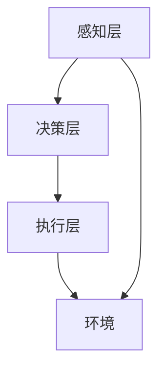
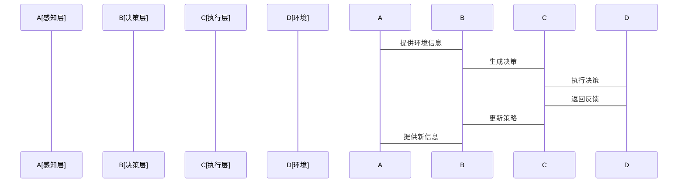

                 

<think>
好，我现在需要撰写一篇名为《构建具有元学习能力的AI Agent》的技术博客文章。首先，我需要理解元学习和AI Agent的基本概念，以及它们之间的关系。

首先，什么是元学习？元学习（Meta-Learning）是一种机器学习的范式，旨在通过学习如何学习来提高模型的适应能力。与传统机器学习不同，元学习的目标是通过少量数据快速适应新任务，而不是依赖大量数据进行训练。

接下来，AI Agent是什么？AI Agent（人工智能代理）是指能够感知环境、自主决策并采取行动以实现目标的智能实体。AI Agent可以是软件程序、机器人或其他智能系统，具备自主性和智能性。

那么，元学习如何增强AI Agent的能力呢？元学习使得AI Agent能够在面对新任务时，快速调整自己的参数或策略，而无需重新进行大量的训练。这种能力特别适用于动态变化的环境，AI Agent需要快速适应新情况。

现在，我需要了解当前元学习与AI Agent的研究现状。目前，元学习在AI Agent中的应用主要集中在以下几个方面：

1. **多任务学习**：元学习可以帮助AI Agent在一个任务上学习后，快速适应相关任务，提高学习效率。
2. **持续学习**：元学习使得AI Agent能够逐步学习新任务，而不必每次都从头开始训练。
3. **零样本学习**：元学习能够使AI Agent在仅有少量样本的情况下，快速掌握新任务。

然而，元学习与AI Agent的结合也面临一些挑战。例如，如何设计高效的元学习算法，如何处理不同任务之间的干扰，如何在复杂环境中实现快速适应等。

接下来，我需要详细讲解元学习的理论基础。首先，元学习的核心概念包括元学习模型、元任务和元训练。元学习模型是指能够进行元学习的模型，元任务是指用于训练元学习模型的任务集合，元训练则是指对元学习模型进行训练的过程。

元学习的数学模型通常涉及优化目标函数和损失函数。例如，元学习的目标函数可以表示为：

$$ L_{\text{meta}}(\theta) = \sum_{i=1}^{N} L_{i}(\theta; x_i, y_i) $$

其中，$\theta$表示模型参数，$N$表示任务的数量，$L_i$表示第$i$个任务的损失函数。

在实际应用中，元学习算法通常分为基于梯度的方法和基于参数共享的方法。基于梯度的方法通过计算梯度来进行元优化，而基于参数共享的方法则通过共享参数来实现跨任务的学习。

接下来，我需要探讨AI Agent的核心算法，如强化学习和监督学习在元学习中的应用。强化学习通过与环境的交互来学习策略，而元学习可以增强强化学习的能力，使其能够更快地适应新任务。

在系统设计部分，我需要介绍AI Agent的架构，包括感知层、决策层和执行层，并使用Mermaid图来展示系统的整体架构和模块之间的关系。

最后，在项目实战部分，我将通过一个具体的案例，如构建一个多任务学习的元学习AI Agent，来展示如何实现元学习与AI Agent的结合。这包括环境配置、代码实现、功能解读和案例分析。

通过以上步骤，我希望能够构建一个逻辑清晰、结构紧凑且内容丰富的技术博客文章，详细讲解如何构建具有元学习能力的AI Agent。
</think>

# 构建具有元学习能力的AI Agent

## 关键词：元学习、AI Agent、机器学习、强化学习、多任务学习

## 摘要：本文详细探讨了如何构建具有元学习能力的AI Agent。首先介绍了元学习和AI Agent的基本概念及其重要性，接着分析了元学习的理论基础，包括核心概念、算法模型和数学公式。然后，详细讲解了AI Agent的核心算法，如强化学习和监督学习在元学习中的应用。通过系统设计和项目实战，展示了如何构建一个多任务学习的元学习AI Agent，并提供了环境配置、代码实现和案例分析。最后，总结了当前研究的前沿和未来发展方向，提出了实际应用中的最佳实践建议。

---

# 第1章: 元学习与AI Agent概述

## 1.1 元学习的定义与特点

### 1.1.1 元学习的定义
元学习是一种机器学习范式，旨在通过学习如何学习来提高模型的适应能力。它不同于传统机器学习，元学习的目标是通过少量数据快速适应新任务。

### 1.1.2 元学习的核心特点
- **快速适应性**：能够在新任务中快速调整参数，减少训练时间。
- **多任务学习**：能够同时学习多个任务，并利用这些任务之间的关系来提高整体性能。
- **泛化能力**：能够在不同任务之间共享知识，提高模型的泛化能力。

### 1.1.3 元学习与传统机器学习的区别
- **数据需求**：传统机器学习需要大量数据，而元学习可以通过少量数据快速适应新任务。
- **学习目标**：传统机器学习专注于特定任务，而元学习专注于学习如何学习，以适应新任务。

## 1.2 AI Agent的定义与特点

### 1.2.1 AI Agent的定义
AI Agent是指能够感知环境、自主决策并采取行动以实现目标的智能实体。它可以是一个软件程序、机器人或其他智能系统。

### 1.2.2 AI Agent的核心特点
- **自主性**：能够在没有外部干预的情况下自主决策。
- **反应性**：能够根据环境的变化实时调整行为。
- **目标导向性**：所有行为都以实现特定目标为导向。

### 1.2.3 AI Agent与传统AI的区别
- **自主性**：AI Agent具备更强的自主性，能够独立完成任务。
- **适应性**：AI Agent能够根据环境变化调整行为，而传统AI则需要重新训练。

## 1.3 元学习在AI Agent中的重要性

### 1.3.1 元学习如何增强AI Agent的能力
- **快速适应新任务**：元学习使得AI Agent能够在新任务中快速调整参数，减少训练时间。
- **多任务学习**：元学习能够帮助AI Agent在一个任务上学习后，快速适应相关任务，提高学习效率。

### 1.3.2 元学习在AI Agent中的应用场景
- **动态环境适应**：在动态变化的环境中，AI Agent需要快速适应新情况。
- **多任务执行**：AI Agent需要在多个任务之间切换，快速调整策略。

### 1.3.3 元学习与AI Agent的结合优势
- **高效性**：元学习能够提高AI Agent的学习效率，使其能够在短时间内适应新任务。
- **灵活性**：元学习使得AI Agent具备更强的灵活性，能够适应不同环境和任务。

## 1.4 当前元学习与AI Agent的研究现状

### 1.4.1 元学习领域的研究进展
- **Meta-Learning in Neural Networks**：研究如何在神经网络中应用元学习，以提高模型的泛化能力。
- ** Few-shot Learning**：研究如何通过少量数据快速适应新任务。

### 1.4.2 AI Agent领域的研究进展
- **强化学习在AI Agent中的应用**：通过强化学习，AI Agent能够在动态环境中自主决策。
- **多智能体协作**：研究多个AI Agent之间的协作，以实现更复杂的任务。

### 1.4.3 元学习与AI Agent结合的研究现状
- **元强化学习（Meta-Reinforcement Learning）**：研究如何在强化学习中应用元学习，以提高AI Agent的适应能力。
- **多任务强化学习**：研究如何在多个任务之间共享知识，提高AI Agent的学习效率。

## 1.5 本章小结
本章介绍了元学习和AI Agent的基本概念及其特点，探讨了元学习在AI Agent中的重要性，并分析了当前的研究现状。通过这些内容，读者可以理解元学习与AI Agent结合的背景和意义。

---

# 第2章: 元学习的理论基础

## 2.1 元学习的核心概念

### 2.1.1 元学习的定义与核心思想
元学习的目标是通过学习如何学习，提高模型的适应能力。核心思想是利用任务之间的关系，快速适应新任务。

### 2.1.2 元学习的数学模型与公式
元学习的目标函数可以表示为：

$$ L_{\text{meta}}(\theta) = \sum_{i=1}^{N} L_{i}(\theta; x_i, y_i) $$

其中，$\theta$表示模型参数，$N$表示任务的数量，$L_i$表示第$i$个任务的损失函数。

### 2.1.3 元学习的优化方法
元学习的优化通常采用基于梯度的方法，通过对损失函数求梯度来更新模型参数。

## 2.2 元学习的算法模型

### 2.2.1 元学习算法的分类
元学习算法可以分为基于梯度的元学习算法和基于参数共享的元学习算法。

### 2.2.2 基于梯度的元学习算法
基于梯度的元学习算法通过计算梯度来进行元优化，典型算法包括Meta-SGD和MAML。

### 2.2.3 基于参数共享的元学习算法
基于参数共享的元学习算法通过共享参数来实现跨任务的学习，典型算法包括EENS和MIL.

## 2.3 元学习与传统机器学习的对比

### 2.3.1 传统机器学习的特点
- 数据需求量大。
- 适用于特定任务，难以快速适应新任务。

### 2.3.2 元学习的特点
- 数据需求量小。
- 能够快速适应新任务。

### 2.3.3 元学习的优势与局限性
- **优势**：能够快速适应新任务，适用于动态变化的环境。
- **局限性**：在某些任务上可能不如传统机器学习精确，需要更多的计算资源。

## 2.4 本章小结
本章详细讲解了元学习的核心概念、算法模型和数学公式，分析了元学习与传统机器学习的区别。通过这些内容，读者可以理解元学习的理论基础及其在AI Agent中的应用。

---

# 第3章: AI Agent的核心算法

## 3.1 强化学习在AI Agent中的应用

### 3.1.1 强化学习的基本原理
强化学习是一种通过与环境交互来学习策略的方法，目标是在长期累计奖励下最大化累积奖励。

### 3.1.2 强化学习在AI Agent中的应用案例
- **游戏AI**：如AlphaGo和Dota AI。
- **机器人控制**：如工业机器人和自动驾驶。

### 3.1.3 强化学习的优缺点
- **优点**：能够适应动态环境，自主决策。
- **缺点**：需要大量的训练时间，容易陷入局部最优。

## 3.2 监督学习在AI Agent中的应用

### 3.2.1 监督学习的基本原理
监督学习是一种通过标注数据进行学习的方法，目标是学习一个函数，能够将输入映射到输出。

### 3.2.2 监督学习在AI Agent中的应用案例
- **图像识别**：如自动驾驶中的物体识别。
- **语音识别**：如智能音箱的语音识别。

### 3.2.3 监督学习的优缺点
- **优点**：适用于结构化数据，结果精确。
- **缺点**：难以处理动态变化的环境。

## 3.3 对比学习在AI Agent中的应用

### 3.3.1 对比学习的基本原理
对比学习是一种通过比较不同样本的相似性来学习特征表示的方法。

### 3.3.2 对比学习在AI Agent中的应用案例
- **图像检索**：通过对比学习，AI Agent能够快速检索相似的图像。
- **推荐系统**：通过对比学习，AI Agent能够推荐相似的物品。

### 3.3.3 对比学习的优缺点
- **优点**：能够有效地学习特征表示，适用于多任务学习。
- **缺点**：需要大量的对比样本，计算资源消耗大。

## 3.4 本章小结
本章介绍了强化学习、监督学习和对比学习在AI Agent中的应用，分析了它们的优缺点。通过这些内容，读者可以理解AI Agent的核心算法及其在元学习中的应用。

---

# 第4章: AI Agent的系统设计

## 4.1 系统架构设计

### 4.1.1 系统模块划分
- **感知层**：负责感知环境信息，如视觉、听觉等。
- **决策层**：负责根据感知信息进行决策，制定行动计划。
- **执行层**：负责执行决策，与环境进行交互。

### 4.1.2 系统功能设计
- **环境感知**：通过传感器或API感知环境信息。
- **任务分析**：分析当前任务的需求和约束。
- **策略生成**：根据任务需求生成相应的策略。
- **策略执行**：执行生成的策略，与环境进行交互。
- **学习优化**：通过元学习优化策略，提高适应能力。

### 4.1.3 系统架构图


## 4.2 数据流设计

### 4.2.1 数据输入
- **环境信息**：如传感器数据、用户输入等。
- **任务需求**：如目标、约束条件等。

### 4.2.2 数据处理
- **特征提取**：将环境信息转换为特征表示。
- **任务分析**：分析任务需求，生成相应的策略。

### 4.2.3 数据输出
- **决策结果**：如动作、指令等。
- **学习结果**：如优化后的参数、模型等。

## 4.3 系统交互流程

### 4.3.1 交互流程图


## 4.4 本章小结
本章详细讲解了AI Agent的系统架构设计、数据流设计和交互流程，通过Mermaid图展示了系统的整体架构和模块之间的关系。

---

# 第5章: 项目实战——构建一个多任务学习的元学习AI Agent

## 5.1 项目介绍

### 5.1.1 项目目标
构建一个多任务学习的元学习AI Agent，能够在多个任务之间切换，快速适应新任务。

### 5.1.2 项目需求
- **多任务学习**：能够在多个任务之间切换，共享知识。
- **快速适应**：能够在新任务中快速调整参数，减少训练时间。

## 5.2 环境配置

### 5.2.1 环境要求
- **Python**：3.6+
- **深度学习框架**：TensorFlow或PyTorch
- **其他依赖**：numpy, matplotlib, etc.

### 5.2.2 安装依赖
```bash
pip install numpy matplotlib tensorflow
```

## 5.3 核心代码实现

### 5.3.1 元学习模型
```python
import tensorflow as tf

class MetaLearningModel(tf.keras.Model):
    def __init__(self):
        super(MetaLearningModel, self).__init__()
        self.dense1 = tf.keras.layers.Dense(64, activation='relu')
        self.dense2 = tf.keras.layers.Dense(10, activation='softmax')

    def call(self, inputs):
        x = self.dense1(inputs)
        x = self.dense2(x)
        return x
```

### 5.3.2 元学习训练
```python
model = MetaLearningModel()
optimizer = tf.keras.optimizers.Adam(learning_rate=0.001)

def meta_loss(y_true, y_pred):
    return tf.keras.losses.sparse_categorical_crossentropy(y_true, y_pred)

for epoch in range(num_epochs):
    for task in tasks:
        with tf.GradientTape() as tape:
            predictions = model(task.input)
            loss = meta_loss(task.label, predictions)
        gradients = tape.gradient(loss, model.trainable_variables)
        optimizer.apply_gradients(model.trainable_variables, gradients)
```

## 5.4 功能解读与案例分析

### 5.4.1 功能解读
- **多任务学习**：通过共享模型参数，实现多个任务之间的知识共享。
- **快速适应**：通过元学习，能够在新任务中快速调整参数，减少训练时间。

### 5.4.2 案例分析
假设我们有一个多任务分类问题，包含多个子任务，每个子任务有少量样本。通过元学习，AI Agent可以在每个子任务上进行少量训练，然后快速适应新的子任务。

## 5.5 本章小结
本章通过一个具体的案例，展示了如何构建一个多任务学习的元学习AI Agent。通过环境配置、代码实现和功能解读，读者可以理解元学习在AI Agent中的实际应用。

---

# 第6章: 总结与展望

## 6.1 本章总结
本文详细探讨了如何构建具有元学习能力的AI Agent。首先介绍了元学习和AI Agent的基本概念及其重要性，接着分析了元学习的理论基础，包括核心概念、算法模型和数学公式。然后，详细讲解了AI Agent的核心算法，如强化学习和监督学习在元学习中的应用。通过系统设计和项目实战，展示了如何构建一个多任务学习的元学习AI Agent，并提供了环境配置、代码实现和案例分析。

## 6.2 研究前沿
- **元强化学习**：研究如何在强化学习中应用元学习，以提高AI Agent的适应能力。
- **多智能体协作**：研究多个AI Agent之间的协作，以实现更复杂的任务。

## 6.3 未来发展方向
- **更高效的元学习算法**：开发更高效的元学习算法，以提高AI Agent的学习效率。
- **更复杂的任务场景**：研究如何在更复杂的任务场景中应用元学习，如多模态学习和人机协作。

## 6.4 最佳实践 tips
- **选择合适的元学习算法**：根据具体任务需求选择合适的元学习算法。
- **充分的数据准备**：确保数据的质量和多样性，以提高模型的泛化能力。
- **合理的系统设计**：设计合理的系统架构，确保系统的可扩展性和可维护性。

## 6.5 本章小结
本文总结了构建具有元学习能力的AI Agent的核心内容，探讨了当前的研究前沿和未来发展方向，并提出了实际应用中的最佳实践建议。

---

# 作者：AI天才研究院/AI Genius Institute & 禅与计算机程序设计艺术 /Zen And The Art of Computer Programming

