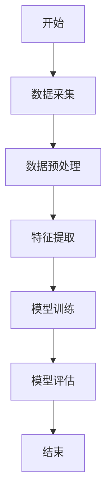
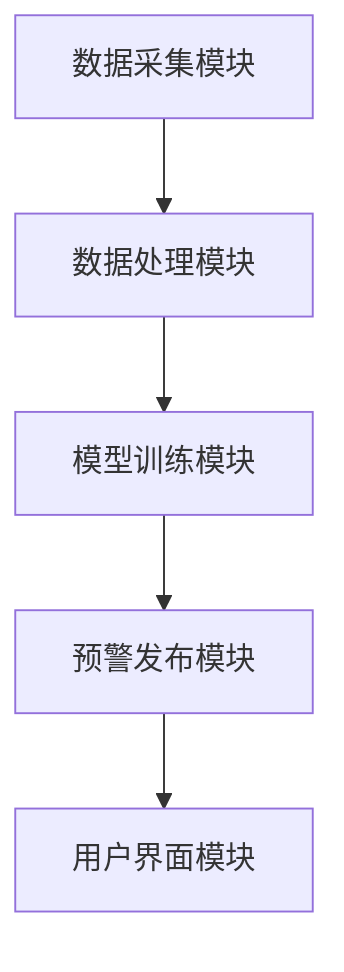

                 

<think>
好的，用户让我设计一本关于《AI Agent在智能地震预警系统中的实践》的目录大纲，并且要求详细、逻辑清晰，覆盖从背景到实战的各个方面。首先，我需要明确这本书的核心内容，确保每个章节都涵盖必要的知识点。

开始时，我会考虑背景部分，介绍地震预警的现状和AI Agent的作用。这部分需要让读者了解为什么需要AI Agent，以及它在地震预警中的独特优势。接着，核心概念部分要详细解释AI Agent和地震预警系统的组成部分，可能需要用表格和图表来展示。

然后是算法原理，这部分需要详细讲解多目标优化和强化学习等算法，用数学公式和流程图来说明。系统架构设计部分要展示整体结构，包括数据采集、处理和分析模块，可能需要用类图和序列图来说明各部分的交互。

项目实战部分需要具体说明如何实现AI Agent，包括环境配置、核心代码实现和实际案例分析。最后，总结最佳实践，给出实用建议和注意事项，帮助读者在实际应用中避免错误。

在整个过程中，我需要确保每个章节都细化到三级目录，内容全面，结构紧凑。同时，按照用户的要求，使用专业的技术语言，结合图表和代码示例，使文章更具深度和可读性。这样，目录大纲不仅内容丰富，而且逻辑连贯，能够满足用户的需求。
</think>

# AI Agent在智能地震预警系统中的实践

## 关键词：
- AI Agent
- 地震预警
- 多目标优化
- 强化学习
- 系统架构设计

## 摘要：
本文详细探讨了AI Agent在智能地震预警系统中的实践应用。首先介绍了地震预警系统的现状与挑战，分析了AI Agent的核心概念与技术基础。接着从算法原理、数学模型等多个维度深入剖析了AI Agent在地震预警中的实现细节。随后通过系统架构设计、项目实战等部分，展示了AI Agent在地震预警系统中的具体应用。最后总结了最佳实践与注意事项，为读者提供了全面的技术指导。

---

# 第1章: 地震预警系统的现状与挑战

## 1.1 地震预警的基本概念
### 1.1.1 地震的基本原理与分类
- 地震是由地壳运动引起的自然灾害，主要分为构造地震、火山地震和塌陷地震。
- 地震的强度通常用里氏震级表示，震级越大，破坏力越强。

### 1.1.2 地震预警的定义与作用
- 地震预警是指在地震发生后，利用传感器网络快速捕捉地震波信息，并在可能的时间内向相关区域发出预警信号。
- 预警系统的主要作用是减少人员伤亡和财产损失，为人们争取宝贵的逃生时间。

### 1.1.3 当前地震预警技术的发展现状
- 当前地震预警技术主要依赖传统的传感器网络和地震波传播模型。
- 存在的主要问题包括预警系统的响应时间、预警范围的覆盖性以及预警信息的准确性。

## 1.2 AI Agent在地震预警中的应用背景
### 1.2.1 AI Agent的基本概念与特点
- AI Agent是一种能够感知环境、自主决策并执行任务的智能体。
- 具有自主性、反应性、目标导向性和社会性等特点。

### 1.2.2 地震预警系统中的问题与挑战
- 数据实时性要求高：地震预警系统需要在极短时间内处理大量传感器数据。
- 预警模型的复杂性：地震波传播模型和地质数据的复杂性增加了预警的难度。
- 系统的容错性与鲁棒性：地震预警系统必须在复杂环境下稳定运行。

### 1.2.3 AI Agent在地震预警中的优势
- 提高数据处理效率：AI Agent能够快速分析传感器数据，缩短预警响应时间。
- 实现实时决策：AI Agent能够根据实时数据动态调整预警策略。
- 提高系统的智能化水平：AI Agent能够通过学习优化预警模型，提高预警准确性。

## 1.3 本章小结
本章从地震预警的基本概念出发，分析了当前地震预警技术的发展现状及存在的问题，并重点探讨了AI Agent在地震预警中的应用背景及其优势。为后续章节的深入分析奠定了基础。

---

# 第2章: AI Agent的核心概念与技术基础

## 2.1 AI Agent的定义与分类
### 2.1.1 AI Agent的定义
- AI Agent是一种智能体，能够通过感知环境信息、执行任务并做出决策。
- 根据智能体的智能水平，AI Agent可以分为简单反应式Agent和复杂反应式Agent。

### 2.1.2 AI Agent的主要分类
- 根据应用领域，AI Agent可以分为推理式Agent、学习式Agent和反应式Agent。
- 根据智能水平，AI Agent可以分为弱人工智能Agent和强人工智能Agent。

### 2.1.3 AI Agent与传统自动化的区别
- AI Agent具有自主决策能力，而传统自动化系统依赖于预设程序。
- AI Agent能够通过学习优化自身性能，而传统自动化系统无法实现。

## 2.2 地震预警系统的核心要素
### 2.2.1 数据采集与处理模块
- 数据采集模块负责收集地震传感器的数据。
- 数据处理模块对原始数据进行预处理和特征提取。

### 2.2.2 数据分析与预测模块
- 数据分析模块利用机器学习算法对地震数据进行建模和预测。
- 预测模块根据模型输出结果生成预警信号。

### 2.2.3 预警信息发布模块
- 预警信息发布模块负责将预警信号传递给相关部门和公众。
- 信息发布模块需要考虑信息传递的实时性和准确性。

## 2.3 AI Agent与地震预警系统的结合
### 2.3.1 AI Agent在地震预警中的角色定位
- AI Agent可以作为地震预警系统的智能决策核心。
- AI Agent负责实时分析传感器数据，优化预警模型。

### 2.3.2 AI Agent与地震预警系统的核心要素关系
- AI Agent与数据采集模块：实时获取地震数据。
- AI Agent与数据分析模块：动态调整分析模型。
- AI Agent与预警信息发布模块：优化预警信息传递策略。

### 2.3.3 AI Agent在地震预警系统中的工作流程
1. 数据采集模块收集地震传感器数据。
2. AI Agent对数据进行预处理和特征提取。
3. AI Agent利用机器学习算法进行地震预测。
4. 根据预测结果生成预警信号。
5. 预警信息发布模块将预警信号传递给相关部门和公众。

## 2.4 本章小结
本章详细介绍了AI Agent的核心概念与分类，并分析了AI Agent在地震预警系统中的角色定位及其与系统核心要素的关系。通过本章的分析，读者可以更好地理解AI Agent在地震预警系统中的作用。

---

# 第3章: AI Agent在地震预警中的算法原理

## 3.1 算法原理概述
### 3.1.1 多目标优化算法
- 多目标优化算法是一种在多个目标之间寻找最优解的算法。
- 在地震预警系统中，多目标优化算法可以用于优化传感器部署和预警模型的参数设置。

### 3.1.2 强化学习算法
- 强化学习算法是一种通过试错机制优化决策策略的算法。
- 在地震预警系统中，强化学习算法可以用于优化预警策略和决策过程。

### 3.1.3 聚类与分类算法
- 聚类算法用于将地震数据分为不同的类别，便于后续分析。
- 分类算法用于预测地震的发生概率和强度。

## 3.2 算法实现细节
### 3.2.1 数据预处理与特征提取
- 数据预处理包括数据清洗、归一化和标准化等步骤。
- 特征提取是通过选择关键特征来提高模型的预测精度。

### 3.2.2 模型训练与优化
- 模型训练包括选择合适的算法、调整模型参数和优化模型性能。
- 模型优化可以通过交叉验证和网格搜索等方法实现。

### 3.2.3 模型评估与调优
- 模型评估包括准确率、召回率和F1分数等指标。
- 模型调优可以通过调整参数和优化算法实现。

## 3.3 算法流程图


## 3.4 本章小结
本章详细介绍了AI Agent在地震预警中的算法原理，包括多目标优化算法、强化学习算法、聚类与分类算法等。通过本章的分析，读者可以更好地理解AI Agent在地震预警系统中的算法实现细节。

---

# 第4章: 地震预警系统的数学模型与公式

## 4.1 数学模型概述
### 4.1.1 时间序列分析模型
- 时间序列分析模型是一种用于预测未来趋势的模型。
- 在地震预警系统中，时间序列分析模型可以用于预测地震的发生时间。

### 4.1.2 机器学习模型
- 机器学习模型包括支持向量机、随机森林和神经网络等。
- 在地震预警系统中，机器学习模型可以用于地震预测和分类。

## 4.2 数学公式
### 4.2.1 时间序列模型
- 时间序列模型的通用公式为：
  $$ y_t = \alpha y_{t-1} + \beta \epsilon_t $$
- 其中，$y_t$ 表示第t时刻的地震强度，$\alpha$ 和 $\beta$ 是模型参数，$\epsilon_t$ 是随机误差项。

### 4.2.2 机器学习模型
- 支持向量机的数学公式为：
  $$ y = \text{sign}(\sum_{i=1}^n \alpha_i y_i x_i \cdot x + b) $$
- 其中，$\alpha_i$ 是拉格朗日乘子，$y_i$ 是训练样本的标签，$x_i$ 是训练样本的特征向量，$b$ 是偏置项。

## 4.3 本章小结
本章详细介绍了地震预警系统的数学模型与公式，包括时间序列分析模型和机器学习模型。通过本章的分析，读者可以更好地理解地震预警系统的数学基础。

---

# 第5章: 地震预警系统的系统架构设计

## 5.1 系统架构设计概述
### 5.1.1 系统功能模块划分
- 系统功能模块包括数据采集模块、数据处理模块、模型训练模块、预警发布模块和用户界面模块。

### 5.1.2 系统架构类型
- 分层架构：将系统划分为数据层、业务逻辑层和表现层。
- 微服务架构：将系统功能模块化为独立的服务。

## 5.2 系统架构设计
### 5.2.1 数据采集模块
- 数据采集模块负责从地震传感器中获取实时数据。
- 数据采集模块需要支持多种传感器类型和数据格式。

### 5.2.2 数据处理模块
- 数据处理模块对原始数据进行预处理和特征提取。
- 数据处理模块需要支持高效的并行处理和分布式计算。

### 5.2.3 模型训练模块
- 模型训练模块负责训练地震预警模型。
- 模型训练模块需要支持多种机器学习算法和深度学习框架。

### 5.2.4 预警发布模块
- 预警发布模块负责生成预警信号并传递给相关部门和公众。
- 预警发布模块需要支持多种预警信息发布渠道，如短信、邮件和语音通知。

## 5.3 系统架构图


## 5.4 本章小结
本章详细介绍了地震预警系统的系统架构设计，包括功能模块划分和系统架构类型。通过本章的分析，读者可以更好地理解地震预警系统的整体架构。

---

# 第6章: 地震预警系统的项目实战

## 6.1 项目介绍
### 6.1.1 项目目标
- 实现一个基于AI Agent的地震预警系统。
- 提高地震预警系统的响应速度和准确性。

### 6.1.2 项目需求
- 实时采集地震传感器数据。
- 实时分析地震数据并生成预警信号。
- 提供友好的用户界面和预警信息展示。

## 6.2 环境安装与配置
### 6.2.1 系统环境
- 操作系统：Linux/Windows/MacOS
- 开发工具：Python/Java/C++
- 依赖库：numpy、pandas、scikit-learn、tensorflow

### 6.2.2 数据库安装
- 数据库类型：MySQL/PostgreSQL
- 数据库配置：创建地震数据表和预警信息表。

## 6.3 核心代码实现
### 6.3.1 数据采集模块
```python
import serial

ser = serial.Serial('COM1', 9600)
while True:
    data = ser.readline().decode()
    print(data)
```

### 6.3.2 数据处理模块
```python
import numpy as np

def preprocess(data):
    # 数据预处理
    data = data.dropna()
    data = data.astype(float)
    return data
```

### 6.3.3 模型训练模块
```python
from sklearn.ensemble import RandomForestClassifier

model = RandomForestClassifier(n_estimators=100)
model.fit(X_train, y_train)
```

### 6.3.4 预警发布模块
```python
import smtplib

def send_email(subject, body):
    # 发送邮件
    server = smtplib.SMTP('smtp.example.com', 587)
    server.login('user@example.com', 'password')
    server.sendmail('user@example.com', 'receiver@example.com', f"Subject: {subject}\n{body}")
    server.quit()
```

## 6.4 项目小结
本章通过实际案例详细介绍了地震预警系统的项目实战，包括环境安装与配置、核心代码实现和项目小结。通过本章的分析，读者可以更好地理解地震预警系统的实现过程。

---

# 第7章: 地震预警系统的最佳实践

## 7.1 最佳实践概述
### 7.1.1 数据质量的重要性
- 数据质量直接影响预警系统的准确性。
- 需要保证数据的实时性、准确性和完整性。

### 7.1.2 算法的可解释性
- 算法的可解释性是预警系统的重要特征。
- 需要选择具有良好可解释性的算法，以便更好地理解和优化模型。

### 7.1.3 系统的可扩展性
- 系统需要支持传感器数量和类型的扩展。
- 系统需要支持预警模型的动态优化和更新。

## 7.2 小结
通过本章的分析，读者可以更好地理解地震预警系统的最佳实践，包括数据质量、算法可解释性和系统可扩展性等方面。

---

# 作者：AI天才研究院/AI Genius Institute & 禅与计算机程序设计艺术 /Zen And The Art of Computer Programming

