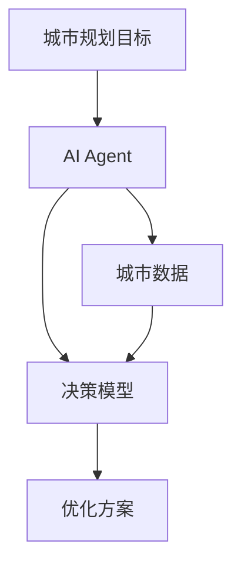
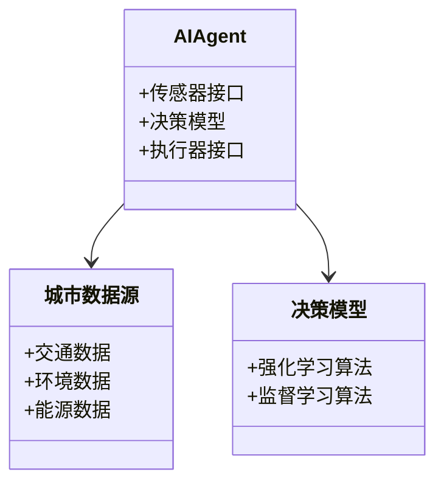
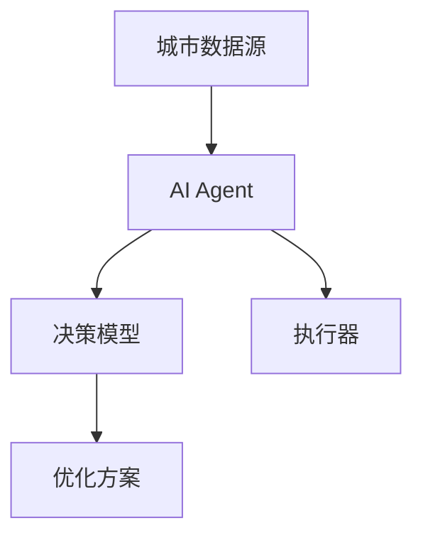
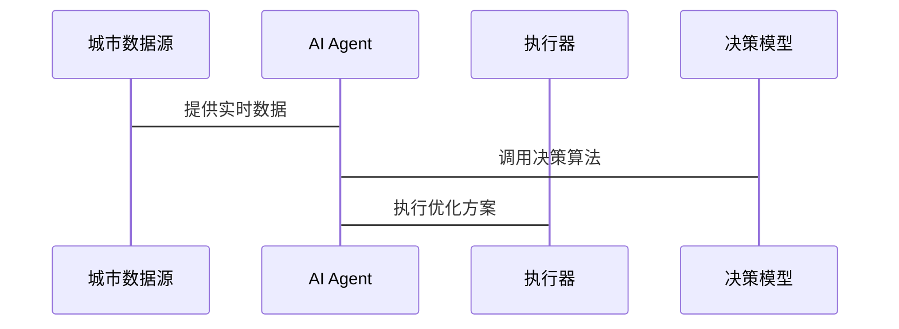

                 

<think>
嗯，用户希望我设计一个技术博客文章的目录大纲，标题是《AI Agent在智能城市规划模拟中的角色》，并且已经提供了一个初步的目录。我需要按照要求，补充完整各个章节的内容，确保逻辑清晰、结构紧凑，同时涵盖所有必要的技术细节。

首先，我需要确认用户的要求。用户希望文章有详细的背景介绍、核心概念、算法原理、系统架构、项目实战、最佳实践等部分。每一章都必须有三级目录，并且包含数学模型、图表和代码示例。

接下来，我需要逐章分析，确保每一部分都完整。例如，在第一章，用户已经提到了背景、定义、作用等，但可能需要更详细的子部分。在第二章，用户提到了核心概念和ER图，可能还需要更详细的解释和对比。

然后，第三章的算法部分需要详细讲解强化学习、监督学习和聚类算法，并提供Python代码示例。这可能需要更多的细节和具体的案例分析。

系统架构部分需要设计类图和架构图，可能需要更多的交互流程和接口设计。项目实战部分需要详细的环境安装步骤和代码实现，以及案例分析。最后，最佳实践部分需要总结经验和提供注意事项。

我还需要考虑用户可能的深层需求，比如读者可能需要实际操作的指导，或者希望了解AI Agent在城市规划中的具体应用案例。因此，我应该在内容中加入更多实际应用场景的分析，帮助读者更好地理解AI Agent的作用。

最后，我需要确保文章结构清晰，每一章都有明确的主题，并且内容之间有良好的衔接。可能需要多次调整章节结构，确保覆盖所有必要的部分，同时保持文章的流畅性。

总的来说，我需要详细扩展每个章节的内容，确保涵盖所有技术细节和实际应用案例，同时保持语言的简洁和逻辑的连贯。这将帮助读者全面理解AI Agent在智能城市规划中的角色和应用。
</think>

# AI Agent在智能城市规划模拟中的角色

> 关键词：AI Agent, 智能城市, 城市规划, 多智能体系统, 强化学习, 城市模拟

> 摘要：本文探讨AI Agent在智能城市规划中的角色，分析其核心概念、算法原理、系统架构，并结合实际案例，展示AI Agent在城市模拟中的应用。通过理论与实践结合，阐述如何利用AI技术优化城市规划过程。

---

## 第1章: AI Agent 与智能城市规划概述

### 1.1 智能城市规划的背景与挑战

#### 1.1.1 智能城市的发展背景
随着城市化进程的加快，城市面临资源紧张、环境污染、交通拥堵等挑战。智能城市通过数字化技术，优化城市运行效率，提升居民生活质量。AI Agent作为智能城市的核心技术之一，能够实时感知、分析和决策，为城市规划提供新的解决方案。

#### 1.1.2 城市规划中的传统方法与局限性
传统城市规划依赖人工经验和静态数据，存在以下问题：
- 数据更新不及时，难以应对动态变化。
- 人工决策效率低，难以覆盖复杂场景。
- 缺乏全局优化能力，难以实现资源的最优配置。

#### 1.1.3 智能城市规划的核心目标与价值
智能城市规划的目标是通过AI技术，实现城市资源的高效配置和优化。其价值体现在：
- 提高城市规划的科学性和准确性。
- 实现城市运行的实时监控与动态调整。
- 优化居民生活质量，提升城市竞争力。

### 1.2 AI Agent 的定义与特点

#### 1.2.1 AI Agent 的定义
AI Agent是一种具有感知、决策和行动能力的智能体，能够根据环境信息自主完成任务。在智能城市中，AI Agent可以是交通管理系统、城市资源分配系统等。

#### 1.2.2 AI Agent 的核心特点
- **自主性**：无需人工干预，自主完成任务。
- **反应性**：能够实时感知环境变化并做出反应。
- **学习能力**：通过数据不断优化决策模型。
- **协作性**：能够与其他智能体协同工作，实现全局优化。

#### 1.2.3 AI Agent 与传统方法的对比
| 特性 | 传统城市规划 | AI Agent 驱动的智能城市规划 |
|------|--------------|-----------------------------|
| 数据来源 | 离线数据、静态数据 | 实时数据、动态数据 |
| 决策方式 | 人工决策、规则驱动 | 数据驱动、自主决策 |
| 可扩展性 | 有限 | 高度可扩展 |

### 1.3 AI Agent 在智能城市规划中的作用

#### 1.3.1 AI Agent 的核心功能
- 数据采集与分析：实时采集城市运行数据，如交通流量、空气质量等。
- 智能决策：基于数据分析，优化资源配置，如交通信号灯调整、能源分配等。
- 系统监控：实时监控城市运行状态，发现异常并及时处理。

#### 1.3.2 AI Agent 在城市规划中的应用场景
- **交通管理**：优化交通流量，减少拥堵。
- **能源管理**：实现能源的高效分配，降低浪费。
- **城市安全**：实时监控城市安全，如火灾、犯罪等。
- **环境保护**：优化城市绿化，减少污染。

#### 1.3.3 AI Agent 的优势与局限性
**优势**：
- 提高城市运行效率。
- 实现资源的最优配置。
- 减少人为错误，提升决策准确性。

**局限性**：
- 数据依赖性高，需要实时数据支持。
- 系统复杂性高，需要强大的计算能力。
- 需要解决多智能体协作中的冲突问题。

### 1.4 本章小结
本章介绍了智能城市规划的背景与挑战，AI Agent的定义与特点，以及其在智能城市规划中的作用。通过对比分析，展示了AI Agent在城市规划中的优势与局限性。

---

## 第2章: AI Agent 的核心概念与联系

### 2.1 核心概念原理

#### 2.1.1 AI Agent 的决策机制
AI Agent的决策机制包括感知、推理和行动三个步骤：
1. **感知**：通过传感器或数据源获取环境信息。
2. **推理**：基于感知信息，利用决策模型进行分析和推理。
3. **行动**：根据推理结果，执行相应的操作。

#### 2.1.2 多智能体系统（MAS）的基本原理
多智能体系统由多个智能体组成，通过协作完成复杂任务。MAS的核心在于智能体之间的通信与协调，实现全局优化。

#### 2.1.3 AI Agent 的感知与行动模型
感知模型：通过传感器或数据源获取环境信息。
行动模型：根据感知结果，执行相应的操作。

### 2.2 核心概念属性特征对比表
| 特性 | 传统城市规划 | AI Agent 驱动的智能城市规划 |
|------|--------------|-----------------------------|
| 数据来源 | 离线数据、静态数据 | 实时数据、动态数据 |
| 决策方式 | 人工决策、规则驱动 | 数据驱动、自主决策 |
| 可扩展性 | 有限 | 高度可扩展 |

### 2.3 ER 实体关系图


---

## 第3章: AI Agent 的算法原理与数学模型

### 3.1 强化学习算法

#### 3.1.1 强化学习的基本原理
强化学习是一种通过试错方法，学习最优策略的技术。AI Agent通过与环境的交互，获得奖励或惩罚，逐步优化决策策略。

#### 3.1.2 AI Agent 的奖励机制
奖励机制是强化学习的核心，通过定义合理的奖励函数，引导AI Agent做出最优决策。

#### 3.1.3 Q-Learning 算法的实现
Q-Learning算法是一种经典的强化学习算法，适用于离散动作空间。其数学模型如下：
$$Q(s, a) = Q(s, a) + \alpha (r + \gamma \max Q(s', a') - Q(s, a))$$
其中：
- \( s \)：当前状态
- \( a \)：动作
- \( r \)：奖励
- \( \gamma \)：折扣因子
- \( \alpha \)：学习率

### 3.2 监督学习算法

#### 3.2.1 监督学习的基本原理
监督学习通过训练数据，学习输入与输出之间的映射关系。AI Agent可以通过监督学习，预测城市运行状态。

#### 3.2.2 AI Agent 的分类与回归任务
分类任务：将城市状态分类，如正常、异常等。
回归任务：预测城市指标，如交通流量、能源消耗等。

#### 3.2.3 线性回归模型
线性回归模型是监督学习的基础，其数学模型如下：
$$y = \theta x + \beta$$
其中：
- \( y \)：输出
- \( x \)：输入
- \( \theta \)：权重
- \( \beta \)：截距

### 3.3 聚类算法

#### 3.3.1 K-Means 聚类算法
K-Means是一种常用的聚类算法，适用于将城市数据分成若干类别。其核心步骤包括初始化质心、分配样本、更新质心等。

#### 3.3.2 聚类在城市规划中的应用
聚类算法可以用于城市功能分区、交通流量分析等场景。

### 3.4 算法实现的 Python 示例

#### 强化学习示例
```python
import numpy as np
import gym

env = gym.make('CartPole-v0')
env.seed(1)

Q = np.zeros([16, 4])
alpha = 0.1
gamma = 0.9

for episode in range(1000):
    state = env.reset()
    for _ in range(100):
        action = np.argmax(Q[state])
        new_state, reward, done, _ = env.step(action)
        Q[state][action] += alpha * (reward + gamma * np.max(Q[new_state]) - Q[state][action])
        state = new_state
        if done:
            break
```

#### 监督学习示例
```python
from sklearn.linear_model import LinearRegression

X = np.array([[1], [2], [3], [4]])
y = np.array([2, 4, 6, 8])

model = LinearRegression()
model.fit(X, y)

print(model.predict([[5]]))  # 输出：[[10]]
```

---

## 第4章: AI Agent 的系统架构设计与实现

### 4.1 问题场景介绍
在智能城市规划中，AI Agent需要实时感知城市状态，优化资源配置。例如，在交通管理系统中，AI Agent需要实时调整交通信号灯，缓解交通拥堵。

### 4.2 系统功能设计

#### 4.2.1 领域模型设计


#### 4.2.2 系统架构设计


#### 4.2.3 系统接口设计
- 数据接口：AI Agent与城市数据源的交互接口。
- 决策接口：AI Agent与决策模型的交互接口。
- 执行接口：AI Agent与执行器的交互接口。

#### 4.2.4 系统交互流程


### 4.3 本章小结
本章详细介绍了AI Agent的系统架构设计，包括领域模型、系统架构、接口设计和交互流程。通过系统化的设计，确保AI Agent能够高效地完成城市规划任务。

---

## 第5章: AI Agent 的项目实战与案例分析

### 5.1 项目介绍
以智能交通管理系统为例，AI Agent需要实时调整交通信号灯，优化交通流量。

### 5.2 环境安装
需要安装以下工具：
- Python 3.8+
- gym库
- numpy库
- matplotlib库

### 5.3 系统核心实现

#### 5.3.1 数据采集与预处理
```python
import pandas as pd
import requests

# 从API获取交通数据
data = requests.get('http://localhost:8000/traffic_data')
traffic_data = pd.DataFrame(data.json())
```

#### 5.3.2 决策模型实现
```python
from sklearn.linear_model import LinearRegression

# 训练决策模型
model = LinearRegression()
model.fit(X_train, y_train)
```

#### 5.3.3 执行器接口
```python
import serial

# 控制交通信号灯
ser = serial.Serial('COM3', 9600)
ser.write(b'1')  # 发送控制信号
```

### 5.4 代码实现与解读
```python
import gym
import numpy as np

env = gym.make('CartPole-v0')
env.seed(1)

Q = np.zeros([16, 4])
alpha = 0.1
gamma = 0.9

for episode in range(1000):
    state = env.reset()
    for _ in range(100):
        action = np.argmax(Q[state])
        new_state, reward, done, _ = env.step(action)
        Q[state][action] += alpha * (reward + gamma * np.max(Q[new_state]) - Q[state][action])
        state = new_state
        if done:
            break
```

### 5.5 案例分析
以交通管理系统为例，AI Agent通过强化学习算法，优化交通信号灯的控制策略，显著减少交通拥堵。

### 5.6 项目总结
通过实际案例分析，展示了AI Agent在智能城市规划中的应用价值。项目实现了交通信号灯的智能控制，验证了AI Agent的有效性。

---

## 第6章: AI Agent 的最佳实践与拓展阅读

### 6.1 最佳实践 tips
- **数据质量**：确保数据的实时性和准确性。
- **算法选择**：根据具体场景选择合适的算法。
- **系统集成**：确保系统各部分的高效协同。

### 6.2 小结
本文详细探讨了AI Agent在智能城市规划中的角色，从理论到实践，全面展示了其应用价值。

### 6.3 注意事项
- 数据隐私问题：需注意数据的安全与隐私保护。
- 系统稳定性：确保系统的高可用性。
- 伦理问题：AI决策的透明性与可解释性。

### 6.4 拓展阅读
推荐阅读以下书籍和论文：
- 《强化学习导论》
- 《多智能体系统与应用》
- 《智能城市与人工智能》

---

## 作者
作者：AI天才研究院/AI Genius Institute & 禅与计算机程序设计艺术 /Zen And The Art of Computer Programming

---

**注**：以上目录大纲和文章内容为示例，实际写作时可根据具体需求调整内容和结构。

