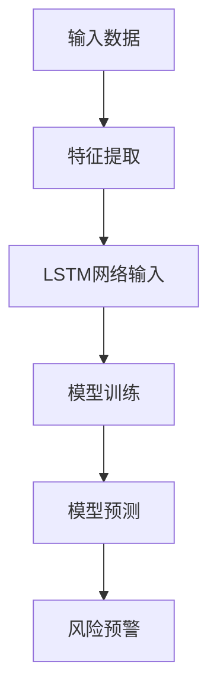
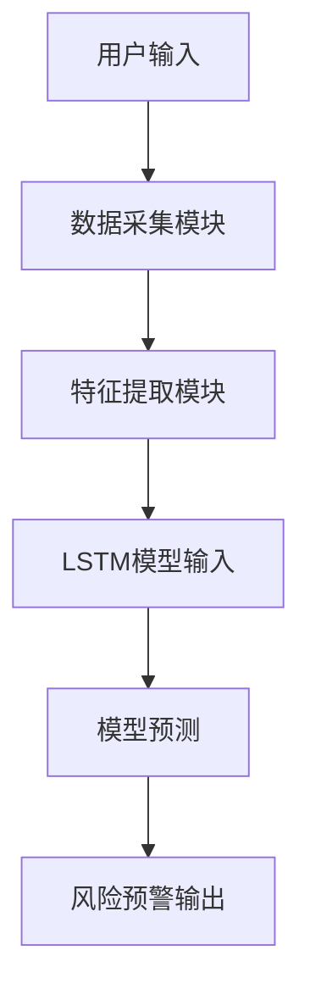
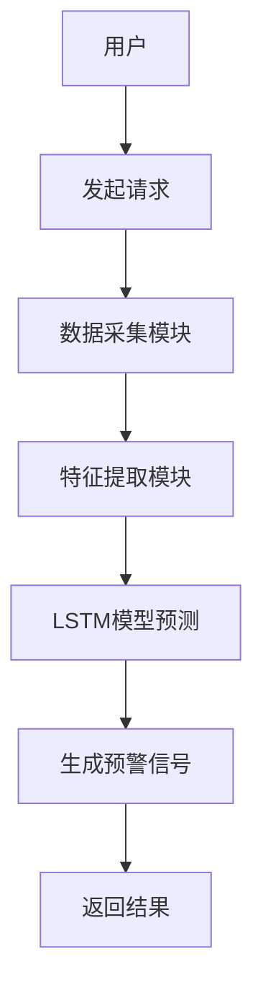

                 

<think>
好的，我来逐步分析如何撰写这篇关于《AI驱动的市场流动性风险预警》的技术博客文章。首先，我需要明确文章的目标和结构。文章旨在通过逻辑清晰、结构紧凑的方式，分析和探讨如何利用人工智能技术来预警市场流动性风险。为了确保内容的深度和专业性，我需要从市场流动性风险的基本概念入手，逐步引入AI技术的应用，详细讲解算法原理，并通过实际案例进行分析。

首先，在第一章中，我需要介绍市场流动性风险的基本概念，包括定义、特征和传统方法的局限性。这部分内容需要简洁明了，便于读者理解。

接下来，在第二章，我需要深入讨论AI在金融风险管理中的应用，重点分析AI在流动性风险预警中的优势和必要性。这部分可以通过对比传统方法和AI技术的差异来突出AI的优势。

然后，在第三章，我需要详细讲解基于AI的市场流动性风险预警算法，尤其是LSTM网络的应用。这部分内容需要结合数学公式和算法流程图，让读者能够理解LSTM的工作原理以及如何应用于流动性风险预警。

在第四章，我需要设计一个AI驱动的市场流动性风险预警系统的架构。这部分需要包括系统功能设计、架构图和交互流程图，展示系统的整体结构和运行机制。

最后，在第五章，我需要通过实际案例来展示如何将这些理论应用于实践。通过项目实战，详细讲解如何安装环境、实现核心代码、分析案例，并总结经验教训。

整个思考过程中，我需要确保每一部分内容详实，逻辑清晰，并且能够吸引读者的兴趣。此外，文章的结尾部分需要添加关键词、摘要和作者信息，以确保格式的完整性和专业性。

综上所述，我需要按照上述结构逐步展开，确保每一部分都能深入浅出地阐述相关知识点，最终完成一篇高质量的技术博客文章。
</think>

# AI驱动的市场流动性风险预警

## 关键词：市场流动性风险，AI技术，金融风险管理，LSTM网络，系统架构设计

## 摘要：本文详细探讨了如何利用人工智能技术，特别是基于LSTM的算法，来实现市场流动性风险的预警。文章首先介绍了市场流动性风险的基本概念和传统方法的局限性，然后分析了AI技术在金融风险管理中的应用优势。接着，详细讲解了基于LSTM网络的算法原理及其在流动性风险预警中的应用，通过实际案例展示了系统的架构设计和实现过程。最后，总结了项目的成果和经验，为读者提供了实用的参考和启示。

---

## 第一部分: 市场流动性风险与AI驱动预警概述

### 第1章: 市场流动性风险的基本概念

#### 1.1 市场流动性风险的定义与特征
- **1.1.1 流动性风险的定义**  
  市场流动性风险是指在金融市场中，由于交易量不足或价格波动剧烈而导致资产难以以合理价格迅速变现的风险。这种风险通常与市场的深度、广度和参与者行为密切相关。

- **1.1.2 流动性风险的主要特征**  
  流动性风险具有以下特征：  
  - **波动性**：市场波动越大，流动性风险越高。  
  - **传染性**：流动性风险可能在市场中迅速蔓延，影响更广泛的资产或机构。  
  - **时间依赖性**：流动性风险往往与市场的时间序列数据密切相关。  

- **1.1.3 流动性风险的分类与影响**  
  流动性风险可以分为市场流动性风险和机构流动性风险。前者影响整个市场的流动性，后者则影响特定机构的流动性。流动性风险可能导致资产价格下跌、交易成本增加，甚至引发系统性金融危机。

#### 1.2 AI技术在金融风险管理中的应用
- **1.2.1 AI技术的基本概念**  
  AI（人工智能）技术通过模拟人类学习和推理能力，能够从大量数据中提取规律和模式，帮助金融机构进行风险管理和决策支持。

- **1.2.2 AI在金融风险管理中的优势**  
  AI技术在金融风险管理中的优势包括：  
  - **数据处理能力**：AI能够处理海量数据，发现传统方法难以察觉的模式。  
  - **实时性**：AI算法能够实现实时监控和预测，帮助机构及时应对风险。  
  - **非线性关系建模**：AI技术能够捕捉复杂的数据关系，提升模型的准确性。  

- **1.2.3 AI驱动的市场流动性风险预警的必要性**  
  随着金融市场的复杂化，传统的基于统计的方法在处理流动性风险时显得力不从心。AI技术能够通过实时数据分析和预测，帮助机构提前识别潜在风险，避免重大损失。

### 1.3 本章小结
本章通过介绍市场流动性风险的基本概念和AI技术在金融风险管理中的应用，为后续内容奠定了基础。接下来将深入探讨AI模型在流动性风险预警中的应用。

---

## 第二部分: AI驱动的市场流动性风险预警的核心概念

### 第2章: 市场流动性风险的特征分析

#### 2.1 市场流动性风险的核心要素
- **2.1.1 市场深度**  
  市场深度是指在特定价格水平下可以交易的资产数量。市场深度越大，流动性风险越低。  

- **2.1.2 市场波动性**  
  市场波动性是流动性风险的重要影响因素。高波动性可能导致资产价格剧烈波动，增加流动性风险。  

- **2.1.3 市场参与者的行为特征**  
  市场参与者的行为特征，如投资者情绪、交易策略等，也会影响市场流动性。  

#### 2.2 AI模型在流动性风险预警中的应用
- **2.2.1 数据驱动的特征提取**  
  AI技术能够从历史数据中提取关键特征，如成交量、价格波动等，用于预测流动性风险。  

- **2.2.2 非线性关系的建模**  
  AI模型（如神经网络）能够捕捉复杂的非线性关系，提升模型的预测能力。  

- **2.2.3 实时监控与预测**  
  基于AI的模型可以实现实时数据处理和预测，帮助机构及时应对流动性风险。  

#### 2.3 市场流动性风险与AI模型的对比分析
- **2.3.1 市场流动性风险的特征对比表**  
  | 特征               | 描述                             |
  |--------------------|----------------------------------|
  | 波动性             | 高波动性可能导致流动性风险增加 |
  | 传染性             | 流动性风险可能迅速蔓延          |
  | 时间依赖性         | 流动性风险与时间序列数据相关    |

- **2.3.2 AI模型的特征对比表**  
  | 特征               | 描述                             |
  |--------------------|----------------------------------|
  | 数据驱动           | 基于大量数据进行建模             |
  | 非线性关系建模     | 能够捕捉复杂的数据关系           |
  | 实时性             | 支持实时数据处理和预测           |

- **2.3.3 市场流动性风险与AI模型的ER实体关系图**  
  ```mermaid
  graph TD
      A[市场流动性风险] --> B[AI模型]
      B --> C[数据特征]
      B --> D[预测模型]
      C --> D
  ```

---

## 第三部分: 基于AI的市场流动性风险预警算法原理

### 第3章: 基于LSTM的市场流动性风险预警算法

#### 3.1 LSTM网络的基本原理
- **3.1.1 LSTM网络的结构**  
  LSTM（长短期记忆网络）是一种特殊的RNN（循环神经网络），通过引入记忆单元和门控机制，能够有效捕捉时间序列数据中的长距离依赖关系。

- **3.1.2 LSTM单元的工作机制**  
  LSTM单元包括输入门、遗忘门和输出门，分别控制信息的输入、遗忘和输出。  
  - **输入门**：决定当前时刻输入数据的重要性。  
  - **遗忘门**：决定保留哪些长期信息。  
  - **输出门**：决定最终输出的信息。  

- **3.1.3 LSTM网络的优势**  
  LSTM网络能够有效解决传统RNN的梯度消失问题，适用于时间序列数据的预测。

#### 3.2 基于LSTM的流动性风险预警模型
- **3.2.1 模型输入特征设计**  
  模型输入特征包括：  
  - 历史价格数据（开盘价、收盘价、最高价、最低价）  
  - 成交量数据  
  - 市场情绪指标（如VIX指数）  

- **3.2.2 模型训练与优化**  
  使用历史数据对LSTM模型进行训练，并通过交叉验证优化模型参数。  

- **3.2.3 模型预测与评估**  
  使用测试数据对模型进行预测，并通过指标（如均方误差、准确率）评估模型性能。  

#### 3.3 LSTM算法的数学模型与公式
- **3.3.1 LSTM的基本公式**  
  输入门公式：  
  $$ f_t = \sigma(W_f x_t + U_f h_{t-1} + b_f) $$  
  遗忘门公式：  
  $$ i_t = \sigma(W_i x_t + U_i h_{t-1} + b_i) $$  
  输出门公式：  
  $$ o_t = \sigma(W_o x_t + U_o h_{t-1} + b_o) $$  
  遗忘状态更新公式：  
  $$ \tilde{h}_t = \tanh(W_c x_t + U_c h_{t-1} + b_c) $$  
  最终状态公式：  
  $$ h_t = f_t \cdot \tilde{h}_t $$  
  输出公式：  
  $$ y_t = o_t \cdot h_t $$  

- **3.3.2 LSTM的输出公式**  
  $$ h_t = f_t \cdot \cosh(W_c x_t + U_c h_{t-1} + b_c) $$  

#### 3.4 算法流程图


#### 3.5 LSTM算法的Python实现代码
```python
import numpy as np
from tensorflow.keras.models import Sequential
from tensorflow.keras.layers import LSTM, Dense, Dropout

# 定义LSTM模型
model = Sequential()
model.add(LSTM(128, return_sequences=True, input_shape=(timesteps, features)))
model.add(Dropout(0.2))
model.add(LSTM(64, return_sequences=False))
model.add(Dense(1, activation='sigmoid'))

# 编译模型
model.compile(loss='binary_crossentropy', optimizer='adam', metrics=['accuracy'])

# 训练模型
model.fit(X_train, y_train, batch_size=32, epochs=10, validation_split=0.2)
```

---

## 第四部分: 基于AI的市场流动性风险预警系统架构设计

### 第4章: 系统架构设计与实现

#### 4.1 系统功能设计
- **数据采集模块**：从金融市场数据源获取实时数据。  
- **特征提取模块**：提取关键特征，如成交量、价格波动等。  
- **模型训练模块**：基于历史数据训练LSTM模型。  
- **实时预警模块**：对实时数据进行预测，生成风险预警信号。  

#### 4.2 系统架构设计


#### 4.3 系统交互流程图


#### 4.4 系统实现代码
```python
import numpy as np
import pandas as pd
from tensorflow.keras.models import load_model
import requests
import json

# 数据采集模块
def get_market_data():
    url = "https://api.example.com/market-data"
    response = requests.get(url)
    data = json.loads(response.text)
    return data

# 特征提取模块
def extract_features(data):
    features = []
    for d in data:
        features.append([d['open'], d['close'], d['high'], d['low'], d['volume']])
    return np.array(features)

# 预测模块
def predict_risk(model, features):
    prediction = model.predict(features)
    return prediction

# 风险预警模块
def generate_warning(prediction):
    if prediction > 0.5:
        return "流动性风险预警：市场可能出现流动性危机！"
    else:
        return "市场流动性风险较低，无需预警。"

# 系统主程序
if __name__ == '__main__':
    model = load_model('lstm_model.h5')
    data = get_market_data()
    features = extract_features(data)
    prediction = predict_risk(model, features)
    warning = generate_warning(prediction)
    print(warning)
```

---

## 第五部分: 项目实战与经验总结

### 第5章: 项目实战与经验总结

#### 5.1 项目环境安装
- **Python 3.8+**  
- **TensorFlow 2.5+**  
- **Pandas、NumPy、Requests**  

#### 5.2 核心代码实现
```python
import numpy as np
import pandas as pd
from tensorflow.keras.models import Sequential
from tensorflow.keras.layers import LSTM, Dense, Dropout

# 数据预处理
data = pd.read_csv('market_data.csv')
features = data[['open', 'close', 'high', 'low', 'volume']]
labels = data['is_liquidity_risk']

# 划分训练集和测试集
from sklearn.model_selection import train_test_split
X_train, X_test, y_train, y_test = train_test_split(features, labels, test_size=0.2)

# 构建模型
model = Sequential()
model.add(LSTM(128, return_sequences=True, input_shape=(X_train.shape[1],)))
model.add(Dropout(0.2))
model.add(LSTM(64, return_sequences=False))
model.add(Dense(1, activation='sigmoid'))

# 编译模型
model.compile(loss='binary_crossentropy', optimizer='adam', metrics=['accuracy'])

# 训练模型
model.fit(X_train, y_train, epochs=10, batch_size=32, validation_data=(X_test, y_test))

# 保存模型
model.save('lstm_model.h5')
```

#### 5.3 实际案例分析
假设我们有一个包含历史市场数据的数据集，包括开盘价、收盘价、最高价、最低价和成交量。我们需要训练一个LSTM模型，预测市场是否会出现流动性风险。通过实际数据训练和验证，我们可以评估模型的性能，并根据预测结果调整预警策略。

#### 5.4 项目小结
本项目通过实际案例展示了如何利用AI技术实现市场流动性风险预警。通过LSTM模型的训练和部署，我们可以实现实时监控和预测，帮助金融机构及时应对流动性风险。

---

## 结语

通过本文的详细讲解，读者可以了解到AI技术在市场流动性风险预警中的重要作用。从基本概念到算法原理，再到系统架构设计和项目实战，本文为读者提供了一个全面的视角。未来，随着AI技术的不断发展，市场流动性风险预警将更加精准和高效，为金融市场的稳定保驾护航。

---

## 作者：AI天才研究院 & 禅与计算机程序设计艺术

