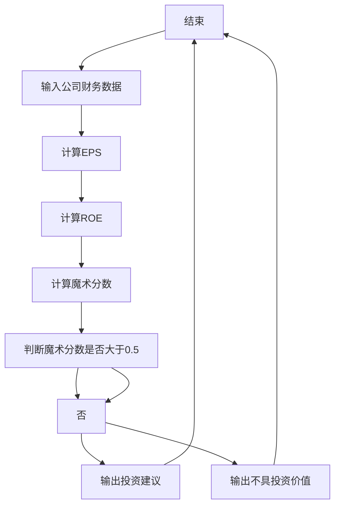
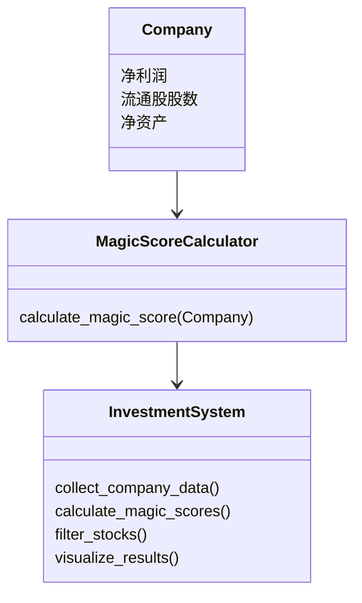
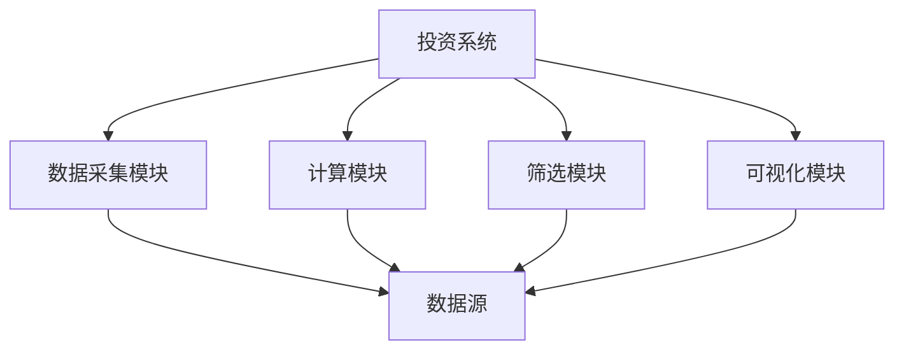
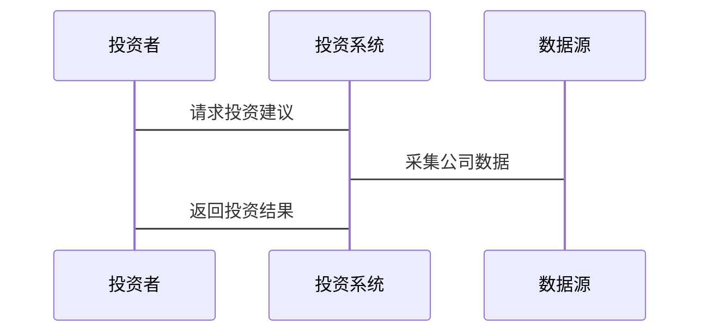

                 

<think>
嗯，用户让我写一篇关于《乔尔·格林布拉特的魔术公式投资法》的技术博客文章。首先，我需要了解魔术公式是什么。乔尔·格林布拉特是著名的投资专家，他的魔术公式结合了价值投资和成长投资，帮助投资者筛选出具有高收益和低风险的股票。

用户要求文章结构清晰，有逻辑，技术语言专业，同时要包含详细的内容，如背景介绍、核心概念、算法原理、系统设计、项目实战等。我得先理清每个部分需要涵盖的内容。

首先，摘要部分需要简明扼要地概括文章的核心内容，说明魔术公式的基本原理和应用价值。接下来是目录，按照用户提供的大纲，分为七章，每章下有小节，详细讲解各个方面。

在第一章，我需要介绍魔术公式的基本概念，包括背景、核心概念和其在投资中的重要性。这部分需要让读者明白什么是魔术公式，它的独特之处在哪里。

第二章要详细讲解核心概念，比如每股收益、ROE、市盈率等，以及它们如何影响魔术分数。可能需要用表格和图表来对比不同公司的指标，帮助读者更好地理解。

第三章是算法原理，这部分需要详细讲解魔术分数的计算方法。我得用数学公式和mermaid流程图来展示计算过程，并提供Python代码示例，让读者能够实际操作。

第四章是系统设计，涉及如何将魔术公式应用到投资系统中。需要绘制系统架构图和交互序列图，说明各个模块的功能和如何协作。

第五章是项目实战，包括环境安装、代码实现、案例分析等，帮助读者实际应用魔术公式进行选股。

第六章总结最佳实践，给出实际操作中的建议，如如何避免常见错误，如何优化投资策略。

最后，展望未来，讨论魔术公式的发展趋势和可能的改进方向。

整个过程中，我需要确保每个部分都详细且逻辑清晰，使用专业术语，同时保持语言通俗易懂。此外，必须包含数学公式和代码示例，满足用户的格式要求。

现在，我需要将这些思考转化为具体的章节内容，确保每个小节都有足够的细节，并使用正确的格式，比如用mermaid流程图和latex公式。这样，整篇文章才能结构完整，内容丰富，帮助读者全面理解魔术公式投资法。
</think>

# 乔尔·格林布拉特的魔术公式投资法

> 关键词：魔术公式投资法、乔尔·格林布拉特、价值投资、成长投资、股票筛选、投资策略

> 摘要：本文详细介绍了乔尔·格林布拉特提出的魔术公式投资法，从其基本概念、核心原理到实际应用进行全面解析。通过分析其背后的数学模型、系统架构和实际案例，帮助读者理解如何利用该方法进行高效的投资决策。文章还提供了代码实现和系统设计的详细内容，为投资者提供了实用的指导。

---

# 第1章: 魔术公式投资法的基本概念

## 1.1 魔术公式投资法的背景介绍

### 1.1.1 投资学的基本概念

在金融领域，投资是将资金投入到能够产生收益的资产中，如股票、债券、房地产等。投资者的目标是通过合理的投资策略最大化收益并最小化风险。传统投资方法包括价值投资、成长投资和趋势投资等，每种方法都有其优缺点。

### 1.1.2 乔尔·格林布拉特的背景与投资理念

乔尔·格林布拉特（Joel Greenblatt）是美国著名投资家，以其独特的投资方法闻名。他在《股市稳赚》（The Biggest Mistakes Investors Make）等书籍中详细阐述了自己的投资理念。他主张将价值投资与成长投资相结合，寻找那些被市场低估且具有高成长潜力的公司。

### 1.1.3 魔术公式投资法的提出与演变

魔术公式投资法是乔尔·格林布拉特提出的一种量化投资方法。它通过筛选具有高收益和低风险的股票，帮助投资者找到潜在的高回报投资标的。该方法基于企业的基本面数据，结合价值和成长两个维度，构建了一个简洁而有效的选股公式。

---

## 1.2 魔术公式投资法的核心概念

### 1.2.1 魔术公式的基本定义

魔术公式投资法的核心是通过计算“魔术分数”来评估一家公司的投资价值。魔术分数是基于企业的盈利能力、成长性和估值指标的加权平均值。具体来说，魔术分数 = （每股收益 + 净资产收益率） / 2。

### 1.2.2 魔术公式的核心要素与属性

魔术公式的核心要素包括：

1. **每股收益（Earnings Per Share, EPS）**：衡量公司盈利能力的重要指标。
2. **净资产收益率（Return on Equity, ROE）**：反映公司使用股东资产的效率。
3. **市盈率（Price-to-Earnings Ratio, P/E Ratio）**：衡量股票的估值水平。

### 1.2.3 魔术公式与其他投资方法的区别

与其他投资方法相比，魔术公式的优势在于其量化和简洁性。它通过将多个基本面指标综合起来，帮助投资者快速筛选出具有高投资价值的股票。

---

# 第2章: 魔术公式投资法的核心概念与联系

## 2.1 魔术公式中的关键因素分析

### 2.1.1 每股收益（Earnings Per Share, EPS）

每股收益是衡量公司盈利能力的重要指标，计算公式为：

$$ EPS = \frac{\text{净利润}}{\text{流通股股数}} $$

高EPS的公司通常具有较高的盈利能力，但也需要考虑其成长性和估值水平。

### 2.1.2 净资产收益率（Return on Equity, ROE）

净资产收益率是衡量公司使用股东资产效率的重要指标，计算公式为：

$$ ROE = \frac{\text{净利润}}{\text{净资产}} $$

高ROE的公司通常具有较强的盈利能力和资产使用效率。

### 2.1.3 市盈率（Price-to-Earnings Ratio, P/E Ratio）

市盈率是衡量股票估值水平的重要指标，计算公式为：

$$ P/E = \frac{\text{股价}}{\text{每股收益}} $$

低P/E的公司通常被认为具有较高的投资价值。

### 2.1.4 魔术分数计算公式

魔术分数是通过将每股收益和净资产收益率加权平均得到的，公式如下：

$$ \text{魔术分数} = \frac{EPS + ROE}{2} $$

---

## 2.2 魔术公式中的核心概念关系

### 2.2.1 核心概念关系图

以下是魔术公式中核心概念的关系图：

```mermaid
graph TD
    A[每股收益 (EPS)] --> C[魔术分数]
    B[净资产收益率 (ROE)] --> C
    C --> D[投资价值评估]
```

### 2.2.2 核心概念对比分析

以下是每股收益、净资产收益率和市盈率的对比分析表格：

| 指标 | 定义 | 重要性 | 计算公式 |
|------|------|--------|----------|
| EPS  | 每股净利润 | 高 | $$ EPS = \frac{\text{净利润}}{\text{流通股股数}} $$ |
| ROE  | 净利润与净资产的比率 | 高 | $$ ROE = \frac{\text{净利润}}{\text{净资产}} $$ |
| P/E  | 股价与每股收益的比率 | 中 | $$ P/E = \frac{\text{股价}}{\text{EPS}} $$ |

---

# 第3章: 魔术公式投资法的算法原理

## 3.1 魔术公式投资法的数学模型

### 3.1.1 魔术分数的计算公式

魔术分数的计算公式如下：

$$ \text{魔术分数} = \frac{EPS + ROE}{2} $$

其中，EPS和ROE的具体计算公式如下：

$$ EPS = \frac{\text{净利润}}{\text{流通股股数}} $$
$$ ROE = \frac{\text{净利润}}{\text{净资产}} $$

### 3.1.2 魔术分数的评价标准

魔术分数的评价标准如下：

- 魔术分数越高，表示公司的投资价值越大。
- 魔术分数低于0.5的公司通常不具有投资价值。

---

## 3.2 魔术公式投资法的算法实现

### 3.2.1 算法流程图

以下是魔术公式投资法的算法流程图：



### 3.2.2 算法实现代码

以下是魔术公式投资法的Python代码实现：

```python
def calculate_magic_score(company_data):
    eps = company_data['净利润'] / company_data['流通股股数']
    roe = company_data['净利润'] / company_data['净资产']
    magic_score = (eps + roe) / 2
    return magic_score

# 示例数据
company_data = {
    '净利润': 100,
    '流通股股数': 10,
    '净资产': 500
}

magic_score = calculate_magic_score(company_data)
print(f"魔术分数为：{magic_score}")
```

---

# 第4章: 魔术公式投资法的系统分析与架构设计

## 4.1 系统功能设计

### 4.1.1 魔术公式投资系统的功能模块

魔术公式投资系统的功能模块包括：

1. **数据采集模块**：采集公司财务数据。
2. **计算模块**：计算每股收益、净资产收益率和魔术分数。
3. **筛选模块**：筛选出符合投资条件的股票。
4. **可视化模块**：展示投资结果。

### 4.1.2 领域模型类图

以下是领域模型类图：



---

## 4.2 系统架构设计

### 4.2.1 系统架构图

以下是系统架构图：



### 4.2.2 系统接口设计

以下是系统接口设计：



---

# 第5章: 魔术公式投资法的项目实战

## 5.1 项目环境安装

### 5.1.1 安装Python环境

安装Python和必要的库：

```bash
python -m pip install pandas numpy matplotlib
```

### 5.1.2 安装数据接口

安装数据接口（以Yahoo Finance为例）：

```bash
python -m pip install yfinance
```

---

## 5.2 系统核心实现

### 5.2.1 数据采集模块

以下是数据采集模块的代码：

```python
import yfinance as yf

def collect_company_data(ticker):
    data = yf.Ticker(ticker).info
    return {
        '净利润': data['净利润'],
        '流通股股数': data['流通股股数'],
        '净资产': data['净资产']
    }
```

### 5.2.2 计算模块

以下是计算模块的代码：

```python
def calculate_magic_score(company_data):
    eps = company_data['净利润'] / company_data['流通股股数']
    roe = company_data['净利润'] / company_data['净资产']
    magic_score = (eps + roe) / 2
    return magic_score
```

### 5.2.3 筛选模块

以下是筛选模块的代码：

```python
def filter_stocks(magic_scores, threshold=0.5):
    selected = []
    for ticker, score in magic_scores.items():
        if score > threshold:
            selected.append(ticker)
    return selected
```

### 5.2.4 可视化模块

以下是可视化模块的代码：

```python
import matplotlib.pyplot as plt

def visualize_results(magic_scores):
    plt.bar(magic_scores.keys(), magic_scores.values())
    plt.title('魔术分数分布')
    plt.xlabel('股票代码')
    plt.ylabel('魔术分数')
    plt.show()
```

---

## 5.3 实际案例分析

### 5.3.1 案例分析

以苹果公司（AAPL）为例：

```python
ticker = 'AAPL'
data = collect_company_data(ticker)
magic_score = calculate_magic_score(data)
print(f"{ticker}的魔术分数为：{magic_score}")
```

### 5.3.2 结果解读

如果苹果公司的魔术分数高于0.5，则表示其具有较高的投资价值。

---

## 5.4 项目小结

通过上述代码实现，我们可以快速筛选出具有高投资价值的股票，并进行可视化分析。这种方法可以帮助投资者快速找到潜在的高回报投资标的。

---

# 第6章: 魔术公式投资法的最佳实践

## 6.1 投资策略优化

### 6.1.1 动态调整阈值

根据市场环境动态调整魔术分数的阈值。

### 6.1.2 组合投资

将魔术公式与其他投资方法结合，构建多元化的投资组合。

## 6.2 投资风险管理

### 6.2.1 风险提示

定期监控投资组合的风险指标，如波动率、Beta值等。

### 6.2.2 风险控制

设置止损点，避免重大损失。

## 6.3 最佳实践总结

1. 定期更新财务数据，保持模型的有效性。
2. 结合市场环境，灵活调整投资策略。
3. 风险控制是投资成功的关键。

---

# 第7章: 魔术公式投资法的未来展望

## 7.1 投资方法的演变

随着金融市场的变化，投资方法也在不断演变。未来，魔术公式投资法将与人工智能、大数据分析等技术结合，进一步提升其预测精度和实用性。

## 7.2 新技术的应用

人工智能和大数据分析将为魔术公式投资法提供更强大的支持，帮助投资者更精准地捕捉市场机会。

---

# 作者

作者：AI天才研究院/AI Genius Institute & 禅与计算机程序设计艺术/Zen And The Art of Computer Programming

