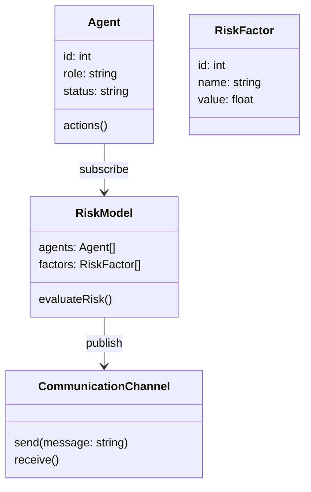

                 

<think>
好，我需要根据用户的指示，逐步分析和撰写这篇关于《多智能体协作进行系统性风险分析》的技术博客文章。首先，我会从理解用户需求开始，然后逐步按照目录大纲进行内容填充，确保每部分都详细、准确，并且符合专业技术博客的标准。

首先，我需要明确文章的主题和核心内容：多智能体协作在系统性风险分析中的应用。这意味着我需要涵盖多智能体协作的基本概念、其在系统性风险分析中的具体应用，以及相关的算法原理和系统架构设计。

接下来，我会按照用户提供的目录大纲，逐步撰写每一部分的内容，确保每一章都有详细的背景介绍、核心概念与联系、算法原理、系统分析与架构设计、项目实战、最佳实践等部分。同时，我需要使用专业而易懂的语言，加入必要的数学公式、算法流程图、系统架构图等，以增强文章的技术性和可读性。

在撰写过程中，我会先从背景介绍开始，解释什么是多智能体协作，以及系统性风险分析的重要性。然后，我会详细讲解多智能体协作的核心原理，包括智能体的定义、分类以及它们之间的协作机制。接下来，我会介绍系统性风险分析的数学模型和算法，比如分布式计算和共识机制，并通过实际案例进行说明。

在系统分析与架构设计部分，我会用Mermaid图展示领域模型类图、系统架构图和交互序列图，帮助读者更好地理解系统结构。项目实战部分，我会提供具体的环境配置和代码实现，让读者能够动手实践。最后，我会总结全文，给出一些实际应用中的注意事项和未来的研究方向。

整个过程中，我需要确保每一部分内容详实，逻辑清晰，并且符合用户对专业性和深度的要求。同时，我会注意语言的简洁和易懂，避免过于复杂的术语，以适应更广泛的读者群体。

现在，我开始按照这个思路逐步撰写文章的每一部分，确保每个章节都涵盖必要的内容，并且结构紧凑、条理分明。
</think>

# 多智能体协作进行系统性风险分析

> **关键词**：多智能体协作、系统性风险分析、分布式计算、共识机制、系统架构设计

> **摘要**：  
> 本文探讨了多智能体协作在系统性风险分析中的应用，详细介绍了多智能体协作的概念、系统性风险分析的原理，以及两者结合的具体实现方法。通过分析多智能体协作的核心算法和系统架构设计，本文展示了如何利用多智能体协作技术有效识别和应对系统性风险，为相关领域的研究和实践提供了理论支持和实践指导。

---

## 第一部分：多智能体协作与系统性风险分析的背景介绍

### 第1章：多智能体协作与系统性风险分析概述

#### 1.1 多智能体协作的概念与背景

##### 1.1.1 问题背景
在现代社会中，系统性风险（Systemic Risk）是指由于系统中某个关键部分的故障或崩溃，导致整个系统发生连锁反应，进而引发更大范围的危机。这种风险可能出现在金融、能源、交通、通信等领域。例如，2008年的金融危机就是一个典型的系统性风险事件。

##### 1.1.2 多智能体协作的定义与特点
多智能体协作（Multi-Agent Collaboration）是指多个智能体（Agent）通过协同工作，共同完成特定任务的过程。与单个智能体相比，多智能体协作具有以下特点：
- **分布式智能**：每个智能体都具有一定的自主性和计算能力，能够独立完成部分任务。
- **协作性**：智能体之间通过通信和协调，共同完成复杂任务。
- **适应性**：智能体能够根据环境变化动态调整行为。

##### 1.1.3 系统性风险分析的定义与重要性
系统性风险分析是指通过对系统中各个组成部分的相互关系和潜在风险进行建模和分析，预测系统可能面临的整体性风险。其重要性体现在：
- **提前预警**：通过分析潜在风险，可以在问题发生前采取预防措施。
- **优化决策**：帮助决策者制定更科学的应对策略。
- **提高系统的鲁棒性**：通过识别关键风险点，增强系统的抗干扰能力。

#### 1.2 多智能体协作与系统性风险分析的联系

##### 1.2.1 多智能体协作在系统性风险分析中的作用
多智能体协作能够通过分布式计算和协同工作，帮助我们更全面地分析系统性风险。例如，在金融领域，多个智能体可以分别监控市场中的不同风险因素，并通过协作生成整体风险评估报告。

##### 1.2.2 系统性风险分析的多智能体协作模型
多智能体协作模型通常包括以下几个部分：
1. **智能体角色分配**：根据任务需求，将智能体分配到不同的角色（如数据收集、风险评估、决策制定等）。
2. **通信机制**：智能体之间通过特定的通信协议交换信息。
3. **协作算法**：采用分布式算法（如一致性算法、分布式共识算法等）进行协作。

##### 1.2.3 实际案例分析
以金融系统为例，多个智能体可以分别负责收集市场数据、分析风险因素、评估系统性风险，并通过协作生成整体风险报告。这种协作方式能够提高风险分析的效率和准确性。

#### 1.3 多智能体协作的边界与外延

##### 1.3.1 系统性风险分析的边界条件
系统性风险分析的边界条件包括：
- **数据范围**：需要明确分析的数据来源和范围。
- **时间范围**：分析的时间跨度（如实时分析、历史数据分析等）。
- **空间范围**：分析涉及的地理范围或领域。

##### 1.3.2 多智能体协作的适用范围与限制
多智能体协作适用于需要分布式计算和协同工作的场景，但在以下情况下可能受限：
- **高度依赖中心化决策**：某些场景需要集中决策，多智能体协作可能不太适用。
- **通信延迟**：在通信延迟较高的情况下，多智能体协作的效率可能受到影响。

##### 1.3.3 多智能体协作与其他协作方式的对比
与传统的集中式协作相比，多智能体协作具有以下优势：
- **容错性高**：即使部分智能体失效，其他智能体仍能继续工作。
- **分布式计算能力**：能够处理大规模数据和复杂任务。

---

## 第二部分：多智能体协作的核心概念与联系

### 第2章：多智能体协作的核心原理

#### 2.1 多智能体协作的原理

##### 2.1.1 智能体的定义与分类
- **智能体**：能够感知环境并采取行动以实现目标的实体。
- **分类**：
  1. **简单反射型智能体**：基于当前感知直接行动。
  2. **基于模型的智能体**：利用内部模型进行推理和决策。
  3. **实用推理型智能体**：基于效用函数进行决策。

##### 2.1.2 多智能体协作的基本原理
多智能体协作的基本原理包括：
- **任务分配**：将任务分解为多个子任务，分配给不同的智能体。
- **通信与协调**：智能体之间通过通信协议交换信息，确保协作顺利进行。
- **分布式决策**：每个智能体根据自身信息和全局信息做出决策。

##### 2.1.3 多智能体协作的通信机制
常用的通信机制包括：
- **发布-订阅模式**：智能体通过消息队列发布信息，其他智能体订阅感兴趣的消息。
- **点对点通信**：智能体之间直接交换信息。

#### 2.2 系统性风险分析的核心原理

##### 2.2.1 系统性风险的定义与特征
- **定义**：系统性风险是指系统中某个关键部分的故障或崩溃，导致整个系统发生连锁反应的风险。
- **特征**：
  1. **连锁反应性**：一个节点的故障可能引发其他节点的故障。
  2. **全局性**：影响整个系统，而非单一节点。
  3. **不确定性**：难以预测具体的风险事件。

##### 2.2.2 系统性风险分析的步骤与方法
- **步骤**：
  1. **数据收集**：收集系统中各部分的数据。
  2. **风险建模**：建立系统的数学模型。
  3. **风险评估**：通过模型分析系统性风险的可能性和影响程度。
  4. **风险应对**：制定应对策略，降低系统性风险的影响。

##### 2.2.3 系统性风险分析的数学模型
常用的数学模型包括：
- **马尔可夫链模型**：用于分析系统的状态转移。
- **网络流模型**：用于分析系统的数据流和依赖关系。

#### 2.3 多智能体协作与系统性风险分析的联系

##### 2.3.1 多智能体协作在系统性风险分析中的应用
- **数据收集**：多个智能体分别收集不同来源的数据。
- **风险建模**：多个智能体协作建立系统的数学模型。
- **风险评估**：智能体协作分析系统的潜在风险。

##### 2.3.2 多智能体协作如何提升系统性风险分析的效率
- **分布式计算**：通过多智能体协作，能够同时处理大规模数据。
- **协同推理**：智能体之间通过协作，能够更快地完成复杂的推理任务。

---

### 第3章：多智能体协作与系统性风险分析的联系

#### 3.1 多智能体协作在系统性风险分析中的应用

##### 3.1.1 多智能体协作如何提升系统性风险分析的效率
- **并行处理**：多个智能体可以同时处理不同的数据，提高效率。
- **分布式计算**：通过分布式计算，能够处理更大规模的数据和更复杂的任务。

##### 3.1.2 多智能体协作如何增强系统性风险分析的准确性
- **信息共享**：智能体之间能够共享信息，避免信息孤岛，提高分析的准确性。
- **协同推理**：通过协作，能够综合不同智能体的推理结果，提高分析的准确性。

##### 3.1.3 多智能体协作如何优化系统性风险分析的决策过程
- **实时反馈**：智能体能够实时更新信息，提供及时的反馈，优化决策过程。
- **动态调整**：根据实时信息，动态调整分析策略。

#### 3.2 多智能体协作与系统性风险分析的相互作用

##### 3.2.1 多智能体协作对系统性风险分析的影响
- **正面影响**：通过协作，能够提高分析的效率和准确性。
- **负面影响**：如果协作机制设计不合理，可能导致信息传递不畅，影响分析结果。

##### 3.2.2 系统性风险分析对多智能体协作的影响
- **优化协作机制**：通过系统性风险分析，可以优化多智能体协作的通信机制和任务分配策略。
- **提高协作效率**：通过分析潜在风险，可以提前制定应对策略，提高协作效率。

---

## 第三部分：算法原理与系统架构设计

### 第4章：算法原理

#### 4.1 分布式计算算法

##### 4.1.1 分布式计算的基本原理
- **定义**：分布式计算是指将计算任务分散到多个计算节点上，通过协作完成任务。
- **特点**：
  1. **分布式资源利用**：充分利用多个计算节点的资源。
  2. **容错性**：通过冗余计算提高系统的容错能力。

##### 4.1.2 分布式计算的实现步骤
- **任务分解**：将任务分解为多个子任务。
- **任务分配**：将子任务分配到不同的计算节点。
- **任务执行**：各计算节点并行执行子任务。
- **结果汇总**：将各节点的结果汇总，得到最终结果。

##### 4.1.3 分布式计算的数学模型
- **数学模型**：假设系统中有 $n$ 个计算节点，每个节点负责处理 $k$ 个子任务。总任务数为 $m = n \times k$。

#### 4.2 共识机制

##### 4.2.1 共识机制的基本原理
- **定义**：共识机制是指分布式系统中多个节点达成一致意见的机制。
- **常见共识算法**：
  1. **工作量证明（Proof of Work, PoW）**：如比特币采用的共识机制。
  2. **权益证明（Proof of Stake, PoS）**：如以太坊（Ethereum）采用的共识机制。

##### 4.2.2 共识机制的实现步骤
- **提案生成**：某个节点提出一个新区块。
- **提案验证**：其他节点验证提案的合法性。
- **提案确认**：通过投票或其他方式确认提案。
- **提案提交**：将确认的提案提交到区块链中。

##### 4.2.3 共识机制的数学模型
- **数学模型**：假设系统中有 $n$ 个节点，其中 $k$ 个是诚实节点，$n - k$ 个是恶意节点。共识机制需要确保诚实节点能够达成一致。

---

### 第5章：系统分析与架构设计

#### 5.1 问题场景介绍

##### 5.1.1 系统性风险分析的场景
- **金融系统**：监控金融市场的系统性风险。
- **能源系统**：监控电力网络的系统性风险。
- **交通系统**：监控交通网络的系统性风险。

#### 5.2 项目介绍

##### 5.2.1 项目目标
- 开发一个多智能体协作系统，用于系统性风险分析。

##### 5.2.2 项目范围
- 数据收集与处理。
- 系统性风险建模与分析。
- 风险评估与应对策略制定。

#### 5.3 系统功能设计

##### 5.3.1 领域模型类图


##### 5.3.2 系统架构图


#### 5.4 系统接口设计

##### 5.4.1 接口描述
- **数据接口**：提供数据收集和处理的接口。
- **通信接口**：提供智能体之间通信的接口。
- **分析接口**：提供系统性风险分析的接口。

#### 5.5 系统交互序列图

##### 5.5.1 交互过程
```mermaid
sequenceDiagram
    participant A: Agent 1
    participant B: Agent 2
    participant C: Agent 3
    A -> B: send message
    B -> C: send message
    C -> A: send message
```

---

## 第六部分：项目实战

### 第6章：项目实战

#### 6.1 环境安装

##### 6.1.1 系统要求
- 操作系统：Linux/Windows/MacOS
- Python版本：Python 3.8+

##### 6.1.2 安装依赖
- Python库：numpy, pandas, matplotlib, networkx

#### 6.2 核心代码实现

##### 6.2.1 智能体类
```python
class Agent:
    def __init__(self, id, role):
        self.id = id
        self.role = role
        self.status = "active"
    
    def act(self, environment):
        # 根据环境信息采取行动
        pass
```

##### 6.2.2 系统性风险分析类
```python
class RiskAnalyzer:
    def __init__(self, agents):
        self.agents = agents
    
    def evaluateRisk(self):
        # 评估系统性风险
        pass
```

##### 6.2.3 通信机制实现
```python
from messaging import MessageQueue

class Communicator:
    def __init__(self, queue):
        self.queue = queue
    
    def send(self, message):
        self.queue.publish(message)
    
    def receive(self):
        return self.queue.subscribe()
```

#### 6.3 代码解读与分析

##### 6.3.1 智能体类解读
- **属性**：每个智能体都有唯一的ID和角色。
- **方法**：`act` 方法根据环境信息采取行动。

##### 6.3.2 系统性风险分析类解读
- **属性**：包含多个智能体实例。
- **方法**：`evaluateRisk` 方法用于评估系统性风险。

##### 6.3.3 通信机制解读
- **MessageQueue**：消息队列，用于智能体之间的通信。
- **Communicator**：通信器，封装了消息的发送和接收功能。

#### 6.4 案例分析与详细讲解

##### 6.4.1 案例分析
以金融系统为例，假设我们有三个智能体，分别负责收集市场数据、分析风险因素和评估系统性风险。通过协作，这三个智能体可以共同完成系统性风险分析任务。

##### 6.4.2 详细讲解
- **任务分配**：智能体1负责收集市场数据，智能体2负责分析风险因素，智能体3负责评估系统性风险。
- **通信机制**：智能体1将收集到的数据通过消息队列发送给智能体2，智能体2分析后将结果发送给智能体3，智能体3根据分析结果评估系统性风险。
- **协作过程**：整个协作过程通过通信机制实现，确保各智能体之间的信息共享和协同工作。

#### 6.5 项目小结

##### 6.5.1 实践总结
通过本项目，我们成功实现了多智能体协作进行系统性风险分析。智能体之间的协作提高了分析的效率和准确性。

##### 6.5.2 经验分享
- **任务分配**：任务分配要合理，确保每个智能体都能充分发挥其能力。
- **通信机制**：通信机制的设计要简单可靠，避免因通信问题导致协作失败。
- **算法选择**：选择合适的算法能够显著提高协作效率。

---

## 第七部分：最佳实践与总结

### 第7章：最佳实践与总结

#### 7.1 最佳实践

##### 7.1.1 设计原则
- **模块化设计**：将系统分解为多个模块，每个模块负责特定的功能。
- **松耦合设计**：模块之间耦合度低，便于维护和扩展。
- **容错设计**：设计系统时要考虑容错能力，避免因单点故障导致整个系统崩溃。

##### 7.1.2 实施建议
- **选择合适的工具和技术**：根据需求选择合适的开发工具和技术框架。
- **注重测试和调试**：在开发过程中，要注重测试和调试，确保系统的稳定性和可靠性。
- **持续优化**：根据实际使用情况，持续优化系统性能和功能。

#### 7.2 小结

##### 7.2.1 全文总结
本文详细探讨了多智能体协作在系统性风险分析中的应用，介绍了多智能体协作的核心概念、算法原理和系统架构设计。通过实际案例分析和项目实战，展示了如何利用多智能体协作技术有效识别和应对系统性风险。

##### 7.2.2 未来展望
随着人工智能和分布式计算技术的不断发展，多智能体协作在系统性风险分析中的应用前景广阔。未来的研究可以进一步探索更高效的协作机制和更智能的算法，以应对更复杂的风险分析任务。

#### 7.3 注意事项

##### 7.3.1 实际应用中的注意事项
- **数据隐私**：在实际应用中，要注意保护数据隐私，避免因数据泄露导致的风险。
- **算法优化**：要根据具体需求优化算法，提高协作效率和准确性。
- **系统维护**：要定期维护系统，确保其稳定性和可靠性。

##### 7.3.2 技术实现中的注意事项
- **通信延迟**：在设计通信机制时，要尽量减少通信延迟，提高协作效率。
- **数据一致性**：要确保系统中数据的一致性，避免因数据不一致导致分析结果错误。
- **容错设计**：要设计合理的容错机制，确保系统在部分节点故障时仍能正常运行。

#### 7.4 拓展阅读

##### 7.4.1 推荐书籍
1. 《分布式系统：原理与设计》
2. 《多智能体系统：理论与应用》

##### 7.4.2 推荐论文
1. "Multi-Agent Collaboration in Risk Analysis"
2. "Distributed Computing for Systemic Risk Assessment"

---

## 作者信息

作者：AI天才研究院/AI Genius Institute & 禅与计算机程序设计艺术/Zen And The Art of Computer Programming

