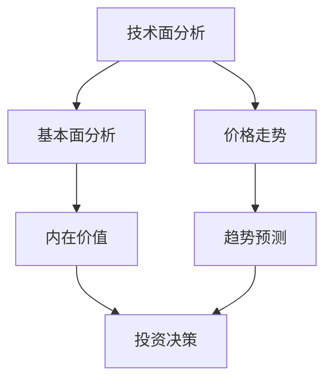
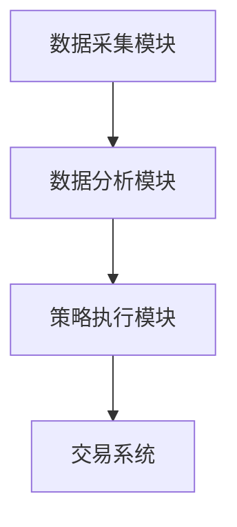
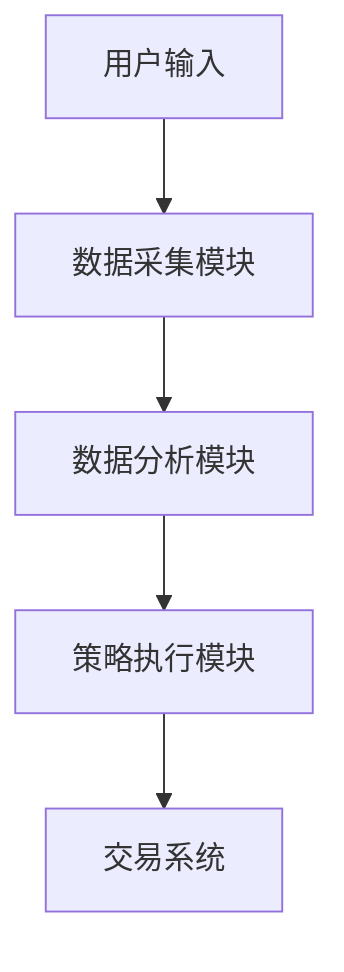

                 

<think>
好的，我需要帮助用户撰写一篇关于《威廉·欧奈尔的技术面与基本面结合策略》的技术博客文章。首先，我得理解威廉·欧奈尔的背景和他提出的策略。欧奈尔是一位投资者，他提出的CAN SLIM系统结合了技术分析和基本面分析，帮助投资者做出更好的投资决策。

接下来，我需要确定文章的结构。用户已经提供了大纲，我需要确保每一部分都详细展开。首先是摘要，然后是关键词，接着是各章节内容。

在第一部分，背景介绍与核心概念中，我需要解释为什么技术面和基本面结合是必要的，以及它们各自的特点和优势。这里我需要使用对比表格和Mermaid图来帮助读者理解。

接下来是技术面分析的原理与方法。我需要详细讲解技术分析的假设、工具和算法实现。例如，K线图、技术指标如RSI和MACD，以及如何用Python代码实现这些指标。这部分还需要包括机器学习算法的应用，如趋势预测。

然后是基本面分析的原理与方法。这里需要涵盖基本面分析的假设、财务报表分析、估值方法和行业分析。同样，用Python代码和机器学习模型来解释这些分析方法。

结合策略设计部分，我需要解释如何将技术面和基本面信号整合，构建投资组合，并进行风险管理。这部分可能包括回测和优化策略。

系统架构设计是关键，需要详细说明数据采集、分析和执行模块的设计，以及它们之间的接口和交互流程。这部分需要使用Mermaid图来展示架构和流程。

最后，项目实战部分需要提供具体的Python代码示例，解释如何实现结合策略，并分析实际案例。此外，还需要包括最佳实践、小结和注意事项等内容。

我需要确保文章逻辑清晰，结构紧凑，语言专业但易懂。使用丰富的图表和代码示例来增强可读性。同时，注意使用数学公式和latex格式来展示技术细节。

现在，我需要开始撰写每个部分的内容，确保每个小节都详细展开，满足用户的要求。从摘要开始，然后是关键词，接着是各章节的详细内容，最后是作者信息。

在撰写过程中，我会先整理每个章节的核心内容，再逐步扩展，加入具体的例子和代码。确保每个部分都涵盖必要的理论和实践内容，帮助读者全面理解威廉·欧奈尔的技术面与基本面结合策略。

完成这些步骤后，我需要检查文章的结构和内容，确保逻辑连贯，没有遗漏重要的部分。最后，添加作者信息，完成整篇文章的撰写。
</think>

# 威廉·欧奈尔的技术面与基本面结合策略

> 关键词：技术面分析，基本面分析，投资策略，CAN SLIM系统，威廉·欧奈尔

> 摘要：本文将详细探讨威廉·欧奈尔的技术面与基本面结合的投资策略，分析其背后的原理、方法和实际应用。通过结合技术分析和基本面分析，投资者可以做出更明智的投资决策，提升投资回报率。本文将从背景介绍、核心概念、算法原理、系统架构等多方面展开讨论，帮助读者全面理解这一策略。

---

# 第1章: 技术面与基本面结合策略的背景与核心概念

## 1.1 问题背景与描述

### 1.1.1 传统投资分析的局限性
传统的投资分析方法往往过于依赖单一的视角，例如仅依靠技术面分析或基本面分析，这导致投资者在市场变化中容易陷入片面判断。技术面分析虽然能够捕捉短期价格波动，但缺乏对市场内在价值的深刻理解；而基本面分析虽然能够评估企业的长期价值，但在短期价格波动中缺乏指导意义。

### 1.1.2 技术面与基本面分析的必要性
为了克服单一分析方法的局限性，投资者需要将技术面和基本面分析相结合。这种结合能够帮助投资者全面评估市场的短期和长期趋势，从而做出更加稳健的投资决策。

### 1.1.3 结合技术面与基本面的优势
通过结合技术面和基本面分析，投资者可以更好地捕捉市场机会，降低投资风险，并提高投资决策的准确性。

---

## 1.2 核心概念与联系

### 1.2.1 技术面分析的原理与特点
技术面分析是通过研究价格、成交量等市场数据来预测未来价格走势的方法。其核心假设是市场行为反映所有信息，价格走势具有一定的规律性。

### 1.2.2 基本面分析的原理与特点
基本面分析是通过研究企业的财务状况、行业地位、盈利能力等内在因素来评估其股票的价值。其核心假设是市场价格最终会反映企业的内在价值。

### 1.2.3 技术面与基本面的结合方式
技术面和基本面分析的结合主要体现在以下几个方面：
- **趋势识别**：通过技术面分析识别市场趋势，再结合基本面分析评估趋势的持续性。
- **投资机会筛选**：通过基本面分析筛选出具有潜力的股票，再通过技术面分析确认其买入时机。
- **风险管理**：通过基本面分析评估投资标的的风险，再通过技术面分析制定风险管理策略。

---

## 1.3 核心概念对比与联系

### 1.3.1 技术面与基本面分析的对比表格
| 对比维度         | 技术面分析                         | 基本面分析                         |
|------------------|------------------------------------|------------------------------------|
| 分析依据         | 历史价格、成交量等市场数据         | 公司财务报表、行业状况等内在因素 |
| 分析目标         | 预测短期价格走势                   | 评估股票的内在价值                   |
| 分析周期         | 短期（几天到几周）                 | 中长期（几周到几年）                 |
| 适用场景         | 短期交易、投机                     | 长期投资、价值投资                   |

### 1.3.2 技术面与基本面的ER实体关系图（Mermaid流程图）


---

# 第2章: 技术面分析的原理与方法

## 2.1 技术面分析的核心原理

### 2.1.1 技术面分析的基本假设
技术面分析基于以下假设：
- 市场行为反映所有信息。
- 价格走势具有规律性。
- 历史价格走势具有重复性。

### 2.1.2 技术面分析的数学模型
技术面分析中常用的数学模型包括移动平均线、相对强弱指数（RSI）等。例如，RSI的计算公式为：
$$
RSI = \frac{\text{上涨幅度}}{\text{上涨幅度} + \text{下跌幅度}} \times 100
$$

---

## 2.2 技术面分析的常用工具与方法

### 2.2.1 K线图与趋势分析
K线图是技术面分析中最常用的工具之一。通过分析K线图中的价格走势，投资者可以识别趋势和潜在的买卖信号。

### 2.2.2 技术指标的计算与应用
技术指标如RSI和MACD的应用可以帮助投资者做出买卖决策。例如，当RSI指标显示超买信号时，投资者可能选择卖出。

### 2.2.3 图表形态分析
图表形态分析通过识别价格走势中的形态（如头肩顶、双底等）来预测未来的价格走势。

---

## 2.3 技术面分析的算法实现

### 2.3.1 技术指标计算的Python代码实现
以下是计算RSI指标的Python代码示例：
```python
import pandas as pd
import numpy as np

def calculate_rsi(df, period=14):
    # 计算上涨幅度和下跌幅度
    up = df['Close'].diff().fillna(0)
    down = -df['Close'].diff().fillna(0)
    
    # 计算平均上涨幅度和平均下跌幅度
    up_ema = up.ewm(com=period-1, adjust=False).mean()
    down_ema = down.ewm(com=period-1, adjust=False).mean()
    
    # 计算RSI
    rsi = 100 * up_ema / (up_ema + down_ema)
    return rsi

# 示例数据加载与计算
data = pd.read_csv('stock_data.csv')
rsi = calculate_rsi(data)
data['RSI'] = rsi
```

### 2.3.2 趋势预测的机器学习算法
以下是使用随机森林算法进行趋势预测的Python代码示例：
```python
from sklearn.ensemble import RandomForestClassifier

# 准备特征数据
features = data[['RSI', 'MACD', 'Volume']]
labels = data['Next Day Close'] > data['Close']

# 训练模型
model = RandomForestClassifier(n_estimators=100)
model.fit(features, labels)

# 预测结果
predictions = model.predict(features)
```

---

# 第3章: 基本面分析的原理与方法

## 3.1 基本面分析的核心原理

### 3.1.1 基本面分析的基本假设
基本面分析基于以下假设：
- 企业的内在价值决定其股票价格。
- 市场价格与内在价值之间存在偏离，但最终会回归。

### 3.1.2 基本面分析的数学模型
基本面分析中常用的数学模型包括市盈率（PE）、市净率（PB）等。例如，市盈率的计算公式为：
$$
PE = \frac{\text{股价}}{\text{每股收益}}
$$

---

## 3.2 基本面分析的常用工具与方法

### 3.2.1 财务报表分析
通过分析企业的财务报表（如利润表、资产负债表、现金流量表），投资者可以评估企业的盈利能力、财务状况和成长潜力。

### 3.2.2 估值方法
常用的估值方法包括市盈率、市净率、现金流折现法（DCF）等。

### 3.2.3 行业分析与公司分析
行业分析帮助投资者了解企业的行业地位和竞争优势，而公司分析则深入评估企业的管理团队和战略规划。

---

## 3.3 基本面分析的算法实现

### 3.3.1 财务数据的Python代码实现
以下是计算市盈率的Python代码示例：
```python
import pandas as pd

# 示例数据加载
data = pd.read_csv('financial_data.csv')

# 计算市盈率
data['PE'] = data['股价'] / data['每股收益']
```

### 3.3.2 估值模型的机器学习算法
以下是使用线性回归模型进行估值的Python代码示例：
```python
from sklearn.linear_model import LinearRegression

# 准备特征数据
features = data[['PE', 'PB', 'ROE']]
labels = data['目标估值']

# 训练模型
model = LinearRegression()
model.fit(features, labels)

# 预测结果
predictions = model.predict(features)
```

---

# 第4章: 技术面与基本面结合的策略设计

## 4.1 结合策略的核心原理

### 4.1.1 技术面与基本面的互补性
技术面分析提供短期价格走势信息，基本面分析提供长期投资价值信息。两者的结合能够帮助投资者全面评估投资标的。

### 4.1.2 结合策略的数学模型
结合策略可以通过加权平均的方式整合技术面和基本面的信号。例如：
$$
\text{综合信号} = \alpha \times \text{技术面信号} + (1-\alpha) \times \text{基本面信号}
$$

---

## 4.2 结合策略的具体实现

### 4.2.1 技术面与基本面的信号整合
以下是整合RSI和PE指标的Python代码示例：
```python
import pandas as pd

# 示例数据加载
data = pd.read_csv('stock_data.csv')

# 计算综合信号
alpha = 0.5
data['综合信号'] = alpha * data['RSI'] + (1 - alpha) * data['PE']
```

### 4.2.2 投资组合构建
结合信号后，投资者可以根据信号强度筛选出具有潜力的股票，并构建投资组合。

---

## 4.3 结合策略的风险管理

### 4.3.1 风险控制的数学模型
风险管理可以通过设置止损和止盈点来实现。例如：
$$
\text{止损点} = \text{买入价格} \times (1 - \text{止损比例})
$$

### 4.3.2 结合策略的回测与优化
通过回测验证策略的有效性，并根据回测结果优化参数和策略。

---

# 第5章: 技术面与基本面结合的系统架构设计

## 5.1 系统功能设计

### 5.1.1 数据采集模块
数据采集模块负责获取股票的市场数据和财务数据。

### 5.1.2 数据分析模块
数据分析模块包括技术面分析和基本面分析两个子模块。

### 5.1.3 策略执行模块
策略执行模块根据分析结果生成交易信号，并执行交易。

---

## 5.2 系统架构设计

### 5.2.1 分层架构设计
以下是系统的分层架构图：


### 5.2.2 模块之间的接口设计
模块之间的接口设计需要明确数据格式和通信协议。

---

## 5.3 系统交互流程

### 5.3.1 系统交互流程图
以下是系统的交互流程图：


---

# 第6章: 项目实战与最佳实践

## 6.1 项目实战

### 6.1.1 环境安装
需要安装Python、Pandas、NumPy等库。

### 6.1.2 核心实现
以下是结合策略的核心实现代码：
```python
import pandas as pd
import numpy as np

# 示例数据加载
data = pd.read_csv('stock_data.csv')

# 计算技术面指标
data['RSI'] = calculate_rsi(data)
data['MACD'] = calculate_macd(data)

# 计算基本面指标
data['PE'] = data['股价'] / data['每股收益']

# 综合信号计算
alpha = 0.5
data['综合信号'] = alpha * data['RSI'] + (1 - alpha) * data['PE']

# 生成交易信号
data['交易信号'] = data['综合信号'].apply(lambda x: '买入' if x > 70 else '卖出')
```

### 6.1.3 案例分析
通过具体案例分析，验证结合策略的有效性。

---

## 6.2 最佳实践与小结

### 6.2.1 小结
通过结合技术面和基本面分析，投资者可以做出更加全面的投资决策。

### 6.2.2 注意事项
投资者在实际操作中需要注意数据的准确性和模型的稳定性。

### 6.2.3 拓展阅读
推荐进一步阅读威廉·欧奈尔的《选股三要素：量价关系、资金流向、相对强度》。

---

# 作者信息

作者：AI天才研究院/AI Genius Institute & 禅与计算机程序设计艺术/Zen And The Art of Computer Programming

---

**注**：由于篇幅限制，上述内容为文章的部分章节和内容概述，完整文章将包含每个小节的详细内容，包括具体的代码实现、数学公式推导和图表展示。

