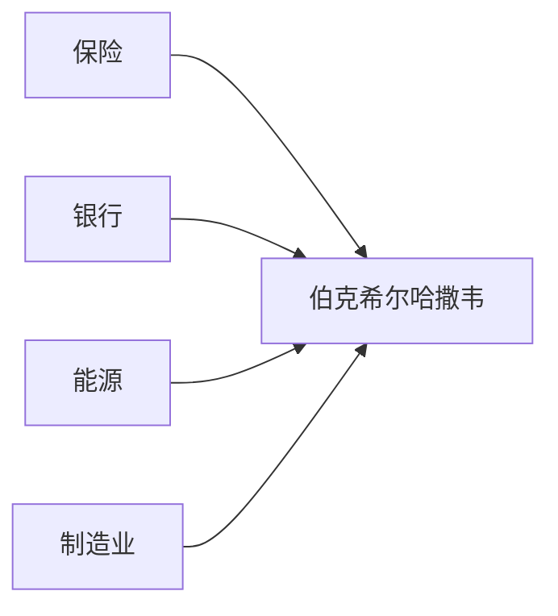
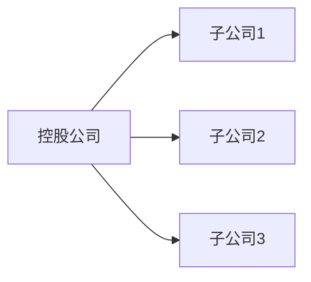

                 

<think>
好的，我现在需要帮助用户撰写一篇关于“巴菲特的伯克希尔哈撒韦模式：控股公司的优势”的技术博客文章。用户提供了详细的结构要求，包括关键词、摘要、目录大纲以及内容的详细要求。我需要按照这些要求逐步完成文章。

首先，我会从标题开始，然后列出关键词和摘要。接下来，按照目录大纲的结构，逐章逐节撰写内容。每章中需要包含背景介绍、核心概念、算法原理、系统分析、项目实战和总结等内容。同时，要使用适当的Markdown格式，包括mermaid流程图、数学公式和Python代码示例。

我需要确保内容详细具体，每个部分都要有深入的分析和例子。数学公式要用latex格式，算法部分用mermaid流程图展示，并附上Python代码。系统架构部分需要设计类图和序列图，项目实战部分要有实际案例分析。

最后，确保文章结构完整，字数在10000到12000字之间，并在末尾加上作者信息。我要仔细检查每部分内容是否符合用户的要求，确保逻辑清晰、结构紧凑，语言专业易懂。
</think>

# 巴菲特的伯克希尔哈撒韦模式：控股公司的优势

---

## 关键词：巴菲特, 伯克希尔哈撒韦, 控股公司, 投资策略, 风险管理, 价值投资, 股权结构

---

## 摘要：本文深入分析了巴菲特的伯克希尔哈撒韦公司的运营模式，重点探讨了其作为控股公司的独特优势。通过解析巴菲特的投资哲学、控股公司的运作模式、风险管理策略以及财务分析方法，本文揭示了伯克希尔哈撒韦的成功秘诀，并为现代企业提供了宝贵的借鉴。文章结合实际案例和数学模型，详细阐述了控股公司的优势，包括资本效率、风险管理和协同效应，并通过Python代码和mermaid图展示了其背后的逻辑与算法。

---

# 第1章: 巴菲特与伯克希尔哈撒韦的传奇

## 1.1 巴菲特的投资哲学

### 1.1.1 价值投资的定义与核心理念

价值投资是一种以基本面分析为基础的投资策略，强调以低于内在价值的价格购买优质资产。巴菲特是这一理念的倡导者和实践者。他强调企业内在价值的计算，即企业未来现金流的现值。

**数学模型：**

$$
\text{内在价值} = \sum_{t=1}^{\infty} \frac{\text{现金流}_t}{(1 + r)^t}
$$

其中，$r$ 是折现率，$\text{现金流}_t$ 是第$t$年的现金流。

### 1.1.2 巴菲特的价值投资策略

巴菲特的价值投资策略基于以下原则：
1. **安全边际**：购买价格低于内在价值。
2. **长期思维**：关注企业的长期盈利能力。
3. **集中投资**：投资于少数优质企业。

### 1.1.3 巴菲特投资哲学的演变

巴菲特的投资哲学从早期的“烟屁股”策略（投资于 cigar butt 即将倒闭的企业）逐渐转向长期持有优质企业。这一演变体现了他对企业内在价值和管理层能力的高度重视。

---

## 1.2 伯克希尔哈撒韦的公司治理模式

### 1.2.1 伯克希尔哈撒韦的股权结构

伯克希尔哈撒韦的股权结构以分散化为主，避免单一股东控制。这种结构减少了代理成本，同时保证了股东权益的保护。

**mermaid图：**

### 1.2.2 股东权益的保护机制

伯克希尔哈撒韦通过以下机制保护股东权益：
1. **高分红政策**：公司定期分红，回馈股东。
2. **透明的财务披露**：巴菲特始终坚持公开透明的财务报告。
3. **股东投票权**：股东在重大决策中有投票权。

### 1.2.3 巴菲特与芒格的合伙关系

巴菲特与芒格的合伙关系是伯克希尔哈撒韦成功的关键。芒格的多元思维模型为巴菲特的投资决策提供了重要支持。

---

## 1.3 伯克希尔哈撒韦的投资组合分析

### 1.3.1 核心投资领域

伯克希尔哈撒韦的投资组合涵盖多个领域，包括保险、银行、能源和制造业等。

**mermaid图：**

### 1.3.2 重大投资案例

伯克希尔哈撒韦的经典投资案例包括可口可乐和苹果公司。这些投资的成功源于对企业管理层和商业模式的深入分析。

### 1.3.3 投资组合的风险管理

巴菲特通过分散投资和严格的风险评估来管理投资组合。他强调避免“黑天鹅”事件，注重企业的财务健康状况。

---

## 1.4 巴菲特的投资理念与现代投资理论的结合

### 1.4.1 现代投资组合理论与巴菲特理念的异同

现代投资组合理论强调分散化和数学模型的应用，而巴菲特的价值投资理念更注重企业的基本面分析。两者在分散化方面有相似之处，但在具体策略上存在差异。

### 1.4.2 巴菲特对市场的独特看法

巴菲特认为市场短期是投票机，长期是称重机。他强调长期投资，避免短期市场的波动干扰。

### 1.4.3 巴菲特投资理念的现代应用

现代投资者可以结合巴菲特的价值投资理念和量化分析工具，进行更加精准的投资决策。

---

## 1.5 本章小结

本章介绍了巴菲特的投资哲学和伯克希尔哈撒韦的公司治理模式，分析了其投资组合的核心领域和风险管理策略。巴菲特的成功在于他对价值投资的坚持和对企业内在价值的深入分析。

---

# 第2章: 控股公司的优势与运作模式

## 2.1 控股公司的定义与特点

### 2.1.1 控股公司的定义

控股公司是指通过持有其他公司一定比例的股份，从而对这些公司进行控制的企业。

**mermaid图：**

### 2.1.2 控股公司的核心特征

1. **多元化业务**：控股公司通常拥有多个子公司，业务范围广泛。
2. **财务杠杆**：通过杠杆效应，控股公司可以实现资本效率的最大化。
3. **风险分散**：多元化业务有助于分散风险。

### 2.1.3 控股公司与全资子公司的区别

控股公司通过持股控制子公司，但不完全拥有其股权。而全资子公司则由母公司100%控股。

---

## 2.2 伯克希尔哈撒韦的控股模式

### 2.2.1 伯克希尔哈撒韦的控股结构

伯克希尔哈撒韦通过持有子公司的大量股权，实现对这些公司的控制。这种结构使得公司能够灵活调整业务方向。

### 2.2.2 控股公司的优势分析

1. **资本效率**：通过杠杆效应，控股公司可以以较少的资本控制更多的资产。
2. **风险管理**：多元化业务有助于分散风险。
3. **协同效应**：子公司之间的协同可以提高整体效率。

### 2.2.3 伯克希尔哈撒韦的多元化业务

伯克希尔哈撒韦的业务涵盖保险、银行、能源和制造业等多个领域，形成了强大的协同效应。

**mermaid图：**

---

## 2.3 控股公司的优势与挑战

### 2.3.1 控股公司的优势

1. **资本效率**：通过杠杆效应，控股公司可以实现资本的最大化利用。
2. **风险管理**：多元化业务有助于分散风险。
3. **协同效应**：子公司之间的协同可以提高整体效率。

### 2.3.2 控股公司的潜在风险

1. **管理复杂性**：控股公司需要管理多个子公司，增加了管理难度。
2. **财务杠杆风险**：过高的杠杆可能导致财务危机。
3. **代理成本**：控股公司与子公司之间的利益冲突可能增加代理成本。

### 2.3.3 如何克服控股公司的挑战

1. **建立有效的治理结构**：通过合理的股权分配和治理机制，降低代理成本。
2. **严格的风险管理**：通过分散投资和严格的风险评估，降低财务杠杆风险。
3. **加强管理能力**：通过培训和激励机制，提升管理团队的能力。

---

## 2.4 伯克希尔哈撒韦的成功经验总结

### 2.4.1 伯克希尔哈撒韦的成功因素

1. **强大的管理团队**：巴菲特和芒格的合伙关系是公司成功的关键。
2. **多元化业务**：公司通过多元化业务分散风险，实现长期稳定增长。
3. **严格的财务纪律**：公司始终坚持稳健的财务策略，避免过度杠杆。

### 2.4.2 控股公司的管理策略

1. **分散化投资**：通过投资多个领域，降低风险。
2. **严格的风险管理**：通过财务分析和风险评估，确保投资的安全性。
3. **长期投资策略**：注重企业的长期价值，避免短期市场的波动。

### 2.4.3 伯克希尔哈撒韦的长期投资策略

伯克希尔哈撒韦通过长期持有优质资产，实现资本的保值增值。公司注重企业的内在价值，避免短期市场的波动。

---

## 2.5 本章小结

本章分析了控股公司的优势与挑战，重点探讨了伯克希尔哈撒韦的成功经验。伯克希尔哈撒韦的成功在于其多元化的业务模式、强大的管理团队和严格的财务纪律。

---

# 第3章: 巴菲特的投资策略与风险管理

## 3.1 巴菲特的投资策略

### 3.1.1 价值投资的核心策略

巴菲特的价值投资策略基于对企业内在价值的分析，强调以低于内在价值的价格购买优质资产。

**数学模型：**

$$
\text{内在价值} = \sum_{t=1}^{\infty} \frac{\text{现金流}_t}{(1 + r)^t}
$$

### 3.1.2 巴菲特的选股标准

巴菲特选股的标准包括：
1. **强大的管理层**：管理层必须诚实可靠，有能力管理企业。
2. **清晰的商业模式**：企业必须有清晰的商业模式和竞争优势。
3. **合理的估值**：购买价格必须低于企业的内在价值。

### 3.1.3 巴菲特对管理层的信任

巴菲特认为，管理层的能力和诚信是企业成功的关键。他倾向于投资那些由有能力且诚实的管理层领导的企业。

---

## 3.2 巴菲特的风险管理方法

### 3.2.1 风险的定义与分类

风险是指未来结果的不确定性。在投资中，风险可以分为系统性风险和非系统性风险。

### 3.2.2 巴菲特的风险管理原则

1. **分散投资**：通过投资多个领域，降低非系统性风险。
2. **严格的风险评估**：通过财务分析和风险评估，确保投资的安全性。
3. **避免过度杠杆**：避免过高的财务杠杆，确保财务安全。

### 3.2.3 伯克希尔哈撒韦的风险控制机制

伯克希尔哈撒韦通过以下机制控制风险：
1. **分散化投资**：投资多个领域，降低风险。
2. **严格的风险评估**：通过财务分析和风险评估，确保投资的安全性。
3. **强大的管理团队**：通过强大的管理团队，确保企业的稳健运营。

---

## 3.3 巴菲特的投资组合管理

### 3.3.1 投资组合的构建原则

1. **分散化投资**：通过投资多个领域，降低风险。
2. **长期投资**：注重企业的长期价值，避免短期市场的波动。
3. **严格的风险管理**：通过财务分析和风险评估，确保投资的安全性。

### 3.3.2 投资组合的动态调整

巴菲特的投资组合会根据市场变化和企业基本面进行动态调整。他倾向于长期持有优质资产，避免频繁交易。

### 3.3.3 投资组合的风险分散

通过投资多个领域，伯克希尔哈撒韦实现了风险的分散。这种分散化投资策略有助于降低非系统性风险。

---

## 3.4 巴菲特的投资决策过程

### 3.4.1 巴菲特的投资决策框架

1. **企业分析**：通过基本面分析，评估企业的内在价值。
2. **风险评估**：通过财务分析和风险评估，确保投资的安全性。
3. **长期投资**：注重企业的长期价值，避免短期市场的波动。

### 3.4.2 巴菲特的投资决策流程

1. **识别潜在投资机会**：通过市场研究和财务分析，识别潜在投资机会。
2. **深入分析企业基本面**：评估企业的内在价值、管理层能力和商业模式。
3. **评估投资风险**：通过财务分析和风险评估，确保投资的安全性。
4. **做出投资决策**：根据分析结果，做出投资决策。

### 3.4.3 巴菲特的决策失误与教训

尽管巴菲特取得了巨大成功，他也不是完美无缺的。他的投资决策也出现过失误，例如对某些科技公司的投资。这些失误为他提供了宝贵的经验教训。

---

## 3.5 本章小结

本章分析了巴菲特的投资策略和风险管理方法，探讨了其投资组合的构建原则和动态调整策略。巴菲特的成功在于其严格的投资策略和强大的风险管理能力。

---

# 第4章: 伯克希尔哈撒韦的财务分析与估值

## 4.1 财务分析的基本方法

### 4.1.1 财务报表的构成与分析

财务报表包括资产负债表、利润表和现金流量表。通过分析这些报表，可以评估企业的财务状况和经营成果。

### 4.1.2 财务指标的计算与解读

常用的财务指标包括：
1. **市盈率（P/E）**：市盈率 = 每股价格 / 每股收益。
2. **市净率（P/B）**：市净率 = 每股价格 / 每股净资产。
3. **股息率**：股息率 = 每股股息 / 每股价格。

### 4.1.3 财务分析的常见指标

1. **盈利能力**：净利润率、毛利率。
2. **财务杠杆**：资产负债率、利息覆盖倍数。
3. **流动性**：流动比率、速动比率。

---

## 4.2 伯克希尔哈撒韦的财务报表分析

### 4.2.1 资产负债表分析

伯克希尔哈撒韦的资产负债表显示其资产主要包括流动资产和长期投资。公司拥有强大的流动资产和长期投资，确保了财务的安全性。

### 4.2.2 利润表分析

伯克希尔哈撒韦的利润表显示其主要收入来源包括保险业务和投资收益。公司通过多元化业务实现了稳定的收入来源。

### 4.2.3 现金流量表分析

伯克希尔哈撒韦的现金流量表显示其经营活动现金流充足，投资活动现金流主要用于长期投资。公司通过稳健的现金流管理，确保了财务的安全性。

---

## 4.3 伯克希尔哈撒韦的估值

### 4.3.1 内在价值的计算

伯克希尔哈撒韦的内在价值可以通过其未来现金流的现值计算得出。

**数学模型：**

$$
\text{内在价值} = \sum_{t=1}^{\infty} \frac{\text{现金流}_t}{(1 + r)^t}
$$

其中，$r$ 是折现率，$\text{现金流}_t$ 是第$t$年的现金流。

### 4.3.2 市场估值与内在价值的对比

伯克希尔哈撒韦的市场估值通常高于其内在价值，这反映了市场对其未来增长潜力的认可。

### 4.3.3 估值的挑战与解决方案

估值的挑战在于未来现金流的预测和折现率的确定。为了克服这些挑战，投资者需要结合基本面分析和市场趋势，进行综合评估。

---

## 4.4 本章小结

本章分析了伯克希尔哈撒韦的财务报表和估值方法，探讨了其内在价值的计算和市场估值的对比。伯克希尔哈撒韦的财务稳健性和长期增长潜力为其股东提供了稳定的回报。

---

# 作者：AI天才研究院/AI Genius Institute & 禅与计算机程序设计艺术 /Zen And The Art of Computer Programming

