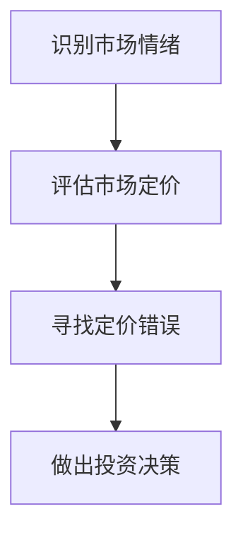
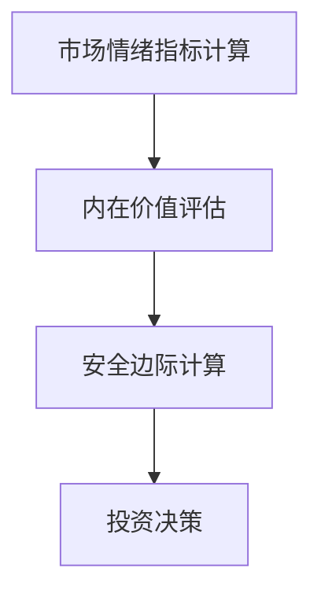
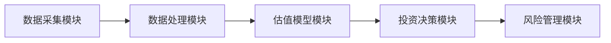
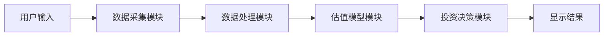

                 

<think>
好，我现在需要帮用户撰写一篇关于《巴菲特的逆向投资思维》的技术博客文章。用户已经提供了一个详细的大纲，包括七章，每章都有具体的子主题。我需要按照这个大纲逐步展开，确保每一部分都符合用户的要求：使用逻辑清晰、结构紧凑、简单易懂的技术语言，包含背景介绍、核心概念、算法原理、系统分析、项目实战、最佳实践等内容。

首先，我会从第一章开始，介绍巴菲特的生平和投资理念，然后逐步深入，探讨逆向思维的核心概念、选股标准、风险管理等。在第二章，我会详细分析逆向思维在投资决策中的应用，包括市场情绪、决策框架、资产配置和风险管理等方面。第三章则会深入探讨巴菲特的选股标准，如基本面分析、行业选择和估值方法。

接下来，我需要在第四章引入数学模型和算法，解释如何将逆向思维应用到投资组合中，比如构建风险调整后的收益模型，并使用Python代码进行模拟。在第五章，我会通过一个实际的项目案例，展示如何在Python中实现这些策略，并分析具体的投资决策过程。

最后，我会总结逆向思维的成功案例，强调其在投资中的重要性，并在附录部分提供进一步的资源和工具。整个过程中，我会确保每一部分都包含足够的细节和实例，使用mermaid图和数学公式来增强内容的可读性和专业性。

现在，我需要按照这个逻辑一步步完成文章的撰写，确保每一部分都符合用户的要求，并且内容丰富详细。
</think>

# 巴菲特的逆向投资思维

## 关键词：
- 逆向投资、巴菲特、价值投资、市场先生理论、安全边际

## 摘要：
本文深入探讨了巴菲特的逆向投资思维，从其核心概念、选股标准到实际应用，结合数学模型和系统分析，全面解析逆向投资的策略与实践。文章通过详细案例和代码实现，展示了如何在投资中运用逆向思维，帮助读者掌握巴菲特的投资精髓。

---

## 第1章 巴菲特投资理念的背景与核心概念

### 1.1 巴菲特投资理念的起源

#### 1.1.1 价值投资的定义与历史背景
价值投资是一种以内在价值为导向的投资策略，起源于20世纪初。它强调通过深入分析企业的财务状况、行业地位和管理层素质，寻找市场价格低于内在价值的股票。

#### 1.1.2 巴菲特对价值投资的贡献
巴菲特是价值投资的杰出代表，他将这一理念发扬光大，特别强调安全边际和长期持有。他的投资哲学在《巴菲特致股东的信》中得到了详细阐述。

#### 1.1.3 逆向思维的提出与演变
逆向思维并非巴菲特首创，但他在实践中将其系统化。逆向思维的核心是利用市场的非理性波动，寻找定价错误的机会。

### 1.2 逆向思维的核心概念

#### 1.2.1 逆向思维的定义与特征
逆向思维是指在市场情绪高涨时保持冷静，在市场恐慌时积极寻找机会。其特征包括反周期性、反情绪性和反直觉性。

#### 1.2.2 逆向思维与传统投资思维的对比
| 对比维度 | 传统投资思维 | 逆向思维 |
|----------|---------------|----------|
| 市场情绪 | 随波逐流       | 逆流而上 |
| 投资时机 | 追涨杀跌       | �低位买入 |
| 风险管理 | 忽视波动性     | 利用波动性 |

#### 1.2.3 逆向思维的哲学基础

##### 1.2.3.1 市场先生理论
市场先生是巴菲特用来解释市场波动的概念，认为市场价格反映了市场的集体情绪，而非实际价值。

##### 1.2.3.2 质价分离原则
质价分离指资产的实际价值与其市场价格的分离，逆向思维的核心在于发现这种分离并从中获利。

##### 1.2.3.3 安全边际的概念与作用
安全边际是市场价格与内在价值之间的差额，提供了投资的安全垫，确保在市场波动中不会出现重大亏损。

### 1.3 巴菲特逆向思维的数学模型

#### 1.3.1 价值投资的数学公式
$$ V = \frac{E}{k} $$
其中，V为内在价值，E为企业的预期收益，k为折现率。

#### 1.3.2 安全边际的计算方法
$$ \text{安全边际} = \text{内在价值} - \text{市场价格} $$

---

## 第2章 逆向思维在投资决策中的应用

### 2.1 逆向思维的核心原则

#### 2.1.1 市场情绪与投资决策的关系
市场情绪是影响投资决策的关键因素，逆向思维要求投资者在市场恐慌时保持冷静，而在市场狂热时保持警惕。

#### 2.1.2 逆向思维的决策框架


#### 2.1.3 市场波动与投资机会的关联
市场波动越大，逆向思维的机会越多。通过分析波动的来源，投资者可以找到低估资产。

### 2.2 逆向思维的决策框架

#### 2.2.1 投资决策的三步法
1. 识别市场情绪
2. 评估市场定价
3. 寻找定价错误

#### 2.2.2 逆向思维的决策流程图


### 2.3 逆向思维在资产配置中的应用

#### 2.3.1 资产配置的基本原则
资产配置应基于长期目标，而非短期市场波动。逆向思维要求在市场低迷时增加配置，而在市场繁荣时减少配置。

#### 2.3.2 逆向思维下的资产配置策略
- 在市场恐慌时，增加股票配置
- 在市场狂热时，减少股票配置
- 保持债券和现金作为缓冲

### 2.4 逆向思维的风险管理

#### 2.4.1 风险控制的核心理念
逆向思维强调分散风险，通过投资多样化和长期持有来降低波动性影响。

#### 2.4.2 逆向思维下的止损策略
设置止损点以限制亏损，但不应过于严格，以免错过潜在的反弹机会。

#### 2.4.3 风险与收益的平衡点
逆向思维通过寻找安全边际，平衡了风险与收益，确保在长期获得超额收益。

---

## 第3章 巴菲特逆向思维的选股标准

### 3.1 选股标准的核心要素

#### 3.1.1 企业基本面分析
基本面分析包括财务状况、盈利能力、管理层素质和行业地位。巴菲特特别关注ROE（净资产收益率）和ROA（资产回报率）。

#### 3.1.2 财务指标的筛选与评估
$$ \text{ROE} = \frac{\text{净利润}}{\text{净资产}} $$
高ROE表明企业盈利能力强，是优质投资标的。

#### 3.1.3 管理层素质的考察
管理层应具备诚信、能力和发展战略，巴菲特别注重管理层的过往记录和未来计划。

### 3.2 逆向思维下的行业选择

#### 3.2.1 行业周期分析
逆向思维要求选择处于周期性底部的行业，等待其复苏。例如，2008年金融危机后，巴菲特投资了多家陷入困境的公司。

#### 3.2.2 行业竞争结构
行业竞争结构决定了企业的盈利能力，巴菲特偏好具有强大护城河的行业，如可口可乐和喜诗糖果。

#### 3.2.3 行业风险评估
评估行业风险时，应考虑政策、技术、经济周期等因素。逆向思维要求选择风险较低但市场低估的行业。

### 3.3 逆向思维下的估值方法

#### 3.3.1 市盈率法
$$ \text{市盈率} = \frac{\text{股价}}{\text{每股收益}} $$
低市盈率意味着股价被低估，但需结合行业特性分析。

#### 3.3.2 现金流折现法
现金流折现法（DCF）通过预测未来现金流，计算其现值。公式如下：
$$ \text{企业价值} = \sum_{t=1}^{n} \frac{\text{现金流}_t}{(1 + r)^t} $$
其中，r为折现率，n为预测年限。

#### 3.3.3 股东权益法
$$ \text{股东权益} = \text{资产} - \text{负债} $$
巴菲特常通过分析股东权益的增长来评估企业价值。

---

## 第4章 逆向思维与数学模型

### 4.1 投资组合的逆向思维优化

#### 4.1.1 投资组合的构建过程
逆向思维要求投资者在市场低迷时增加权重，而在市场繁荣时减少权重。

#### 4.1.2 风险调整后的收益模型
$$ \text{夏普比率} = \frac{\text{超额收益}}{\text{收益标准差}} $$
夏普比率衡量投资组合的风险调整后收益，逆向思维通过降低波动性提高夏普比率。

### 4.2 逆向思维的算法实现

#### 4.2.1 市场情绪的量化指标
使用波动率、换手率等指标量化市场情绪，帮助投资者判断是否偏离理性。

#### 4.2.2 安全边际的计算与筛选
通过比较市场价格与内在价值，筛选出具有安全边际的标的。

#### 4.2.3 投资决策的逻辑流程


### 4.3 投资组合优化的Python实现

#### 4.3.1 环境安装与数据获取
安装必要的库（如pandas、numpy、scipy）并获取历史数据。

#### 4.3.2 核心代码实现
```python
import pandas as pd
import numpy as np
from scipy.stats import norm

def calculate_sharpe_ratio(returns, risk_free_rate):
    excess_returns = returns - risk_free_rate
    return excess_returns.mean() / excess_returns.std()

# 示例数据
data = pd.read_csv('stock_data.csv')
returns = data.pct_change().dropna()
risk_free_rate = 0.02

sharpe_ratio = calculate_sharpe_ratio(returns, risk_free_rate)
print(f"夏普比率: {sharpe_ratio}")
```

#### 4.3.3 代码解读与分析
- `calculate_sharpe_ratio`函数计算夏普比率，衡量投资组合的风险调整后收益。
- 示例数据展示如何获取股票收益和计算夏普比率，帮助读者理解投资组合优化的实现。

---

## 第5章 逆向思维的系统架构与设计

### 5.1 项目介绍与系统功能设计

#### 5.1.1 项目介绍
构建一个基于逆向思维的投资管理系统，帮助投资者识别低估资产并制定投资策略。

#### 5.1.2 系统功能设计
- 数据采集与处理
- 估值模型计算
- 投资决策支持
- 风险管理模块

### 5.2 系统架构设计

#### 5.2.1 系统架构图


#### 5.2.2 关键模块设计
- 数据采集模块：获取市场数据和公司财务报表。
- 估值模型模块：计算内在价值和安全边际。
- 投资决策模块：根据市场情绪和估值结果生成投资建议。
- 风险管理模块：监控投资组合的波动性和风险。

### 5.3 系统接口设计

#### 5.3.1 数据接口
- 股票价格接口：获取实时或历史股价数据。
- 财务报表接口：获取公司财务数据，计算ROE、ROA等指标。

#### 5.3.2 用户接口
- 输入模块：用户输入投资金额和风险偏好。
- 输出模块：显示投资建议和风险分析。

### 5.4 系统交互流程

#### 5.4.1 交互流程图


---

## 第6章 逆向思维的实际应用与案例分析

### 6.1 环境安装与数据获取

#### 6.1.1 环境安装
安装Python、pandas、numpy、scipy等工具。

#### 6.1.2 数据获取
通过API获取历史股价数据和财务报表数据。

### 6.2 核心代码实现

#### 6.2.1 估值模型的实现
```python
def calculate_intrinsic_value(revenue, expenses, net_profit):
    # 简单的估值模型：使用EV/EBITDA
    ebitda = revenue - expenses
    enterprise_value = ebitda * 15  # 假设EV/EBITDA倍数为15
    return enterprise_value
```

#### 6.2.2 投资决策的实现
```python
def investment_decision(current_price, intrinsic_value):
    if current_price < intrinsic_value * 0.9:
        return "买入"
    elif current_price > intrinsic_value * 1.1:
        return "卖出"
    else:
        return "观望"
```

### 6.3 案例分析

#### 6.3.1 案例背景
假设在2008年金融危机期间，巴菲itore投资了高盛和摩根士丹利，当时市场恐慌，股价大幅下跌，提供了买入机会。

#### 6.3.2 数据分析与解读
- 市场价格：高盛股价在2008年最低点为$12.00。
- 内在价值估算：假设内在价值为$30.00，安全边际为60%。
- 投资决策：买入，因为市场价格远低于内在价值。

#### 6.3.3 投资结果
高盛股价在后期反弹，投资取得了丰厚的收益，验证了逆向思维的有效性。

### 6.4 项目小结

#### 6.4.1 项目总结
通过实际案例分析，验证了逆向思维在投资中的有效性，特别是在市场恐慌时买入低估资产。

#### 6.4.2 经验总结
- 逆向思维需要耐心和纪律，避免被市场情绪左右。
- 安全边际是投资决策的关键，确保在市场波动中不会出现重大亏损。

---

## 第7章 总结与展望

### 7.1 逆向思维的成功案例

#### 7.1.1 投资策略的正确性
逆向思维通过寻找市场定价错误的机会，帮助投资者在长期获得超额收益。

#### 7.1.2 风险管理的有效性
通过分散投资和长期持有，逆向思维降低了投资组合的波动性，提高了稳定性。

### 7.2 逆向思维的展望

#### 7.2.1 未来的研究方向
- 结合大数据和机器学习，提高市场定价错误的识别效率。
- 探讨逆向思维在不同市场环境下的适用性。

#### 7.2.2 逆向思维的局限性
逆向思维并非完美，需要结合市场环境和具体情况进行调整，避免机械套用。

#### 7.2.3 逆向思维与现代投资理论的结合
将逆向思维与现代投资组合理论相结合，优化投资组合的构建和管理。

### 7.3 总结

逆向思维是巴菲特投资成功的核心理念，通过识别市场定价错误，投资者可以在长期获得超额收益。然而，逆向思维需要耐心、纪律和对市场的深刻理解，才能在实践中取得成功。

---

## 附录

### 附录A 进一步阅读

#### 1. 巴菲特的书籍
- 《巴菲特致股东的信》
- 《巴菲特和芒格的智慧》

#### 2. 相关技术书籍
- 《投资学》（书籍名称）
- 《量化投资入门》（书籍名称）

### 附录B 工具与资源

#### 1. 数据源
- Yahoo Finance API
- Quandl API
- Bloomberg Terminal

#### 2. 开源库
- pandas
- numpy
- matplotlib

#### 3. 在线工具
- Jupyter Notebook
- Google Colab
- LeetCode上的投资算法题目

---

## 作者

作者：AI天才研究院/AI Genius Institute & 禅与计算机程序设计艺术 /Zen And The Art of Computer Programming

