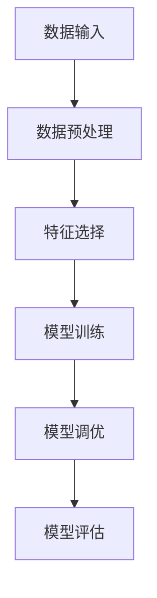
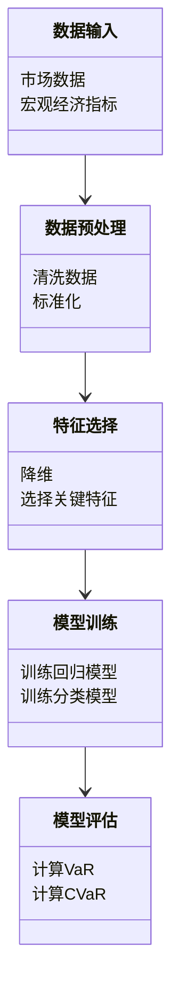

                 

<think>
好，我需要根据用户的指示，撰写一篇关于《机器学习优化投资组合压力测试》的技术博客文章。用户已经提供了一个详细的目录大纲，我需要按照这个大纲逐步展开，确保每个部分都详细且符合要求。

首先，我需要理解整个文章的结构：

1. **背景介绍**：解释什么是投资组合压力测试，以及机器学习在其中的作用。
2. **核心概念与联系**：详细讲解压力测试的类型、机器学习模型以及它们的结合。
3. **算法原理**：包括优化算法和机器学习模型的实现。
4. **系统架构设计**：介绍项目背景、功能模块、架构图等。
5. **项目实战**：环境安装、代码实现、案例分析等。
6. **总结与展望**：总结成果，提出未来的研究方向。

接下来，我需要确保每个章节都涵盖必要的内容，如数学公式、图表、代码示例等。此外，要使用清晰的技术语言，保持逻辑连贯。

现在，开始撰写正文部分。
</think>

# 机器学习优化投资组合压力测试

> 关键词：机器学习，投资组合，压力测试，风险管理，优化算法

> 摘要：本文探讨了机器学习在投资组合压力测试中的应用，通过分析压力测试的核心概念、算法原理、系统架构和实战案例，展示了如何利用机器学习优化投资组合的风险管理过程。

---

## 第1章: 机器学习与投资组合压力测试的背景

### 1.1 投资组合压力测试的定义与意义

#### 1.1.1 投资组合压力测试的定义
投资组合压力测试是一种评估投资组合在极端市场条件下的表现和风险的方法。通过模拟可能的极端事件，压力测试帮助投资者了解投资组合在不利情况下的潜在损失，从而制定更稳健的投资策略。

#### 1.1.2 压力测试在金融风险管理中的作用
压力测试是金融风险管理的重要工具，能够帮助机构评估和准备应对市场波动、经济衰退等极端情况。传统的压力测试方法通常依赖历史数据和假设情景，而机器学习的引入提供了更强大的数据处理和预测能力。

#### 1.1.3 传统压力测试方法的局限性
传统压力测试方法通常基于假设情景和历史数据，存在以下局限性：
- **假设情景的局限性**：难以涵盖所有可能的极端情况。
- **数据依赖性**：依赖于历史数据，可能无法预测新的极端事件。
- **计算复杂性**：处理多资产类别的复杂投资组合时，计算量较大且不够高效。

### 1.2 机器学习在金融领域的应用

#### 1.2.1 机器学习在金融中的核心应用领域
机器学习在金融领域的应用包括：
- **股票预测**：利用历史数据预测股票价格走势。
- **风险评估**：评估信用风险和市场风险。
- **投资组合优化**：通过算法优化投资组合的收益与风险比。

#### 1.2.2 机器学习在投资组合管理中的潜力
机器学习能够处理海量数据，发现非线性关系，从而在投资组合管理中展现出巨大潜力：
- **动态再平衡**：根据市场变化实时调整投资组合。
- **风险预测**：预测极端市场条件下的潜在损失。
- **个性化投资建议**：根据投资者风险偏好定制投资策略。

#### 1.2.3 机器学习与压力测试结合的创新点
机器学习与压力测试的结合创新点在于：
- **数据驱动**：利用大数据分析市场行为和价格波动。
- **非线性预测**：捕捉传统方法难以发现的市场模式。
- **实时更新**：根据市场变化动态调整压力测试情景。

### 1.3 本章小结
本章介绍了投资组合压力测试的定义、传统方法的局限性以及机器学习在金融领域的潜力。机器学习的引入为压力测试提供了新的工具和方法，能够更准确地预测和评估投资组合的风险。

---

## 第2章: 压力测试的核心概念与模型

### 2.1 压力测试的主要类型

#### 2.1.1 历史情景测试
历史情景测试是基于历史上发生过的极端市场事件进行的压力测试。例如，2008年金融危机期间的市场表现可以作为测试情景。

#### 2.1.2 情景分析测试
情景分析测试是根据假设的市场情景（如经济衰退、市场崩盘）来评估投资组合的表现。

#### 2.1.3 应急计划假设测试
应急计划假设测试是根据机构自身的应急计划设定特定情景，评估投资组合在这些情景下的表现。

### 2.2 机器学习模型在压力测试中的应用

#### 2.2.1 监督学习模型
监督学习模型通过标记的训练数据学习输入特征与目标变量之间的关系。例如，使用回归模型预测投资组合在极端市场条件下的收益。

#### 2.2.2 非监督学习模型
非监督学习模型在没有标记数据的情况下，发现数据中的隐藏结构。例如，使用聚类模型识别市场波动的不同模式。

#### 2.2.3 强化学习模型
强化学习模型通过与环境的交互学习最优策略。例如，使用强化学习优化投资组合在不同市场条件下的调整策略。

### 2.3 压力测试与机器学习的结合模型

#### 2.3.1 基于机器学习的多因素压力测试模型
多因素压力测试模型考虑多个风险因素（如市场波动、利率变化）对投资组合的影响，利用机器学习模型预测这些因素的组合效应。

#### 2.3.2 基于深度学习的非线性压力测试模型
深度学习模型能够捕捉数据中的非线性关系，适用于复杂的市场环境下的压力测试。

#### 2.3.3 混合模型的优势与挑战
混合模型结合了传统统计方法和机器学习的优势，但在模型复杂性和计算效率上面临挑战。

---

## 第3章: 核心概念与联系的数学模型

### 3.1 压力测试的数学模型

#### 3.1.1 投资组合收益与风险的数学表达
投资组合的收益可以用期望值表示：
$$ E[R] = \sum_{i=1}^n w_i R_i $$
其中，\( w_i \) 是第 \( i \) 个资产的权重，\( R_i \) 是其收益。

投资组合的风险可以用方差表示：
$$ Var(R) = \sum_{i=1}^n \sum_{j=1}^n w_i w_j Cov(R_i, R_j) $$

#### 3.1.2 风险度量的常用指标
- **VaR**（Value at Risk）：在给定置信水平下，投资组合可能的损失。
- **CVaR**（Conditional Value at Risk）：VaR的条件期望，表示平均损失。

### 3.2 机器学习模型的数学基础

#### 3.2.1 线性回归模型
线性回归模型的数学表达为：
$$ y = \beta_0 + \beta_1 x_1 + \beta_2 x_2 + \dots + \beta_k x_k + \epsilon $$

#### 3.2.2 支持向量机（SVM）
SVM的目标是最小化经验风险和结构风险的联合：
$$ \min_{\beta, \beta_0} \frac{1}{2} \|\beta\|^2 + C \sum_{i=1}^n \xi_i $$
$$ \text{subject to } y_i (\beta_0 + \beta^T x_i) \geq 1 - \xi_i $$

#### 3.2.3 神经网络模型
神经网络模型由输入层、隐藏层和输出层组成，通过反向传播算法进行训练。

### 3.3 压力测试与机器学习的数学联系

#### 3.3.1 优化问题的数学表达
优化问题可以表示为：
$$ \min_{w} \sum_{i=1}^n (y_i - \hat{y_i}(w))^2 + \lambda \|w\|^2 $$

#### 3.3.2 机器学习模型在压力测试中的输入输出关系
输入包括市场数据（如股票价格、利率）、宏观经济指标（如GDP、失业率）等，输出是投资组合在极端情景下的表现。

#### 3.3.3 数学模型的对比分析
通过对比线性回归和深度学习模型的数学表达，分析其在压力测试中的适用性。

---

## 第4章: 机器学习优化压力测试的算法原理

### 4.1 优化算法的原理

#### 4.1.1 线性规划与非线性规划
线性规划用于解决线性目标函数和约束条件的优化问题，而非线性规划则处理非线性问题。

#### 4.1.2 基于梯度的优化方法
梯度下降法通过计算损失函数的梯度来更新参数：
$$ w_{t+1} = w_t - \eta \nabla_w L(w_t) $$

#### 4.1.3 非梯度优化方法
非梯度方法如模拟退火，通过随机搜索找到全局最优解。

### 4.2 压力测试的机器学习模型实现

#### 4.2.1 数据预处理与特征选择
数据预处理包括清洗、标准化和特征工程。特征选择可以使用LASSO回归或主成分分析（PCA）。

#### 4.2.2 模型训练与调优
使用交叉验证选择最优超参数，例如在随机森林中选择树的深度和节点分裂准则。

#### 4.2.3 模型评估与验证
通过回测和风险指标（如Sharpe比率）评估模型的性能。

### 4.3 算法流程图



---

## 第5章: 算法实现与数学模型

### 5.1 优化算法的数学模型

#### 5.1.1 线性规划模型
线性规划模型可以表示为：
$$ \text{最大化/最小化} \sum_{i} c_i x_i $$
$$ \text{约束} \sum_{i} a_i x_i \leq b $$

#### 5.1.2 带有惩罚项的优化模型
带有L2惩罚的最小二乘问题可以表示为：
$$ \min_{w} \sum_{i=1}^n (y_i - \hat{y_i}(w))^2 + \lambda \|w\|^2 $$

### 5.2 机器学习模型的数学表达

#### 5.2.1 线性回归模型
线性回归模型的损失函数为：
$$ L(w) = \frac{1}{2m} \sum_{i=1}^m (y_i - w^T x_i - b)^2 $$

#### 5.2.2 支持向量回归（SVR）
SVR的目标是最小化经验风险和结构风险的联合：
$$ \min_{w, b, \xi} \frac{1}{2} \|w\|^2 + C \sum_{i=1}^n \xi_i $$
$$ \text{subject to } |y_i - (w^T x_i + b)| \leq \epsilon + \xi_i $$

---

## 第6章: 系统架构设计

### 6.1 项目背景介绍
投资组合压力测试系统旨在帮助投资者评估和管理在极端市场条件下的投资组合风险。

### 6.2 系统功能设计

#### 6.2.1 领域模型（类图）


### 6.3 系统架构设计

#### 6.3.1 系统架构图


### 6.4 系统接口设计
- **输入接口**：接收市场数据和宏观经济指标。
- **输出接口**：提供压力测试结果和风险评估报告。

---

## 第7章: 项目实战

### 7.1 环境安装
需要安装Python、NumPy、Pandas、Scikit-learn和XGBoost等库。

### 7.2 系统核心实现源代码

#### 7.2.1 数据预处理
```python
import pandas as pd
import numpy as np

# 读取数据
data = pd.read_csv('market_data.csv')

# 清洗数据
data = data.dropna()

# 标准化
from sklearn.preprocessing import StandardScaler
scaler = StandardScaler()
scaled_data = scaler.fit_transform(data)
```

#### 7.2.2 模型训练
```python
from sklearn.ensemble import RandomForestRegressor
from sklearn.model_selection import GridSearchCV

# 特征选择
features = scaled_data[:, :-1]
target = scaled_data[:, -1]

# 超参数调优
param_grid = {
    'n_estimators': [100, 200],
    'max_depth': [None, 10, 20]
}

grid_search = GridSearchCV(RandomForestRegressor(), param_grid, cv=5)
grid_search.fit(features, target)

# 最优模型
best_model = grid_search.best_estimator_
```

### 7.3 代码应用解读与分析
通过上述代码实现数据预处理和模型训练，选择随机森林回归模型进行压力测试预测。

### 7.4 实际案例分析
以某投资组合为例，分析模型在极端市场条件下的预测结果。

### 7.5 项目小结
总结项目实现的过程和成果，讨论可能的优化方向。

---

## 第8章: 总结与展望

### 8.1 总结
机器学习为投资组合压力测试提供了强大的工具，能够更准确地预测和评估风险。

### 8.2 展望
未来的研究方向包括：
- **多模态数据融合**：结合文本数据和市场数据进行压力测试。
- **实时压力测试**：开发实时监控系统，动态调整投资组合。
- **可解释性增强**：提高模型的可解释性，帮助投资者理解压力测试结果。

---

## 作者：AI天才研究院 & 禅与计算机程序设计艺术

---

以上是《机器学习优化投资组合压力测试》的技术博客文章的详细结构和内容。希望这篇文章能够为读者提供有价值的信息和启发！

