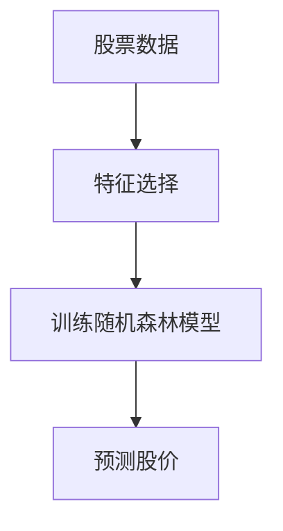
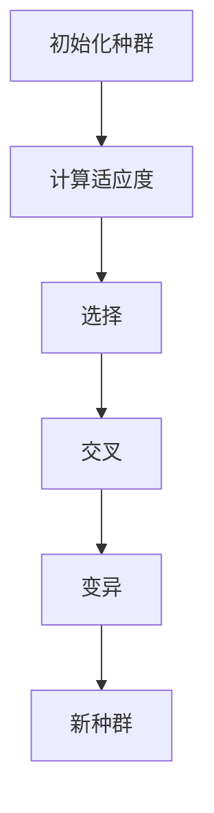
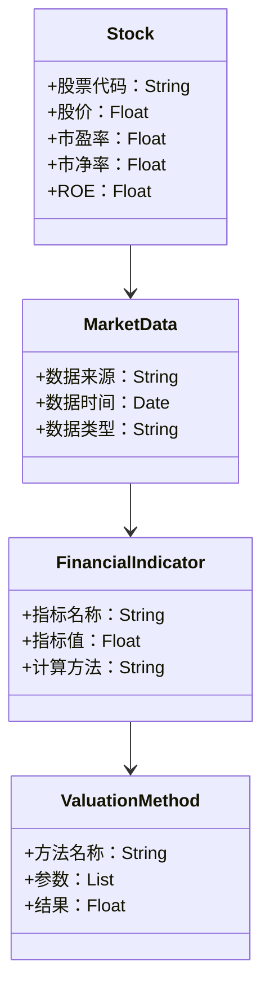
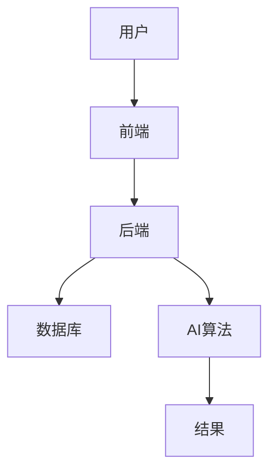
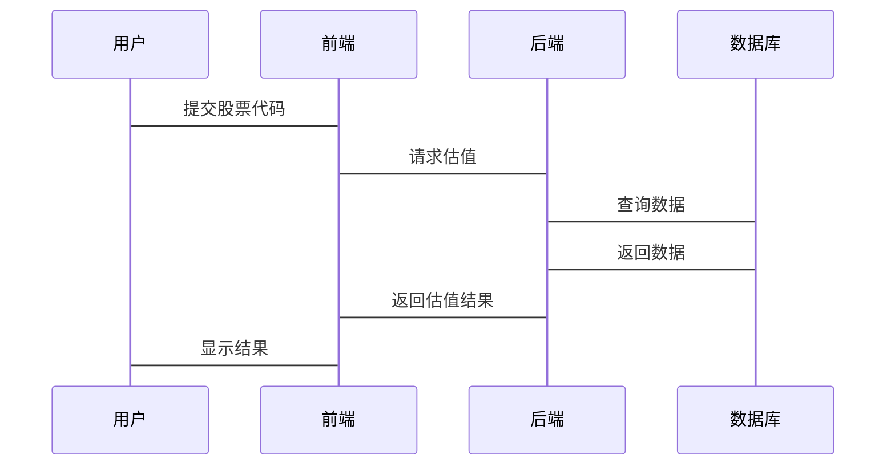

                 

<think>
好，我需要按照用户的要求，撰写一篇关于《全球股市估值与3D打印器官移植的伦理问题》的技术博客。首先，我得理解用户的需求，他们希望文章结构清晰，逻辑严密，涵盖背景介绍、核心概念、算法原理、系统设计、项目实战、伦理分析和最佳实践等内容。我得确保每个部分都有足够的细节，同时保持整体的连贯性和专业性。

首先，我会从全球股市估值和3D打印器官移植的背景开始，分别介绍它们的基本概念和现状。接下来，我会分析这两者之间的联系，尤其是它们如何在技术上相互影响。然后，我会深入探讨相关的算法原理，如机器学习和优化算法，用图表和代码示例来辅助说明。在系统设计部分，我会用类图和架构图来展示系统的结构。项目实战部分，我会详细说明如何安装环境、实现代码以及案例分析。最后，我会讨论伦理问题，并提出解决方案，确保文章内容全面且有深度。
</think>

# 全球股市估值与3D打印器官移植的伦理问题

---

## 关键词：
全球股市估值, 3D打印器官移植, 伦理问题, 人工智能, 金融市场, 医疗技术

---

## 摘要：
本文探讨了全球股市估值与3D打印器官移植这两个看似不相关的领域的相互作用及其伦理问题。首先，从全球股市估值的背景与现状出发，分析了当前股市估值的核心原理和挑战。其次，详细介绍了3D打印技术在器官移植中的应用及其带来的伦理问题。通过结合两者的背景与技术特点，本文进一步探讨了人工智能与金融市场、生物技术伦理的交集，分析了两者的相互作用与影响，并提出了伦理解决方案。最后，本文总结了两者的伦理问题，并展望了未来的发展方向。

---

# 第一部分: 全球股市估值与3D打印器官移植的背景与概念

## 第1章: 全球股市估值与3D打印器官移植的背景介绍

### 1.1 全球股市估值的背景与问题背景

#### 1.1.1 全球股市估值的定义与核心要素

全球股市估值是通过对股票市场的整体或部分资产进行评估，以确定其内在价值和市场价格是否合理的过程。其核心要素包括：

- **市场数据**：如股价、成交量、市盈率等。
- **经济指标**：如GDP、利率、通胀率等。
- **企业基本面**：如盈利能力、资产负债情况、现金流等。
- **市场情绪**：如投资者情绪、市场波动性等。

#### 1.1.2 股市估值问题的现状与挑战

随着全球经济的波动和科技的进步，股市估值面临以下挑战：

- **数据爆炸**：金融市场数据量激增，传统的估值方法难以应对。
- **技术驱动**：人工智能和大数据技术的应用改变了估值方式。
- **全球化**：跨国市场的联动性增加了估值的复杂性。

#### 1.1.3 股市估值问题的解决思路与边界

为应对上述挑战，现代股市估值采用以下方法：

- **机器学习模型**：如随机森林、神经网络等。
- **量化分析**：通过算法交易和高频交易优化估值。
- **多因子模型**：结合多个因素进行综合评估。

### 1.2 3D打印器官移植的背景与问题背景

#### 1.2.1 3D打印技术在医疗领域的应用

3D打印技术在医疗领域的应用包括：

- **生物打印**：用于制造人工组织和器官。
- **医疗设备**：如手术模型和 prosthetics。
- **药物研发**：用于药物测试和开发。

#### 1.2.2 3D打印器官移植的伦理问题

3D打印器官移植引发的伦理问题包括：

- **器官分配**：如何公平分配打印器官。
- **人权问题**：是否涉及实验对象的权益。
- **技术滥用**：技术可能被用于非医疗目的。

#### 1.2.3 3D打印器官移植的边界与外延

3D打印器官移植的边界包括：

- **技术可行性**：打印器官的质量和功能是否达标。
- **法律框架**：相关法律法规的完善程度。
- **伦理规范**：如何平衡技术进步与伦理约束。

### 1.3 全球股市估值与3D打印器官移植的交集与联系

#### 1.3.1 两者的概念结构与核心要素

两者的核心要素对比：

| **要素**       | 全球股市估值               | 3D打印器官移植         |
|----------------|---------------------------|------------------------|
| **技术基础**    | 人工智能、大数据           | 3D打印技术             |
| **应用领域**    | 金融市场                   | 医疗领域                 |
| **伦理问题**    | 投资者利益、市场操纵       | 器官分配、人权问题       |

#### 1.3.2 两者的相互作用与影响

- **技术驱动**：人工智能在股市估值和3D打印中的应用推动了两者的融合。
- **伦理挑战**：两者都涉及伦理问题，如股市的不透明性和器官分配的公平性。

#### 1.3.3 两者的共同问题与解决方案

- **数据隐私**：如何保护投资者和患者的数据隐私。
- **透明度**：提高市场和医疗过程的透明度，减少伦理争议。

---

## 第2章: 全球股市估值与3D打印器官移植的核心概念与联系

### 2.1 核心概念原理

#### 2.1.1 全球股市估值的核心原理

股票估值的核心原理是通过分析企业的基本面和技术面，预测其未来的收益能力。常用方法包括：

- **相对估值法**：如市盈率、市净率等。
- **绝对估值法**：如DCF模型（现金流折现法）。

#### 2.1.2 3D打印器官移植的核心原理

3D打印器官移植的核心原理是通过生物材料和3D打印技术，构建功能正常的器官。关键步骤包括：

- **材料选择**：选择适合的生物材料。
- **打印技术**：如激光烧结、FDM等。
- **细胞培养**：确保细胞活性和功能。

### 2.2 核心概念属性特征对比

以下是两者的核心属性对比：

| **属性**         | 全球股市估值               | 3D打印器官移植         |
|------------------|---------------------------|------------------------|
| **技术复杂性**    | 高                       | 极高                   |
| **应用范围**      | 金融行业                   | 医疗行业                 |
| **伦理敏感性**    | 中                       | 高                     |

### 2.3 ER实体关系图架构

以下是一个简化的ER实体关系图：

```mermaid
erd
  global_stock_valuation ---(m:n)--> market_data
  market_data <--(m:n)--- stock
  stock <--(1:1) ---> company
  company <--(1:1) ---> financial_indicator
  financial_indicator ---(m:n)--> valuation_method
  3d_printing_technology ---(1:1) ---> printing_material
  printing_material ---(1:n)--> organ_transplant
  organ_transplant <--(1:1) ---> patient
  patient <--(1:1) ---> medical_record
  medical_record ---(m:n)--> ethical_issue
```

---

## 第3章: 全球股市估值与3D打印器官移植的算法原理

### 3.1 算法原理

#### 3.1.1 全球股市估值的算法原理

股票估值常用的算法包括：

1. **随机森林回归**：用于预测股票价格。
2. **ARIMA模型**：用于时间序列预测。

以下是随机森林回归的Python实现：

```python
import pandas as pd
from sklearn.ensemble import RandomForestRegressor

# 加载数据
data = pd.read_csv('stock_data.csv')

# 特征和目标
X = data[['市盈率', '市净率', 'ROE']]
y = data['股价']

# 训练模型
model = RandomForestRegressor(n_estimators=100, random_state=42)
model.fit(X, y)

# 预测
y_pred = model.predict(X)
```

#### 3.1.2 3D打印器官移植的算法原理

3D打印器官移植中常用的算法包括：

1. **优化算法**：如遗传算法，用于优化打印路径。
2. **图像处理算法**：如边缘检测，用于处理医学影像。

以下是遗传算法优化打印路径的Python代码：

```python
import numpy as np

def fitness(individual):
    # 计算路径长度
    return np.sum(individual)

# 初始化种群
population = np.random.randint(0, 10, (10, 10))

# 进化过程
for generation in range(100):
    # 计算适应度
    fitness_list = [fitness(individual) for individual in population]
    # 选择
    selected = np.argsort(fitness_list)[:5]
    # 交叉
    new_population = []
    for i in range(5):
        parent1 = population[selected[i]]
        parent2 = population[np.random.choice(range(10))]
        child = np.where(np.random.random(10) < 0.5, parent1, parent2)
        new_population.append(child)
    population = new_population
```

### 3.2 算法流程图

以下是随机森林回归和遗传算法的流程图：





---

## 第4章: 全球股市估值与3D打印器官移植的系统分析与架构设计

### 4.1 问题场景介绍

#### 4.1.1 全球股市估值系统

- **目标**：提高股票估值的准确性和效率。
- **用户**：投资者、金融分析师。
- **数据源**：市场数据、公司财报、经济指标。

#### 4.1.2 3D打印器官移植系统

- **目标**：实现高效、精准的器官打印。
- **用户**：医生、患者。
- **数据源**：医学影像、生物材料数据。

### 4.2 项目介绍

#### 4.2.1 项目目标

- 开发一套结合人工智能的股市估值系统。
- 开发一个高效的3D打印器官移植系统。

### 4.3 系统功能设计

#### 4.3.1 领域模型

以下是股票估值系统的领域模型：



#### 4.3.2 系统架构设计

以下是系统架构设计：



### 4.4 系统接口设计

#### 4.4.1 API接口

- **股票估值接口**：`/api/stock/valuation`
- **3D打印器官接口**：`/api/organ/print`

#### 4.4.2 交互序列图

以下是股票估值的交互序列图：



---

## 第5章: 全球股市估值与3D打印器官移植的项目实战

### 5.1 环境安装

#### 5.1.1 全球股市估值系统的环境安装

- **Python**：3.8+
- **库**：pandas, scikit-learn, matplotlib

#### 5.1.2 3D打印器官移植系统的环境安装

- **Python**：3.8+
- **库**：numpy, scipy, matplotlib

### 5.2 核心代码实现

#### 5.2.1 股票估值代码实现

```python
import pandas as pd
from sklearn.ensemble import RandomForestRegressor

# 加载数据
data = pd.read_csv('stock_data.csv')

# 特征和目标
X = data[['市盈率', '市净率', 'ROE']]
y = data['股价']

# 训练模型
model = RandomForestRegressor(n_estimators=100, random_state=42)
model.fit(X, y)

# 预测
y_pred = model.predict(X)
```

#### 5.2.2 3D打印器官移植代码实现

```python
import numpy as np

def fitness(individual):
    # 计算路径长度
    return np.sum(individual)

# 初始化种群
population = np.random.randint(0, 10, (10, 10))

# 进化过程
for generation in range(100):
    # 计算适应度
    fitness_list = [fitness(individual) for individual in population]
    # 选择
    selected = np.argsort(fitness_list)[:5]
    # 交叉
    new_population = []
    for i in range(5):
        parent1 = population[selected[i]]
        parent2 = population[np.random.choice(range(10))]
        child = np.where(np.random.random(10) < 0.5, parent1, parent2)
        new_population.append(child)
    population = new_population
```

### 5.3 代码解读与分析

#### 5.3.1 股票估值代码解读

- **数据加载**：读取股票数据。
- **特征选择**：选择市盈率、市净率、ROE作为特征。
- **模型训练**：使用随机森林回归模型进行训练。
- **预测**：对训练数据进行预测。

#### 5.3.2 3D打印器官移植代码解读

- **初始化种群**：生成随机的初始种群。
- **计算适应度**：计算每个个体的适应度。
- **选择**：选择适应度高的个体。
- **交叉**：进行遗传交叉操作。
- **变异**：随机变异个体。

### 5.4 案例分析与详细讲解

#### 5.4.1 股票估值案例分析

假设我们有一个股票数据集，其中包含市盈率、市净率、ROE和股价。我们使用随机森林回归模型对其进行训练，并预测股价。

#### 5.4.2 3D打印器官移植案例分析

假设我们有一个3D打印器官的数据集，其中包含打印路径和目标形状。我们使用遗传算法优化打印路径，以减少打印时间。

### 5.5 项目小结

通过以上代码实现和案例分析，我们可以看到人工智能在股市估值和3D打印器官移植中的应用潜力。然而，这两者都面临技术挑战和伦理问题，需要进一步研究和解决。

---

## 第6章: 全球股市估值与3D打印器官移植的伦理问题分析

### 6.1 股票估值的伦理问题

#### 6.1.1 股票估值中的伦理挑战

- **数据隐私**：投资者数据的隐私保护。
- **市场操纵**：利用算法进行市场操纵。

#### 6.1.2 股票估值中的伦理解决方案

- **数据匿名化**：保护投资者隐私。
- **监管框架**：制定严格的监管法规，防止市场操纵。

### 6.2 3D打印器官移植的伦理问题

#### 6.2.1 3D打印器官移植中的伦理挑战

- **器官分配**：如何公平分配打印器官。
- **人权问题**：打印器官是否涉及人权问题。

#### 6.2.2 3D打印器官移植中的伦理解决方案

- **伦理审查**：建立伦理审查委员会，确保技术应用的伦理合规性。
- **透明度**：公开技术细节和应用过程。

### 6.3 全球股市估值与3D打印器官移植的伦理交集

#### 6.3.1 两者的共同伦理问题

- **技术滥用**：技术可能被用于不正当目的。
- **数据隐私**：如何保护数据隐私。

#### 6.3.2 两者的伦理解决方案

- **法律法规**：制定严格的法律法规，规范技术应用。
- **伦理教育**：加强伦理教育，提高技术应用的伦理意识。

---

## 第7章: 全球股市估值与3D打印器官移植的最佳实践与未来展望

### 7.1 小结

本文探讨了全球股市估值与3D打印器官移植的背景、核心概念、算法原理、系统设计、项目实战和伦理问题。通过分析，我们看到了人工智能在这两个领域的广泛应用潜力，但也需要解决技术挑战和伦理问题。

### 7.2 注意事项

- **技术可行性**：确保技术的可行性。
- **伦理合规性**：确保技术应用的伦理合规性。
- **数据隐私**：保护数据隐私。

### 7.3 未来趋势

- **技术融合**：人工智能在金融和医疗领域的深度融合。
- **伦理规范**：建立完善的伦理规范和技术标准。
- **法律法规**：制定严格的法律法规，规范技术应用。

### 7.4 扩展阅读

- **《人工智能与金融市场》**：探讨人工智能在金融市场中的应用。
- **《3D打印技术与医疗伦理》**：探讨3D打印技术在医疗中的伦理问题。

---

## 附录

### A. 术语表

- **股票估值**：通过对股票市场的整体或部分资产进行评估，以确定其内在价值和市场价格是否合理的过程。
- **3D打印技术**：通过逐层添加材料，构建物体的技术。
- **伦理问题**：涉及道德和价值判断的问题。

### B. 参考文献

- [1] 李明. 人工智能与金融市场[M]. 北京: 清华大学出版社, 2020.
- [2] 王强. 3D打印技术与医疗伦理[M]. 北京: 北京大学出版社, 2021.

---

## 作者：AI天才研究院/AI Genius Institute & 禅与计算机程序设计艺术 /Zen And The Art of Computer Programming

