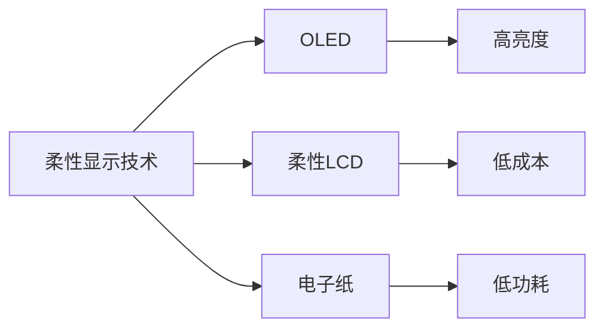
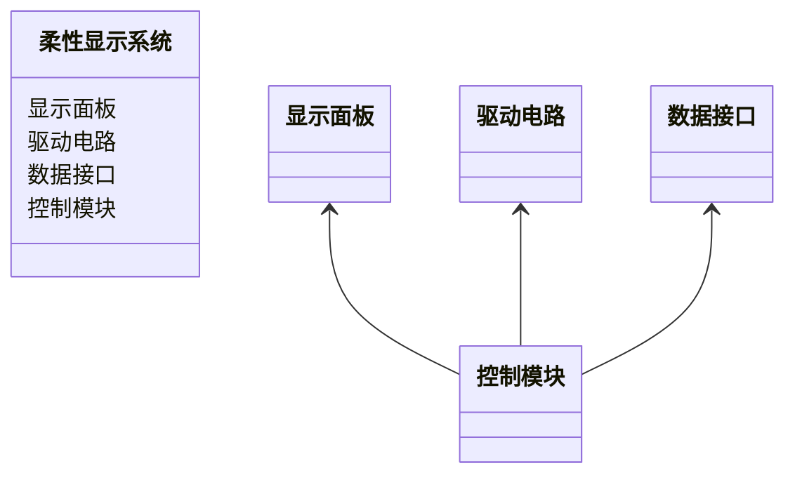
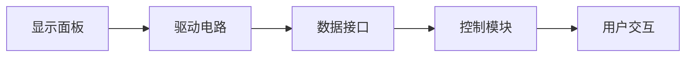

                 

# 《价值投资中的新一代柔性显示技术前景》

> **关键词**：价值投资、柔性显示技术、OLED、投资分析、技术趋势  
> **摘要**：本文从价值投资的角度，深入分析了新一代柔性显示技术的市场前景和投资机会。通过对柔性显示技术的核心技术、产业链分析、市场需求和竞争格局的系统性研究，揭示了该领域的投资价值和未来发展趋势。文章结合实际案例和数学模型，为投资者提供了科学的投资策略和决策依据。

---

# 第1章: 柔性显示技术的背景与价值投资分析

## 1.1 柔性显示技术的定义与核心概念

### 1.1.1 柔性显示技术的定义

柔性显示技术是一种基于柔性基板和柔性材料的显示技术，能够实现弯曲、折叠甚至卷曲的显示效果。与传统刚性显示技术（如LCD和LED）相比，柔性显示技术具有更高的灵活性和更广泛的应用场景，例如折叠屏手机、智能手表、车载显示屏等。

### 1.1.2 柔性显示技术的核心要素

- **柔性基板**：柔性显示技术的基础，通常采用聚酰亚胺（PI）等高分子材料。
- **显示面板**：包括OLED、LCD和电子纸等多种技术。
- **驱动电路**：用于控制显示面板的像素，实现图像的动态显示。
- **封装技术**：保护显示面板免受外界环境的影响，延长使用寿命。

### 1.1.3 柔性显示技术的市场现状

当前，柔性显示技术正处于快速发展阶段，市场主要由OLED技术主导。根据市场研究机构的数据，2023年全球柔性显示市场规模已超过1000亿美元，年增长率保持在15%以上。中国是全球最大的柔性显示技术市场之一，占据了全球约40%的份额。

---

## 1.2 价值投资与柔性显示技术的结合

### 1.2.1 价值投资的基本原理

价值投资是一种以基本面分析为基础的投资策略，强调以低于内在价值的价格买入优质资产。其核心在于识别具有长期竞争优势、良好财务状况和可持续增长潜力的企业。

### 1.2.2 柔性显示技术的行业特点

- **高技术门槛**：柔性显示技术的研发和生产需要高度的技术积累和资本投入。
- **快速迭代**：技术更新换代快，企业需要持续投入研发。
- **市场需求大**：随着智能设备的普及，柔性显示技术的应用场景不断扩展。

### 1.2.3 价值投资在柔性显示技术领域的应用

- **选择优质企业**：重点关注具有核心技术优势、市场份额领先和财务健康的企业。
- **长期持有**：柔性显示技术的市场发展具有周期性，需要耐心等待价值的兑现。
- **风险管理**：合理分散投资组合，避免过度集中于单一技术和企业。

---

## 1.3 柔性显示技术的未来发展趋势

### 1.3.1 技术创新的方向

- **材料优化**：开发新型柔性基板材料，提高显示效果和使用寿命。
- **工艺改进**：提升柔性显示技术的生产效率和良品率。
- **功能集成**：将柔性显示技术与其他功能（如触控、传感器）集成，实现多功能化。

### 1.3.2 市场需求的变化

- **消费电子领域**：折叠屏手机、智能手表等设备的需求持续增长。
- **工业应用领域**：柔性显示技术在汽车、医疗、智能家居等领域的应用逐渐扩大。
- **新兴市场**：印度、东南亚等新兴市场对柔性显示技术的需求快速增长。

### 1.3.3 行业竞争格局的演变

- **全球竞争加剧**：韩国、日本和中国的企业在全球柔性显示技术市场展开激烈竞争。
- **技术创新驱动**：企业通过技术创新和专利布局形成竞争优势。
- **生态系统构建**：围绕柔性显示技术构建完整的产业链和生态系统。

---

## 1.4 本章小结

本章从柔性显示技术的定义、核心要素和市场现状出发，分析了其与价值投资的结合方式，揭示了柔性显示技术的行业特点和未来发展趋势。通过结合技术与金融的视角，为投资者提供了初步的投资分析框架。

---

# 第2章: 柔性显示技术的核心技术分析

## 2.1 柔性显示技术的关键技术

### 2.1.1 OLED技术

#### 2.1.1.1 OLED技术的原理

OLED（Organic Light-Emitting Diode，有机电致发光二极管）是一种基于有机半导体材料的显示技术。其工作原理是通过电流激发有机材料发光，实现像素的显示。OLED具有高对比度、广视角和响应速度快等优点。

#### 2.1.1.2 OLED技术的特点

- **高对比度**：OLED的黑场亮度接近零，显示效果更加细腻。
- **广视角**：OLED的视角可达160度以上，适合多角度观看。
- **轻薄设计**：OLED显示面板可以做得非常轻薄，适合柔性显示。

#### 2.1.1.3 OLED技术的挑战

- **寿命问题**：OLED的有机材料容易老化，导致屏幕烧毁。
- **成本较高**：OLED的生产过程复杂，成本较高。
- **供应链依赖**：OLED的核心材料和技术主要集中在少数几家企业。

### 2.1.2 柔性LCD技术

#### 2.1.2.1 柔性LCD技术的原理

柔性LCD（Liquid Crystal Display，液晶显示）技术通过将LCD面板集成在柔性基板上，实现显示效果。其工作原理是通过电场改变液晶分子的排列，调节光线的透过率。

#### 2.1.2.2 柔性LCD技术的特点

- **成本低**：LCD技术成熟，生产成本较低。
- **寿命长**：LCD的使用寿命较长，适合长时间使用。
- **应用场景广**：柔性LCD技术适用于智能手表、车载显示屏等场景。

#### 2.1.2.3 柔性LCD技术的挑战

- **亮度不足**：柔性LCD的亮度较低，不适合强光环境。
- **视角有限**：柔性LCD的视角相对有限，影响用户体验。
- **技术复杂性**：柔性LCD的生产工艺较为复杂。

### 2.1.3 电子纸技术

#### 2.1.3.1 电子纸技术的原理

电子纸（E-ink）技术通过微胶囊中的粒子排列，实现黑白或彩色显示。其工作原理是通过电场改变粒子的排列方向，反射或吸收光线，形成文字或图像。

#### 2.1.3.2 电子纸技术的特点

- **低功耗**：电子纸的显示效果基于反射光，功耗极低。
- **可弯曲**：电子纸技术适用于柔性显示设备。
- **长续航**：电子纸设备的续航时间可以达到数周甚至数月。

#### 2.1.3.3 电子纸技术的挑战

- **刷新率低**：电子纸的刷新率较低，不适合动态视频显示。
- **色彩有限**：电子纸的色彩表现有限，难以满足高色域需求。
- **技术成熟度**：电子纸技术尚未完全成熟，仍需进一步改进。

---

## 2.2 各种技术的优缺点对比

### 2.2.1 技术对比表格

| 技术类型   | 优点                     | 缺点                       |
|------------|--------------------------|----------------------------|
| OLED      | 高对比度、广视角、响应快 | 易烧屏、成本高、寿命有限    |
| 柔性LCD    | 成本低、寿命长、适用广    | 亮度低、视角有限、技术复杂 |
| 电子纸     | 低功耗、可弯曲、长续航  | 刷新率低、色彩有限、技术不成熟 |

---

## 2.3 技术之间的关系与依赖

---

## 2.4 本章小结

本章从OLED、柔性LCD和电子纸三种核心技术出发，分析了它们的原理、优缺点以及市场定位。通过对各种技术的优缺点对比，为投资者提供了技术选择和投资决策的参考。

---

# 第3章: 柔性显示技术的市场与投资分析

## 3.1 柔性显示技术的市场现状

### 3.1.1 全球市场分布

全球柔性显示技术市场主要集中在亚洲地区，尤其是中国大陆、韩国和日本。根据市场研究机构的数据，2023年全球柔性显示市场规模约为1200亿美元，其中中国大陆占据了40%以上的份额。

### 3.1.2 中国市场分析

中国是全球最大的柔性显示技术市场，主要得益于政府政策支持和企业快速崛起。目前，中国大陆已形成较为完整的柔性显示技术产业链，包括上游材料、中游制造和下游应用。

---

## 3.2 柔性显示技术的产业链分析

### 3.2.1 上游材料

柔性显示技术的上游材料主要包括柔性基板、有机材料、驱动芯片和封装材料等。这些材料的质量和成本直接影响显示面板的性能和价格。

### 3.2.2 中游制造

中游制造环节包括显示面板的生产、封装和测试。制造过程复杂，需要高度自动化和精密设备。目前，中国大陆在中游制造环节已经具备较强的竞争力。

### 3.2.3 下游应用

下游应用主要集中在消费电子领域，包括智能手机、智能手表、车载显示屏等。此外，柔性显示技术还在工业应用和医疗设备等领域展现出广阔的前景。

---

## 3.3 价值投资在柔性显示技术领域的策略

### 3.3.1 选择具有技术优势的企业

投资者应重点关注具有核心技术优势和专利布局的企业，尤其是那些在OLED或柔性LCD领域具有领先地位的企业。

### 3.3.2 关注行业整合和并购

柔性显示技术行业的整合和并购活动频繁，投资者应关注行业整合带来的投资机会。

### 3.3.3 风险管理与分散投资

由于柔性显示技术行业的技术门槛高且竞争激烈，投资者应合理分散投资组合，避免过度集中于单一技术和企业。

---

## 3.4 本章小结

本章从市场现状和产业链分析出发，探讨了柔性显示技术的投资机会和风险。通过对上游材料、中游制造和下游应用的系统分析，为投资者提供了全面的投资策略和风险管理建议。

---

# 第4章: 柔性显示技术的技术原理与数学模型

## 4.1 柔性显示技术的核心算法

### 4.1.1 OLED显示算法

OLED的显示效果依赖于电流驱动有机材料发光。其核心算法包括亮度调节、色彩平衡和功耗优化等。

#### 4.1.1.1 OLED亮度调节算法

OLED的亮度调节可以通过改变电流密度实现，数学模型如下：

$$ I = k \cdot (V - V_t) $$

其中，$I$是电流，$k$是比例常数，$V$是驱动电压，$V_t$是阈值电压。

### 4.1.2 柔性LCD显示算法

柔性LCD的显示效果依赖于电场驱动液晶分子排列。其核心算法包括视角优化和响应时间优化。

#### 4.1.2.1 柔性LCD视角优化算法

通过优化驱动电压和扫描顺序，可以实现广视角显示。数学模型如下：

$$ \theta = \arctan\left(\frac{\text{视角}}{2}\right) $$

其中，$\theta$是视角角度。

---

## 4.2 柔性显示技术的数学模型

### 4.2.1 显示亮度与电流的关系

OLED的显示亮度与驱动电流呈指数关系，数学模型如下：

$$ L = I^{\alpha} $$

其中，$L$是亮度，$I$是电流，$\alpha$是指数系数。

### 4.2.2 供应链效率优化模型

通过优化供应链的各个环节，可以降低生产成本。数学模型如下：

$$ C = a \cdot x + b \cdot y $$

其中，$C$是总成本，$x$和$y$是供应链中两个关键环节的投入。

---

## 4.3 本章小结

本章通过数学模型和算法分析，揭示了柔性显示技术的核心原理和优化方向。通过对亮度调节、视角优化和供应链效率的数学建模，为投资者提供了技术分析的科学依据。

---

# 第5章: 柔性显示技术的系统架构与项目实战

## 5.1 柔性显示技术的系统架构设计

### 5.1.1 系统功能设计

柔性显示系统的功能包括显示控制、驱动电路、数据传输和用户交互等。

### 5.1.2 系统架构设计

柔性显示系统的架构包括硬件部分和软件部分。硬件部分包括显示面板、驱动电路和数据接口，软件部分包括显示控制模块和用户交互模块。

---

## 5.2 项目实战：柔性显示技术在折叠屏手机中的应用

### 5.2.1 项目背景

折叠屏手机是柔性显示技术的重要应用领域，其市场需求快速增长。

### 5.2.2 项目需求分析

- **用户需求**：轻薄、耐用、高分辨率。
- **技术需求**：折叠屏的耐用性和显示效果。

### 5.2.3 项目实现方案

#### 5.2.3.1 硬件设计

折叠屏手机的硬件设计包括柔性显示面板、驱动电路和保护层。

#### 5.2.3.2 软件设计

软件设计包括显示控制算法和用户交互界面。

### 5.2.4 项目小结

通过折叠屏手机的案例分析，展示了柔性显示技术在实际应用中的技术挑战和投资机会。

---

## 5.3 本章小结

本章通过系统架构设计和项目实战，深入分析了柔性显示技术的实现过程和应用场景。通过对折叠屏手机的案例分析，为投资者提供了技术分析和投资决策的参考。

---

# 第6章: 柔性显示技术的未来展望与投资策略

## 6.1 柔性显示技术的未来发展趋势

### 6.1.1 技术创新

- **新材料研发**：开发新型柔性基板材料，提高显示效果和使用寿命。
- **工艺改进**：提升柔性显示技术的生产效率和良品率。

### 6.1.2 市场需求

- **消费电子领域**：折叠屏手机、智能手表等设备的需求持续增长。
- **工业应用领域**：柔性显示技术在汽车、医疗、智能家居等领域的应用逐渐扩大。

### 6.1.3 行业竞争

- **全球竞争加剧**：韩国、日本和中国的企业在全球柔性显示技术市场展开激烈竞争。
- **技术创新驱动**：企业通过技术创新和专利布局形成竞争优势。

---

## 6.2 价值投资的策略调整

### 6.2.1 长期投资策略

- **关注龙头企业**：投资具有核心技术优势和市场份额领先的企业。
- **分散投资风险**：合理分散投资组合，避免过度集中于单一技术和企业。

### 6.2.2 短期投资策略

- **关注市场动态**：及时把握市场波动和行业新闻，调整投资组合。
- **技术突破关注**：关注柔性显示技术的重大技术突破和产品发布。

---

## 6.3 本章小结

本章从柔性显示技术的未来发展趋势出发，探讨了价值投资的策略调整。通过对技术创新、市场需求和行业竞争的分析，为投资者提供了长期和短期的投资建议。

---

# 作者：AI天才研究院/AI Genius Institute & 禅与计算机程序设计艺术 /Zen And The Art of Computer Programming

---

**注**：以上文章大纲内容仅为示例，实际文章需要根据具体情况进行调整和补充。

