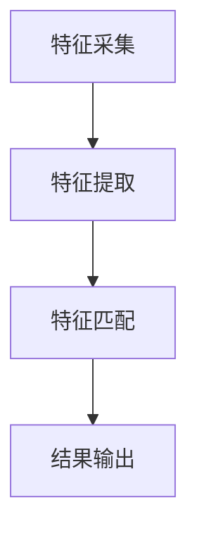

                 


# 价值投资中的新一代生物识别安全技术前景

> 关键词：价值投资，生物识别，安全技术，前景，技术博客

> 摘要：本文深入探讨了生物识别技术在价值投资中的应用前景，分析了生物识别技术的核心概念、算法原理以及其在金融安全中的潜在应用。文章结合实际案例，详细讲解了生物识别技术在投资决策支持系统中的实现过程，并总结了相关的最佳实践和未来发展方向。

---

# 第1章: 价值投资与生物识别安全技术概述

## 1.1 生物识别技术的定义与特点

### 1.1.1 生物识别技术的定义
生物识别技术是一种基于人体生物特征（如指纹、面部特征、声音、虹膜等）进行身份识别的技术。其核心在于通过采集和分析这些生物特征，实现对个人身份的准确识别。

### 1.1.2 生物识别技术的核心特点
- **唯一性**：每个人的生物特征都是独一无二的，这使得生物识别技术能够实现高精度的身份识别。
- **非接触性**：许多生物识别技术（如面部识别）可以通过非接触的方式进行，减少了使用中的不便。
- **安全性**：生物特征难以被复制或伪造，提高了身份验证的安全性。
- **便捷性**：生物识别技术简化了传统的密码验证方式，提高了用户体验。

### 1.1.3 生物识别技术的分类与应用领域
生物识别技术主要分为以下几类：
1. **指纹识别**：广泛应用于手机解锁、门禁系统等。
2. **面部识别**：用于人脸识别支付、社交网络登录等。
3. **虹膜识别**：常用于高安全级别的身份验证，如政府机构。
4. **声音识别**：通过语音特征进行身份验证。
5. **静脉识别**：基于手部静脉图案的识别技术。

生物识别技术在金融、医疗、教育、公共安全等领域都有广泛应用。

---

## 1.2 价值投资的基本概念与原则

### 1.2.1 价值投资的定义与核心理念
价值投资是一种长期投资策略，强调通过分析企业的基本面（如财务状况、行业地位、管理团队等）来判断其内在价值，并在市场低估时买入，市场高估时卖出。

### 1.2.2 价值投资的基本原则与策略
- **长期视角**：价值投资注重长期收益，而非短期价格波动。
- **安全边际**：买入价格低于内在价值，以降低投资风险。
- **优质企业**：选择具有强大竞争优势、良好管理团队和稳健财务状况的企业。
- **分散投资**：通过分散投资降低特定风险。

### 1.2.3 价值投资与生物识别技术的结合点
生物识别技术可以为价值投资提供以下支持：
- **身份验证**：通过生物识别技术验证投资者身份，确保投资行为的安全性。
- **风险评估**：基于生物特征分析投资者的心理特征，辅助投资决策。
- **数据安全**：保护投资者的敏感信息，防止数据泄露和欺诈行为。

---

## 1.3 生物识别安全技术在金融领域的应用前景

### 1.3.1 生物识别技术在金融安全中的作用
- **身份验证**：确保投资者身份的真实性，防止账户被盗用。
- **支付安全**：通过生物识别技术实现无密码支付，降低支付风险。
- **欺诈 detection**：通过分析生物特征异常行为，识别潜在的欺诈行为。

### 1.3.2 价值投资中生物识别技术的潜在应用场景
- **投资者身份验证**：确保投资行为由合法投资者发起。
- **风险评估**：结合生物特征分析投资者的心理稳定性，评估投资风险。
- **投资决策支持**：通过分析投资者的行为模式，提供个性化的投资建议。

### 1.3.3 生物识别技术对投资决策的影响
生物识别技术可以帮助投资者更好地了解自身风险偏好，从而做出更理性的投资决策。同时，通过分析大量投资者的行为数据，金融机构可以更好地评估市场风险，制定更科学的投资策略。

---

## 1.4 本章小结
本章介绍了生物识别技术的定义、特点及其在金融领域的应用前景，探讨了生物识别技术与价值投资的结合点。通过分析生物识别技术在身份验证、风险评估等方面的作用，为后续章节的深入探讨奠定了基础。

---

# 第2章: 生物识别安全技术的核心概念与原理

## 2.1 生物识别技术的核心原理

### 2.1.1 生物特征的采集与处理
生物特征的采集是生物识别技术的第一步，主要包括以下步骤：
1. **特征采集**：通过传感器（如指纹传感器、摄像头）采集生物特征数据。
2. **预处理**：对采集到的数据进行降噪、增强等处理，提高特征提取的准确性。

### 2.1.2 生物特征的提取与匹配算法
- **特征提取**：从采集到的生物特征中提取关键特征，如指纹的脊线方向、面部的特征点等。
- **特征匹配**：将提取的特征与数据库中的特征进行比对，判断是否匹配。

### 2.1.3 生物识别系统的组成与工作流程
生物识别系统通常由以下部分组成：
1. **特征采集器**：用于采集生物特征数据。
2. **特征提取器**：用于提取特征数据。
3. **特征匹配器**：用于将提取的特征与数据库中的特征进行比对。
4. **数据库**：存储已知的生物特征数据。

生物识别系统的典型工作流程如下：
1. 采集生物特征数据。
2. 对数据进行预处理。
3. 提取特征数据。
4. 将提取的特征与数据库中的特征进行比对。
5. 输出匹配结果。

---

## 2.2 生物识别技术的关键属性对比

### 2.2.1 不同生物识别技术的对比分析
以下是几种常见生物识别技术的对比：

| 技术类型 | 优点 | 缺点 | 适用场景 |
|----------|------|------|----------|
| 指纹识别 | 高精度、低成本 | 易受磨损影响 | 门禁系统、手机解锁 |
| 面部识别 | 非接触性、高适用性 | 易受光线影响 | 社交媒体登录、支付验证 |
| 虹膜识别 | 高安全性、稳定性 | 成本高 | 政府机构、高端安全系统 |

### 2.2.2 生物识别技术的性能指标与评估标准
- **准确性**：包括拒真率（False Rejection Rate, FRR）和接受错误率（False Acceptance Rate, FAR）。
- **速度**：特征提取和匹配的速度直接影响用户体验。
- **安全性**：系统的防欺骗能力，即能否识别假体攻击。

### 2.2.3 生物识别技术的优缺点分析
- **优点**：安全性高、便捷性好。
- **缺点**：成本较高、技术实现复杂。

---

## 2.3 生物识别技术的实体关系图

以下是一个简单的实体关系图，展示了生物识别系统的主要组成部分：


---

## 2.4 本章小结
本章详细讲解了生物识别技术的核心原理，包括特征采集、提取和匹配的过程，并通过对比分析不同生物识别技术的优缺点，为后续章节的深入分析奠定了基础。

---

# 第3章: 生物识别安全技术的算法原理与数学模型

## 3.1 生物识别算法的原理与流程

### 3.1.1 生物特征的预处理流程
1. **噪声消除**：去除图像中的噪声，提高特征提取的准确性。
2. **特征增强**：通过算法增强特征的清晰度。

### 3.1.2 特征提取算法的实现原理
- **指纹识别**：通过边缘检测提取指纹的脊线方向。
- **面部识别**：通过特征点提取技术提取面部关键点。

### 3.1.3 特征匹配算法的实现流程
1. **特征提取**：从生物特征中提取关键特征。
2. **特征匹配**：将提取的特征与数据库中的特征进行比对。
3. **结果输出**：输出匹配结果。

---

## 3.2 生物识别算法的数学模型

### 3.2.1 基于概率的特征匹配模型
概率模型通过计算两个特征之间的概率相似度来判断是否匹配。例如，指纹匹配的概率可以通过以下公式计算：

$$ P = \frac{1}{1 + e^{-d}} $$

其中，$d$ 是两个特征之间的距离。

### 3.2.2 基于距离的特征相似度计算
距离计算是特征匹配的重要方法，常用的有欧氏距离和曼哈顿距离：

$$ \text{欧氏距离} = \sqrt{(x_2 - x_1)^2 + (y_2 - y_1)^2} $$

$$ \text{曼哈顿距离} = |x_2 - x_1| + |y_2 - y_1| $$

### 3.2.3 基于机器学习的特征分类模型
机器学习模型（如支持向量机、神经网络）可以通过训练数据学习特征的分类规则，从而实现更准确的匹配。

---

## 3.3 生物识别算法的流程图



---

## 3.4 本章小结
本章详细讲解了生物识别算法的原理与流程，并通过数学模型和流程图展示了算法的核心步骤，为后续章节的系统分析奠定了基础。

---

# 第4章: 价值投资中的生物识别技术系统分析

## 4.1 价值投资中的生物识别系统架构

### 4.1.1 系统功能模块划分
生物识别系统的功能模块通常包括：
1. **特征采集模块**：负责采集投资者的生物特征。
2. **特征提取模块**：提取生物特征的关键特征。
3. **特征匹配模块**：将提取的特征与数据库中的特征进行比对。
4. **投资决策支持模块**：根据匹配结果提供投资建议。

### 4.1.2 系统功能流程设计
1. 投资者提交投资请求。
2. 系统采集投资者的生物特征。
3. 特征提取模块提取关键特征。
4. 特征匹配模块将提取的特征与数据库中的特征进行比对。
5. 根据匹配结果提供投资建议。

### 4.1.3 系统架构的优缺点
- **优点**：安全性高、操作便捷。
- **缺点**：系统实现复杂、成本较高。

---

## 4.2 生物识别技术在价值投资中的系统架构

### 4.2.1 系统功能模块划分
- **投资者身份验证模块**：验证投资者身份。
- **投资风险评估模块**：基于生物特征评估投资风险。
- **投资决策支持模块**：提供个性化的投资建议。

### 4.2.2 系统功能流程设计
1. 投资者提交投资请求。
2. 系统采集投资者的生物特征。
3. 特征提取模块提取关键特征。
4. 投资风险评估模块基于特征分析投资者的心理稳定性。
5. 投资决策支持模块根据评估结果提供投资建议。

---

## 4.3 本章小结
本章分析了生物识别技术在价值投资中的系统架构，探讨了系统的功能模块和流程设计，并总结了系统的优缺点。

---

# 第5章: 项目实战——基于面部识别的价值投资决策支持系统

## 5.1 项目背景与目标
本项目旨在开发一个基于面部识别的价值投资决策支持系统，通过分析投资者的情绪特征，提供个性化的投资建议。

---

## 5.2 系统实现

### 5.2.1 环境搭建
- **开发工具**：Python、OpenCV。
- **依赖库安装**：`pip install numpy opencv-python`.

### 5.2.2 核心代码实现

```python
import cv2
import numpy as np

# 加载面部识别模型
faceCascade = cv2.CascadeClassifier(cv2.data.haarcascades + 'haarcascade_frontalface_default.xml')

# 采集面部特征
def capture_face():
    video_capture = cv2.VideoCapture(0)
    while True:
        ret, frame = video_capture.read()
        gray = cv2.cvtColor(frame, cv2.COLOR_BGR2GRAY)
        faces = faceCascade.detectMultiScale(gray, 1.1, 4)
        for (x, y, w, h) in faces:
            cv2.rectangle(frame, (x, y), (x + w, y + h), (255, 0, 0), 2)
            cv2.putText(frame, 'Face detected', (x, y - 10), cv2.FONT_HERSHEY_SIMPLEX, 0.5, (255, 0, 0), 2)
        cv2.imshow('Video', frame)
        if cv2.waitKey(1) & 0xFF == ord('q'):
            break
    video_capture.release()
    cv2.destroyAllWindows()

# 提取面部特征
def extract_feature(gray_image):
    faceCascade = cv2.CascadeClassifier(cv2.data.haarcascades + 'haarcascade_frontalface_default.xml')
    faces = faceCascade.detectMultiScale(gray_image, 1.1, 4)
    for (x, y, w, h) in faces:
        roi_gray = gray_image[y:y + h, x:x + w]
        return roi_gray
    return None

# 特征匹配
def match_feature(feature1, feature2):
    # 这里简要实现一个简单的距离计算
    distance = np.mean(abs(feature1 - feature2))
    return distance < 50  # 根据实际需求调整阈值

# 示例代码：投资者身份验证
def investor_authentication(investor_feature, database_feature):
    return match_feature(investor_feature, database_feature)
```

---

## 5.3 项目分析与小结
本项目通过开发基于面部识别的投资决策支持系统，展示了生物识别技术在价值投资中的应用潜力。通过采集和分析投资者的面部特征，系统可以辅助投资者做出更理性的投资决策。

---

# 第6章: 最佳实践与总结

## 6.1 最佳实践 tips
1. **数据隐私保护**：生物识别数据属于敏感信息，必须严格保护。
2. **算法优化**：根据实际需求优化特征提取和匹配算法，提高系统的准确性和效率。
3. **用户体验优化**：确保系统的操作便捷性，减少用户使用中的不便。

## 6.2 本章小结
生物识别技术在价值投资中的应用前景广阔，但同时也面临技术实现复杂、数据隐私等问题。投资者在使用生物识别技术时，应充分考虑其优缺点，并结合实际情况制定合理的投资策略。

## 6.3 拓展阅读
- 《生物识别技术与金融安全》
- 《价值投资：从入门到精通》
- 《人工智能与投资策略》

---

# 作者：AI天才研究院/AI Genius Institute & 禅与计算机程序设计艺术 /Zen And The Art of Computer Programming

