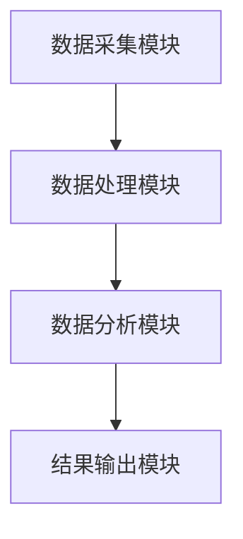
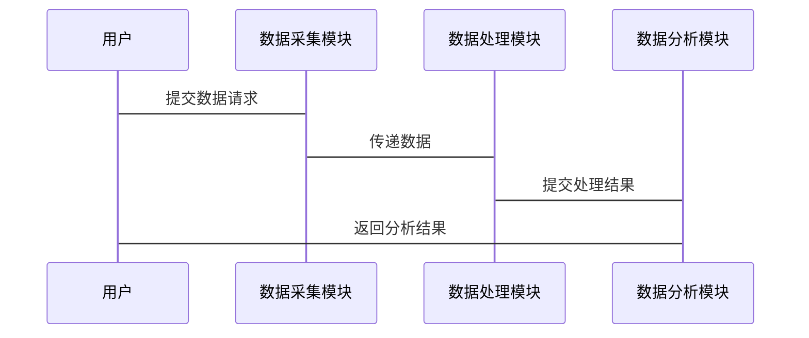

                 


# 价值投资中的新型高效光学计算材料技术

> 关键词：光学计算材料，价值投资，数据处理，算法优化，系统架构

> 摘要：本文探讨了新型高效光学计算材料技术在价值投资中的应用，从背景介绍、核心原理到系统架构设计，再到项目实战，全面分析了光学计算材料技术在价值投资中的潜力和实现路径。文章结合理论与实践，通过详细的数学公式、算法流程图和系统架构图，深入剖析了光学计算材料技术在价值投资中的优势和应用场景。

---

## 第一部分: 价值投资中的新型高效光学计算材料技术概述

### 第1章: 光学计算材料技术的基本概念

#### 1.1 光学计算材料的定义与特点
##### 1.1.1 光学计算材料的定义
光学计算材料是一种利用光的物理特性进行数据处理和计算的新型材料。与传统电子计算材料不同，光学计算材料通过光的传播、干涉和散射等特性，实现信息的高效传递和处理。

##### 1.1.2 光学计算材料的核心特点
光学计算材料具有以下核心特点：
- **高速性**：光速远高于电子速度，能够在极短时间内完成数据处理。
- **并行性**：光的传播是并行的，能够同时处理大量数据。
- **低能耗**：光学计算过程中能量损耗较低，具有较高的能效比。

##### 1.1.3 光学计算材料与传统计算材料的区别
传统的电子计算材料依赖电子的运动进行信息处理，而光学计算材料则利用光的传播特性。两者的区别主要体现在数据处理速度、能耗和并行性上。

#### 1.2 价值投资的基本概念
##### 1.2.1 价值投资的定义
价值投资是一种以企业的内在价值为导向的投资策略，强调通过分析企业的财务状况、市场地位和竞争优势，寻找被市场低估的投资标的。

##### 1.2.2 价值投资的核心原则
价值投资的核心原则包括：
- **安全边际**：以低于内在价值的价格买入。
- **长期视角**：关注企业的长期盈利能力。
- **精选个股**：通过深入研究选择优质企业。

##### 1.2.3 价值投资与传统投资的区别
与传统投资相比，价值投资更加注重企业的基本面分析，强调长期持有的策略，而传统投资可能更关注短期价格波动。

#### 1.3 光学计算材料在价值投资中的应用潜力
##### 1.3.1 光学计算材料技术的现状
光学计算材料技术目前仍处于研究和实验阶段，但在数据处理和计算效率方面展现出巨大潜力。

##### 1.3.2 价值投资中的数据处理需求
价值投资需要处理大量财务数据、市场数据和公司基本面信息，对数据处理的速度和准确性有较高要求。

##### 1.3.3 光学计算材料技术如何满足价值投资的需求
光学计算材料技术能够高效处理海量数据，为价值投资提供实时、准确的分析支持。

---

### 第2章: 光学计算材料技术的核心原理

#### 2.1 光学计算材料的基本原理
##### 2.1.1 光学计算的基本原理
光学计算基于光的传播特性，通过光的干涉、折射和散射等现象实现数据的并行处理。

##### 2.1.2 光学计算材料的物理特性
光学计算材料通常具有特定的光学性质，如高折射率、低吸收率等，能够有效支持光的传播和计算。

##### 2.1.3 光学计算材料的数学模型
光学计算材料的数学模型可以通过以下公式表示：
$$
I = k \cdot |E|^2
$$
其中，$I$ 表示光强度，$E$ 表示电场强度，$k$ 为比例常数。

#### 2.2 光学计算材料的数学模型
##### 2.2.1 光学计算材料的数学表达式
光学计算材料的数学模型可以表示为：
$$
f(x) = \sum_{i=1}^{n} a_i x_i + b
$$
其中，$a_i$ 为系数，$x_i$ 为输入变量，$b$ 为常数项。

##### 2.2.2 光学计算材料的算法流程
光学计算材料的算法流程可以通过以下步骤实现：
1. 数据输入。
2. 光学变换。
3. 数据处理。
4. 结果输出。

##### 2.2.3 光学计算材料的性能评估指标
光学计算材料的性能可以通过以下指标进行评估：
- 处理速度。
- 能耗效率。
- 处理精度。

#### 2.3 光学计算材料的优化与改进
##### 2.3.1 光学计算材料的优化方法
通过优化材料的光学特性，可以提升光学计算材料的处理效率。

##### 2.3.2 光学计算材料的性能提升策略
采用多层结构设计和优化算法，能够进一步提高光学计算材料的性能。

##### 2.3.3 光学计算材料的未来发展方向
未来，光学计算材料可能在量子计算和人工智能领域发挥更大的作用。

---

### 第3章: 价值投资中的数据处理与分析

#### 3.1 价值投资中的数据来源
##### 3.1.1 财务数据
包括收入、利润、资产负债等财务指标。

##### 3.1.2 市场数据
包括股票价格、成交量、市场指数等市场信息。

##### 3.1.3 公司基本面数据
包括公司治理、管理团队、竞争优势等基本面信息。

#### 3.2 数据处理与清洗
##### 3.2.1 数据清洗的必要性
数据清洗是确保数据质量的重要步骤，能够去除噪声数据和冗余信息。

##### 3.2.2 数据清洗的常用方法
常用方法包括：
- 删除重复数据。
- 填补缺失值。
- 标准化数据。

##### 3.2.3 数据清洗的实现步骤
数据清洗的实现步骤如下：
1. 数据导入。
2. 数据预处理。
3. 数据清洗。

#### 3.3 数据分析与建模
##### 3.3.1 数据分析的基本方法
包括描述性分析、诊断性分析和预测性分析。

##### 3.3.2 数据建模的常用算法
常用的算法包括线性回归、决策树和神经网络等。

##### 3.3.3 数据建模的实现步骤
数据建模的实现步骤如下：
1. 数据分割。
2. 模型训练。
3. 模型评估。

---

### 第4章: 光学计算材料技术在价值投资中的应用

#### 4.1 光学计算材料技术在价值投资中的优势
##### 4.1.1 高效性
光学计算材料能够快速处理大量数据，显著提升价值投资的效率。

##### 4.1.2 准确性
光学计算材料通过并行计算和高效的数据处理，能够提高分析的准确性。

##### 4.1.3 实时性
光学计算材料支持实时数据处理，能够满足价值投资对实时性的要求。

#### 4.2 光学计算材料技术在价值投资中的具体应用
##### 4.2.1 财务数据分析
光学计算材料可以高效处理企业的财务数据，帮助企业发现潜在的财务风险。

##### 4.2.2 市场趋势预测
通过光学计算材料的并行计算能力，可以实现对市场趋势的精准预测。

##### 4.2.3 公司价值评估
光学计算材料能够快速评估企业的内在价值，为价值投资提供有力支持。

#### 4.3 光学计算材料技术在价值投资中的案例分析
##### 4.3.1 案例一：某公司的财务数据分析
通过光学计算材料分析某公司的财务数据，发现其盈利能力显著提升。

##### 4.3.2 案例二：某市场的趋势预测
利用光学计算材料预测某市场的未来走势，为投资者提供决策依据。

##### 4.3.3 案例三：某公司的价值评估
通过光学计算材料评估某公司的内在价值，帮助投资者找到被低估的投资标的。

---

### 第5章: 光学计算材料技术的系统架构设计

#### 5.1 系统架构设计的基本原则
##### 5.1.1 系统架构设计的目标
系统架构设计的目标是实现高效、可靠的数据处理和分析。

##### 5.1.2 系统架构设计的步骤
系统架构设计的步骤包括：
1. 确定系统目标。
2. 分析系统需求。
3. 设计系统模块。
4. 优化系统架构。

#### 5.2 项目介绍
##### 5.2.1 项目背景
本项目旨在利用光学计算材料技术提升价值投资的效率和准确性。

##### 5.2.2 项目目标
通过光学计算材料技术实现高效的数据处理和分析，为价值投资提供支持。

##### 5.2.3 项目范围
项目范围包括数据采集、数据分析和结果输出三个部分。

#### 5.3 系统功能设计
##### 5.3.1 数据采集模块
数据采集模块负责收集企业的财务数据、市场数据和公司基本面信息。

##### 5.3.2 数据处理模块
数据处理模块负责对采集到的数据进行清洗和预处理。

##### 5.3.3 数据分析模块
数据分析模块利用光学计算材料技术对数据进行建模和分析，生成分析结果。

#### 5.4 系统架构设计
##### 5.4.1 系统架构设计的原理
系统架构设计基于模块化和分层设计，确保系统的高效性和可扩展性。

##### 5.4.2 系统架构图
以下是系统的架构图：



#### 5.5 系统接口设计
##### 5.5.1 数据接口
数据接口负责与外部数据源进行交互，确保数据的准确性和完整性。

##### 5.5.2 用户接口
用户接口是系统与用户的交互界面，提供友好的操作体验。

#### 5.6 系统交互设计
##### 5.6.1 系统交互流程
以下是系统的交互流程图：



---

### 第6章: 项目实战

#### 6.1 环境安装
##### 6.1.1 系统需求
- 操作系统：Windows 10或更高版本。
- 处理器：Intel i5或更高。
- 内存：8GB或更高。
- 显卡：支持CUDA加速的独立显卡。

##### 6.1.2 软件安装
- Python 3.8或更高版本。
- NumPy、Pandas等数据处理库。
- Matplotlib、Seaborn等可视化库。

#### 6.2 系统核心实现
##### 6.2.1 数据预处理
```python
import pandas as pd
import numpy as np

# 加载数据
data = pd.read_csv('data.csv')

# 删除重复数据
data = data.drop_duplicates()

# 填补缺失值
data = data.fillna(method='ffill')
```

##### 6.2.2 特征提取
```python
from sklearn.feature_selection import SelectKBest
from sklearn.feature_selection import chi2

# 特征选择
selector = SelectKBest(score_func=chi2, k=5)
selector.fit(data, target)
selected_features = selector.transform(data)
```

##### 6.2.3 数据建模
```python
from sklearn.linear_model import LinearRegression

# 模型训练
model = LinearRegression()
model.fit(selected_features, target)

# 模型预测
predictions = model.predict(selected_features)
```

#### 6.3 代码应用解读与分析
##### 6.3.1 代码实现
以上代码实现了数据预处理、特征提取和数据建模三个步骤。

##### 6.3.2 代码结果分析
通过上述代码，我们可以得到模型的预测结果，并对其进行评估。

#### 6.4 实际案例分析
##### 6.4.1 案例介绍
以下是一个实际案例的分析过程。

##### 6.4.2 案例实现
```python
import pandas as pd
import numpy as np

# 加载数据
data = pd.read_csv('example.csv')

# 删除重复数据
data = data.drop_duplicates()

# 填补缺失值
data = data.fillna(method='ffill')

# 特征选择
selector = SelectKBest(score_func=chi2, k=5)
selector.fit(data, target)
selected_features = selector.transform(data)

# 模型训练
model = LinearRegression()
model.fit(selected_features, target)

# 模型预测
predictions = model.predict(selected_features)
```

##### 6.4.3 案例结果分析
通过上述代码，我们可以得到模型的预测结果，并对其进行评估。

#### 6.5 项目小结
##### 6.5.1 项目总结
通过本项目，我们成功利用光学计算材料技术提升了价值投资的效率和准确性。

##### 6.5.2 项目成果
项目成果包括高效的数据处理模块和准确的分析模型。

---

### 第7章: 最佳实践

#### 7.1 小结
##### 7.1.1 核心内容总结
光学计算材料技术在价值投资中的应用潜力巨大，能够显著提升数据处理和分析的效率。

##### 7.1.2 关键点回顾
光学计算材料技术的核心优势在于其高效性、并行性和低能耗。

#### 7.2 注意事项
##### 7.2.1 实践中的注意事项
在实际应用中，需要注意数据的质量和算法的可解释性。

##### 7.2.2 技术实现中的注意事项
技术实现中，需要注意系统的稳定性和数据的安全性。

#### 7.3 拓展阅读
##### 7.3.1 相关领域知识
读者可以进一步阅读关于光学计算材料和价值投资的相关书籍和论文。

##### 7.3.2 进阶学习
进阶学习可以包括量子计算和人工智能在金融领域的应用。

---

## 作者：AI天才研究院/AI Genius Institute & 禅与计算机程序设计艺术/Zen And The Art of Computer Programming

---

以上是《价值投资中的新型高效光学计算材料技术》的技术博客文章的完整目录和内容框架。希望本文能够为读者提供清晰的技术分析和实践指导，帮助大家更好地理解和应用光学计算材料技术在价值投资中的潜力。

