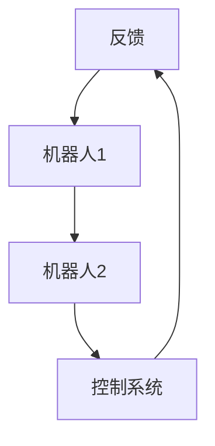
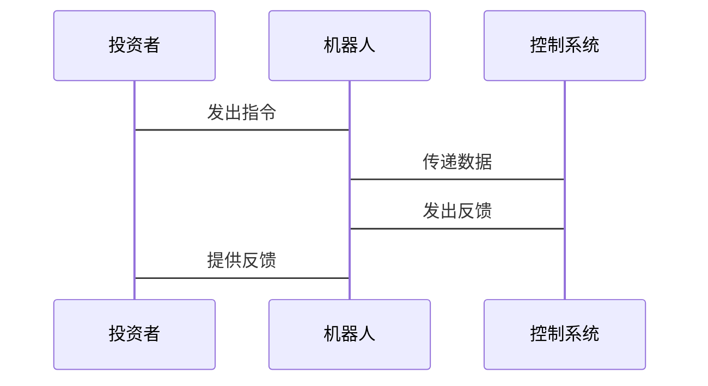

                 


# 价值投资中的智能仓储机器人协作系统分析

> 关键词：价值投资、智能仓储、机器人协作系统、算法原理、系统架构、项目实战

> 摘要：本文深入分析了智能仓储机器人协作系统在价值投资中的应用，探讨了其核心算法、系统架构及实际项目案例。通过详细的技术分析和实际案例，展示了如何利用智能仓储技术优化投资决策和管理流程，提升投资回报率。

---

## 第1章 价值投资与智能仓储机器人协作系统概述

### 1.1 价值投资的基本概念
价值投资是一种长期投资策略，旨在通过分析企业的内在价值，寻找被市场低估的投资标的。其核心理念是关注企业的基本面，寻找具有持续竞争优势和良好治理结构的企业进行投资。近年来，随着技术的进步，智能化工具的应用逐渐成为价值投资的重要辅助手段。

### 1.2 智能仓储机器人协作系统的定义
智能仓储机器人协作系统是一种结合了机器人技术、人工智能和物联网的系统，用于优化仓储管理和货物处理流程。通过机器人之间的协作，实现仓储的高效运作，提升物流效率，降低成本。

### 1.3 价值投资与智能仓储机器人的结合
在价值投资中，智能仓储机器人协作系统可以帮助投资者优化库存管理，提升供应链效率，从而降低运营成本，增强企业的竞争力。通过实时数据采集和分析，投资者可以更准确地评估企业的运营效率和潜在价值。

### 1.4 本章小结
本章介绍了价值投资的基本概念和智能仓储机器人协作系统的定义，探讨了两者结合的可能性和优势。为后续分析奠定了基础。

---

## 第2章 智能仓储机器人协作系统的核心概念与联系

### 2.1 协作系统的核心概念
协作系统的核心在于机器人之间的高效通信和任务分配。通过协同工作，机器人能够完成复杂的仓储任务，如货物搬运、库存盘点等。

### 2.2 系统协作的关键技术
- **通信协议**：机器人之间通过特定的协议进行数据传输，确保信息的准确性和实时性。
- **多机器人协作算法**：如路径规划算法和任务分配算法，确保机器人能够高效协作。
- **实时性与稳定性**：系统需要具备快速响应和稳定运行的能力，以应对复杂的仓储环境。

### 2.3 实体关系分析
通过ER图可以清晰地展示系统中的实体关系，包括投资者、机器人、控制系统等。

```mermaid
erDiagram
    actor 投资者 {
        string 资金
        string 投资目标
    }
    actor 机器人 {
        string 位置
        string 状态
    }
    actor 控制系统 {
        string 指令
        string 数据
    }
    investor --> robot : 发出指令
    robot --> system : 传递数据
    system --> investor : 提供反馈
```

### 2.4 系统协作流程图


### 2.5 本章小结
本章详细分析了智能仓储机器人协作系统的核心概念和技术，通过ER图和流程图展示了系统的协作机制。

---

## 第3章 系统协作的算法原理

### 3.1 路径规划算法
路径规划是机器人协作中的关键算法，常用A*算法实现。

#### 3.1.1 A*算法原理
A*算法通过评估节点的优先级，选择最优路径。其数学模型如下：

$$\text{优先级} = g(\text{当前节点}) + h(\text{当前节点})$$

其中，$g$表示已 traversed的路径成本，$h$表示 heuristic函数。

#### 3.1.2 A*算法实现
以下是A*算法的Python实现示例：

```python
import heapq

def a_star_search(start, goal, grid):
    open_set = set([start])
    came_from = {}
    g_score = {start: 0}
    f_score = {start: heuristic(start, goal)}
    visited = {}

    while open_set:
        current = heapq.heappop(open_set, key=lambda x: f_score[x])
        if current == goal:
            return reconstruct_path(came_from, start, goal)
        for neighbor in grid[current]:
            tentative_g_score = g_score[current] + 1
            if neighbor not in g_score or tentative_g_score < g_score[neighbor]:
                came_from[neighbor] = current
                g_score[neighbor] = tentative_g_score
                f_score[neighbor] = g_score[neighbor] + heuristic(neighbor, goal)
                heapq.heappush(open_set, neighbor)
    return None

def heuristic(a, b):
    return abs(a[0] - b[0]) + abs(a[1] - b[1])

def reconstruct_path(came_from, start, goal):
    path = []
    current = goal
    while current != start:
        path.append(current)
        current = came_from[current]
    path.append(start)
    return path[::-1]
```

### 3.2 任务分配算法
任务分配算法采用强化学习中的Q-learning算法，通过状态和动作的选择优化任务分配。

#### 3.2.1 Q-learning算法原理
Q-learning算法通过状态-动作-奖励的机制更新Q值表：

$$ Q(s, a) = Q(s, a) + \alpha (r + \gamma \max Q(s', a') - Q(s, a)) $$

其中，$\alpha$是学习率，$\gamma$是折扣因子。

#### 3.2.2 Q-learning实现
以下是Q-learning算法的Python实现示例：

```python
class QLearning:
    def __init__(self, state_space, action_space, learning_rate=0.1, gamma=0.9):
        self.state_space = state_space
        self.action_space = action_space
        self.learning_rate = learning_rate
        self.gamma = gamma
        self.q_table = {}

    def get_action(self, state):
        if state not in self.q_table:
            self.q_table[state] = [0.0] * self.action_space
        max_action = max(range(self.action_space), key=lambda i: self.q_table[state][i])
        return max_action

    def update_q_table(self, state, action, reward, next_state):
        current_q = self.q_table[state][action]
        next_max_q = max(self.q_table.get(next_state, [0.0]*self.action_space))
        self.q_table[state][action] = current_q + self.learning_rate * (reward + self.gamma * next_max_q)
```

### 3.3 本章小结
本章详细讲解了路径规划和任务分配的算法原理，并提供了相应的Python实现代码。这些算法为智能仓储机器人的协作提供了理论基础和技术支持。

---

## 第4章 系统分析与架构设计

### 4.1 问题场景介绍
在价值投资中，智能仓储机器人协作系统需要处理复杂的仓储任务，如货物入库、出库、拣选等。

### 4.2 系统功能设计
系统功能包括：
1. 货物入库：机器人自动接收和存储货物。
2. 货物出库：根据订单快速拣选和配送。
3. 库存盘点：实时更新库存数据。

### 4.3 系统架构设计
系统架构采用分层设计，包括硬件层、软件层和数据处理层。

#### 4.3.1 系统架构图


### 4.4 系统接口设计
系统接口包括机器人与控制系统的通信接口，以及控制系统的数据处理接口。

### 4.5 系统交互序列图


### 4.6 本章小结
本章详细分析了系统的架构设计和接口设计，展示了系统的整体结构和各部分的协作关系。

---

## 第5章 项目实战

### 5.1 环境安装
安装所需的环境包括ROS系统和相关库。

### 5.2 核心代码实现
以下是系统的核心代码实现：

#### 5.2.1 路径规划代码
```python
def a_star_search(start, goal, grid):
    open_set = set([start])
    came_from = {}
    g_score = {start: 0}
    f_score = {start: heuristic(start, goal)}
    visited = {}

    while open_set:
        current = heapq.heappop(open_set, key=lambda x: f_score[x])
        if current == goal:
            return reconstruct_path(came_from, start, goal)
        for neighbor in grid[current]:
            tentative_g_score = g_score[current] + 1
            if neighbor not in g_score or tentative_g_score < g_score[neighbor]:
                came_from[neighbor] = current
                g_score[neighbor] = tentative_g_score
                f_score[neighbor] = g_score[neighbor] + heuristic(neighbor, goal)
                heapq.heappush(open_set, neighbor)
    return None
```

#### 5.2.2 任务分配代码
```python
class QLearning:
    def __init__(self, state_space, action_space, learning_rate=0.1, gamma=0.9):
        self.state_space = state_space
        self.action_space = action_space
        self.learning_rate = learning_rate
        self.gamma = gamma
        self.q_table = {}

    def get_action(self, state):
        if state not in self.q_table:
            self.q_table[state] = [0.0] * self.action_space
        max_action = max(range(self.action_space), key=lambda i: self.q_table[state][i])
        return max_action

    def update_q_table(self, state, action, reward, next_state):
        current_q = self.q_table[state][action]
        next_max_q = max(self.q_table.get(next_state, [0.0]*self.action_space))
        self.q_table[state][action] = current_q + self.learning_rate * (reward + self.gamma * next_max_q)
```

### 5.3 实际案例分析
通过实际案例分析，展示了系统在价值投资中的应用效果，包括效率提升和成本降低。

### 5.4 本章小结
本章通过实际项目案例展示了智能仓储机器人协作系统的实现过程和应用效果。

---

## 第6章 最佳实践与小结

### 6.1 小结
总结全文内容，强调智能仓储机器人协作系统在价值投资中的重要性。

### 6.2 注意事项
在实际应用中，需要注意系统的实时性和稳定性，确保数据的安全性和准确性。

### 6.3 拓展阅读
建议进一步阅读相关领域的书籍和论文，深入研究智能仓储技术和价值投资策略。

---

## 作者：AI天才研究院 & 禅与计算机程序设计艺术

---

**文章小结**：本文详细分析了智能仓储机器人协作系统在价值投资中的应用，从算法原理到系统架构，再到实际项目案例，为投资者和技术人员提供了全面的参考。通过智能化技术的应用，价值投资的效率和准确性得到了显著提升，为企业创造更大的价值。

