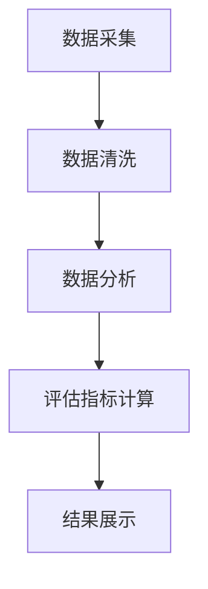
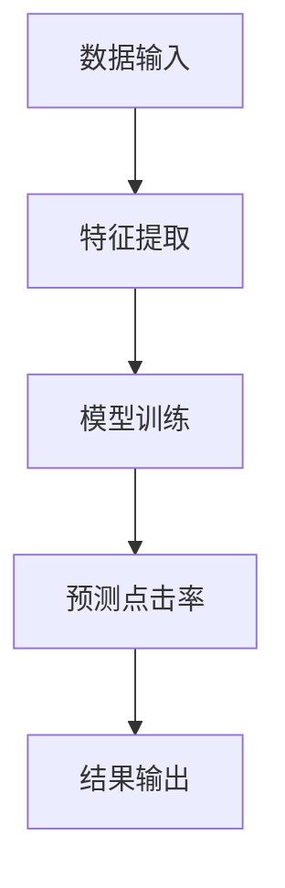
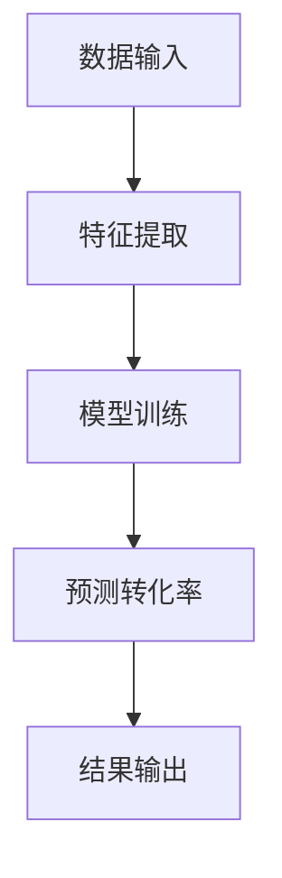
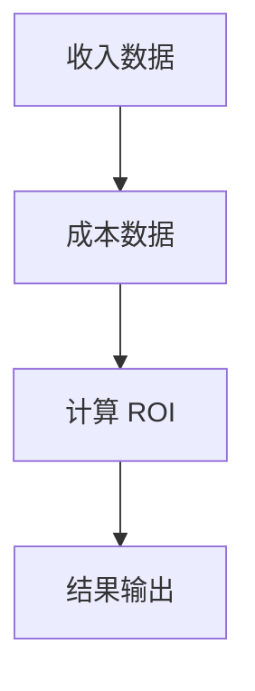
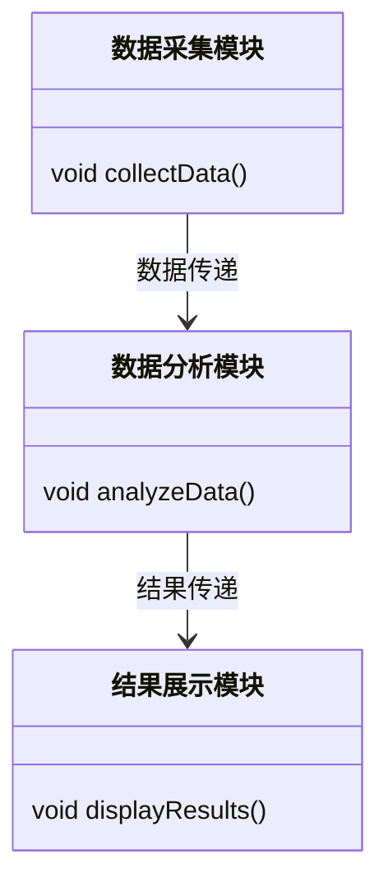
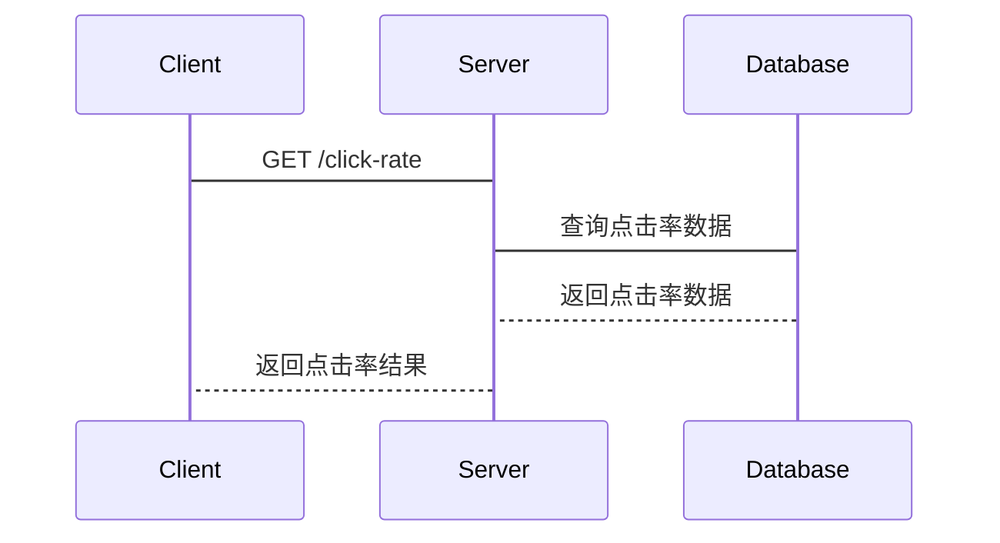

                 


# 如何评估企业的数字化营销效果

> 关键词：数字化营销、效果评估、KPI、数据分析、营销策略

> 摘要：数字化营销是现代企业推广和销售的核心手段，而评估其效果是优化营销策略、提高投资回报率的关键。本文将详细探讨如何科学地评估数字化营销效果，涵盖核心概念、算法原理、系统设计及实战案例，为企业提供实用的指导。

---

# 第1章 数字化营销与效果评估的背景

## 1.1 数字化营销的定义与核心概念

### 1.1.1 数字化营销的定义

数字化营销是指通过数字技术手段，利用互联网、大数据、人工智能等工具，进行产品推广、客户互动和销售转化的营销方式。与传统营销相比，数字化营销更加精准、实时和互动性强。

### 1.1.2 数字化营销的核心要素

- **数据驱动**：依赖数据采集和分析进行决策。
- **多渠道整合**：通过多种渠道（如网站、社交媒体、电子邮件等）进行推广。
- **客户互动**：通过个性化内容与客户建立互动关系。
- **实时反馈**：能够快速获取客户反馈并调整策略。

### 1.1.3 数字化营销与传统营销的区别

| 方面 | 数字化营销 | 传统营销 |
|------|------------|----------|
| 渠道 | 多渠道在线 | 单一渠道 |
| 数据 | 数据驱动 | 少数据或无数据 |
| 互动性 | 高 | 低 |
| 精准度 | 高 | 低 |
| 反馈速度 | 实时 | 延后 |

## 1.2 数字化营销效果评估的重要性

### 1.2.1 为什么需要评估数字化营销效果

- **优化资源配置**：通过评估确定哪些渠道或策略最有效，避免资源浪费。
- **提高投资回报率**：通过数据分析找到最优的营销策略，提升 ROI。
- **持续改进**：通过评估结果不断优化营销方案，适应市场变化。

### 1.2.2 数字化营销效果评估对企业的影响

- **提升营销效率**：通过数据驱动的决策，减少试错成本。
- **增强客户体验**：通过个性化推荐和互动，提高客户满意度。
- **支持业务增长**：通过精准营销，扩大客户基础和市场份额。

### 1.2.3 评估数字化营销效果的挑战

- **数据孤岛**：不同渠道的数据分散，难以整合分析。
- **数据量大**：需要处理海量数据，对技术要求高。
- **实时性要求**：需要快速获取和分析数据，对系统性能要求高。

## 1.3 数字化营销效果评估的边界与外延

### 1.3.1 评估范围的界定

- **数据范围**：包括用户行为数据、销售数据、渠道数据等。
- **时间范围**：可以是实时评估或周期性评估。
- **目标范围**：从单渠道效果评估到整体营销策略评估。

### 1.3.2 外延与相关概念的联系

- **数据挖掘**：通过数据挖掘技术发现潜在的营销机会。
- **人工智能**：利用 AI 技术进行预测和推荐。
- **客户关系管理（CRM）**：通过 CRM 系统管理客户互动和数据。

### 1.3.3 评估框架的构建

- **数据采集层**：收集用户行为数据、销售数据等。
- **数据分析层**：对数据进行清洗、建模和分析。
- **结果展示层**：通过可视化工具展示评估结果。

---

# 第2章 数字化营销效果评估的核心概念与联系

## 2.1 数字化营销效果评估的核心要素

### 2.1.1 数据采集与处理

- **数据来源**：包括网站流量、社交媒体互动、电子邮件订阅等。
- **数据清洗**：去除无效数据，确保数据质量。
- **数据存储**：将数据存储在数据库中，方便后续分析。

### 2.1.2 指标体系的构建

- **关键指标**：如点击率（CTR）、转化率（CVR）、投资回报率（ROI）等。
- **指标权重**：根据业务目标确定各指标的重要性。

### 2.1.3 评估模型的选择

- **回归模型**：用于预测性分析，如销售预测。
- **聚类分析**：用于客户分群，制定个性化策略。

## 2.2 核心概念的属性特征对比

| 指标 | 定义 | 适用场景 | 计算公式 |
|------|------|----------|----------|
| CTR | 点击数 / 展示数 | 广告效果评估 | $$\text{CTR} = \frac{\text{点击数}}{\text{展示数}}$$ |
| CVR | 转化数 / 点击数 | 网站流量评估 | $$\text{CVR} = \frac{\text{转化数}}{\text{点击数}}$$ |
| ROI | 投资收益与成本的比率 | 营销活动效果评估 | $$\text{ROI} = \frac{\text{净收益}}{\text{成本}} \times 100\%$$ |

## 2.3 实体关系图与流程图

### 2.3.1 ER实体关系图

```mermaid
erDiagram
    customer[客户]
    campaign[营销活动]
    interaction[互动行为]
    metric[评估指标]
    
    customer --|{many}| interaction : 进行互动行为
    campaign -->|{one}| interaction : 包含互动行为
    interaction -->|{one}| metric : 产生评估指标
```

### 2.3.2 评估流程的 mermaid 流程图



---

# 第3章 数字化营销效果评估的算法原理

## 3.1 点击率（CTR）预测算法

### 3.1.1 点击率预测的数学模型

$$ P(\text{点击}| \text{特征}) = \frac{e^{\beta \cdot \text{特征}}}{1 + e^{\beta \cdot \text{特征}}} $$

### 3.1.2 算法实现的 mermaid 流程图



### 3.1.3 Python 代码实现与解读

```python
import pandas as pd
from sklearn.linear_model import LogisticRegression

# 数据加载
data = pd.read_csv('click_data.csv')

# 特征提取
features = data[['age', 'gender', 'interest']]
target = data['clicked']

# 模型训练
model = LogisticRegression()
model.fit(features, target)

# 预测点击率
predicted_proba = model.predict_proba(features)[:, 1]
```

---

## 3.2 转化率（CVR）优化算法

### 3.2.1 转化率优化的数学模型

$$ P(\text{转化}| \text{特征}) = \frac{1}{1 + e^{-\beta \cdot \text{特征}}} $$

### 3.2.2 算法实现的 mermaid 流程图



### 3.2.3 Python 代码实现与解读

```python
import pandas as pd
from sklearn.tree import DecisionTreeRegressor

# 数据加载
data = pd.read_csv('conversion_data.csv')

# 特征提取
features = data[['clicks', 'visits', 'interest']]
target = data['converted']

# 模型训练
model = DecisionTreeRegressor()
model.fit(features, target)

# 预测转化率
predicted_proba = model.predict_proba(features)
```

---

## 3.3 ROI（投资回报率）计算方法

### 3.3.1 ROI 计算的数学模型

$$ \text{ROI} = \frac{\text{收入} - \text{成本}}{\text{成本}} \times 100\% $$

### 3.3.2 算法实现的 mermaid 流程图



### 3.3.3 Python 代码实现与解读

```python
import pandas as pd

# 数据加载
data = pd.read_csv('roi_data.csv')

# 收入和成本计算
revenue = data['revenue'].sum()
cost = data['cost'].sum()

# ROI 计算
roi = (revenue - cost) / cost * 100
```

---

# 第4章 数字化营销效果评估的系统分析与架构设计

## 4.1 问题场景介绍

### 4.1.1 数字化营销效果评估的典型问题

- 数据分散，难以整合。
- 数据量大，分析复杂。
- 需要实时反馈，系统性能要求高。

### 4.1.2 系统目标与范围

- 实现数据的实时采集和整合。
- 提供多种评估指标的计算和可视化。
- 支持多渠道的营销效果分析。

### 4.1.3 用户需求分析

- 营销人员需要实时了解各渠道的营销效果。
- 管理层需要宏观的 ROI 分析。

## 4.2 系统功能设计

### 4.2.1 领域模型的 mermaid 类图



### 4.2.2 功能模块划分

- 数据采集模块：负责采集用户行为数据、销售数据等。
- 数据分析模块：对数据进行清洗、建模和分析。
- 结果展示模块：将分析结果以图表形式展示给用户。

### 4.2.3 用例分析

- 用例1：用户登录系统，查看广告点击率。
- 用例2：管理员输入新的营销活动数据，系统自动更新评估结果。

## 4.3 系统架构设计

### 4.3.1 系统架构的 mermaid 架构图


### 4.3.2 模块间的交互关系

- 客户端向服务器发送请求，服务器从数据库中获取数据并返回结果。
- 数据分析模块在服务器端运行，对数据进行处理和建模。

### 4.3.3 技术选型与实现方案

- 前端：使用 React 或 Vue 进行数据可视化。
- 后端：使用 Python 的 Django 框架进行数据处理。
- 数据库：使用 MySQL 或 MongoDB 存储结构化和非结构化数据。

## 4.4 系统接口设计

### 4.4.1 API 接口的设计

- GET /click-rate：获取广告点击率。
- POST /conversion-rate：计算转化率。

### 4.4.2 接口交互的 mermaid 序列图



### 4.4.3 接口文档的编写

| 接口名称 | 请求方法 | 请求路径 | 返回格式 |
|----------|-----------|----------|----------|
| 获取点击率 | GET | /click-rate | JSON |
| 计算转化率 | POST | /conversion-rate | JSON |

## 4.5 系统交互设计

### 4.5.1 用户与系统的交互流程

1. 用户登录系统，选择需要评估的营销活动。
2. 系统展示数据采集模块，用户输入或选择数据源。
3. 数据分析模块对数据进行处理，生成评估指标。
4. 结果展示模块以图表形式展示评估结果。
5. 用户根据结果调整营销策略，系统实时更新评估结果。

---

# 第5章 数字化营销效果评估的项目实战

## 5.1 项目介绍

### 5.1.1 项目背景

某电商公司希望通过数字化营销提高销售额，需要评估不同渠道的广告效果。

## 5.2 环境安装与配置

### 5.2.1 环境需求

- Python 3.8+
- Jupyter Notebook
- 数据库：MySQL

### 5.2.2 安装依赖

```bash
pip install pandas numpy scikit-learn matplotlib
```

## 5.3 核心实现

### 5.3.1 数据采集与清洗

```python
import pandas as pd

# 数据加载
data = pd.read_csv('advertising.csv')

# 数据清洗
data = data.dropna()
data = pd.get_dummies(data, columns=['gender'])
```

### 5.3.2 模型训练与评估

```python
from sklearn.model_selection import train_test_split
from sklearn.linear_model import LogisticRegression
from sklearn.metrics import accuracy_score

# 数据分割
X_train, X_test, y_train, y_test = train_test_split(data.drop('clicked', axis=1), data['clicked'], test_size=0.2)

# 模型训练
model = LogisticRegression()
model.fit(X_train, y_train)

# 模型评估
predicted = model.predict(X_test)
print(accuracy_score(y_test, predicted))
```

## 5.4 案例分析与详细解读

### 5.4.1 案例背景

某广告活动投放了两个广告，分别在 Facebook 和 Google Ads 上投放，预算各为 $1000。

### 5.4.2 数据分析

| 广告渠道 | 展示量 | 点击量 | 转化量 | ROI |
|----------|--------|--------|--------|-----|
| Facebook | 10000  | 1000   | 200    | 150% |
| Google Ads | 12000 | 1200   | 240    | 180% |

### 5.4.3 结果解读

- Facebook 的点击率为 10%，转化率为 20%，ROI 为 150%。
- Google Ads 的点击率为 10%，转化率为 20%，ROI 为 180%。
- 结论：Google Ads 的 ROI 更高，建议增加在 Google Ads 上的广告预算。

---

# 第6章 总结与最佳实践

## 6.1 本章小结

数字化营销效果评估是优化营销策略的关键，本文从核心概念、算法原理、系统设计到项目实战，全面介绍了如何科学评估数字化营销效果。

## 6.2 最佳实践 tips

- **数据驱动决策**：始终基于数据进行营销策略调整。
- **实时监控**：实时监控各渠道的营销效果，及时调整。
- **多渠道整合**：充分利用多渠道进行推广，提高覆盖面。
- **客户为中心**：通过个性化推荐提高客户满意度和转化率。

## 6.3 注意事项

- 数据隐私保护：确保数据处理符合相关法律法规。
- 系统性能优化：优化系统性能，确保实时评估的准确性。
- 持续学习：及时了解最新的数字化营销工具和技术。

## 6.4 拓展阅读

- 《Data-Driven Marketing: The 15-Step Customer Journey to Drive Sales and Profits》
- 《Digital Marketing Analytics: Analytics Across Search, Social, and Other Channels》

---

# 作者：AI天才研究院/AI Genius Institute & 禅与计算机程序设计艺术 /Zen And The Art of Computer Programming

---

希望这篇文章能为您提供关于如何评估企业数字化营销效果的全面指导。如果您有任何问题或需要进一步的解释，请随时联系我。

