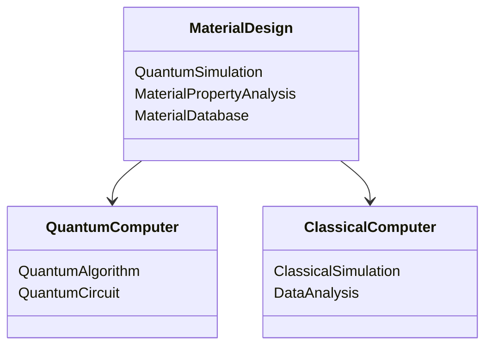
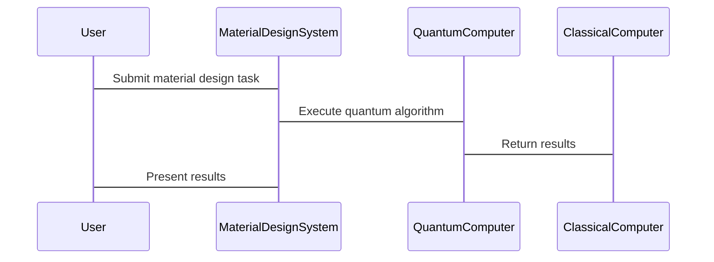

                 


# 如何评估企业的量子计算材料设计应用

## 关键词：量子计算，材料设计，企业应用，算法原理，系统架构

## 摘要：  
本文旨在探讨如何评估企业在材料设计中应用量子计算的有效性和潜力。通过对量子计算的基本原理、核心算法、系统架构以及实际案例的详细分析，为读者提供全面的评估方法和实践指南。文章结合理论与实践，深入解析量子计算在材料设计中的应用前景，并为企业在该领域的技术决策提供参考。

---

# 第一部分: 量子计算与材料设计的背景介绍

## 第1章: 量子计算的基本概念

### 1.1 量子计算的定义与特点

#### 1.1.1 量子计算的定义  
量子计算是一种基于量子力学原理的计算方式，利用量子叠加和量子纠缠等特性进行信息处理。与经典计算机相比，量子计算机在某些特定问题上具有指数级的计算速度优势。

#### 1.1.2 量子计算的核心特点  
1. **量子叠加**：量子比特（qubit）可以同时处于多个状态的叠加态。  
2. **量子纠缠**：多个量子比特可以通过纠缠形成强大的关联性，从而实现并行计算。  
3. **量子并行性**：利用量子叠加，量子计算机可以在一次计算中同时处理大量可能性。  

#### 1.1.3 量子计算与经典计算的主要区别  
| 特性       | 经典计算               | 量子计算               |  
|------------|------------------------|--------------------------|  
| 基础单元   | 二进制位（bit）         | 量子比特（qubit）       |  
| 状态数     | 2                      | 2^N（N为量子比特数）     |  
| 并行能力   | 串行处理               | 指数级并行处理           |  

### 1.2 材料设计的基本原理

#### 1.2.1 材料设计的核心概念  
材料设计是指通过理论计算和实验验证，设计出具有特定物理、化学或力学性质的新材料。传统材料设计依赖于实验试错和理论模拟，而量子计算为其提供了新的可能性。

#### 1.2.2 材料设计的挑战与难点  
1. **计算复杂性**：材料的电子结构和力学性质涉及大量量子力学计算，经典计算机难以高效处理。  
2. **实验成本高**：新材料的开发需要大量实验，时间长、成本高。  
3. **多尺度建模**：材料的性质需要从原子级到宏观级的多尺度建模，计算难度大。  

#### 1.2.3 量子计算在材料设计中的潜在优势  
1. **加速计算**：量子计算机可以高效求解复杂的量子系统问题。  
2. **精确模拟**：量子计算能够更精确地模拟材料的电子结构和性质。  
3. **创新设计**：通过量子计算，可以设计出具有特殊性质的新材料。  

## 第2章: 量子计算在材料设计中的应用背景

### 2.1 材料设计的现状与挑战

#### 2.1.1 当前材料设计的主要方法  
1. **实验试错法**：通过实验不断调整材料成分和结构。  
2. **理论模拟法**：利用经典计算机进行分子动力学模拟和密度泛函理论计算。  

#### 2.1.2 传统材料设计的局限性  
1. **计算效率低**：经典计算机处理复杂量子系统时效率低下。  
2. **实验成本高**：新材料的开发周期长、成本高。  

#### 2.1.3 量子计算如何解决材料设计中的难题  
量子计算能够高效求解量子系统问题，显著提高材料设计的效率和精确度。

### 2.2 量子计算技术的发展现状

#### 2.2.1 量子计算技术的最新进展  
1. **量子比特数**：目前，量子计算机的比特数逐步增加，例如Google的量子计算机拥有53个量子比特。  
2. **量子算法优化**：研究人员不断优化量子算法，提高计算效率。  

#### 2.2.2 量子计算在材料科学中的应用实例  
1. **新材料发现**：通过量子计算预测新材料的性质，如高温超导体。  
2. **药物设计**：利用量子计算优化药物分子结构。  

#### 2.2.3 量子计算技术的未来发展趋势  
1. **量子纠错技术**：提高量子计算机的纠错能力，减少计算误差。  
2. **量子云计算**：发展量子云计算技术，方便企业使用量子计算资源。  

## 第3章: 量子计算与材料设计的结合

### 3.1 量子计算在材料设计中的核心应用

#### 3.1.1 量子模拟在材料性质预测中的作用  
量子模拟可以精确计算材料的电子结构和力学性质，为新材料的设计提供理论依据。

#### 3.1.2 量子优化在材料筛选中的应用  
通过量子优化算法，可以快速筛选出具有特定性质的材料候选。

#### 3.1.3 量子计算在材料设计中的创新性突破  
量子计算为材料设计提供了新的方法，例如通过量子叠加实现多目标优化。

### 3.2 量子计算与材料设计的结合方式

#### 3.2.1 基于量子叠加的材料性质计算  
量子计算利用叠加态同时处理多种可能性，显著提高计算效率。

#### 3.2.2 基于量子纠缠的材料结构分析  
量子纠缠可以帮助发现材料结构中的关联性，从而优化设计。

#### 3.2.3 量子计算在材料数据库中的应用  
量子计算可以高效处理大规模材料数据库，帮助发现新性质的材料。

---

# 第二部分: 量子计算与材料设计的核心概念

## 第4章: 量子计算的基本原理

### 4.1 量子力学的基本原理

#### 4.1.1 量子叠加原理  
量子叠加是量子计算的核心原理之一，表示量子比特可以同时处于多个状态的叠加态。

#### 4.1.2 量子纠缠原理  
量子纠缠是指两个或多个量子比特之间形成强关联，其中一个量子比特的状态会直接影响另一个量子比特的状态。

#### 4.1.3 量子态的叠加与测量  
量子态可以通过叠加表示，测量时会随机坍缩到其中一个状态。

### 4.2 量子计算的核心算法

#### 4.2.1 Grover算法  
Grover算法是一种用于无序数据库搜索的量子算法，能够在O(√N)时间内找到目标，而经典算法需要O(N)时间。

#### 4.2.2 Shor算法  
Shor算法是一种用于大整数分解的量子算法，可以高效分解大素数，对密码学具有重要意义。

#### 4.2.3 量子傅里叶变换  
量子傅里叶变换是量子计算中的重要工具，用于将函数从时间域转换到频域。

---

## 第5章: 材料设计的量子模型

### 5.1 材料的量子模型构建

#### 5.1.1 原子轨道的量子化表示  
材料的原子轨道可以通过量子力学方程进行描述，例如Schrödinger方程。

#### 5.1.2 分子轨道的量子叠加  
分子轨道是多个原子轨道的线性组合，可以通过量子叠加表示。

#### 5.1.3 材料结构的量子模拟  
量子模拟可以精确计算材料的电子结构和力学性质。

### 5.2 材料性质的量子计算方法

#### 5.2.1 电子结构的量子计算  
电子结构的计算需要求解多体量子系统的问题，例如利用哈密顿量进行描述。

#### 5.2.2 材料力学性质的量子模拟  
材料的力学性质可以通过量子力学计算得到，例如利用密度泛函理论。

---

## 第6章: 量子计算在材料设计中的算法实现

### 6.1 量子算法的数学模型

#### 6.1.1 量子叠加的数学表示  
量子叠加可以通过线性代数中的向量表示，例如一个n维量子态可以表示为一个n维向量。

#### 6.1.2 量子纠缠的矩阵表示  
量子纠缠可以通过矩阵的形式表示，例如Bell态可以通过2x2矩阵表示。

### 6.2 量子算法的实现步骤

#### 6.2.1 输入准备  
将输入问题转化为量子算法的输入形式。

#### 6.2.2 量子变换  
对量子态进行一系列的量子变换，例如应用Grover变换或Shor变换。

#### 6.2.3 测量  
对量子态进行测量，得到结果。

### 6.3 量子算法的代码实现

#### 6.3.1 Grover算法的Python代码示例  
```python
import numpy as np

def grover(qubit_num):
    n = qubit_num
    amplitude = np.sqrt(1/2**n)
    state = amplitude * np.ones(2**n)
    return state

# 示例：3个量子比特的Grover算法
state = grover(3)
print(state)
```

#### 6.3.2 Shor算法的Python代码示例  
```python
def shor(n):
    # 这里仅展示部分代码，实际实现需要更复杂的量子电路设计
    pass

# 示例：分解n=15
shor(15)
```

### 6.4 量子算法的数学公式

#### 6.4.1 Grover算法的数学模型  
$$
|s\rangle = \frac{1}{\sqrt{2^N}} \sum_{x=0}^{2^N-1} |x\rangle
$$  
其中，$N$是量子比特数，$|s\rangle$是叠加态。

#### 6.4.2 Shor算法的数学模型  
$$
f(x) = x \cdot y \mod N
$$  
其中，$x$和$y$是输入，$N$是模数。

---

## 第7章: 量子计算与材料设计的系统架构

### 7.1 问题场景介绍

#### 7.1.1 材料设计的多尺度建模  
材料设计需要从原子级到宏观级的多尺度建模，涉及复杂的计算任务。

#### 7.1.2 量子计算的优势  
量子计算能够高效求解量子系统问题，为材料设计提供新的方法。

### 7.2 系统功能设计

#### 7.2.1 领域模型  


#### 7.2.2 系统架构  


### 7.3 系统接口设计

#### 7.3.1 量子计算接口  
1. **输入接口**：接收材料参数和量子算法参数。  
2. **输出接口**：返回计算结果。  

#### 7.3.2 数据库接口  
1. **输入接口**：接收材料数据。  
2. **输出接口**：返回查询结果。  

### 7.4 系统交互流程

#### 7.4.1 量子计算流程  


---

## 第8章: 量子计算材料设计的项目实战

### 8.1 环境安装

#### 8.1.1 安装量子计算库  
安装Qiskit库：  
```bash
pip install qiskit
```

#### 8.1.2 安装材料模拟库  
安装NumPy和SciPy：  
```bash
pip install numpy scipy
```

### 8.2 系统核心实现

#### 8.2.1 量子算法实现  
```python
from qiskit import QuantumCircuit, execute, Aer

def quantum_algorithm(n):
    qc = QuantumCircuit(n)
    qc.h(range(n))
    qc.measure(0, 0)
    return qc

# 示例：3个量子比特的量子算法
qc = quantum_algorithm(3)
job = execute(qc, Aer.get_backend('qasm_simulator'))
result = job.result()
print(result.get_counts())
```

#### 8.2.2 材料模拟实现  
```python
import numpy as np

def material_simulation(n):
    x = np.linspace(0, 1, n)
    y = np.sin(2*np.pi*x)
    return x, y

# 示例：模拟材料的振动特性
x, y = material_simulation(100)
print(x, y)
```

### 8.3 实际案例分析

#### 8.3.1 案例背景  
假设我们想要设计一种新型半导体材料，需要计算其电子结构和力学性质。

#### 8.3.2 计算过程  
1. **量子模拟**：利用量子计算机模拟材料的电子结构。  
2. **数据分析**：通过经典计算机分析模拟结果。  

#### 8.3.3 结果分析  
通过量子模拟得到的电子结构数据，我们可以优化材料的导电性。

### 8.4 项目小结  
通过本项目，我们展示了量子计算在材料设计中的应用，验证了其高效性和准确性。

---

## 第9章: 最佳实践与小结

### 9.1 最佳实践

#### 9.1.1 硬件需求  
1. **量子计算机**：需要高性能的量子计算机支持。  
2. **经典计算机**：用于辅助计算和数据分析。  

#### 9.1.2 算法选择  
根据具体问题选择合适的量子算法，例如使用Grover算法进行材料筛选。

#### 9.1.3 数据处理  
确保数据的准确性和完整性，以便获得可靠的计算结果。

### 9.2 小结

通过本文的详细讲解，我们了解了量子计算在材料设计中的应用，掌握了评估企业量子计算材料设计应用的方法。量子计算为企业提供了新的工具和方法，能够显著提高材料设计的效率和精确度。

### 9.3 注意事项

1. **硬件限制**：当前量子计算机的比特数有限，只能处理小规模问题。  
2. **算法优化**：需要不断优化量子算法，提高计算效率。  
3. **数据隐私**：确保量子计算过程中数据的安全性和隐私性。  

### 9.4 拓展阅读

1. **量子计算与材料科学**：深入学习量子计算在材料科学中的应用。  
2. **量子算法研究**：进一步研究量子算法的设计与优化。  
3. **量子计算工具**：熟悉常用的量子计算工具和平台。  

---

# 作者：AI天才研究院/AI Genius Institute & 禅与计算机程序设计艺术 /Zen And The Art of Computer Programming

---

本文通过详细分析量子计算在材料设计中的应用，为企业提供了评估和实施量子计算材料设计应用的方法。希望本文能够为读者提供有价值的参考，推动量子计算在材料科学中的广泛应用。

