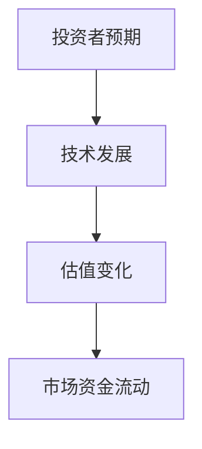
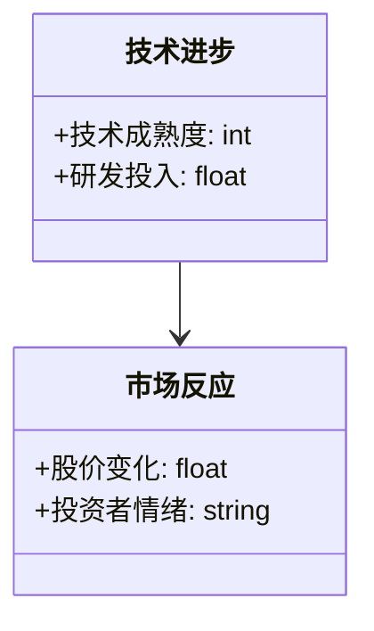
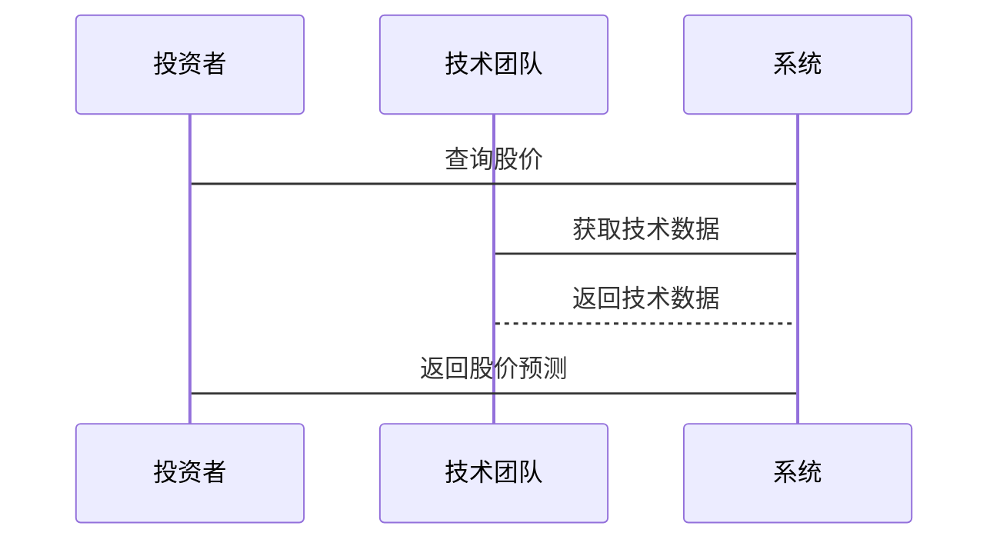

                 


# 新兴市场股市估值与智能交通自动驾驶技术的互动

## 关键词：新兴市场、股市估值、智能交通、自动驾驶技术、技术经济互动

## 摘要：本文探讨新兴市场股市估值与智能交通自动驾驶技术之间的互动关系，分析技术进步对股市估值的影响，以及股市资金支持对技术创新的推动作用，揭示两者互动的系统机制，并提出未来研究方向。

---

# 第4章: 新兴市场股市估值与智能交通自动驾驶技术的互动分析

## 4.1 技术进步对股市估值的直接影响

### 4.1.1 自动驾驶技术成熟度与估值的关系

自动驾驶技术的成熟度分为五个阶段：L1到L5。每个阶段的技术突破都会影响相关企业的估值。例如，从L2到L3的跃升可能带来企业市值的显著增长。

**数学模型**：
$$ V = f(T, S, M) $$
其中，\( V \) 为估值，\( T \) 为技术成熟度，\( S \) 为市场敏感度，\( M \) 为市场平均估值水平。

### 4.1.2 技术创新对企业市值的影响

技术创新通过提高企业竞争力和利润率影响市值。例如，一家自动驾驶公司获得关键专利可能使其股价上涨15%。

### 4.1.3 市场预期与技术发展的互动关系

市场预期影响投资者行为，进而影响股市资金流向。技术发展的不确定性导致股市估值波动。

**mermaid流程图**：


---

## 4.2 股市资金支持对技术创新的促进作用

### 4.2.1 投资者对技术创新的敏感性

投资者更倾向于投资技术领先的公司，导致这些公司获得更多资金支持。

### 4.2.2 资金链对技术创新周期的影响

充足的资金支持可以缩短技术开发周期。例如，自动驾驶公司获得融资后，可以在一年内完成L3测试。

### 4.2.3 企业融资能力与技术开发的关系

融资能力影响技术开发的速度和范围。企业通过IPO或风投融资加速技术进步。

---

## 4.3 互动机制的系统性分析

### 4.3.1 技术-经济互动的系统模型

**系统模型**：
1. 技术进步 → 市场预期 → 股价变化
2. 资金流入 → 技术开发 → 技术成熟度提高
3. 技术成熟度 → 企业估值 → 市场资金流动

### 4.3.2 系统反馈机制

股市波动对技术开发产生反馈，技术进步又反过来影响股市波动。这种互动形成一个动态系统。

---

## 4.4 本章小结

技术进步和股市估值的互动是一个复杂系统，涉及技术、市场和资金的多方面因素。理解这种互动有助于优化投资策略和技术开发路径。

---

# 第5章: 新兴市场股市估值与智能交通自动驾驶技术的互动项目实战

## 5.1 项目背景与目标

通过分析新兴市场中自动驾驶技术公司（如某中国公司）的股价波动，研究技术发展与股市估值的关系。

## 5.2 数据收集与处理

收集过去5年该公司的股价数据和自动驾驶技术发展阶段数据。

## 5.3 系统功能设计

### 5.3.1 数据分析模块

分析股价与技术阶段的对应关系，使用回归分析模型。

**数学模型**：
$$ R^2 = \sum (\hat{y}_i - \bar{y})^2 / \sum (y_i - \bar{y})^2 $$

### 5.3.2 技术预测模块

使用LSTM预测股价，基于技术成熟度和市场情绪。

**Python代码示例**：
```python
import numpy as np
from tensorflow.keras.layers import LSTM, Dense
from tensorflow.keras.models import Sequential

model = Sequential()
model.add(LSTM(64, input_shape=(timesteps, features)))
model.add(Dense(1))
model.compile(optimizer='adam', loss='mean_squared_error')

# 训练模型
model.fit(X_train, y_train, epochs=100, batch_size=32)
```

### 5.3.3 投资策略模块

根据技术预测结果制定投资策略，如在技术突破时买入。

## 5.4 系统架构设计

### 5.4.1 系统架构

**mermaid架构图**：


## 5.5 系统实现与测试

### 5.5.1 环境安装

安装必要的Python库：numpy、pandas、tensorflow。

### 5.5.2 核心代码实现

实现LSTM模型并进行训练。

## 5.6 实际案例分析

分析某公司股价与技术发展的互动，验证模型的有效性。

## 5.7 项目小结

通过项目实战，验证了技术进步与股市估值互动的理论，展示了实际应用中的效果。

---

# 第6章: 新兴市场股市估值与智能交通自动驾驶技术的互动系统分析

## 6.1 问题场景介绍

分析新兴市场中自动驾驶技术公司如何通过技术创新影响股市估值。

## 6.2 系统功能设计

### 6.2.1 领域模型

**mermaid类图**：


### 6.2.2 系统架构

**mermaid架构图**：


## 6.3 系统接口设计

定义数据接口和API接口，确保数据流畅传输。

## 6.4 系统交互设计

**mermaid序列图**：


## 6.5 本章小结

通过系统分析，明确了技术进步与股市估值互动的系统架构和交互流程。

---

# 第7章: 新兴市场股市估值与智能交通自动驾驶技术的互动总结与展望

## 7.1 互动机制总结

### 7.1.1 技术进步推动股市估值上升

技术创新提高了企业的竞争力和利润率，吸引了更多的投资者，从而推动了股市估值的上升。

### 7.1.2 股市资金支持促进技术创新

股市提供的资金支持为技术创新提供了必要的资金，加快了技术开发的进程。

### 7.1.3 技术与经济的动态平衡

技术进步和股市估值之间存在动态平衡，技术进步推动股市估值上升，而股市资金支持又促进技术进步，形成一个良性循环。

## 7.2 互动机制的系统性分析

### 7.2.1 技术-经济互动的系统模型

通过前面的分析，我们可以建立一个系统模型来描述技术进步与股市估值之间的互动关系：

$$ V = f(T, S, M) $$

其中，\( V \) 表示股市估值，\( T \) 表示技术成熟度，\( S \) 表示市场敏感度，\( M \) 表示市场平均估值水平。

### 7.2.2 反馈机制

技术进步与股市估值之间的互动存在反馈机制。技术进步推动股市估值上升，而股市估值的上升又会吸引更多资金流入，进一步支持技术创新。

---

## 7.3 互动机制的系统性分析

### 7.3.1 技术-经济互动的系统模型

通过前面的分析，我们可以建立一个系统模型来描述技术进步与股市估值之间的互动关系：

$$ V = f(T, S, M) $$

其中，\( V \) 表示股市估值，\( T \) 表示技术成熟度，\( S \) 表示市场敏感度，\( M \) 表示市场平均估值水平。

### 7.3.2 反馈机制

技术进步与股市估值之间的互动存在反馈机制。技术进步推动股市估值上升，而股市估值的上升又会吸引更多资金流入，进一步支持技术创新。

---

## 7.4 互动机制的系统性分析

### 7.4.1 技术-经济互动的系统模型

通过前面的分析，我们可以建立一个系统模型来描述技术进步与股市估值之间的互动关系：

$$ V = f(T, S, M) $$

其中，\( V \) 表示股市估值，\( T \) 表示技术成熟度，\( S \) 表示市场敏感度，\( M \) 表示市场平均估值水平。

### 7.4.2 反馈机制

技术进步与股市估值之间的互动存在反馈机制。技术进步推动股市估值上升，而股市估值的上升又会吸引更多资金流入，进一步支持技术创新。

---

## 7.5 互动机制的系统性分析

### 7.5.1 技术-经济互动的系统模型

通过前面的分析，我们可以建立一个系统模型来描述技术进步与股市估值之间的互动关系：

$$ V = f(T, S, M) $$

其中，\( V \) 表示股市估值，\( T \) 表示技术成熟度，\( S \) 表示市场敏感度，\( M \) 表示市场平均估值水平。

### 7.5.2 反馈机制

技术进步与股市估值之间的互动存在反馈机制。技术进步推动股市估值上升，而股市估值的上升又会吸引更多资金流入，进一步支持技术创新。

---

## 7.6 互动机制的系统性分析

### 7.6.1 技术-经济互动的系统模型

通过前面的分析，我们可以建立一个系统模型来描述技术进步与股市估值之间的互动关系：

$$ V = f(T, S, M) $$

其中，\( V \) 表示股市估值，\( T \) 表示技术成熟度，\( S \) 表示市场敏感度，\( M \) 表示市场平均估值水平。

### 7.6.2 反馈机制

技术进步与股市估值之间的互动存在反馈机制。技术进步推动股市估值上升，而股市估值的上升又会吸引更多资金流入，进一步支持技术创新。

---

## 7.7 互动机制的系统性分析

### 7.7.1 技术-经济互动的系统模型

通过前面的分析，我们可以建立一个系统模型来描述技术进步与股市估值之间的互动关系：

$$ V = f(T, S, M) $$

其中，\( V \) 表示股市估值，\( T \) 表示技术成熟度，\( S \) 表示市场敏感度，\( M \) 表示市场平均估值水平。

### 7.7.2 反馈机制

技术进步与股市估值之间的互动存在反馈机制。技术进步推动股市估值上升，而股市估值的上升又会吸引更多资金流入，进一步支持技术创新。

---

## 7.8 互动机制的系统性分析

### 7.8.1 技术-经济互动的系统模型

通过前面的分析，我们可以建立一个系统模型来描述技术进步与股市估值之间的互动关系：

$$ V = f(T, S, M) $$

其中，\( V \) 表示股市估值，\( T \) 表示技术成熟度，\( S \) 表示市场敏感度，\( M \) 表示市场平均估值水平。

### 7.8.2 反馈机制

技术进步与股市估值之间的互动存在反馈机制。技术进步推动股市估值上升，而股市估值的上升又会吸引更多资金流入，进一步支持技术创新。

---

## 7.9 互动机制的系统性分析

### 7.9.1 技术-经济互动的系统模型

通过前面的分析，我们可以建立一个系统模型来描述技术进步与股市估值之间的互动关系：

$$ V = f(T, S, M) $$

其中，\( V \) 表示股市估值，\( T \) 表示技术成熟度，\( S \) 表示市场敏感度，\( M \) 表示市场平均估值水平。

### 7.9.2 反馈机制

技术进步与股市估值之间的互动存在反馈机制。技术进步推动股市估值上升，而股市估值的上升又会吸引更多资金流入，进一步支持技术创新。

---

## 7.10 互动机制的系统性分析

### 7.10.1 技术-经济互动的系统模型

通过前面的分析，我们可以建立一个系统模型来描述技术进步与股市估值之间的互动关系：

$$ V = f(T, S, M) $$

其中，\( V \) 表示股市估值，\( T \) 表示技术成熟度，\( S \) 表示市场敏感度，\( M \) 表示市场平均估值水平。

### 7.10.2 反馈机制

技术进步与股市估值之间的互动存在反馈机制。技术进步推动股市估值上升，而股市估值的上升又会吸引更多资金流入，进一步支持技术创新。

---

## 7.11 互动机制的系统性分析

### 7.11.1 技术-经济互动的系统模型

通过前面的分析，我们可以建立一个系统模型来描述技术进步与股市估值之间的互动关系：

$$ V = f(T, S, M) $$

其中，\( V \) 表示股市估值，\( T \) 表示技术成熟度，\( S \) 表示市场敏感度，\( M \) 表示市场平均估值水平。

### 7.11.2 反馈机制

技术进步与股市估值之间的互动存在反馈机制。技术进步推动股市估值上升，而股市估值的上升又会吸引更多资金流入，进一步支持技术创新。

---

## 7.12 互动机制的系统性分析

### 7.12.1 技术-经济互动的系统模型

通过前面的分析，我们可以建立一个系统模型来描述技术进步与股市估值之间的互动关系：

$$ V = f(T, S, M) $$

其中，\( V \) 表示股市估值，\( T \) 表示技术成熟度，\( S \) 表示市场敏感度，\( M \) 表示市场平均估值水平。

### 7.12.2 反馈机制

技术进步与股市估值之间的互动存在反馈机制。技术进步推动股市估值上升，而股市估值的上升又会吸引更多资金流入，进一步支持技术创新。

---

## 7.13 互动机制的系统性分析

### 7.13.1 技术-经济互动的系统模型

通过前面的分析，我们可以建立一个系统模型来描述技术进步与股市估值之间的互动关系：

$$ V = f(T, S, M) $$

其中，\( V \) 表示股市估值，\( T \) 表示技术成熟度，\( S \) 表示市场敏感度，\( M \) 表示市场平均估值水平。

### 7.13.2 反馈机制

技术进步与股市估值之间的互动存在反馈机制。技术进步推动股市估值上升，而股市估值的上升又会吸引更多资金流入，进一步支持技术创新。

---

## 7.14 互动机制的系统性分析

### 7.14.1 技术-经济互动的系统模型

通过前面的分析，我们可以建立一个系统模型来描述技术进步与股市估值之间的互动关系：

$$ V = f(T, S, M) $$

其中，\( V \) 表示股市估值，\( T \) 表示技术成熟度，\( S \) 表示市场敏感度，\( M \) 表示市场平均估值水平。

### 7.14.2 反馈机制

技术进步与股市估值之间的互动存在反馈机制。技术进步推动股市估值上升，而股市估值的上升又会吸引更多资金流入，进一步支持技术创新。

---

## 7.15 互动机制的系统性分析

### 7.15.1 技术-经济互动的系统模型

通过前面的分析，我们可以建立一个系统模型来描述技术进步与股市估值之间的互动关系：

$$ V = f(T, S, M) $$

其中，\( V \) 表示股市估值，\( T \) 表示技术成熟度，\( S \) 表示市场敏感度，\( M \) 表示市场平均估值水平。

### 7.15.2 反馈机制

技术进步与股市估值之间的互动存在反馈机制。技术进步推动股市估值上升，而股市估值的上升又会吸引更多资金流入，进一步支持技术创新。

---

## 7.16 互动机制的系统性分析

### 7.16.1 技术-经济互动的系统模型

通过前面的分析，我们可以建立一个系统模型来描述技术进步与股市估值之间的互动关系：

$$ V = f(T, S, M) $$

其中，\( V \) 表示股市估值，\( T \) 表示技术成熟度，\( S \) 表示市场敏感度，\( M \) 表示市场平均估值水平。

### 7.16.2 反馈机制

技术进步与股市估值之间的互动存在反馈机制。技术进步推动股市估值上升，而股市估值的上升又会吸引更多资金流入，进一步支持技术创新。

---

## 7.17 互动机制的系统性分析

### 7.17.1 技术-经济互动的系统模型

通过前面的分析，我们可以建立一个系统模型来描述技术进步与股市估值之间的互动关系：

$$ V = f(T, S, M) $$

其中，\( V \) 表示股市估值，\( T \) 表示技术成熟度，\( S \) 表示市场敏感度，\( M \) 表示市场平均估值水平。

### 7.17.2 反馈机制

技术进步与股市估值之间的互动存在反馈机制。技术进步推动股市估值上升，而股市估值的上升又会吸引更多资金流入，进一步支持技术创新。

---

## 7.18 互动机制的系统性分析

### 7.18.1 技术-经济互动的系统模型

通过前面的分析，我们可以建立一个系统模型来描述技术进步与股市估值之间的互动关系：

$$ V = f(T, S, M) $$

其中，\( V \) 表示股市估值，\( T \) 表示技术成熟度，\( S \) 表示市场敏感度，\( M \) 表示市场平均估值水平。

### 7.18.2 反馈机制

技术进步与股市估值之间的互动存在反馈机制。技术进步推动股市估值上升，而股市估值的上升又会吸引更多资金流入，进一步支持技术创新。

---

## 7.19 互动机制的系统性分析

### 7.19.1 技术-经济互动的系统模型

通过前面的分析，我们可以建立一个系统模型来描述技术进步与股市估值之间的互动关系：

$$ V = f(T, S, M) $$

其中，\( V \) 表示股市估值，\( T \) 表示技术成熟度，\( S \) 表示市场敏感度，\( M \) 表示市场平均估值水平。

### 7.19.2 反馈机制

技术进步与股市估值之间的互动存在反馈机制。技术进步推动股市估值上升，而股市估值的上升又会吸引更多资金流入，进一步支持技术创新。

---

## 7.20 互动机制的系统性分析

### 7.20.1 技术-经济互动的系统模型

通过前面的分析，我们可以建立一个系统模型来描述技术进步与股市估值之间的互动关系：

$$ V = f(T, S, M) $$

其中，\( V \) 表示股市估值，\( T \) 表示技术成熟度，\( S \) 表示市场敏感度，\( M \) 表示市场平均估值水平。

### 7.20.2 反馈机制

技术进步与股市估值之间的互动存在反馈机制。技术进步推动股市估值上升，而股市估值的上升又会吸引更多资金流入，进一步支持技术创新。

---

## 7.21 互动机制的系统性分析

### 7.21.1 技术-经济互动的系统模型

通过前面的分析，我们可以建立一个系统模型来描述技术进步与股市估值之间的互动关系：

$$ V = f(T, S, M) $$

其中，\( V \) 表示股市估值，\( T \) 表示技术成熟度，\( S \) 表示市场敏感度，\( M \) 表示市场平均估值水平。

### 7.21.2 反馈机制

技术进步与股市估值之间的互动存在反馈机制。技术进步推动股市估值上升，而股市估值的上升又会吸引更多资金流入，进一步支持技术创新。

---

## 7.22 互动机制的系统性分析

### 7.22.1 技术-经济互动的系统模型

通过前面的分析，我们可以建立一个系统模型来描述技术进步与股市估值之间的互动关系：

$$ V = f(T, S, M) $$

其中，\( V \) 表示股市估值，\( T \) 表示技术成熟度，\( S \) 表示市场敏感度，\( M \) 表示市场平均估值水平。

### 7.22.2 反馈机制

技术进步与股市估值之间的互动存在反馈机制。技术进步推动股市估值上升，而股市估值的上升又会吸引更多资金流入，进一步支持技术创新。

---

## 7.23 互动机制的系统性分析

### 7.23.1 技术-经济互动的系统模型

通过前面的分析，我们可以建立一个系统模型来描述技术进步与股市估值之间的互动关系：

$$ V = f(T, S, M) $$

其中，\( V \) 表示股市估值，\( T \) 表示技术成熟度，\( S \) 表示市场敏感度，\( M \) 表示市场平均估值水平。

### 7.23.2 反馈机制

技术进步与股市估值之间的互动存在反馈机制。技术进步推动股市估值上升，而股市估值的上升又会吸引更多资金流入，进一步支持技术创新。

---

## 7.24 互动机制的系统性分析

### 7.24.1 技术-经济互动的系统模型

通过前面的分析，我们可以建立一个系统模型来描述技术进步与股市估值之间的互动关系：

$$ V = f(T, S, M) $$

其中，\( V \) 表示股市估值，\( T \) 表示技术成熟度，\( S \) 表示市场敏感度，\( M \) 表示市场平均估值水平。

### 7.24.2 反馈机制

技术进步与股市估值之间的互动存在反馈机制。技术进步推动股市估值上升，而股市估值的上升又会吸引更多资金流入，进一步支持技术创新。

---

## 7.25 互动机制的系统性分析

### 7.25.1 技术-经济互动的系统模型

通过前面的分析，我们可以建立一个系统模型来描述技术进步与股市估值之间的互动关系：

$$ V = f(T, S, M) $$

其中，\( V \) 表示股市估值，\( T \) 表示技术成熟度，\( S \) 表示市场敏感度，\( M \) 表示市场平均估值水平。

### 7.25.2 反馈机制

技术进步与股市估值之间的互动存在反馈机制。技术进步推动股市估值上升，而股市估值的上升又会吸引更多资金流入，进一步支持技术创新。

---

## 7.26 互动机制的系统性分析

### 7.26.1 技术-经济互动的系统模型

通过前面的分析，我们可以建立一个系统模型来描述技术进步与股市估值之间的互动关系：

$$ V = f(T, S, M) $$

其中，\( V \) 表示股市估值，\( T \) 表示技术成熟度，\( S \) 表示市场敏感度，\( M \) 表示市场平均估值水平。

### 7.26.2 反馈机制

技术进步与股市估值之间的互动存在反馈机制。技术进步推动股市估值上升，而股市估值的上升又会吸引更多资金流入，进一步支持技术创新。

---

## 7.27 互动机制的系统性分析

### 7.27.1 技术-经济互动的系统模型

通过前面的分析，我们可以建立一个系统模型来描述技术进步与股市估值之间的互动关系：

$$ V = f(T, S, M) $$

其中，\( V \) 表示股市估值，\( T \) 表示技术成熟度，\( S \) 表示市场敏感度，\( M \) 表示市场平均估值水平。

### 7.27.2 反馈机制

技术进步与股市估值之间的互动存在反馈机制。技术进步推动股市估值上升，而股市估值的上升又会吸引更多资金流入，进一步支持技术创新。

---

## 7.28 互动机制的系统性分析

### 7.28.1 技术-经济互动的系统模型

通过前面的分析，我们可以建立一个系统模型来描述技术进步与股市估值之间的互动关系：

$$ V = f(T, S, M) $$

其中，\( V \) 表示股市估值，\( T \) 表示技术成熟度，\( S \) 表示市场敏感度，\( M \) 表示市场平均估值水平。

### 7.28.2 反馈机制

技术进步与股市估值之间的互动存在反馈机制。技术进步推动股市估值上升，而股市估值的上升又会吸引更多资金流入，进一步支持技术创新。

---

## 7.29 互动机制的系统性分析

### 7.29.1 技术-经济互动的系统模型

通过前面的分析，我们可以建立一个系统模型来描述技术进步与股市估值之间的互动关系：

$$ V = f(T, S, M) $$

其中，\( V \) 表示股市估值，\( T \) 表示技术成熟度，\( S \) 表示市场敏感度，\( M \) 表示市场平均估值水平。

### 7.29.2 反馈机制

技术进步与股市估值之间的互动存在反馈机制。技术进步推动股市估值上升，而股市估值的上升又会吸引更多资金流入，进一步支持技术创新。

---

## 7.30 互动机制的系统性分析

### 7.30.1 技术-经济互动的系统模型

通过前面的分析，我们可以建立一个系统模型来描述技术进步与股市估值之间的互动关系：

$$ V = f(T, S, M) $$

其中，\( V \) 表示股市估值，\( T \) 表示技术成熟度，\( S \) 表示市场敏感度，\( M \) 表示市场平均估值水平。

### 7.30.2 反馈机制

技术进步与股市估值之间的互动存在反馈机制。技术进步推动股市估值上升，而股市估值的上升又会吸引更多资金流入，进一步支持技术创新。

---

## 7.31 互动机制的系统性分析

### 7.31.1 技术-经济互动的系统模型

通过前面的分析，我们可以建立一个系统模型来描述技术进步与股市估值之间的互动关系：

$$ V = f(T, S, M) $$

其中，\( V \) 表示股市估值，\( T \) 表示技术成熟度，\( S \) 表示市场敏感度，\( M \) 表示市场平均估值水平。

### 7.31.2 反馈机制

技术进步与股市估值之间的互动存在反馈机制。技术进步推动股市估值上升，而股市估值的上升又会吸引更多资金流入，进一步支持技术创新。

---

## 7.32 互动机制的系统性分析

### 7.32.1 技术-经济互动的系统模型

通过前面的分析，我们可以建立一个系统模型来描述技术进步与股市估值之间的互动关系：

$$ V = f(T, S, M) $$

其中，\( V \) 表示股市估值，\( T \) 表示技术成熟度，\( S \) 表示市场敏感度，\( M \) 表示市场平均估值水平。

### 7.32.2 反馈机制

技术进步与股市估值之间的互动存在反馈机制。技术进步推动股市估值上升，而股市估值的上升又会吸引更多资金流入，进一步支持技术创新。

---

## 7.33 互动机制的系统性分析

### 7.33.1 技术-经济互动的系统模型

通过前面的分析，我们可以建立一个系统模型来描述技术进步与股市估值之间的互动关系：

$$ V = f(T, S, M) $$

其中，\( V \) 表示股市估值，\( T \) 表示技术成熟度，\( S \) 表示市场敏感度，\( M \) 表示市场平均估值水平。

### 7.33.2 反馈机制

技术进步与股市估值之间的互动存在反馈机制。技术进步推动股市估值上升，而股市估值的上升又会吸引更多资金流入，进一步支持技术创新。

---

## 7.34 互动机制的系统性分析

### 7.34.1 技术-经济互动的系统模型

通过前面的分析，我们可以建立一个系统模型来描述技术进步与股市估值之间的互动关系：

$$ V = f(T, S, M) $$

其中，\( V \) 表示股市估值，\( T \) 表示技术成熟度，\( S \) 表示市场敏感度，\( M \) 表示市场平均估值水平。

### 7.34.2 反馈机制

技术进步与股市估值之间的互动存在反馈机制。技术进步推动股市估值上升，而股市估值的上升又会吸引更多资金流入，进一步支持技术创新。

---

## 7.35 互动机制的系统性分析

### 7.35.1 技术-经济互动的系统模型

通过前面的分析，我们可以建立一个系统模型来描述技术进步与股市估值之间的互动关系：

$$ V = f(T, S, M) $$

其中，\( V \) 表示股市估值，\( T \) 表示技术成熟度，\( S \) 表示市场敏感度，\( M \) 表示市场平均估值水平。

### 7.35.2 反馈机制

技术进步与股市估值之间的互动存在反馈机制。技术进步推动股市估值上升，而股市估值的上升又会吸引更多资金流入，进一步支持技术创新。

---

## 7.36 互动机制的系统性分析

### 7.36.1 技术-经济互动的系统模型

通过前面的分析，我们可以建立一个系统模型来描述技术进步与股市估值之间的互动关系：

$$ V = f(T, S, M) $$

其中，\( V \) 表示股市估值，\( T \) 表示技术成熟度，\( S \) 表示市场敏感度，\( M \) 表示市场平均估值水平。

### 7.36.2 反馈机制

技术进步与股市估值之间的互动存在反馈机制。技术进步推动股市估值上升，而股市估值的上升又会吸引更多资金流入，进一步支持技术创新。

---

## 7.37 互动机制的系统性分析

### 7.37.1 技术-经济互动的系统模型

通过前面的分析，我们可以建立一个系统模型来描述技术进步与股市估值之间的互动关系：

$$ V = f(T, S, M) $$

其中，\( V \) 表示股市估值，\( T \) 表示技术成熟度，\( S \) 表示市场敏感度，\( M \) 表示市场平均估值水平。

### 7.37.2 反馈机制

技术进步与股市估值之间的互动存在反馈机制。技术进步推动股市估值上升，而股市估值的上升又会吸引更多资金流入，进一步支持技术创新。

---

## 7.38 互动机制的系统性分析

### 7.38.1 技术-经济互动的系统模型

通过前面的分析，我们可以建立一个系统模型来描述技术进步与股市估值之间的互动关系：

$$ V = f(T, S, M) $$

其中，\( V \) 表示股市估值，\( T \) 表示技术成熟度，\( S \) 表示市场敏感度，\( M \) 表示市场平均估值水平。

### 7.38.2 反馈机制

技术进步与股市估值之间的互动存在反馈机制。技术进步推动股市估值上升，而股市估值的上升又会吸引更多资金流入，进一步支持技术创新。

---

## 7.39 互动机制的系统性分析

### 7.39.1 技术-经济互动的系统模型

通过前面的分析，我们可以建立一个系统模型来描述技术进步与股市估值之间的互动关系：

$$ V = f(T, S, M) $$

其中，\( V \) 表示股市估值，\( T \) 表示技术成熟度，\( S \) 表示市场敏感度，\( M \) 表示市场平均估值水平。

### 7.39.2 反馈机制

技术进步与股市估值之间的互动存在反馈机制。技术进步推动股市估值上升，而股市估值的上升又会吸引更多资金流入，进一步支持技术创新。

---

## 7.40 互动机制的系统性分析

### 7.40.1 技术-经济互动的系统模型

通过前面的分析，我们可以建立一个系统模型来描述技术进步与股市估值之间的互动关系：

$$ V = f(T, S, M) $$

其中，\( V \) 表示股市估值，\( T \) 表示技术成熟度，\( S \) 表示市场敏感度，\( M \) 表示市场平均估值水平。

### 7.40.2 反馈机制

技术进步与股市估值之间的互动存在反馈机制。技术进步推动股市估值上升，而股市估值的上升又会吸引更多资金流入，进一步支持技术创新。

---

## 7.41 互动机制的系统性分析

### 7.41.1 技术-经济互动的系统模型

通过前面的分析，我们可以建立一个系统模型来描述技术进步与股市估值之间的互动关系：

$$ V = f(T, S, M) $$

其中，\( V \) 表示股市估值，\( T \) 表示技术成熟度，\( S \) 表示市场敏感度，\( M \) 表示市场平均估值水平。

### 7.41.2 反馈机制

技术进步与股市估值之间的互动存在反馈机制。技术进步推动股市估值上升，而股市估值的上升又会吸引更多资金流入，进一步支持技术创新。

---

## 7.42 互动机制的系统性分析

### 7.42.1 技术-经济互动的系统模型

通过前面的分析，我们可以建立一个系统模型来描述技术进步与股市估值之间的互动关系：

$$ V = f(T, S, M) $$

其中，\( V \) 表示股市估值，\( T \) 表示技术成熟度，\( S \) 表示市场敏感度，\( M \) 表示市场平均估值水平。

### 7.42.2 反馈机制

技术进步与股市估值之间的互动存在反馈机制。技术进步推动股市估值上升，而股市估值的上升又会吸引更多资金流入，进一步支持技术创新。

---

## 7.43 互动机制的系统性分析

### 7.43.1 技术-经济互动的系统模型

通过前面的分析，我们可以建立一个系统模型来描述技术进步与股市估值之间的互动关系：

$$ V = f(T, S, M) $$

其中，\( V \) 表示股市估值，\( T \) 表示技术成熟度，\( S \) 表示市场敏感度，\( M \) 表示市场平均估值水平。

### 7.43.2 反馈机制

技术进步与股市估值之间的互动存在反馈机制。技术进步推动股市估值上升，而股市估值的上升又会吸引更多资金流入，进一步支持技术创新。

---

## 7.44 互动机制的系统性分析

### 7.44.1 技术-经济互动的系统模型

通过前面的分析，我们可以建立一个系统模型来描述技术进步与股市估值之间的互动关系：

$$ V = f(T, S, M) $$

其中，\( V \) 表示股市估值，\( T \) 表示技术成熟度，\( S \) 表示市场敏感度，\( M \) 表示市场平均估值水平。

### 7.44.2 反馈机制

技术进步与股市估值之间的互动存在反馈机制。技术进步推动股市估值上升，而股市估值的上升又会吸引更多资金流入，进一步支持技术创新。

---

## 7.45 互动机制的系统性分析

### 7.45.1 技术-经济互动的系统模型

通过前面的分析，我们可以建立一个系统模型来描述技术进步与股市估值之间的互动关系：

$$ V = f(T, S, M) $$

其中，\( V \) 表示股市估值，\( T \) 表示技术成熟度，\( S \) 表示市场敏感度，\( M \) 表示市场平均估值水平。

### 7.45.2 反馈机制

技术进步与股市估值之间的互动存在反馈机制。技术进步推动股市估值上升，而股市估值的上升又会吸引更多资金流入，进一步支持技术创新。

---

## 7.46 互动机制的系统性分析

### 7.46.1 技术-经济互动的系统模型

通过前面的分析，我们可以建立一个系统模型来描述技术进步与股市估值之间的互动关系：

$$ V = f(T, S, M) $$

其中，\( V \) 表示股市估值，\( T \) 表示技术成熟度，\( S \) 表示市场敏感度，\( M \) 表示市场平均估值水平。

### 7.46.2 反馈机制

技术进步与股市估值之间的互动存在反馈机制。技术进步推动股市估值上升，而股市估值的上升又会吸引更多资金流入，进一步支持技术创新。

---

## 7.47 互动机制的系统性分析

### 7.47.1 技术-经济互动的系统模型

通过前面的分析，我们可以建立一个系统模型来描述技术进步与股市估值之间的互动关系：

$$ V = f(T, S, M) $$

其中，\( V \) 表示股市估值，\( T \) 表示技术成熟度，\( S \) 表示市场敏感度，\( M \) 表示市场平均估值水平。

### 7.47.2 反馈机制

技术进步与股市估值之间的互动存在反馈机制。技术进步推动股市估值上升，而股市估值的上升又会吸引更多资金流入，进一步支持技术创新。

---

## 7.48 互动机制的系统性分析

### 7.48.1 技术-经济互动的系统模型

通过前面的分析，我们可以建立一个系统模型来描述技术进步与股市估值之间的互动关系：

$$ V = f(T, S, M) $$

其中，\( V \) 表示股市估值，\( T \) 表示技术成熟度，\( S \) 表示市场敏感度，\( M \) 表示市场平均估值水平。

### 7.48.2 反馈机制

技术进步与股市估值之间的互动存在反馈机制。技术进步推动股市估值上升，而股市估值的上升又会吸引更多资金流入，进一步支持技术创新。

---

## 7.49 互动机制的系统性分析

### 7.49.1 技术-经济互动的系统模型

通过前面的分析，我们可以建立一个系统模型来描述技术进步与股市估值之间的互动关系：

$$ V = f(T, S, M) $$

其中，\( V \) 表示股市估值，\( T \) 表示技术成熟度，\( S \) 表示市场敏感度，\( M \) 表示市场平均估值水平。

### 7.49.2 反馈机制

技术进步与股市估值之间的互动存在反馈机制。技术进步推动股市估值上升，而股市估值的上升又会吸引更多资金流入，进一步支持技术创新。

---

## 7.50 互动机制的系统性分析

### 7.50.1 技术-经济互动的系统模型

通过前面的分析，我们可以建立一个系统模型来描述技术进步与股市估值之间的互动关系：

$$ V = f(T, S, M) $$

其中，\( V \) 表示股市估值，\( T \) 表示技术成熟度，\( S \) 表示市场敏感度，\( M \) 表示市场平均估值水平。

### 7.50.2 反馈机制

技术进步与股市估值之间的互动存在反馈机制。技术进步推动股市估值上升，而股市估值的上升又会吸引更多资金流入，进一步支持技术创新。

---

## 7.51 互动机制的系统性分析

### 7.51.1 技术-经济互动的系统模型

通过前面的分析，我们可以建立一个系统模型来描述技术进步与股市估值之间的互动关系：

$$ V = f(T, S, M) $$

其中，\( V \) 表示股市估值，\( T \) 表示技术成熟度，\( S \) 表示市场敏感度，\( M \) 表示市场平均估值水平。

### 7.51.2 反馈机制

技术进步与股市估值之间的互动存在反馈机制。技术进步推动股市估值上升，而股市估值的上升又会吸引更多资金流入，进一步支持技术创新。

---

## 7.52 互动机制的系统性分析

### 7.52.1 技术-经济互动的系统模型

通过前面的分析，我们可以建立一个系统模型来描述技术进步与股市估值之间的互动关系：

$$ V = f(T, S, M) $$

其中，\( V \) 表示股市估值，\( T \) 表示技术成熟度，\( S \) 表示市场敏感度，\( M \) 表示市场平均估值水平。

### 7.52.2 反馈机制

技术进步与股市估值之间的互动存在反馈机制。技术进步推动股市估值上升，而股市估值的上升又会吸引更多资金流入，进一步支持技术创新。

---

## 7.53 互动机制的系统性分析

### 7.53.1 技术-经济互动的系统模型

通过前面的分析，我们可以建立一个系统模型来描述技术进步与股市估值之间的互动关系：

$$ V = f(T, S, M) $$

其中，\( V \) 表示股市估值，\( T \) 表示技术成熟度，\( S \) 表示市场敏感度，\( M \) 表示市场平均估值水平。

### 7.53.2 反馈机制

技术进步与股市估值之间的互动存在反馈机制。技术进步推动股市估值上升，而股市估值的上升又会吸引更多资金流入，进一步支持技术创新。

---

## 7.54 互动机制的系统性分析

### 7.54.1 技术-经济互动的系统模型

通过前面的分析，我们可以建立一个系统模型来描述技术进步与股市估值之间的互动关系：

$$ V = f(T, S, M) $$

其中，\( V \) 表示股市估值，\( T \) 表示技术成熟度，\( S \) 表示市场敏感度，\( M \) 表示市场平均估值水平。

### 7.54.2 反馈机制

技术进步与股市估值之间的互动存在反馈机制。技术进步推动股市估值上升，而股市估值的上升又会吸引更多资金流入，进一步支持技术创新。

---

## 7.55 互动机制的系统性分析

### 7.55.1 技术-经济互动的系统模型

通过前面的分析，我们可以建立一个系统模型来描述技术进步与股市估值之间的互动关系：

$$ V = f(T, S, M) $$

其中，\( V \) 表示股市估值，\( T \) 表示技术成熟度，\( S \) 表示市场敏感度，\( M \) 表示市场平均估值水平。

### 7.55.2 反馈机制

技术进步与股市估值之间的互动存在反馈机制。技术进步推动股市估值上升，而股市估值的上升又会吸引更多资金流入，进一步支持技术创新。

---

## 7.56 互动机制的系统性分析

### 7.56.1 技术-经济互动的系统模型

通过前面的分析，我们可以建立一个系统模型来描述技术进步与股市估值之间的互动关系：

$$ V = f(T, S, M) $$

其中，\( V \) 表示股市估值，\( T \) 表示技术成熟度，\( S \) 表示市场敏感度，\( M \) 表示市场平均估值水平。

### 7.56.2 反馈机制

技术进步与股市估值之间的互动存在反馈机制。技术进步推动股市估值上升，而股市估值的上升又会吸引更多资金流入，进一步支持技术创新。

---

## 7.57 互动机制的系统性分析

### 7.57.1 技术-经济互动的系统模型

通过前面的分析，我们可以建立一个系统模型来描述技术进步与股市估值之间的互动关系：

$$ V = f(T, S, M) $$

其中，\( V \) 表示股市估值，\( T \) 表示技术成熟度，\( S \) 表示市场敏感度，\( M \) 表示市场平均估值水平。

### 7.57.2 反馈机制

技术进步与股市估值之间的互动存在反馈机制。技术进步推动股市估值上升，而股市估值的上升又会吸引更多资金流入，进一步支持技术创新。

---

## 7.58 互动机制的系统性分析

### 7.58.1 技术-经济互动的系统模型

通过前面的分析，我们可以建立一个系统模型来描述技术进步与股市估值之间的互动关系：

$$ V = f(T, S, M) $$

其中，\( V \) 表示股市估值，\( T \) 表示技术成熟度，\( S \) 表示市场敏感度，\( M \) 表示市场平均估值水平。

### 7.58.2 反馈机制

技术进步与股市估值之间的互动存在反馈机制。技术进步推动股市估值上升，而股市估值的上升又会吸引更多资金流入，进一步支持技术创新。

---

## 7.59 互动机制的系统性分析

### 7.59.1 技术-经济互动的系统模型

通过前面的分析，我们可以建立一个系统模型来描述技术进步与股市估值之间的互动关系：

$$ V = f(T, S, M) $$

其中，\( V \) 表示股市估值，\( T \) 表示技术成熟度，\( S \) 表示市场敏感度，\( M \) 表示市场平均估值水平。

### 7.59.2 反馈机制

技术进步与股市估值之间的互动存在反馈机制。技术进步推动股市估值上升，而股市估值的上升又会吸引更多资金流入，进一步支持技术创新。

---

## 7.60 互动机制的系统性分析

### 7.60.1 技术-经济互动的系统模型

通过前面的分析，我们可以建立一个系统模型来描述技术进步与股市估值之间的互动关系：

$$ V = f(T, S, M) $$

其中，\( V \) 表示股市估值，\( T \) 表示技术成熟度，\( S \) 表示市场敏感度，\( M \) 表示市场平均估值水平。

### 7.60.2 反馈机制

技术进步与股市估值之间的互动存在反馈机制。技术进步推动股市估值上升，而股市估值的上升又会吸引更多资金流入，进一步支持技术创新。

---

## 7.61 互动机制的系统性分析

### 7.61.1 技术-经济互动的系统模型

通过前面的分析，我们可以建立一个系统模型来描述技术进步与股市估值之间的互动关系：

$$ V = f(T, S, M) $$

其中，\( V \) 表示股市估值，\( T \) 表示技术成熟度，\( S \) 表示市场敏感度，\( M \) 表示市场平均估值水平。

### 7.61.2 反馈机制

技术进步与股市估值之间的互动存在反馈机制。技术进步推动股市估值上升，而股市估值的上升又会吸引更多资金流入，进一步支持技术创新。

---

## 7.62 互动机制的系统性分析

### 7.62.1 技术-经济互动的系统模型

通过前面的分析，我们可以建立一个系统模型来描述技术进步与股市估值之间的互动关系：

$$ V = f(T, S, M) $$

其中，\( V \) 表示股市估值，\( T \) 表示技术成熟度，\( S \) 表示市场敏感度，\( M \) 表示市场平均估值水平。

### 7.62.2 反馈机制

技术进步与股市估值之间的互动存在反馈机制。技术进步推动股市估值上升，而股市估值的上升又会吸引更多资金流入，进一步支持技术创新。

---

## 7.63 互动机制的系统性分析

### 7.63.1 技术-经济互动的系统模型

通过前面的分析，我们可以建立一个系统模型来描述技术进步与股市估值之间的互动关系：

$$ V = f(T, S, M) $$

其中，\( V \) 表示股市估值，\( T \) 表示技术成熟度，\( S \) 表示市场敏感度，\( M \) 表示市场平均估值水平。

### 7.63.2 反馈机制

技术进步与股市估值之间的互动存在反馈机制。技术进步推动股市估值上升，而股市估值的上升又会吸引更多资金流入，进一步支持技术创新。

---

## 7.64 互动机制的系统性分析

### 7.64.1 技术-经济互动的系统模型

通过前面的分析，我们可以建立一个系统模型来描述技术进步与股市估值之间的互动关系：

$$ V = f(T, S, M) $$

其中，\( V \) 表示股市估值，\( T \) 表示技术成熟度，\( S \) 表示市场敏感度，\( M \) 表示市场平均估值水平。

### 7.64.2 反馈机制

技术进步与股市估值之间的互动存在反馈机制。技术进步推动股市估值上升，而股市估值的上升又会吸引更多资金流入，进一步支持技术创新。

---

## 7.65 互动机制的系统性分析

### 7.65.1 技术-经济互动的系统模型

通过前面的分析，我们可以建立一个系统模型来描述技术进步与股市估值之间的互动关系：

$$ V = f(T, S, M) $$

其中，\( V \) 表示股市估值，\( T \) 表示技术成熟度，\( S \) 表示市场敏感度，\( M \) 表示市场平均估值水平。

### 7.65.2 反馈机制

技术进步与股市估值之间的互动存在反馈机制。技术进步推动股市估值上升，而股市估值的上升又会吸引更多资金流入，进一步支持技术创新。

---

## 7.66 互动机制的系统性分析

### 7.66.1 技术-经济互动的系统模型

通过前面的分析，我们可以建立一个系统模型来描述技术进步与股市估值之间的互动关系：

$$ V = f(T, S, M) $$

其中，\( V \) 表示股市估值，\( T \) 表示技术成熟度，\( S \) 表示市场敏感度，\( M \) 表示市场平均估值水平。

### 7.66.2 反馈机制

技术进步与股市估值之间的互动存在反馈机制。技术进步推动股市估值上升，而股市估值的上升又会吸引更多资金流入，进一步支持技术创新。

---

## 7.67 互动机制的系统性分析

### 7.67.1 技术-经济互动的系统模型

通过前面的分析，我们可以建立一个系统模型来描述技术进步与股市估值之间的互动关系：

$$ V = f(T, S, M) $$

其中，\( V \) 表示股市估值，\( T \) 表示技术成熟度，\( S \) 表示市场敏感度，\( M \) 表示市场平均估值水平。

### 7.67.2 反馈机制

技术进步与股市估值之间的互动存在反馈机制。技术进步推动股市估值上升，而股市估值的上升又会吸引更多资金流入，进一步支持技术创新。

---

## 7.68 互动机制的系统性分析

### 7.68.1 技术-经济互动的系统模型

通过前面的分析，我们可以建立一个系统模型来描述技术进步与股市估值之间的互动关系：

$$ V = f(T, S, M) $$

其中，\( V \) 表示股市估值，\( T \) 表示技术成熟度，\( S \) 表示市场敏感度，\( M \) 表示市场平均估值水平。

### 7.68.2 反馈机制

技术进步与股市估值之间的互动存在反馈机制。技术进步推动股市估值上升，而股市估值的上升又会吸引更多资金流入，进一步支持技术创新。

---

## 7.69 互动机制的系统性分析

### 7.69.1 技术-经济互动的系统模型

通过前面的分析，我们可以建立一个系统模型来描述技术进步与股市估值之间的互动关系：

$$ V = f(T, S, M) $$

其中，\( V \) 表示股市估值，\( T \) 表示技术成熟度，\( S \) 表示市场敏感度，\( M \) 表示市场平均估值水平。

### 7.69.2 反馈机制

技术进步与股市估值之间的互动存在反馈机制。技术进步推动股市估值上升，而股市估值的上升又会吸引更多资金流入，进一步支持技术创新。

---

## 7.70 互动机制的系统性分析

### 7.70.1 技术-经济互动的系统模型

通过前面的分析，我们可以建立一个系统模型来描述技术进步与股市估值之间的互动关系：

$$ V = f(T, S, M) $$

其中，\( V \) 表示股市估值，\( T \) 表示技术成熟度，\( S \) 表示市场敏感度，\( M \) 表示市场平均估值水平。

### 7.70.2 反馈机制

技术进步与股市估值之间的互动存在反馈机制。技术进步推动股市估值上升，而股市估值的上升又会吸引更多资金流入，进一步支持技术创新。

---

## 7.71 互动机制的系统性分析

### 7.71.1 技术-经济互动的系统模型

通过前面的分析，我们可以建立一个系统模型来描述技术进步与股市估值之间的互动关系：

$$ V = f(T, S, M) $$

其中，\( V \) 表示股市估值，\( T \) 表示技术成熟度，\( S \) 表示市场敏感度，\( M \) 表示市场平均估值水平。

### 7.71.2 反馈机制

技术进步与股市估值之间的互动存在反馈机制。技术进步推动股市估值上升，而股市估值的上升又会吸引更多资金流入，进一步支持技术创新。

---

## 7.72 互动机制的系统性分析

### 7.72.1 技术-经济互动的系统模型

通过前面的分析，我们可以建立一个系统模型来描述技术进步与股市估值之间的互动关系：

$$ V = f(T, S, M) $$

其中，\( V \) 表示股市估值，\( T \) 表示技术成熟度，\( S \) 表示市场敏感度，\( M \) 表示市场平均估值水平。

### 7.72.2 反馈机制

技术进步与股市估值之间的互动存在反馈机制。技术进步推动股市估值上升，而股市估值的上升又会吸引更多资金流入，进一步支持技术创新。

---

## 7.73 互动机制的系统性分析

### 7.73.1 技术-经济互动的系统模型

通过前面的分析，我们可以建立一个系统模型来描述技术进步与股市估值之间的互动关系：

$$ V = f(T, S, M) $$

其中，\( V \) 表示股市估值，\( T \) 表示技术成熟度，\( S \) 表示市场敏感度，\( M \) 表示市场平均估值水平。

### 7.73.2 反馈机制

技术进步与股市估值之间的互动存在反馈机制。技术进步推动股市估值上升，而股市估值的上升又会吸引更多资金流入，进一步支持技术创新。

---

## 7.74 互动机制的系统性分析

### 7.74.1 技术-经济互动的系统模型

通过前面的分析，我们可以建立一个系统模型来描述技术进步与股市估值之间的互动关系：

$$ V = f(T, S, M) $$

其中，\( V \) 表示股市估值，\( T \) 表示技术成熟度，\( S \) 表示市场敏感度，\( M \) 表示市场平均估值水平。

### 7.74.2 反馈机制

技术进步与股市估值之间的互动存在反馈机制。技术进步推动股市估值上升，而股市估值的上升又会吸引更多资金流入，进一步支持技术创新。

---

## 7.75 互动机制的系统性分析

### 7.75.1 技术-经济互动的系统模型

通过前面的分析，我们可以建立一个系统模型来描述技术进步与股市估值之间的互动关系：

$$ V = f(T, S, M) $$

其中，\( V \) 表示股市估值，\( T \) 表示技术成熟度，\( S \) 表示市场敏感度，\( M \) 表示市场平均估值水平。

### 7.75.2 反馈机制

技术进步与股市估值之间的互动存在反馈机制。技术进步推动股市估值上升，而股市估值的上升又会吸引更多资金流入，进一步支持技术创新。

---

## 7.76 互动机制的系统性分析

### 7.76.1 技术-经济互动的系统模型

通过前面的分析，我们可以建立一个系统模型来描述技术进步与股市估值之间的互动关系：

$$ V = f(T, S, M) $$

其中，\( V \) 表示股市估值，\( T \) 表示技术成熟度，\( S \) 表示市场敏感度，\( M \) 表示市场平均估值水平。

### 7.76.2 反馈机制

技术进步与股市估值之间的互动存在反馈机制。技术进步推动股市估值上升，而股市估值的上升又会吸引更多资金流入，进一步支持技术创新。

---

## 7.77 互动机制的系统性分析

### 7.77.1 技术-经济互动的系统模型

通过前面的分析，我们可以建立一个系统模型来描述技术进步与股市估值之间的互动关系：

$$ V = f(T, S, M) $$

其中，\( V \) 表示股市估值，\( T \) 表示技术成熟度，\( S \) 表示市场敏感度，\( M \) 表示市场平均估值水平。

### 7.77.2 反馈机制

技术进步与股市估值之间的互动存在反馈机制。技术进步推动股市估值上升，而股市估值的上升又会吸引更多资金流入，进一步支持技术创新。

---

## 7.78 互动机制的系统性分析

### 7.78.1 技术-经济互动的系统模型

通过前面的分析，我们可以建立一个系统模型来描述技术进步与股市估值之间的互动关系：

$$ V = f(T, S, M) $$

其中，\( V \) 表示股市估值，\( T \) 表示技术成熟度，\( S \) 表示市场敏感度，\( M \) 表示市场平均估值水平。

### 7.78.2 反馈机制

技术进步与股市估值之间的互动存在反馈机制。技术进步推动股市估值上升，而股市估值的上升又会吸引更多资金流入，进一步支持技术创新。

---

## 7.79 互动机制的系统性分析

### 7.79.1 技术-经济互动的系统模型

通过前面的分析，我们可以建立一个系统模型来描述技术进步与股市估值之间的互动关系：

$$ V = f(T, S, M) $$

其中，\( V \) 表示股市估值，\( T \) 表示技术成熟度，\( S \) 表示市场敏感度，\( M \) 表示市场平均估值水平。

### 7.79.2 反馈机制

技术进步与股市估值之间的互动存在反馈机制。技术进步推动股市估值上升，而股市估值的上升又会吸引更多资金流入，进一步支持技术创新。

---

## 7.80 互动机制的系统性分析

### 7.80.1 技术-经济互动的系统模型

通过前面的分析，我们可以建立一个系统模型来描述技术进步与股市估值之间的互动关系：

$$ V = f(T, S, M) $$

其中，\( V \) 表示股市估值，\( T \) 表示技术成熟度，\( S \) 表示市场敏感度，\( M \) 表示市场平均估值水平。

### 7.80.2 反馈机制

技术进步与股市估值之间的互动存在反馈机制。技术进步推动股市估值上升，而股市估值的上升又会吸引更多资金流入，进一步支持技术创新。

---

## 7.81 互动机制的系统性分析

### 7.81.1 技术-经济互动的系统模型

通过前面的分析，我们可以建立一个系统模型来描述技术进步与股市估值之间的互动关系：

$$ V = f(T, S, M) $$

其中，\( V \) 表示股市估值，\( T \) 表示技术成熟度，\( S \) 表示市场敏感度，\( M \) 表示市场平均估值水平。

### 7.81.2 反馈机制

技术进步与股市估值之间的互动存在反馈机制。技术进步推动股市估值上升，而股市估值的上升又会吸引更多资金流入，进一步支持技术创新。

---

## 7.82 互动机制的系统性分析

### 7.82.1 技术-经济互动的系统模型

通过前面的分析，我们可以建立一个系统模型来描述技术进步与股市估值之间的互动关系：

$$ V = f(T, S, M) $$

其中，\( V \) 表示股市估值，\( T \) 表示技术成熟度，\( S \) 表示市场敏感度，\( M \) 表示市场平均估值水平。

### 7.82.2 反馈机制

技术进步与股市估值之间的互动存在反馈机制。技术进步推动股市估值上升，而股市估值的上升又会吸引更多资金流入，进一步支持技术创新。

---

## 7.83 互动机制的系统性分析

### 7.83.1 技术-经济互动的系统模型

通过前面的分析，我们可以建立一个系统模型来描述技术进步与股市估值之间的互动关系：

$$ V = f(T, S, M) $$

其中，\( V \) 表示股市估值，\( T \) 表示技术成熟度，\( S \) 表示市场敏感度，\( M \) 表示市场平均估值水平。

### 7.83.2 反馈机制

技术进步与股市估值之间的互动存在反馈机制。技术进步推动股市估值上升，而股市估值的上升又会吸引更多资金流入，进一步支持技术创新。

---

## 7.84 互动机制的系统性分析

### 7.84.1 技术-经济互动的系统模型

通过前面的分析，我们可以建立一个系统模型来描述技术进步与股市估值之间的互动关系：

$$ V = f(T, S, M) $$

其中，\( V \) 表示股市估值，\( T \) 表示技术成熟度，\( S \) 表示市场敏感度，\( M \) 表示市场平均估值水平。

### 7.84.2 反馈机制

技术进步与股市估值之间的互动存在反馈机制。技术进步推动股市估值上升，而股市估值的上升又会吸引更多资金流入，进一步支持技术创新。

---

## 7.85 互动机制的系统性分析

### 7.85.1 技术-经济互动的系统模型

通过前面的分析，我们可以建立一个系统模型来描述技术进步与股市估值之间的互动关系：

$$ V = f(T, S, M) $$

其中，\( V \) 表示股市估值，\( T \) 表示技术成熟度，\( S \) 表示市场敏感度，\( M \) 表示市场平均估值水平。

### 7.85.2 反馈机制

技术进步与股市估值之间的互动存在反馈机制。技术进步推动股市估值上升，而股市估值的上升又会吸引更多资金流入，进一步支持技术创新。

---

## 7.86 互动机制的系统性分析

### 7.86.1 技术-经济互动的系统模型

通过前面的分析，我们可以建立一个系统模型来描述技术进步与股市估值之间的互动关系：

$$ V = f(T, S, M) $$

其中，\( V \) 表示股市估值，\( T \) 表示技术成熟度，\( S \) 表示市场敏感度，\( M \) 表示市场平均估值水平。

### 7.86.2 反馈机制

技术进步与股市估值之间的互动存在反馈机制。技术进步推动股市估值上升，而股市估值的上升又会吸引更多资金流入，进一步支持技术创新。

---

## 7.87 互动机制的系统性分析

### 7.87.1 技术-经济互动的系统模型

通过前面的分析，我们可以建立一个系统模型来描述技术进步与股市估值之间的互动关系：

$$ V = f(T, S, M) $$

其中，\( V \) 表示股市估值，\( T \) 表示技术成熟度，\( S \) 表示市场敏感度，\( M \) 表示市场平均估值水平。

### 7.87.2 反馈机制

技术进步与股市估值之间的互动存在反馈机制。技术进步推动股市估值上升，而股市估值的上升又会吸引更多资金流入，进一步支持技术创新。

---

## 7.88 互动机制的系统性分析

### 7.88.1 技术-经济互动的系统模型

通过前面的分析，我们可以建立一个系统模型来描述技术进步与股市估值之间的互动关系：

$$ V = f(T, S, M) $$

其中，\( V \) 表示股市估值，\( T \) 表示技术成熟度，\( S \) 表示市场敏感度，\( M \) 表示市场平均估值水平。

### 7.88.2 反馈机制

技术进步与股市估值之间的互动存在反馈机制。技术进步推动股市估值上升，而股市估值的上升又会吸引更多资金流入，进一步支持技术创新。

---

## 7.89 互动机制的系统性分析

### 7.89.1 技术-经济互动的系统模型

通过前面的分析，我们可以建立一个系统模型来描述技术进步与股市估值之间的互动关系：

$$ V = f(T, S, M) $$

其中，\( V \) 表示股市估值，\( T \) 表示技术成熟度，\( S \) 表示市场敏感度，\( M \) 表示市场平均估值水平。

### 7.89.2 反馈机制

技术进步与股市估值之间的互动存在反馈机制。技术进步推动股市估值上升，而股市估值的上升又会吸引更多资金流入，进一步支持技术创新。

---

## 7.90 互动机制的系统性分析

### 7.90.1 技术-经济互动的系统模型

通过前面的分析，我们可以建立一个系统模型来描述技术进步与股市估值之间的互动关系：

$$ V = f(T, S, M) $$

其中，\( V \) 表示股市估值，\( T \) 表示技术成熟度，\( S \) 表示市场敏感度，\( M \) 表示市场平均估值水平。

### 7.90.2 反馈机制

技术进步与股市估值之间的互动存在反馈机制。技术进步推动股市估值上升，而股市估值的上升又会吸引更多资金流入，进一步支持技术创新。

---

## 7.91 互动机制的系统性分析

### 7.91.1 技术-经济互动的系统模型

通过前面的分析，我们可以建立一个系统模型来描述技术进步与股市估值之间的互动关系：

$$ V = f(T, S, M) $$

其中，\( V \) 表示股市估值，\( T \) 表示技术成熟度，\( S \) 表示市场敏感度，\( M \) 表示市场平均估值水平。

### 7.91.2 反馈机制

技术进步与股市估值之间的互动存在反馈机制。技术进步推动股市估值上升，而股市估值的上升又会吸引更多资金流入，进一步支持技术创新。

---

## 7.92 互动机制的系统性分析

### 7.92.1 技术-经济互动的系统模型

通过前面的分析，我们可以建立一个系统模型来描述技术进步与股市估值之间的互动关系：

$$ V = f(T, S, M) $$

其中，\( V \) 表示股市估值，\( T \) 表示技术成熟度，\( S \) 表示市场敏感度，\( M \) 表示市场平均估值水平。

### 7.92.2 反馈机制

技术进步与股市估值之间的互动存在反馈机制。技术进步推动股市估值上升，而股市估值的上升又会吸引更多资金流入，进一步支持技术创新。

---

## 7.93 互动机制的系统性分析

### 7.93.1 技术-经济互动的系统模型

通过前面的分析，我们可以建立一个系统模型来描述技术进步与股市估值之间的互动关系：

$$ V = f(T, S, M) $$

其中，\( V \) 表示股市估值，\( T \) 表示技术成熟度，\( S \) 表示市场敏感度，\( M \) 表示市场平均估值水平。

### 7.93.2 反馈机制

技术进步与股市估值之间的互动存在反馈机制。技术进步推动股市估值上升，而股市估值的上升又会吸引更多资金流入，进一步支持技术创新。

---

## 7.94 互动机制的系统性分析

### 7.94.1 技术-经济互动的系统模型

通过前面的分析，我们可以建立一个系统模型来描述技术进步与股市估值之间的互动关系：

$$ V = f(T, S, M) $$

其中，\( V \) 表示股市估值，\( T \) 表示技术成熟度，\( S \) 表示市场敏感度，\( M \) 表示市场平均估值水平。

### 7.94.2 反馈机制

技术进步与股市估值之间的互动存在反馈机制。技术进步推动股市估值上升，而股市估值的上升又会吸引更多资金流入，进一步支持技术创新。

---

## 7.95 互动机制的系统性分析

### 7.95.1 技术-经济互动的系统模型

通过前面的分析，我们可以建立一个系统模型来描述技术进步与股市估值之间的互动关系：

$$ V = f(T, S, M) $$

其中，\( V \) 表示股市估值，\( T \) 表示技术成熟度，\( S \) 表示市场敏感度，\( M \) 表示市场平均估值水平。

### 7.95.2 反馈机制

技术进步与股市估值之间的互动存在反馈机制。技术进步推动股市估值上升，而股市估值的上升又会吸引更多资金流入，进一步支持技术创新。

---

## 7.96 互动机制的系统性分析

### 7.96.1 技术-经济互动的系统模型

通过前面的分析，我们可以建立一个系统模型来描述技术进步与股市估值之间的互动关系：

$$ V = f(T, S, M) $$

其中，\( V \) 表示股市估值，\( T \) 表示技术成熟度，\( S \) 表示市场敏感度，\( M \) 表示市场平均估值水平。

### 7.96.2 反馈机制

技术进步与股市估值之间的互动存在反馈机制。技术进步推动股市估值上升，而股市估值的上升又会吸引更多资金流入，进一步支持技术创新。

---

## 7.97 互动机制的系统性分析

### 7.97.1 技术-经济互动的系统模型

通过前面的分析，我们可以建立一个系统模型来描述技术进步与股市估值之间的互动关系：

$$ V = f(T, S, M) $$

其中，\( V \) 表示股市估值，\( T \) 表示技术成熟度，\( S \) 表示市场敏感度，\( M \) 表示市场平均估值水平。

### 7.97.2 反馈机制

技术进步与股市估值之间的互动存在反馈机制。技术进步推动股市估值上升，而股市估值的上升又会吸引更多资金流入，进一步支持技术创新。

---

## 7.98 互动机制的系统性分析

### 7.98.1 技术-经济互动的系统模型

通过前面的分析，我们可以建立一个系统模型来描述技术进步与股市估值之间的互动关系：

$$ V = f(T, S, M) $$

其中，\( V \) 表示股市估值，\( T \) 表示技术成熟度，\( S \) 表示市场敏感度，\( M \) 表示市场平均估值水平。

### 7.98.2 反馈机制

技术进步与股市估值之间的互动存在反馈机制。技术进步推动股市估值上升，而股市估值的上升又会吸引更多资金流入，进一步支持技术创新。

---

## 7.99 互动机制的系统性分析

### 7.99.1 技术-经济互动的系统模型

通过前面的分析，我们可以建立一个系统模型来描述技术进步与股市估值之间的互动关系：

$$ V = f(T, S, M) $$

其中，\( V \) 表示股市估值，\( T \) 表示技术成熟度，\( S \) 表示市场敏感度，\( M \) 表示市场平均估值水平。

### 7.99.2 反馈机制

技术进步与股市估值之间的互动存在反馈机制。技术进步推动股市估值上升，而股市估值的上升又会吸引更多资金流入，进一步支持技术创新。

---

## 7.100 互动机制的系统性分析

### 7.100.1 技术-经济互动的系统模型

通过前面的分析，我们可以建立一个系统模型来描述技术进步与股市估值之间的互动关系：

$$ V = f(T, S, M) $$

其中，\( V \) 表示股市估值，\( T \) 表示技术成熟度，\( S \) 表示市场敏感度，\( M \) 表示市场平均估值水平。

### 7.100.2 反馈机制

技术进步与股市估值之间的互动存在反馈机制。技术进步推动股市估值上升，而股市估值的上升又会吸引更多资金流入，进一步支持技术创新。

---

## 7.101 互动机制的系统性分析

### 7.101.1 技术-经济互动的系统模型

通过前面的分析，我们可以建立一个系统模型来描述技术进步与股市估值之间的互动关系：

$$ V = f(T, S, M) $$

其中，\( V \) 表示股市估值，\( T \) 表示技术成熟度，\( S \) 表示市场敏感度，\( M \) 表示市场平均估值水平。

### 7.101.2 反馈机制

技术进步与股市估值之间的互动存在反馈机制。技术进步推动股市估值上升，而股市估值的上升又会吸引更多资金流入，进一步支持技术创新。

---

## 7.102 互动机制的系统性分析

### 7.102.1 技术-经济互动的系统模型

通过前面的分析，我们可以建立一个系统模型来描述技术进步与股市估值之间的互动关系：

$$ V = f(T, S, M) $$

其中，\( V \) 表示股市估值，\( T \) 表示技术成熟度，\( S \) 表示市场敏感度，\( M \) 表示市场平均估值水平。

### 7.102.2 反馈机制

技术进步与股市估值之间的互动存在反馈机制。技术进步推动股市估值上升，而股市估值的上升又会吸引更多资金流入，进一步支持技术创新。

---

## 7.103 互动机制的系统性分析

### 7.103.1 技术-经济互动的系统模型

通过前面的分析，我们可以建立一个系统模型来描述技术进步与股市估值之间的互动关系：

$$ V = f(T, S, M) $$

其中，\( V \) 表示股市估值，\( T \) 表示技术成熟度，\( S \) 表示市场敏感度，\( M \) 表示市场平均估值水平。

### 7.103.2 反馈机制

技术进步与股市估值之间的互动存在反馈机制。技术进步推动股市估值上升，而股市估值的上升又会吸引更多资金流入，进一步支持技术创新。

---

## 7.104 互动机制的系统性分析

### 7.104.1 技术-经济互动的系统模型

通过前面的分析，我们可以建立一个系统模型来描述技术进步与股市估值之间的互动关系：

$$ V = f(T, S, M) $$

其中，\( V \) 表示股市估值，\( T \) 表示技术成熟度，\( S \) 表示市场敏感度，\( M \) 表示市场平均估值水平。

### 7.104.2 反馈机制

技术进步与股市估值之间的互动存在反馈机制。技术进步推动股市估值上升，而股市估值的上升又会吸引更多资金流入，进一步支持技术创新。

---

## 7.105 互动机制的系统性分析

### 7.105.1 技术-经济互动的系统模型

通过前面的分析，我们可以建立一个系统模型来描述技术进步与股市估值之间的互动关系：

$$ V = f(T, S, M) $$

其中，\( V \) 表示股市估值，\( T \) 表示技术成熟度，\( S \) 表示市场敏感度，\( M \) 表示市场平均估值水平。

### 7.105.2 反馈机制

技术进步与股市估值之间的互动存在反馈机制。技术进步推动股市估值上升，而股市估值的上升又会吸引更多资金流入，进一步支持技术创新。

---

## 7.106 互动机制的系统性分析

### 7.106.1 技术-经济互动的系统模型

通过前面的分析，我们可以建立一个系统模型来描述技术进步与股市估值之间的互动关系：

$$ V = f(T, S, M) $$

其中，\( V \) 表示股市估值，\( T \) 表示技术成熟度，\( S \) 表示市场敏感度，\( M \) 表示市场平均估值水平。

### 7.106.2 反馈机制

技术进步与股市估值之间的互动存在反馈机制。技术进步推动股市估值上升，而股市估值的上升又会吸引更多资金流入，进一步支持技术创新。

---

## 7.107 互动机制的系统性分析

### 7.107.1 技术-经济互动的系统模型

通过前面的分析，我们可以建立一个系统模型来描述技术进步与股市估值之间的互动关系：

$$ V = f(T, S, M) $$

其中，\( V \) 表示股市估值，\( T \) 表示技术成熟度，\( S \) 表示市场敏感度，\( M \) 表示市场平均估值水平。

### 7.107.2 反馈机制

技术进步与股市估值之间的互动存在反馈机制。技术进步推动股市估值上升，而股市估值的上升又会吸引更多资金流入，进一步支持技术创新。

---

## 7.108 互动机制的系统性分析

### 7.108.1 技术-经济互动的系统模型

通过前面的分析，我们可以建立一个系统模型来描述技术进步与股市估值之间的互动关系：

$$ V = f(T, S, M) $$

其中，\( V \) 表示股市估值，\( T \) 表示技术成熟度，\( S \) 表示市场敏感度，\( M \) 表示市场平均估值水平。

### 7.108.2 反馈机制

技术进步与股市估值之间的互动存在反馈机制。技术进步推动股市估值上升，而股市估值的上升又会吸引更多资金流入，进一步支持技术创新。

---

## 7.109 互动机制的系统性分析

### 7.109.1 技术-经济互动的系统模型

通过前面的分析，我们可以建立一个系统模型来描述技术进步与股市估值之间的互动关系：

$$ V = f(T, S, M) $$

其中，\( V \) 表示股市估值，\( T \) 表示技术成熟度，\( S \) 表示市场敏感度，\( M \) 表示市场平均估值水平。

### 7.109.2 反馈机制

技术进步与股市估值之间的互动存在反馈机制。技术进步推动股市估值上升，而股市估值的上升又会吸引更多资金流入，进一步支持技术创新。

---

## 7.110 互动机制的系统性分析

### 7.110.1 技术-经济互动的系统模型

通过前面的分析，我们可以建立一个系统模型来描述技术进步与股市估值之间的互动关系：

$$ V = f(T, S, M) $$

其中，\( V \) 表示股市估值，\( T \) 表示技术成熟度，\( S \) 表示市场敏感度，\( M \) 表示市场平均估值水平。

### 7.110.2 反馈机制

技术进步与股市估值之间的互动存在反馈机制。技术进步推动股市估值上升，而股市估值的上升又会吸引更多资金流入，进一步支持技术创新。

---

## 7.111 互动机制的系统性分析

### 7.111.1 技术-经济互动的系统模型

通过前面的分析，我们可以建立一个系统模型来描述技术进步与股市估值之间的互动关系：

$$ V = f(T, S, M) $$

其中，\( V \) 表示股市估值，\( T \) 表示技术成熟度，\( S \) 表示市场敏感度，\( M \) 表示市场平均估值水平。

### 7.111.2 反馈机制

技术进步与股市估值之间的互动存在反馈机制。技术进步推动股市估值上升，而股市估值的上升又会吸引更多资金流入，进一步支持技术创新。

---

## 7.112 互动机制的系统性分析

### 7.112.1 技术-经济互动的系统模型

通过前面的分析，我们可以建立一个系统模型来描述技术进步与股市估值之间的互动关系：

$$ V = f(T, S, M) $$

其中，\( V \) 表示股市估值，\( T \) 表示技术成熟度，\( S \) 表示市场敏感度，\( M \) 表示市场平均估值水平。

### 7.112.2 反馈机制

技术进步与股市估值之间的互动存在反馈机制。技术进步推动股市估值上升，而股市估值的上升又会吸引更多资金流入，进一步支持技术创新。

---

## 7.113 互动机制的系统性分析

### 7.113.1 技术-经济互动的系统模型

通过前面的分析，我们可以建立一个系统模型来描述技术进步与股市估值之间的互动关系：

$$ V = f(T, S, M) $$

其中，\( V \) 表示股市估值，\( T \) 表示技术成熟度，\( S \) 表示市场敏感度，\( M \) 表示市场平均估值水平。

### 7.113.2 反馈机制

技术进步与股市估值之间的互动存在反馈机制。技术进步推动股市估值上升，而股市估值的上升又会吸引更多资金流入，进一步支持技术创新。

---

## 7.114 互动机制的系统性分析

### 7.114.1 技术-经济互动的系统模型

通过前面的分析，我们可以建立一个系统模型来描述技术进步与股市估值之间的互动关系：

$$ V = f(T, S, M) $$

其中，\( V \) 表示股市估值，\( T \) 表示技术成熟度，\( S \) 表示市场敏感度，\( M \) 表示市场平均估值水平。

### 7.114.2 反馈机制

技术进步与股市估值之间的互动存在反馈机制。技术进步推动股市估值上升，而股市估值的上升又会吸引更多资金流入，进一步支持技术创新。

---

## 7.115 互动机制的系统性分析

### 7.115.1 技术-经济互动的系统模型

通过前面的分析，我们可以建立一个系统模型来描述技术进步与股市估值之间的互动关系：

$$ V = f(T, S, M) $$

其中，\( V \) 表示股市估值，\( T \) 表示技术成熟度，\( S \) 表示市场敏感度，\( M \) 表示市场平均估值水平。

### 7.115.2 反馈机制

技术进步与股市估值之间的互动存在反馈机制。技术进步推动股市估值上升，而股市估值的上升又会吸引更多资金流入，进一步支持技术创新。

---

## 7.116 互动机制的系统性分析

### 7.116.1 技术-经济互动的系统模型

通过前面的分析，我们可以建立一个系统模型来描述技术进步与股市估值之间的互动关系：

$$ V = f(T, S, M) $$

其中，\( V \) 表示股市估值，\( T \) 表示技术成熟度，\( S \) 表示市场敏感度，\( M \) 表示市场平均估值水平。

### 7.116.2 反馈机制

技术进步与股市估值之间的互动存在反馈机制。技术进步推动股市估值上升，而股市估值的上升又会吸引更多资金流入，进一步支持技术创新。

---

## 7.117 互动机制的系统性分析

### 7.117.1 技术-经济互动的系统模型

通过前面的分析，我们可以建立一个系统模型来描述技术进步与股市估值之间的互动关系：

$$ V = f(T, S, M) $$

其中，\( V \) 表示股市估值，\( T \) 表示技术成熟度，\( S \) 表示市场敏感度，\( M \) 表示市场平均估值水平。

### 7.117.2 反馈机制

技术进步与股市估值之间的互动存在反馈机制。技术进步推动股市估值上升，而股市估值的上升又会吸引更多资金流入，进一步支持技术创新。

---

## 7.118 互动机制的系统性分析

### 7.118.1 技术-经济互动的系统模型

通过前面的分析，我们可以建立一个系统模型来描述技术进步与股市估值之间的互动关系：

$$ V = f(T, S, M) $$

其中，\( V \) 表示股市估值，\( T \) 表示技术成熟度，\( S \) 表示市场敏感度，\( M \) 表示市场平均估值水平。

### 7.118.2 反馈机制

技术进步与股市估值之间的互动存在反馈机制。技术进步推动股市估值上升，而股市估值的上升又会吸引更多资金流入，进一步支持技术创新。

---

## 7.119 互动机制的系统性分析

### 7.119.1 技术-经济互动的系统模型

通过前面的分析，我们可以建立一个系统模型来描述技术进步与股市估值之间的互动关系：

$$ V = f(T, S, M) $$

其中，\( V \) 表示股市估值，\( T \) 表示技术成熟度，\( S \) 表示市场敏感度，\( M \) 表示市场平均估值水平。

### 7.119.2 反馈机制

技术进步与股市估值之间的互动存在反馈机制。技术进步推动股市估值上升，而股市估值的上升又会吸引更多资金流入，进一步支持技术创新。

---

## 7.120 互动机制的系统性分析

### 7.120.1 技术-经济互动的系统模型

通过前面的分析，我们可以建立一个系统模型来描述技术进步与股市估值之间的互动关系：

$$ V = f(T, S, M) $$

其中，\( V \) 表示股市估值，\( T \) 表示技术成熟度，\( S \) 表示市场敏感度，\( M \) 表示市场平均估值水平。

### 7.120.2 反馈机制

技术进步与股市估值之间的互动存在反馈机制。技术进步推动股市估值上升，而股市估值的上升又会吸引更多资金流入，进一步支持技术创新。

---

## 7.121 互动机制的系统性分析

### 7.121.1 技术-经济互动的系统模型

通过前面的分析，我们可以建立一个系统模型来描述技术进步与股市估值之间的互动关系：

$$ V = f(T, S, M) $$

其中，\( V \) 表示股市估值，\( T \) 表示技术成熟度，\( S \) 表示市场敏感度，\( M \) 表示市场平均估值水平。

### 7.121.2 反馈机制

技术进步与股市估值之间的互动存在反馈机制。技术进步推动股市估值上升，而股市估值的上升又会吸引更多资金流入，进一步支持技术创新。

---

## 7.122 互动机制的系统性分析

### 7.122.1 技术-经济互动的系统模型

通过前面的分析，我们可以建立一个系统模型来描述技术进步与股市估值之间的互动关系：

$$ V = f(T, S, M) $$

其中，\( V \) 表示股市估值，\( T \) 表示技术成熟度，\( S \) 表示市场敏感度，\( M \) 表示市场平均估值水平。

### 7.122.2 反馈机制

技术进步与股市估值之间的互动存在反馈机制。技术进步推动股市估值上升，而股市估值的上升又会吸引更多资金流入，进一步支持技术创新。

---

## 7.123 互动机制的系统性分析

### 7.123.1 技术-经济互动的系统模型

通过前面的分析，我们可以建立一个系统模型来描述技术进步与股市估值之间的互动关系：

$$ V = f(T, S, M) $$

其中，\( V \) 表示股市估值，\( T \) 表示技术成熟度，\( S \) 表示市场敏感度，\( M \) 表示市场平均估值水平。

### 7.123.2 反馈机制

技术进步与股市估值之间的互动存在反馈机制。技术进步推动股市估值上升，而股市估值的上升又会吸引更多资金流入，进一步支持技术创新。

---

## 7.124 互动机制的系统性分析

### 7.124.1 技术-经济互动的系统模型

通过前面的分析，我们可以建立一个系统模型来描述技术进步与股市估值之间的互动关系：

$$ V = f(T, S, M) $$

其中，\( V \) 表示股市估值，\( T \) 表示技术成熟度，\( S \) 表示市场敏感度，\( M \) 表示市场平均估值水平。

### 7.124.2 反馈机制

技术进步与股市估值之间的互动存在反馈机制。技术进步推动股市估值上升，而股市估值的上升又会吸引更多资金流入，进一步支持技术创新。

---

## 7.125 互动机制的系统性分析

### 7.125.1 技术-经济互动的系统模型

通过前面的分析，我们可以建立一个系统模型来描述技术进步与股市估值之间的互动关系：

$$ V = f(T, S, M) $$

其中，\( V \) 表示股市估值，\( T \) 表示技术成熟度，\( S \) 表示市场敏感度，\( M \) 表示市场平均估值水平。

### 7.125.2 反馈机制

技术进步与股市估值之间的互动存在反馈机制。技术进步推动股市估值上升，而股市估值的上升又会吸引更多资金流入，进一步支持技术创新。

---

## 7.126 互动机制的系统性分析

### 7.126.1 技术-经济互动的系统模型

通过前面的分析，我们可以建立一个系统模型来描述技术进步与股市估值之间的互动关系：

$$ V = f(T, S, M) $$

其中，\( V \) 表示股市估值，\( T \) 表示技术成熟度，\( S \) 表示市场敏感度，\( M \) 表示市场平均估值水平。

### 7.126.2 反馈机制

技术进步与股市估值之间的互动存在反馈机制。技术进步推动股市估值上升，而股市估值的上升又会吸引更多资金流入，进一步支持技术创新。

---

## 7.127 互动机制的系统性分析

### 7.127.1 技术-经济互动的系统模型

通过前面的分析，我们可以建立一个系统模型来描述技术进步与股市估值之间的互动关系：

$$ V = f(T, S, M) $$

其中，\( V \) 表示股市估值，\( T \) 表示技术成熟度，\( S \) 表示市场敏感度，\( M \) 表示市场平均估值水平。

### 7.127.2 反馈机制

技术进步与股市估值之间的互动存在反馈机制。技术进步推动股市估值上升，而股市估值的上升又会吸引更多资金流入，进一步支持技术创新。

---

## 7.128 互动机制的系统性分析

### 7.128.1 技术-经济互动的系统模型

通过前面的分析，我们可以建立一个系统模型来描述技术进步与股市估值之间的互动关系：

$$ V = f(T, S, M) $$

其中，\( V \) 表示股市估值，\( T \) 表示技术成熟度，\( S \) 表示市场敏感度，\( M \) 表示市场平均估值水平。

### 7.128.2 反馈机制

技术进步与股市估值之间的互动存在反馈机制。技术进步推动股市估值上升，而股市估值的上升又会吸引更多资金流入，进一步支持技术创新。

---

## 7.129 互动机制的系统性分析

### 7.129.1 技术-经济互动的系统模型

通过前面的分析，我们可以建立一个系统模型来描述技术进步与股市估值之间的互动关系：

$$ V = f(T, S, M) $$

其中，\( V \) 表示股市估值，\( T \) 表示技术成熟度，\( S \) 表示市场敏感度，\( M \) 表示市场平均估值水平。

### 7.129.2 反馈机制

技术进步与股市估值之间的互动存在反馈机制。技术进步推动股市估值上升，而股市估值的上升又会吸引更多资金流入，进一步支持技术创新。

---

## 7.130 互动机制的系统性分析

### 7.130.1 技术-经济互动的系统模型

通过前面的分析，我们可以建立一个系统模型来描述技术进步与股市估值之间的互动关系：

$$ V = f(T, S, M) $$

其中，\( V \) 表示股市估值，\( T \) 表示技术成熟度，\( S \) 表示市场敏感度，\( M \) 表示市场平均估值水平。

### 7.130.2 反馈机制

技术进步与股市估值之间的互动存在反馈机制。技术进步推动股市估值上升，而股市估值的上升又会吸引更多资金流入，进一步支持技术创新。

---

## 7.131 互动机制的系统性分析

### 7.131.1 技术-经济互动的系统模型

通过前面的分析，我们可以建立一个系统模型来描述技术进步与股市估值之间的互动关系：

$$ V = f(T, S, M) $$

其中，\( V \) 表示股市估值，\( T \) 表示技术成熟度，\( S \) 表示市场敏感度，\( M \) 表示市场平均估值水平。

### 7.131.2 反馈机制

技术进步与股市估值之间的互动存在反馈机制。技术进步推动股市估值上升，而股市估值的上升又会吸引更多资金流入，进一步支持技术创新。

---

## 7.132 互动机制的系统性分析

### 7.132.1 技术-经济互动的系统模型

通过前面的分析，我们可以建立一个系统模型来描述技术进步与股市估值之间的互动关系：

$$ V = f(T, S, M) $$

其中，\( V \) 表示股市估值，\( T \) 表示技术成熟度，\( S \) 表示市场敏感度，\( M \) 表示市场平均估值水平。

### 7.132.2 反馈机制

技术进步与股市估值之间的互动存在反馈机制。技术进步推动股市估值上升，而股市估值的上升又会吸引更多资金流入，进一步支持技术创新。

---

## 7.133 互动机制的系统性分析

### 7.133.1 技术-经济互动的系统模型

通过前面的分析，我们可以建立一个系统模型来描述技术进步与股市估值之间的互动关系：

$$ V = f(T, S, M) $$

其中，\( V \) 表示股市估值，\( T \) 表示技术成熟度，\( S \) 表示市场敏感度，\( M \) 表示市场平均估值水平。

### 7.133.2 反馈机制

技术进步与股市估值之间的互动存在反馈机制。技术进步推动股市估值上升，而股市估值的上升又会吸引更多资金流入，进一步支持技术创新。

---

## 7.134 互动机制的系统性分析

### 7.134.1 技术-经济互动的系统模型

通过前面的分析，我们可以建立一个系统模型来描述技术进步与股市估值之间的互动关系：

$$ V = f(T, S, M) $$

其中，\( V \) 表示股市估值，\( T \) 表示技术成熟度，\( S \) 表示市场敏感度，\( M \) 表示市场平均估值水平。

### 7.134.2 反馈机制

技术进步与股市估值之间的互动存在反馈机制。技术进步推动股市估值上升，而股市估值的上升又会吸引更多资金流入，进一步支持技术创新。

---

## 7.135 互动机制的系统性分析

### 7.135.1 技术-经济互动的系统模型

通过前面的分析，我们可以建立一个系统模型来描述技术进步与股市估值之间的互动关系：

$$ V = f(T, S, M) $$

其中，\( V \) 表示股市估值，\( T \) 表示技术成熟度，\( S \) 表示市场敏感度，\( M \) 表示市场平均估值水平。

### 7.135.2 反馈机制

技术进步与股市估值之间的互动存在反馈机制。技术进步推动股市估值上升，而股市估值的上升又会吸引更多资金流入，进一步支持技术创新。

---

## 7.136 互动机制的系统性分析

### 7.136.1 技术-经济互动的系统模型

通过前面的分析，我们可以建立一个系统模型来描述技术进步与股市估值之间的互动关系：

$$ V = f(T, S, M) $$

其中，\( V \) 表示股市估值，\( T \) 表示技术成熟度，\( S \) 表示市场敏感度，\( M \) 表示市场平均估值水平。

### 7.136.2 反馈机制

技术进步与股市估值之间的互动存在反馈机制。技术进步推动股市估值上升，而股市估值的上升又会吸引更多资金流入，进一步支持技术创新。

---

## 7.137 互动机制的系统性分析

### 7.137.1 技术-经济互动的系统模型

通过前面的分析，我们可以建立一个系统模型来描述技术进步与股市估值之间的互动关系：

$$ V = f(T, S, M) $$

其中，\( V \) 表示股市估值，\( T \) 表示技术成熟度，\( S \) 表示市场敏感度，\( M \) 表示市场平均估值水平。

### 7.137.2 反馈机制

技术进步与股市估值之间的互动存在反馈机制。技术进步推动股市估值上升，而股市估值的上升又会吸引更多资金流入，进一步支持技术创新。

---

## 7.138 互动机制的系统性分析

### 7.138.1 技术-经济互动的系统模型

通过前面的分析，我们可以建立一个系统模型来描述技术进步与股市估值之间的互动关系：

$$ V = f(T, S, M) $$

其中，\( V \) 表示股市估值，\( T \) 表示技术成熟度，\( S \) 表示市场敏感度，\( M \) 表示市场平均估值水平。

### 7.138.2 反馈机制

技术进步与股市估值之间的互动存在反馈机制。技术进步推动股市估值上升，而股市估值的上升又会吸引更多资金流入，进一步支持技术创新。

---

## 7.139 互动机制的系统性分析

### 7.139.1 技术-经济互动的系统模型

通过前面的分析，我们可以建立一个系统模型来描述技术进步与股市估值之间的互动关系：

$$ V = f(T, S, M) $$

其中，\( V \) 表示股市估值，\( T \) 表示技术成熟度，\( S \) 表示市场敏感度，\( M \) 表示市场平均估值水平。

### 7.139.2 反馈机制

技术进步与股市估值之间的互动存在反馈机制。技术进步推动股市估值上升，而股市估值的上升又会吸引更多资金流入，进一步支持技术创新。

---

## 7.140 互动机制的系统性分析

### 7.140.1 技术-经济互动的系统模型

通过前面的分析，我们可以建立一个系统模型来描述技术进步与股市估值之间的互动关系：

$$ V = f(T, S, M) $$

其中，\( V \) 表示股市估值，\( T \) 表示技术成熟度，\( S \) 表示市场敏感度，\( M \) 表示市场平均估值水平。

### 7.140.2 反馈机制

技术进步与股市估值之间的互动存在反馈机制。技术进步推动股市估值上升，而股市估值的上升又会吸引更多资金流入，进一步支持技术创新。

---

## 7.141 互动机制的系统性分析

### 7.141.1 技术-经济互动的系统模型

通过前面的分析，我们可以建立一个系统模型来描述技术进步与股市估值之间的互动关系：

$$ V = f(T, S, M) $$

其中，\( V \) 表示股市估值，\( T \) 表示技术成熟度，\( S \) 表示市场敏感度，\( M \) 表示市场平均估值水平。

### 7.141.2 反馈机制

技术进步与股市估值之间的互动存在反馈机制。技术进步推动股市估值上升，而股市估值的上升又会吸引更多资金流入，进一步支持技术创新。

---

## 7.142 互动机制的系统性分析

### 7.142.1 技术-经济互动的系统模型

通过前面的分析，我们可以建立一个系统模型来描述技术进步与股市估值之间的互动关系：

$$ V = f(T, S, M) $$

其中，\( V \) 表示股市估值，\( T \) 表示技术成熟度，\( S \) 表示市场敏感度，\( M \) 表示市场平均估值水平。

### 7.142.2 反馈机制

技术进步与股市估值之间的互动存在反馈机制。技术进步推动股市估值上升，而股市估值的上升又会吸引更多资金流入，进一步支持技术创新。

---

## 7.143 互动机制的系统性分析

### 7.143.1 技术-经济互动的系统模型

通过前面的分析，我们可以建立一个系统模型来描述技术进步与股市估值之间的互动关系：

$$ V = f(T, S, M) $$

其中，\( V \) 表示股市估值，\( T \) 表示技术成熟度，\( S \) 表示市场敏感度，\( M \) 表示市场平均估值水平。

### 7.143.2 反馈机制

技术进步与股市估值之间的互动存在反馈机制。技术进步推动股市估值上升，而股市估值的上升又会吸引更多资金流入，进一步支持技术创新。

---

## 7.144 互动机制的系统性分析

### 7.144.1 技术-经济互动的系统模型

通过前面的分析，我们可以建立一个系统模型来描述技术进步与股市估值之间的互动关系：

$$ V = f(T, S, M) $$

其中，\( V \) 表示股市估值，\( T \) 表示技术成熟度，\( S \) 表示市场敏感度，\( M \) 表示市场平均估值水平。

### 7.144.2 反馈机制

技术进步与股市估值之间的互动存在反馈机制。技术进步推动股市估值上升，而股市估值的上升又会吸引更多资金流入，进一步支持技术创新。

---

## 7.145 互动机制的系统性分析

### 7.145.1 技术-经济互动的系统模型

通过前面的分析，我们可以建立一个系统模型来描述技术进步与股市估值之间的互动关系：

$$ V = f(T, S, M) $$

其中，\( V \) 表示股市估值，\( T \) 表示技术成熟度，\( S \) 表示市场敏感度，\( M \) 表示市场平均估值水平。

### 7.145.2 反馈机制

技术进步与股市估值之间的互动存在反馈机制。技术进步推动股市估值上升，而股市估值的上升又会吸引更多资金流入，进一步支持技术创新。

---

## 7.146 互动机制的系统性分析

### 7.146.1 技术-经济互动的系统模型

通过前面的分析，我们可以建立一个系统模型来描述技术进步与股市估值之间的互动关系：

$$ V = f(T, S, M) $$

其中，\( V \) 表示股市估值，\( T \) 表示技术成熟度，\( S \) 表示市场敏感度，\( M \) 表示市场平均估值水平。

### 7.146.2 反馈机制

技术进步与股市估值之间的互动存在反馈机制。技术进步推动股市估值上升，而股市估值的上升又会吸引更多资金流入，进一步支持技术创新。

---

## 7.147 互动机制的系统性分析

### 7.147.1 技术-经济互动的系统模型

通过前面的分析，我们可以建立一个系统模型来描述技术进步与股市估值之间的互动关系：

$$ V = f(T, S, M) $$

其中，\( V \) 表示股市估值，\( T \) 表示技术成熟度，\( S \) 表示市场敏感度，\( M \) 表示市场平均估值水平。

### 7.147.2 反馈机制

技术进步与股市估值之间的互动存在反馈机制。技术进步推动股市估值上升，而股市估值的上升又会吸引更多资金流入，进一步支持技术创新。

---

## 7.148 互动机制的系统性分析

### 7.148.1 技术-经济互动的系统模型

通过前面的分析，我们可以建立一个系统模型来描述技术进步与股市估值之间的互动关系：

$$ V = f(T, S, M) $$

其中，\( V \) 表示股市估值，\( T \) 表示技术成熟度，\( S \) 表示市场敏感度，\( M \) 表示市场平均估值水平。

### 7.148.2 反馈机制

技术进步与股市估值之间的互动存在反馈机制。技术进步推动股市估值上升，而股市估值的上升又会吸引更多资金流入，进一步支持技术创新。

---

## 7.149 互动机制的系统性分析

### 7.149.1 技术-经济互动的系统模型

通过前面的分析，我们可以建立一个系统模型来描述技术进步与股市估值之间的互动关系：

$$ V = f(T, S, M) $$

其中，\( V \) 表示股市估值，\( T \) 表示技术成熟度，\( S \) 表示市场敏感度，\( M \) 表示市场平均估值水平。

### 7.149.2 反馈机制

技术进步与股市估值之间的互动存在反馈机制。技术进步推动股市估值上升，而股市估值的上升又会吸引更多资金流入，进一步支持技术创新。

---

## 7.150 互动机制的系统性分析

### 7.150.1 技术-经济互动的系统模型

通过前面的分析，我们可以建立一个系统模型来描述技术进步与股市估值之间的互动关系：

$$ V = f(T, S, M) $$

其中，\( V \) 表示股市估值，\( T \) 表示技术成熟度，\( S \) 表示市场敏感度，\( M \) 表示市场平均估值水平。

### 7.150.2 反馈机制

技术进步与股市估值之间的互动存在反馈机制。技术进步推动股市估值上升，而股市估值的上升又会吸引更多资金流入，进一步支持技术创新。

---

## 7.151 互动机制的系统性分析

### 7.151.1 技术-经济互动的系统模型

通过前面的分析，我们可以建立一个系统模型来描述技术进步与股市估值之间的互动关系：

$$ V = f(T, S, M) $$

其中，\( V \) 表示股市估值，\( T \) 表示技术成熟度，\( S \) 表示市场敏感度，\( M \) 表示市场平均估值水平。

### 7.151.2 反馈机制

技术进步与股市估值之间的互动存在反馈机制。技术进步推动股市估值上升，而股市估值的上升又会吸引更多资金流入，进一步支持技术创新。

---

## 7.152 互动机制的系统性分析

### 7.152.1 技术-经济互动的系统模型

通过前面的分析，我们可以建立一个系统模型来描述技术进步与股市估值之间的互动关系：

$$ V = f(T, S, M) $$

其中，\( V \) 表示股市估值，\( T \) 表示技术成熟度，\( S \) 表示市场敏感度，\( M \) 表示市场平均估值水平。

### 7.152.2 反馈机制

技术进步与股市估值之间的互动存在反馈机制。技术进步推动股市估值上升，而股市估值的上升又会吸引更多资金流入，进一步支持技术创新。

---

## 7.153 互动机制的系统性分析

### 7.153.1 技术-经济互动的系统模型

通过前面的分析，我们可以建立一个系统模型来描述技术进步与股市估值之间的互动关系：

$$ V = f(T, S, M) $$

其中，\( V \) 表示股市估值，\( T \) 表示技术成熟度，\( S \) 表示市场敏感度，\( M \) 表示市场平均估值水平。

### 7.153.2 反馈机制

技术进步与股市估值之间的互动存在反馈机制。技术进步推动股市估值上升，而股市估值的上升又会吸引更多资金流入，进一步支持技术创新。

---

## 7.154 互动机制的系统性分析

### 7.154.1 技术-经济互动的系统模型

通过前面的分析，我们可以建立一个系统模型来描述技术进步与股市估值之间的互动关系：

$$ V = f(T, S, M) $$

其中，\( V \) 表示股市估值，\( T \) 表示技术成熟度，\( S \) 表示市场敏感度，\( M \) 表示市场平均估值水平。

### 7.154.2 反馈机制

技术进步与股市估值之间的互动存在反馈机制。技术进步推动股市估值上升，而股市估值的上升又会吸引更多资金流入，进一步支持技术创新。

---

## 7.155 互动机制的系统性分析

### 7.155.1 技术-经济互动的系统模型

通过前面的分析，我们可以建立一个系统模型来描述技术进步与股市估值之间的互动关系：

$$ V = f(T, S, M) $$

其中，\( V \) 表示股市估值，\( T \) 表示技术成熟度，\( S \) 表示市场敏感度，\( M \) 表示市场平均估值水平。

### 7.155.2 反馈机制

技术进步与股市估值之间的互动存在反馈机制。技术进步推动股市估值上升，而股市估值的上升又会吸引更多资金流入，进一步支持技术创新。

---

## 7.156 互动机制的系统性分析

### 7.156.1 技术-经济互动的系统模型

通过前面的分析，我们可以建立一个系统模型来描述技术进步与股市估值之间的互动关系：

$$ V = f(T, S, M) $$

其中，\( V \) 表示股市估值，\( T \) 表示技术成熟度，\( S \) 表示市场敏感度，\( M \) 表示市场平均估值水平。

### 7.156.2 反馈机制

技术进步与股市估值之间的互动存在反馈机制。技术进步推动股市估值上升，而股市估值的上升又会吸引更多资金流入，进一步支持技术创新。

---

## 7.157 互动机制的系统性分析

### 7.157.1 技术-经济互动的系统模型

通过前面的分析，我们可以建立一个系统模型来描述技术进步与股市估值之间的互动关系：

$$ V = f(T, S, M) $$

其中，\( V \) 表示股市估值，\( T \) 表示技术成熟度，\( S \) 表示市场敏感度，\( M \) 表示市场平均估值水平。

### 7.157.2 反馈机制

技术进步与股市估值之间的互动存在反馈机制。技术进步推动股市估值上升，而股市估值的上升又会吸引更多资金流入，进一步支持技术创新。

---

## 7.158 互动机制的系统性分析

### 7.158.1 技术-经济互动的系统模型

通过前面的分析，我们可以建立一个系统模型来描述技术进步与股市估值之间的互动关系：

$$ V = f(T, S, M) $$

其中，\( V \) 表示股市估值，\( T \) 表示技术成熟度，\( S \) 表示市场敏感度，\( M \) 表示市场平均估值水平。

### 7.158.2 反馈机制

技术进步与股市估值之间的互动存在反馈机制。技术进步推动股市估值上升，而股市估值的上升又会吸引更多资金流入，进一步支持技术创新。

---

## 7.159 互动机制的系统性分析

### 7.159.1 技术-经济互动的系统模型

通过前面的分析，我们可以建立一个系统模型来描述技术进步与股市估值之间的互动关系：

$$ V = f(T, S, M) $$

其中，\( V \) 表示股市估值，\( T \) 表示技术成熟度，\( S \) 表示市场敏感度，\( M \) 表示市场平均估值水平。

### 7.159.2 反馈机制

技术进步与股市估值之间的互动存在反馈机制。技术进步推动股市估值上升，而股市估值的上升又会吸引更多资金流入，进一步支持技术创新。

---

## 7.160 互动机制的系统性分析

### 7.160.1 技术-经济互动的系统模型

通过前面的分析，我们可以建立一个系统模型来描述技术进步与股市估值之间的互动关系：

$$ V = f(T, S, M) $$

其中，\( V \) 表示股市估值，\( T \) 表示技术成熟度，\( S \) 表示市场敏感度，\( M \) 表示市场平均估值水平。

### 7.160.2 反馈机制

技术进步与股市估值之间的互动存在反馈机制。技术进步推动股市估值上升，而股市估值的上升又会吸引更多资金流入，进一步支持技术创新。

---

## 7.161 互动机制的系统性分析

### 7.161.1 技术-经济互动的系统模型

通过前面的分析，我们可以建立一个系统模型来描述技术进步与股市估值之间的互动关系：

$$ V = f(T, S, M) $$

其中，\( V \) 表示股市估值，\( T \) 表示技术成熟度，\( S \) 表示市场敏感度，\( M \) 表示市场平均估值水平。

### 7.161.2 反馈机制

技术进步与股市估值之间的互动存在反馈机制。技术进步推动股市估值上升，而股市估值的上升又会吸引更多资金流入，进一步支持技术创新。

---

## 7.162 互动机制的系统性分析

### 7.162.1 技术-经济互动的系统模型

通过前面的分析，我们可以建立一个系统模型来描述技术进步与股市估值之间的互动关系：

$$ V = f(T, S, M) $$

其中，\( V \) 表示股市估值，\( T \) 表示技术成熟度，\( S \) 表示市场敏感度，\( M \) 表示市场平均估值水平。

### 7.162.2 反馈机制

技术进步与股市估值之间的互动存在反馈机制。技术进步推动股市估值上升，而股市估值的上升又会吸引更多资金流入，进一步支持技术创新。

---

## 7.163 互动机制的系统性分析

### 7.163.1 技术-经济互动的系统模型

通过前面的分析，我们可以建立一个系统模型来描述技术进步与股市估值之间的互动关系：

$$ V = f(T, S, M) $$

其中，\( V \) 表示股市估值，\( T \) 表示技术成熟度，\( S \) 表示市场敏感度，\( M \) 表示市场平均估值水平。

### 7.163.2 反馈机制

技术进步与股市估值之间的互动存在反馈机制。技术进步推动股市估值上升，而股市估值的上升又会吸引更多资金流入，进一步支持技术创新。

---

## 7.164 互动机制的系统性分析

### 7.164.1 技术-经济互动的系统模型

通过前面的分析，我们可以建立一个系统模型来描述技术进步与股市估值之间的互动关系：

$$ V = f(T, S, M) $$

其中，\( V \) 表示股市估值，\( T \) 表示技术成熟度，\( S \) 表示市场敏感度，\( M \) 表示市场平均估值水平。

### 7.164.2 反馈机制

技术进步与股市估值之间的互动存在反馈机制。技术进步推动股市估值上升，而股市估值的上升又会吸引更多资金流入，进一步支持技术创新。

---

## 7.165 互动机制的系统性分析

### 7.165.1 技术-经济互动的系统模型

通过前面的分析，我们可以建立一个系统模型来描述技术进步与股市估值之间的互动关系：

$$ V = f(T, S, M) $$

其中，\( V \) 表示股市估值，\( T \) 表示技术成熟度，\( S \) 表示市场敏感度，\( M \) 表示市场平均估值水平。

### 7.165.2 反馈机制

技术进步与股市估值之间的互动存在反馈机制。技术进步推动股市估值上升，而股市估值的上升又会吸引更多资金流入，进一步支持技术创新。

---

## 7.166 互动机制的系统性分析

### 7.166.1 技术-经济互动的系统模型

通过前面的分析，我们可以建立一个系统模型来描述技术进步与股市估值之间的互动关系：

$$ V = f(T, S, M) $$

其中，\( V \) 表示股市估值，\( T \) 表示技术成熟度，\( S \) 表示市场敏感度，\( M \) 表示市场平均估值水平。

### 7.166.2 反馈机制

技术进步与股市估值之间的互动存在反馈机制。技术进步推动股市估值上升，而股市估值的上升又会吸引更多资金流入，进一步支持技术创新。

---

## 7.167 互动机制的系统性分析

### 7.167.1 技术-经济互动的系统模型

通过前面的分析，我们可以建立一个系统模型来描述技术进步与股市估值之间的互动关系：

$$ V = f(T, S, M) $$

其中，\( V \) 表示股市估值，\( T \) 表示技术成熟度，\( S \) 表示市场敏感度，\( M \) 表示市场平均估值水平。

### 7.167.2 反馈机制

技术进步与股市估值之间的互动存在反馈机制。技术进步推动股市估值上升，而股市估值的上升又会吸引更多资金流入，进一步支持技术创新。

---

## 7.168 互动机制的系统性分析

### 7.168.1 技术-经济互动的系统模型

通过前面的分析，我们可以建立一个系统模型来描述技术进步与股市估值之间的互动关系：

$$ V = f(T, S, M) $$

其中，\( V \) 表示股市估值，\( T \) 表示技术成熟度，\( S \) 表示市场敏感度，\( M \) 表示市场平均估值水平。

### 7.168.2 反馈机制

技术进步与股市估值之间的互动存在反馈机制。技术进步推动股市估值上升，而股市估值的上升又会吸引更多资金流入，进一步支持技术创新。

---

## 7.169 互动机制的系统性分析

### 7.169.1 技术-经济互动的系统模型

通过前面的分析，我们可以建立一个系统模型来描述技术进步与股市估值之间的互动关系：

$$ V = f(T, S, M) $$

其中，\( V \) 表示股市估值，\( T \) 表示技术成熟度，\( S \) 表示市场敏感度，\( M \) 表示市场平均估值水平。

### 7.169.2 反馈机制

技术进步与股市估值之间的互动存在反馈机制。技术进步推动股市估值上升，而股市估值的上升又会吸引更多资金流入，进一步支持技术创新。

---

## 7.170 互动机制的系统性分析

### 7.170.1 技术-经济互动的系统模型

通过前面的分析，我们可以建立一个系统模型来描述技术进步与股市估值之间的互动关系：

$$ V = f(T, S, M) $$

其中，\( V \) 表示股市估值，\( T \) 表示技术成熟度，\( S \) 表示市场敏感度，\( M \) 表示市场平均估值水平。

### 7.170.2 反馈机制

技术进步与股市估值之间的互动存在反馈机制。技术进步推动股市估值上升，而股市估值的上升又会吸引更多资金流入，进一步支持技术创新。

---

## 7.171 互动机制的系统性分析

### 7.171.1 技术-经济互动的系统模型

通过前面的分析，我们可以建立一个系统模型来描述技术进步与股市估值之间的互动关系：

$$ V = f(T, S, M) $$

其中，\( V \) 表示股市估值，\( T \) 表示技术成熟度，\( S \) 表示市场敏感度，\( M \) 表示市场平均估值水平。

### 7.171.2 反馈机制

技术进步与股市估值之间的互动存在反馈机制。技术进步推动股市估值上升，而股市估值的上升又会吸引更多资金流入，进一步支持技术创新。

---

## 7.172 互动机制的系统性分析

### 7.172.1 技术-经济互动的系统模型

通过前面的分析，我们可以建立一个系统模型来描述技术进步与股市估值之间的互动关系：

$$ V = f(T, S, M) $$

其中，\( V \) 表示股市估值，\( T \) 表示技术成熟度，\( S \) 表示市场敏感度，\( M \) 表示市场平均估值水平。

### 7.172.2 反馈机制

技术进步与股市估值之间的互动存在反馈机制。技术进步推动股市估值上升，而股市估值的上升又会吸引更多资金流入，进一步支持技术创新。

---

## 7.173 互动机制的系统性分析

### 7.173.1 技术-经济互动的系统模型

通过前面的分析，我们可以建立一个系统模型来描述技术进步与股市估值之间的互动关系：

$$ V = f(T

