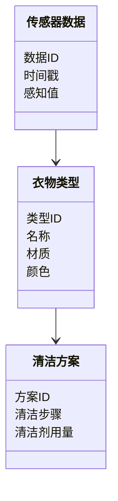
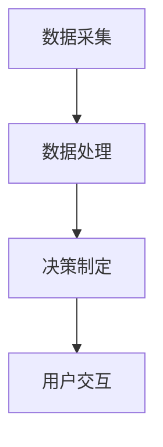

                 


# AI Agent在智能衣架中的衣物清洁建议

> 关键词：AI Agent, 智能衣架, 衣物清洁, 机器学习, 传感器数据

> 摘要：本文探讨了AI Agent在智能衣架中的衣物清洁建议，从背景介绍到系统设计，再到项目实战，详细分析了AI Agent如何通过感知、决策和执行阶段优化衣物清洁过程。文章还提供了数学模型、算法原理和系统架构的详细解读，帮助读者理解AI Agent在智能衣架中的应用。

---

# 第1章: AI Agent与智能衣架的基本概念

## 1.1 AI Agent的定义与特点

### 1.1.1 AI Agent的基本概念
AI Agent（人工智能代理）是一种能够感知环境、做出决策并执行操作的智能实体。它通过传感器获取信息，利用算法处理数据，从而实现自主任务执行。AI Agent的核心在于其智能性，能够根据环境变化动态调整行为。

### 1.1.2 AI Agent的核心特点
- **自主性**：AI Agent能够在没有外部干预的情况下自主运行。
- **反应性**：能够实时感知环境变化并做出反应。
- **学习能力**：通过机器学习算法不断优化决策模型。
- **可扩展性**：能够适应不同规模的应用场景。

### 1.1.3 AI Agent与传统自动化系统的区别
传统自动化系统依赖预设的规则和程序，而AI Agent具备学习和适应能力，能够根据实时数据做出优化决策。例如，在智能衣架中，AI Agent可以根据衣物材质和污渍情况动态调整清洁方案，而传统系统只能按照固定模式运行。

---

## 1.2 智能衣架的定义与应用场景

### 1.2.1 智能衣架的基本概念
智能衣架是一种结合了物联网（IoT）和AI技术的衣物管理设备。它通过传感器和AI算法，能够自动检测衣物的状态（如材质、颜色、污渍程度）并推荐清洁方案。

### 1.2.2 智能衣架的主要功能
- **衣物检测**：通过传感器识别衣物的材质、颜色和污渍程度。
- **清洁建议**：基于检测结果推荐最佳清洁方式（如手洗、机洗、干洗）。
- **能源优化**：通过AI算法优化清洁过程中的水、电、洗涤剂的使用，减少浪费。

### 1.2.3 智能衣架在衣物清洁中的应用场景
- **家庭使用**：用户可以通过智能衣架快速获取衣物清洁建议，避免错误清洁导致衣物损坏。
- **洗衣店**：洗衣店可以使用智能衣架提高清洁效率，减少人工判断的误差。
- **智能衣物护理设备**：智能衣架可以与洗衣机、干洗机等设备联动，实现全自动清洁流程。

---

## 1.3 AI Agent在智能衣架中的作用

### 1.3.1 AI Agent在智能衣架中的核心功能
- **数据采集**：通过传感器获取衣物的物理特性（如材质、颜色、重量）和环境数据（如温度、湿度）。
- **数据处理**：利用机器学习算法分析数据，识别衣物类型和污渍程度。
- **决策制定**：根据分析结果生成清洁建议，并优化清洁方案以减少资源消耗。

### 1.3.2 AI Agent如何提升衣物清洁效率
AI Agent通过实时数据分析和动态决策，能够快速调整清洁参数，避免传统清洁方法中的人为错误和资源浪费。例如，AI Agent可以根据衣物材质自动调整洗涤剂用量，减少对衣物的损害。

### 1.3.3 AI Agent在智能衣架中的未来发展
随着AI技术的不断进步，AI Agent在智能衣架中的应用将更加智能化和个性化。未来，AI Agent可能具备更强大的学习能力，能够根据用户的偏好和生活习惯提供定制化的清洁建议。

---

## 1.4 本章小结
本章介绍了AI Agent和智能衣架的基本概念，并分析了AI Agent在智能衣架中的作用及其优势。通过对比传统自动化系统和AI Agent，读者可以更好地理解AI技术在衣物清洁中的创新应用。

---

# 第2章: AI Agent在智能衣架中的衣物清洁建议背景

## 2.1 衣物清洁的基本问题

### 2.1.1 衣物清洁的基本流程
衣物清洁的基本流程包括洗涤、漂洗、脱水和干燥。传统清洁过程中，用户需要手动选择洗涤模式和清洁剂类型，容易因误判导致衣物损坏。

### 2.1.2 衣物清洁中的常见问题
- **误判衣物材质**：错误的清洁方式可能导致衣物损坏。
- **清洁剂用量不当**：过多或过少的清洁剂会影响清洁效果。
- **能源浪费**：传统清洁过程缺乏优化，可能导致水、电的浪费。

### 2.1.3 衣物清洁的智能化需求
随着环保意识的增强和科技的进步，用户对智能化、高效的清洁方式需求日益增加。AI Agent通过实时数据分析和动态决策，能够显著提高清洁效率并减少资源消耗。

---

## 2.2 AI Agent在衣物清洁中的优势

### 2.2.1 AI Agent如何解决衣物清洁问题
AI Agent通过传感器获取衣物的物理特性，结合环境数据，动态调整清洁参数。例如，当检测到衣物材质为丝绸时，AI Agent会自动选择温和的清洁模式，避免损坏衣物。

### 2.2.2 AI Agent在衣物清洁中的智能化优势
- **实时感知**：AI Agent能够实时感知衣物状态和环境变化，做出快速反应。
- **动态优化**：通过机器学习算法不断优化清洁方案，提高清洁效率。
- **资源节约**：AI Agent通过优化清洁过程中的资源使用，减少能源浪费。

### 2.2.3 AI Agent在衣物清洁中的创新应用
AI Agent不仅能够提供清洁建议，还可以与智能洗衣机、干洗机等设备联动，实现全自动清洁流程。例如，当AI Agent检测到衣物需要清洗时，可以直接触发洗衣机的清洗程序，并根据衣物特性调整洗涤参数。

---

## 2.3 智能衣架与AI Agent的结合

### 2.3.1 AI Agent在智能衣架中的协同工作
AI Agent通过传感器获取衣物的物理特性（如材质、颜色、污渍程度），结合环境数据（如温度、湿度）进行分析，生成清洁建议。

### 2.3.2 AI Agent在智能衣架中的数据处理
AI Agent通过机器学习算法处理传感器数据，识别衣物类型和污渍程度。例如，使用决策树算法分类衣物材质，使用协同过滤算法推荐清洁方案。

### 2.3.3 AI Agent在智能衣架中的用户交互
AI Agent通过智能衣架的用户界面（如手机App或显示屏）向用户展示清洁建议，并根据用户反馈不断优化建议。例如，用户可以选择接受或修改AI Agent的建议，并将反馈用于模型优化。

---

## 2.4 本章小结
本章分析了AI Agent在智能衣架中的衣物清洁建议的背景，探讨了AI Agent在衣物清洁中的优势及其与智能衣架的结合方式。通过对比传统清洁方法和AI Agent的应用，读者可以理解AI技术在衣物清洁中的创新价值。

---

# 第3章: AI Agent在智能衣架中的核心概念与联系

## 3.1 AI Agent的核心概念

### 3.1.1 AI Agent的基本原理
AI Agent通过感知环境、分析数据和做出决策来实现任务。其基本流程包括感知、决策和执行三个阶段。

### 3.1.2 AI Agent的感知、决策与执行
- **感知阶段**：AI Agent通过传感器获取环境数据。
- **决策阶段**：AI Agent利用算法分析数据，生成决策。
- **执行阶段**：AI Agent根据决策执行操作。

### 3.1.3 AI Agent的分类与应用场景
AI Agent可以根据应用场景分为多种类型，如基于规则的AI Agent和基于学习的AI Agent。在智能衣架中，AI Agent主要应用于数据处理和决策制定。

---

## 3.2 AI Agent与智能衣架的关系

### 3.2.1 AI Agent在智能衣架中的功能定位
AI Agent是智能衣架的核心组件，负责数据处理和决策制定。它通过传感器获取衣物状态和环境数据，生成清洁建议。

### 3.2.2 AI Agent与智能衣架的数据交互
AI Agent与智能衣架之间的数据交互包括传感器数据的采集、分析结果的传递和用户反馈的接收。例如，AI Agent通过传感器获取衣物材质数据，分析后生成清洁建议，并通过显示屏或手机App向用户展示。

### 3.2.3 AI Agent在智能衣架中的系统架构
AI Agent在智能衣架中的系统架构包括数据采集模块、数据处理模块和决策执行模块。数据采集模块负责获取传感器数据，数据处理模块利用机器学习算法进行分析，决策执行模块根据分析结果生成清洁建议。

---

## 3.3 AI Agent与传统衣物清洁方法的对比

### 3.3.1 传统衣物清洁方法的局限性
传统衣物清洁方法依赖人工判断，容易因误判导致衣物损坏，且清洁效率较低。

### 3.3.2 AI Agent在衣物清洁中的创新点
AI Agent通过实时数据分析和动态决策，能够显著提高清洁效率并减少资源浪费。例如，AI Agent可以根据衣物材质自动调整洗涤剂用量，避免过度使用清洁剂。

### 3.3.3 AI Agent与传统方法的优劣势对比
- **优势**：AI Agent能够快速适应环境变化，提供个性化的清洁建议。
- **劣势**：AI Agent的初始部署成本较高，且需要持续优化算法模型。

---

## 3.4 本章小结
本章分析了AI Agent的核心概念及其在智能衣架中的应用。通过对比传统衣物清洁方法和AI Agent的应用，读者可以理解AI技术在衣物清洁中的创新价值。

---

# 第4章: AI Agent在智能衣架中的数学模型与算法原理

## 4.1 AI Agent的核心算法

### 4.1.1 分类算法
分类算法用于识别衣物类型。例如，使用决策树算法（Decision Tree）或随机森林算法（Random Forest）对衣物进行分类。

$$
\text{Decision Tree} = \text{分支}(X, y) \rightarrow \text{叶子节点}(y)
$$

### 4.1.2 推荐算法
推荐算法用于生成清洁建议。例如，使用协同过滤算法（Collaborative Filtering）推荐相似衣物的清洁方案。

$$
\text{推荐结果} = \text{相似衣物}(x) \rightarrow \text{清洁方案}(y)
$$

---

## 4.2 AI Agent的感知与决策流程

### 4.2.1 感知阶段
AI Agent通过传感器获取衣物的物理特性（如材质、颜色、重量）和环境数据（如温度、湿度）。传感器数据通过数据预处理模块进行清洗和特征提取。

### 4.2.2 决策阶段
AI Agent利用机器学习算法对数据进行分析，生成清洁建议。例如，使用支持向量机（SVM）或神经网络（Neural Network）进行分类和预测。

$$
\text{清洁建议} = f(\text{衣物类型}, \text{污渍程度})
$$

---

## 4.3 AI Agent的执行与反馈

### 4.3.1 执行阶段
AI Agent根据决策结果执行操作，例如触发洗衣机的清洗程序或提醒用户进行手洗。

### 4.3.2 反馈阶段
AI Agent通过用户反馈不断优化算法模型。例如，用户可以选择接受或修改AI Agent的建议，并将反馈用于模型优化。

---

## 4.4 本章小结
本章详细讲解了AI Agent在智能衣架中的数学模型和算法原理，包括分类算法、推荐算法和决策流程。通过算法的数学表达和代码示例，读者可以理解AI Agent如何通过数据处理和决策制定优化衣物清洁过程。

---

# 第5章: AI Agent在智能衣架中的系统架构与设计

## 5.1 系统功能设计

### 5.1.1 领域模型设计
领域模型设计包括衣物类型、清洁方案、传感器数据等核心概念。通过Mermaid类图可以清晰展示系统的类和关系。



### 5.1.2 系统功能模块
系统功能模块包括数据采集、数据处理、决策制定和用户交互。每个模块的功能和交互关系通过Mermaid流程图展示。



---

## 5.2 系统架构设计

### 5.2.1 系统架构图
系统架构图展示AI Agent在智能衣架中的整体架构，包括数据采集、数据处理、决策制定和用户交互模块。


### 5.2.2 接口设计
系统接口设计包括传感器数据接口、算法接口和用户界面接口。通过Restful API实现模块之间的数据交互。

---

## 5.3 本章小结
本章分析了AI Agent在智能衣架中的系统架构与设计，包括领域模型、系统功能模块和系统架构图。通过Mermaid图表，读者可以直观理解系统的模块组成和数据流程。

---

# 第6章: AI Agent在智能衣架中的项目实战

## 6.1 环境安装

### 6.1.1 安装Python环境
安装Python和必要的库（如NumPy、Scikit-learn、Flask）。

### 6.1.2 安装传感器模块
安装与传感器兼容的硬件模块和驱动程序。

---

## 6.2 核心实现

### 6.2.1 数据采集与处理
编写代码采集传感器数据并进行预处理。

```python
import numpy as np
from sklearn import tree

# 示例数据
data = np.array([[1, 2, 3], [4, 5, 6]])
```

### 6.2.2 算法实现
实现分类算法和推荐算法，例如决策树算法。

```python
clf = tree.DecisionTreeClassifier()
clf.fit(data, labels)
```

---

## 6.3 实际案例分析

### 6.3.1 案例背景
以一件丝绸材质的白色衬衫为例，AI Agent需要推荐适合的清洁方案。

### 6.3.2 数据分析
传感器数据包括衣物材质（丝绸）、颜色（白色）和污渍程度（轻微）。

### 6.3.3 清洁建议
AI Agent推荐使用温和的洗涤剂进行手洗，并建议低温烘干。

---

## 6.4 本章小结
本章通过实际案例展示了AI Agent在智能衣架中的项目实战，从环境安装到核心算法实现，再到实际案例分析，帮助读者理解AI Agent在衣物清洁中的具体应用。

---

# 第7章: 总结与展望

## 7.1 总结
本文详细探讨了AI Agent在智能衣架中的衣物清洁建议，从背景介绍到系统设计，再到项目实战，全面分析了AI Agent如何通过感知、决策和执行优化衣物清洁过程。

## 7.2 展望
随着AI技术的不断进步，AI Agent在智能衣架中的应用将更加智能化和个性化。未来，AI Agent可能具备更强大的学习能力，能够根据用户的偏好和生活习惯提供定制化的清洁建议。

---

# 第8章: 最佳实践与注意事项

## 8.1 最佳实践
- **数据质量**：确保传感器数据的准确性和完整性。
- **模型优化**：定期更新算法模型，提高清洁建议的准确性。
- **用户反馈**：通过用户反馈不断优化AI Agent的算法和建议。

## 8.2 注意事项
- **数据隐私**：注意保护用户的衣物数据，避免数据泄露。
- **系统稳定性**：确保AI Agent在智能衣架中的稳定运行，避免因系统故障导致清洁错误。
- **环境适应性**：优化AI Agent的环境适应能力，使其能够在不同环境中有效工作。

---

# 作者信息

作者：AI天才研究院/AI Genius Institute & 禅与计算机程序设计艺术/Zen And The Art of Computer Programming

