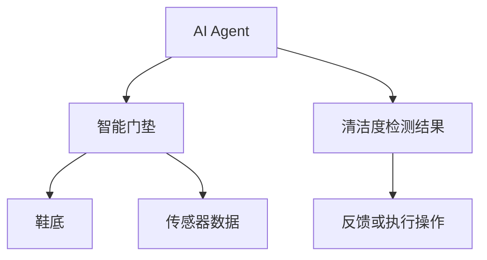
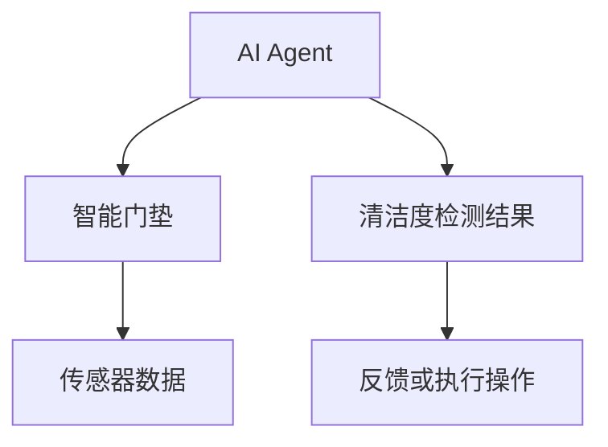
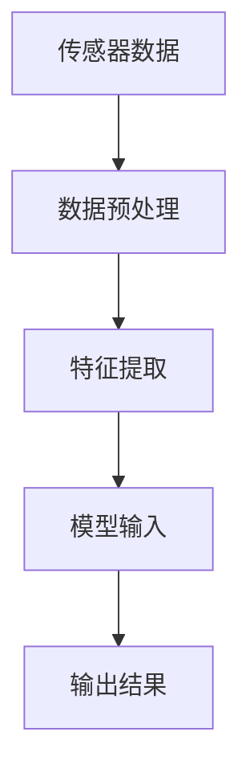
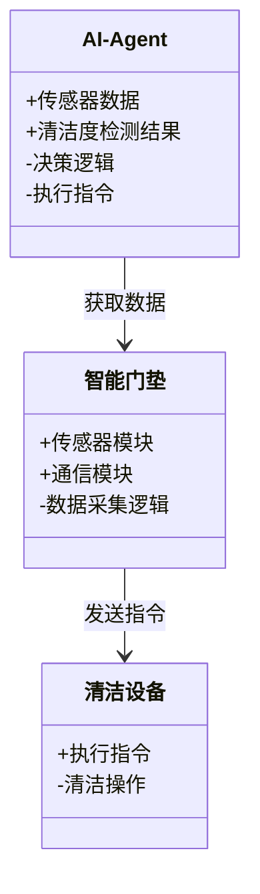
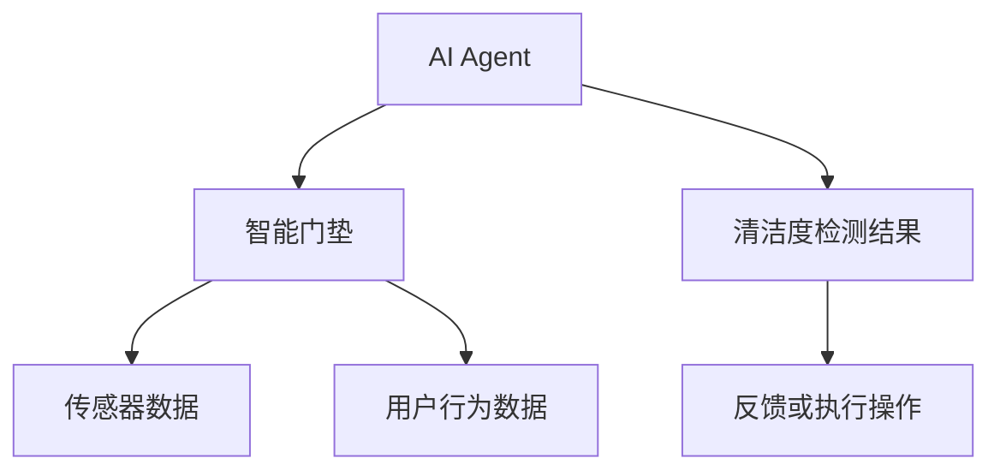
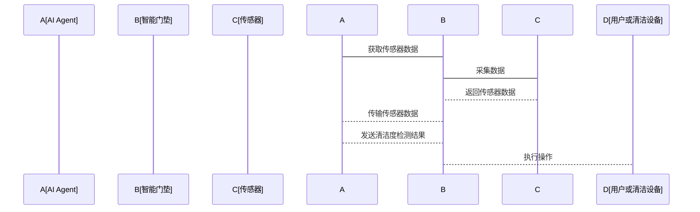

                 


# AI Agent在智能门垫中的鞋底清洁度检测

> 关键词：AI Agent, 智能门垫, 鞋底清洁度检测, 传感器数据, 机器学习, 智能家居

> 摘要：本文详细探讨了AI Agent在智能门垫中的鞋底清洁度检测技术。通过分析鞋底清洁度检测的背景、核心概念、算法原理、系统架构设计以及实际案例，本文为读者提供了从理论到实践的全面解读。文章还总结了AI Agent在智能门垫中的优势与挑战，并展望了未来的发展方向。

---

# 第一部分: 背景介绍

# 第1章: 问题背景

## 1.1 鞋底清洁度检测的重要性

鞋底清洁度检测在日常生活和公共环境中具有重要意义。清洁的鞋底可以防止灰尘、细菌和病毒的传播，同时也能延长地板的使用寿命。在智能家居环境中，鞋底清洁度检测可以与门禁系统、空气净化系统等联动，提升居住环境的舒适性和安全性。

## 1.2 智能门垫的应用场景

智能门垫是一种智能家居设备，通常安装在门入口处，用于感知用户进入或离开的行为。通过集成多种传感器，智能门垫可以检测鞋底的压力、温度、湿度等信息，并结合AI Agent进行数据分析和决策。

## 1.3 AI Agent在智能门垫中的作用

AI Agent（人工智能代理）是一种能够感知环境、自主决策并执行任务的智能系统。在智能门垫中，AI Agent负责接收传感器数据，分析鞋底清洁度，并根据检测结果提供相应的反馈或执行操作（如提醒清洁、调整清洁设备等）。

---

# 第2章: 问题描述

## 2.1 鞋底清洁度检测的定义

鞋底清洁度检测是指通过传感器或其他技术手段，对鞋底表面的清洁程度进行评估的过程。清洁度通常分为几个等级，如“非常干净”、“一般”、“需要清洁”等。

## 2.2 智能门垫的感知能力

智能门垫通过集成多种传感器（如压力传感器、光学传感器、温度传感器等）来感知鞋底的物理特性和环境信息。这些传感器数据是AI Agent进行分析和决策的基础。

## 2.3 AI Agent的决策机制

AI Agent根据传感器数据和历史信息，利用机器学习算法对鞋底清洁度进行分类和预测。根据检测结果，AI Agent可以触发相应的反馈机制，例如提醒用户清洁鞋子或启动清洁设备。

---

# 第3章: 问题解决

## 3.1 AI Agent的核心功能

AI Agent在智能门垫中的核心功能包括：

1. 数据采集与处理：接收并解析传感器数据。
2. 清洁度分析：基于传感器数据对鞋底清洁度进行分类。
3. 决策与反馈：根据分析结果触发相应的操作或反馈。

## 3.2 智能门垫的硬件与软件结合

智能门垫的硬件部分包括传感器模块、通信模块和执行机构。软件部分则负责数据处理、模型训练和任务调度。硬件与软件的结合使得智能门垫能够实现高效的鞋底清洁度检测。

## 3.3 鞋底清洁度检测的实现方式

鞋底清洁度检测可以通过以下几种方式实现：

1. **基于压力传感器的数据分析**：通过分析鞋底的压力分布来判断清洁度。
2. **基于光学传感器的图像识别**：通过拍摄鞋底图像，利用图像识别技术进行分析。
3. **基于机器学习的分类模型**：利用传感器数据训练机器学习模型，实现对鞋底清洁度的分类。

---

# 第4章: 边界与外延

## 4.1 鞋底清洁度检测的适用范围

鞋底清洁度检测主要适用于家庭、办公室、酒店等室内环境。由于外部环境复杂，目前较少应用于室外场景。

## 4.2 智能门垫的环境适应性

智能门垫需要适应不同的环境条件，如温度、湿度、光照等。传感器的性能可能会受到环境因素的影响，因此需要进行环境补偿和自适应调整。

## 4.3 AI Agent的性能限制

AI Agent的性能受到传感器精度、模型训练数据质量和计算能力的限制。在复杂场景下，AI Agent可能会出现误判或漏判的情况。

---

# 第5章: 概念结构与核心要素组成

## 5.1 概念框架图



## 5.2 核心要素对比表

| 核心要素 | 描述 |
|----------|------|
| 传感器模块 | 用于采集鞋底的物理特性数据 |
| AI Agent | 负责数据处理、分析和决策 |
| 清洁度分类模型 | 用于对鞋底清洁度进行分类 |
| 反馈机制 | 根据检测结果触发相应操作 |

---

# 第二部分: 核心概念与联系

# 第6章: AI Agent的核心原理

## 6.1 AI Agent的定义与属性

AI Agent是一种能够感知环境、自主决策并执行任务的智能系统。其核心属性包括：

1. **感知能力**：通过传感器获取环境数据。
2. **决策能力**：基于数据进行分析和判断。
3. **执行能力**：根据决策结果执行相应操作。
4. **学习能力**：通过反馈优化自身的算法模型。

## 6.2 智能门垫的传感器与数据采集

智能门垫通常集成多种传感器，包括：

1. **压力传感器**：用于检测鞋底的压力分布。
2. **光学传感器**：用于拍摄鞋底图像。
3. **温度传感器**：用于检测鞋底温度。

传感器数据的采集和预处理是AI Agent进行分析的基础。

## 6.3 AI Agent与智能门垫的实体关系



---

# 第三部分: 算法原理讲解

# 第7章: AI Agent的算法原理

## 7.1 数据流处理流程



## 7.2 算法模型选择

### 7.2.1 卷积神经网络（CNN）的使用

卷积神经网络是一种常用的图像识别算法，适用于基于光学传感器的鞋底清洁度检测。

### 7.2.2 模型训练流程

1. 数据采集与标注
2. 数据预处理（归一化、增强等）
3. 模型训练（使用训练集进行优化）
4. 模型验证（使用验证集评估性能）
5. 模型部署（应用于实际场景）

### 7.2.3 模型优化方法

1. **超参数调优**：通过调整学习率、批量大小等参数优化模型性能。
2. **数据增强**：通过增加数据多样性提升模型的泛化能力。
3. **迁移学习**：利用预训练模型加速训练过程。

## 7.3 算法实现代码

```python
import tensorflow as tf
from tensorflow.keras import layers

# 定义卷积神经网络模型
model = tf.keras.Sequential([
    layers.Conv2D(32, (3,3), activation='relu', input_shape=(64,64,3)),
    layers.MaxPooling2D((2,2)),
    layers.Conv2D(64, (3,3), activation='relu'),
    layers.MaxPooling2D((2,2)),
    layers.Flatten(),
    layers.Dense(128, activation='relu'),
    layers.Dense(3, activation='softmax')
])

# 编译模型
model.compile(optimizer='adam', loss='sparse_categorical_crossentropy', metrics=['accuracy'])
```

---

# 第四部分: 系统分析与架构设计方案

# 第8章: 系统架构设计

## 8.1 问题场景介绍

智能门垫需要在复杂的环境中实现鞋底清洁度检测，同时需要与其他智能家居设备联动。

## 8.2 系统功能设计

### 8.2.1 领域模型（类图）



## 8.3 系统架构设计



## 8.4 系统接口设计

1. **传感器数据接口**：定义传感器数据的格式和传输协议。
2. **用户行为数据接口**：定义用户行为数据的采集和处理方式。
3. **反馈接口**：定义AI Agent向用户或清洁设备发送反馈的接口。

## 8.5 系统交互流程



---

# 第五部分: 项目实战

# 第9章: 项目实战

## 9.1 环境安装

1. **安装Python**：确保安装Python 3.8或更高版本。
2. **安装TensorFlow**：用于机器学习模型的训练和部署。
3. **安装Mermaid**：用于绘制图表。
4. **安装其他依赖**：根据具体需求安装其他库。

## 9.2 核心实现代码

```python
import numpy as np
import tensorflow as tf
from tensorflow.keras import layers

# 数据预处理
def preprocess_data(data, labels):
    data = data.astype('float32') / 255.0
    return data, labels

# 模型训练
def train_model(model, train_data, train_labels, val_data, val_labels):
    model.compile(optimizer='adam', loss='sparse_categorical_crossentropy', metrics=['accuracy'])
    history = model.fit(train_data, train_labels, epochs=10, batch_size=32, validation_data=(val_data, val_labels))
    return model, history

# 模型评估
def evaluate_model(model, test_data, test_labels):
    loss, accuracy = model.evaluate(test_data, test_labels, batch_size=32)
    print(f"Test loss: {loss}, Test accuracy: {accuracy}")
```

## 9.3 案例分析与详细解读

### 9.3.1 数据采集与预处理

1. 通过光学传感器拍摄鞋底图像。
2. 对图像进行归一化处理，并将图像分割为多个区域进行特征提取。

### 9.3.2 模型训练与优化

1. 使用预处理后的数据训练卷积神经网络模型。
2. 通过调整超参数和数据增强优化模型性能。

### 9.3.3 系统集成与测试

1. 将训练好的模型部署到智能门垫中。
2. 进行实际测试，验证系统的稳定性和准确性。

---

# 第六部分: 总结与展望

# 第10章: 总结与展望

## 10.1 核心内容总结

本文详细探讨了AI Agent在智能门垫中的鞋底清洁度检测技术，从背景介绍、核心概念、算法原理到系统架构设计和项目实战，为读者提供了全面的解读。

## 10.2 未来展望

随着人工智能和传感器技术的不断发展，AI Agent在智能门垫中的应用将更加广泛。未来的研究方向包括：

1. **多模态传感器融合**：结合多种传感器数据提升检测精度。
2. **实时反馈优化**：通过实时数据反馈优化AI Agent的决策能力。
3. **边缘计算优化**：提升智能门垫的本地计算能力，降低云端依赖。

---

# 参考文献

1. LeCun, Y., Bengio, Y., & Hinton, G. (2015). Deep learning. Nature, 521(7555), 436-444.
2. Redmon, J., & Farhadi, A. (2018). YOLOv3: An Incremental Improvement. arXiv preprint arXiv:1804.02688.
3. Goodfellow, I., Bengio, Y., & Courville, A. (2016). Deep learning. MIT Press.

---

# 附录

## 附录A: 鞋底清洁度分类标准

| 分类标准 | 描述 |
|----------|------|
| 1        | 非常干净 |
| 2        | 一般干净 |
| 3        | 需要清洁 |

## 附录B: 传感器数据格式

| 传感器类型 | 数据格式 |
|------------|----------|
| 压力传感器 | (压力值, 坐标) |
| 光学传感器 | (RGB值, 坐标) |
| 温度传感器 | 温度值 |

---

# 作者

作者：AI天才研究院/AI Genius Institute & 禅与计算机程序设计艺术 /Zen And The Art of Computer Programming

