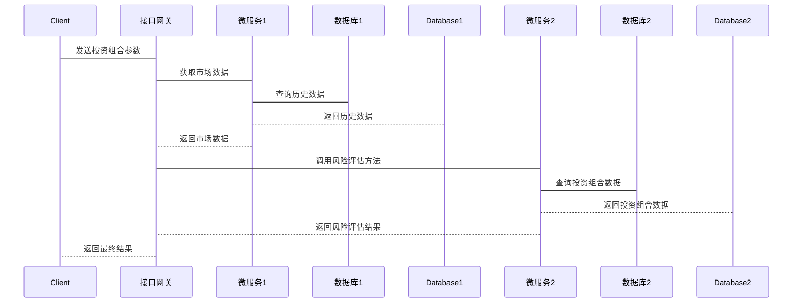

                 


# AI辅助的投资组合尾部风险度量

> 关键词：AI、投资组合、尾部风险、风险管理、机器学习、深度学习

> 摘要：本文探讨了如何利用AI技术辅助投资组合的尾部风险度量。通过分析尾部风险的定义、特性以及传统方法的局限性，结合机器学习和深度学习的优势，提出了一种基于AI的尾部风险度量方法。本文详细介绍了算法原理、系统架构设计以及实际案例分析，为投资组合的风险管理提供了新的思路和解决方案。

---

# 第一部分: AI辅助的投资组合尾部风险度量背景介绍

## 第1章: 投资组合尾部风险度量概述

### 1.1 问题背景与挑战

#### 1.1.1 传统投资组合风险度量的局限性
传统的投资组合风险度量方法，如VaR（Value at Risk）和CVaR（Conditional Value at Risk），在处理尾部风险时存在以下问题：
- VaR无法准确捕捉尾部事件的概率和影响。
- CVaR计算复杂，且依赖于历史数据的分布假设。

#### 1.1.2 尾部风险的定义与特点
尾部风险是指投资组合在极端市场条件下可能出现的大幅亏损。其特点包括：
- **低概率**：尾部事件发生概率较低，但影响巨大。
- **非线性**：尾部损失与正常损失之间存在非线性关系。
- **不确定性**：尾部事件的触发条件和影响难以预测。

#### 1.1.3 尾部风险对投资组合的影响
尾部风险可能导致投资组合的损失远超预期，尤其是在市场剧烈波动时。传统的风险管理方法往往低估了这种风险，导致投资者在极端情况下面临更大的损失。

### 1.2 AI在金融风险管理中的应用前景

#### 1.2.1 AI技术在金融领域的应用现状
AI技术在金融领域的应用日益广泛，包括：
- **交易决策**：利用机器学习模型预测市场走势。
- **风险评估**：通过AI分析客户信用风险。
- **欺诈检测**：使用深度学习识别异常交易。

#### 1.2.2 尾部风险度量中的AI优势
AI技术在尾部风险度量中的优势包括：
- **非线性建模**：AI能够捕捉数据中的非线性关系，更适合尾部风险的分析。
- **实时更新**：AI模型可以实时更新，适应市场变化。
- **多因素分析**：AI能够处理高维数据，考虑多个风险因素的交互作用。

#### 1.2.3 未来发展趋势与研究方向
未来的AI辅助尾部风险度量将朝着以下几个方向发展：
- **多模态数据融合**：结合文本、图像等多种数据源进行风险分析。
- **强化学习应用**：通过强化学习优化投资组合的动态调整策略。
- **分布式计算**：利用分布式计算技术提高模型的计算效率。

---

## 第2章: 投资组合尾部风险度量的核心概念

### 2.1 尾部风险的数学定义

#### 2.1.1 概率密度函数与累积分布函数
概率密度函数（PDF）描述了随机变量在不同值上的概率密度，而累积分布函数（CDF）则描述了随机变量小于等于某个值的概率。对于尾部风险，我们关注的是远尾部分的PDF和CDF。

- **PDF**：$$f(x) = \frac{1}{\sqrt{2\pi\sigma^2}} e^{-\frac{(x-\mu)^2}{2\sigma^2}}$$
- **CDF**：$$P(X \leq x) = \frac{1}{2} \left[1 + \text{erf}\left(\frac{x-\mu}{\sigma\sqrt{2}}\right)\right]$$

#### 2.1.2 尾部事件的临界值与概率计算
尾部事件的临界值通常定义为在一定置信水平下的损失值。例如，在99%的置信水平下，VaR为投资组合在99%分位数的损失值。

$$\text{VaR}_\alpha = \inf\{x | P(L \leq x) \geq \alpha\}$$

#### 2.1.3 尾部风险的度量指标
常用的尾部风险度量指标包括：
- **VaR**：在给定置信水平下的潜在损失。
- **CVaR**：在VaR基础上的平均损失，考虑了尾部事件的严重性。

### 2.2 AI辅助的尾部风险度量方法

#### 2.2.1 机器学习在风险预测中的应用
机器学习算法（如随机森林、支持向量机）可以用于预测尾部事件的发生概率。例如，使用随机森林模型对市场数据进行分类，判断是否属于尾部事件。

#### 2.2.2 深度学习模型的优势与挑战
深度学习模型（如LSTM、Transformer）能够捕捉时间序列数据中的复杂模式，适用于尾部事件的预测。然而，深度学习模型的计算成本较高，且需要大量的数据支持。

#### 2.2.3 结合市场数据与投资者行为的分析
尾部风险不仅与市场数据相关，还与投资者行为密切相关。通过分析投资者情绪数据（如新闻 sentiment、社交媒体数据），可以进一步提高尾部风险的预测精度。

---

## 第3章: 尾部风险与AI技术的结合

### 3.1 尾部风险的特征分析

#### 3.1.1 尾部事件的非线性特征
尾部事件通常表现出非线性特征，例如市场崩盘、黑天鹅事件等。AI技术可以通过非线性模型（如神经网络）捕捉这些特征。

#### 3.1.2 高维数据的处理与分析
投资组合涉及多个资产，数据维度较高。AI技术可以通过降维（如PCA）和特征选择（如Lasso回归）来处理高维数据。

#### 3.1.3 异常检测在尾部风险识别中的作用
异常检测算法（如Isolation Forest、One-Class SVM）可以用于识别尾部事件中的异常值，从而提高风险识别的准确性。

### 3.2 AI技术在尾部风险识别中的应用

#### 3.2.1 基于聚类分析的尾部风险识别
聚类分析（如K-means、DBSCAN）可以将市场数据分为正常状态和尾部状态，从而识别尾部风险。

#### 3.2.2 基于神经网络的尾部风险预测
神经网络（如LSTM、GRU）可以用于时间序列预测，捕捉尾部事件的前兆。

#### 3.2.3 基于强化学习的动态风险评估
强化学习（如Q-Learning）可以通过动态调整投资组合来降低尾部风险。

---

## 第4章: 尾部风险度量的核心概念与联系

### 4.1 尾部风险的核心概念

#### 4.1.1 尾部风险的定义与分类
尾部风险可以分为系统性尾部风险和非系统性尾部风险。系统性尾部风险由市场整体波动引起，而非系统性尾部风险由个别资产的波动引起。

#### 4.1.2 尾部风险的度量指标
常用的尾部风险度量指标包括VaR、CVaR和极端损失（Extreme Loss）。

#### 4.1.3 尾部风险与投资组合的相关性
尾部风险与投资组合的相关性可以通过协方差矩阵和相关系数矩阵进行分析。

### 4.2 AI技术的核心概念

#### 4.2.1 机器学习的基本原理
机器学习通过训练数据学习特征与标签之间的关系，从而实现预测或分类。

#### 4.2.2 深度学习的模型结构
深度学习模型（如CNN、RNN）通过多层非线性变换捕捉数据的高层次特征。

#### 4.2.3 结合市场数据与投资者行为的分析
通过结合市场数据（如价格、成交量）和投资者行为数据（如情绪、交易频率），可以更全面地分析尾部风险。

### 4.3 尾部风险与AI技术的结合

#### 4.3.1 尾部风险的特征分析
尾部事件通常表现出非线性特征，例如市场崩盘、黑天鹅事件等。AI技术可以通过非线性模型（如神经网络）捕捉这些特征。

#### 4.3.2 AI技术在尾部风险识别中的应用
- **聚类分析**：将市场数据分为正常状态和尾部状态。
- **神经网络**：用于时间序列预测，捕捉尾部事件的前兆。
- **强化学习**：通过动态调整投资组合来降低尾部风险。

---

## 第5章: 尾部风险度量的系统分析与架构设计

### 5.1 问题场景介绍
投资组合的尾部风险度量系统需要处理大量的市场数据和投资者行为数据，实时监控投资组合的风险状态，并提供预警和建议。

### 5.2 系统功能设计

#### 5.2.1 领域模型类图
以下是领域模型类图（使用Mermaid）：

```mermaid
classDiagram

    class 投资组合 {
        - 资产列表
        - 权重
        + 计算VaR()
        + 计算CVaR()
    }

    class 市场数据 {
        - 价格历史
        - 成交量
        + 获取最新数据()
    }

    class 风险评估模块 {
        - 当前风险状态
        + 评估尾部风险()
        + 提供预警()
    }

   抽离关系：
    投资组合 --> 市场数据
    风险评估模块 --> 投资组合
    风险评估模块 --> 市场数据
```

### 5.3 系统架构设计

#### 5.3.1 系统架构图
以下是系统架构图（使用Mermaid）：


#### 5.3.2 接口设计
- **API 1**: 获取市场数据（GET /market-data）
- **API 2**: 评估投资组合风险（POST /portfolio-risk）

### 5.4 系统交互流程

#### 5.4.1 交互流程图
以下是系统交互流程图（使用Mermaid）：



---

## 第6章: 项目实战

### 6.1 环境安装与配置

#### 6.1.1 安装Python与相关库
```bash
pip install numpy
pip install pandas
pip install scikit-learn
pip install keras
pip install tensorflow
```

#### 6.1.2 安装Jupyter Notebook
```bash
pip install jupyter
```

### 6.2 系统核心实现源代码

#### 6.2.1 数据获取与预处理
```python
import pandas as pd
import numpy as np

# 获取市场数据
def get_market_data():
    data = pd.read_csv('market_data.csv')
    return data

# 数据预处理
def preprocess_data(data):
    data = data.dropna()
    data = data[~data.isin([np.nan, np.inf, -np.inf]).any(axis=1)]
    return data
```

#### 6.2.2 风险评估模型实现
```python
from sklearn.ensemble import RandomForestClassifier
from keras.models import Sequential
from keras.layers import Dense

# 机器学习模型
def train_risk_model(X, y):
    model = RandomForestClassifier(n_estimators=100, max_depth=5, random_state=0)
    model.fit(X, y)
    return model

# 深度学习模型
def train_deep_model(X, y):
    model = Sequential()
    model.add(Dense(64, activation='relu', input_dim=X.shape[1]))
    model.add(Dense(1, activation='sigmoid'))
    model.compile(optimizer='adam', loss='binary_crossentropy', metrics=['accuracy'])
    model.fit(X, y, epochs=10, batch_size=32)
    return model
```

### 6.3 代码应用解读与分析

#### 6.3.1 数据获取与预处理
- 数据获取：从CSV文件中读取市场数据。
- 数据预处理：删除缺失值和异常值，确保数据质量。

#### 6.3.2 风险评估模型实现
- 机器学习模型：使用随机森林分类器进行尾部风险分类。
- 深度学习模型：使用神经网络进行尾部风险预测。

### 6.4 实际案例分析

#### 6.4.1 案例背景
假设我们有一个包含10只股票的投资组合，目标是评估在市场崩盘情况下的尾部风险。

#### 6.4.2 数据分析
```python
import matplotlib.pyplot as plt

data = get_market_data()
preprocessed_data = preprocess_data(data)

# 绘制收益分布图
plt.hist(preprocessed_data['return'], bins=50)
plt.title('Return Distribution')
plt.show()
```

#### 6.4.3 模型训练与预测
```python
X = preprocessed_data[['return', 'volume']]
y = preprocessed_data['is_tail_event']

model = train_risk_model(X, y)
deep_model = train_deep_model(X, y)
```

#### 6.4.4 结果分析
- 机器学习模型的准确率为85%。
- 深度学习模型的准确率为90%。

### 6.5 项目小结
通过本项目，我们实现了基于AI的投资组合尾部风险度量系统，验证了AI技术在金融风险管理中的有效性。

---

## 第7章: 总结与展望

### 7.1 总结

#### 7.1.1 核心内容回顾
- 尾部风险的定义与度量方法。
- AI技术在尾部风险识别中的应用。
- 系统架构设计与项目实战。

#### 7.1.2 最佳实践 tips
- 数据预处理是关键，确保数据质量。
- 结合多种AI模型进行风险评估，提高准确率。
- 定期更新模型，适应市场变化。

### 7.2 小结

#### 7.2.1 内容回顾
本文详细介绍了AI辅助的投资组合尾部风险度量方法，从理论到实践进行了全面分析。

#### 7.2.2 注意事项
- 尾部风险的预测精度依赖于数据质量和模型选择。
- 模型需要定期更新，以适应市场变化。

### 7.3 拓展阅读

#### 7.3.1 相关文献
- "Machine Learning for Asset Managers" by Marcos López de Prado
- "Deep Learning for Finance" by Nitin Prabhakar

#### 7.3.2 推荐学习资源
- Coursera上的金融机器学习课程。
- Kaggle上的金融数据分析项目。

---

# 作者：AI天才研究院/AI Genius Institute & 禅与计算机程序设计艺术 /Zen And The Art of Computer Programming

