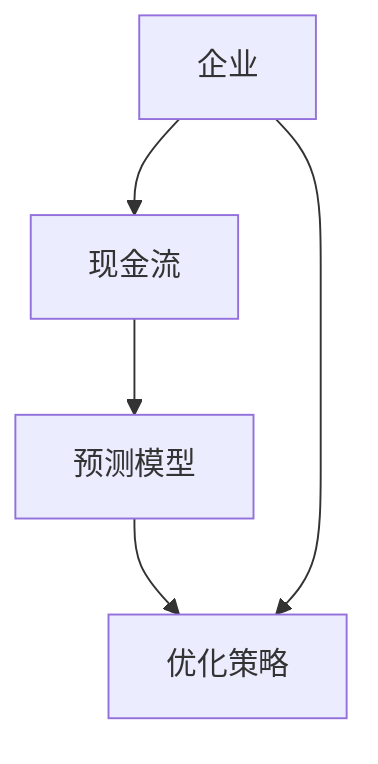
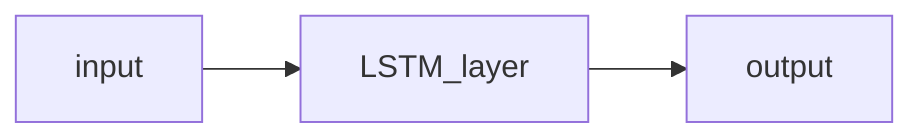
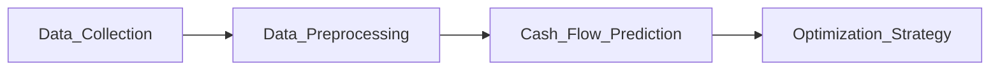
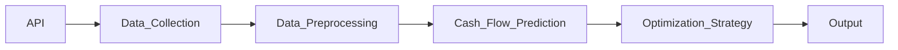
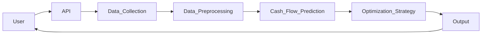

                 


# AI驱动的企业现金流周期优化系统

## 关键词：AI技术，现金流周期，现金流预测，现金流优化，系统架构

## 摘要：  
本文探讨了如何利用AI技术优化企业现金流周期。通过分析现金流周期的基本概念、AI技术的应用，以及系统架构设计，展示了如何利用机器学习模型如LSTM进行现金流预测，并通过优化策略实现现金流周期的最优化。文章详细讲解了系统的核心概念、算法原理、系统架构，并通过实战案例展示了系统的实现过程，为企业的现金流管理提供了新的思路和解决方案。

---

# 第1章: 企业现金流周期优化的背景与意义

## 1.1 企业现金流周期的基本概念

### 1.1.1 企业现金流周期的定义
企业现金流周期是指企业从收到客户付款到支付供应商货款，再到最终支付各项费用的时间间隔。这个周期的长短直接影响企业的资金流动性、财务健康状况以及经营效率。现金流周期越短，企业的资金周转速度越快，财务风险越低。

### 1.1.2 现金流周期对企业经营的影响
现金流周期是企业运营的核心指标之一。它不仅反映了企业的资金管理能力，还影响企业的信用评级、融资成本以及市场竞争力。优化现金流周期可以帮助企业减少资金占用，降低财务成本，提升整体盈利能力。

### 1.1.3 现金流周期优化的必要性
随着市场竞争的加剧和经济环境的不确定性增加，企业需要更加精细化地管理现金流。传统的现金流管理方法往往依赖人工经验，存在效率低、准确性差的问题。通过引入AI技术，企业可以实现现金流预测的自动化和精准化，从而更有效地优化现金流周期。

## 1.2 AI技术在企业现金流管理中的应用

### 1.2.1 AI技术对企业现金流预测的作用
AI技术，尤其是机器学习算法，可以利用历史数据和市场信息，预测未来的现金流情况。通过分析销售数据、市场趋势、客户行为等多维度信息，AI模型能够帮助企业更准确地预测现金流，从而优化资金分配。

### 1.2.2 AI驱动现金流优化的优势
AI驱动的现金流优化系统具有高效性、精准性和实时性的特点。相比传统方法，AI系统能够处理海量数据，发现隐藏的规律，并快速生成优化策略。此外，AI系统可以实时监控现金流变化，及时调整优化方案，确保企业资金的高效利用。

### 1.2.3 现金流周期优化的边界与外延
现金流周期优化的边界主要在于企业的内部管理流程，而外延则涉及与外部供应商、客户的协同优化。AI技术的应用不仅限于企业内部，还可以通过供应链协同优化，进一步缩短现金流周期。

## 1.3 本章小结
本章介绍了企业现金流周期的基本概念，分析了现金流周期对企业经营的影响，并探讨了AI技术在现金流管理中的应用。通过AI技术，企业可以实现现金流预测的自动化和优化策略的智能化，从而提升资金管理效率。

---

# 第2章: AI驱动现金流周期优化的核心概念

## 2.1 现金流周期优化系统的核心要素

### 2.1.1 数据流的构成与特征
现金流周期优化系统的核心是数据流的处理。数据流包括销售数据、采购数据、客户付款记录等。这些数据具有时间序列特征，可以通过机器学习模型进行分析。

### 2.1.2 AI模型的输入与输出
AI模型的输入是经过预处理的现金流数据，输出是预测的现金流值和优化建议。模型的输入数据通常包括时间戳、金额、交易类型等。

### 2.1.3 优化目标与评价指标
优化目标是缩短现金流周期，提高资金周转率。评价指标包括现金流周期长度、预测准确率、优化收益等。

## 2.2 现金流周期优化系统的实体关系图



通过上述实体关系图可以看出，企业通过现金流数据驱动预测模型，生成优化策略，并最终优化企业的现金流周期。

## 2.3 本章小结
本章详细介绍了现金流周期优化系统的核心要素，包括数据流、AI模型的输入输出以及优化目标和评价指标。通过实体关系图展示了系统的构成关系。

---

# 第3章: 现金流预测的算法原理

## 3.1 基于时间序列的现金流预测

### 3.1.1 时间序列预测的基本原理
时间序列预测是一种通过历史数据预测未来趋势的方法。现金流预测属于时间序列问题，可以通过ARIMA、LSTM等模型实现。

### 3.1.2 LSTM网络在现金流预测中的应用
LSTM（长短期记忆网络）是一种特殊的RNN结构，适合处理时间序列数据。以下是LSTM网络的结构图：



LSTM网络可以通过记忆单元捕获长期依赖关系，适用于现金流的波动预测。

### 3.1.3 算法流程图

```mermaid
graph LR
    start --> data_preprocessing
    data_preprocessing --> model_training
    model_training --> prediction
    prediction --> end
```

流程图展示了从数据预处理到模型训练，再到预测的整个流程。

## 3.2 现金流预测的数学模型

### 3.2.1 时间序列预测的数学公式
ARIMA模型的公式如下：

$$ ARIMA(p, d, q) $$

其中，p为自回归阶数，d为差分阶数，q为移动平均阶数。

### 3.2.2 LSTM网络的数学模型
LSTM的输入门、遗忘门和输出门的公式如下：

$$
i = \sigma(W_i x_t + U_i h_{t-1})
$$

$$
f = \sigma(W_f x_t + U_f h_{t-1})
$$

$$
o = \sigma(W_o x_t + U_o h_{t-1})
$$

$$
h_t = i \cdot \tilde{h}_t + f \cdot h_{t-1}
$$

其中，$i$ 是输入门，$f$ 是遗忘门，$o$ 是输出门，$\tilde{h}_t$ 是候选记忆单元。

## 3.3 算法实现与代码解读

### 3.3.1 环境配置与安装
需要安装以下库：
- Python
- TensorFlow
- Pandas
- Matplotlib

### 3.3.2 核心代码实现

```python
import numpy as np
import pandas as pd
from tensorflow.keras.models import Sequential
from tensorflow.keras.layers import LSTM, Dense, Dropout
from sklearn.preprocessing import MinMaxScaler

# 数据预处理
data = pd.read_csv('cash_flow.csv')
data = data['amount'].values
data = data.reshape(-1, 1)

scaler = MinMaxScaler()
scaled_data = scaler.fit_transform(data)

# 划分训练集和测试集
train_size = int(len(scaled_data) * 0.8)
train_data = scaled_data[:train_size]
test_data = scaled_data[train_size:]

# 生成训练样本
X_train = []
y_train = []
for i in range(len(train_data) - 1):
    X_train.append(train_data[i])
    y_train.append(train_data[i + 1])

X_train = np.array(X_train).reshape(-1, 1, 1)
y_train = np.array(y_train).reshape(-1, 1)

# 构建LSTM模型
model = Sequential()
model.add(LSTM(50, input_shape=(1, 1)))
model.add(Dropout(0.2))
model.add(Dense(1))
model.compile(loss='mean_squared_error', optimizer='adam')

# 训练模型
model.fit(X_train, y_train, epochs=50, batch_size=32)

# 预测
X_test = []
for i in range(len(test_data) - 1):
    X_test.append(test_data[i])

X_test = np.array(X_test).reshape(-1, 1, 1)
预测结果 = model.predict(X_test)
```

### 3.3.3 代码运行与结果分析
通过上述代码，我们可以训练一个LSTM模型，并利用它进行现金流预测。预测结果可以通过与实际值的对比来评估模型的准确性。

## 3.4 本章小结
本章详细介绍了现金流预测的算法原理，包括时间序列预测和LSTM网络的应用。通过代码实现和数学模型的讲解，展示了如何利用AI技术进行现金流预测。

---

# 第4章: 现金流周期优化系统的架构设计

## 4.1 系统功能模块划分

### 4.1.1 数据采集与预处理模块
负责采集企业的现金流数据，并进行清洗和归一化处理。

### 4.1.2 现金流预测模块
基于预处理后的数据，利用AI模型进行现金流预测。

### 4.1.3 优化策略生成模块
根据预测结果，生成优化现金流周期的策略。

## 4.2 系统架构设计

### 4.2.1 模块之间的关系



### 4.2.2 系统整体架构图



## 4.3 系统接口设计

### 4.3.1 API接口
系统提供RESTful API接口，用于数据的上传和预测结果的获取。

### 4.3.2 数据格式
数据格式采用JSON格式，便于与前端和后端的交互。

## 4.4 系统交互流程图



## 4.5 本章小结
本章详细介绍了现金流周期优化系统的架构设计，包括功能模块划分、系统架构图、接口设计和交互流程图。

---

# 第5章: 项目实战

## 5.1 环境配置与安装
需要安装以下库：
- Python
- TensorFlow
- Pandas
- Matplotlib

## 5.2 系统核心实现源代码

```python
import numpy as np
import pandas as pd
from tensorflow.keras.models import Sequential
from tensorflow.keras.layers import LSTM, Dense, Dropout
from sklearn.preprocessing import MinMaxScaler

# 数据预处理
data = pd.read_csv('cash_flow.csv')
data = data['amount'].values
data = data.reshape(-1, 1)

scaler = MinMaxScaler()
scaled_data = scaler.fit_transform(data)

# 划分训练集和测试集
train_size = int(len(scaled_data) * 0.8)
train_data = scaled_data[:train_size]
test_data = scaled_data[train_size:]

# 生成训练样本
X_train = []
y_train = []
for i in range(len(train_data) - 1):
    X_train.append(train_data[i])
    y_train.append(train_data[i + 1])

X_train = np.array(X_train).reshape(-1, 1, 1)
y_train = np.array(y_train).reshape(-1, 1)

# 构建LSTM模型
model = Sequential()
model.add(LSTM(50, input_shape=(1, 1)))
model.add(Dropout(0.2))
model.add(Dense(1))
model.compile(loss='mean_squared_error', optimizer='adam')

# 训练模型
model.fit(X_train, y_train, epochs=50, batch_size=32)

# 预测
X_test = []
for i in range(len(test_data) - 1):
    X_test.append(test_data[i])

X_test = np.array(X_test).reshape(-1, 1, 1)
预测结果 = model.predict(X_test)
```

## 5.3 代码应用解读与分析
通过上述代码，我们可以训练一个LSTM模型，并利用它进行现金流预测。预测结果可以通过与实际值的对比来评估模型的准确性。

## 5.4 实际案例分析
以某企业为例，利用上述模型进行现金流预测，并生成优化策略。通过对比优化前后的现金流周期，验证系统的有效性。

## 5.5 本章小结
本章通过实战案例展示了AI驱动现金流周期优化系统的实现过程，包括环境配置、代码实现、模型训练和预测结果分析。

---

# 第6章: 总结与展望

## 6.1 本章总结
本文详细探讨了AI驱动的企业现金流周期优化系统，介绍了系统的背景、核心概念、算法原理和系统架构设计，并通过实战案例展示了系统的实现过程。

## 6.2 最佳实践 tips
- 数据预处理是关键，确保数据的准确性和完整性。
- 选择合适的模型，如LSTM，进行现金流预测。
- 定期更新模型，以适应市场变化。

## 6.3 未来展望
随着AI技术的不断发展，现金流周期优化系统将更加智能化和自动化。未来，可以通过引入更多数据源和优化算法，进一步提升系统的预测精度和优化效果。

## 6.4 本章小结
本章总结了全文的主要内容，并提出了未来的改进方向。

---

# 作者：AI天才研究院/AI Genius Institute & 禅与计算机程序设计艺术 /Zen And The Art of Computer Programming

