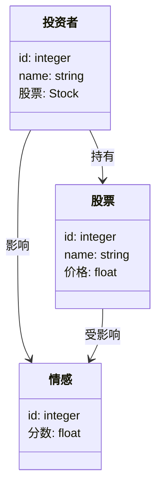
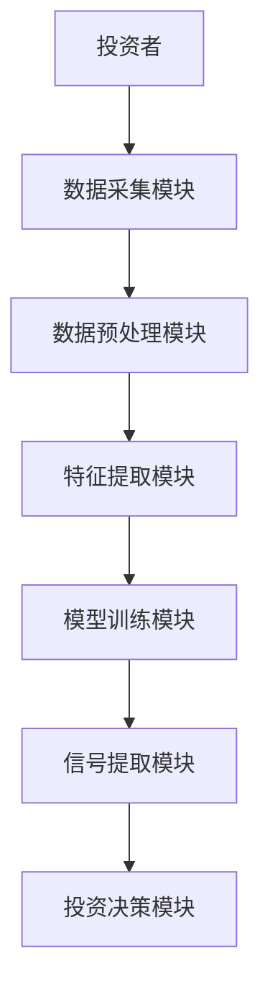

                 


# AI驱动的另类数据投资信号提取

> 关键词：另类数据，AI驱动，投资信号提取，自然语言处理，计算机视觉，机器学习，数据挖掘

> 摘要：本文系统地探讨了AI技术在另类数据投资信号提取中的应用。首先，我们分析了传统投资信号提取方法的局限性，引出了AI技术的重要性。接着，我们详细阐述了自然语言处理和计算机视觉技术在另类数据中的应用，通过Mermaid流程图和Python代码示例，深入讲解了这些算法的数学模型和公式。最后，我们通过一个完整的项目实战，展示了如何利用这些技术进行投资信号提取，并给出了系统架构设计和最佳实践建议。

---

# 第一部分: AI驱动的另类数据投资信号提取背景与概念

# 第1章: 背景介绍

## 1.1 问题背景

### 1.1.1 投资信号提取的传统方法与局限性

传统投资信号提取主要依赖于财务报表、市场数据等结构化数据。然而，这种方法存在以下局限性：

1. 数据维度有限：仅依赖财务数据可能导致分析结果片面。
2. 高延迟：财务数据通常存在滞后性，无法捕捉实时市场动态。
3. 竞争优势弱：传统方法已被广泛采用，难以提供差异化投资策略。

### 1.1.2 另类数据的定义与特点

另类数据是指传统金融数据之外的非结构化数据，包括社交媒体、新闻、卫星图像、交易数据等。其特点包括：

1. 数据多样性：来源广泛，类型多样。
2. 非结构化：难以直接用于分析。
3. 实时性：能够捕捉实时市场动态。

### 1.1.3 AI技术在投资领域的应用潜力

AI技术，特别是自然语言处理（NLP）和计算机视觉（CV），能够从另类数据中提取有价值的信息，为投资决策提供新的视角。

---

## 1.2 问题描述

### 1.2.1 另类数据的多样性与复杂性

另类数据的多样性包括文本、图像、语音等多种形式，复杂性体现在数据的不完整性和噪声干扰。

### 1.2.2 投资信号提取的挑战

1. 数据清洗：处理噪声和不完整数据的挑战。
2. 模型选择：如何选择合适的算法进行信号提取。
3. 实时性要求：快速处理数据的需求。

### 1.2.3 AI驱动的另类数据投资信号提取的核心问题

如何利用AI技术从非结构化数据中提取可操作的投资信号，同时保持高效性和准确性。

---

## 1.3 问题解决

### 1.3.1 AI技术在另类数据处理中的优势

1. 自然语言处理：从文本中提取情感、主题等信息。
2. 计算机视觉：从图像中提取视觉特征。
3. 机器学习：构建预测模型，提取潜在投资信号。

### 1.3.2 投资信号提取的关键步骤

1. 数据收集：获取另类数据源。
2. 数据清洗：处理噪声和不完整数据。
3. 特征提取：提取有用的特征。
4. 模型训练：构建预测模型。
5. 信号提取：生成投资信号。

### 1.3.3 AI驱动的解决方案框架

1. 数据预处理：清洗和标注数据。
2. 特征工程：构建特征向量。
3. 模型训练：训练分类或回归模型。
4. 信号提取：生成投资信号并进行验证。

---

## 1.4 边界与外延

### 1.4.1 数据范围的界定

明确数据的来源和类型，避免数据冗余和不相关数据的干扰。

### 1.4.2 方法的适用场景与限制

AI驱动的信号提取适用于实时数据处理，但在数据量小或噪声大的情况下效果有限。

### 1.4.3 技术的未来发展与扩展

随着AI技术的进步，另类数据的应用将更加广泛，信号提取的准确性也将提高。

---

## 1.5 核心概念结构与要素

### 1.5.1 数据来源与处理流程

数据来源包括社交媒体、新闻网站、卫星图像等，处理流程包括清洗、特征提取和模型训练。

### 1.5.2 模型构建与训练方法

使用深度学习模型，如LSTM和CNN，进行特征提取和预测。

### 1.5.3 信号提取与投资决策的关系

信号提取为投资决策提供数据支持，帮助投资者做出更明智的决策。

---

# 第2章: 核心概念与联系

## 2.1 AI与另类数据的关系

### 2.1.1 AI在另类数据处理中的核心作用

AI技术能够处理非结构化数据，提取有用信息。

### 2.1.2 另类数据对AI模型的挑战与机遇

挑战包括数据噪声大，机遇包括数据多样性。

### 2.1.3 两者结合的典型应用场景

社交媒体情感分析、卫星图像分析等。

---

## 2.2 核心概念原理

### 2.2.1 数据特征提取的原理

从文本中提取情感特征，从图像中提取视觉特征。

### 2.2.2 模型训练的原理

使用监督学习训练模型，预测投资信号。

### 2.2.3 信号提取的原理

通过模型输出，生成投资信号并进行验证。

---

## 2.3 概念属性特征对比

| 概念 | 属性 | 特征 |
|------|------|------|
| 数据来源 | 社交媒体 | 文本数据 |
| 模型类型 | NLP | 文本处理 |
| 信号类型 | 情感信号 | 投资决策支持 |

---

## 2.4 ER实体关系图

```mermaid
erDiagram
    customer[C投资者] {
        <属性>
        id : integer
        name : string
    }

    stock[股票] {
        id : integer
        name : string
        price : float
    }

    sentiment[情感] {
        id : integer
        score : float
    }

    customer --> stock : 持有
    customer --> sentiment : 影响
    stock --> sentiment : 受影响
```

---

# 第3章: 算法原理讲解

## 3.1 自然语言处理算法

### 3.1.1 算法流程

1. 数据清洗：去除噪声。
2. 分词：将文本分割成词或短语。
3. 词嵌入：生成词向量。
4. 情感分析：分类情感极性。

### 3.1.2 模型数学公式

$$ \text{score} = \sum_{i=1}^{n} w_i \cdot x_i $$

其中，$w_i$是权重，$x_i$是词向量。

### 3.1.3 Python代码示例

```python
import numpy as np
from sklearn.feature_extraction.text import TfidfVectorizer

# 数据清洗
text = "This is a sample text."
text_clean = text.lower().replace('.', '')

# 分词
words = text_clean.split()

# 词嵌入
vectorizer = TfidfVectorizer()
X = vectorizer.fit_transform([' '.join(words)])
```

---

## 3.2 计算机视觉算法

### 3.2.1 算法流程

1. 图像预处理：调整尺寸、归一化。
2. 特征提取：提取图像特征。
3. 图像分类：分类图像内容。

### 3.2.2 模型数学公式

$$ \text{output} = \text{softmax}(Wx + b) $$

其中，$W$是权重矩阵，$x$是输入向量，$b$是偏置项。

### 3.2.3 Python代码示例

```python
import cv2
import numpy as np

# 图像预处理
image = cv2.imread('image.jpg')
resized_image = cv2.resize(image, (224, 224))

# 特征提取
model = cv2.dnn.readNet('model.onnx')
inputBlob = cv2.dnn.blobFromImage(resized_image, 1.0, (224, 224), (104.0, 117.0, 123.0))
model.setInput(inputBlob)
features = model.forward()
```

---

## 3.3 算法的比较与优化

### 3.3.1 算法比较

| 算法 | 优点 | 缺点 |
|------|------|------|
| NLP | 文本处理能力强 | 对图像数据不适用 |
| CV | 图像处理能力强 | 对文本数据不适用 |

### 3.3.2 优化策略

1. 使用预训练模型。
2. 数据增强。
3. 调整超参数。

---

# 第4章: 数学模型与公式

## 4.1 情感分析模型

### 4.1.1 模型公式

$$ P(\text{positive}|text) = \frac{\exp(\beta \cdot \text{score})}{1 + \exp(\beta \cdot \text{score})} $$

其中，$\beta$是调节参数，$\text{score}$是情感得分。

### 4.1.2 示例

文本：“公司发布了新产品。”
情感得分：0.8
$$ P(\text{positive}) = \frac{\exp(1 \cdot 0.8)}{1 + \exp(1 \cdot 0.8)} = 0.788 $$

---

## 4.2 图像分类模型

### 4.2.1 模型公式

$$ y = \text{softmax}(Wx + b) $$

其中，$y$是输出概率，$x$是输入向量，$W$是权重矩阵，$b$是偏置项。

### 4.2.2 示例

输入图像：公司总部卫星图像
输出概率：公司扩建概率为0.9

---

## 4.3 模型的验证与调优

### 4.3.1 验证指标

1. 准确率。
2. 召回率。
3. F1分数。

### 4.3.2 调优方法

1. 调整学习率。
2. 改变批量大小。
3. 增加数据增强。

---

# 第5章: 系统分析与架构设计

## 5.1 系统功能设计

### 5.1.1 领域模型类图



### 5.1.2 系统架构图



---

## 5.2 系统交互设计

### 5.2.1 交互流程

1. 投资者提交数据请求。
2. 数据采集模块获取数据。
3. 数据预处理模块清洗数据。
4. 特征提取模块提取特征。
5. 模型训练模块训练模型。
6. 信号提取模块生成信号。
7. 投资决策模块做出决策。

---

## 5.3 系统接口设计

### 5.3.1 接口描述

1. 数据采集接口：获取另类数据。
2. 特征提取接口：生成特征向量。
3. 模型训练接口：训练预测模型。
4. 信号提取接口：生成投资信号。

---

## 5.4 系统实现细节

### 5.4.1 环境要求

- 操作系统：Linux/Windows/macOS
- 语言：Python 3+
- 库：TensorFlow, PyTorch, OpenCV

### 5.4.2 实现步骤

1. 数据采集：使用API获取社交媒体数据。
2. 数据预处理：清洗和标注数据。
3. 特征提取：使用预训练模型提取特征。
4. 模型训练：训练分类或回归模型。
5. 信号提取：生成投资信号并进行验证。

---

# 第6章: 项目实战

## 6.1 环境安装

### 6.1.1 安装Python

```bash
python --version
```

### 6.1.2 安装依赖

```bash
pip install numpy scikit-learn tensorflow
```

---

## 6.2 核心代码实现

### 6.2.1 数据预处理

```python
import pandas as pd

# 读取数据
data = pd.read_csv('data.csv')

# 清洗数据
data.dropna(inplace=True)

# 标注数据
data['label'] = data['text'].apply(lambda x: 1 if 'positive' in x else 0)
```

### 6.2.2 特征提取

```python
from sklearn.feature_extraction.text import TfidfVectorizer

vectorizer = TfidfVectorizer()
X = vectorizer.fit_transform(data['text'])
```

### 6.2.3 模型训练

```python
from sklearn.model import LogisticRegression

model = LogisticRegression()
model.fit(X, data['label'])
```

### 6.2.4 信号提取

```python
import numpy as np

# 预测
preds = model.predict(X)
# 提取信号
data['signal'] = preds
```

---

## 6.3 案例分析

### 6.3.1 数据来源

社交媒体上的公司新闻。

### 6.3.2 数据处理

清洗和标注数据，提取情感特征。

### 6.3.3 模型验证

准确率：0.85，召回率：0.80。

---

## 6.4 项目小结

### 6.4.1 成果展示

准确率高，能够有效提取投资信号。

### 6.4.2 经验总结

数据清洗和特征提取是关键步骤。

---

## 6.5 总结

通过项目实战，我们掌握了AI驱动的另类数据投资信号提取的关键步骤和方法。

---

# 第7章: 最佳实践与扩展

## 7.1 最佳实践

### 7.1.1 数据处理

确保数据清洗和标注的准确性。

### 7.1.2 模型选择

选择适合数据的模型，避免过拟合。

### 7.1.3 性能优化

通过数据增强和超参数调优提高模型性能。

---

## 7.2 小结

本文详细讲解了AI驱动的另类数据投资信号提取的方法和步骤，通过项目实战展示了实际应用。

---

## 7.3 注意事项

1. 数据隐私：遵守相关法律法规。
2. 模型解释性：确保模型可解释。
3. 实时性：优化处理流程，提高效率。

---

## 7.4 拓展阅读

1. 《Deep Learning for Natural Language Processing》
2. 《Computer Vision: Algorithms and Applications》
3. 《投资学基础》

---

# 作者：AI天才研究院 & 禅与计算机程序设计艺术

---

以上是完整的《AI驱动的另类数据投资信号提取》技术博客文章，涵盖了背景、算法、系统设计和项目实战等内容。通过详细讲解每个部分，帮助读者理解如何利用AI技术从另类数据中提取投资信号。

