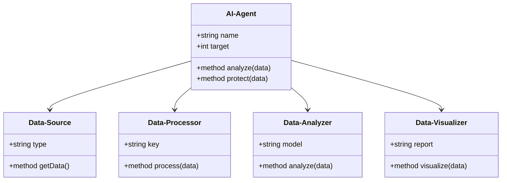
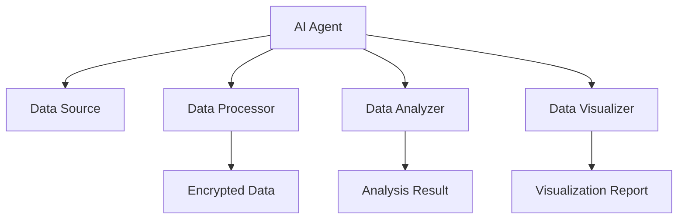
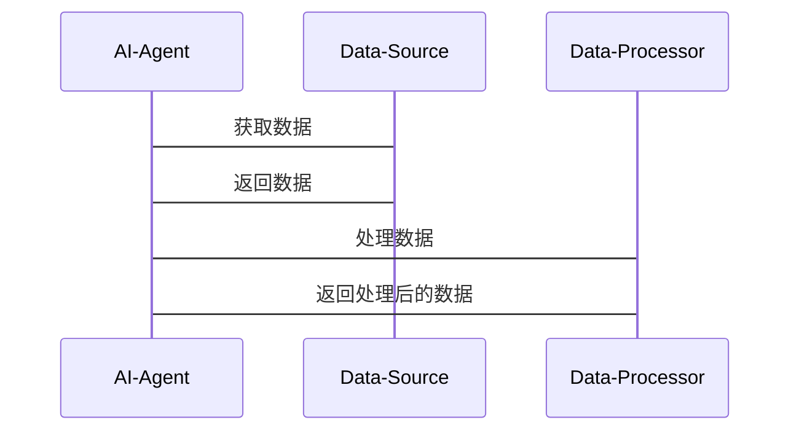

                 


# 开发具有隐私保护数据分析能力的AI Agent

## 关键词：AI Agent，隐私保护，数据分析，数据加密，差分隐私，同态加密

## 摘要：  
随着人工智能技术的快速发展，AI Agent（智能代理）在各个领域的应用越来越广泛。然而，数据分析作为AI Agent的核心功能之一，往往涉及大量的敏感数据，隐私保护问题也随之而来。本文将深入探讨如何开发具有隐私保护数据分析能力的AI Agent，从理论到实践，详细分析隐私保护的核心概念、算法原理、系统架构设计以及项目实战，帮助读者掌握如何在AI Agent中实现高效且安全的数据分析。

---

# 第一部分: AI Agent与隐私保护数据分析概述

## 第1章: AI Agent与隐私保护数据分析概述

### 1.1 AI Agent的基本概念  
AI Agent是一种智能代理系统，能够感知环境、执行任务并做出决策。在数据分析领域，AI Agent通常需要处理大量敏感数据，例如用户的个人信息、交易记录等。这些数据的处理必须在保护隐私的前提下进行，否则可能导致数据泄露和合规性问题。

#### 1.1.1 AI Agent的定义与特点  
AI Agent是指具有自主决策能力的智能体，能够通过传感器或其他输入方式感知环境，并通过执行动作来实现目标。其核心特点包括：  
1. **自主性**：能够在没有外部干预的情况下独立运行。  
2. **反应性**：能够实时感知环境变化并做出响应。  
3. **目标导向**：所有行为都围绕特定目标展开。  
4. **学习能力**：能够通过数据学习和优化自身行为。  

#### 1.1.2 数据分析在AI Agent中的作用  
数据分析是AI Agent的核心功能之一，主要用于从数据中提取有价值的信息，支持决策和优化。例如，在金融领域，AI Agent可以通过数据分析检测欺诈交易；在医疗领域，AI Agent可以通过数据分析辅助诊断。  

#### 1.1.3 隐私保护的重要性  
随着数据量的增加，数据隐私保护变得尤为重要。AI Agent在处理数据时，必须确保数据的安全性，防止未经授权的访问或泄露。隐私保护不仅是法律要求，也是用户信任的基础。

---

### 1.2 隐私保护数据分析的背景与挑战  

#### 1.2.1 数据泄露的现状  
近年来，数据泄露事件频发，给个人和企业带来了巨大的损失。根据统计，超过80%的数据泄露事件与数据处理过程中的漏洞有关。AI Agent作为数据处理的核心系统，必须具备强大的隐私保护能力。

#### 1.2.2 隐私保护与数据分析的矛盾  
数据分析需要对数据进行处理和挖掘，而数据的敏感性又要求必须保护隐私。这两者看似矛盾，但通过技术手段可以在保护隐私的同时完成数据分析。

#### 1.2.3 隐私保护法规与合规要求  
全球范围内的隐私保护法规（如GDPR）要求企业在处理个人数据时必须采取严格的隐私保护措施。AI Agent的设计必须符合这些法规要求，否则可能导致法律风险。

---

### 1.3 本章小结  
本章介绍了AI Agent的基本概念、数据分析在AI Agent中的作用以及隐私保护的重要性。同时，还分析了隐私保护数据分析的背景与挑战，为后续内容奠定了基础。

---

# 第二部分: 隐私保护数据分析的核心概念与技术

## 第2章: 隐私保护数据分析的核心概念  

### 2.1 数据隐私保护的数学模型  

#### 2.1.1 数据隐私保护的定义  
数据隐私保护是指通过对数据进行加密、匿名化或其他技术手段，确保数据在处理过程中不被未授权的第三方访问或泄露。

#### 2.1.2 数据隐私保护的数学模型  
数据隐私保护可以通过概率论和统计学模型来描述。例如，可以通过概率分布模型来衡量数据泄露的可能性：

$$P(\text{数据泄露}) = 1 - \text{隐私保护强度}$$

其中，隐私保护强度是通过加密或其他技术手段实现的。

---

### 2.2 数据分析的基本原理  

#### 2.2.1 数据分析的定义  
数据分析是通过对数据进行处理、建模和分析，提取有价值的信息的过程。

#### 2.2.2 数据分析的核心步骤  
1. **数据采集**：从各种来源获取数据。  
2. **数据清洗**：对数据进行预处理，去除噪声和异常值。  
3. **数据分析**：通过统计分析、机器学习等方法提取数据中的信息。  
4. **数据可视化**：将分析结果以图表等形式展示出来。  

#### 2.2.3 数据分析的数学模型  
数据分析的数学模型可以表示为：

$$f(x) = y$$

其中，$x$ 是输入数据，$y$ 是输出结果，$f$ 是分析模型。

---

### 2.3 隐私保护数据分析的核心技术  

#### 2.3.1 数据加密技术  
数据加密是通过将数据转换为密文来保护隐私的一种技术。常见的加密算法包括AES、RSA等。

#### 2.3.2 数据匿名化技术  
数据匿名化是指通过去除或修改数据中的敏感信息，使得数据无法被关联到具体个体的技术。

#### 2.3.3 差分隐私技术  
差分隐私是一种通过在数据中加入噪声来保护隐私的技术。其核心思想是在数据发布前对数据进行扰动，使得单个数据点的变化不会对整体结果产生显著影响。

#### 2.3.4 同态加密技术  
同态加密是一种允许在密文上进行计算的技术，能够在不泄露明文的情况下完成数据分析。

---

### 2.4 本章小结  
本章介绍了隐私保护数据分析的核心概念，包括数据隐私保护的数学模型、数据分析的基本原理以及几种常用的数据隐私保护技术。

---

# 第三部分: 隐私保护数据分析的算法原理

## 第3章: 数据加密与隐私保护算法  

### 3.1 数据加密算法概述  

#### 3.1.1 对称加密算法  
对称加密算法是一种使用同一密钥进行加密和解密的算法。常见的对称加密算法包括AES、DES等。

#### 3.1.2 非对称加密算法  
非对称加密算法是一种使用公钥和私钥进行加密和解密的算法。常见的非对称加密算法包括RSA、ECDSA等。

#### 3.1.3 哈希函数  
哈希函数是一种将任意长度的数据映射为固定长度的值的函数，常用于数据完整性校验和身份验证。

---

### 3.2 隐私保护数据分析的加密流程  

#### 3.2.1 数据加密过程  
数据加密过程包括以下步骤：  
1. 数据预处理：对数据进行清洗和转换。  
2. 加密：使用加密算法对数据进行加密。  
3. 数据存储：将加密后的数据存储在安全的数据库中。  

#### 3.2.2 数据解密过程  
数据解密过程包括以下步骤：  
1. 数据检索：从数据库中获取加密数据。  
2. 解密：使用解密算法对数据进行解密。  
3. 数据分析：对明文数据进行分析和处理。  

#### 3.2.3 加密过程中的数学模型  
加密过程可以表示为：

$$E(x) = x \cdot k$$

其中，$x$ 是原始数据，$k$ 是加密密钥，$E(x)$ 是加密后的数据。

---

### 3.3 加密算法的实现代码示例  

#### 3.3.1 加密函数实现  
以下是使用Python实现的AES加密算法示例：

```python
from cryptography.hazmat.primitives.ciphers import Cipher, algorithms, modes
from cryptography.hazmat.primitives.asymmetric import padding
import os

def encrypt(plaintext, key):
    # 生成随机的初始向量
    iv = os.urandom(16)
    # 创建AES加密对象
    cipher = Cipher(algorithms.AES(key), modes.CBC(iv))
    encryptor = cipher.encryptor()
    # 加密明文
    ciphertext = encryptor.update(plaintext) + encryptor.finalize()
    return ciphertext, iv

# 示例使用
key = os.urandom(32)  # 32字节的密钥
plaintext = b"Sensitive data"
ciphertext, iv = encrypt(plaintext, key)
print("Ciphertext:", ciphertext)
print("IV:", iv)
```

#### 3.3.2 解密函数实现  
以下是对应的解密函数实现：

```python
def decrypt(ciphertext, iv, key):
    # 创建AES解密对象
    cipher = Cipher(algorithms.AES(key), modes.CBC(iv))
    decryptor = cipher.decryptor()
    # 解密密文
    plaintext = decryptor.update(ciphertext) + decryptor.finalize()
    return plaintext

# 示例使用
plaintext = decrypt(ciphertext, iv, key)
print("Plaintext:", plaintext.decode())
```

---

### 3.4 本章小结  
本章详细讲解了数据加密算法的实现原理，并通过代码示例展示了加密和解密的过程。这些技术为后续的隐私保护数据分析奠定了基础。

---

## 第4章: AI Agent的系统架构设计  

### 4.1 系统功能需求分析  

#### 4.1.1 数据采集模块  
数据采集模块负责从各种数据源（如数据库、API等）获取数据。

#### 4.1.2 数据处理模块  
数据处理模块负责对数据进行清洗、转换和加密。

#### 4.1.3 数据分析模块  
数据分析模块负责对加密数据进行分析，提取有价值的信息。

#### 4.1.4 数据可视化模块  
数据可视化模块负责将分析结果以图表等形式展示出来。

---

### 4.2 系统架构设计  

#### 4.2.1 领域模型设计  
以下是AI Agent的领域模型类图（使用Mermaid表示）：



#### 4.2.2 系统架构设计  
以下是AI Agent的系统架构图（使用Mermaid表示）：



---

### 4.3 系统接口设计  

#### 4.3.1 数据接口  
数据接口用于与数据源交互，获取原始数据。

#### 4.3.2 加密接口  
加密接口用于对数据进行加密处理。

#### 4.3.3 分析接口  
分析接口用于对加密数据进行分析。

#### 4.3.4 可视化接口  
可视化接口用于将分析结果以图表形式展示。

---

### 4.4 系统交互流程  

#### 4.4.1 数据采集与处理流程  
以下是数据采集与处理流程的序列图（使用Mermaid表示）：



---

### 4.5 本章小结  
本章详细分析了AI Agent的系统架构设计，包括领域模型、系统架构图以及系统接口设计。

---

# 第四部分: 项目实战

## 第5章: 项目实战——开发具有隐私保护数据分析能力的AI Agent  

### 5.1 环境安装  

#### 5.1.1 安装Python  
需要安装Python 3.8及以上版本。

#### 5.1.2 安装依赖库  
需要安装以下依赖库：

```bash
pip install cryptography matplotlib pandas numpy
```

---

### 5.2 核心实现  

#### 5.2.1 数据采集模块  
以下是数据采集模块的实现代码：

```python
import pandas as pd
import numpy as np

def get_data():
    # 示例数据：用户交易记录
    data = {
        'id': [1, 2, 3, 4, 5],
        'name': ['Alice', 'Bob', 'Charlie', 'David', 'Eva'],
        'amount': [100, 200, 300, 400, 500],
        'time': ['2023-01-01', '2023-01-02', '2023-01-03', '2023-01-04', '2023-01-05']
    }
    return pd.DataFrame(data)

# 示例使用
data = get_data()
print(data)
```

---

#### 5.2.2 数据加密模块  
以下是数据加密模块的实现代码：

```python
from cryptography.hazmat.primitives.ciphers import Cipher, algorithms, modes
import os

def encrypt_data(data, key):
    iv = os.urandom(16)
    cipher = Cipher(algorithms.AES(key), modes.CBC(iv))
    encryptor = cipher.encryptor()
    encrypted_data = encryptor.update(data) + encryptor.finalize()
    return encrypted_data, iv

# 示例使用
key = os.urandom(32)
data = b"Sensitive data"
encrypted_data, iv = encrypt_data(data, key)
print("Encrypted data:", encrypted_data)
print("IV:", iv)
```

---

#### 5.2.3 数据分析模块  
以下是数据分析模块的实现代码：

```python
import pandas as pd
import numpy as np

def analyze_data(data):
    # 示例分析：计算总金额
    total = np.sum(data['amount'])
    return total

# 示例使用
data = get_data()
print("Total amount:", analyze_data(data))
```

---

#### 5.2.4 数据可视化模块  
以下是数据可视化模块的实现代码：

```python
import matplotlib.pyplot as plt

def visualize_data(data):
    plt.figure(figsize=(10, 6))
    plt.plot(data['time'], data['amount'], 'b-', marker='o')
    plt.title('Transaction Amount Over Time')
    plt.xlabel('Time')
    plt.ylabel('Amount')
    plt.grid(True)
    plt.show()

# 示例使用
data = get_data()
visualize_data(data)
```

---

### 5.3 项目小结  
本章通过实际案例展示了如何开发具有隐私保护数据分析能力的AI Agent。从数据采集到数据分析，再到数据可视化，每个模块的实现都进行了详细讲解。

---

# 第五部分: 扩展阅读

## 第6章: 扩展阅读——隐私保护与AI Agent的未来发展方向  

### 6.1 隐私保护技术的最新进展  
近年来，隐私保护技术取得了显著进展，包括同态加密、差分隐私等技术的广泛应用。

### 6.2 AI Agent在隐私保护中的应用前景  
随着AI技术的不断发展，AI Agent在隐私保护中的应用前景广阔，尤其是在医疗、金融等领域。

### 6.3 最佳实践Tips  
1. 在设计AI Agent时，始终将隐私保护放在首位。  
2. 使用经过验证的隐私保护技术，如同态加密和差分隐私。  
3. 定期进行安全测试和漏洞扫描，确保系统的安全性。  

### 6.4 本章小结  
本章展望了隐私保护与AI Agent的未来发展方向，并给出了最佳实践建议。

---

# 作者：AI天才研究院 & 禅与计算机程序设计艺术

---

以上是《开发具有隐私保护数据分析能力的AI Agent》的技术博客文章目录和内容概要。通过系统的理论分析和实际案例，本文全面探讨了如何在AI Agent中实现隐私保护数据分析，为开发者和研究人员提供了有价值的参考。

