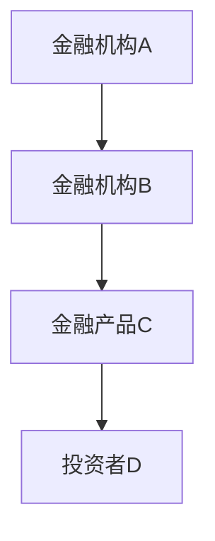
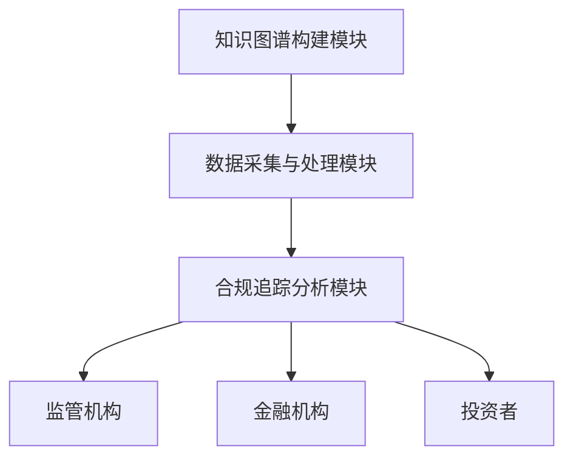

                 


# 《构建基于知识图谱的金融监管合规追踪系统》

> 关键词：知识图谱、金融监管、合规追踪、数据挖掘、人工智能

> 摘要：本文详细探讨了基于知识图谱的金融监管合规追踪系统的构建方法。从问题背景、核心概念到算法原理，再到系统架构设计与项目实战，系统地分析了如何利用知识图谱技术实现金融监管的合规追踪。通过具体案例分析，展示了该系统在金融领域的实际应用价值，并提出了改进建议和未来发展方向。

---

# 第一部分: 背景与核心概念

## 第1章: 问题背景与需求分析

### 1.1 问题背景

#### 1.1.1 金融监管的现状与挑战
金融监管是维护金融市场秩序、保护投资者权益的重要手段。然而，随着金融市场的复杂化和创新化，传统的监管手段逐渐暴露出效率低、覆盖面有限等问题。金融机构之间的关联性增强，金融产品日益复杂，传统的基于规则的监管方式难以应对这些挑战。

#### 1.1.2 合规追踪的痛点与难点
合规追踪是金融监管的重要组成部分，旨在确保金融机构的业务行为符合相关法律法规。然而，现有的合规追踪系统存在以下痛点：
- 数据分散：金融机构的业务数据分布于多个系统中，难以统一管理和分析。
- 关联性低：金融机构之间的业务关系复杂，传统的基于单点的监管方式难以捕捉系统性风险。
- 实时性差：合规追踪需要实时监控，但现有系统难以满足实时性要求。

#### 1.1.3 知识图谱在金融监管中的应用潜力
知识图谱是一种以图结构形式表示知识的工具，能够将分散的数据进行关联，形成一个完整的知识网络。知识图谱在金融监管中的应用可以显著提升合规追踪的效率和准确性，具体表现在：
- 提供全局视角：通过构建金融机构、业务、产品之间的关联关系，帮助监管机构从整体上把握市场动态。
- 实现实时监控：结合流数据处理技术，实时更新知识图谱，支持动态监管需求。
- 支持智能决策：通过图查询和推理，快速定位风险点，辅助监管机构做出决策。

### 1.2 问题描述

#### 1.2.1 金融监管的核心目标
金融监管的核心目标包括：
1. 维护金融市场稳定。
2. 保护投资者权益。
3. 防范系统性金融风险。
4. 促进金融市场公平竞争。

#### 1.2.2 合规追踪的关键需求
合规追踪的关键需求包括：
1. 实时监控金融机构的业务行为。
2. 检测违法违规行为。
3. 评估金融机构的信用风险。
4. 支持监管决策的智能化。

#### 1.2.3 知识图谱在合规追踪中的具体应用
知识图谱在合规追踪中的具体应用包括：
1. 构建金融机构之间的关联网络，识别系统性风险。
2. 分析金融产品的复杂性，评估其潜在风险。
3. 通过图查询技术，快速定位违规行为的关联方。

### 1.3 问题解决思路

#### 1.3.1 知识图谱的基本概念
知识图谱是一种以图结构形式表示知识的工具，由节点和边组成。节点代表实体（如人、机构、产品等），边代表实体之间的关系。

#### 1.3.2 知识图谱在金融监管中的作用
知识图谱在金融监管中的作用包括：
1. 提供全局视角，帮助监管机构理解市场结构。
2. 支持实时监控，实现动态监管。
3. 通过图查询和推理，辅助监管决策。

#### 1.3.3 基于知识图谱的合规追踪系统框架
基于知识图谱的合规追踪系统框架包括：
1. 数据采集与处理模块：负责采集金融机构的业务数据。
2. 知识图谱构建模块：将数据转化为知识图谱。
3. 合规追踪分析模块：通过图查询和推理，检测违规行为。

## 第2章: 核心概念与联系

### 2.1 知识图谱的核心原理

#### 2.1.1 知识图谱的定义与特点
知识图谱的定义：知识图谱是一种以图结构形式表示知识的工具，节点代表实体，边代表实体之间的关系。

知识图谱的特点：
1. 结构化：知识图谱中的实体和关系都是明确定义的。
2. 关联性：通过边将实体连接起来，形成复杂的关联网络。
3. 可扩展性：知识图谱可以根据需求不断扩展。

#### 2.1.2 知识图谱的构建流程
知识图谱的构建流程包括：
1. 数据采集：从多个数据源采集数据。
2. 数据清洗：对数据进行去重、标准化处理。
3. 实体识别：识别数据中的实体。
4. 关系抽取：抽取实体之间的关系。
5. 知识融合：将多个数据源的数据融合到一个知识图谱中。
6. 知识表示：将知识图谱表示为图结构。

#### 2.1.3 知识图谱的存储与表示
知识图谱的存储与表示方法：
1. 图数据库：如Neo4j，支持高效的图查询。
2. RDF三元组：使用主语-谓词-宾语的形式表示知识。
3. 邻接矩阵：适用于小规模图的表示。

### 2.2 金融监管与知识图谱的关系

#### 2.2.1 金融监管的核心要素
金融监管的核心要素包括：
1. 监管对象：金融机构、金融产品、市场参与者。
2. 监管规则：法律法规、行业标准。
3. 监管目标：维护市场稳定、保护投资者权益。

#### 2.2.2 知识图谱在金融监管中的应用场景
知识图谱在金融监管中的应用场景包括：
1. 机构关联分析：通过知识图谱分析金融机构之间的关联关系，识别系统性风险。
2. 产品风险评估：通过分析金融产品的复杂性，评估其潜在风险。
3. 违规行为检测：通过图查询和推理，快速定位违规行为的关联方。

#### 2.2.3 知识图谱与合规追踪的结合
知识图谱与合规追踪的结合方式：
1. 构建合规追踪知识图谱：将金融机构的业务行为、产品信息等数据转化为知识图谱。
2. 实现实时监控：通过流数据处理技术，实时更新知识图谱。
3. 支持智能决策：通过图查询和推理，辅助监管机构做出决策。

### 2.3 实体关系与属性分析

#### 2.3.1 实体关系的定义与分类
实体关系的定义：实体之间的关系是通过边表示的，可以是直接关系或间接关系。

实体关系的分类：
1. 一对一关系：如“机构A收购机构B”。
2. 一对多关系：如“机构A发行产品P1、P2、P3”。
3. 多对多关系：如“机构A和机构B共同发行产品P”。

#### 2.3.2 知识图谱的实体关系图
知识图谱的实体关系图可以通过Mermaid绘制：



#### 2.3.3 实体属性的对比分析
实体属性的对比分析：
1. 实体类型：如机构、产品、投资者。
2. 实体属性：如机构的注册资本、产品的风险等级。
3. 关系类型：如收购、发行、持有。

---

# 第二部分: 算法原理与数学模型

## 第3章: 知识图谱构建算法

### 3.1 知识抽取与表示

#### 3.1.1 实体识别算法
实体识别算法包括：
1. 基于规则的实体识别：通过预定义的规则识别实体。
2. 基于统计的实体识别：通过统计方法识别实体。
3. 基于深度学习的实体识别：如使用LSTM进行序列标注。

#### 3.1.2 关系抽取算法
关系抽取算法包括：
1. 基于规则的关系抽取：通过预定义的模板匹配关系。
2. 基于统计的关系抽取：通过统计方法学习关系。
3. 基于深度学习的关系抽取：如使用卷积神经网络（CNN）或Transformer模型。

#### 3.1.3 知识表示方法
知识表示方法包括：
1. RDF表示：使用主语-谓词-宾语形式表示知识。
2. 图嵌入表示：如Node2Vec，将节点表示为向量。

### 3.2 知识融合与推理

#### 3.2.1 知识融合的原理
知识融合的原理包括：
1. 数据清洗：去除重复数据和噪声数据。
2. 数据对齐：将不同数据源中的实体对齐。
3. 数据合并：将对齐后的数据合并到一个知识图谱中。

#### 3.2.2 基于图的推理算法
基于图的推理算法包括：
1. 最短路径算法：用于查找两个实体之间的最短路径。
2. PageRank算法：用于评估实体的重要性。
3. 共同邻居算法：用于查找两个实体的共同邻居。

#### 3.2.3 知识图谱的动态更新
知识图谱的动态更新方法包括：
1. 增量式更新：只更新新增数据。
2. 全量式更新：重新构建知识图谱。
3. 实时更新：通过流数据处理技术实时更新知识图谱。

## 第4章: 知识图谱的相似度计算

### 4.1 向量空间模型

#### 4.1.1 向量空间模型的定义
向量空间模型将文本表示为向量空间中的点，通过向量的相似度计算文本的相似度。

#### 4.1.2 余弦相似度公式
余弦相似度公式：
$$ \text{余弦相似度} = \frac{\vec{A} \cdot \vec{B}}{|\vec{A}| \cdot |\vec{B}|} $$

#### 4.1.3 余弦相似度的应用
余弦相似度的应用包括：
1. 文本相似度计算。
2. 图节点相似度计算。

### 4.2 Word2Vec与GloVe模型

#### 4.2.1 Word2Vec的训练原理
Word2Vec的训练原理包括：
1. Skip-Gram模型：通过目标词预测上下文词。
2. CBOW模型：通过上下文词预测目标词。

#### 4.2.2 GloVe的词向量表示方法
GloVe的词向量表示方法：
1. 基于全局词表统计词频。
2. 使用矩阵分解技术得到词向量。

#### 4.2.3 模型的优缺点对比
模型的优缺点对比：
- Word2Vec优点：训练速度快，适合处理小规模数据。
- Word2Vec缺点：无法直接处理大规模数据。
- GloVe优点：适合处理大规模数据，能够捕捉全局语义信息。
- GloVe缺点：训练时间较长。

### 4.3 基于图的相似度计算

#### 4.3.1 图的最短路径算法
图的最短路径算法包括：
1. BFS算法：适用于无权图。
2. Dijkstra算法：适用于有权图。

#### 4.3.2 基于PageRank的相似度计算
PageRank算法用于评估图中节点的重要性，常用于网页排名。

#### 4.3.3 基于共同邻居的相似度计算
共同邻居算法用于查找图中两个节点的共同邻居数量。

---

# 第三部分: 系统架构与设计

## 第5章: 系统架构设计方案

### 5.1 系统应用场景

#### 5.1.1 金融监管的典型场景
金融监管的典型场景包括：
1. 机构关联分析：分析金融机构之间的关联关系。
2. 产品风险评估：评估金融产品的风险等级。
3. 违规行为检测：检测金融机构的违规行为。

#### 5.1.2 合规追踪的具体需求
合规追踪的具体需求包括：
1. 实时监控：实时跟踪金融机构的业务行为。
2. 关联分析：分析金融机构之间的关联关系。
3. 智能决策：通过图查询和推理辅助决策。

#### 5.1.3 系统的用户角色与权限
系统的用户角色与权限包括：
1. 监管机构：拥有最高权限，可以查看所有数据。
2. 金融机构：可以查看自身的业务数据。
3. 投资者：可以查看金融产品的相关信息。

### 5.2 系统功能设计

#### 5.2.1 知识图谱构建模块
知识图谱构建模块包括：
1. 数据采集：从多个数据源采集数据。
2. 数据清洗：对数据进行去重、标准化处理。
3. 实体识别：识别数据中的实体。
4. 关系抽取：抽取实体之间的关系。
5. 知识融合：将多个数据源的数据融合到一个知识图谱中。

#### 5.2.2 数据采集与处理模块
数据采集与处理模块包括：
1. 数据源管理：管理数据源的配置信息。
2. 数据采集：从数据源采集数据。
3. 数据清洗：对数据进行去重、标准化处理。
4. 数据存储：将数据存储到数据库中。

#### 5.2.3 合规追踪分析模块
合规追踪分析模块包括：
1. 图查询：通过图查询技术快速定位违规行为。
2. 图推理：通过图推理技术辅助决策。
3. 风险评估：评估金融产品的风险等级。

### 5.3 系统架构图



---

# 第四部分: 项目实战

## 第6章: 项目实战

### 6.1 环境安装

#### 6.1.1 安装Python环境
安装Python环境：
```bash
python --version
pip install --upgrade pip
```

#### 6.1.2 安装依赖库
安装依赖库：
```bash
pip install neo4j
pip install numpy
pip install pandas
pip install scikit-learn
```

### 6.2 核心代码实现

#### 6.2.1 数据采集与处理
数据采集与处理代码：
```python
import neo4j
from neo4j import GraphDatabase
import pandas as pd
import numpy as np

# 连接Neo4j数据库
driver = GraphDatabase.driver("bolt://localhost:7687", auth=("neo4j", "password"))

# 数据清洗
def clean_data(df):
    df.dropna(inplace=True)
    df = df[df['amount'] > 0]
    return df

# 数据处理
data = pd.read_csv('transactions.csv')
data = clean_data(data)

# 数据存储
def store_data(tx, data):
    for _, row in data.iterrows():
        tx.run("CREATE (a:Transaction {id: {id}, amount: {amount})".format(id=row['id'], amount=row['amount']))

with driver.session() as session:
    session.write_transaction(store_data, data)
```

#### 6.2.2 知识图谱构建
知识图谱构建代码：
```python
from neo4j.exceptions import CypherError

# 实体识别
def identify_entities(tx, data):
    entities = []
    for _, row in data.iterrows():
        entities.append(row['id'])
    return entities

# 关系抽取
def extract_relationships(tx, data):
    relationships = []
    for _, row in data.iterrows():
        relationships.append((row['from_id'], 'transfers_to', row['to_id']))
    return relationships

# 知识融合
def merge_data(tx, entities, relationships):
    tx.run("LOAD CSV WITH HEADERS FROM 'transactions.csv' AS row CREATE (:Transaction {id: row.id, amount: row.amount})")
    for rel in relationships:
        tx.run("MATCH (a {{ id: {0} }}) MATCH (b {{ id: {1} }}) CREATE (a)-[r:TRANSFER]->(b)".format(rel[0], rel[2]))

with driver.session() as session:
    session.write_transaction(identify_entities, data)
    session.write_transaction(extract_relationships, data)
    session.write_transaction(merge_data, entities, relationships)
```

### 6.3 代码应用解读与分析

#### 6.3.1 数据采集与处理
数据采集与处理代码解读：
- 使用Neo4j数据库存储数据。
- 数据清洗包括去重和过滤。
- 数据存储到数据库中。

#### 6.3.2 知识图谱构建
知识图谱构建代码解读：
- 实体识别：从数据中提取实体。
- 关系抽取：抽取实体之间的关系。
- 知识融合：将实体和关系存储到知识图谱中。

### 6.4 实际案例分析

#### 6.4.1 案例背景
案例背景：假设我们有多个金融机构，需要分析它们之间的关联关系。

#### 6.4.2 案例分析
案例分析：
```python
# 图查询
query = """
    MATCH (a:金融机构)-[r:TRANSFER]->(b:金融机构)
    RETURN a.name, r.amount, b.name
"""
result = driver.session().run(query)
for record in result:
    print(record['a.name'], record['r.amount'], record['b.name'])
```

#### 6.4.3 案例结果
案例结果：输出金融机构之间的转移关系和金额。

### 6.5 项目小结

#### 6.5.1 项目总结
通过本项目，我们成功构建了一个基于知识图谱的金融监管合规追踪系统。

#### 6.5.2 项目优缺点
- 优点：实现了金融机构之间的关联分析，支持实时监控。
- 缺点：数据采集和处理的效率有待提高。

---

# 第五部分: 最佳实践与小结

## 第7章: 最佳实践与小结

### 7.1 最佳实践

#### 7.1.1 数据处理
- 数据清洗：去除重复数据和噪声数据。
- 数据标准化：统一数据格式。

#### 7.1.2 知识图谱构建
- 实体识别：使用深度学习模型提高准确率。
- 关系抽取：结合上下文信息提高准确性。

#### 7.1.3 系统优化
- 系统架构：采用分布式架构提高性能。
- 数据存储：使用高效的数据库存储结构。

### 7.2 小结

#### 7.2.1 本文总结
本文详细探讨了基于知识图谱的金融监管合规追踪系统的构建方法，从问题背景到系统架构设计，再到项目实战，系统地分析了该系统的实现过程。

#### 7.2.2 未来发展方向
未来发展方向包括：
1. 提高数据处理效率：采用分布式计算技术。
2. 提升系统性能：优化图查询和推理算法。
3. 扩展应用场景：将知识图谱技术应用到更多领域。

---

# 作者：AI天才研究院/AI Genius Institute & 禅与计算机程序设计艺术 /Zen And The Art of Computer Programming

