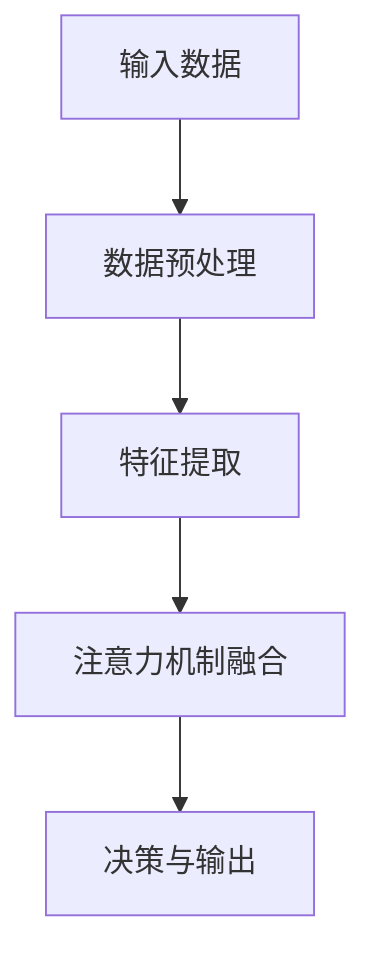
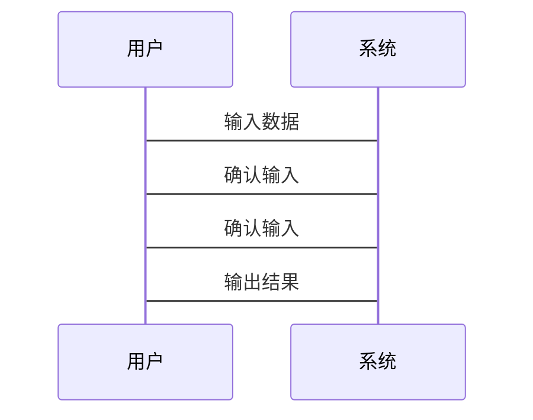

                 


# 注意力机制在AI Agent多模态融合中的应用

> 关键词：注意力机制、AI Agent、多模态融合、深度学习、计算机视觉、自然语言处理

> 摘要：注意力机制作为一种强大的序列建模工具，已经在自然语言处理和计算机视觉领域取得了巨大成功。然而，随着AI Agent对多模态数据处理需求的增加，注意力机制在多模态数据融合中的应用也逐渐成为研究热点。本文将从注意力机制的基本概念出发，深入分析其在AI Agent多模态融合中的应用背景、核心原理、系统架构以及实际应用案例，最后总结注意力机制在多模态融合中的优势与挑战。

---

# 第一部分: 注意力机制与AI Agent概述

## 第1章: 注意力机制的基本概念

### 1.1 注意力机制的起源与发展

#### 1.1.1 注意力机制的起源
注意力机制最初起源于认知科学领域，用于解释人类在信息处理过程中对外界信息的 selective attention 现象。在计算机科学领域，注意力机制的首次大规模应用是在自然语言处理领域，特别是在2014年提出的 Transformer 模型中。

#### 1.1.2 注意力机制在AI领域的应用
注意力机制在AI领域的应用可以分为以下几个阶段：
1. **早期探索阶段**：注意力机制在模式识别和计算机视觉中的初步尝试。
2. **深度学习阶段**：注意力机制在神经网络中的应用逐渐成熟。
3. **多模态应用阶段**：注意力机制开始在多模态数据融合中发挥作用。

#### 1.1.3 注意力机制的核心思想与特点
注意力机制的核心思想是通过引入注意力权重，将输入数据的重要性进行加权，从而聚焦于关键信息。其特点包括：
- **自适应性**：能够根据输入数据自动调整注意力权重。
- **可解释性**：通过注意力权重矩阵，可以直观地理解模型的决策过程。
- **高效性**：通过并行计算和稀疏性优化，注意力机制在计算效率上具有优势。

### 1.2 AI Agent的基本概念

#### 1.2.1 AI Agent的定义与分类
AI Agent（人工智能代理）是指能够感知环境、自主决策并采取行动的智能体。根据功能和应用场景的不同，AI Agent可以分为以下几类：
- **简单反射型AI Agent**：基于简单的规则进行反应，如PID控制器。
- **基于模型的AI Agent**：通过建立环境模型进行决策，如强化学习中的智能体。
- **基于学习的AI Agent**：通过机器学习算法训练出的智能体，如AlphaGo。

#### 1.2.2 AI Agent的核心特征
AI Agent的核心特征包括：
- **自主性**：能够在没有外部干预的情况下自主运行。
- **反应性**：能够实时感知环境并做出反应。
- **目标导向性**：具有明确的目标，并能够采取行动以实现目标。
- **学习能力**：能够通过与环境的交互不断优化自身的决策策略。

### 1.3 多模态数据融合的挑战与意义

#### 1.3.1 多模态数据的定义与特点
多模态数据是指来自不同感知模态（如视觉、听觉、语言等）的数据。多模态数据的特点包括：
- **异构性**：不同模态的数据具有不同的表示形式和特征。
- **互补性**：不同模态的数据能够互相补充，提供更全面的信息。
- **复杂性**：多模态数据的融合需要解决不同模态之间的语义对齐和特征匹配问题。

#### 1.3.2 多模态数据融合的挑战
多模态数据融合的主要挑战包括：
- **数据异构性**：不同模态的数据具有不同的表示形式，难以直接进行融合。
- **数据冗余**：不同模态的数据可能存在冗余信息，导致计算效率低下。
- **计算复杂度**：多模态数据的融合通常涉及大量的计算，尤其是在大规模数据的情况下，计算复杂度较高。

#### 1.3.3 多模态数据融合的意义
多模态数据融合的意义在于：
- **提高决策的准确性**：通过融合不同模态的数据，可以提供更全面的信息支持决策。
- **增强系统的鲁棒性**：单一模态数据可能存在的噪声或不确定性可以通过其他模态的数据进行补偿。
- **提升用户体验**：多模态数据融合可以提供更丰富、更个性化的用户体验。

### 1.4 注意力机制在多模态融合中的应用背景

#### 1.4.1 多模态数据融合的主流方法
多模态数据融合的主流方法包括：
- **基于统计的方法**：如主成分分析（PCA）和线性回归。
- **基于深度学习的方法**：如卷积神经网络（CNN）和循环神经网络（RNN）。
- **基于注意力机制的方法**：通过引入注意力权重，对不同模态的数据进行自适应的加权融合。

#### 1.4.2 注意力机制在多模态融合中的优势
注意力机制在多模态融合中的优势包括：
- **自适应性**：能够根据输入数据自动调整注意力权重，适应不同的输入模态。
- **可解释性**：通过注意力权重矩阵，可以直观地理解模型的决策过程。
- **高效性**：通过并行计算和稀疏性优化，注意力机制在计算效率上具有优势。

---

## 第2章: 多模态数据融合的系统架构与实现

### 2.1 系统功能需求分析

#### 2.1.1 数据输入接口
多模态数据融合系统需要支持多种数据输入接口，包括：
- **文本输入**：如自然语言文本。
- **图像输入**：如RGB图像或深度图像。
- **语音输入**：如音频信号。

#### 2.1.2 数据处理模块
数据处理模块负责对输入数据进行预处理，包括：
- **文本处理**：如分词、词向量化。
- **图像处理**：如图像增强、特征提取。
- **语音处理**：如降噪、特征提取。

#### 2.1.3 数据融合模块
数据融合模块负责将不同模态的数据进行融合，生成最终的输出结果。

### 2.2 系统架构设计

#### 2.2.1 系统功能设计
多模态数据融合系统的功能设计包括：
- **数据输入与预处理**：接收多种模态的数据并进行预处理。
- **特征提取与表示**：将不同模态的数据转换为统一的特征表示。
- **注意力机制融合**：通过注意力机制对不同模态的特征进行加权融合。
- **决策与输出**：根据融合后的特征进行决策并输出结果。

#### 2.2.2 系统架构图


### 2.3 系统交互设计

#### 2.3.1 系统交互流程
多模态数据融合系统的交互流程包括：
1. **数据输入**：用户输入多种模态的数据。
2. **数据预处理**：系统对输入数据进行预处理。
3. **特征提取**：系统将预处理后的数据转换为特征表示。
4. **注意力机制融合**：系统通过注意力机制对不同模态的特征进行加权融合。
5. **决策与输出**：系统根据融合后的特征进行决策并输出结果。

#### 2.3.2 系统交互序列图


---

## 第3章: 多模态注意力机制的数学模型与算法实现

### 3.1 多模态注意力机制的数学模型

#### 3.1.1 注意力权重计算公式
$$
\text{score}(i, j) = \text{softmax}(\frac{Q_i K_j^T}{\sqrt{d}})
$$
其中，$Q$ 是查询矩阵，$K$ 是键矩阵，$d$ 是特征维度。

#### 3.1.2 多模态注意力机制的融合公式
$$
\text{output}_i = \sum_{j=1}^{n} \alpha_{ij} V_j
$$
其中，$\alpha_{ij}$ 是注意力权重，$V_j$ 是值向量。

### 3.2 多模态注意力机制的算法实现

#### 3.2.1 算法实现步骤
1. **输入数据预处理**：将输入的多模态数据转换为统一的特征表示。
2. **查询、键、值的计算**：根据输入特征计算查询矩阵 $Q$、键矩阵 $K$ 和值矩阵 $V$。
3. **注意力权重计算**：通过 softmax 函数计算注意力权重。
4. **特征融合**：通过注意力权重对值向量进行加权求和，得到最终的融合结果。

#### 3.2.2 算法实现代码示例
```python
import torch
import torch.nn as nn

class MultiModalAttention(nn.Module):
    def __init__(self, embed_dim, num_heads):
        super(MultiModalAttention, self).__init__()
        self.num_heads = num_heads
        self.embed_dim = embed_dim
        self.key_dim = embed_dim // num_heads
        self.query_layer = nn.Linear(embed_dim, embed_dim)
        self.key_layer = nn.Linear(embed_dim, embed_dim)
        self.value_layer = nn.Linear(embed_dim, embed_dim)
        self.softmax = nn.Softmax(dim=-1)

    def forward(self, inputs):
        # 输入：[batch_size, seq_len, embed_dim]
        batch_size = inputs.size(0)
        seq_len = inputs.size(1)
        embed_dim = inputs.size(2)

        # 计算查询、键、值
        query = self.query_layer(inputs).view(batch_size, seq_len, self.num_heads, -1)
        key = self.key_layer(inputs).view(batch_size, seq_len, self.num_heads, -1)
        value = self.value_layer(inputs).view(batch_size, seq_len, self.num_heads, -1)

        # 计算注意力权重
        attention = (query * key).sum(dim=-1) / (self.key_dim ** 0.5)
        attention = self.softmax(attention)

        # 特征融合
        output = (attention.unsqueeze(-1) * value).sum(dim=-2)
        output = output.view(batch_size, seq_len, embed_dim)

        return output
```

---

## 第4章: 注意力机制在多模态融合中的实际应用

### 4.1 多模态数据融合的实际案例

#### 4.1.1 文本与图像融合的案例
在自然语言处理和计算机视觉领域，文本与图像的融合可以通过注意力机制实现。例如，在图像描述生成任务中，可以通过注意力机制将图像特征与文本特征进行融合，生成更准确的图像描述。

#### 4.1.2 语音与图像融合的案例
在语音识别和图像识别领域，语音与图像的融合可以通过注意力机制实现。例如，在语音辅助图像识别任务中，可以通过注意力机制将语音特征与图像特征进行融合，提高图像识别的准确率。

### 4.2 注意力机制在多模态融合中的优势

#### 4.2.1 提高模型的表达能力
通过引入注意力机制，模型可以更好地捕捉不同模态数据之间的关联性，提高模型的表达能力。

#### 4.2.2 增强模型的可解释性
注意力机制通过引入注意力权重，可以直观地解释模型的决策过程，增强模型的可解释性。

#### 4.2.3 提高模型的计算效率
通过并行计算和稀疏性优化，注意力机制在计算效率上具有优势，可以降低模型的计算复杂度。

---

## 第5章: 总结与展望

### 5.1 总结
注意力机制作为一种强大的序列建模工具，已经在自然语言处理和计算机视觉领域取得了巨大成功。随着AI Agent对多模态数据处理需求的增加，注意力机制在多模态数据融合中的应用也逐渐成为研究热点。

### 5.2 展望
未来，随着深度学习技术的不断发展，注意力机制在多模态数据融合中的应用将更加广泛。特别是在以下方面：
- **多模态数据的实时处理**：通过优化注意力机制的计算效率，实现多模态数据的实时处理。
- **多模态数据的自适应融合**：通过引入自适应的注意力机制，实现不同模态数据之间的自适应融合。
- **多模态数据的跨领域应用**：将注意力机制应用于更多领域，如医学图像分析、自动驾驶等。

---

## 第6章: 最佳实践与注意事项

### 6.1 最佳实践

#### 6.1.1 注意力机制的实现注意事项
在实现注意力机制时，需要注意以下几点：
- **特征维度的匹配**：确保查询、键和值的维度一致。
- **注意力权重的归一化**：通过 softmax 函数归一化注意力权重，确保权重的和为1。
- **计算效率的优化**：通过并行计算和稀疏性优化，提高计算效率。

#### 6.1.2 多模态数据融合的优化策略
在多模态数据融合中，可以采取以下优化策略：
- **模态间的特征对齐**：通过引入对齐机制，解决不同模态数据之间的语义对齐问题。
- **模态间的特征融合**：通过引入融合网络，实现不同模态数据的特征融合。
- **模态间的权重调整**：通过动态调整不同模态数据的注意力权重，实现自适应的特征融合。

### 6.2 注意事项

#### 6.2.1 模型的可解释性
在实际应用中，需要注意模型的可解释性。通过注意力权重矩阵，可以直观地理解模型的决策过程，增强模型的可解释性。

#### 6.2.2 模型的计算效率
在实际应用中，需要注意模型的计算效率。通过优化注意力机制的计算流程，降低模型的计算复杂度，提高计算效率。

---

## 第7章: 参考文献与拓展阅读

### 7.1 参考文献
1. Vaswani, A., et al. "Attention Is All You Need." arXiv preprint arXiv:1706.03798, 2017.
2. Bahdanau, D., et al. "Neural Machine Translation with Attention." arXiv preprint arXiv:1409.0166, 2014.
3. Zhang, L., et al. "Deep Learning for Computer Vision." arXiv preprint arXiv:1603.07285, 2016.

### 7.2 拓展阅读
1. "Transformers: A Tutorial" (https://towardsdatascience.com/transformers-a-tutorial-8900876139)
2. "Attention Mechanisms in Vision and NLP" (https://arxiv.org/abs/1704.02671)
3. "Multi-Modal Deep Learning: A Survey" (https://arxiv.org/abs/2003.05614)

---

## 作者信息

作者：AI天才研究院/AI Genius Institute  
联系邮箱：contact@aicourse.cn  
官方网站：https://www.aicourse.cn

