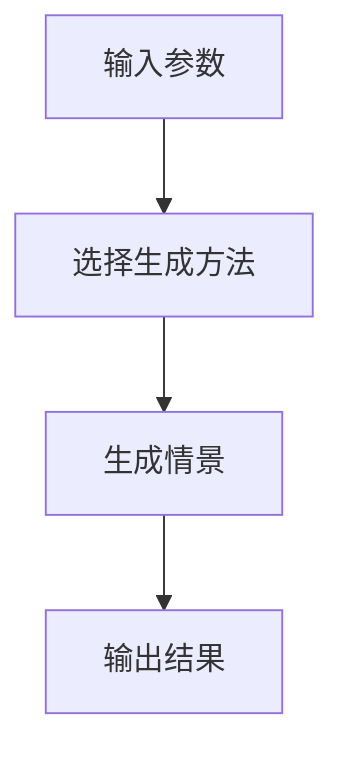
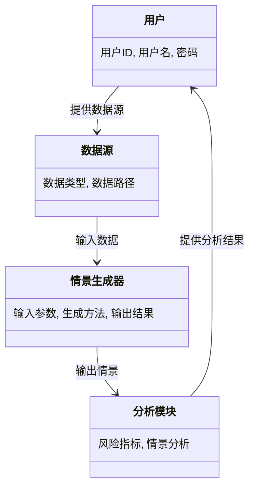
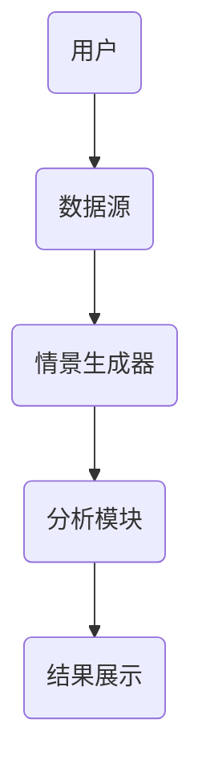
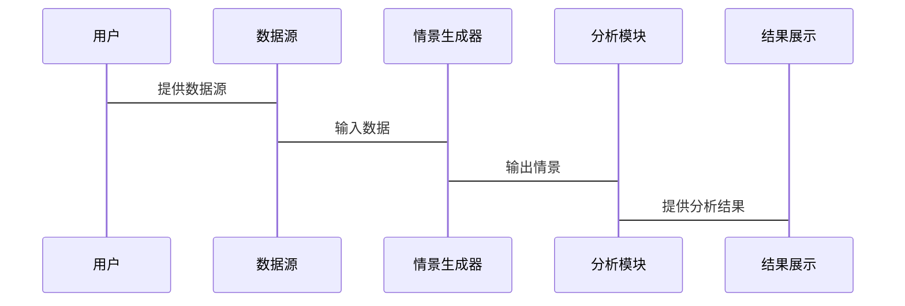

                 


# 金融机构压力测试情景生成器

## 关键词：
压力测试，情景生成器，金融机构，风险管理，蒙特卡洛模拟，时间序列分析

## 摘要：
本文深入探讨了金融机构压力测试情景生成器的设计与实现，从基本概念到核心算法，再到系统架构，全面解析了如何构建高效可靠的金融压力测试工具。通过实际案例和详细代码实现，展示了如何利用蒙特卡洛模拟和时间序列分析等方法生成压力测试情景，帮助金融机构更好地识别和应对潜在风险。

---

# 第1章: 压力测试的重要性与基本概念

## 1.1 金融机构压力测试的背景

### 1.1.1 什么是压力测试
压力测试是一种通过模拟极端市场条件来评估金融机构在不利环境下的财务稳定性和风险承受能力的分析方法。它帮助金融机构识别潜在风险点，并制定应对策略。

### 1.1.2 压力测试的目的与意义
- **目的**：评估金融机构在极端情况下的生存能力，确保其能够在市场波动中保持稳定。
- **意义**：压力测试是金融监管的重要工具，有助于防范系统性风险，保护投资者利益。

### 1.1.3 金融机构面临的挑战
- **数据复杂性**：金融市场数据具有高度波动性和不确定性。
- **模型选择**：如何选择合适的模型和方法来生成真实有效的压力测试情景。
- **计算效率**：大规模数据处理和复杂算法计算需要高效的计算资源。

## 1.2 压力测试情景生成器的基本概念

### 1.2.1 情景生成器的定义
情景生成器是一种用于生成多种压力测试情景的工具，它通过模拟不同市场条件下的资产价格、利率、汇率等变量，帮助金融机构评估其风险敞口。

### 1.2.2 情景生成器的核心功能
- **数据输入**：支持多种数据格式的输入，包括历史数据和实时数据。
- **情景生成**：根据输入参数生成多种压力测试情景。
- **结果输出**：输出情景数据并支持进一步分析。

### 1.2.3 情景生成器的分类与特点
| 类型              | 描述                                                                 |
|-------------------|----------------------------------------------------------------------|
| 基于假设的生成器  | 根据人为设定的极端假设生成情景（如市场崩盘、经济衰退）。          |
| 基于统计的生成器  | 利用统计模型（如蒙特卡洛模拟）生成情景，模拟市场的真实波动性。      |
| 基于历史的生成器  | 使用历史数据中的极端事件生成情景，提供可参考的真实案例。          |

---

# 第2章: 压力测试的基本流程与方法

## 2.1 压力测试的基本流程

### 2.1.1 测试目标设定
- 确定压力测试的目标，如评估资产组合在极端市场波动下的表现。

### 2.1.2 数据收集与分析
- 收集历史市场数据、资产价格、利率等信息。
- 分析数据的分布特征和相关性。

### 2.1.3 情景设计与生成
- 根据测试目标设计情景参数。
- 使用生成器生成多种压力测试情景。

### 2.1.4 模拟测试与结果分析
- 在生成的情景下运行压力测试，分析金融机构的财务状况。
- 根据结果制定风险应对策略。

## 2.2 压力测试的主要方法

### 2.2.1 假设分析法
- **定义**：基于人为假设的极端市场条件（如市场下跌30%）生成情景。
- **优点**：简单直观，适用于特定假设的测试。
- **缺点**：缺乏数据支持，可能不够现实。

### 2.2.2 蒙特卡洛模拟法
- **定义**：通过随机抽样和概率分布模拟市场波动，生成大量可能的情景。
- **优点**：能够模拟复杂市场条件，提供全面的风险评估。
- **缺点**：计算复杂，需要大量计算资源。

### 2.2.3 历史情景法
- **定义**：使用历史上的极端事件（如2008年金融危机）生成情景。
- **优点**：基于真实数据，具有现实参考价值。
- **缺点**：无法模拟未发生过的新极端事件。

### 2.2.4 情景组合法
- **定义**：将多种情景组合，生成综合测试情景。
- **优点**：能够覆盖更多潜在风险点。
- **缺点**：需要大量历史数据和计算资源。

---

# 第3章: 金融机构压力测试的核心概念

## 3.1 情景生成器的核心概念

### 3.1.1 情景生成器的输入参数
- **市场变量**：如资产价格、利率、汇率等。
- **时间范围**：测试的时间跨度（如1天、1周、1个月）。
- **风险因子**：如波动率、相关性等。

### 3.1.2 情景生成器的输出结果
- **情景数据**：生成的压力测试情景数据。
- **风险指标**：如VaR（在险价值）、信用违约概率等。

### 3.1.3 情景生成器的评估指标
| 指标名称       | 描述                               |
|----------------|------------------------------------|
| 准确性         | 情景与实际市场波动的拟合程度。      |
| 完整性         | 情景是否覆盖了所有潜在风险点。      |
| 可解释性       | 情景生成过程是否透明且易于理解。    |

## 3.2 情景生成器的原理与机制

### 3.2.1 情景生成的逻辑流程


### 3.2.2 情景生成的数学模型
- **蒙特卡洛模拟**：使用概率分布（如正态分布、t分布）生成随机数，模拟市场变量的波动。
- **时间序列分析**：利用ARIMA模型预测未来市场变量的变化。

### 3.2.3 情景生成的算法优化
- **并行计算**：通过并行计算提高生成情景的效率。
- **混合方法**：结合多种生成方法（如蒙特卡洛和历史情景）生成更全面的情景。

---

# 第4章: 压力测试情景生成器的核心算法与实现

## 4.1 基于蒙特卡洛模拟的情景生成算法

### 4.1.1 蒙特卡洛模拟的基本原理
- **定义**：通过随机采样模拟市场变量的分布，生成大量可能的市场情景。
- **步骤**：
  1. 确定市场变量的概率分布。
  2. 生成随机数，模拟市场变量的变化。
  3. 计算资产组合在不同情景下的表现。

### 4.1.2 蒙特卡洛模拟的实现代码
```python
import numpy as np

# 示例：生成资产价格的蒙特卡洛模拟
def monte_carlo_simulation(prices, num_simulations=1000, days=30):
    # 假设资产价格服从几何布朗运动
    mu = np.mean(prices)
    sigma = np.std(prices)
    dt = 1  # 时间步长（天）

    simulated_prices = np.zeros((len(prices), num_simulations))
    for i in range(num_simulations):
        # 生成随机数
        random_seed = np.random.rand(len(prices))
        # 计算价格变化
        simulated_prices[:, i] = prices * np.exp((mu - 0.5 * sigma**2) * dt + sigma * np.sqrt(dt) * np.random.randn(len(prices)))
    
    return simulated_prices

# 示例使用
prices = [100, 105, 110]
simulated_prices = monte_carlo_simulation(prices)
print(simulated_prices)
```

### 4.1.3 蒙特卡洛模拟的数学模型
$$
S_t = S_0 \exp\left((\mu - \frac{\sigma^2}{2})t + \sigma \sqrt{t} Z\right)
$$
其中，$Z$ 为标准正态分布随机数。

---

## 4.2 基于时间序列分析的情景生成算法

### 4.2.1 时间序列分析的基本原理
- **定义**：利用历史数据的模式和趋势预测未来市场变量的变化。
- **常用模型**：ARIMA（自回归积分滑动平均模型）。

### 4.2.2 时间序列分析的实现代码
```python
from statsmodels.tsa.arima_model import ARIMA

# 示例：使用ARIMA模型生成未来价格
def generate_future_prices(data, order=(1, 1, 1), steps=30):
    model = ARIMA(data, order=order)
    model_fit = model.fit()
    forecast = model_fit.forecast(steps)
    return forecast

# 示例使用
data = [100, 105, 110, 115]
forecast = generate_future_prices(data)
print(forecast)
```

### 4.2.3 时间序列分析的数学模型
$$
\phi_0 + \phi_1 y_{t-1} + \dots + \phi_p y_{t-p} = \theta_0 + \theta_1 \epsilon_{t-1} + \dots + \theta_q \epsilon_{t-q} + \epsilon_t
$$

---

# 第5章: 金融机构压力测试系统设计与实现

## 5.1 系统功能设计

### 5.1.1 领域模型设计


### 5.1.2 系统架构设计


### 5.1.3 系统接口设计
- **输入接口**：支持多种数据格式的导入。
- **输出接口**：提供JSON格式的情景数据和分析结果。

### 5.1.4 系统交互流程


---

# 第6章: 项目实战与案例分析

## 6.1 项目环境配置

### 6.1.1 环境要求
- **操作系统**：Linux/Windows/MacOS
- **编程语言**：Python 3.8+
- **依赖库**：numpy, pandas, matplotlib, statsmodels

### 6.1.2 安装依赖
```bash
pip install numpy pandas matplotlib statsmodels
```

## 6.2 核心实现

### 6.2.1 情景生成器实现
```python
import numpy as np
import pandas as pd
from statsmodels.tsa.arima_model import ARIMA

def generate_scenario(data, method='monte_carlo', num_simulations=1000):
    if method == 'monte_carlo':
        return monte_carlo_simulation(data, num_simulations)
    elif method == 'arima':
        return arima_simulation(data)
    else:
        raise ValueError("Invalid method")

def monte_carlo_simulation(data, num_simulations):
    mu = np.mean(data)
    sigma = np.std(data)
    simulated_data = data * np.exp((mu - 0.5 * sigma**2) * 1 + sigma * np.sqrt(1) * np.random.randn(len(data), num_simulations))
    return simulated_data

def arima_simulation(data):
    model = ARIMA(data, order=(1, 1, 1))
    model_fit = model.fit()
    forecast = model_fit.forecast(len(data))
    return forecast

# 示例使用
data = pd.read_csv('market_data.csv')['price'].values
scenario = generate_scenario(data, method='arima')
print(scenario)
```

### 6.2.2 测试案例分析
```python
import matplotlib.pyplot as plt

# 示例：绘制生成的情景
data = pd.read_csv('market_data.csv')['price'].values
scenario = generate_scenario(data, method='monte_carlo', num_simulations=100)

plt.figure(figsize=(10, 6))
plt.plot(data, label='Actual Data')
plt.plot(scenario.mean(axis=1), label='Average Scenario')
plt.fill_between(range(len(data)), scenario.quantile(0.05, axis=1), scenario.quantile(0.95, axis=1), color='blue', alpha=0.2, label='90% Confidence Interval')
plt.legend()
plt.show()
```

---

# 第7章: 总结与展望

## 7.1 小结
金融机构压力测试情景生成器是金融风险管理的重要工具，通过蒙特卡洛模拟和时间序列分析等方法，可以帮助金融机构更好地应对潜在风险。

## 7.2 最佳实践 tips
- **数据质量管理**：确保输入数据的准确性和完整性。
- **模型选择**：根据具体需求选择合适的生成方法。
- **结果验证**：通过回测和验证确保生成的情景合理有效。

## 7.3 注意事项
- **计算资源**：大规模数据处理需要高性能计算资源。
- **模型局限性**：生成的情景可能无法完全覆盖所有潜在风险。

## 7.4 拓展阅读
- 推荐阅读《金融风险管理》和《蒙特卡洛方法在金融中的应用》。

---

# 作者

作者：AI天才研究院/AI Genius Institute & 禅与计算机程序设计艺术 /Zen And The Art of Computer Programming

---

# 结语

金融机构压力测试情景生成器是金融风险管理的核心工具，通过科学的算法和系统的架构设计，能够帮助金融机构在复杂多变的市场环境中保持稳健运营。希望本文能够为读者提供有价值的参考和启发。

